# Design Document: Checklist Photos

## Overview

`checklist-photos` (Spec 19, Sprint 5 — Service Execution) covers **the work itself**: while a service is `IN_PROGRESS` (Spec 17), the Cleaner works through the property's cleaning checklist, marking each task done and attaching before/after photo evidence, so that when the job is finished there is a truthful, structured record of what was completed. That record is the durable fact `service-completion` (Spec 20) settles escrow on and `dispute-system` (Spec 21) uses as evidence.

It is **not a new domain and it invents almost nothing** — it composes patterns already proven in four sibling specs, narrowing each to the checklist case:

1. **Creation is triggered by a durable event, never a synchronous call or a poll.** `checklist-photos` consumes the `service_started` outbox event that Spec 17 emits when a session enters `IN_PROGRESS`, draining it via its **own per-consumer checkpoint** (`consumer_name = 'checklist'`) over Spec 17's `service_outbox` fan-out, and creates the run idempotently. This is the exact `service_outbox` / `service_outbox_consumers` fan-out discipline the Spec 18 video consumer already uses — service-tracking never calls this module, and this module never reads `service_sessions.state` directly.
2. **The checklist snapshot is temporally exact.** The property already carries a Host-defined `checklistItems: string[]` (Spec 5). The snapshot `checklist-photos` uses corresponds exactly to the property's checklist **at the moment the session entered `IN_PROGRESS`**, carried on / referenced by the `service_started` event (captured in Spec 17's transition transaction), never re-read live from the property at consume time. This mirrors the radius/threshold snapshot decisions in Specs 17/18.
3. **Photo bytes live in MinIO, the checklist progress + photo metadata live in PostgreSQL, and bytes never transit the API hot path.** This is the `voice-notes` upload-grant model exactly: a single-use grant binds each server-generated object key to `{ run/task, issued-to Cleaner, expiry }` (possession of a key is never authorization); the Cleaner PUTs directly to MinIO over a short-lived pre-signed URL; finalize re-checks authorization + lifecycle and server-inspects the object.
4. **The private MinIO bucket + a BEFORE DELETE tombstone trigger + a scheduled cleanup job that hard-deletes objects past a retention horizon** mirror the `voice-notes` / `video-verification` storage-cleanup pattern, so a CASCADE never orphans a MinIO object. Evidence retention is **longer** than verification video (a dispute window), but still bounded and configurable.
5. **Finalization emits a durable `checklist_completed` outbox fact** in the same transaction as `run → COMPLETED`, consumed by Spec 20/21. `checklist-photos` never moves money, resolves disputes, or rates the service.

Unlike the verification video, task evidence is **meant to be seen by the Host**: participant-gated pre-signed GET playback is exposed (the Host MAY view evidence). But like every sibling, the durable per-task rows + `GET` reconciliation are the authority; realtime is best-effort and advisory.

**Authority split (kept strict):**
- **PostgreSQL is the source of truth for checklist progress + photo metadata.** The `checklist_runs`/`checklist_tasks`/`checklist_task_photos` rows are durable; they never hold photo bytes and never get a `deleted_at` — a terminal run is an immutable audit fact; only the *photo object* is deleted by retention.
- **MinIO is the source of truth for the photo bytes**, in a private bucket, reached only via short-lived, participant-gated pre-signed URLs bound to single-use upload grants.
- **The checklist snapshot is the source of truth for what the job requires**, taken at session start from the property's `checklistItems`; the live property checklist is advisory after that and never retroactively changes an in-flight run.
- **The session lifecycle owns when checklist work is allowed.** Task completion + photo upload are permitted only while the session is `IN_PROGRESS` (or a defined completion-pending window); a terminal/closed session rejects further checklist mutation.
- **Snapshotted policies own validation.** The task-level photo-required policy, the run-level completion precondition, and max-photos-per-task are frozen on the run at creation; a mid-service config change never re-validates an in-flight run.

This design maps every requirement and correctness invariant (REQ-CP1 … REQ-CP14) to concrete, verifiable properties **P1 … P14** (below), each backed by tests.

### Responsibility Matrix

| Responsibility | Mobile (Cleaner) | Mobile (Host) | NestJS API | MinIO | PostgreSQL | service-tracking |
|---|---|---|---|---|---|---|
| Emit `service_started` (IN_PROGRESS, carries snapshot) | ❌ | ❌ | ❌ | ❌ | ❌ | ✅ (outbox) |
| Consume `service_started`, create run (idempotent) | ❌ | ❌ | ✅ | ❌ | ✅ (source of truth) | ❌ |
| Snapshot property checklist → tasks | ❌ | ❌ | ✅ | ❌ | ✅ | ❌ (carries on event) |
| Mark task done/undone (single-winner, count invariant) | ✅ | ❌ | ✅ | ❌ | ✅ | ❌ |
| Observe progress (read-only) | ❌ | ✅ | ❌ | ❌ | ❌ | ❌ |
| Mint upload grant + pre-signed PUT | ❌ | ❌ | ✅ | ❌ | ✅ (grant) | ❌ |
| Upload photo bytes | ✅ (PUT direct) | ❌ | ❌ | ✅ (store) | ❌ | ❌ |
| Server-inspect object (size/type/dimensions) | ❌ | ❌ | ✅ | ✅ (read) | ❌ | ❌ |
| Mint participant-gated playback GET | ❌ | ❌ | ✅ | ✅ (read) | ❌ | ❌ |
| View evidence photo | ✅ | ✅ | ❌ | ❌ | ❌ | ❌ |
| Finalize checklist → `checklist_completed` | ✅ | ❌ | ✅ (outbox) | ❌ | ✅ | ❌ |
| Force-ABANDONED on offer/session terminal | ❌ | ❌ | ✅ | ❌ | ✅ | ✅ (signal) |
| Retention hard-delete + tombstone drain | ❌ | ❌ | ✅ (jobs) | ✅ (delete) | ✅ | ❌ |
| `GET` reconciliation | ✅ (trigger) | ✅ (trigger) | ✅ (data) | ❌ | ❌ | ❌ |

## Ownership Boundary — checklist-photos vs. service-tracking vs. property vs. Spec 20/21

```
service-tracking (Spec 17)                checklist-photos module (NEW)                   property-management (Spec 5)
  service_outbox: service_started  ──►      ChecklistStartedConsumer                        property.checklistItems[]
   (fan-out source, per-consumer              drains service_started for consumer_name        (Host-authored, up to 30)
    checkpoints; carries the                  = 'checklist' (its OWN checkpoint row)     ◄──── snapshotted AT IN_PROGRESS,
    checklist snapshot)                        → ChecklistRunCreationService                    carried on the event,
                                               .createFromStarted()                             NEVER re-read live
                                              (idempotent, UNIQUE service_session_id)

checklist-photos owns:                      Spec 20 / Spec 21 (downstream)
  checklist_runs / _tasks / _task_photos       consume checklist_completed from
  the count invariant + single-winner run      checklist_outbox via their own checkpoints
  the upload grants (key ≠ credential)
  the private checklist-photos bucket
  retention + tombstone cleanup jobs
  checklist_outbox (completion fact)  ──►    service-completion (Spec 20) settles on it
  offer/session terminal → force-ABANDONED       dispute-system (Spec 21) uses it as evidence
```

- **service-tracking is the source of truth for the start fact + the checklist snapshot.** It emits `service_started` into its `service_outbox` (a fan-out source drained by independent per-consumer checkpoints keyed by `(event_id, consumer_name)`). checklist-photos is the `consumer_name = 'checklist'` consumer: it drains rows it has not yet acked, creates the run, then acks only its own `(event_id, 'checklist')` row — so the Spec 16 notifications consumer acking the same event never starves it, and vice versa. It never reads `service_sessions.state` and never has service-tracking call it.
- **property-management is the source of truth for the checklist template.** The snapshot is copied from the property's `checklistItems` **as of the IN_PROGRESS moment**, carried on the event; checklist-photos never re-reads the live property to build a run's tasks.
- **Spec 20/21 consume** `checklist_completed` from checklist-photos' own `checklist_outbox` via their own checkpoints — the exact durable-outbox contract the siblings use. No business transaction depends on the checklist completing; a checklist-photos failure never rolls back or blocks the start, the service, or the escrow.
- Dependency is one-directional (checklist-photos → `service_outbox` read-only via its checkpoint; → the snapshot on the event; ← offer/session terminal signal). checklist-photos introduces no new coupling into service-tracking or the offer/escrow contracts.

## Architecture

```mermaid
graph TB
    subgraph Mobile["📱 Mobile (Expo / RN)"]
        CleanerScreen["ChecklistScreen (Cleaner)<br/>tasks + before/after capture"]
        HostScreen["ChecklistProgressScreen (Host)<br/>X/Y progress + view evidence"]
        Store["checklist.store.ts (Zustand)"]
        Recorder["usePhotoCapture (expo-image-picker/camera)"]
        Uploader["checklist.api.ts<br/>(request-upload → PUT MinIO → finalize)"]
        Reconcile["reconcile via GET / best-effort realtime"]
    end

    subgraph API["🟩 NestJS API — checklist-photos module"]
        Ctrl["ChecklistController<br/>GET /:sessionId/checklist · POST mark · request-upload · finalize-photo · playback-url · finalize"]
        RunSvc["ChecklistRunService<br/>(run state machine, single-winner)"]
        TaskSvc["ChecklistTaskService<br/>(mark done/undone, count invariant)"]
        PhotoSvc["ChecklistPhotoService<br/>(grant/finalize/playback)"]
        CreateSvc["ChecklistRunCreationService<br/>(createFromStarted, idempotent)"]
        Participation["ChecklistParticipationService<br/>isParticipant() / isCleaner()"]
        Storage["ChecklistStorageService<br/>(minio: presign PUT/GET, inspect, delete)"]
        Repo["ChecklistRepository<br/>(parameterized SQL + outbox)"]
        GrantRepo["ChecklistUploadGrantRepository"]
        DeletionRepo["ChecklistObjectDeletionRepository"]
        StartedConsumer["ChecklistStartedConsumer<br/>(drains service_started, consumer_name='checklist')"]
        TerminalListener["OfferTerminalChecklistListener<br/>(force-ABANDONED)"]
        RetentionJob["RetentionCleanupProcessor<br/>(hard-delete past retention)"]
        TombstoneJob["TombstoneDrainProcessor<br/>(drain PENDING deletions)"]
        RunSweep["StuckRunSweep<br/>(ABANDONED on terminal session)"]
        OutboxCheckpoint["ServiceOutboxConsumerCheckpoint (reused, consumer_name='checklist')"]
    end

    subgraph Infra["🗄️ Infra"]
        PG[("PostgreSQL<br/>checklist_runs · checklist_tasks ·<br/>checklist_task_photos ·<br/>checklist_upload_grants ·<br/>checklist_photo_object_deletions ·<br/>checklist_outbox")]
        Minio[("MinIO<br/>checklist-photos (private)")]
        Redis["Redis + BullMQ<br/>(sweeps, cleanup)"]
        ServiceOutbox[("service_outbox (Spec 17)<br/>+ service_outbox_consumers")]
    end

    subgraph Downstream["Downstream consumers"]
        Completion["service-completion (Spec 20)"]
        Dispute["dispute-system (Spec 21)"]
    end

    Recorder --> CleanerScreen --> Uploader
    CleanerScreen --> Store
    HostScreen --> Store
    Store --> Reconcile
    Uploader -->|"1. request-upload"| Ctrl
    Ctrl --> GrantRepo
    Ctrl --> Storage -->|"presigned PUT"| Minio
    Uploader -->|"2. PUT photo (direct)"| Minio
    Uploader -->|"3. finalize-photo"| Ctrl --> PhotoSvc
    HostScreen -->|"playback-url"| Ctrl --> Storage -->|"presigned GET"| Minio

    ServiceOutbox -->|"service_started fan-out"| StartedConsumer
    StartedConsumer --> OutboxCheckpoint --> ServiceOutbox
    StartedConsumer --> CreateSvc --> Repo

    Ctrl --> RunSvc
    Ctrl --> TaskSvc
    Ctrl --> Participation
    RunSvc --> Repo --> PG
    TaskSvc --> Repo
    PhotoSvc --> Repo
    PhotoSvc --> GrantRepo
    PhotoSvc --> Storage
    Repo -->|"checklist_outbox"| PG
    PG -->|"checklist_completed fan-out"| Completion
    PG -->|"checklist_completed fan-out"| Dispute

    TerminalListener --> RunSvc
    Redis --> RetentionJob --> Storage
    Redis --> TombstoneJob --> DeletionRepo
    TombstoneJob --> Storage
    Redis --> RunSweep --> Repo
```



**Data flow — start → run creation (durable-first, idempotent, own checkpoint, temporally-exact snapshot):**
1. service-tracking commits `ARRIVED → IN_PROGRESS` and, in the same transaction, writes a `service_started` `service_outbox` row that **carries the checklist snapshot** (the property's `checklistItems` as of that transaction) plus `serviceSessionId`/`offerId`/`propertyId`/`hostId`/`cleanerId` (Spec 17, unchanged).
2. `ChecklistStartedConsumer` drains `service_started` rows with **no `service_outbox_consumers` row for `consumer_name = 'checklist'`** (`NOT EXISTS`, ordered by `created_at`, bounded batch), reusing Spec 17's `ServiceOutboxConsumerCheckpoint`. For each it calls `ChecklistRunCreationService.createFromStarted(payload)`, then acks its own `(event_id, 'checklist')` row (`ON CONFLICT DO NOTHING`).
3. `createFromStarted` snapshots the policies from config (`photo_required_policy_snapshot`, `completion_precondition_snapshot`, `max_photos_per_task_snapshot`) and, in ONE transaction: `INSERT ... ON CONFLICT (service_session_id) DO NOTHING` the `checklist_runs` row (`total_tasks` = snapshot length, `completed_tasks = 0`, `state = ACTIVE`), then bulk-inserts the ordered `checklist_tasks` from the **event-carried** snapshot (`task_text` copied, `position` preserved). An empty snapshot creates a zero-task run (never errors). `UNIQUE service_session_id` guarantees at most one run; a redelivered event (or a re-drained-but-unacked row) is a no-op.

**Data flow — mark task (IN_PROGRESS only, single-winner, count invariant):**
1. Cleaner POSTs `POST /service-sessions/:id/checklist/tasks/:taskId { done }`.
2. `ChecklistController` authorizes the caller as the session's **Cleaner** (Host is read-only) and asserts the run is `ACTIVE` and the session is in the allowed window (else `409`).
3. `ChecklistTaskService` performs the mutation in one transaction that both sets `is_done`/`completed_at` and keeps `completed_tasks` consistent, under a row lock on the run (`SELECT ... FOR UPDATE`) or an equivalent atomic recompute, so that after every committed mutation — including concurrent mutations of different tasks in the same run — `completed_tasks == COUNT(*) WHERE is_done = true` with no lost updates. The toggle is idempotent per final state (marking done twice yields one done task, not a corrupted counter).
4. Progress MAY be best-effort published for the Host; a dropped frame never loses a durable task (recoverable via `GET`).

**Data flow — photo evidence (grant-gated, key ≠ credential, bytes never on the hot path):**
1. Cleaner captures → `POST /service-sessions/:id/checklist/tasks/:taskId/photo/request-upload`. The server authorizes the caller as the Cleaner AND asserts run `ACTIVE` + IN_PROGRESS window AND `COUNT(photos for task) < max_photos_per_task_snapshot` (else `409`), then IN ORDER: generates an opaque `object_key`; **persists the grant `{ objectKey, runId, taskId, issuedToUserId=Cleaner, status=ISSUED, expiresAt }` FIRST**; mints a short-lived pre-signed PUT for that one key; returns `{ objectKey, uploadUrl, expiresAt }`.
2. Cleaner PUTs the photo directly to MinIO (the API never sees the bytes).
3. `POST .../photo/finalize` **re-evaluates authorization and lifecycle at finalize time** (not only at request-upload) inside a transaction: verify the grant (exists, `issuedTo` = caller, matching run/task, unexpired, `status = ISSUED`) AND the run is still `ACTIVE` and the session still in the allowed window; server-inspect the object (exists, real `size ≤ max`, content-type an allowed image, dimensions probed — server-authoritative; client metadata advisory); insert `checklist_task_photos` (`kind` ∈ `BEFORE/AFTER/GENERAL`); mark the grant `CONSUMED`. A finalize arriving after the run is `COMPLETED`/`ABANDONED` → `409`, nothing persisted; invalid grant → `403`/`409`; over-limit/wrong-type/unprobeable object → `400`, grant left unconsumed (cleanup-eligible orphan).

**Data flow — playback (participant-gated, key resolved server-side):**
1. A participant (Host or Cleaner) GETs `.../photo/:photoId/playback-url`.
2. The server authorizes the caller as a session participant, resolves `object_key` from the DB by `photoId` (never a client-supplied key), and mints a fresh short-lived pre-signed GET. Unlike the verification video, task evidence is meant to be seen by the Host.

**Data flow — finalize checklist (durable completion fact, single-winner terminality):**
1. Cleaner POSTs `POST /service-sessions/:id/checklist/finalize`.
2. `ChecklistRunService` evaluates the run's **snapshotted** `completion_precondition` (e.g. required tasks done, required photos present per the snapshotted photo-required policy) against the durable rows — never a live config value. Unmet → rejected with a clear reason, run stays `ACTIVE`.
3. Met → single-winner `ACTIVE → COMPLETED` (`UPDATE ... WHERE id=:id AND state='ACTIVE'`), stamp completion, and write a `checklist_completed { runId, serviceSessionId, totalTasks, completedTasks, photoCount }` `checklist_outbox` row in the SAME transaction.
4. If the offer/session emits its officially-defined terminal event before finalize, `OfferTerminalChecklistListener.forceAbandonForSession()` idempotently single-winner `ACTIVE → ABANDONED`. Finalize racing a terminal resolves to exactly one of `COMPLETED`/`ABANDONED` (never both) via the conditional writes; the loser observes rows=0 and no-ops.

**Data flow — completion fan-out:** `checklist_outbox` rows are drained by Spec 20 (settlement) and Spec 21 (dispute evidence) via their own per-consumer checkpoints; the row carries no shared processing marker.

## Components and Interfaces

### Backend — checklist-photos module (`services/api/src/checklist-photos/`)

```
services/api/src/checklist-photos/
├── checklist-photos.module.ts
├── checklist.controller.ts
├── checklist.types.ts
├── checklist.constants.ts
├── config/
│   └── validate-checklist-photos-config.ts
├── service/
│   ├── checklist-run.service.ts             # run state machine (finalize / abandon)
│   ├── checklist-task.service.ts            # mark done/undone + count invariant
│   ├── checklist-photo.service.ts           # grant / finalize / playback
│   ├── checklist-run-creation.service.ts    # createFromStarted (idempotent)
│   └── checklist-participation.service.ts   # isParticipant / isCleaner
├── storage/
│   └── checklist-storage.service.ts         # minio: presign PUT/GET, inspect, delete
├── repository/
│   ├── checklist.repository.ts              # single-winner writes + outbox
│   ├── checklist-upload-grant.repository.ts
│   └── checklist-object-deletion.repository.ts
├── consumers/
│   └── checklist-started.consumer.ts        # drains service_started (consumer_name='checklist')
├── listeners/
│   └── offer-terminal-checklist.listener.ts # force-ABANDONED
├── jobs/
│   ├── retention-cleanup.processor.ts       # hard-delete past retention
│   ├── tombstone-drain.processor.ts         # drain PENDING object deletions
│   └── stuck-run-sweep.processor.ts         # ABANDONED on terminal session
├── dto/
│   ├── mark-task.dto.ts
│   ├── request-photo-upload.dto.ts
│   └── finalize-photo.dto.ts
├── entities/
│   ├── checklist-run.entity.ts
│   ├── checklist-task.entity.ts
│   └── checklist-task-photo.entity.ts
├── __tests__/  (see Testing Strategy)
└── README.md
```

**`ChecklistRunCreationService`** — idempotent creation off the `service_started` fact.
- `createFromStarted(payload)` — snapshot policies from config; in ONE transaction `INSERT ... ON CONFLICT (service_session_id) DO NOTHING` the run then bulk-insert ordered tasks from the **event-carried** snapshot (never a live property read). Never throws into the consumer batch (per-row try/catch); a creation failure never touches the already-committed start. Empty snapshot ⇒ zero-task ACTIVE run.

**`ChecklistTaskService`** — the count-invariant task mutation.
- `markTask(sessionId, userId, taskId, done)` — assert caller is the Cleaner AND run `ACTIVE` + session in the allowed window (else `409`); one transaction under a run row-lock (`SELECT ... FOR UPDATE`) that sets `is_done`/`completed_at` and recomputes `completed_tasks = COUNT(is_done=true)`, so no concurrent mutation of another task in the same run loses an update. Idempotent per final state.
- Functions ≤30 lines, SRP.

**`ChecklistPhotoService`** — evidence upload/finalize/playback (voice-notes model).
- `requestUpload(sessionId, userId, taskId)` — assert Cleaner + run `ACTIVE` + window + `photoCount < max_photos_per_task_snapshot`; persist grant FIRST, then mint pre-signed PUT; return `{ objectKey, uploadUrl, expiresAt }`.
- `finalizeUpload(sessionId, userId, taskId, dto)` — transaction: re-verify grant AND run-lifecycle (re-checked at finalize, not only at request-upload); server-inspect object (authoritative); insert `checklist_task_photos`; consume grant. `409` if run terminal by finalize time; `400` on bad object; `403`/`409` on bad grant.
- `getPlaybackUrl(sessionId, userId, photoId)` — participant-gated; resolve `object_key` from DB by `photoId`; mint fresh short-lived pre-signed GET.

**`ChecklistRunService`** — the run state machine.
- `finalize(sessionId, userId)` — assert Cleaner; evaluate the run's **snapshotted** `completion_precondition` against durable rows; single-winner `ACTIVE → COMPLETED` + `checklist_completed` outbox in one transaction; unmet precondition → clear rejection, run stays `ACTIVE`.
- `forceAbandonForSession(serviceSessionId, reason)` — idempotent single-winner `ACTIVE → ABANDONED`, invoked from the offer/session-terminal path.
- `getChecklist(sessionId, userId)` — participant-gated reconciliation read (run + tasks + photo refs; authoritative state; realtime is advisory).

**`ChecklistParticipationService`** — `isParticipant(userId, sessionId)` / `isCleaner(userId, sessionId)`, resolving the session's `host_id`/`cleaner_id`; single source of the participation rule used by every endpoint. A nulled participant after user deletion resolves to non-participant for that id — history is still retained.

**`ChecklistStorageService`** (mirrors `VoiceNoteStorageService` / `PropertyPhotoService`, `minio` client)
- `issueUploadTarget(): { objectKey, uploadUrl }` — unguessable `crypto.randomUUID()`-based key in the private `checklist-photos` bucket + `presignedPutObject` with `CHECKLIST_PHOTO_UPLOAD_URL_TTL_SECONDS`. Ensures the bucket exists (private) on init.
- `getPlaybackUrl(objectKey): string` — `presignedGetObject` with `CHECKLIST_PHOTO_PLAYBACK_URL_TTL_SECONDS`.
- `inspectObject(objectKey): { exists, sizeBytes, contentType, width?, height? }` — **authoritative** validation. `statObject` gives real size + content-type; real dimensions probed from the image (bounded read). Client metadata advisory; an unprobeable object is invalid (finalize → `400`).
- `deleteObjectSafe(objectKey): void` — idempotent `removeObject`, used by retention + tombstone drain.

**`ChecklistUploadGrantRepository`** (`checklist_upload_grants`)
- `createGrant({ objectKey, runId, taskId, issuedToUserId, expiresAt })` — persisted before the PUT URL is minted.
- `findConsumable(objectKey, manager)` — inside the finalize transaction (exists, ISSUED, unexpired, matching run/task).
- `markConsumed(objectKey, photoId, manager)` — within the finalize transaction.
- `findStaleGrants(now, limit)` — for orphan-grant cleanup.

**`ChecklistRepository`** (`checklist_runs` + `checklist_tasks` + `checklist_task_photos` + `checklist_outbox`)
- `createRun(params)` / `bulkInsertTasks(runId, items, manager)` — idempotent `ON CONFLICT (service_session_id) DO NOTHING`.
- `markTaskAtomic(runId, taskId, done, manager)` — the count-invariant task write under the run lock (sets task fields + recomputes `completed_tasks`).
- `transitionRun(id, expected, next, derivedFields, outboxEvents, manager)` — single-winner `UPDATE ... WHERE id=:id AND state=:expected` that sets derived fields AND writes the `checklist_outbox` row(s) in ONE transaction.
- `insertPhoto(params, manager)`, `findRunBySessionId`, `findTasks`, `findPhotosForTask`, `countPhotosForTask`, and the sweep/retention scans `findRetentionEligible(before, limit)`, `findStaleActiveRuns(before, limit)`.

**`ChecklistObjectDeletionRepository`** (`checklist_photo_object_deletions`) — `drainPending(limit)`, `markDone(objectKey)` for the tombstone drain.

**`ChecklistStartedConsumer`** (relay) — drains `service_started` rows unacked for `consumer_name = 'checklist'` (reusing Spec 17's `ServiceOutboxConsumerCheckpoint.drainUnacked('checklist', batch)`), calls `createFromStarted`, then `ack(eventId, 'checklist')`. At-least-once + idempotent (dedup by `UNIQUE service_session_id`). Row-scoped try/catch so one bad row never stalls the batch.

**`OfferTerminalChecklistListener`** — mirrors service-tracking's `OfferTerminalSessionListener`: on the offer/session's officially-defined terminal event (it reacts to those durable events, never a locally duplicated copy of Spec 17's state machine), `forceAbandonForSession(serviceSessionId, ...)` idempotently.

**`RetentionCleanupProcessor`** (BullMQ repeatable; interval/batch from config) — selects `checklist_task_photos` (joined to their run) whose `uploaded_at` is older than `CHECKLIST_PHOTO_RETENTION_DAYS` and whose object is not yet deleted, calls `deleteObjectSafe(object_key)` (idempotent), and marks the object deleted; the metadata row + completion summary persist as audit. Clock is `uploaded_at`.

**`TombstoneDrainProcessor`** (BullMQ repeatable) — drains `checklist_photo_object_deletions` where `status = 'PENDING'` (oldest first, batched): `deleteObjectSafe(object_key)` → mark `DONE` (`processed_at = NOW()`). Idempotent; this is how a photo whose only owning row cascaded away is still deleted.

**`StuckRunSweep`** (BullMQ repeatable) — a defense-in-depth backstop: for `ACTIVE` runs whose parent session is already terminal-for-tracking past a threshold (missed terminal signal), single-winner `ACTIVE → ABANDONED` so no run is stuck forever. Bounded, idempotent.

**`ChecklistController`** (`@Controller() @UseGuards(JwtAuthGuard)`, whitelisting `ValidationPipe`; routes nested under `service-sessions/:id/checklist`):
- `GET /service-sessions/:id/checklist` → participant-gated reconciliation: run + ordered tasks + photo refs (photo ids, not keys/URLs).
- `POST /service-sessions/:id/checklist/tasks/:taskId` → Cleaner + `ACTIVE`/window gated; `{ done }`.
- `POST /service-sessions/:id/checklist/tasks/:taskId/photo/request-upload` → Cleaner + gated; returns `{ objectKey, uploadUrl, expiresAt }`.
- `POST /service-sessions/:id/checklist/tasks/:taskId/photo/finalize` → Cleaner + grant-gated + re-checked lifecycle; `{ objectKey, kind, sizeBytes?, mimeType?, width?, height? }` (all advisory; server re-inspects).
- `GET /service-sessions/:id/checklist/photos/:photoId/playback-url` → participant-gated; `{ playbackUrl, expiresAt }`.
- `POST /service-sessions/:id/checklist/finalize` → Cleaner + precondition gated; transitions `COMPLETED` + emits `checklist_completed`.
Identity from `req.user.keycloakId → userId`; a non-participant receives `403` and learns nothing about the run's existence.

### Mobile (`apps/mobile/src/screens/checklist/`)

```
apps/mobile/src/screens/checklist/
├── ChecklistScreen.tsx              # Cleaner: tasks + before/after capture
├── ChecklistProgressScreen.tsx      # Host: X/Y progress + view evidence
├── usePhotoCapture.ts               # camera/library, client-side size pre-check
├── checklist.api.ts                 # request-upload → PUT → finalize; playback-url
├── checklist.store.ts               # Zustand
├── checklist.types.ts
├── checklist.constants.ts
├── components/
│   ├── TaskRow.tsx
│   ├── EvidenceThumb.tsx
│   └── ProgressBar.tsx
├── __tests__/  (see Testing Strategy)
└── README.md
```

- **`checklist.types.ts`** — `ChecklistRun` (`id`, `serviceSessionId`, `state`, `totalTasks`, `completedTasks`), `ChecklistTask` (`id`, `position`, `taskText`, `isDone`, `completedAt`, `photos`), `TaskPhotoRef` (`id`, `kind`, `uploadedAt`), enums, `ConnectionStatus`.
- **`checklist.constants.ts`** — routes/endpoints, i18n keys, client size pre-check (`EXPO_PUBLIC_CHECKLIST_PHOTO_MAX_SIZE_BYTES`), design tokens (none hardcoded beyond public config).
- **`usePhotoCapture.ts`** (Cleaner) — camera/library capture with a client-side max-size pre-check (UX only; server authoritative); handles permission denial gracefully (i18n explanation, never crash, never hard-block completing tasks that don't require a photo).
- **`checklist.api.ts`** — `requestUpload → PUT to MinIO → finalize` composed as one action; `getPlaybackUrl(photoId)` for viewing.
- **`checklist.store.ts`** (Zustand) — run + tasks + photo refs; optimistic task toggle + attached-evidence, reconciling via `GET`; idempotent state application (ignore regressions/older/illegal transitions); never persists a bare object key.
- **`ChecklistScreen`** (Cleaner) — the snapshotted checklist with per-task done toggles + before/after capture; a clear finalize affordance that surfaces any unmet precondition (which tasks/photos are missing) and, on success, hands off to the completion flow (Spec 20).
- **`ChecklistProgressScreen`** (Host) — read-only live-ish progress (`X/Y tasks done`, best-effort realtime) + participant-gated evidence viewing; reconciles via `GET`.
- **i18n** `en`/`es` parity for all strings; BidClean dark tokens (`#00F5D4` accent for capture/finalize CTAs, `#0B0C10` background, `#1F2833` cards).

## Data Models

All tables follow the project database standards: `UUID` PK (`gen_random_uuid()`), snake_case, `TIMESTAMP WITH TIME ZONE`, explicit FK `ON DELETE`, indexes on every FK, application-validated `VARCHAR` for `state`/`kind`/`status`/`reason` (no PG enums). Reversible migration with `IF NOT EXISTS`, table/column comments.

### `checklist_runs` (new — the durable run for a session; the checklist snapshot + policies)

| Column | Type | Notes |
|---|---|---|
| `id` | `UUID PK DEFAULT gen_random_uuid()` | |
| `service_session_id` | `UUID NOT NULL` | FK → `service_sessions(id)` **ON DELETE CASCADE**; **`UNIQUE`** (one run per session — the idempotency backstop) |
| `offer_id` | `UUID NOT NULL` | denormalized FK → `offers(id)` **ON DELETE CASCADE**; indexed |
| `property_id` | `UUID` (nullable) | FK → `properties(id)` **ON DELETE SET NULL** (snapshot on tasks, not this row); indexed |
| `total_tasks` | `INTEGER NOT NULL` | snapshot count (may be 0) |
| `completed_tasks` | `INTEGER NOT NULL DEFAULT 0` | derived, kept in sync with `COUNT(is_done=true)` under the count invariant |
| `photo_required_policy_snapshot` | `JSONB NOT NULL` | task-level photo policy frozen at creation |
| `completion_precondition_snapshot` | `JSONB NOT NULL` | run-level completion rule frozen at creation |
| `max_photos_per_task_snapshot` | `INTEGER NOT NULL` | frozen at creation (from `CHECKLIST_PHOTO_MAX_PER_TASK`) |
| `state` | `VARCHAR(20) NOT NULL DEFAULT 'ACTIVE'` | app-validated `ACTIVE/COMPLETED/ABANDONED` |
| `completed_at` | `TIMESTAMPTZ` (nullable) | set on `ACTIVE → COMPLETED` |
| `abandoned_reason` | `VARCHAR(30)` (nullable) | app-validated (`OFFER_TERMINAL`/`SESSION_TERMINAL`) |
| `created_at` / `updated_at` | `TIMESTAMPTZ DEFAULT NOW()` | **no `deleted_at`** — a terminal run is an immutable audit fact |

Indexes/constraints: `uq_checklist_runs_service_session (service_session_id)`; FK indexes `idx_checklist_runs_offer`, `idx_checklist_runs_property`; `idx_checklist_runs_active (state, updated_at) WHERE state = 'ACTIVE'` (bounded sweep scan); `CHECK` on `state`; `CHECK (completed_tasks >= 0 AND completed_tasks <= total_tasks)`.

### `checklist_tasks` (new — per-task snapshot + completion)

| Column | Type | Notes |
|---|---|---|
| `id` | `UUID PK DEFAULT gen_random_uuid()` | |
| `run_id` | `UUID NOT NULL` | FK → `checklist_runs(id)` **ON DELETE CASCADE**; indexed |
| `position` | `INTEGER NOT NULL` | order within the run; `UNIQUE (run_id, position)` |
| `task_text` | `TEXT NOT NULL` | snapshot of the property item at start |
| `is_done` | `BOOLEAN NOT NULL DEFAULT false` | |
| `completed_at` | `TIMESTAMPTZ` (nullable) | set when `is_done` true |
| `created_at` / `updated_at` | `TIMESTAMPTZ DEFAULT NOW()` | |

Indexes/constraints: `uq_checklist_tasks_run_position (run_id, position)`; `idx_checklist_tasks_run (run_id)`; `idx_checklist_tasks_run_done (run_id, is_done)` (count recompute).

### `checklist_task_photos` (new — evidence metadata; never the bytes)

| Column | Type | Notes |
|---|---|---|
| `id` | `UUID PK DEFAULT gen_random_uuid()` | |
| `task_id` | `UUID NOT NULL` | FK → `checklist_tasks(id)` **ON DELETE CASCADE**; indexed |
| `run_id` | `UUID NOT NULL` | denormalized FK → `checklist_runs(id)` **ON DELETE CASCADE** (run-scoped cleanup); indexed |
| `object_key` | `VARCHAR(512) NOT NULL` | the photo object in MinIO; **`UNIQUE`** |
| `kind` | `VARCHAR(20) NOT NULL DEFAULT 'GENERAL'` | app-validated `BEFORE/AFTER/GENERAL` |
| `size_bytes` | `INTEGER NOT NULL` | server-observed authoritative value |
| `mime_type` | `VARCHAR(64) NOT NULL` | server-observed allowed image type |
| `width` | `INTEGER` (nullable) | server-probed |
| `height` | `INTEGER` (nullable) | server-probed |
| `object_deleted_at` | `TIMESTAMPTZ` (nullable) | set when bytes hard-deleted by retention/tombstone (metadata retained) |
| `uploaded_at` | `TIMESTAMPTZ NOT NULL DEFAULT NOW()` | **the retention clock starts here** |
| `created_at` | `TIMESTAMPTZ DEFAULT NOW()` | **no `deleted_at`** — metadata is audit |

Indexes/constraints: `uq_checklist_task_photos_object (object_key)`; `idx_checklist_task_photos_task (task_id)`, `idx_checklist_task_photos_run (run_id)`; `idx_checklist_task_photos_retention (uploaded_at) WHERE object_deleted_at IS NULL` (bounded retention scan); `CHECK` on `kind`.

### `checklist_upload_grants` (key ≠ credential — mirrors `voice_note_upload_grants`)

| Column | Type | Notes |
|---|---|---|
| `object_key` | `VARCHAR(512) PK` | server-generated, unguessable |
| `run_id` | `UUID NOT NULL` | FK → `checklist_runs(id)` **ON DELETE CASCADE**; indexed |
| `task_id` | `UUID NOT NULL` | FK → `checklist_tasks(id)` **ON DELETE CASCADE**; indexed |
| `issued_to_user_id` | `UUID` (nullable) | FK → `users(id)` **ON DELETE SET NULL** (deletion coherence); the Cleaner |
| `status` | `VARCHAR(20) NOT NULL DEFAULT 'ISSUED'` | app-validated `ISSUED/CONSUMED` |
| `expires_at` | `TIMESTAMPTZ NOT NULL` | short-lived (`CHECKLIST_PHOTO_UPLOAD_GRANT_TTL_SECONDS`) |
| `consumed_photo_id` | `UUID` (nullable) | FK → `checklist_task_photos(id)` **ON DELETE SET NULL** |
| `created_at` | `TIMESTAMPTZ DEFAULT NOW()` | |

Indexes: `idx_checklist_grants_run (run_id)`, `idx_checklist_grants_task (task_id)`, `idx_checklist_grants_status_expires (status, expires_at)` (orphan-grant sweep scan).

### `checklist_photo_object_deletions` (deletion tombstone — the voice-notes lesson)

When a `checklist_task_photos` row is deleted (directly or by CASCADE from `task_id`/`run_id`/`service_session_id`/`offer_id`), its `object_key` would vanish with the only row that held it, orphaning bytes in MinIO. A `BEFORE DELETE` trigger copies the freed key into this tombstone **in the same transaction as the delete/CASCADE**, so the key is captured atomically before it is lost.

| Column | Type | Notes |
|---|---|---|
| `object_key` | `VARCHAR(512) PK` | copied from the deleted `checklist_task_photos` row (PK dedups double-tombstoning) |
| `reason` | `VARCHAR(30) NOT NULL DEFAULT 'CASCADE'` | app-validated (`ROW_DELETED`/`CASCADE`) |
| `status` | `VARCHAR(20) NOT NULL DEFAULT 'PENDING'` | app-validated `PENDING/DONE` |
| `created_at` | `TIMESTAMPTZ NOT NULL DEFAULT NOW()` | when tombstoned |
| `processed_at` | `TIMESTAMPTZ` (nullable) | when the MinIO `removeObject` succeeded |

Index: `idx_checklist_object_deletions_status_created (status, created_at)` (bounded drain scan).

Trigger (created in the same migration; only tombstones when a live object key exists):
```sql
CREATE FUNCTION checklist_photo_tombstone_object() RETURNS trigger AS $$
BEGIN
  IF OLD.object_key IS NOT NULL AND OLD.object_deleted_at IS NULL THEN
    INSERT INTO checklist_photo_object_deletions (object_key, reason)
    VALUES (OLD.object_key, 'CASCADE')
    ON CONFLICT (object_key) DO NOTHING;   -- already-deleted or double-tombstone → no-op
  END IF;
  RETURN OLD;
END; $$ LANGUAGE plpgsql;

CREATE TRIGGER trg_checklist_photo_tombstone_object
  BEFORE DELETE ON checklist_task_photos
  FOR EACH ROW EXECUTE FUNCTION checklist_photo_tombstone_object();
```
The tombstone insert shares the deleting transaction: if the delete (or its parent CASCADE) rolls back, the tombstone rolls back too — no false positives. `TombstoneDrainProcessor` then drains `status='PENDING'`, calls `deleteObjectSafe`, and marks `DONE`. Object deletion is always eventual/idempotent — never a synchronous cross-system DELETE inside the DB transaction.

### `checklist_outbox` (durable completion events — consumed by Spec 20 / Spec 21)

Mirrors the per-domain outbox convention (voice-notes / service-tracking / video-verification). Written in the SAME transaction as the terminal `ACTIVE → COMPLETED` transition. It is a fan-out source; per-consumer progress lives in the consumers' own checkpoint tables, so this row carries no shared processing marker.

| Column | Type | Notes |
|---|---|---|
| `id` | `UUID PK DEFAULT gen_random_uuid()` | |
| `event_id` | `VARCHAR(255) NOT NULL` | **`UNIQUE`** — deterministic per transition (e.g. `checklist_completed:{runId}`) |
| `aggregate_type` | `VARCHAR(30) NOT NULL DEFAULT 'checklist_run'` | app-validated |
| `aggregate_id` | `UUID NOT NULL` | the `checklist_runs.id` |
| `type` | `VARCHAR(50) NOT NULL` | `checklist_completed` |
| `payload` | `JSONB NOT NULL` | `{ runId, serviceSessionId, totalTasks, completedTasks, photoCount }` — no bytes, no PII |
| `version` | `INTEGER NOT NULL DEFAULT 1` | payload version |
| `created_at` | `TIMESTAMPTZ NOT NULL DEFAULT NOW()` | committed WITH the transition |

Indexes: `uq_checklist_outbox_event (event_id)`; `idx_checklist_outbox_created (created_at)` (per-consumer drain scan). No `relayed_at` (per-consumer acknowledgement lives in each consumer's checkpoint table).

### Deletion-policy coherence (Spec 13 invariant)

Consistent with chat/voip/service-tracking/video-verification: user references (`checklist_upload_grants.issued_to_user_id`) and `property_id` are **`ON DELETE SET NULL`**, never `CASCADE` from `users`. Deleting/anonymizing a participant never destroys a run's audit history. Only `service_session_id`/`offer_id`/`run_id`/`task_id` cascade (removing the parent session/offer removes the run, tasks, and photo metadata), and that cascade fires the tombstone trigger so any remaining photo object is queued for idempotent eventual deletion. The metadata rows have **no `deleted_at`** — they persist as audit; only photo bytes are ever removed.

### State machine (durable, single-winner)

```mermaid
stateDiagram-v2
    [*] --> ACTIVE : service_started (idempotent create; snapshot into tasks)
    ACTIVE --> COMPLETED : Cleaner finalize (precondition met) [+checklist_completed]
    ACTIVE --> ABANDONED : offer/session terminal (force, idempotent)
    ACTIVE --> ABANDONED : stuck-run sweep (session already terminal)
    COMPLETED --> [*] : handed to Spec 20/21
    ABANDONED --> [*]
```



Every run transition is `UPDATE checklist_runs SET state=:next, <derived>=... WHERE id=:id AND state='ACTIVE'` — the winner (rows=1) sets the derived fields AND (on COMPLETED) writes the `checklist_outbox` row in the same transaction; concurrent losers observe rows=0 and no-op. Finalize racing a terminal resolves to exactly one of `COMPLETED`/`ABANDONED`. Terminal states are immutable; task mutation and photo finalize are rejected once terminal.

## Correctness Properties

*A property is a characteristic or behavior that should hold true across all valid executions of a system — essentially, a formal statement about what the system should do. Properties serve as the bridge between human-readable specifications and machine-verifiable correctness guarantees.*

Each property is universally quantified, testable, and maps back to the requirements' REQ-CP invariants and acceptance criteria.

### Property 1: One run per session, created idempotently from one durable event

*For any* `service_started` event delivered N ≥ 1 times, and *for any* interleaving of concurrent creation attempts for the same `service_session_id`, the store SHALL contain exactly one `checklist_runs` row for that session (`UNIQUE service_session_id`), in state `ACTIVE`, with the event-carried snapshot copied into ordered `checklist_tasks` (`task_text` preserved, `position` preserved, no duplicates) and `total_tasks` equal to the snapshot length. An empty snapshot SHALL still create a valid zero-task run. Every redelivery or concurrent attempt SHALL be a no-op — a second run or duplicate task rows SHALL never exist.

**Validates: Requirements 1.1, 1.3, 1.6** · REQ-CP1

### Property 2: Temporally-exact snapshot; tasks and policies invariant to later change

*For any* run created from a `service_started` event carrying checklist snapshot S and policies (`photo_required_policy`, `completion_precondition`, `max_photos_per_task`), and *for any* subsequent mutation of the live property checklist or the config, the run's `checklist_tasks` SHALL equal S and the run's snapshotted policies SHALL equal the values frozen at creation — the run SHALL never re-read the live property or live config to build or re-validate its tasks/policies. A later property edit or config change SHALL never alter an in-flight run.

**Validates: Requirements 1.2, 1.4, 3.6** · REQ-CP1, REQ-CP13

### Property 3: Participant isolation & role enforcement

*For any* user and *for any* session, every checklist endpoint (`GET`, mark task, request-upload, finalize-photo, playback-url, finalize) SHALL be authorized server-side from the session's `host_id`/`cleaner_id`; a non-participant SHALL receive `403` and learn nothing about the run's existence. Task mutation and photo upload/finalize SHALL be permitted only for the Cleaner; the Host SHALL be read-only on progress (but MAY view evidence). A session id or object key SHALL never by itself authorize.

**Validates: Requirements 1.5, 2.3, 3.4** · REQ-CP2, REQ-CP6

### Property 4: Photo bytes are isolated

*For any* photo upload, the bytes SHALL exist only in the private `checklist-photos` MinIO bucket under a server-generated opaque key — never in PostgreSQL and never through the API hot path; only metadata + progress SHALL be durable, and no photo bytes SHALL ever be persisted by or transported through the API.

**Validates: Requirements 3.2, 7.5** · REQ-CP3

### Property 5: Task-count invariant under concurrency, idempotent per final state

*For any* run and *for any* sequence of mark-done/undone mutations — including concurrent mutations of different tasks in the same run — after every committed mutation `completed_tasks == COUNT(*) of checklist_tasks WHERE is_done = true` for that run, with no lost updates. Marking a task to the same final state repeatedly (idempotent per final state) SHALL yield one done/undone task and never a corrupted counter.

**Validates: Requirements 2.1, 2.4, 7.4** · REQ-CP5, REQ-CP11

### Property 6: In-progress-gated task mutation

*For any* task mutation, the write SHALL be accepted if and only if the run is `ACTIVE` and the session is in the allowed IN_PROGRESS/completion-pending window; a mutation while the session is not in that window SHALL be rejected (`409`) and nothing SHALL change.

**Validates: Requirements 2.2** · REQ-CP5

### Property 7: Key ≠ credential (grant persisted before URL, single-use, scoped)

*For any* upload request, a single-use grant `{ objectKey, runId, taskId, issuedTo=Cleaner, expiry }` SHALL be persisted BEFORE the pre-signed PUT URL is minted. *For any* object key and *for any* caller, finalize SHALL succeed only with a grant that exists, is issued to that caller, matches the run/task, is unexpired, and is unconsumed; possession of a key alone SHALL never authorize upload or finalize, and a consumed/expired grant SHALL be rejected on reuse.

**Validates: Requirements 3.1, 3.4** · REQ-CP2

### Property 8: Server-authoritative validation, re-checked at finalize

*For any* uploaded object with real (server-observed) size, content-type, and dimensions, *for any* client-declared metadata, and *for any* run lifecycle state at finalize time, finalize SHALL insert the photo if and only if the grant is valid AND the run is still `ACTIVE` in the allowed window at finalize time AND the server-observed size ≤ max AND content-type is an allowed image AND dimensions are probeable. Declared metadata SHALL be advisory and SHALL never override the server-observed values. A finalize arriving after the run is `COMPLETED`/`ABANDONED` SHALL be rejected (`409`) with nothing persisted; an over-limit, wrong-type, or unprobeable object SHALL yield `400` with nothing persisted and the grant left unconsumed.

**Validates: Requirements 3.3** · REQ-CP4, REQ-CP14

### Property 9: Playback key always resolved server-side

*For any* playback request by a participant, the system SHALL resolve `object_key` from the DB by the photo id (never a client-supplied key) and mint a fresh short-lived participant-gated pre-signed GET; a non-participant SHALL be denied, and a client-supplied key SHALL never be honored.

**Validates: Requirements 3.5** · REQ-CP2, REQ-CP6

### Property 10: Best-effort realtime, authoritative reconciliation

*For any* realtime publish outcome (success, failure, dropped/delayed frame), the durable per-task rows and `completed_tasks` SHALL be identical, and a `GET /service-sessions/:id/checklist` SHALL return the authoritative PostgreSQL state independent of realtime delivery — a lost frame SHALL never lose a completed task.

**Validates: Requirements 2.5** · REQ-CP11

### Property 11: Finalize uses the run's snapshotted precondition

*For any* run state (tasks done/undone, photos present/absent) and *for any* snapshotted `completion_precondition` + `photo_required_policy`, finalize SHALL transition `ACTIVE → COMPLETED` if and only if the precondition holds against the durable rows, evaluated against the run's snapshot — invariant to any later config change; an unmet precondition SHALL reject finalize with a clear reason and leave the run `ACTIVE`.

**Validates: Requirements 3.6, 4.2** · REQ-CP8, REQ-CP13

### Property 12: Single-winner run terminality + outbox atomicity, never settlement

*For any* run transition and *for any* N concurrent actors (finalize vs. offer/session terminal), exactly one conditional write (`... WHERE id=:id AND state='ACTIVE'`) SHALL succeed and resolve to exactly one of `COMPLETED`/`ABANDONED` (never both); losers observe rows=0 and no-op, and terminal states are immutable. A `COMPLETED` transition SHALL write `checklist_completed { runId, serviceSessionId, totalTasks, completedTasks, photoCount }` into `checklist_outbox` in the SAME transaction; history SHALL never observe a `COMPLETED` run whose `completed_tasks` disagrees with its tasks, nor a `checklist_completed` event without a committed COMPLETED. checklist-photos SHALL NOT release escrow, resolve disputes, or rate the service; any offer/session terminal signal SHALL force `ABANDONED` idempotently and reject further mutation.

**Validates: Requirements 4.1, 4.3, 4.4, 4.5, 7.4** · REQ-CP7, REQ-CP9

### Property 13: Deletion coherence (no cascade-from-users; cascade tombstones the key)

*For any* run, deleting/anonymizing a participant SHALL null `issued_to_user_id`/`property_id` (`ON DELETE SET NULL`) while retaining the run, tasks, photo metadata, and completion summary — no user-cascade path SHALL destroy job history. *For any* deletion of the parent session/offer, the run/tasks/photos SHALL cascade and a `BEFORE DELETE` trigger SHALL insert each freed `object_key` into `checklist_photo_object_deletions` in the same transaction (rolled back with a rolled-back delete); object removal SHALL be eventual and idempotent via the tombstone drain — never a synchronous cross-system delete inside the transition transaction.

**Validates: Requirements 7.2, 7.3** · REQ-CP10

### Property 14: Bounded retention; config/secrets never hardcoded or leaked

*For any* uploaded photo, once `(now − uploaded_at) > CHECKLIST_PHOTO_RETENTION_DAYS` the object SHALL be hard-deleted (idempotent `removeObject`) and `object_deleted_at` set once, with the retention clock measured from `uploaded_at`; the metadata row and completion summary SHALL persist as audit. *For any* tunable (bucket, size/MIME limits, max-per-task, TTLs, retention days, policies, sweep interval/batch), the value SHALL come from environment/config with none hardcoded, and `validateChecklistPhotosConfig()` SHALL fail fast at startup for required values. MinIO credentials SHALL never reach the client except as time-boxed pre-signed URLs, object keys SHALL be unguessable, and object keys / photo bytes SHALL never be logged.

**Validates: Requirements 6.1, 6.2, 6.4, 7.5** · REQ-CP10, REQ-CP12

## Error Handling

| Condition | Response |
|---|---|
| Non-participant / unauthenticated on any endpoint | `403`, no existence disclosure, no data |
| Redelivered `service_started` / concurrent create | `UNIQUE service_session_id` (`ON CONFLICT DO NOTHING`) → idempotent no-op |
| Started-consumer / create-path failure | Row-scoped catch; no `(event_id,'checklist')` ack inserted; retried next drain; the start/service tx unaffected |
| Empty property checklist | Zero-task `ACTIVE` run created; finalize allowed; never errors |
| Mark task by the Host / non-Cleaner participant | `403`, nothing changes (Host is read-only on progress) |
| Mark task while session not IN_PROGRESS/window | `409`, nothing changes |
| Concurrent marks of different tasks in one run | Run-lock/atomic recompute: `completed_tasks == COUNT(is_done=true)` after every commit, no lost updates |
| request-upload while run not `ACTIVE` / over max-per-task | `409`, no grant minted |
| Upload bytes routed through the API | No such path exists — bytes go direct to MinIO |
| finalize-photo with invalid grant (missing / wrong caller / wrong run-task / expired / consumed) | `403`/`409`, no insert, nothing persisted |
| finalize-photo with over-limit / wrong-type / unprobeable object | `400`, no insert, grant left unconsumed → cleanup-eligible orphan |
| finalize-photo after run `COMPLETED`/`ABANDONED` (late finalize) | `409`, nothing persisted (lifecycle re-checked at finalize) |
| playback-url by non-participant / with a client-supplied key | `403` / key ignored — key resolved from DB by photo id only |
| Finalize with unmet snapshotted precondition | Rejected with a clear reason (missing tasks/photos); run stays `ACTIVE` |
| Finalize races an offer/session terminal | Single-winner: exactly one of `COMPLETED`/`ABANDONED` wins; the loser no-ops |
| Offer/session emits terminal before finalize | `OfferTerminalChecklistListener` force-`ABANDONED` idempotently; further mutation/finalize rejected |
| `ACTIVE` run whose session is already terminal (missed signal) | `StuckRunSweep` → single-winner `ABANDONED` (bounded, idempotent) |
| Parent session / offer cascades away | Rows cascade; `BEFORE DELETE` trigger tombstones each `object_key`; drain job deletes idempotently |
| Participant user deleted | `issued_to_user_id`/`property_id` SET NULL; run/tasks/photos + summary retained |
| Photo past retention horizon | Retention job hard-deletes the object, sets `object_deleted_at`; metadata + summary retained |
| Best-effort realtime publish failure | Swallowed; durable rows intact; recoverable via `GET` |
| Missing required config at boot | `validateChecklistPhotosConfig()` throws (fail-fast) |
| Camera/library permission denied (mobile) | Graceful i18n explanation; never crash; tasks not requiring a photo still completable |

## Testing Strategy

Property-based testing **applies** to this feature: the core logic is a pure decision + conditional-write + count-recompute + validation surface over a large input space (arbitrary event redeliveries and concurrent creations, arbitrary snapshot arrays, interleaved concurrent task mutations, participant/non-participant/role pairs, arbitrary object size/type/dimensions vs declared metadata, foreign/expired/consumed grants, arbitrary run states × snapshotted policies, concurrent finalize/terminal races, retention ages, deletion/cascade graphs). Universal properties (idempotent creation, snapshot invariance, count invariant, key ≠ credential, server-authoritative validation, single-winner terminality, deletion coherence, retention) are meaningfully quantified over inputs, so PBT is the right tool for the logic layer. MinIO/BullMQ/Postgres I/O is covered by mock-based unit and integration tests, and mobile UI is covered by store/unit and render tests (not PBT).

### Property-Based Tests (fast-check)

Library: `fast-check` (TypeScript, mirroring the sibling specs). Each test runs **minimum 100 iterations** and is tagged with a comment: `// Feature: checklist-photos, Property N: <text>`.

| Property | What to Generate | What to Assert |
|---|---|---|
| P1 Idempotent creation | Random start payloads (incl. empty snapshot) × N redeliveries × concurrent interleavings | Exactly one run per `service_session_id`, ACTIVE; ordered tasks match snapshot; no duplicates; redelivery is a no-op |
| P2 Snapshot invariance | Random event-carried snapshot/policies × post-creation property/config mutations | Tasks == event snapshot; policies == frozen values; later edits never change the run |
| P3 Participant & role isolation | Random (user, session, endpoint, role) tuples | Access iff participant; mutation/upload iff Cleaner; Host read-only; else `403`, no disclosure |
| P4 Bytes isolation | Random uploads | No bytes in PG / through the API; bytes only in MinIO under an opaque key |
| P5 Count invariant | Random interleaved concurrent mark-done/undone across tasks in a run | `completed_tasks == COUNT(is_done=true)` after every commit; no lost updates; idempotent per final state |
| P6 In-progress gate | Random run/session lifecycle states | Mark accepted iff ACTIVE+window; else `409`, nothing changes |
| P7 Key ≠ credential | Foreign/valid/expired/consumed grants × callers | Grant persisted before URL; finalize iff caller-issued unexpired ISSUED matching grant; bare key authorizes nothing |
| P8 Server-authoritative validation + finalize re-check | Random real (size/type/dims) vs declared × run lifecycle at finalize | Insert iff grant valid AND run ACTIVE at finalize AND server-observed within bounds; declared never overrides; late finalize `409`; bad object `400`, grant unconsumed |
| P9 Playback resolution | Random (participant, photoId, client-supplied key) | Key resolved from DB by id; participant-only; client key ignored |
| P10 Best-effort + reconciliation | Random publish outcomes / dropped frames | Durable rows + `completed_tasks` identical; `GET` returns authoritative state |
| P11 Precondition uses snapshot | Random run states × snapshotted policies × later config mutations | Finalize iff snapshotted precondition met; invariant to live config; unmet → clear rejection, stays ACTIVE |
| P12 Single-winner terminality + outbox | Random concurrent finalize + terminal actors | Exactly one of COMPLETED/ABANDONED; COMPLETED writes `checklist_completed` atomically; no inconsistent history; no escrow/dispute/rating side effects |
| P13 Deletion coherence | Random run/photo graphs + participant deletion + parent cascade | user/property nulled + record retained; cascade tombstones every key (rolled back with a rolled-back delete); drain idempotent |
| P14 Retention + no hardcoded config/secrets | Random `uploaded_at` ages × random config maps | Delete iff past horizon (clock = `uploaded_at`); `object_deleted_at` set once; metadata persists; validator throws on missing config; client payloads only presigned URLs; no keys/bytes in logs |

### Unit Tests (NestJS)

- **`ChecklistRunCreationService`**: run + ordered tasks from the event snapshot; policies snapshotted; empty snapshot → zero-task run; idempotent `ON CONFLICT`; never reads the live property.
- **`ChecklistTaskService`**: Cleaner + IN_PROGRESS gates; atomic mark under the run lock; count recompute; idempotent per final state; Host rejected.
- **`ChecklistPhotoService`**: grant-persisted-before-URL ordering; finalize re-checks authz + lifecycle + server-authoritative inspection; max-per-task gate; playback resolves key from DB.
- **`ChecklistRunService`**: precondition evaluated against the snapshot; single-winner finalize + outbox in one tx; idempotent force-abandon.
- **`ChecklistParticipationService`**: host/cleaner resolution; role checks; nulled-participant → non-participant but row retained.
- **`ChecklistStorageService`** (mocked `minio` as in `voice-note-storage.service` / `property-photo.service`): upload/playback presign; object inspection incl. dimension probe; `deleteObjectSafe` idempotent.
- **`ChecklistUploadGrantRepository`**: grant-before-URL; `findConsumable` rejects expired/consumed/foreign/mismatched run-task; `markConsumed` in-tx.
- **`ChecklistRepository`**: parameterized SQL; count-invariant task write under lock; single-winner run transition with `checklist_outbox` row in the same tx; idempotent create; sweep/retention scans select only eligible rows.
- **`ChecklistStartedConsumer`** / **`OfferTerminalChecklistListener`**: idempotent creation via its own `'checklist'` checkpoint (no shared marker on the upstream table); idempotent force-abandon; failures isolated from the source flow.
- **`RetentionCleanupProcessor`** / **`TombstoneDrainProcessor`** / **`StuckRunSweep`**: idempotent delete; `object_deleted_at`/`processed_at` set once; clock from `uploaded_at`; correct terminal on age.
- **`validateChecklistPhotosConfig()`**: fail-fast on missing/invalid.
- **Auth/exposure**: `GET` payload exposes photo ids/refs, never object keys or bytes.

### DDL / Migration Tests

- Constraints/indexes present (UNIQUE `service_session_id`, `UNIQUE (run_id, position)`, UNIQUE `object_key`, FK indexes, active-state index, retention index); no `deleted_at` on metadata rows; `CHECK` on `state`/`kind`/count range.
- `BEFORE DELETE` trigger tombstones the `object_key` on direct delete AND on CASCADE from `checklist_tasks`/`checklist_runs`/`service_sessions`/`offers`; the tombstone rolls back with a rolled-back delete (P13).
- Deletion coherence: user/property FKs are `ON DELETE SET NULL` (mirrors `chat-deletion-coherence.spec.ts`).

### Integration Tests

- `service_started` → run created (`ACTIVE`) with snapshot tasks via the `'checklist'` checkpoint; redelivery → still one run; fan-out coexistence with the Spec 16 notifications + Spec 18 video consumers.
- Empty snapshot → zero-task run; finalize allowed.
- Full flow: mark tasks (concurrent) → count invariant holds → request-upload → PUT MinIO → finalize-photo (server inspect) → playback-url (Host views) → finalize → `COMPLETED` + `checklist_completed`.
- Late finalize-photo after run terminal → `409`; invalid/over-limit object → `403`/`400`.
- Unmet snapshotted precondition → finalize rejected; offer/session terminal → force-`ABANDONED`; finalize vs terminal race → exactly one terminal.
- Retention past horizon → object deleted, `object_deleted_at` set, metadata + summary retained; tombstone drain after cascade.
- Non-participant denied on read/mark/upload/finalize/playback; Host denied on mutation but allowed to view evidence.
- User deletion → participant/property FKs SET NULL; run retained.

### Mobile Tests

- **`checklist.store`**: idempotent state application (ignore regressions/older), `reconcile` via `GET`, optimistic toggle + attached-evidence reconciled, never holds a bare object key.
- **`usePhotoCapture`**: client-side max-size pre-check; permission-denied graceful degrade (no crash; photo-optional tasks still completable).
- **`ChecklistScreen`/`ChecklistProgressScreen`/`TaskRow`/`EvidenceThumb`**: task toggles + capture flow; Host live-ish progress + evidence viewing (participant-gated); finalize surfaces unmet preconditions; dark tokens; `en`/`es` i18n parity.
- MinIO/apiClient mocked (zero real external calls).
- **CI**: backend jobs (API lint/typecheck, API tests) stay green; mobile verified locally (`tsc --noEmit` + ESLint + Jest).

## Configuration

Backend (`services/api`, via `ConfigService`; `validateChecklistPhotosConfig()` fail-fast at startup, skipped under `NODE_ENV=test`):
- `CHECKLIST_PHOTO_MINIO_BUCKET` — private bucket for evidence photos.
- `CHECKLIST_PHOTO_MAX_SIZE_BYTES` — server-authoritative max object size.
- `CHECKLIST_PHOTO_ALLOWED_MIME_TYPES` — allowed image content-types.
- `CHECKLIST_PHOTO_MAX_PER_TASK` — max photos per task (snapshotted per run).
- `CHECKLIST_PHOTO_UPLOAD_URL_TTL_SECONDS` — pre-signed PUT TTL.
- `CHECKLIST_PHOTO_PLAYBACK_URL_TTL_SECONDS` — pre-signed GET TTL.
- `CHECKLIST_PHOTO_UPLOAD_GRANT_TTL_SECONDS` — single-use grant TTL.
- `CHECKLIST_PHOTO_RETENTION_DAYS` — retention horizon (dispute window; clock from `uploaded_at`).
- `CHECKLIST_PHOTO_REQUIRED_POLICY` — task-level photo-required policy (snapshotted per run).
- `CHECKLIST_COMPLETION_PRECONDITION` — run-level completion rule (snapshotted per run).
- `CHECKLIST_SWEEP_INTERVAL_MS`, `CHECKLIST_SWEEP_BATCH_SIZE`, `CHECKLIST_CLEANUP_INTERVAL_MS`, `CHECKLIST_CLEANUP_BATCH_SIZE` — bounded sweep/cleanup tuning.
- Reused: `MINIO_*` (endpoint/keys — server-only, shipped only as time-boxed pre-signed URLs).

Mobile (`EXPO_PUBLIC_*`):
- `EXPO_PUBLIC_CHECKLIST_PHOTO_MAX_SIZE_BYTES` — UX pre-check only; everything security-sensitive comes from server responses; no secrets embedded.

Security: MinIO creds live only in server config, shipped only as time-boxed pre-signed URLs; object keys are unguessable and never logged; photo bytes never transit the API or logs; the policies used are the values snapshotted on the run (so config changes never retroactively re-validate an in-flight checklist).

## Documentation Impact

- **READMEs**: new `services/api/src/checklist-photos/README.md` (module purpose, endpoints, storage/grant/finalize flow, sweeps, env vars); new `apps/mobile/src/screens/checklist/README.md` (Cleaner checklist/capture + Host progress/evidence, i18n, tokens). Note the new `service_outbox` `consumer_name = 'checklist'` checkpoint usage in the service-tracking README, and the new `checklist_completed` event consumed by Spec 20/21.
- **`docs/ARCHITECTURE.md`**: add the checklist-photos module and a **checklist/evidence flow diagram** (`service_started` → create + snapshot → mark tasks → request-upload/grant → PUT MinIO → finalize-photo → playback → finalize → `checklist_completed`; retention/tombstone edges), the new MinIO `checklist-photos` bucket node, and the `service_outbox` fan-out edge to the `'checklist'` consumer. Update the system Mermaid diagram(s) for the new module + bucket.
- **`docs/CHANGELOG.md`**: `[Unreleased]` entries per task group (feature `checklist-photos`).
- **ADR**: a new ADR (next free number at merge time) recording: **checklist-run-as-a-snapshot** of the property checklist at IN_PROGRESS (carried on the durable `service_started` event, never re-read live); **snapshotted policies** (photo-required + completion precondition + max-per-task) frozen at creation; **evidence-photo-in-MinIO** (not DB, not API) with participant-gated playback (the Host MAY view evidence) and a **bounded dispute-window retention from `uploaded_at`**; **key-as-grant** (not credential) with the grant persisted before the pre-signed URL; **server-authoritative object inspection re-checked at finalize**; **completion-as-a-durable-fact** (`checklist_completed`, never settlement); **single-winner COMPLETED/ABANDONED terminality**; and the **deletion-tombstone trigger** for eventual/idempotent orphan cleanup after CASCADE (the voice-notes lesson).
- **`.env.example`**: document all `CHECKLIST_PHOTO_*` / `CHECKLIST_*` keys and `EXPO_PUBLIC_CHECKLIST_PHOTO_MAX_SIZE_BYTES` (MINIO_* already present).
- **`.kiro/specs/ROADMAP.md`**: mark Spec 19 status on completion.
