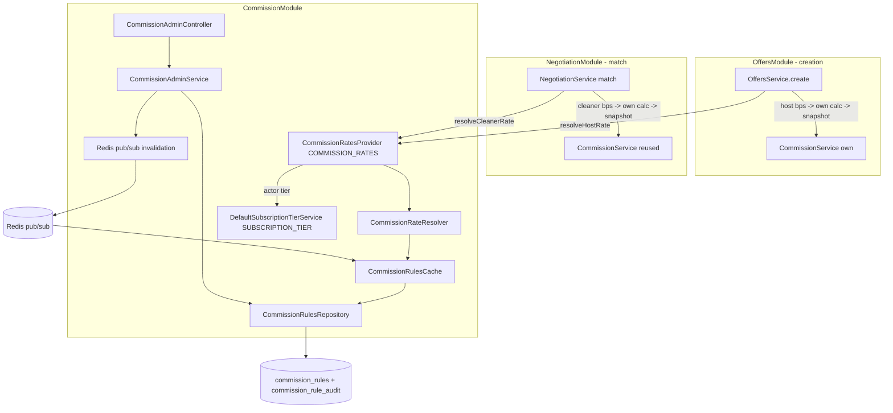

# Design Document

## Overview

The `commission-system` module resolves **which commission rate applies** to each side of a service - the Host service fee and the Cleaner commission - and records who changed the rules that produced them. It is consumed through a single DI-token contract (`COMMISSION_RATES`). It does not compute money, move money, own subscriptions, or serve analytics.

The two rates are resolved at **two different moments**, because they depend on actors known at different times:

- **Host service fee - resolved at offer creation.** The Host exists when the offer is created. `offer-publishing` calls `resolveHostRate`, feeds the bps to its OWN `CommissionService.getFullBreakdown`, and snapshots the Host rate onto the offer (as today).
- **Cleaner commission - resolved at match.** At creation there is no winning Cleaner (the offer is broadcast so Cleaners can discover it). `offer-negotiation` calls `resolveCleanerRate` for the winning Cleaner at the moment of match (direct accept / accepted proposal), computes the authoritative Cleaner payout with its OWN `CommissionService`, and snapshots the Cleaner rate onto the winning proposal / offer. This makes the plan's promise real: "a Cleaner PRO pays a reduced commission on the jobs they win."

The design rests on five hard rules:

1. **Resolve, never calculate.** The module selects rates from versioned `commission_rules`; the cents arithmetic stays in each CONSUMER's `CommissionService`. commission-system never does cents math and never imports `CommissionService`.
2. **One-directional dependency, no cycle.** Consumers depend on commission-system ONLY through the `COMMISSION_RATES` token. commission-system does NOT import `OffersModule`. There is no `forwardRef`, no circular dependency.
3. **Two moments, two snapshots, both immutable.** Host rate frozen at creation, Cleaner rate frozen at match. Escrow reads the frozen values and never re-resolves. A later rule change never re-prices an existing offer (P11).
4. **Fail into the default, never into an error.** Any failure - no matching rule, DB error, tier lookup timeout - degrades to the environment default rate. Neither offer creation nor match is ever blocked.
5. **Deterministic resolution.** For a fixed ruleset and side + context, the winner is always the same: specificity -> priority -> effective_from -> lowest UUID.

### Terminology: "resolution" vs "calculation"

> **Resolution** = choosing the rate bps for one side + context (this module). **Calculation** = applying those bps to a price to produce cents (each consumer's `CommissionService`). commission-system produces `{ rateBps, ruleId }`; the consumer feeds it to its own `CommissionService`.

### Key Design Decisions

1. **No OffersModule import; token-only coupling.** commission-system exposes `COMMISSION_RATES` and owns `SUBSCRIPTION_TIER` (stub until Spec 11). It does NOT import `OffersModule` or `CommissionService`. `offer-publishing` (creation) and `offer-negotiation` (match) inject `COMMISSION_RATES` and each use their own already-present `CommissionService` for cents. Dependency is strictly one-directional -> no cycle, no `forwardRef`.
2. **Two-moment resolution.** `resolveHostRate` at creation, `resolveCleanerRate` at match. Each resolves ONE side against ONE actor's tier.
3. **One rule = one side.** Each `commission_rules` row sets exactly one `applies_to` (HOST or CLEANER) with a single `rate_bps`. This is what makes the two sides resolve independently (P9) and mirrors reality (a PRO discount touches only the Cleaner commission).
4. **Rules in Postgres, hot-read via cache with distributed invalidation.** `commission_rules` is the durable source of truth. Resolution reads an in-memory cached ruleset (bounded staleness) so each path stays under 20 ms p95. On any rule write, the writing instance refreshes locally AND publishes a Redis pub/sub invalidation so every API instance refreshes - no instance serves a stale commission rate.
5. **Overlap prevented by an exclusion constraint.** A GiST exclusion constraint over the scope tuple + `tstzrange(effective_from, effective_to, '[)')` prevents two active rules with identical scope and overlapping windows even under concurrent writes (a plain unique index cannot, because different `effective_from` still overlap).
6. **Rules are never physically deleted.** Retirement is DEACTIVATE and/or a past `effective_to`. The audit FK uses `ON DELETE RESTRICT` so history can never be cascaded away.
7. **Append-only audit.** Every rule create/update/activate/deactivate writes a `commission_rule_audit` row (actor, timestamp, before/after, reason). Rules carry `created_by`/`updated_by`.
8. **Subscription tier via contract + stub; last-known tier owned by Spec 11.** `SUBSCRIPTION_TIER` returns FREE from a default stub. The real implementation (Spec 11) owns the last-known-tier cache. On timeout/error the resolver degrades to last-known then FREE; it stores no subscription state itself.
9. **Business-policy rate cap.** Beyond the technical [0, 10000] bps bound, a configurable per-side maximum rejects absurd rates at write time.
10. **No client surface by default.** The existing `GET /offers/:id/price-breakdown` serves snapshotted rates. Optional read-only quotes are exposed through the contract only (informational, non-freezing).

### Responsibility Matrix

| Responsibility | commission-system | offer-publishing | offer-negotiation | stripe-escrow | revenuecat-subscriptions | Data/Metabase |
|----------------|:---:|:---:|:---:|:---:|:---:|:---:|
| Choose Host rate bps (at creation) | YES | consumes | no | no | no | no |
| Choose Cleaner rate bps (at match) | YES | no | consumes | no | no | no |
| Store/version commission rules | YES | no | no | no | no | no |
| Audit rule changes | YES | no | no | no | no | no |
| Commission arithmetic (cents) | no | YES (own CommissionService) | YES (own CommissionService) | no | no | no |
| Snapshot Host rate onto offer | no (supplies) | YES | no | no | no | no |
| Snapshot Cleaner rate at match | no (supplies) | no | YES | no | no | no |
| Resolve subscriber tier / last-known cache | consumes | no | no | no | YES (future) | no |
| Move money / escrow / payout | no | no | no | YES | no | no |
| Commission/GMV reporting | no | no | no | no | no | YES |

## Architecture

### Module Placement

```
services/api/src/commission/
|-- commission.module.ts               (NestJS module; does NOT import OffersModule)
|-- commission.constants.ts            (env-configurable values + startup validation)
|-- commission.types.ts                (enums, context/result view types)
|-- rate-resolver.service.ts           (CommissionRateResolver - pure per-side selection over cached rules)
|-- rule-specificity.ts                (pure: specificity score + deterministic comparator)
|-- commission-rules.repository.ts     (rule reads/writes; audit append; transactional write path)
|-- commission-rules.cache.ts          (in-memory active ruleset; TTL + on-write + Redis-invalidation refresh)
|-- commission-cache-invalidation.ts   (Redis pub/sub publisher + subscriber for cross-instance invalidation)
|-- contracts/
|   |-- commission-rates.interface.ts  (CommissionRateContract + COMMISSION_RATES token)
|   |-- subscription-tier.interface.ts (SubscriptionTierContract + SUBSCRIPTION_TIER token)
|   `-- default-subscription-tier.service.ts (stub: always FREE; real impl + last-known cache is Spec 11)
|-- commission-rates.provider.ts       (implements CommissionRateContract; orchestrates resolver + tier lookup; NO cents math)
|-- admin/
|   |-- commission-admin.controller.ts (operator CRUD for rules; JWT + admin guard + rate limit)
|   `-- commission-admin.service.ts    (transactional validated writes: overlap check, cap check, audit append, invalidate)
|-- dto/
|   |-- create-rule.dto.ts
|   |-- update-rule.dto.ts
|   `-- rule-response.dto.ts
|-- entities/
|   |-- commission-rule.entity.ts
|   `-- commission-rule-audit.entity.ts
|-- __tests__/
|   `-- ...
`-- README.md
```

### System Context



### Two-Moment Resolution Flow

```mermaid
sequenceDiagram
    participant Host as Host
    participant Offers as OffersService.create
    participant Rates as COMMISSION_RATES
    participant Cleaner as Winning Cleaner
    participant Neg as NegotiationService.match

    Host->>Offers: create offer (country from property, serviceType)
    Offers->>Rates: resolveHostRate({ country, hostId, serviceType })
    Rates-->>Offers: { hostFeeRateBps, hostRuleId }
    Note over Offers: own CommissionService.getFullBreakdown(price, hostBps); snapshot host rate on offer
    Cleaner->>Neg: accept / accepted proposal (Cleaner now known)
    Neg->>Rates: resolveCleanerRate({ country, cleanerId, serviceType })
    Rates-->>Neg: { cleanerRateBps, cleanerRuleId }
    Note over Neg: own CommissionService for authoritative payout; snapshot cleaner rate on winning proposal/offer
```

### Cross-Module Wiring (proof there is no cycle)

- Edges: `OffersModule -> COMMISSION_RATES`, `NegotiationModule -> COMMISSION_RATES`. commission-system has NO edge back to either module.
- commission-system does not import `OffersModule`, `CommissionService`, or any offer/negotiation class. It only exports two tokens (`COMMISSION_RATES`, `SUBSCRIPTION_TIER`).
- Cents arithmetic already lives in each consumer (`offer-publishing` owns `CommissionService`; `offer-negotiation` already reuses it). Nothing about that changes; consumers simply pass resolved bps instead of relying on env defaults.

## Data Models

Two new tables. Next migration timestamps after the last payments migration (`1700000014000`): `1700000015000-CreateCommissionRules` and `1700000016000-CreateCommissionRuleAudit`.

### commission_rules

A versioned, scoped rate rule that sets exactly ONE side. `ANY` scope is a NULL column (NULL matches any value; a non-NULL matches only that value).

```sql
CREATE EXTENSION IF NOT EXISTS btree_gist; -- required for the exclusion constraint below

CREATE TABLE commission_rules (
    id UUID PRIMARY KEY DEFAULT gen_random_uuid(),
    country CHAR(2),                       -- ISO alpha-2, or NULL = ANY
    subscriber_tier VARCHAR(10),           -- 'FREE' | 'PRO', or NULL = ANY
    service_type VARCHAR(30),              -- offer service type, or NULL = ANY
    applies_to VARCHAR(10) NOT NULL,       -- 'HOST' | 'CLEANER'
    rate_bps INTEGER NOT NULL,             -- integer basis points
    priority INTEGER NOT NULL DEFAULT 0,
    effective_from TIMESTAMP WITH TIME ZONE NOT NULL DEFAULT NOW(),
    effective_to TIMESTAMP WITH TIME ZONE,
    is_active BOOLEAN NOT NULL DEFAULT TRUE,
    created_by UUID REFERENCES users(id) ON DELETE SET NULL,
    updated_by UUID REFERENCES users(id) ON DELETE SET NULL,
    created_at TIMESTAMP WITH TIME ZONE DEFAULT NOW(),
    updated_at TIMESTAMP WITH TIME ZONE DEFAULT NOW(),
    CONSTRAINT chk_commission_tier CHECK (subscriber_tier IS NULL OR subscriber_tier IN ('FREE','PRO')),
    CONSTRAINT chk_commission_applies_to CHECK (applies_to IN ('HOST','CLEANER')),
    CONSTRAINT chk_commission_country CHECK (country IS NULL OR country IN
        ('CO','US','CA','GB','DE','FR','IT','ES','PT','NL')),
    CONSTRAINT chk_commission_rate_bps CHECK (rate_bps >= 0 AND rate_bps <= 10000)
);

CREATE INDEX idx_commission_rules_lookup
    ON commission_rules (applies_to, is_active, effective_from)
    WHERE is_active = TRUE;

-- Prevent two ACTIVE rules with identical scope AND overlapping windows, concurrency-safe.
-- COALESCE normalizes NULL/ANY so ANY-scoped rules participate. tstzrange is half-open [from, to).
ALTER TABLE commission_rules
  ADD CONSTRAINT excl_commission_rule_overlap
  EXCLUDE USING gist (
    applies_to WITH =,
    COALESCE(country, '*') WITH =,
    COALESCE(subscriber_tier, '*') WITH =,
    COALESCE(service_type, '*') WITH =,
    tstzrange(effective_from, effective_to, '[)') WITH &&
  ) WHERE (is_active = TRUE);
```

Business-policy cap: `rate_bps <= COMMISSION_MAX_RATE_BPS_<side>` (configurable, > the technical bound is impossible; the cap is <= 10000) is enforced in the validated write path, not as a fixed CHECK, so the policy can change by config without a migration. The half-open `tstzrange` (`[from, to)`) matches the resolver's `effective_from <= now < effective_to` semantics exactly.

> **`applies_to` split:** each rule sets one side, so `resolveHostRate` and `resolveCleanerRate` each filter `applies_to` and run the identical specificity selection - independent by construction (P9).

### commission_rule_audit

Append-only history. Never updated or deleted through module write paths; `ON DELETE RESTRICT` guarantees it cannot be cascaded away (and rules are never physically deleted anyway).

```sql
CREATE TABLE commission_rule_audit (
    id UUID PRIMARY KEY DEFAULT gen_random_uuid(),
    rule_id UUID NOT NULL REFERENCES commission_rules(id) ON DELETE RESTRICT,
    action VARCHAR(12) NOT NULL,           -- CREATE | UPDATE | ACTIVATE | DEACTIVATE
    actor_id UUID REFERENCES users(id) ON DELETE SET NULL,
    old_values JSONB,                      -- previous scope/rate/window/flags (null on CREATE)
    new_values JSONB NOT NULL,             -- resulting scope/rate/window/flags
    reason TEXT,                           -- optional, persisted verbatim
    created_at TIMESTAMP WITH TIME ZONE DEFAULT NOW(),
    CONSTRAINT chk_commission_audit_action CHECK (action IN ('CREATE','UPDATE','ACTIVATE','DEACTIVATE'))
);

CREATE INDEX idx_commission_rule_audit_rule ON commission_rule_audit (rule_id, created_at);
CREATE INDEX idx_commission_rule_audit_actor ON commission_rule_audit (actor_id);
```

`old_values`/`new_values` store scope + rate (integer bps) + window + flags only, never a full unsanitized object.

### TypeScript types (commission.types.ts)

```typescript
export const SubscriberTier = { FREE: 'FREE', PRO: 'PRO' } as const;
export type SubscriberTier = typeof SubscriberTier[keyof typeof SubscriberTier];

export const RateSide = { HOST: 'HOST', CLEANER: 'CLEANER' } as const;
export type RateSide = typeof RateSide[keyof typeof RateSide];

export const RuleAuditAction = {
  CREATE: 'CREATE', UPDATE: 'UPDATE', ACTIVATE: 'ACTIVATE', DEACTIVATE: 'DEACTIVATE',
} as const;
export type RuleAuditAction = typeof RuleAuditAction[keyof typeof RuleAuditAction];

// Host resolution context (at offer creation).
export interface HostRateContext {
  readonly country: string;      // ISO alpha-2 (from the property)
  readonly hostId: string;
  readonly serviceType: string;
}

// Cleaner resolution context (at match; winning Cleaner is known).
export interface CleanerRateContext {
  readonly country: string;
  readonly cleanerId: string;
  readonly serviceType: string;
}

// One resolved side. commission-system returns bps only; the consumer computes cents.
export interface ResolvedRate {
  readonly rateBps: number;
  readonly ruleId: string | null; // null => env default used
}
```

## Components and Interfaces

### CommissionRateContract (COMMISSION_RATES)

```typescript
export interface CommissionRateContract {
  // At offer creation (Host known). Never throws; degrades to env default.
  resolveHostRate(ctx: HostRateContext): Promise<ResolvedRate>;
  // At match (winning Cleaner known). Never throws; degrades to env default.
  resolveCleanerRate(ctx: CleanerRateContext): Promise<ResolvedRate>;
  // Informational previews; identical resolution, persist nothing, do NOT freeze a rate.
  previewHostRate(ctx: HostRateContext): Promise<ResolvedRate>;
  previewCleanerRate(ctx: CleanerRateContext): Promise<ResolvedRate>;
}

export const COMMISSION_RATES = Symbol('COMMISSION_RATES');
```

`offer-publishing` consumes `resolveHostRate`; `offer-negotiation` consumes `resolveCleanerRate`. Neither passes data back into commission-system. Previews power radar/negotiation pre-match display (non-authoritative).

### SubscriptionTierContract (SUBSCRIPTION_TIER) - owned here, stub until Spec 11

```typescript
export interface SubscriptionTierContract {
  getTier(userId: string): Promise<SubscriberTier>;
}

export const SUBSCRIPTION_TIER = Symbol('SUBSCRIPTION_TIER');

@Injectable()
export class DefaultSubscriptionTierService implements SubscriptionTierContract {
  async getTier(_userId: string): Promise<SubscriberTier> {
    return SubscriberTier.FREE; // Spec 11 replaces this; the real impl owns the last-known-tier cache
  }
}
```

Mirrors the existing `CLEANER_DISCOVERY` / `PROPERTY_READINESS` pattern: interface + `Symbol` token in one file, `{ provide: SUBSCRIPTION_TIER, useClass: DefaultSubscriptionTierService }`, exported by `CommissionModule`. The last-known-tier fallback is NOT implemented here - the provider only calls `getTier` (bounded by timeout) and, on failure, relies on the contract implementation's own last-known value; commission-system persists no tier.

### CommissionRateResolver (pure per-side selection)

```typescript
@Injectable()
export class CommissionRateResolver {
  constructor(private readonly cache: CommissionRulesCache) {}

  resolveSide(side: RateSide, country: string, tier: SubscriberTier, serviceType: string, at: Date): ResolvedRate {
    const candidates = this.cache.activeRules(at)
      .filter((r) => r.appliesTo === side)
      .filter((r) => this.matches(r, country, tier, serviceType));
    if (candidates.length === 0) {
      return { rateBps: this.defaultBps(side), ruleId: null }; // env default (P4)
    }
    const winner = [...candidates].sort(compareBySpecificityThenPriorityThenDateThenId)[0];
    return { rateBps: winner.rateBps, ruleId: winner.id };
  }
}
```

`matches` treats a NULL scope column as a wildcard. `defaultBps` reads `OFFER_HOST_FEE_RATE_BPS` / `OFFER_CLEANER_RATE_BPS` (the same env source of truth the consumers fall back to).

### rule-specificity.ts (pure comparator - P2/P3)

```typescript
export function specificityScore(rule: {
  country: string | null; subscriberTier: string | null; serviceType: string | null;
}): number {
  return (rule.country ? 1 : 0) + (rule.subscriberTier ? 1 : 0) + (rule.serviceType ? 1 : 0);
}

// Strict deterministic ordering: specificity down, priority down, effective_from down, id up.
export function compareBySpecificityThenPriorityThenDateThenId(a: RuleRow, b: RuleRow): number {
  return (specificityScore(b) - specificityScore(a))
      || (b.priority - a.priority)
      || (b.effectiveFrom.getTime() - a.effectiveFrom.getTime())
      || (a.id < b.id ? -1 : a.id > b.id ? 1 : 0);
}
```

### CommissionRulesCache + distributed invalidation

`activeRules(at)` returns rules with `is_active = true` and `effective_from <= at < (effective_to ?? infinity)` - future-dated rules excluded until their window opens (P8). Refresh happens on: a configurable TTL interval, immediately after a local write, and on receipt of a Redis pub/sub invalidation message published by whichever instance performed a write. On refresh failure the cache keeps the last good snapshot (logged; never silently empties, which would cause silent commission drops). This guarantees no API instance serves a stale rate after a change, across a multi-instance deployment.

### Admin surface - CommissionAdminController

Class-level `@UseGuards(JwtAuthGuard, AdminGuard)`, rate-limited (`COMMISSION_ADMIN_RATE_LIMIT_PER_MINUTE`). Not on the offer hot path.

| Method | Path | Description |
|--------|------|-------------|
| POST | `/admin/commission/rules` | Create a rule (overlap + cap validated); audit CREATE; invalidate cache |
| PATCH | `/admin/commission/rules/:id` | Update values/scope/window; audit UPDATE before/after; invalidate |
| POST | `/admin/commission/rules/:id/activate` | is_active = true; audit ACTIVATE; invalidate |
| POST | `/admin/commission/rules/:id/deactivate` | is_active = false; audit DEACTIVATE; invalidate |
| GET | `/admin/commission/rules` | List rules (filter by scope/active) |
| GET | `/admin/commission/rules/:id/audit` | Rule change history |

`CommissionAdminService` performs, in ONE transaction: cap check, overlap check (backed by the exclusion constraint - a concurrent conflicting insert fails at commit with a constraint violation mapped to 409), the rule write, and the audit append; then publishes a Redis invalidation. Status codes: 201 create, 200 update/list, 409 overlap conflict, 400 invalid bps/scope/over-cap, 401/403 auth.

## Concurrency, Atomicity and Idempotency

| Race / failure | Guard |
|----------------|-------|
| Two operators create overlapping-scope active rules | GiST exclusion constraint `excl_commission_rule_overlap` (commit fails -> 409); pre-check is advisory only |
| Rule write + audit must both land | single DB transaction (rule row + audit row) |
| Stale cache after a write (same instance) | immediate local refresh |
| Stale cache after a write (other instances) | Redis pub/sub invalidation -> all instances refresh; TTL as backstop |
| Subscription-tier lookup slow/failing | bounded timeout -> contract's last-known tier -> FREE (never blocks) |
| No matching rule at resolution | env-default bps, null rule id (P4) |
| Resolver error mid-flow | caught by provider -> consumer falls back to env-default getFullBreakdown (Requirement 4.7) |

Resolution is **read-only and idempotent** - same side + context + ruleset always yields the same result (P2). Admin writes are guarded by the exclusion constraint, not by an idempotency key.

## Error Handling

| Case | Behavior |
|------|----------|
| No matching rule | env-default rate, ruleId = null (not an error) |
| Rules cache refresh fails | keep last good snapshot, log warning |
| SUBSCRIPTION_TIER timeout/error | contract last-known tier, else FREE; log; never fail create/match |
| Resolver/provider unexpected error | consumer falls back to env-default getFullBreakdown (Requirement 4.7) |
| Admin create with overlapping scope | 409 Conflict (exclusion constraint), no write, no audit |
| Admin invalid bps (>10000, negative, or over business cap) | 400, rejected by DTO + CHECK + cap validation |
| Non-operator hits admin endpoint | 403 |

## Correctness Properties

### Property 1: Money Integrity
Every rate is a non-negative integer <= 10000 bps; the module performs no floating-point arithmetic and no cents math (cents math lives in each consumer's CommissionService). **Validates: Requirements 1.5, 8.4.**

### Property 2: Deterministic Resolution
For a fixed ruleset and side + context, `resolveSide` returns the same (rateBps, ruleId) every time, ordered by specificity -> priority -> effective_from -> lowest UUID. **Validates: Requirements 1.2, 1.8.**

### Property 3: Most-Specific Wins
A rule with a higher specificity score always outranks a lower one; an exact scope always beats ANY on the same dimension. **Validates: Requirements 1.2, 3.1.**

### Property 4: Backward-Compatible Fallback
With an empty ruleset, resolution returns exactly the env-default bps for each side, reproducing today's flat behavior. **Validates: Requirements 1.3, 5.5, 4.4.**

### Property 5: Snapshot Immutability Preserved
The module never writes offers/negotiation/payment tables and never re-resolves an existing offer; the Host rate is snapshotted at creation and the Cleaner rate at match by the respective consumer. **Validates: Requirements 4.5, 7.5.**

### Property 6: Tier Isolation and Safe Degradation
Tier is only obtained via SUBSCRIPTION_TIER; on timeout/error resolution degrades to the contract's last-known tier then FREE, never blocking creation or match; commission-system stores no tier. **Validates: Requirements 2.1, 2.5, 2.6.**

### Property 7: No Double Calculation and No Circular Dependency
commission-system never reimplements fee/commission math or rounding and has no module-level dependency on offer-publishing; consumers use their own CommissionService and depend on commission-system only via the COMMISSION_RATES token. **Validates: Requirements 4.6.**

### Property 8: Effective-Window Correctness
Only rules with is_active = true and effective_from <= now < effective_to are selected; future-dated rules are inert until their window opens. **Validates: Requirements 1.4, 5.7.**

### Property 9: Independent Host/Cleaner Resolution
Host and Cleaner sides resolve independently, each against its own actor's tier at its own moment; one matched offer may carry a FREE host rule id and a PRO cleaner rule id. **Validates: Requirements 1.7, 2.4.**

### Property 10: Audit Completeness and No Physical Delete
Every rule create/update/activate/deactivate produces exactly one immutable audit row (actor, timestamp, before/after); rules are never physically deleted and the audit FK is ON DELETE RESTRICT. **Validates: Requirements 6.1, 6.2, 5.9.**

### Property 11: Rule-Version / Temporal Correctness
A rule mutation never alters the rate snapshot of an already-created or already-matched offer; a new offer resolves its Host rate against the ruleset effective at its creation timestamp, and a new match resolves its Cleaner rate against the ruleset effective at its match timestamp. **Validates: Requirements 1.4, 5.7.**

## Testing Strategy

**Property-based (fast-check)** for P1-P11: rate integrity over random bps; determinism over random rulesets/side+contexts; most-specific-wins over random scope combinations; empty-ruleset fallback equals env defaults per side; effective-window inclusion/exclusion (incl. future-dated); independent host/cleaner resolution producing mixed FREE/PRO rule ids; tie-break stability (equal specificity/priority/date -> lowest UUID); temporal correctness (a mutation after a resolution timestamp never changes that resolution's outcome).

**Unit:** `rule-specificity` comparator + `specificityScore`; `resolveSide` match logic (NULL = wildcard); cache window filtering + refresh-failure keeps-last-good + Redis-invalidation triggers refresh; `DefaultSubscriptionTierService` returns FREE; provider degradation on tier timeout and on resolver error; `CommissionAdminService` overlap conflict mapped to 409, cap rejection to 400, transactional rule+audit write + invalidation publish; DTO validation (bps bounds, cap, country/tier enums); audit FK RESTRICT (delete attempt rejected).

**Integration:** offer creation consuming `resolveHostRate` snapshots the Host bps and matches existing `GET /offers/:id/price-breakdown`; match consuming `resolveCleanerRate` snapshots the winning Cleaner bps on the proposal; empty-ruleset path is byte-for-byte current behavior; admin create -> overlap 409 -> activate/deactivate -> other-instance cache reflects change after invalidation; audit rows written per mutation; future-dated rule inert until effective_from; exclusion constraint blocks a concurrent overlapping insert.

**Explicit scenarios:** PRO cleaner (resolved at match) + FREE host (resolved at creation) on the same offer; country-specific rule beats ANY; scheduled change flips rates at the effective_from boundary; tier lookup timeout -> last-known -> FREE; two operators race on overlapping rules -> exactly one commits.

No live infrastructure is strictly required for unit/property; integration uses a faked repository and a fake Redis pub/sub for invalidation, mirroring the negotiation/payments test approach.

## Configuration Constants

```typescript
// commission.constants.ts - env-configurable, validated at startup (fail-fast)
// Default rates: SAME single source of truth as the consumers (not duplicated).
export { OFFER_HOST_FEE_RATE_BPS, OFFER_CLEANER_RATE_BPS } from '../offers/offers.constants';

export const COMMISSION_RULES_CACHE_TTL_MS = Number(process.env.COMMISSION_RULES_CACHE_TTL_MS ?? '60000');
export const COMMISSION_TIER_LOOKUP_TIMEOUT_MS = Number(process.env.COMMISSION_TIER_LOOKUP_TIMEOUT_MS ?? '500');
export const COMMISSION_ADMIN_RATE_LIMIT_PER_MINUTE = Number(process.env.COMMISSION_ADMIN_RATE_LIMIT_PER_MINUTE ?? '30');
export const COMMISSION_MAX_HOST_RATE_BPS = Number(process.env.COMMISSION_MAX_HOST_RATE_BPS ?? '5000');
export const COMMISSION_MAX_CLEANER_RATE_BPS = Number(process.env.COMMISSION_MAX_CLEANER_RATE_BPS ?? '5000');
export const COMMISSION_CACHE_INVALIDATION_CHANNEL =
  process.env.COMMISSION_CACHE_INVALIDATION_CHANNEL ?? 'commission:rules:invalidate';
```

Note the naming: the env VARIABLE names are `OFFER_HOST_FEE_RATE` / `OFFER_CLEANER_RATE`; the parsed TypeScript CONSTANTS are `OFFER_HOST_FEE_RATE_BPS` / `OFFER_CLEANER_RATE_BPS`. This spec re-exports the constants from `offers.constants` so the default value can never diverge between modules.

### Startup Configuration Validation (fail-fast)
- `COMMISSION_RULES_CACHE_TTL_MS > 0`, `COMMISSION_TIER_LOOKUP_TIMEOUT_MS > 0`, `COMMISSION_ADMIN_RATE_LIMIT_PER_MINUTE > 0`.
- `COMMISSION_MAX_HOST_RATE_BPS` and `COMMISSION_MAX_CLEANER_RATE_BPS` are integers in [0, 10000].
- Inherited `OFFER_HOST_FEE_RATE_BPS` / `OFFER_CLEANER_RATE_BPS` are integers in [0, 10000] and <= their respective business cap.
- `COMMISSION_CACHE_INVALIDATION_CHANNEL` non-empty.

## Environment Variables

| Variable | Description | Default |
|----------|-------------|---------|
| `OFFER_HOST_FEE_RATE` | Default Host fee bps (shared with offer-publishing; not duplicated) | `1000` |
| `OFFER_CLEANER_RATE` | Default Cleaner commission bps (shared with offer-publishing) | `300` |
| `COMMISSION_RULES_CACHE_TTL_MS` | Ruleset cache refresh interval | `60000` |
| `COMMISSION_TIER_LOOKUP_TIMEOUT_MS` | Bound on the subscriber-tier lookup | `500` |
| `COMMISSION_ADMIN_RATE_LIMIT_PER_MINUTE` | Rate limit on admin rule endpoints | `30` |
| `COMMISSION_MAX_HOST_RATE_BPS` | Business-policy cap on the Host fee rate | `5000` |
| `COMMISSION_MAX_CLEANER_RATE_BPS` | Business-policy cap on the Cleaner commission rate | `5000` |
| `COMMISSION_CACHE_INVALIDATION_CHANNEL` | Redis pub/sub channel for cross-instance cache invalidation | `commission:rules:invalidate` |

`OFFER_HOST_FEE_RATE` / `OFFER_CLEANER_RATE` already exist in `.env.example`; the `COMMISSION_*` variables are added by this spec.

## Cross-Module Contracts (consumed / emitted)

- **Exposes** `COMMISSION_RATES` (`CommissionRateContract`): `resolveHostRate` consumed by `offer-publishing` at creation, `resolveCleanerRate` consumed by `offer-negotiation` at match. commission-system has no reverse dependency on either module (no cycle, no forwardRef).
- **Owns and exposes** `SUBSCRIPTION_TIER` (`SubscriptionTierContract`) with a FREE-returning stub -> replaced by `revenuecat-subscriptions` (Spec 11), which also owns the last-known-tier cache.
- **Does not** import `CommissionService`, write the `offers`/negotiation/payment tables, move money, or emit domain events. Cents arithmetic and snapshots stay in the consumers; reporting reads `payments.net_platform_revenue_cents` in the data layer.
- **Uses** Redis pub/sub for distributed cache invalidation of the ruleset across API instances.
