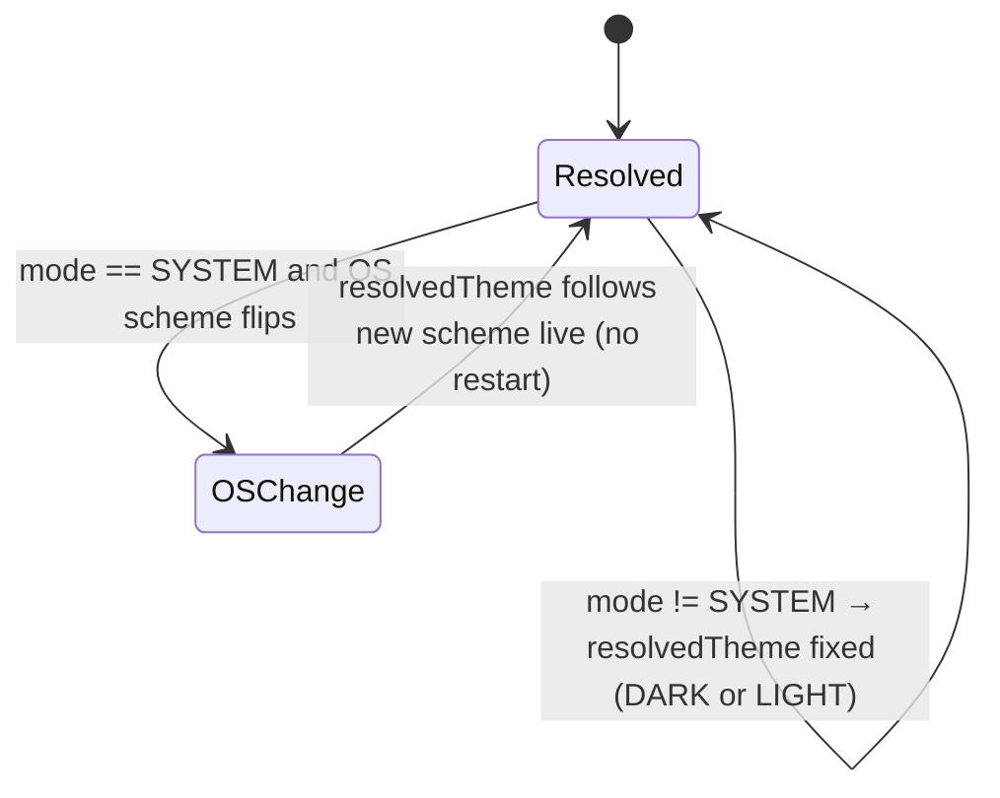

# Design Document: Dark / Light Theme

## Overview

`dark-light-theme` (Spec 24, Sprint 6 — Polish & Extras) is a **mobile-only, client-only theming backbone**. It touches no backend, no money, no domain data, no PostgreSQL, no queue, no realtime channel. Its entire job is to consolidate BidClean's scattered, hardcoded color constants into a **single design-token source of truth**, add a **light mode** alongside the existing dark-first identity, and let a user pick **Dark / Light / System** with the whole app — including native chrome — responding consistently and without a wrong-theme flash on launch.

**It consolidates, not just adds.** Today there is no centralized theme. The theme folder (`apps/mobile/src/theme/`) documents an intent (`colors.ts`, `typography.ts`, …) that is not actually consumed: **30+ screens/components each define their own local `const COLORS = { ... }`** with raw hex (`PaywallScreen`, `ProBadge`, `RadarScreen`, `RoleBasedNavigator`, the whole `radar/` tree, the whole `profile/` tree, `payments/`, `roles/`, …). The brand tokens are duplicated per file, there is **no `useColorScheme` integration, no ThemeProvider, no `useTheme` hook, no shared token set, and no light mode**. This directly violates the project no-hardcoded-values rule. This spec supplies the missing foundation and migrates those local constants onto tokens.

The authority split, stated precisely (it drives the whole design):

- **The design-token layer is the single source of truth for color, and `primitives.ts` is its single *physical* source of raw hex.** No screen defines its own palette or inline hex. **Every concrete color value in the app lives in `primitives.ts`** — not only the brand seeds (obsidian, surface, mint, white, warm off-white, danger) but every per-mode literal: success, danger, overlay scrims, near-black text, light surfaces, secondary/muted text, borders and dividers for each mode. The theme files (`dark.theme.ts` / `light.theme.ts`) do **exclusively semantic mapping** (`background: palette.obsidian`, `accent: palette.mint`, …) and contain **no `#RRGGBB` literal at all**. Those primitives are mapped into **semantic tokens** (`background`, `surface`, `textPrimary`, `accent`, `border`, `danger`, `onAccent`, …), and each theme resolves those tokens to concrete per-mode values by reference. Screens consume semantic tokens via `useTheme()` — never raw hex, never a primitive directly.
- **`mode` (chosen, persisted) is distinct from `resolvedTheme` (rendered).** `mode ∈ { DARK, LIGHT, SYSTEM }` is what the user picked and what is persisted; `resolvedTheme ∈ { DARK, LIGHT }` is what actually renders (`SYSTEM` resolves to the OS `useColorScheme`). There is no `SYSTEM` theme — only a `SYSTEM` mode. `useTheme()` exposes **both** so code never confuses "the user picked SYSTEM" with "the active theme".
- **The preference is persisted on-device only, versioned, and read pre-paint.** Stored shape `{ version, mode }` in `expo-secure-store`. No server persistence, no cross-device sync in v1. Missing / invalid enum / corrupt / storage-unavailable → fall back to `DARK` for the session, never crash, never block rendering indefinitely.
- **The active theme is provided via React context and is resolution-gated.** `ThemeProvider` reports a `resolved` state only after **both** the persisted `mode` AND the OS scheme are available; theme-dependent content does not mount until then, and the **native splash stays visible during resolution**. A mode change re-renders the whole app + native chrome consistently — no prop-drilling, no partial theming, no default-then-repaint (no FOUC).

The design rests on these hard rules:

1. **Semantic tokens, typed, identical shape in both themes.** Every semantic token exists in **both** dark and light (no dark-only or light-only token), the shape is a TypeScript type so a missing/misspelled token is a **compile error**, and no `any` is used.
2. **Dark is the default and the reference.** First run is `DARK` (via a named default constant), with the brand reference values (`background #0B0C10`, `surface #1F2833`, `textPrimary #FFFFFF`, `accent #00F5D4`). Light is additive parity — readable and on-brand — and never regresses the dark experience.
3. **Accent (mint) is interactive/active emphasis, never a surface.** The `accent` token is used for CTAs, links, focus/selected/active states, progress, status badges — in both modes — and is **never** a primary background/surface color.
4. **WCAG 2.1 AA is the objective contrast criterion.** Text/essential-UI token pairs on `background`/`surface` meet ≥ 4.5:1 (normal text) / ≥ 3:1 (large text and essential UI) in **both** themes — verified at the token-pair level, not per pixel.
5. **No FOUC is an implementable invariant, not a vibe.** `ThemeProvider` never renders a default theme first and repaints; it holds the native splash until resolution completes.
6. **Migration is mandatory, and raw hex has exactly one home.** Every existing local `const COLORS` / inline hex is migrated to `useTheme()` tokens; a hex search over application color values then finds **only `primitives.ts`** — no other file (not even the theme files) contains a `#RRGGBB` literal (external assets and third-party internals exempt).

### Terminology

> **Primitive palette** = raw brand seeds (obsidian, surface, mint, white, warm off-white, danger…); not consumed by screens. **Semantic token** = a named role (`background`, `surface`, `textPrimary`, `accent`, …) screens consume. **Theme** = the resolved semantic-token set for a mode (`darkTheme` / `lightTheme`). **Mode** = the user's choice `DARK` | `LIGHT` | `SYSTEM` (persisted). **resolvedTheme** = `DARK` | `LIGHT`, what renders. **ThemeProvider / useTheme** = the context provider + hook. **System mode** = follows `useColorScheme()` live. **FOUC** = a visible wrong-theme frame on launch; forbidden here.

### Key Design Decisions

1. **One token layer, semantic over primitive, one physical hex file.** Screens consume semantic roles, not brand seeds, so a palette tweak (e.g. light-mode surface) is one edit in the token layer, and accent-as-CTA is expressible without leaking `#00F5D4` into screens. All raw hex — every concrete color, per mode — lives in `primitives.ts`; the theme files only *reference* those primitives, so there is a single physical source of color and the hex-guard can enforce "no `#RRGGBB` outside `primitives.ts`" (REQ-TH1, REQ-TH4, REQ-TH9).
2. **Context provider, not a Zustand store, for the *resolved theme* value.** The resolved theme must be read by nearly every component on every render; React context is the idiomatic, prop-drill-free way and propagates a mode change consistently to every consumer (no consumer keeps the old theme). Zustand (the project's state tool) still backs the **persistence + mode transitions** via a small `useThemeStore` that the provider subscribes to — so we keep the project's Zustand convention for the *stateful* part while context distributes the *derived value*. This avoids prop-drilling and guarantees app-wide consistency (REQ-TH8).
3. **Resolution gate + native splash hold for no-FOUC.** `expo-splash-screen` `preventAutoHideAsync()` is called at module load; the native splash **remains visible until the first resolved themed React tree is mounted and ready for presentation** — `hideAsync()` is called **only after** `(persisted mode, OS scheme)` both resolve *and* the themed root has completed its initial layout/render cycle. `onLayout` guarantees layout has run, not that the frame has been presented, so the contract is stated in terms of "mounted and ready for presentation": the splash is never hidden while `resolved === false`, and no themed content is ever rendered before `resolved === true`. Until then the provider renders nothing themed. This turns "no flash" into a testable state machine, not a hope (REQ-TH7).
4. **`expo-secure-store` for the versioned preference.** Consistent with how the app already persists auth; the preference is tiny and non-sensitive but reuses the same durable, per-device store. The stored shape is `{ version, mode }` so the format can migrate; any read failure degrades to `DARK` (REQ-TH5).
5. **Native chrome themed centrally.** Status bar (`expo-status-bar`), navigation headers/tab bar (React Navigation `NavigationContainer` theme + screen options), Android navigation bar, modal/presentation surfaces, and keyboard appearance are all driven from the resolved theme in one place (the provider + a small `useSystemChromeTheme` effect), so "app-wide" genuinely includes native chrome (REQ-TH8).
6. **Migration is codified, not freehand.** A themed `StyleSheet` helper (`makeStyles(theme => …)` / `useThemedStyles`) replaces the per-file `StyleSheet.create` + `const COLORS`; migrated screens are verified by token/snapshot in DARK so their prior appearance is preserved, and a lint/CI hex guard prevents regression (REQ-TH9).

### Responsibility Matrix

| Responsibility | Token layer | ThemeProvider / useTheme | useThemeStore (Zustand) | Screens/components | OS |
|----------------|:---:|:---:|:---:|:---:|:---:|
| Define primitive palette | ✅ | ❌ | ❌ | ❌ | ❌ |
| Map primitive → semantic tokens per mode | ✅ | ❌ | ❌ | ❌ | ❌ |
| Resolve `(mode, OS scheme) → resolvedTheme` | ❌ | ✅ | ❌ | ❌ | provides scheme |
| Persist / load `{ version, mode }` | ❌ | ❌ | ✅ | ❌ | ❌ |
| Expose `{ theme, mode, resolvedTheme, setMode }` | ❌ | ✅ | ❌ | consumes | ❌ |
| Hold splash until resolution (no FOUC) | ❌ | ✅ | ❌ | ❌ | ❌ |
| Theme native chrome (status bar, tab bar, nav bar, keyboard) | ❌ | ✅ | ❌ | ❌ | renders |
| Consume tokens (never raw hex) | ❌ | ❌ | ❌ | ✅ | ❌ |
| Follow OS scheme live in SYSTEM mode | ❌ | ✅ | ❌ | ❌ | ✅ |

## Architecture

### Layered model — primitive → semantic → theme → provider → screens

```mermaid
flowchart TD
    subgraph Tokens[Token layer — single source of truth NEW]
        Prim[primitives.ts — ONLY physical hex home\nALL per-mode color values:\nobsidian #0B0C10, surface #1F2833, mint #00F5D4,\nwhite, warmOffWhite ~#F5F2EB, near-black text,\nsurfaces, secondary/muted text, border, divider,\ndanger, success, overlay scrims per mode]
        Sem[semantic token SHAPE typed\nbackground, surface, surfaceElevated,\ntextPrimary, textSecondary, textMuted,\naccent, onAccent, border, divider,\ndanger, success, overlay]
        Dark[darkTheme: semantic->palette mapping ONLY\nno hex; default/reference]
        Light[lightTheme: semantic->palette mapping ONLY\nno hex; additive parity]
        Prim --> Dark
        Prim --> Light
        Sem -. defines shape of .-> Dark
        Sem -. defines shape of .-> Light
    end
    subgraph State[useThemeStore Zustand]
        Persist[load/persist { version, mode }\nexpo-secure-store; serialized last-write-wins\nfallback DARK; bootstrap timeout guard]
    end
    subgraph Provider[ThemeProvider + useTheme]
        Resolve[resolve mode + OS scheme -> resolvedTheme]
        Gate[resolution gate: hold native splash\nuntil resolved; never default-then-repaint]
        Chrome[theme native chrome:\nstatus bar, tab bar, headers, nav bar, keyboard]
    end
    OS[(OS useColorScheme)]

    Persist --> Resolve
    OS --> Resolve
    Dark --> Resolve
    Light --> Resolve
    Resolve --> Gate --> Screens
    Resolve --> Chrome
    Screens[Screens/components\nuseTheme -> semantic tokens ONLY]
```

### Provider placement (root of the app)

`main` is `expo-router/entry`, so the root layout (`app/_layout.tsx`) is where the provider tree lives. `ThemeProvider` wraps the navigation tree (above `RoleBasedNavigator`) so every screen and the navigation container are inside it.

```
apps/mobile/
├── app/
│   └── _layout.tsx                     (root: SafeAreaProvider > ThemeProvider > NavigationThemeBridge > <Stack/Slot>)
│                                        calls SplashScreen.preventAutoHideAsync() at module load
└── src/
    └── theme/                          (EXISTING folder — now actually populated & consumed)
        ├── primitives.ts               (ALL raw color values, per mode — the ONLY place raw hex lives)
        ├── tokens.ts                   (SemanticTokens TYPE — the token shape; ThemeMode & ResolvedTheme enums)
        ├── dark.theme.ts               (darkTheme: SemanticTokens — semantic→primitive mapping ONLY, no hex; the default)
        ├── light.theme.ts              (lightTheme: SemanticTokens — semantic→primitive mapping ONLY, no hex)
        ├── themes.ts                   (THEMES: Record<ResolvedTheme, SemanticTokens>; assertTokenParity())
        ├── theme.constants.ts          (DEFAULT_MODE, PREFERENCE_STORAGE_KEY, PREFERENCE_VERSION, enums)
        ├── ThemeProvider.tsx           (context, resolution gate, splash hold, setMode)
        ├── useTheme.ts                 (hook → { theme, mode, resolvedTheme, setMode })
        ├── useThemeStore.ts            (Zustand: load/persist { version, mode }; safe fallback)
        ├── useThemedStyles.ts          (makeStyles(theme => StyleSheet) memoized per resolvedTheme)
        ├── useSystemChromeTheme.ts     (status bar / nav bar / keyboard appearance from resolvedTheme)
        ├── NavigationThemeBridge.tsx   (maps resolvedTheme → React Navigation theme for headers/tab bar/modals)
        ├── contrast.ts                 (pure WCAG contrast-ratio util — used by tests to assert AA)
        ├── typography.ts / spacing.ts / radius.ts / shadows.ts  (non-color tokens, mode-independent)
        ├── index.ts                    (explicit exports — ThemeProvider, useTheme, useThemedStyles, types)
        ├── __tests__/
        └── README.md                   (updated: how tokens/provider work, migration guide, no-hex rule)

apps/mobile/src/screens/appearance/     (the Dark/Light/System selector UX)
├── AppearanceSettingsScreen.tsx        (segmented Dark/Light/System reflecting current mode)
├── components/
│   └── ThemeModeSelector.tsx           (three options; calls setMode; en/es labels; BidClean styling)
├── __tests__/
└── README.md
```

### Launch resolution flow (the no-FOUC invariant)

```mermaid
sequenceDiagram
    participant Entry as app/_layout (module load)
    participant Splash as expo-splash-screen
    participant Store as useThemeStore
    participant OS as useColorScheme
    participant Prov as ThemeProvider
    participant UI as Themed app + native chrome

    Entry->>Splash: preventAutoHideAsync()  (splash stays up)
    Entry->>Prov: mount ThemeProvider (renders NOTHING themed yet)
    Prov->>Store: load persisted { version, mode } (raced vs THEME_BOOTSTRAP_TIMEOUT_MS)
    Note over Store: missing/invalid/corrupt/unavailable → mode = DARK (session fallback)\nread hangs / never resolves → after THEME_BOOTSTRAP_TIMEOUT_MS → DARK + isLoaded=true
    Store-->>Prov: mode (DARK | LIGHT | SYSTEM), isLoaded=true (always reached)
    Prov->>OS: read current OS color scheme
    OS-->>Prov: 'dark' | 'light' | null
    Prov->>Prov: resolvedTheme = mode===SYSTEM ? (scheme ?? DARK) : mode
    Note over Prov: resolved === true ONLY now (both inputs available)
    Prov->>UI: mount themed tree with resolvedTheme (FIRST themed frame)
    UI->>UI: themed root completes initial layout/render cycle
    UI->>Splash: only THEN → SplashScreen.hideAsync()
    Note over UI,Splash: splash held until the resolved themed tree is mounted AND ready for presentation;\nnever hidden while resolved === false; app was NEVER shown in a default theme; no repaint
```

### Mode-change propagation (app-wide consistency)

```mermaid
sequenceDiagram
    participant User
    participant Sel as ThemeModeSelector
    participant Prov as ThemeProvider (+ useThemeStore)
    participant Ctx as React context
    participant Screens as Every screen
    participant Chrome as Native chrome

    User->>Sel: pick DARK | LIGHT | SYSTEM
    Sel->>Prov: setMode(next)
    Prov->>Prov: update in-memory mode; recompute resolvedTheme(next, OS scheme)
    Prov->>Prov: enqueue persist { version, mode } (serialized, last-write-wins)
    Note over Prov: rapid DARK->LIGHT->SYSTEM: writes serialized / superseded writes discarded\nso the persisted value eventually equals the LATEST mode, never a stale one
    Prov->>Ctx: publish { theme, mode, resolvedTheme, setMode }
    Ctx-->>Screens: consistent update — no consumer retains previous theme (no partial theming)
    Ctx-->>Chrome: status bar / tab bar / headers / nav bar / keyboard update
    Note over User: no restart; current screen included
```

### SYSTEM-follows-OS-live flow



## Components and Interfaces

### Enums and token shape (`tokens.ts`, `theme.constants.ts`)

```typescript
// The user's persisted choice.
export enum ThemeMode {
  DARK = 'DARK',
  LIGHT = 'LIGHT',
  SYSTEM = 'SYSTEM',
}

// What actually renders. There is NO SYSTEM here — SYSTEM is a mode, not a theme.
export enum ResolvedTheme {
  DARK = 'DARK',
  LIGHT = 'LIGHT',
}

// The semantic token shape. Every theme MUST provide every key (compile-enforced).
// No `any`. A screen referencing a non-existent token is a compile error.
export interface SemanticTokens {
  background: string;
  surface: string;
  surfaceElevated: string;
  textPrimary: string;
  textSecondary: string;
  textMuted: string;
  accent: string;        // mint — interactive/active emphasis ONLY, never a surface
  onAccent: string;      // text/icon color that sits on `accent`
  border: string;
  divider: string;
  danger: string;
  success: string;
  overlay: string;       // scrim behind modals/sheets
}

export const DEFAULT_MODE: ThemeMode = ThemeMode.DARK; // brand default (named, not scattered)
export const PREFERENCE_STORAGE_KEY = 'bidclean.theme.preference';
export const PREFERENCE_VERSION = 1;

// Bootstrap safety net: if reading the persisted preference hasn't completed within
// this budget (e.g. a hung SecureStore SDK whose promise never resolves), the store
// falls back to DEFAULT_MODE and marks itself loaded so the splash can never stay up
// forever. Not user-configurable — an explicit, named policy constant.
export const THEME_BOOTSTRAP_TIMEOUT_MS = 2000;
```

### Primitive palette + themes (`primitives.ts`, `dark.theme.ts`, `light.theme.ts`, `themes.ts`)

```typescript
// primitives.ts — the SINGLE physical home for raw hex. Every concrete color value
// the app uses (both modes) is defined here; NOT consumed by screens directly.
// The theme files reference these names only — no other file contains a #RRGGBB literal.
export const palette = {
  // Brand seeds
  obsidian: '#0B0C10',
  surfaceDark: '#1F2833',
  mint: '#00F5D4',
  white: '#FFFFFF',
  warmOffWhite: '#F5F2EB',

  // Dark-mode literals
  surfaceElevatedDark: '#252F3A',
  textSecondaryDark: '#C4CCD4',
  textMutedDark: '#8A94A0',
  borderDark: '#2C3540',
  dividerDark: '#232B34',
  overlayDark: 'rgba(11, 12, 16, 0.72)',   // obsidian scrim behind modals

  // Light-mode literals (warm, not pure white)
  surfaceLight: '#FFFFFF',
  surfaceElevatedLight: '#FBF9F3',
  nearBlack: '#14161A',                     // light-mode primary text
  textSecondaryLight: '#454B52',
  textMutedLight: '#6B7178',
  borderLight: '#E2DED3',
  dividerLight: '#ECE8DD',
  overlayLight: 'rgba(20, 22, 26, 0.45)',   // scrim behind modals in light

  // Status colors (shared seeds; per-mode variants below where contrast needs it)
  danger: '#FF5A5F',
  dangerLight: '#D93A3F',
  success: '#2FD98B',
  successLight: '#1FA968',
} as const;

// dark.theme.ts — the DEFAULT and reference. SEMANTIC MAPPING ONLY — no hex literals.
export const darkTheme: SemanticTokens = {
  background: palette.obsidian,
  surface: palette.surfaceDark,
  surfaceElevated: palette.surfaceElevatedDark,
  textPrimary: palette.white,
  textSecondary: palette.textSecondaryDark,
  textMuted: palette.textMutedDark,
  accent: palette.mint,              // interactive/active emphasis only
  onAccent: palette.obsidian,        // dark text/icon on mint
  border: palette.borderDark,
  divider: palette.dividerDark,
  danger: palette.danger,
  success: palette.success,
  overlay: palette.overlayDark,
};

// light.theme.ts — additive parity. SEMANTIC MAPPING ONLY — no hex literals.
export const lightTheme: SemanticTokens = {
  background: palette.warmOffWhite,  // warm, never pure white
  surface: palette.surfaceLight,
  surfaceElevated: palette.surfaceElevatedLight,
  textPrimary: palette.nearBlack,
  textSecondary: palette.textSecondaryLight,
  textMuted: palette.textMutedLight,
  accent: palette.mint,              // same mint, still interactive/active only
  onAccent: palette.obsidian,        // dark text/icon on mint
  border: palette.borderLight,
  divider: palette.dividerLight,
  danger: palette.dangerLight,
  success: palette.successLight,
  overlay: palette.overlayLight,
};

// themes.ts
export const THEMES: Record<ResolvedTheme, SemanticTokens> = {
  [ResolvedTheme.DARK]: darkTheme,
  [ResolvedTheme.LIGHT]: lightTheme,
};

// Dev/test guard: every semantic key present in BOTH themes (shape parity).
export function assertTokenParity(): void { /* throws if keys differ between dark & light */ }
```

> Exact per-mode values are a design decision seeded by the plan; they are chosen to satisfy the WCAG 2.1 AA criterion (Requirement 2.3) for the text/essential-UI token pairs, verified by `contrast.ts` in tests. All of them live as named entries in `primitives.ts` — the theme files above hold **zero** hex literals, only `palette.*` references — so raw color has exactly one physical home. `assertTokenParity()` runs in dev/CI so a dark-only or light-only token is caught immediately (REQ-TH2).

### `useThemeStore` (Zustand — persistence + mode transitions)

```typescript
interface StoredPreference { version: number; mode: ThemeMode; } // persisted shape

interface ThemeStoreState {
  mode: ThemeMode;          // current chosen mode (DARK until loaded)
  isLoaded: boolean;        // true once persistence has been read (or safely fallen back)
  writeSeq: number;         // monotonic counter stamping each setMode write (last-write-wins)
  load(): Promise<void>;    // read expo-secure-store; parse+validate; fallback DARK on any failure or timeout
  setMode(next: ThemeMode): Promise<void>; // update + persist { PREFERENCE_VERSION, next }, serialized
}
```

- `load()` reads `PREFERENCE_STORAGE_KEY`; a missing value, invalid JSON, unknown `mode` enum, wrong/absent `version`, or a thrown `SecureStore` error all resolve to `DEFAULT_MODE` (`DARK`) and set `isLoaded = true` — never throws, never blocks indefinitely (REQ-TH5). Where a `version` migration is defined, a known older shape is upgraded; an unrecognized shape falls back to `DARK`.
- **Bootstrap timeout (never-resolving guard).** `load()` races the read against `THEME_BOOTSTRAP_TIMEOUT_MS`. A rejected read reaches the catch and falls back; but a `SecureStore` promise that *never* settles would never hit the catch and would keep the splash up forever — so if the read has not completed within the timeout, `load()` resolves to `DEFAULT_MODE` (`DARK`) and sets `isLoaded = true` anyway. The gate therefore always reaches `resolved === true` (REQ-TH5, REQ-TH7). A late-arriving read after the timeout is ignored (it must not silently repaint or overwrite a user's subsequent choice).
- **`setMode(next)` — last-write-wins persistence.** It updates in-memory `mode` immediately (so the UI reflects the choice at once), then persists `{ version: PREFERENCE_VERSION, mode: next }`. Writes are **serialized**: each `setMode` takes the next `writeSeq` and its persist runs on a single-writer queue (or its result is discarded if a newer `writeSeq` has since been issued). Consequently three rapid changes (`DARK → LIGHT → SYSTEM`) issued before the first `SecureStore` write completes cannot leave a stale persisted value — an older in-flight write can never overwrite a newer mode; the persisted preference **eventually represents the latest completed `setMode`**. A persistence failure still applies the mode for the session (the render must not be blocked); the failure is logged, not swallowed silently.
- Functions ≤ 30 lines, single responsibility, no `any`.

### `ThemeProvider` + `useTheme` (context, resolution gate, chrome)

```typescript
export interface ThemeContextValue {
  theme: SemanticTokens;      // resolved tokens for the active resolvedTheme
  mode: ThemeMode;            // the user's chosen mode (DARK | LIGHT | SYSTEM)
  resolvedTheme: ResolvedTheme; // DARK | LIGHT — what is actually rendering
  setMode(next: ThemeMode): void; // persists + re-renders app-wide
}

export function ThemeProvider(props: { children: React.ReactNode }): React.JSX.Element | null;
export function useTheme(): ThemeContextValue; // throws if used outside ThemeProvider
```

- On mount: subscribe to `useThemeStore`, trigger `load()`, and read `useColorScheme()`.
- `resolved` is `true` only when `store.isLoaded === true` AND the OS scheme has been read. **Before `resolved`, the provider renders `null`** (nothing themed) while the native splash is still visible — this is the no-FOUC gate (REQ-TH7). It never renders a default-theme tree first. The splash is hidden (`hideAsync()`) **only after** the resolved themed root has mounted and completed its initial layout/render cycle — never while `resolved === false` — so no themed frame precedes resolution and no default frame is ever presented.
- `resolvedTheme = mode === SYSTEM ? (osScheme === 'light' ? LIGHT : DARK) : (mode as ResolvedTheme)`. In `SYSTEM` mode, a live OS scheme change flips `resolvedTheme` without a restart (REQ-TH6). `null` OS scheme resolves to `DARK` (brand default).
- `theme = THEMES[resolvedTheme]`. The context value is memoized so that after a new theme is published, **no consumer retains the previous theme state** — every subscriber observes the new `resolvedTheme` and there is no stale or partial theming across the tree (REQ-TH8), with no prop-drilling. (This is a consistency invariant, not a promise of an exact React render count, which React does not contractually guarantee.)
- `setMode` delegates to the store (persist) and lets the resulting state change recompute `resolvedTheme`.
- Renders `useSystemChromeTheme(resolvedTheme)` and wraps children in `NavigationThemeBridge` so native chrome tracks the theme.

### `useSystemChromeTheme` + `NavigationThemeBridge` (native chrome)

```typescript
// Applies resolvedTheme to native chrome the RN component tree cannot style directly.
export function useSystemChromeTheme(resolved: ResolvedTheme): void;
//  - StatusBar style: 'light' content on DARK, 'dark' content on LIGHT (expo-status-bar)
//  - Android navigation bar color/button style (where controllable)
//  - Keyboard appearance default ('dark'/'light') surfaced to text inputs

// Bridges resolvedTheme → React Navigation theme so headers, tab bar, card/modal
// backgrounds, and presentation surfaces reflect the active theme.
export function NavigationThemeBridge(props: {
  resolved: ResolvedTheme;
  children: React.ReactNode;
}): React.JSX.Element;
```

OS-level dialogs that the app cannot style (system alerts) are explicitly out of scope (REQ-TH8, Req 4.4). Everything the app *can* control tracks the theme.

### `useThemedStyles` / `makeStyles` (the migration primitive)

```typescript
// Replaces the per-file `const COLORS = {…}` + `StyleSheet.create({...})` pattern.
// Styles are a function of the resolved theme; memoized per resolvedTheme so a mode
// change recomputes them once. A screen NEVER holds raw hex again.
export function makeStyles<T extends StyleSheet.NamedStyles<T>>(
  factory: (theme: SemanticTokens) => T,
): () => T; // returns a hook that reads useTheme() internally and memoizes on resolvedTheme
```

Migration transform, applied per file:

```typescript
// BEFORE (hardcoded — the debt this spec removes)
const COLORS = { accent: '#00F5D4', onAccent: '#0B0C10' } as const;
const styles = StyleSheet.create({
  badge: { backgroundColor: COLORS.accent },
  label: { color: COLORS.onAccent },
});

// AFTER (tokenized — colors come from the active theme)
const useStyles = makeStyles((theme) => ({
  badge: { backgroundColor: theme.accent },
  label: { color: theme.onAccent },
}));
// inside the component: const styles = useStyles();
```

### `useTheme()` public contract (consumed everywhere)

`useTheme()` returns `{ theme, mode, resolvedTheme, setMode }`. Screens read `theme.*` for colors; the appearance selector reads `mode` and calls `setMode`; anything that needs "am I currently dark or light?" reads `resolvedTheme`. Components MUST NOT import a raw palette/theme module for values (only the token *types*); color values come through `useTheme()`/`useThemedStyles` (REQ-TH1, Req 4.3).

### Mobile — Appearance settings UX

- `AppearanceSettingsScreen` (in profile/settings): a **Dark / Light / System** segmented selector reflecting the current `mode`, `en`/`es` labels from i18n, styled with tokens. Changing it calls `setMode` → the whole app + native chrome updates immediately, no restart (REQ-TH8, Req 7.1/7.2).
- `ThemeModeSelector`: three options bound to `ThemeMode`; the active option uses `accent` (active-state emphasis, not a surface). Labels come from i18n keys (`appearance.mode.dark|light|system`) with `en`/`es` parity.
- On relaunch the last mode is restored with no flash (the resolution gate) (Req 7.4).

## Data Models

This spec has **no database, no API, no server model**. Its "data models" are the on-device preference shape and the in-memory token/theme types.

### Persisted preference (on-device, versioned)

```typescript
// Stored in expo-secure-store under PREFERENCE_STORAGE_KEY. On-device only; never synced.
interface StoredPreference {
  version: number;   // PREFERENCE_VERSION — lets the shape migrate
  mode: ThemeMode;   // 'DARK' | 'LIGHT' | 'SYSTEM'
}
```

Read/parse/validate rules (all failure modes fold to the same safe default):

| Stored value | Interpretation |
|--------------|----------------|
| `{ version: 1, mode: 'LIGHT' }` (valid, current version) | use `LIGHT` |
| `{ version: <older known>, … }` | migrate to current shape if a migration exists; else fallback |
| missing / `null` (never set) | `DEFAULT_MODE` = `DARK` (Req 3.4) |
| invalid JSON / not an object | `DARK`, do not crash (Req 3.5) |
| unknown `mode` (not in `ThemeMode`) | `DARK`, do not crash (Req 3.5) |
| absent/unknown `version` | `DARK`, do not crash (Req 3.5) |
| `SecureStore` throws / unavailable | `DARK` for the session, do not block rendering (Req 3.5) |
| `SecureStore` read hangs / never resolves | after `THEME_BOOTSTRAP_TIMEOUT_MS`, `DARK` + `isLoaded=true`; a late read is ignored (Req 3.5) |

### In-memory theme model

- `SemanticTokens` — the typed token shape (above); identical keys in both themes (REQ-TH2).
- `THEMES: Record<ResolvedTheme, SemanticTokens>` — the two resolved palettes; `DARK` is the reference.
- `ThemeMode` (persisted choice) and `ResolvedTheme` (rendered) are **distinct enums** — the type system prevents treating `SYSTEM` as a renderable theme (REQ-TH5).

### No new external dependencies of substance

Uses only libraries already in `package.json`: `expo-secure-store` (persist), `expo-status-bar` (status bar), `react-native` `useColorScheme` (OS scheme), `react-native-safe-area-context` + React Navigation (chrome), `expo-splash-screen` (splash hold — part of the Expo SDK). `fast-check` (already a devDependency) backs the property tests. No backend, no PostgreSQL, no queue.

## Correctness Properties

*A property is a characteristic or behavior that should hold true across all valid executions of a system — essentially, a formal statement about what the system should do. Properties serve as the bridge between human-readable specifications and machine-verifiable correctness guarantees.*

This feature is a client-only theming backbone: much of it (screen migration, native chrome application, the appearance selector, splash behavior) is **UI rendering** and is verified by snapshot/render/example tests, **not** property-based testing. However, a well-defined **pure logic core** — token-shape parity, the `(mode, OS scheme) → resolvedTheme` resolution, the resolution gate predicate, preference load robustness, the persistence round-trip, WCAG contrast, and i18n key parity — is universally quantifiable over a real input space, so those get property-based tests. Each property below is universally quantified, testable, and maps back to the acceptance criteria and the `REQ-TH` invariants.

### Property 1: Token-shape parity across both themes

*For all* semantic token keys `k` in the `SemanticTokens` shape and *for all* resolved themes `t ∈ { DARK, LIGHT }`, `THEMES[t][k]` SHALL be a defined, non-empty color value — i.e. `keys(darkTheme) === keys(lightTheme) === keys(SemanticTokens)`, with no dark-only or light-only token. A screen therefore can never reference a token that is undefined in one mode.

**Validates: Requirements 1.2, 1.4, 2.4** · REQ-TH2

### Property 2: Deterministic mode resolution and mode/resolvedTheme distinctness

*For all* modes `m ∈ { DARK, LIGHT, SYSTEM }` and *for all* OS color schemes `s ∈ { 'dark', 'light', null }`, `resolve(m, s)` SHALL return a `resolvedTheme ∈ { DARK, LIGHT }` (never `SYSTEM`) equal to: `m` itself when `m ∈ { DARK, LIGHT }`; `LIGHT` when `m = SYSTEM ∧ s = 'light'`; and `DARK` when `m = SYSTEM ∧ (s = 'dark' ∨ s = null)`. The chosen `mode` returned to callers SHALL remain `m` unchanged — `mode` (chosen) and `resolvedTheme` (rendered) are distinct and both derivable — and the resolved token set SHALL be exactly `THEMES[resolve(m, s)]`.

**Validates: Requirements 3.1, 3.2** · REQ-TH5, REQ-TH6

### Property 3: Resolution gate (no-FOUC predicate)

*For all* combinations of `(isLoaded, osSchemeAvailable) ∈ { true, false }²`, the provider's `resolved` flag SHALL be `true` **if and only if** `isLoaded ∧ osSchemeAvailable`; while `resolved` is `false` the provider SHALL produce **no themed content whatsoever** (it renders `null`) **and** the native splash SHALL remain held (`hideAsync` SHALL NOT have been called); the splash SHALL be hidden **only** after `resolved` becomes `true` and the resolved themed root has mounted/completed its initial layout cycle. Equivalently: there is **no execution in which any themed render occurs before `resolved === true`**, and **no execution in which the splash is hidden while `resolved === false`**. The provider SHALL never expose a `resolvedTheme` computed from a default assumption before both inputs are available — there is no state in which themed content mounts under a placeholder theme and later repaints.

**Validates: Requirements 3.3, 7.4** · REQ-TH7

### Property 4: Preference load robustness (safe default, never throws, always terminates)

*For all* stored payloads `b` — including a valid current-version preference, a missing/`null` value, malformed JSON, a non-object, an unknown `mode` not in `ThemeMode`, an absent or unrecognized `version`, a storage read that throws, **and a storage read that never resolves** — `load(b)` SHALL return a valid `ThemeMode`, SHALL NOT throw, and SHALL **terminate** (never block indefinitely): a throwing read reaches the fallback, and a never-settling read terminates via the `THEME_BOOTSTRAP_TIMEOUT_MS` race, both yielding `DEFAULT_MODE` (`DARK`) and `isLoaded = true`. The returned mode SHALL equal the stored `mode` **if and only if** `b` is a well-formed preference of a supported `version` with a valid `mode` that resolves within the timeout; in every other case it SHALL equal `DEFAULT_MODE` (`DARK`).

**Validates: Requirements 3.4, 3.5** · REQ-TH5, REQ-TH7

### Property 5: Preference persistence round-trip and last-write-wins

*For all* modes `m ∈ { DARK, LIGHT, SYSTEM }`, calling `setMode(m)` and then reloading the persisted preference SHALL yield exactly `m`, and the persisted shape SHALL be `{ version: PREFERENCE_VERSION, mode: m }`. Persisting then loading is an identity over the chosen mode (the preference survives relaunch), and the value SHALL live only in on-device storage — no network/profile write occurs.

Furthermore, *for all* finite sequences of modes `[m₁, m₂, …, mₙ]` applied via `setMode` in order — including sequences issued faster than the underlying writes complete — once all writes have settled the persisted preference SHALL equal `{ version: PREFERENCE_VERSION, mode: mₙ }` (the **last** requested mode). An older in-flight write SHALL NOT overwrite a newer one: superseded writes are serialized or discarded so a stale value can never win.

**Validates: Requirements 3.6, 7.4** · REQ-TH5, REQ-TH7

### Property 6: WCAG 2.1 AA contrast for token pairs in both themes

*For all* text/essential-UI semantic token pairs `(foreground, surface)` that render text or essential UI on `background`/`surface` (e.g. `textPrimary`/`background`, `textPrimary`/`surface`, `textSecondary`/`surface`, `onAccent`/`accent`, `danger`/`background`) and *for all* themes `t ∈ { DARK, LIGHT }`, the computed contrast ratio SHALL meet WCAG 2.1 AA: `≥ 4.5:1` for normal text and `≥ 3:1` for large text and essential UI/graphical elements. Contrast is computed by the pure `contrast.ts` util at the token-pair level (not per pixel).

**Validates: Requirements 2.3** · REQ-TH11

### Property 7: i18n en/es parity for theming labels

*For all* theming/appearance i18n keys `key` (the Dark / Light / System labels and appearance-screen strings), `key` SHALL exist and resolve to a non-empty string in **both** the `en` and `es` locales — the two locales expose an identical set of theming keys with no missing or empty translation on either side.

**Validates: Requirements 6.4** · REQ-TH10

> **Not expressed as properties (verified otherwise):** the no-hardcoded-hex rule (Req 1.1, 1.5, 4.3, 4.5, 5.1, 5.3, 6.1, 6.2) is a **static CI hex-guard** scan; TypeScript typing / no-`any` (Req 1.4 typing, 6.3) is a **compile-time** guarantee (`tsc --noEmit` + `eslint`); the dark reference values and warm light background (Req 2.1, 2.2, 2.5) are **example** assertions; accent-never-a-surface (Req 1.3, 7.5) is a token-level **edge-case** assertion plus review; provider re-render, native chrome, the appearance selector, live OS-follow, and migration DARK-preservation (Req 4.1, 4.2, 4.4, 5.2, 5.4, 7.1, 7.2, 7.3) are **render/snapshot/example** tests; documentation (Req 5.5, 6.5) is a **deliverable** presence check.

## Error Handling

| Condition | Behavior |
|-----------|----------|
| No preference ever set (first run) | Resolve `DEFAULT_MODE` = `DARK`; app renders dark; nothing thrown |
| Persisted value missing / `null` | Fall back to `DARK` for the session (Req 3.4/3.5) |
| Persisted JSON malformed / not an object | Fall back to `DARK`; do not crash; log a warning (Req 3.5) |
| Persisted `mode` is an unknown enum value | Fall back to `DARK`; do not crash (Req 3.5) |
| Persisted `version` absent / unrecognized | Migrate if a known older shape; else fall back to `DARK` (Req 3.5) |
| `expo-secure-store` read throws / unavailable | Fall back to `DARK` for the session; mark loaded; never block rendering (Req 3.5) |
| `expo-secure-store` read hangs / never resolves | After `THEME_BOOTSTRAP_TIMEOUT_MS` fall back to `DARK` and set `resolved = true` (hide splash); a late-arriving read is ignored — the gate can never stay `false` forever (Req 3.5, REQ-TH7) |
| `expo-secure-store` write fails on `setMode` | Apply the mode in-memory for the session (render not blocked); log the failure — not swallowed silently |
| Rapid `setMode` calls before earlier writes complete | Writes are serialized / stamped with `writeSeq` (last-write-wins); a superseded in-flight write is discarded so the persisted value eventually equals the latest chosen mode, never a stale one (Req 3.6) |
| OS `useColorScheme()` returns `null` | In `SYSTEM` mode resolve to `DARK` (brand default); never render `SYSTEM` (Req 3.2) |
| `useTheme()` used outside `ThemeProvider` | Throw a clear developer error (misuse guard) — never return an undefined theme |
| A screen references a token missing from a theme | Prevented at compile time by `SemanticTokens` typing; `assertTokenParity()` also catches shape drift in dev/CI (Req 1.4/2.4) |
| A theme value would fail WCAG AA | Caught by the contrast property test in CI before ship; the palette is adjusted, not shipped failing (Req 2.3) |
| Native chrome API partially unavailable (e.g. Android nav bar on a given OS) | Theme what is controllable; skip the uncontrollable surface gracefully; OS-level dialogs are out of scope (Req 4.4) |
| Splash hide fails after resolution | The themed tree is already the first painted frame; a failed `hideAsync` is logged and retried on next layout — never leaves the app blank |
| Missing i18n theming key in a locale | Caught by the i18n parity property test in CI; i18next fallback prevents a crash at runtime, but CI blocks the gap (Req 6.4) |

No error path renders a wrong-theme frame, crashes on a bad preference, or blocks the app on the splash indefinitely — even a `SecureStore` read that never settles is bounded by `THEME_BOOTSTRAP_TIMEOUT_MS`, after which the gate resolves to `DARK`.

## Testing Strategy

Property-based testing **applies to the pure logic core** of this feature — token-shape parity, mode resolution, the resolution gate predicate, preference load robustness over arbitrary stored payloads, the persistence round-trip, WCAG contrast over token pairs, and i18n key parity — because each is a genuine "for all inputs, property holds" statement over a meaningful input space. Property-based testing **does not apply** to the UI-rendering parts (screen migration, native chrome application, the appearance selector, splash sequencing); those use snapshot, render, and example tests. The OS scheme (`useColorScheme`), `expo-secure-store`, `expo-splash-screen`, and `expo-status-bar` are mocked so the logic is tested in isolation from the device.

### Property-Based Tests (fast-check)

Library: **`fast-check`** (already a `devDependency`), matching sibling specs. Each property test runs **minimum 100 iterations** and is tagged with a comment: `// Feature: dark-light-theme, Property N: <title>`.

| Property | What to Generate | What to Assert |
|----------|------------------|----------------|
| P1 Token-shape parity | Enumerate all `SemanticTokens` keys × `{ DARK, LIGHT }` (fast-check `constantFrom` over keys/themes) | Every key resolves to a defined non-empty color in both themes; `keys(dark) === keys(light) === keys(shape)` — no dark-only/light-only token |
| P2 Mode resolution | `mode ∈ {DARK,LIGHT,SYSTEM}` × `osScheme ∈ {'dark','light',null}` | `resolve(m,s)` matches the rule table; result ∈ {DARK,LIGHT} (never SYSTEM); `mode` returned unchanged (distinctness); `theme === THEMES[resolve(m,s)]` |
| P3 Resolution gate | `(isLoaded, osSchemeAvailable) ∈ {true,false}²`, plus a render spy + splash spy | `resolved === (isLoaded && osSchemeAvailable)`; **no themed render is recorded while `resolved===false`**; **`hideAsync` is never called while `resolved===false`**; no default-then-repaint state exists |
| P4 Load robustness | Arbitrary stored payloads: valid current-version prefs, missing/null, malformed JSON strings, non-objects, unknown `mode`, wrong/absent `version`, a throwing store stub, **and a store stub whose promise never resolves** | `load` always returns a valid `ThemeMode`, never throws, **always terminates** (throwing → fallback; never-settling → terminates via `THEME_BOOTSTRAP_TIMEOUT_MS`); equals stored `mode` iff well-formed+supported+valid within the timeout, else `DARK` |
| P5 Persistence round-trip + last-write-wins | `mode ∈ {DARK,LIGHT,SYSTEM}` and finite mode **sequences** against an in-memory secure-store fake with controllable/deferred write completion | `setMode(m)` then reload yields `m`; persisted blob is `{ version: PREFERENCE_VERSION, mode: m }`; for any sequence `[m₁…mₙ]` the final persisted mode equals `mₙ` even when earlier writes settle out of order; no network/profile write invoked |
| P6 WCAG AA contrast | Enumerate the defined text/essential-UI token pairs × `{ DARK, LIGHT }` | `contrastRatio(fg,bg) ≥ 4.5` (normal text) / `≥ 3.0` (large/essential UI) for every pair in both themes |
| P7 i18n label parity | Enumerate theming/appearance i18n keys | Each key present and non-empty in both `en` and `es`; both locales expose the identical theming-key set |

### Unit / Example Tests (Jest + @testing-library/react-native)

- **Dark reference values (Req 2.1):** `darkTheme.background === '#0B0C10'`, `surface === '#1F2833'`, `textPrimary === '#FFFFFF'`, `accent === '#00F5D4'`; with an empty store the provider resolves `DARK`; `DEFAULT_MODE === ThemeMode.DARK`.
- **Light values (Req 2.2):** `lightTheme.background` is the warm off-white and `!== '#FFFFFF'`; `lightTheme.accent === '#00F5D4'`.
- **Accent-never-a-surface (Req 1.3, 7.5):** in both themes `accent !== background` and `accent !== surface` (token-level edge-case assertion).
- **Resolution gate render (Req 3.3):** with `SplashScreen` mocked, assert the strict FOUC contract, not merely "hideAsync was called after render". Using a render spy on a themed child and a spy on `hideAsync`: (a) **no themed render occurs while `resolved === false`** (the themed child's render count stays 0 until both `load()` resolves and the OS scheme is read), and (b) **`hideAsync` is not called while `resolved === false`**. Only after `resolved === true` does the themed tree mount, and `hideAsync` fires only after that themed root has completed its initial layout/render cycle — proving no default frame precedes resolution and no repaint follows.
- **Bootstrap timeout (Req 3.5):** with a `SecureStore.getItemAsync` stub whose promise never settles, advance fake timers past `THEME_BOOTSTRAP_TIMEOUT_MS`; assert the store resolves to `DARK`, `isLoaded` becomes `true`, the gate reaches `resolved === true`, the themed tree mounts, and `hideAsync` is eventually called — the splash never hangs. A late resolution of the stubbed read after the timeout does not trigger a repaint.
- **Provider contract (Req 4.1):** `useTheme()` returns `{ theme, mode, resolvedTheme, setMode }`; `theme === THEMES[resolvedTheme]`; `useTheme()` outside a provider throws.
- **App-wide consistency (Req 4.2, 7.2):** with multiple `useTheme` consumers under one provider, after `setMode` **every** consumer reports the new `resolvedTheme` and none retains the previous theme (no stale/partial theming), with no restart. The test validates the consistency invariant — that no consumer is left on the old theme — **not** an exact React render count (which React does not contractually guarantee).
- **Last-write-wins persistence (Req 3.6):** issue `setMode(DARK) → setMode(LIGHT) → setMode(SYSTEM)` against a secure-store fake whose writes complete out of order (e.g. the first write resolves last); assert the final persisted value is `{ version, mode: SYSTEM }` and never a stale earlier mode.
- **SYSTEM live-follow (Req 3.2, 7.3):** simulate a `useColorScheme` change while `mode === SYSTEM`; assert `resolvedTheme` follows without a remount.
- **Native chrome mapping (Req 4.4):** `DARK → status bar 'light' content`, `LIGHT → 'dark' content`; correct React Navigation theme + Android nav bar descriptors for each resolved theme (chrome APIs mocked); OS dialogs untouched.
- **`useThemedStyles`/`makeStyles`:** styles recompute once per `resolvedTheme` change and are memoized; produce token-derived values.
- **Appearance selector (Req 7.1):** renders three options (Dark/Light/System), active reflects current `mode`, labels from i18n (`en`/`es`), token styling; tapping calls `setMode`.

### Snapshot / Migration Tests (Req 5.1–5.5)

- **DARK preservation per migrated screen:** for each migrated screen/component (`PaywallScreen`, `ProBadge`, `RadarScreen`, `RoleBasedNavigator`, and the full `radar/`, `profile/`, `payments/`, `roles/` sets), a DARK snapshot / token-map equivalence check confirms the tokenized version maps to the same approved values as the prior hardcoded `COLORS` — its prior semantic appearance is preserved.
- **LIGHT render smoke per migrated screen:** each migrated screen renders without error under `LIGHT` and shows no undefined color.
- **Shared components (Req 5.4):** each shared component (badge/button/card/sheet) renders correctly under both themes with all colors token-derived and no per-usage override.
- **Updated existing suites (Req 5.5):** screens with existing tests have those tests updated to the tokenized rendering and remain green.

### Static / Compile / CI Guards

- **Hex-guard scan (Req 1.1, 1.5, 4.3, 5.1, 5.3, 6.1, 6.2):** a CI check greps application source for raw hex in **color values** (`#0B0C10`, `#1F2833`, `#00F5D4`, and general `#RRGGBB`/`rgba(...)` in style objects) and fails if **any** appear **outside `primitives.ts`** — the single physical hex home. The theme files (`dark.theme.ts` / `light.theme.ts`) are held to the same rule as every screen: they may reference `palette.*` only, never a literal. Scoped to application color values; **excludes** external SVG/raster/branding assets and third-party component internals to avoid false positives (REQ-TH1, REQ-TH9).
- **Type / no-`any` (Req 1.4 typing, 6.3):** `tsc --noEmit` proves a missing/misspelled token is a compile error; `eslint` (`@typescript-eslint/no-explicit-any`) enforces no `any` in the theme layer.
- **`assertTokenParity()` in dev/CI:** a runtime guard mirroring Property 1, so shape drift is caught even outside the test file.
- **Documentation presence (Req 6.5):** CI/review confirms the theme README, `docs/ARCHITECTURE.md` update, `docs/CHANGELOG.md` `[Unreleased]` entry, and the new ADR exist.
- **CI scope:** mobile is verified locally and in CI via `tsc --noEmit` + `eslint src/` + `jest`; there is no backend surface for this spec, so no API/DB jobs are involved.

## Configuration

This spec introduces **no security-sensitive secrets** and no backend config. The tunables are named constants in the theme layer (not scattered literals), consistent with the no-hardcoded-values rule:

| Constant | Location | Description |
|----------|----------|-------------|
| `DEFAULT_MODE` | `theme.constants.ts` | First-run / fallback mode. `ThemeMode.DARK` (brand default); switchable to `SYSTEM` by changing this one constant (Req 3.4, 6.1) |
| `PREFERENCE_STORAGE_KEY` | `theme.constants.ts` | `expo-secure-store` key for the persisted preference (Req 3.6) |
| `PREFERENCE_VERSION` | `theme.constants.ts` | Version stamped into `{ version, mode }` so the shape can migrate (Req 3.5) |
| `THEME_BOOTSTRAP_TIMEOUT_MS` | `theme.constants.ts` | Bootstrap safety budget; if the preference read hasn't completed within it, fall back to `DARK` + `resolved=true` so the splash can't hang forever. Named policy, not user-configurable (Req 3.5) |
| `palette` (ALL raw hex) | `primitives.ts` | The **single** physical home for every raw color value (brand seeds + all per-mode literals); no other file — including the theme files — contains a `#RRGGBB` literal (Req 6.1, 6.2) |
| `THEMES` | `themes.ts` | `Record<ResolvedTheme, SemanticTokens>` — the two resolved palettes (Req 1.2, 2.4) |

i18n theming labels (`appearance.mode.dark`, `appearance.mode.light`, `appearance.mode.system`, and appearance-screen strings) live in `i18n/locales/{en,es}/…` with parity (Req 6.4). No `EXPO_PUBLIC_*` value is introduced.

## Cross-Module Contracts (consumed / emitted)

- **Consumes** `react-native` `useColorScheme` (OS scheme, live), `expo-secure-store` (persist the versioned preference), `expo-status-bar`, React Navigation + `react-native-safe-area-context` (native chrome), `expo-splash-screen` (splash hold). All already present in `package.json`.
- **Consumes** the existing `i18n` layer for the Dark/Light/System labels (`en`/`es` parity).
- **Exposes** `ThemeProvider`, `useTheme()` (`{ theme, mode, resolvedTheme, setMode }`), `useThemedStyles`/`makeStyles`, and the `SemanticTokens` / `ThemeMode` / `ResolvedTheme` types for **every** mobile screen and component to consume. This is the app-wide theming contract every current and future screen depends on (Req 4.5).
- **Migrates (does not own the domain of)** the screens currently holding local `const COLORS`: it rewrites their styling onto tokens without changing their behavior, layout, or logic (Req 5.1–5.5). It touches no backend, API, DB, money, or domain data.
- **Does not** persist to a server, sync across devices, add per-screen themes, add user-authored palettes, or introduce a new UI component library (Non-Goals).

## Documentation Impact

- **READMEs:** update `apps/mobile/src/theme/README.md` (now the real token/provider system: primitive→semantic→theme, `useTheme`, `useThemedStyles`, the no-hex rule, the migration guide); new `apps/mobile/src/screens/appearance/README.md` (the Dark/Light/System UX, i18n, tokens).
- **`docs/ARCHITECTURE.md`:** add the frontend theming layer to the mobile architecture diagram — the `ThemeProvider` at the root above navigation, the token layer feeding it, and the on-device preference store. Not a new external integration, so no system-context service is added.
- **`docs/CHANGELOG.md`:** `[Unreleased]` entries per task group (feature `dark-light-theme`): centralized tokens, dark/light themes, provider + persistence, native chrome theming, and the migration of hardcoded colors.
- **ADR:** a new `docs/ADR/010-centralized-theme-tokens.md` recording the decision — centralized semantic design tokens as the single source of truth, dark-as-default, on-device (non-synced, versioned) preference, and the resolution-gated no-FOUC provider — following the existing ADR format (next sequential number after `009`).
- **`.kiro/specs/ROADMAP.md`:** mark Spec 24 status on completion.
- **Steering/hooks:** the existing clean-code and documentation rules already cover the no-hardcoded-values guarantee; the hex-guard is best added as a CI/lint check (evaluate a small lint rule or CI grep step) rather than a new steering file.
