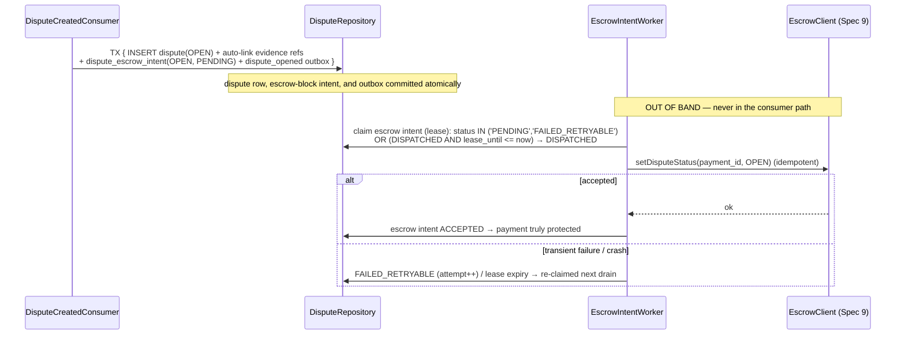
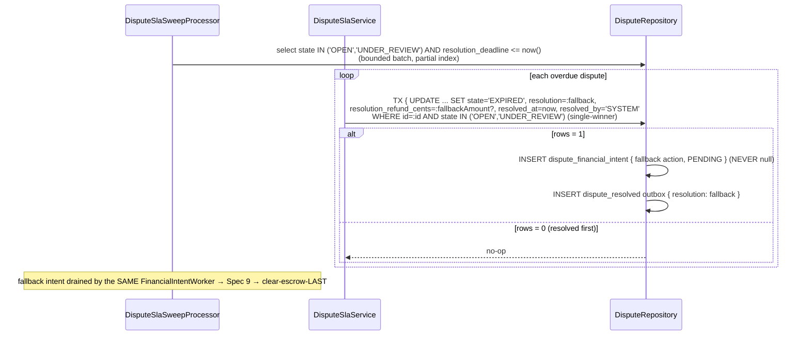

# Design Document: Dispute System

## Overview

`dispute-system` (Spec 21, the first of Sprint 6 — Polish & Extras) closes the "the job didn't go right" loop. A Host (or, in defined cases, a Cleaner) raises a dispute, evidence is gathered from the durable facts the service already produced, and a resolution is reached — `FAVOR_CLEANER`, `FAVOR_HOST`, or `PARTIAL` — which then drives the escrow's existing refund / reversal / release machinery to move (or not move) money. It depends on service-completion (Spec 20, ✅), which routes disputes into it, and on stripe-escrow (Spec 9, ✅), which owns all money movement.

**It owns the dispute case and its resolution; it never reimplements money movement.** The escrow module (Spec 9) already has the financial mechanics: an escrow `disputeStatus` that blocks refunds/auto-release while open, the `refund-policy` (`decideRefund` / proportional reversal) with pre-release refund vs post-release refund+reversal, ceilings, and idempotent Stripe refund/reversal/release calls. `dispute-system` **owns the dispute lifecycle** — `OPEN → UNDER_REVIEW → RESOLVED | EXPIRED` — and, on resolution, **durably enqueues** the resulting financial action (release / full refund / partial refund) that Spec 9 executes. It never issues a Stripe call itself, never recomputes commission, and never bypasses Spec 9's ceilings or idempotency. Spec 9 remains the source of truth for money.

It **invents almost nothing** — it composes patterns already proven in the sibling specs, narrowed to the dispute case:

1. **Creation is triggered by a durable event, never a synchronous call.** `dispute-system` consumes the `service_disputed` outbox fact Spec 20 emits, draining it via its **own per-consumer checkpoint** (`consumer_name = 'dispute'`) over Spec 20's `completion_outbox` fan-out, and creates the dispute idempotently. This is the exact fan-out / per-consumer-checkpoint discipline Spec 20's own consumers (Push/Spec 16, reputation/Spec 22) share. service-completion never calls this module; a dispute-creation failure never rolls back the completion.
2. **Every money-bearing transition is single-winner + durable-intent.** `OPEN`, `UNDER_REVIEW`, `RESOLVED`, `EXPIRED` are conditional writes (`WHERE state = :expected`) so exactly one wins. Opening persists a durable **escrow-block intent** in the same transaction as the dispute row; resolving/expiring persists exactly one durable **financial-action intent** in the same transaction as the terminal transition. Separate workers drain those intents into Spec 9 with idempotent retries. A crash never leaves a dispute OPEN with an unblocked escrow, and never leaves a resolved dispute with no money effect. This is the durable-release-intent pattern from service-completion (Spec 20), applied twice (block + settle).
3. **Clear-escrow-LAST.** `disputeStatus = OPEN` is set durably on open and cleared to `NONE` only **after** Spec 9 has durably accepted the resolution's (or fallback's) financial action. There is never a window where the payment is unblocked while the refund/release has not yet landed.
4. **Evidence is referenced, never re-derived.** The dispute links typed references to the durable facts already recorded upstream — the checklist + its before/after photos (Spec 19), the on-arrival video-verification decision (Spec 18), the service-tracking arrival fact (Spec 17), plus the Host/Cleaner's own submitted reason + photos. Only the Host/Cleaner's own uploaded photos use the grant-gated MinIO upload pattern (Spec 19/14); everything else is a reference resolved to a short-lived pre-signed URL (visual) or gated structured data (structured). It never mutates the checklist, the verification, or the payment ledger.
5. **Time-bounded, never stuck.** Evidence and resolution windows are snapshotted, durable, and server-swept. A dispute past its resolution SLA converges to `EXPIRED` with a configured fallback resolution and its financial intent, so the escrow block is always eventually cleared. This mirrors service-completion's server-authoritative auto-release sweep.
6. **`GET` reconciliation is authority; realtime is advisory.** Dispute state + durable intents + `GET /disputes/:id` are authoritative; a missed push never changes a resolution or a money effect.

### Phase is derived from Spec 9's ACTUAL payment state (not the completion decision)

A completion being `CONFIRMED`/`AUTO_RELEASED` (Spec 20) only means a release **intent** exists — the money may not yet be released (Spec 20's `release_status` can still be `PENDING`/`DISPATCHED`). So `phase` (`PRE_RELEASE` vs `POST_RELEASE`) is derived from **Spec 9's authoritative payment state** — whether the escrow release has actually been accepted/executed — via a small read on the payment, never from `CONFIRMED`/`AUTO_RELEASED` as a proxy. This matters because the resolution's financial action differs: `PRE_RELEASE` → refund only (funds still HELD); `POST_RELEASE` → refund + proportional transfer-reversal (funds already paid). Spec 20 already enforces the money-safe boundary by only routing a **post-release** dispute once `release_status = ACCEPTED`; `dispute-system` re-derives the phase from Spec 9 at creation as the authoritative source and stores it as a snapshot on the dispute (the resolution uses the derived phase; Spec 9 still computes the exact amounts + ceilings at drain time).

### The Spec 9 contract this spec relies on (small additive extension)

Spec 9 already exposes `applyDisputeEvent(...)`, `RefundService.refund(...)`, `EscrowReleaseService.release(...)`, `decideRefund` / proportional reversal, ceilings, and idempotency, and models an escrow `disputeStatus` (`NONE|OPEN|WON|LOST`). This spec relies on two things from Spec 9, treated as a **cross-module contract** (documented below), both of which are additive and do not change Spec 9's money math:

- **`setDisputeStatus(paymentId, OPEN | NONE)`** — idempotently set/clear the platform-driven dispute block that suppresses auto-release + ad-hoc refunds. (Spec 9 already reaches `OPEN` via Stripe `charge.dispute.*`; this is the platform-initiated setter for a BidClean dispute. It is the same `disputeStatus` guard, not a new mechanism.)
- **A read of the authoritative payment state** to derive `phase` (release accepted? funds HELD vs RELEASED) — exposed via the existing `PaymentView` / `getPaymentForOffer`-style read.

`dispute-system` holds no Stripe keys and makes no Stripe calls; it only calls these internal Spec 9 methods via a thin, injectable, mockable client.

### Authority split (kept strict)

- **PostgreSQL is the source of truth for the dispute case + evidence references + resolution decision.** The `disputes` row (state, reason, initiator, linked completion/payment, phase snapshot, resolution, snapshotted deadlines, timestamps), the `dispute_evidence` rows (typed references + Host/Cleaner submissions), the `dispute_escrow_intents`, and the `dispute_financial_intents` are durable. It is **not** the money ledger and never a second one.
- **The escrow module (Spec 9) is the source of truth for money.** `disputeStatus`, refunds, reversals, release, payout state, ceilings, and idempotency all live in payments and are authoritative there. `dispute-system` never calls Spec 9 synchronously "after" a transition: it persists a durable intent in the same transaction and a worker drives it to acceptance.
- **Upstream specs own their evidence.** Checklist/photos (Spec 19), video-verification (Spec 18), service-tracking (Spec 17) are authoritative for what they recorded; `dispute-system` references, never rewrites, them.
- **The completion routing owns the trigger.** A dispute is created in reaction to the durable `service_disputed` fact from Spec 20, drained via this module's own outbox checkpoint.

This design maps every requirement and correctness invariant (REQ-DS1 … REQ-DS12) to concrete, verifiable properties **P1 … P14** (below), each backed by tests.

### Responsibility Matrix

| Responsibility | Mobile (Host) | Mobile (Cleaner) | NestJS API (this module) | PostgreSQL | Escrow (Spec 9) | service-completion (Spec 20) | Upstream evidence (17/18/19) |
|---|:---:|:---:|:---:|:---:|:---:|:---:|:---:|
| Emit `service_disputed` (routing) | ✅ (trigger) | ❌ | ❌ | ❌ | ❌ | ✅ (outbox) | ❌ |
| Consume `service_disputed`, create dispute (idempotent) | ❌ | ❌ | ✅ | ✅ (source of truth) | ❌ | ❌ | ❌ |
| Derive `phase` from actual payment state | ❌ | ❌ | ✅ | ✅ (snapshot) | ✅ (read) | ❌ | ❌ |
| Persist escrow-block intent (OPEN) in open tx | ❌ | ❌ | ✅ | ✅ | ❌ | ❌ | ❌ |
| Drive `setDisputeStatus(OPEN)` → accepted | ❌ | ❌ | ✅ (worker) | ✅ | ✅ (owns block) | ❌ | ❌ |
| Attach Host/Cleaner reason + photo evidence | ✅ | ✅ | ✅ (grant) | ✅ | ❌ | ❌ | ❌ |
| Link typed upstream references | ❌ | ❌ | ✅ | ✅ | ❌ | ❌ | ✅ (owns facts) |
| Resolve evidence to gated URLs / data | ❌ (view) | ❌ (view) | ✅ | ❌ | ❌ | ❌ | ✅ (bytes) |
| Choose resolution (single-winner RESOLVED) | ❌ | ❌ | ✅ (resolver) | ✅ | ❌ | ❌ | ❌ |
| Persist financial-action intent in resolve tx | ❌ | ❌ | ✅ | ✅ | ❌ | ❌ | ❌ |
| Drain financial intent → refund/reversal/release | ❌ | ❌ | ✅ (worker) | ✅ | ✅ (executes) | ❌ | ❌ |
| Compute exact amounts + ceilings + reversal | ❌ | ❌ | ❌ | ❌ | ✅ | ❌ | ❌ |
| Clear escrow (NONE) after Spec 9 accepts | ❌ | ❌ | ✅ (worker) | ✅ | ✅ (owns block) | ❌ | ❌ |
| SLA sweep → EXPIRED + fallback | ❌ | ❌ | ✅ (job) | ✅ | ❌ | ❌ | ❌ |
| Emit `dispute_opened`/`dispute_resolved` | ❌ | ❌ | ✅ (outbox) | ✅ | ❌ | ❌ | ❌ |
| View dispute state / evidence / outcome | ✅ | ✅ | ✅ (data) | ❌ | (state ref) | ❌ | ❌ |
| `GET` reconciliation | ✅ (trigger) | ✅ (trigger) | ✅ (data) | ❌ | ❌ | ❌ | ❌ |

### Ownership Boundary — dispute-system vs escrow vs service-completion vs upstream evidence

```
service-completion (Spec 20)                dispute-system module (NEW)                     stripe-escrow (Spec 9)
  completion_outbox: service_disputed  ──►    DisputeCreatedConsumer                          setDisputeStatus(paymentId, OPEN|NONE)
   (fan-out source; per-consumer               drains service_disputed for consumer_name       RefundService.refund(...)  (pre/post-release)
    checkpoints)                               = 'dispute' (its OWN checkpoint row)      ◄──── EscrowReleaseService.release(...)
                                               → DisputeCreationService                        decideRefund / proportional reversal (ceilings)
                                               .createFromRouting()                            reads payment state → phase (release accepted?)
                                              (idempotent, partial-UNIQUE active dispute)

dispute-system owns:                        upstream evidence (referenced, never copied)
  disputes (the CASE + resolution)             checklist + photos (Spec 19)  ── CHECKLIST_REF / CHECKLIST_PHOTO_REF
  the single-winner state machine              video-verification (Spec 18)  ── VERIFICATION_REF
  the snapshotted evidence/resolution windows  service-tracking arrival (Spec 17) ── ARRIVAL_REF
  dispute_escrow_intents (OPEN then NONE)      Host/Cleaner submissions ── HOST_PHOTO / HOST_REASON / NOTE (grant-gated MinIO)
  dispute_financial_intents (release/refund)
  the SLA sweep (fallback resolution)        downstream:
  the dispute-evidence MinIO bucket            dispute_outbox: dispute_opened / dispute_resolved ──► Push (Spec 16)
  dispute_outbox (lifecycle events)                                                           via its OWN checkpoint
```

- **Spec 20 is the source of truth for the routing trigger.** It emits `service_disputed { completionId, offerId, disputeId }` into its `completion_outbox` (fan-out, drained by per-consumer checkpoints keyed by `(event_id, consumer_name)`). `dispute-system` is the `consumer_name = 'dispute'` consumer: it drains rows it has not yet acked, creates the dispute, then acks only its own `(event_id, 'dispute')` row — coexisting with the Push (Spec 16) consumer that acks the same event.
- **Spec 9 is the source of truth for money.** `dispute-system` calls only the internal `setDisputeStatus` / `RefundService.refund` / `EscrowReleaseService.release` via a mockable client, always through a durable intent + worker, never synchronously in a request path. It consumes no Stripe keys.
- **Upstream specs own their evidence.** `dispute-system` stores typed references and resolves them to gated URLs/data on read; it never copies bytes and never mutates upstream records.
- Dependency is one-directional (dispute-system → Spec 20 `completion_outbox` read-only via its checkpoint; → Spec 9 internal methods; → upstream references read-only). It introduces no new coupling into the escrow, completion, checklist, verification, or offer contracts beyond creating the dispute from routing, setting `disputeStatus`, referencing evidence, and enqueuing the resolution's financial action.

## Architecture

```mermaid
graph TB
    subgraph Mobile["📱 Mobile (Expo / RN)"]
        HostScreen["DisputeHostScreen<br/>open · reason · photos · deadline · outcome"]
        CleanerScreen["DisputeCleanerScreen<br/>counter-evidence · paused indicator · outcome"]
        EvidenceView["EvidenceGallery<br/>(participant-gated URLs / structured data)"]
        Store["dispute.store.ts (Zustand)"]
        Api["dispute.api.ts (open/evidence/GET)"]
        Reconcile["reconcile via GET / advisory realtime"]
    end

    subgraph API["🟩 NestJS API — dispute-system module"]
        Ctrl["DisputeController<br/>GET /:id · POST evidence request-upload/finalize · GET evidence url · POST resolve"]
        CreateSvc["DisputeCreationService<br/>(createFromRouting, idempotent, phase-derive)"]
        LifecycleSvc["DisputeLifecycleService<br/>(open/under-review/resolve, single-winner)"]
        ResolutionSvc["DisputeResolutionService<br/>(resolution → financial intent mapping)"]
        SlaSvc["DisputeSlaService<br/>(EXPIRED + fallback, single-winner)"]
        EvidenceSvc["DisputeEvidenceService<br/>(grant / finalize / link / resolve refs)"]
        InitiationPolicy["DisputeInitiationPolicy<br/>(role, reason_code, phase) → allow/deny"]
        Participation["DisputeParticipationService<br/>isParticipant / isResolver"]
        Repo["DisputeRepository<br/>(single-winner writes + outbox + intents)"]
        EscrowIntentRepo["DisputeEscrowIntentRepository"]
        FinIntentRepo["DisputeFinancialIntentRepository"]
        EvidenceRepo["DisputeEvidenceRepository + DisputeUploadGrantRepository"]
        Storage["DisputeEvidenceStorageService<br/>(minio: presign PUT/GET, inspect, delete)"]
        EscrowClient["EscrowClient<br/>(setDisputeStatus/refund/release/readPayment)"]
        RefReader["UpstreamEvidenceReader<br/>(resolve checklist/verification/arrival refs)"]
        DisputeConsumer["DisputeCreatedConsumer<br/>(drains service_disputed, consumer_name='dispute')"]
        EscrowWorker["EscrowIntentWorker<br/>(drain OPEN/NONE → setDisputeStatus)"]
        FinWorker["FinancialIntentWorker<br/>(drain PENDING → refund/release, then queue NONE)"]
        SlaSweep["DisputeSlaSweepProcessor<br/>(deadline passed → EXPIRED + fallback)"]
        RetentionJob["EvidenceRetentionProcessor · TombstoneDrainProcessor · StaleGrantCleanupProcessor"]
        OutboxCheckpoint["CompletionOutboxConsumerCheckpoint (reused, consumer_name='dispute')"]
    end

    subgraph Escrow["💳 stripe-escrow (Spec 9)"]
        SetStatus["setDisputeStatus(OPEN|NONE)"]
        Refund["RefundService.refund(...)"]
        Release["EscrowReleaseService.release(...)"]
        PayRead["payment state read → phase"]
    end

    subgraph Infra["🗄️ Infra"]
        PG[("PostgreSQL<br/>disputes · dispute_evidence ·<br/>dispute_upload_grants · dispute_escrow_intents ·<br/>dispute_financial_intents · dispute_object_deletions ·<br/>dispute_outbox")]
        Minio[("MinIO<br/>dispute-evidence (private)")]
        Redis["Redis + BullMQ<br/>(sweeps · intent drains · cleanup)"]
        CompletionOutbox[("completion_outbox (Spec 20)<br/>+ completion_outbox_consumers")]
    end

    subgraph Downstream["Downstream consumers"]
        Push["push-notifications (Spec 16)"]
    end

    HostScreen --> Store
    CleanerScreen --> Store
    EvidenceView --> Store
    Store --> Api
    Store --> Reconcile
    Api --> Ctrl

    CompletionOutbox -->|"service_disputed fan-out"| DisputeConsumer
    DisputeConsumer --> OutboxCheckpoint --> CompletionOutbox
    DisputeConsumer --> CreateSvc --> Repo
    CreateSvc --> EscrowClient --> PayRead

    Ctrl --> LifecycleSvc
    Ctrl --> ResolutionSvc
    Ctrl --> EvidenceSvc
    Ctrl --> Participation
    LifecycleSvc --> InitiationPolicy
    LifecycleSvc --> Repo --> PG
    ResolutionSvc --> Repo
    ResolutionSvc --> FinIntentRepo
    EvidenceSvc --> EvidenceRepo
    EvidenceSvc --> Storage -->|"presigned PUT/GET"| Minio
    EvidenceSvc --> RefReader
    Repo --> EscrowIntentRepo
    Repo -->|"dispute_outbox"| PG
    PG -->|"dispute_opened / dispute_resolved"| Push

    Redis --> EscrowWorker --> EscrowIntentRepo
    EscrowWorker --> EscrowClient --> SetStatus
    Redis --> FinWorker --> FinIntentRepo
    FinWorker --> EscrowClient
    EscrowClient --> Refund
    EscrowClient --> Release
    FinWorker -->|"on ACCEPTED → queue NONE"| EscrowIntentRepo
    Redis --> SlaSweep --> SlaSvc --> Repo
    Redis --> RetentionJob --> Storage
```



### Data flow — creation (durable-first, idempotent, own checkpoint, phase from actual payment state)

1. Spec 20 commits its dispute-routing transition and, in the same transaction, writes a `service_disputed` `completion_outbox` row carrying `{ completionId, offerId, disputeId }`. (`disputeId` is Spec 20's generated correlation id; this module uses it for deterministic idempotency, see below.)
2. `DisputeCreatedConsumer` drains `service_disputed` rows with **no `completion_outbox_consumers` row for `consumer_name = 'dispute'`** (`NOT EXISTS`, ordered by `created_at`, bounded batch), reusing Spec 20's checkpoint table. For each it calls `DisputeCreationService.createFromRouting(payload)`, then acks its own `(event_id, 'dispute')` row (`ON CONFLICT DO NOTHING`).
3. `createFromRouting` resolves participants (`host_id`/`cleaner_id`), `initiator`/`initiator_role`, and `payment_id` server-side from the offer bound to the completion; **reads Spec 9's authoritative payment state via `EscrowClient` to derive `phase`** (`POST_RELEASE` iff the release has actually been accepted/executed, else `PRE_RELEASE`) and snapshots it on the dispute; snapshots `evidence_deadline = now + DISPUTE_EVIDENCE_WINDOW_MS` and `resolution_deadline = now + DISPUTE_RESOLUTION_SLA_MS`; then, in ONE transaction: `INSERT ... ON CONFLICT (service_completion_id) WHERE state IN ('OPEN','UNDER_REVIEW') DO NOTHING` the `disputes` row (`state = OPEN`), auto-links the typed upstream references as `dispute_evidence` rows, and persists a `dispute_escrow_intent { payment_id, target = OPEN, status = PENDING }` — all atomically. It also writes a `dispute_opened` `dispute_outbox` row in the same transaction. The partial-unique guarantees at most one **active** dispute per completion; a redelivered event (or a concurrent create) is a no-op.

> The partial-unique cannot be expressed as `ON CONFLICT` directly (it is a partial index, not a full constraint). Creation therefore runs the insert guarded by the partial-unique inside a `SERIALIZABLE`/advisory-locked transaction keyed by `service_completion_id`: the index makes a second active insert fail, which the service maps to an idempotent no-op. Deterministic dedup uses `disputeId` (from the routing payload) as the `dispute_outbox` `event_id`.

### Data flow — open blocks the escrow (durable, crash-safe, clear-escrow-LAST begins here)



- The open transaction commits the dispute, the auto-linked evidence references, the `OPEN` escrow-block intent, and the `dispute_opened` outbox event **atomically**. A crash between committing the dispute and blocking the escrow is fully recoverable: the `EscrowIntentWorker` claims the intent via a single-winner lease and drives `setDisputeStatus(OPEN)` to `ACCEPTED` idempotently. The payment is treated as **truly protected** only once Spec 9 accepts `OPEN` — so a dispute is never OPEN while the payment is still auto-release-eligible (REQ-DS2).

### Data flow — resolution (single-winner decision → durable financial intent → worker → Spec 9 → clear-escrow-LAST)

```mermaid
sequenceDiagram
    participant Resolver as Resolver (operator / policy)
    participant Ctrl as DisputeController
    participant Res as DisputeResolutionService
    participant Repo as DisputeRepository
    participant FinWorker as FinancialIntentWorker
    participant Escrow as EscrowClient (Spec 9)
    participant EscrowWorker as EscrowIntentWorker

    Resolver->>Ctrl: POST /disputes/:id/resolve { resolution, refundCents? }
    Ctrl->>Res: resolve(id, resolverId, dto)
    Res->>Repo: TX { UPDATE disputes SET state='RESOLVED', resolution, resolution_refund_cents,<br/>resolved_at, resolved_by WHERE id=:id AND state IN ('OPEN','UNDER_REVIEW') (single-winner)
    alt rows = 1 (winner)
        Repo->>Repo: INSERT dispute_financial_intent { action, amount?, status=PENDING }
        Repo->>Repo: INSERT dispute_resolved outbox
        Repo-->>Res: committed (disputeStatus STILL OPEN — not cleared yet)
        Res-->>Ctrl: 200 RESOLVED
    else rows = 0 (already terminal)
        Res-->>Ctrl: 200 idempotent (if same) / 409 (if terminal-different)
    end
    Note over FinWorker,Escrow: OUT OF BAND
    FinWorker->>Repo: claim financial intent (lease)
    FinWorker->>Escrow: FAVOR_CLEANER → release(payment_id) · FAVOR_HOST/PARTIAL → refund(payment_id, amount?)
    Note over Escrow: Spec 9 computes exact amounts, applies ceilings, proportional reversal if POST_RELEASE
    alt accepted
        Escrow-->>FinWorker: ok (or ceiling-clamped outcome surfaced)
        FinWorker->>Repo: financial intent ACCEPTED
        FinWorker->>Repo: ONLY NOW INSERT dispute_escrow_intent { target=NONE, PENDING }
        EscrowWorker->>Escrow: setDisputeStatus(payment_id, NONE)  (escrow unblocked LAST)
    else transient failure
        FinWorker->>Repo: FAILED_RETRYABLE (attempt++) → retried; disputeStatus STAYS OPEN
    end
```

- Resolution is a single-winner conditional write that co-persists the resolution fields AND exactly one `dispute_financial_intent` AND the `dispute_resolved` outbox, all in one transaction; it **never** calls Stripe in the request path (REQ-DS4).
- The `FinancialIntentWorker` maps the resolution to a Spec 9 call — `FAVOR_CLEANER → EscrowReleaseService.release`, `FAVOR_HOST → full refund`, `PARTIAL → partial refund(amount)` — with idempotent retries. Spec 9 computes exact amounts, enforces ceilings, and performs the proportional reversal for `POST_RELEASE` (REQ-DS5). `dispute-system` never overrides a ceiling; a clamp/block outcome is surfaced on the intent.
- **Clear-escrow-LAST:** the `NONE` escrow-block intent is enqueued **only after** the financial intent is `ACCEPTED`. `disputeStatus` therefore stays `OPEN` until the refund/release has durably landed — there is never an unblocked window (REQ-DS2b).

### Data flow — SLA sweep (never stuck; EXPIRED always fully settled)



- The sweep evaluates the **snapshotted** `resolution_deadline` (never a client timer, never a live config value — REQ-DS8). A resolved/terminal dispute is excluded (state changed). It is bounded, idempotent, single-winner.
- An `EXPIRED` dispute is **never** left with `resolution = NULL` or no financial intent: the transition co-persists the configured `DISPUTE_FALLBACK_RESOLUTION` and its `dispute_financial_intent` in the same transaction (REQ-DS7). The escrow is cleared to `NONE` only after Spec 9 accepts the fallback's financial action (same clear-escrow-LAST sequencing).
- Resolution racing SLA expiry resolves to exactly one terminal (`RESOLVED` or `EXPIRED`) via the single-winner conditional writes, so **never two financial intents** for one dispute (REQ-DS6).

### Data flow — evidence (referenced, gated; Host/Cleaner uploads grant-gated)

- **Auto-linked upstream references** (created with the dispute): `CHECKLIST_REF` + `CHECKLIST_PHOTO_REF` (Spec 19), `VERIFICATION_REF` (Spec 18), `ARRIVAL_REF` (Spec 17). Stored as `dispute_evidence` rows holding a **stable reference** (upstream ids), never a byte copy.
- **Host/Cleaner submissions** (`HOST_PHOTO`, `HOST_REASON`, `NOTE`): reason/notes are structured rows; photos use the **grant-gated MinIO upload** pattern (Spec 19/14) — server persists a single-use grant `{ objectKey, disputeId, issuedTo, expiry }` FIRST, mints a short-lived pre-signed PUT, the client PUTs bytes directly to MinIO, and finalize re-checks authorization + the evidence window + server-inspects the object before inserting the `dispute_evidence` row (`kind = HOST_PHOTO`) and consuming the grant.
- **Reading evidence** (`GET .../evidence/:evidenceId/url`): **visual** kinds (`HOST_PHOTO`, `CHECKLIST_PHOTO_REF`) resolve to a short-lived participant/resolver-gated pre-signed GET (object key resolved server-side, never client-supplied); **structured** kinds (`CHECKLIST_REF`, `VERIFICATION_REF`, `ARRIVAL_REF`, `HOST_REASON`, `NOTE`) resolve to authorized structured data via `UpstreamEvidenceReader`, NOT a URL. Evidence is never public and never exposed outside the dispute's authorized viewers (REQ-DS3).
- **Window gate:** evidence submitted after the snapshotted `evidence_deadline` is rejected (or flagged late per config), so the resolver decides on a bounded, stable evidence set.

## Components and Interfaces

### Backend — dispute-system module (`services/api/src/dispute-system/`)

```
services/api/src/dispute-system/
├── dispute-system.module.ts
├── dispute.controller.ts
├── dispute.types.ts                          # enums, internal view/summary types
├── dispute.constants.ts                      # env-configurable values + queue names
├── config/
│   └── validate-dispute-config.ts            # fail-fast validateDisputeConfig()
├── policy/
│   ├── dispute-initiation.policy.ts          # (role, reason_code, phase) → allow/deny (pure)
│   └── resolution-mapping.ts                 # resolution → financial action (pure)
├── service/
│   ├── dispute-creation.service.ts           # createFromRouting (idempotent, phase-derive)
│   ├── dispute-lifecycle.service.ts          # open / under-review / resolve (single-winner)
│   ├── dispute-resolution.service.ts         # resolution → financial intent
│   ├── dispute-sla.service.ts                # EXPIRED + fallback (single-winner)
│   ├── dispute-evidence.service.ts           # grant / finalize / link / resolve refs
│   └── dispute-participation.service.ts      # isParticipant / isResolver
├── escrow/
│   └── escrow.client.ts                      # thin, injectable, mockable Spec 9 client
├── evidence/
│   └── upstream-evidence.reader.ts           # resolve checklist/verification/arrival refs
├── storage/
│   └── dispute-evidence-storage.service.ts   # minio: presign PUT/GET, inspect, delete
├── repository/
│   ├── dispute.repository.ts                 # single-winner writes + outbox + intents (one tx)
│   ├── dispute-escrow-intent.repository.ts   # OPEN/NONE drain / claim / accept / fail
│   ├── dispute-financial-intent.repository.ts# PENDING drain / claim / accept / fail
│   ├── dispute-evidence.repository.ts
│   ├── dispute-upload-grant.repository.ts
│   └── dispute-object-deletion.repository.ts
├── consumers/
│   └── dispute-created.consumer.ts           # drains service_disputed (consumer_name='dispute')
├── jobs/
│   ├── escrow-intent.worker.ts               # drain OPEN/NONE → setDisputeStatus
│   ├── financial-intent.worker.ts            # drain PENDING → refund/release, then queue NONE
│   ├── dispute-sla-sweep.processor.ts        # deadline passed → EXPIRED + fallback
│   ├── evidence-retention.processor.ts       # hard-delete evidence past retention
│   ├── tombstone-drain.processor.ts          # drain PENDING object deletions
│   └── stale-grant-cleanup.processor.ts      # orphan object + stale ISSUED grant
├── dto/
│   ├── open-dispute-evidence.dto.ts
│   ├── request-evidence-upload.dto.ts
│   ├── finalize-evidence.dto.ts
│   └── resolve-dispute.dto.ts
├── entities/
│   ├── dispute.entity.ts
│   ├── dispute-evidence.entity.ts
│   ├── dispute-escrow-intent.entity.ts
│   └── dispute-financial-intent.entity.ts
├── __tests__/  (see Testing Strategy)
└── README.md
```

**`DisputeCreationService`** — idempotent creation off the `service_disputed` fact.
- `createFromRouting(payload)` — resolve participants + `payment_id` from the offer; **derive `phase` from Spec 9's authoritative payment state** via `EscrowClient.readPaymentPhase(paymentId)` and snapshot it; snapshot `evidence_deadline`/`resolution_deadline`; in ONE transaction insert the `disputes` row (guarded by the partial-unique active constraint), auto-link the typed upstream evidence references, persist the `OPEN` escrow-block intent, and write the `dispute_opened` outbox. Never throws into the consumer batch (per-row try/catch); a creation failure never touches the committed completion routing. Functions ≤30 lines, SRP.

**`DisputeLifecycleService`** — single-winner lifecycle transitions.
- `open(...)` — used only via the creation path (a dispute is born `OPEN`).
- `moveToUnderReview(id, resolverId)` — assert resolver; single-winner `OPEN → UNDER_REVIEW` (evidence gathered / resolver engaged).
- `resolve(id, resolverId, dto)` — assert resolver; validate `(resolution, refundCents?)`; delegate to `DisputeResolutionService` which performs the single-winner `{OPEN|UNDER_REVIEW} → RESOLVED` + financial intent + outbox in one transaction. `rows=0` + same terminal → idempotent; terminal-different → `409`.

**`DisputeResolutionService`** — decision → durable financial intent.
- `resolve(id, resolverId, dto)` — in ONE transaction: single-winner conditional write to `RESOLVED` setting `resolution`/`resolution_refund_cents`/`resolved_at`/`resolved_by`, INSERT exactly one `dispute_financial_intent` (action from `resolution-mapping`), INSERT `dispute_resolved` outbox. `disputeStatus` is **not** cleared here (clear-escrow-LAST). Never calls Stripe.

**`DisputeSlaService`** — never-stuck fallback.
- `expireDue(id)` — single-winner `{OPEN|UNDER_REVIEW} → EXPIRED` setting the configured fallback `resolution` (+ amount), persist the fallback `dispute_financial_intent`, write `dispute_resolved` outbox — all in ONE transaction; `rows=0` → no-op. An `EXPIRED` dispute is never `resolution = NULL`/intent-less.

**`DisputeEvidenceService`** — evidence grant / finalize / link / resolve.
- `requestUpload(id, userId)` — assert participant + dispute non-terminal + within `evidence_deadline`; persist grant FIRST; mint pre-signed PUT; return `{ objectKey, uploadUrl, expiresAt }`.
- `finalizeUpload(id, userId, dto)` — transaction: re-verify grant + window + participant, server-inspect object (authoritative), insert `dispute_evidence (kind=HOST_PHOTO)`, consume grant.
- `addStructuredEvidence(id, userId, dto)` — insert `HOST_REASON`/`NOTE` rows within the window.
- `linkUpstreamReferences(disputeId, ctx, manager)` — insert the typed `CHECKLIST_REF`/`CHECKLIST_PHOTO_REF`/`VERIFICATION_REF`/`ARRIVAL_REF` rows at creation.
- `resolveEvidence(id, userId, evidenceId)` — participant/resolver-gated; visual → short-lived pre-signed GET (key from DB); structured → gated data via `UpstreamEvidenceReader`.

**`DisputeInitiationPolicy`** (pure) — `assertAllowed(role, reasonCode, phase)`: a deterministic, config-driven decision over the allowed `(role, reason_code, phase)` combinations. The **Host may initiate** within the window on a completed/released service; the **Cleaner may initiate only** a defined payout/non-release grievance and never a service-quality dispute against themselves. Server-enforced, never client-asserted.

**`DisputeParticipationService`** — `isParticipant(userId, dispute)` (from offer `host_id`/`cleaner_id`) / `isResolver(userId)` (authorized resolver role). Single source of the authorization rule used by every endpoint; a nulled participant after user deletion resolves to non-participant for that id — history retained.

**`EscrowClient`** (thin, injectable, mockable — the ONLY bridge to Spec 9)
```typescript
interface EscrowClient {
  readPaymentPhase(paymentId: string): Promise<DisputePhase>;         // POST_RELEASE iff release accepted, else PRE_RELEASE
  setDisputeStatus(paymentId: string, target: 'OPEN' | 'NONE'): Promise<void>;  // idempotent
  release(paymentId: string, reason: 'DISPUTE_FAVOR_CLEANER'): Promise<EscrowActionOutcome>;
  refund(paymentId: string, amountCents: number | null): Promise<EscrowActionOutcome>; // null = full
}
// EscrowActionOutcome carries { accepted, ceilingClamped?, effectiveAmountCents?, blocked?, reason? }
```
Holds no Stripe keys; delegates to Spec 9's `setDisputeStatus` / `EscrowReleaseService.release` / `RefundService.refund`, which own amounts, ceilings, and idempotency.

**`UpstreamEvidenceReader`** — resolves structured references read-only: checklist state + completion summary (Spec 19), verification decision (Spec 18), arrival fact (Spec 17). Never mutates upstream; returns gated data, not URLs.

**`DisputeEvidenceStorageService`** (mirrors `VoiceNoteStorageService` / checklist-photos storage, `minio` client)
- `issueUploadTarget(): { objectKey, uploadUrl }` — unguessable `crypto.randomUUID()`-based key in the private `DISPUTE_EVIDENCE_MINIO_BUCKET` + `presignedPutObject` with `DISPUTE_EVIDENCE_UPLOAD_URL_TTL_SECONDS`. Ensures the bucket exists (private) on init.
- `getPlaybackUrl(objectKey): string` — `presignedGetObject` with `DISPUTE_EVIDENCE_PLAYBACK_URL_TTL_SECONDS`.
- `inspectObject(objectKey): { exists, sizeBytes, contentType, width?, height? }` — **authoritative** validation (size ≤ max, allowed image MIME, dimensions probed). Client metadata advisory.
- `deleteObjectSafe(objectKey): void` — idempotent `removeObject`.

**`DisputeRepository`** (`disputes` + `dispute_outbox`, coordinates intents + evidence links)
- `createDisputeActive(params, manager)` — insert guarded by the partial-unique active constraint; maps a partial-unique violation to an idempotent no-op.
- `transition(id, expected, next, derivedFields, financialIntent?, outboxEvents, manager)` — the single-winner `UPDATE ... WHERE id=:id AND state=:expected` that sets derived fields AND (on resolve/expire) inserts exactly one `dispute_financial_intent` AND writes the `dispute_outbox` row(s), all in ONE transaction. Returns rows affected (winner=1).
- `findById`, `findByCompletionActive`, `findDueForSla(now, limit)` (partial-index scan `state IN ('OPEN','UNDER_REVIEW') AND resolution_deadline <= now`).

**`DisputeEscrowIntentRepository`** (`dispute_escrow_intents`) / **`DisputeFinancialIntentRepository`** (`dispute_financial_intents`)
- `enqueue(...)` (in the resolving/opening tx), `drainClaimable(limit)` (`status IN ('PENDING','FAILED_RETRYABLE') OR (DISPATCHED AND lease_until <= now)`), `claimForDispatch(id, leaseMs)` (single-winner lease), `markAccepted(id)` / `markFailedRetryable(id)` (attempt++, clear lease). All idempotent per final state. The lease-based `DISPATCHED` reclaim mirrors service-completion's release-intent worker.

**`DisputeCreatedConsumer`** (relay) — drains `service_disputed` rows unacked for `consumer_name = 'dispute'` (reusing Spec 20's `CompletionOutboxConsumerCheckpoint.drainUnacked('dispute', batch)`), calls `createFromRouting`, then `ack(eventId, 'dispute')`. At-least-once + idempotent (dedup by the partial-unique + `disputeId`). Row-scoped try/catch so one bad row never stalls the batch.

**`EscrowIntentWorker`** (BullMQ repeatable) — drains claimable `dispute_escrow_intents`, claims via lease, calls `EscrowClient.setDisputeStatus(payment_id, target)` (`OPEN` on open, `NONE` on clear), marks `ACCEPTED`/`FAILED_RETRYABLE`. The only path that sets the escrow block; holds no Stripe keys.

**`FinancialIntentWorker`** (BullMQ repeatable) — drains claimable `dispute_financial_intents`, claims via lease, maps to `EscrowClient.release`/`refund`, marks `ACCEPTED` on Spec 9 acceptance (surfacing any ceiling clamp/block) or `FAILED_RETRYABLE`. **On `ACCEPTED` it enqueues the `NONE` escrow-block intent** — the single point that begins clearing the escrow, guaranteeing clear-escrow-LAST.

**`DisputeSlaSweepProcessor`** (BullMQ repeatable; interval/batch from config) — selects due non-terminal disputes (partial index), calls `DisputeSlaService.expireDue(id)` per row (single-winner, idempotent).

**`EvidenceRetentionProcessor` / `TombstoneDrainProcessor` / `StaleGrantCleanupProcessor`** (BullMQ repeatable) — the checklist-photos/voice-notes storage-cleanup trio: retention hard-deletes evidence objects past `DISPUTE_EVIDENCE_RETENTION_DAYS` (clock from `uploaded_at`, metadata retained); the tombstone drain deletes objects whose owning row cascaded away; stale-grant cleanup deletes orphan objects from never-finalized uploads and closes stale `ISSUED` grants. Bounded, idempotent.

**`DisputeController`** (`@Controller('disputes') @UseGuards(JwtAuthGuard)`, whitelisting `ValidationPipe`):

| Method | Path | Actor | Description |
|---|---|---|---|
| `GET` | `/disputes/:id` | Participant or resolver | Authoritative state + phase + resolution + evidence refs + snapshotted deadlines (reconcile path) |
| `POST` | `/disputes/:id/evidence/request-upload` | Participant | Grant-gated PUT target for a photo (window + non-terminal gated) |
| `POST` | `/disputes/:id/evidence/finalize` | Participant | Finalize an uploaded photo (grant + window + server-inspect) |
| `POST` | `/disputes/:id/evidence` | Participant | Add structured `HOST_REASON`/`NOTE` within the window |
| `GET` | `/disputes/:id/evidence/:evidenceId/url` | Participant or resolver | Visual → short-lived pre-signed GET; structured → gated data |
| `POST` | `/disputes/:id/resolve` | Resolver only | Single-winner `→ RESOLVED` + financial intent + `dispute_resolved` |

Identity from `req.user.keycloakId → userId`; a non-participant/non-resolver receives `403` and learns nothing about the dispute's existence. `setDisputeStatus`/refund/release are **not** REST actions — they are driven only by the intent workers.

Status codes: `200` success/idempotent no-op, `201` grant created, `400` validation (bad resolution/amount, over-limit/wrong-type object), `401` unauthenticated, `403` forbidden (non-participant/non-resolver, initiation policy denied), `404` unknown dispute (no disclosure), `409` conflict (resolve on terminal-different, evidence after deadline, no active dispute), `422` unprocessable (resolution amount surfaced as ceiling-blocked by Spec 9).

### Mobile (`apps/mobile/src/screens/dispute/`)

```
apps/mobile/src/screens/dispute/
├── DisputeHostScreen.tsx            # Host: open (reason + photos) · deadline · outcome
├── DisputeCleanerScreen.tsx         # Cleaner: counter-evidence · auto-release-paused · outcome
├── EvidenceGallery.tsx              # participant-gated evidence viewing (URLs / structured)
├── useResolutionCountdown.ts        # derives countdown from durable resolution_deadline (display only)
├── dispute.api.ts                   # open / request-upload → PUT → finalize / add-note / GET / evidence url
├── dispute.store.ts                 # Zustand
├── dispute.types.ts
├── dispute.constants.ts             # routes, i18n keys, design tokens
├── components/
│   ├── DisputeStatusBadge.tsx
│   ├── ReasonPicker.tsx
│   ├── EvidenceUploader.tsx
│   └── OutcomeSummary.tsx           # favor-cleaner / favor-host / partial + payment effect
├── __tests__/  (see Testing Strategy)
└── README.md
```

- **`dispute.types.ts`** — `Dispute` (`id`, `serviceCompletionId`, `offerId`, `state`, `phase`, `initiatorRole`, `reasonCode`, `resolution?`, `resolutionRefundCents?`, `resolutionDeadline`, `evidenceDeadline`), `DisputeEvidence` (`id`, `kind`, `submittedBy?`, `createdAt` — never a raw key), enums, `ConnectionStatus`. No internal intent fields are exposed.
- **`useResolutionCountdown.ts`** — display-only countdown derived from the durable `resolution_deadline`; on expiry re-fetches via `GET`, never an authoritative client timer.
- **`dispute.store.ts`** (Zustand) — dispute + evidence refs; optimistic open/evidence reconciled via `GET`; idempotent state application (ignore regressions/older/illegal transitions); never persists a bare object key.
- **`DisputeHostScreen`** — open a dispute (reason + optional text + grant-gated photos), reflect `OPEN` with a visible resolution deadline, and the outcome once resolved.
- **`DisputeCleanerScreen`** — see the dispute state, add counter-evidence within the window, an explicit "auto-release paused" indicator, and the outcome + payment effect.
- **`EvidenceGallery`** — participant-gated viewing: visual via fresh pre-signed URLs, structured via gated data; never public.
- **i18n** `en`/`es` parity for all strings; BidClean dark tokens (`#00F5D4` accent for the dispute/submit CTAs, `#0B0C10` background, `#1F2833` cards). Evidence photos are only viewable by authorized parties.

## Data Models

All tables follow the project database standards: `UUID` PK (`gen_random_uuid()`), snake_case, `TIMESTAMP WITH TIME ZONE`, explicit FK `ON DELETE`, indexes on every FK, application-validated `VARCHAR` for `state`/`phase`/`resolution`/`reason_code`/evidence `kind`/intent `action`/`target`/`status` (no PG enums). Reversible migration with `IF NOT EXISTS`, table/column comments. Next migration timestamp is after the last Sprint-5 migration.

### `disputes` (new — the durable dispute CASE + resolution; never the money ledger)

| Column | Type | Notes |
|---|---|---|
| `id` | `UUID PK DEFAULT gen_random_uuid()` | |
| `service_completion_id` | `UUID NOT NULL` | FK → `service_completions(id)` **ON DELETE CASCADE**; indexed |
| `offer_id` | `UUID NOT NULL` | FK → `offers(id)` **ON DELETE CASCADE**; indexed |
| `payment_id` | `UUID NOT NULL` | reference to the escrow payment (Spec 9, its own bounded context); indexed; **no FK cascade from payments** |
| `initiator_id` | `UUID` (nullable) | FK → `users(id)` **ON DELETE SET NULL**; indexed |
| `initiator_role` | `VARCHAR(10) NOT NULL` | app-validated `HOST/CLEANER` |
| `host_id` | `UUID` (nullable) | FK → `users(id)` **ON DELETE SET NULL**; indexed |
| `cleaner_id` | `UUID` (nullable) | FK → `users(id)` **ON DELETE SET NULL**; indexed |
| `phase` | `VARCHAR(15) NOT NULL` | app-validated `PRE_RELEASE/POST_RELEASE`; **derived from Spec 9's actual payment state**, snapshotted at creation |
| `reason_code` | `VARCHAR(40) NOT NULL` | app-validated against `DISPUTE_REASON_CODES` |
| `reason_text` | `TEXT` (nullable) | user content — validated/escaped, never executed |
| `state` | `VARCHAR(15) NOT NULL DEFAULT 'OPEN'` | app-validated `OPEN/UNDER_REVIEW/RESOLVED/EXPIRED` |
| `resolution` | `VARCHAR(15)` (nullable) | app-validated `FAVOR_CLEANER/FAVOR_HOST/PARTIAL`; **NOT NULL once terminal** (data invariant) |
| `resolution_refund_cents` | `INTEGER` (nullable) | requested refund for `FAVOR_HOST`/`PARTIAL`; Spec 9 ceilings it; `CHECK (>= 0)` |
| `evidence_deadline` | `TIMESTAMPTZ NOT NULL` | `= created + DISPUTE_EVIDENCE_WINDOW_MS`; snapshotted, server-swept |
| `resolution_deadline` | `TIMESTAMPTZ NOT NULL` | `= created + DISPUTE_RESOLUTION_SLA_MS`; snapshotted, server-swept |
| `resolved_at` | `TIMESTAMPTZ` (nullable) | set on `→ RESOLVED`/`EXPIRED` |
| `resolved_by` | `VARCHAR(255)` (nullable) | operator id / `SYSTEM` (fallback) |
| `created_at` / `updated_at` | `TIMESTAMPTZ DEFAULT NOW()` | **no `deleted_at`** — a terminal dispute is an immutable audit fact |

Indexes / constraints:
- `uq_disputes_active_completion ON disputes (service_completion_id) WHERE state IN ('OPEN','UNDER_REVIEW')` — **partial-unique: at most one ACTIVE dispute per completion** (REQ-DS1); a new dispute may open after a terminal one.
- FK indexes: `idx_disputes_completion (service_completion_id)`, `idx_disputes_offer (offer_id)`, `idx_disputes_payment (payment_id)`, `idx_disputes_initiator (initiator_id)`, `idx_disputes_host (host_id)`, `idx_disputes_cleaner (cleaner_id)`.
- `idx_disputes_sla (resolution_deadline) WHERE state IN ('OPEN','UNDER_REVIEW')` — bounded SLA-sweep scan.
- `CHECK` on `initiator_role`/`phase`/`reason_code`/`state`/`resolution`.
- `CHECK (state NOT IN ('RESOLVED','EXPIRED') OR resolution IS NOT NULL)` — a terminal dispute always has a resolution (REQ-DS7 data invariant).
- `CHECK (resolution <> 'PARTIAL' OR resolution_refund_cents IS NOT NULL)` — `PARTIAL` carries an amount.

### `dispute_evidence` (new — typed references to durable facts; never copies bytes)

| Column | Type | Notes |
|---|---|---|
| `id` | `UUID PK DEFAULT gen_random_uuid()` | |
| `dispute_id` | `UUID NOT NULL` | FK → `disputes(id)` **ON DELETE CASCADE**; indexed |
| `submitted_by` | `UUID` (nullable) | FK → `users(id)` **ON DELETE SET NULL** |
| `kind` | `VARCHAR(25) NOT NULL` | app-validated `HOST_PHOTO/HOST_REASON/CHECKLIST_REF/CHECKLIST_PHOTO_REF/VERIFICATION_REF/ARRIVAL_REF/NOTE` |
| `object_key` | `VARCHAR(512)` (nullable) | MinIO key for `HOST_PHOTO` only; **`UNIQUE` when set** (partial unique); null for references/structured |
| `ref` | `VARCHAR(512)` (nullable) | stable upstream reference id for structured/photo-ref kinds (never a byte copy, never sensitive content) |
| `text_value` | `TEXT` (nullable) | for `HOST_REASON`/`NOTE` (validated/escaped) |
| `size_bytes` | `INTEGER` (nullable) | server-observed for `HOST_PHOTO` |
| `mime_type` | `VARCHAR(64)` (nullable) | server-observed allowed image type for `HOST_PHOTO` |
| `object_deleted_at` | `TIMESTAMPTZ` (nullable) | set when a `HOST_PHOTO` object is hard-deleted by retention/tombstone (metadata retained) |
| `uploaded_at` | `TIMESTAMPTZ` (nullable) | for `HOST_PHOTO` — **the retention clock starts here** |
| `created_at` | `TIMESTAMPTZ DEFAULT NOW()` | **no `deleted_at`** — evidence metadata is audit |

Indexes/constraints: `idx_dispute_evidence_dispute (dispute_id)`, `idx_dispute_evidence_submitted_by (submitted_by)`; `uq_dispute_evidence_object ON (object_key) WHERE object_key IS NOT NULL`; `idx_dispute_evidence_retention (uploaded_at) WHERE object_key IS NOT NULL AND object_deleted_at IS NULL` (bounded retention scan); `CHECK` on `kind`; a shape `CHECK` (visual `HOST_PHOTO`/`CHECKLIST_PHOTO_REF` carry `object_key`/`ref` respectively; structured kinds carry `ref`/`text_value`, not `object_key`).

### `dispute_escrow_intents` (new — durable escrow-block intent; open never leaves the escrow unblocked)

| Column | Type | Notes |
|---|---|---|
| `id` | `UUID PK DEFAULT gen_random_uuid()` | |
| `dispute_id` | `UUID NOT NULL` | FK → `disputes(id)` **ON DELETE CASCADE**; indexed |
| `payment_id` | `UUID NOT NULL` | passed to `setDisputeStatus`; indexed |
| `target` | `VARCHAR(10) NOT NULL` | app-validated `OPEN/NONE` |
| `status` | `VARCHAR(20) NOT NULL DEFAULT 'PENDING'` | app-validated `PENDING/DISPATCHED/ACCEPTED/FAILED_RETRYABLE` |
| `attempt` | `INTEGER NOT NULL DEFAULT 0` | incremented on `FAILED_RETRYABLE` |
| `dispatched_at` | `TIMESTAMPTZ` (nullable) | set on claim (`→ DISPATCHED`) |
| `lease_until` | `TIMESTAMPTZ` (nullable) | claim lease expiry; a `DISPATCHED` intent past its lease is re-claimable (crash recovery) |
| `last_error` | `TEXT` (nullable) | sanitized (no secrets/PII) |
| `created_at` / `updated_at` | `TIMESTAMPTZ DEFAULT NOW()` | |

Indexes: `idx_dispute_escrow_intents_dispute (dispute_id)`, `idx_dispute_escrow_intents_payment (payment_id)`; `idx_dispute_escrow_intents_drain (created_at) WHERE status IN ('PENDING','FAILED_RETRYABLE','DISPATCHED')` (drain/claim scan). Constraint: `uq_dispute_escrow_intent_target ON (dispute_id, target)` — at most one `OPEN` and one `NONE` intent per dispute (idempotent enqueue backstop). `CHECK` on `target`/`status`.

### `dispute_financial_intents` (new — durable money-effect intent; a crash never loses the resolution's effect)

| Column | Type | Notes |
|---|---|---|
| `id` | `UUID PK DEFAULT gen_random_uuid()` | |
| `dispute_id` | `UUID NOT NULL` | FK → `disputes(id)` **ON DELETE CASCADE**; indexed |
| `payment_id` | `UUID NOT NULL` | passed to `release`/`refund`; indexed |
| `action` | `VARCHAR(20) NOT NULL` | app-validated `RELEASE/FULL_REFUND/PARTIAL_REFUND` |
| `amount_cents` | `INTEGER` (nullable) | for `PARTIAL_REFUND`; Spec 9 ceilings it; `CHECK (amount_cents IS NULL OR amount_cents >= 0)` |
| `status` | `VARCHAR(20) NOT NULL DEFAULT 'PENDING'` | app-validated `PENDING/DISPATCHED/ACCEPTED/FAILED_RETRYABLE` |
| `attempt` | `INTEGER NOT NULL DEFAULT 0` | incremented on `FAILED_RETRYABLE` |
| `dispatched_at` | `TIMESTAMPTZ` (nullable) | set on claim (`→ DISPATCHED`) |
| `lease_until` | `TIMESTAMPTZ` (nullable) | claim lease expiry; crash-orphaned `DISPATCHED` re-claimable |
| `outcome` | `VARCHAR(20)` (nullable) | Spec 9 outcome surfaced (`APPLIED/CEILING_CLAMPED/BLOCKED`) — never override, only surface |
| `effective_amount_cents` | `INTEGER` (nullable) | the amount Spec 9 actually applied (may be clamped) |
| `last_error` | `TEXT` (nullable) | sanitized (no secrets/PII) |
| `created_at` / `updated_at` | `TIMESTAMPTZ DEFAULT NOW()` | |

Indexes: `idx_dispute_financial_intents_dispute (dispute_id)`, `idx_dispute_financial_intents_payment (payment_id)`; `idx_dispute_financial_intents_drain (created_at) WHERE status IN ('PENDING','FAILED_RETRYABLE','DISPATCHED')`. Constraint: `uq_dispute_financial_intent_dispute ON (dispute_id)` — **at most one financial intent per dispute** (single-winner resolution/expiry ⇒ one intent; REQ-DS6). `CHECK` on `action`/`status`/`outcome`; `CHECK (action <> 'PARTIAL_REFUND' OR amount_cents IS NOT NULL)`.

### `dispute_object_deletions` (deletion tombstone — the voice-notes lesson, for `HOST_PHOTO` bytes)

When a `dispute_evidence` row holding a `HOST_PHOTO` `object_key` is deleted (directly or by CASCADE from `dispute_id`/`service_completion_id`/`offer_id`), its key would vanish with the only row that held it, orphaning bytes in MinIO. A `BEFORE DELETE` trigger copies the freed key into this tombstone **in the same transaction as the delete/CASCADE**.

| Column | Type | Notes |
|---|---|---|
| `object_key` | `VARCHAR(512) PK` | copied from the deleted `dispute_evidence` row (PK dedups double-tombstoning) |
| `reason` | `VARCHAR(30) NOT NULL DEFAULT 'CASCADE'` | app-validated (`ROW_DELETED`/`CASCADE`) |
| `status` | `VARCHAR(20) NOT NULL DEFAULT 'PENDING'` | app-validated `PENDING/DONE` |
| `created_at` | `TIMESTAMPTZ NOT NULL DEFAULT NOW()` | when tombstoned |
| `processed_at` | `TIMESTAMPTZ` (nullable) | when the MinIO `removeObject` succeeded |

Index: `idx_dispute_object_deletions_status_created (status, created_at)` (bounded drain scan).

Trigger (created in the same migration; only tombstones when a live object key exists):
```sql
CREATE FUNCTION dispute_evidence_tombstone_object() RETURNS trigger AS $$
BEGIN
  IF OLD.object_key IS NOT NULL AND OLD.object_deleted_at IS NULL THEN
    INSERT INTO dispute_object_deletions (object_key, reason)
    VALUES (OLD.object_key, 'CASCADE')
    ON CONFLICT (object_key) DO NOTHING;   -- already-deleted or double-tombstone → no-op
  END IF;
  RETURN OLD;
END; $$ LANGUAGE plpgsql;

CREATE TRIGGER trg_dispute_evidence_tombstone_object
  BEFORE DELETE ON dispute_evidence
  FOR EACH ROW EXECUTE FUNCTION dispute_evidence_tombstone_object();
```
The tombstone insert shares the deleting transaction: a rolled-back delete rolls back the tombstone — no false positives. `TombstoneDrainProcessor` drains `status='PENDING'`, calls `deleteObjectSafe`, marks `DONE`. Object deletion is always eventual/idempotent — never a synchronous cross-system DELETE inside the DB transaction.

### `dispute_outbox` (durable lifecycle events — consumed by push-notifications / Spec 16)

Mirrors the per-domain outbox convention (service-completion / checklist-photos). Written in the SAME transaction as the transition that produced it. Fan-out source; per-consumer progress lives in the consumers' own checkpoint tables.

| Column | Type | Notes |
|---|---|---|
| `id` | `UUID PK DEFAULT gen_random_uuid()` | |
| `event_id` | `VARCHAR(255) NOT NULL` | **`UNIQUE`** — deterministic per transition (e.g. `dispute_opened:{disputeId}`, `dispute_resolved:{disputeId}`) |
| `aggregate_type` | `VARCHAR(30) NOT NULL DEFAULT 'dispute'` | app-validated |
| `aggregate_id` | `UUID NOT NULL` | the `disputes.id` |
| `type` | `VARCHAR(50) NOT NULL` | `dispute_opened` / `dispute_resolved` |
| `payload` | `JSONB NOT NULL` | `dispute_opened { disputeId, offerId, phase }` · `dispute_resolved { disputeId, offerId, resolution }` — no secrets, no PII beyond ids |
| `version` | `INTEGER NOT NULL DEFAULT 1` | payload version |
| `created_at` | `TIMESTAMPTZ NOT NULL DEFAULT NOW()` | committed WITH the transition |

Indexes: `uq_dispute_outbox_event (event_id)`; `idx_dispute_outbox_created (created_at)` (per-consumer drain scan). No `relayed_at` (per-consumer acknowledgement lives in each consumer's checkpoint table).

### Deletion-policy coherence (Spec 13 invariant)

Consistent with the siblings: user references (`initiator_id`/`host_id`/`cleaner_id`/`submitted_by`) are **`ON DELETE SET NULL`**, never `CASCADE` from `users` — deleting/anonymizing a participant never destroys the dispute + resolution audit history (REQ-DS10). `service_completion_id`/`offer_id` (→ `disputes`) and `dispute_id` (→ `dispute_evidence`/`dispute_escrow_intents`/`dispute_financial_intents`) **CASCADE**, so removing the parent completion/offer removes the dispute, evidence, and intents — and the evidence cascade fires the tombstone trigger so any remaining `HOST_PHOTO` object is queued for idempotent eventual deletion. `payment_id` is a **reference by id** with **no cascade from payments** — payments is its own bounded context, unaffected. The rows have **no `deleted_at`** — they persist as audit; only `HOST_PHOTO` bytes are ever removed (by retention/tombstone).

### TypeScript enums (`dispute.types.ts`)

```typescript
export enum DisputeState { OPEN = 'OPEN', UNDER_REVIEW = 'UNDER_REVIEW', RESOLVED = 'RESOLVED', EXPIRED = 'EXPIRED' }
export enum DisputePhase { PRE_RELEASE = 'PRE_RELEASE', POST_RELEASE = 'POST_RELEASE' }
export enum DisputeInitiatorRole { HOST = 'HOST', CLEANER = 'CLEANER' }
export enum DisputeResolution { FAVOR_CLEANER = 'FAVOR_CLEANER', FAVOR_HOST = 'FAVOR_HOST', PARTIAL = 'PARTIAL' }
export enum DisputeEvidenceKind {
  HOST_PHOTO = 'HOST_PHOTO', HOST_REASON = 'HOST_REASON', CHECKLIST_REF = 'CHECKLIST_REF',
  CHECKLIST_PHOTO_REF = 'CHECKLIST_PHOTO_REF', VERIFICATION_REF = 'VERIFICATION_REF',
  ARRIVAL_REF = 'ARRIVAL_REF', NOTE = 'NOTE',
}
export enum EscrowIntentTarget { OPEN = 'OPEN', NONE = 'NONE' }
export enum FinancialIntentAction { RELEASE = 'RELEASE', FULL_REFUND = 'FULL_REFUND', PARTIAL_REFUND = 'PARTIAL_REFUND' }
export enum IntentStatus { PENDING = 'PENDING', DISPATCHED = 'DISPATCHED', ACCEPTED = 'ACCEPTED', FAILED_RETRYABLE = 'FAILED_RETRYABLE' }
```

### Resolution → financial-action mapping (`resolution-mapping.ts`, pure)

| `resolution` | `phase` | `dispute_financial_intents.action` | Spec 9 call | Notes |
|---|---|---|---|---|
| `FAVOR_CLEANER` | `PRE_RELEASE` | `RELEASE` | `EscrowReleaseService.release` | release held funds to Cleaner |
| `FAVOR_CLEANER` | `POST_RELEASE` | `RELEASE` (no-op) | `release` (idempotent) | already paid → Spec 9 no-op |
| `FAVOR_HOST` | `PRE_RELEASE` | `FULL_REFUND` | `RefundService.refund(null)` | refund held funds |
| `FAVOR_HOST` | `POST_RELEASE` | `FULL_REFUND` | `RefundService.refund(null)` | Spec 9 refund + proportional reversal |
| `PARTIAL` | any | `PARTIAL_REFUND(amount)` | `RefundService.refund(amount)` | Spec 9 ceilings + proportional reversal if `POST_RELEASE` |

`dispute-system` only chooses the action + requested amount; Spec 9 computes exact amounts, ceilings, and reversal.

### State machine (durable, single-winner)

```mermaid
stateDiagram-v2
    [*] --> OPEN : service_disputed (idempotent create; +escrow_intent OPEN; +auto-linked evidence; +dispute_opened)
    OPEN --> UNDER_REVIEW : resolver engaged / evidence gathered [single-winner]
    OPEN --> RESOLVED : resolve [single-winner] (+financial_intent; +dispute_resolved)
    UNDER_REVIEW --> RESOLVED : resolve [single-winner] (+financial_intent; +dispute_resolved)
    OPEN --> EXPIRED : SLA sweep [single-winner] (+FALLBACK resolution +financial_intent)
    UNDER_REVIEW --> EXPIRED : SLA sweep [single-winner] (+FALLBACK resolution +financial_intent)
    RESOLVED --> [*]
    EXPIRED --> [*]

    note right of RESOLVED
        Clear-escrow-LAST: disputeStatus stays OPEN
        until the financial intent is ACCEPTED by Spec 9.
        ONLY THEN is a NONE escrow-block intent enqueued.
        Terminal states are immutable.
    end note
```

Every transition is `UPDATE disputes SET state=:next, <derived>=... WHERE id=:id AND state=:expected` — the winner (rows=1) sets the derived fields AND (on resolve/expire) inserts exactly one `dispute_financial_intent` AND writes the `dispute_outbox` row in the SAME transaction; concurrent losers observe rows=0 and no-op. Resolve racing SLA-expiry resolves to exactly one of `RESOLVED`/`EXPIRED` (never both, never two financial intents). Terminal states are immutable.

## Correctness Properties

*A property is a characteristic or behavior that should hold true across all valid executions of a system — essentially, a formal statement about what the system should do. Properties serve as the bridge between human-readable specifications and machine-verifiable correctness guarantees.*

Each property is universally quantified, testable, and maps back to the requirements' acceptance criteria and REQ-DS invariants. Redundant candidates from the prework were consolidated: idempotent creation + partial-unique + phase-derivation into P1; participant/role isolation + initiation policy into P3; evidence key≠credential + reference gating + window gate into P5/P6; single-winner terminality + atomicity + one-financial-intent into P8; clear-escrow-last (open block + resolve/expire clear) into P4; SLA fallback + never-stuck into P7.

### Property 1: One active dispute per completion, created idempotently, phase from actual payment state

*For any* `service_disputed` routing event delivered N ≥ 1 times, and *for any* interleaving of concurrent creation attempts for the same `service_completion_id`, the store SHALL contain at most one **active** dispute (`state IN ('OPEN','UNDER_REVIEW')`) for that completion (partial-unique `uq_disputes_active_completion`), in state `OPEN`, with participants + `payment_id` resolved server-side, `phase` derived from **Spec 9's authoritative payment state** (`POST_RELEASE` iff the release was actually accepted, never from the completion's `CONFIRMED`/`AUTO_RELEASED`), and `evidence_deadline`/`resolution_deadline` snapshotted from config. Every redelivery or concurrent attempt SHALL be a no-op — a second active dispute SHALL never exist — while a new dispute MAY open only after the prior one is terminal.

**Validates: Requirements 1.1, 1.5** · REQ-DS1, REQ-DS2c

### Property 2: Opening durably blocks the escrow (crash-safe)

*For any* dispute creation, a durable `dispute_escrow_intent { target = OPEN, PENDING }` SHALL be committed in the SAME transaction as the `disputes` row, and the escrow SHALL NOT be blocked synchronously in the consumer path. *For any* crash point between the committed dispute and the block — including an intent left `DISPATCHED` — the `EscrowIntentWorker` SHALL claim it via a single-winner lease and drive `setDisputeStatus(payment_id, OPEN)` to `ACCEPTED` with idempotent retries; a dispute SHALL never be `OPEN` while its payment is still auto-release-eligible. The payment SHALL be treated as protected only once Spec 9 has accepted the `OPEN` transition.

**Validates: Requirements 1.2, 4.5** · REQ-DS2

### Property 3: Server-authoritative authorization + deterministic initiation policy

*For any* user and *for any* dispute, every endpoint (`GET`, evidence request-upload/finalize, add-evidence, evidence-url, resolve) SHALL be authorized server-side from the offer's `host_id`/`cleaner_id` plus the authorized resolver role; a non-participant, non-resolver SHALL receive `403` and learn nothing about the dispute's existence. *For any* `(role, reason_code, phase)`, initiation SHALL be accepted **if and only if** the deterministic, config-defined policy allows it (Host may initiate within the window; Cleaner only in defined payout/non-release cases, never a self-quality dispute), enforced server-side and never client-asserted; resolution SHALL be permitted only for a resolver.

**Validates: Requirements 1.3, 1.4** · REQ-DS1

### Property 4: Clear-escrow-LAST

*For any* resolution or fallback, the escrow `disputeStatus` SHALL remain `OPEN` until Spec 9 has durably **accepted** the resolution's financial action; a `NONE` escrow-block intent SHALL be enqueued **only after** the `dispute_financial_intent` is `ACCEPTED`. *For any* interleaving of the financial-intent drain and the escrow-clear, there SHALL be no window where the payment is unblocked while the refund/release has not yet landed, and a RESOLVED/EXPIRED dispute SHALL be immutable (a subsequent grievance is a new dispute).

**Validates: Requirements 3.4, 4.2, 4.4** · REQ-DS2b, REQ-DS9

### Property 5: Evidence key ≠ credential; bytes isolated

*For any* Host/Cleaner photo upload, a single-use grant `{ objectKey, disputeId, issuedTo, expiry }` SHALL be persisted BEFORE the pre-signed PUT URL is minted, the bytes SHALL exist only in the private `DISPUTE_EVIDENCE_MINIO_BUCKET` under a server-generated opaque key (never in PostgreSQL, never through the API hot path), and finalize SHALL succeed only with a grant that exists, is issued to the caller, matches the dispute, is unexpired, and is unconsumed. Possession of a key alone SHALL never authorize upload, finalize, or playback.

**Validates: Requirements 2.1** · REQ-DS3

### Property 6: Evidence is referenced (never re-derived) and gated by kind

*For any* dispute, upstream evidence SHALL be stored as **typed references** (`CHECKLIST_REF`/`CHECKLIST_PHOTO_REF`/`VERIFICATION_REF`/`ARRIVAL_REF`) that never copy bytes and never mutate the upstream record. *For any* evidence read by a participant or authorized resolver, **visual** kinds (`HOST_PHOTO`, `CHECKLIST_PHOTO_REF`) SHALL resolve to a short-lived participant/resolver-gated pre-signed URL (object key resolved server-side, never client-supplied), and **structured** kinds SHALL resolve to authorized structured data, never a URL; evidence SHALL never be public. *For any* submission after the snapshotted `evidence_deadline`, it SHALL be rejected (or flagged late per config).

**Validates: Requirements 2.2, 2.3, 2.5, 6.3** · REQ-DS3

### Property 7: Never stuck; EXPIRED always fully settled

*For any* dispute left non-terminal past its snapshotted `resolution_deadline`, a bounded, idempotent, single-winner sweep SHALL transition it `→ EXPIRED` AND, in the SAME transaction, persist a concrete fallback `resolution` (the configured `DISPUTE_FALLBACK_RESOLUTION`) plus its `dispute_financial_intent` — an `EXPIRED` dispute SHALL NEVER have `resolution = NULL` or no financial intent. The fallback's financial effect SHALL go through the same durable-intent → Spec 9 path, clearing the escrow to `NONE` only after Spec 9 accepts it — so `disputeStatus` is always eventually cleared and never stays `OPEN` forever.

**Validates: Requirements 4.1, 4.2, 4.5** · REQ-DS7

### Property 8: Single-winner terminality + atomicity + at-most-one financial intent

*For any* dispute transition and *for any* N concurrent actors (resolve vs. SLA-expiry vs. under-review), exactly one conditional write (`... WHERE id=:id AND state=:expected`) SHALL succeed and resolve to exactly one of `RESOLVED`/`EXPIRED` (never both); losers observe rows=0 and no-op. A terminal transition SHALL, in the SAME transaction, set its derived fields (`resolution`/`resolution_refund_cents`/`resolved_at`/`resolved_by`) AND insert **exactly one** `dispute_financial_intent` (`uq_dispute_financial_intent_dispute`) AND write the `dispute_resolved` outbox — so history SHALL never observe a `RESOLVED`/`EXPIRED` dispute without a resolution, nor two financial intents for one dispute, nor a `dispute_resolved` event without a committed terminal.

**Validates: Requirements 3.1, 3.6, 7.4** · REQ-DS6

### Property 9: Resolution durably enqueues the money effect, never performs it (crash-safe)

*For any* resolution, `dispute-system` SHALL NOT call Stripe, recompute commission, or move money in the request path; it SHALL commit a durable `dispute_financial_intent` in the same transaction as the terminal transition, and the `FinancialIntentWorker` SHALL drain it into the correct Spec 9 call (`FAVOR_CLEANER → release`, `FAVOR_HOST → full refund`, `PARTIAL → partial refund(amount)`) with idempotent retries, marking `ACCEPTED` on Spec 9's confirmation and `FAILED_RETRYABLE` (retried) on transient failure. *For any* crash between the committed resolution and the Spec 9 call — including a `DISPATCHED`-with-expired-lease intent — the intent SHALL be re-claimed and re-driven, and because Spec 9's refund/release is idempotent the re-call SHALL be a no-op.

**Validates: Requirements 3.1, 3.2, 3.3** · REQ-DS4

### Property 10: Spec 9 owns amounts + ceilings; dispute-system never overrides

*For any* requested resolution amount and *for any* Spec 9 ceiling, `dispute-system` SHALL forward the requested action/amount and SHALL surface Spec 9's outcome (`APPLIED`/`CEILING_CLAMPED`/`BLOCKED`, with the effective amount) on the intent — it SHALL never itself clamp, recompute, or bypass a ceiling, and SHALL never over-refund. The exact refund/proportional-reversal amounts SHALL be computed by Spec 9's `decideRefund`/reversal.

**Validates: Requirements 3.3, 3.5** · REQ-DS5

### Property 11: Single-winner + idempotent Spec 9 ⇒ at most one financial effect per dispute

*For any* dispute and *for any* interleaving of resolve-racing-SLA and duplicate/retried financial-intent drains, the combination of the single-winner terminal transition (exactly one financial intent) and Spec 9's idempotent refund/reversal/release SHALL produce **at most one** financial effect per dispute — a resolution racing an SLA expiry SHALL never double-refund or double-release.

**Validates: Requirements 3.6, 7.5** · REQ-DS6

### Property 12: Server-authoritative, durable deadlines invariant to config

*For any* dispute created with snapshotted `evidence_deadline`/`resolution_deadline`, and *for any* subsequent change to `DISPUTE_EVIDENCE_WINDOW_MS`/`DISPUTE_RESOLUTION_SLA_MS`, the dispute's deadlines SHALL remain the values snapshotted at creation — evaluated by the server sweep, never a client timer and never a live config value; a config change SHALL never move an in-flight dispute's clock.

**Validates: Requirements 4.3** · REQ-DS8

### Property 13: Deletion coherence (no cascade-from-users; cascade tombstones evidence keys)

*For any* dispute, deleting/anonymizing a participant SHALL null `initiator_id`/`host_id`/`cleaner_id`/`submitted_by` (`ON DELETE SET NULL`) while retaining the dispute, resolution, evidence metadata, and intents as audit history — no user-cascade path SHALL destroy dispute history. *For any* deletion of the parent completion/offer, the `disputes`/`dispute_evidence`/`dispute_escrow_intents`/`dispute_financial_intents` SHALL cascade and a `BEFORE DELETE` trigger SHALL insert each freed `HOST_PHOTO` `object_key` into `dispute_object_deletions` in the same transaction (rolled back with a rolled-back delete); object removal SHALL be eventual and idempotent via the tombstone drain. The referenced escrow `payment_id` (no FK cascade from payments) SHALL be unaffected.

**Validates: Requirements 7.2, 7.3** · REQ-DS10

### Property 14: Realtime advisory + GET authority; no hardcoded config/secrets

*For any* realtime/push publish outcome (success, failure, dropped/delayed frame), the durable `disputes` state + intents SHALL be unchanged, and `GET /disputes/:id` SHALL return the authoritative PostgreSQL state + phase + resolution + evidence refs + snapshotted deadlines independent of realtime delivery. *For any* tunable (`DISPUTE_EVIDENCE_WINDOW_MS`, `DISPUTE_RESOLUTION_SLA_MS`, `DISPUTE_FALLBACK_RESOLUTION`, `DISPUTE_REASON_CODES`, `DISPUTE_EVIDENCE_MINIO_BUCKET`, photo size/mime/TTL/grant limits, retention days, sweep + intent-drain interval/batch/lease), the value SHALL come from environment/config with none hardcoded, and `validateDisputeConfig()` SHALL fail fast at startup for required/invalid values. `dispute-system` SHALL hold no Stripe keys; MinIO credentials SHALL never reach the client except as time-boxed pre-signed URLs; and no payment secrets or PII SHALL be logged or placed in outbox payloads (ids/enums only), with reason text validated/escaped and evidence references carrying ids, not sensitive content.

**Validates: Requirements 5.2, 6.1, 6.2, 6.3, 6.4** · REQ-DS11, REQ-DS12

## Error Handling

| Condition | Response |
|---|---|
| Non-participant / non-resolver / unauthenticated on any endpoint | `403`, no existence disclosure, no data |
| Redelivered `service_disputed` / concurrent create | Partial-unique active constraint → idempotent no-op |
| Create while an active dispute already exists for the completion | No second active dispute (partial-unique); idempotent no-op |
| Dispute-creation / consumer failure | Row-scoped catch; no `(event_id,'dispute')` ack inserted; retried next drain; the completion routing tx unaffected |
| Escrow-block intent left `DISPATCHED` by a crash | Lease expiry → re-claimed by the next drain → `setDisputeStatus(OPEN)` re-called (idempotent) → `ACCEPTED` |
| Initiation policy denies `(role, reason_code, phase)` | `403`, nothing created |
| Evidence request-upload while terminal / after `evidence_deadline` | `409`, no grant minted |
| Evidence finalize with invalid grant (missing / wrong caller / wrong dispute / expired / consumed) | `403`/`409`, nothing persisted |
| Evidence finalize with over-limit / wrong-type / unprobeable object | `400`, grant left unconsumed → cleanup-eligible orphan |
| Evidence submitted after the snapshotted `evidence_deadline` | `409` (or flagged late per config); resolver's set stays bounded |
| Evidence-url for a structured kind | Returns gated structured data, never a pre-signed URL |
| Evidence-url by non-participant / with a client-supplied key | `403` / key ignored — key resolved from DB by evidence id only |
| Resolve by a non-resolver | `403`, nothing changes |
| Resolve on `OPEN`/`UNDER_REVIEW` (winner) | `200 RESOLVED`; single-winner + one financial intent + `dispute_resolved`, one tx; escrow still `OPEN` |
| Resolve on already-`RESOLVED` (same) | `200` idempotent no-op |
| Resolve on `EXPIRED` / terminal-different | `409`; no second intent |
| Resolve racing SLA-expiry | Single-winner: exactly one of `RESOLVED`/`EXPIRED`; the loser no-ops; one financial intent |
| Financial-intent drain transient failure | `FAILED_RETRYABLE` (attempt++), retried; `disputeStatus` STAYS `OPEN` (clear-escrow-last) |
| Financial-intent left `DISPATCHED` by a crash | Lease expiry → re-claimed → Spec 9 refund/release re-called (idempotent no-op) → `ACCEPTED` |
| Requested amount exceeds a Spec 9 ceiling | Spec 9 clamps/blocks; the intent `outcome` surfaces `CEILING_CLAMPED`/`BLOCKED` (`422` on the resolve response if pre-validated); dispute-system never overrides |
| Unresolved past `resolution_deadline` | SLA sweep → single-winner `EXPIRED` + fallback resolution + financial intent (never null) |
| Fallback financial effect | Same durable-intent → Spec 9 path; escrow cleared to `NONE` only after Spec 9 accepts |
| Parent completion / offer cascades away | `disputes`/`dispute_evidence`/intents cascade; `BEFORE DELETE` trigger tombstones each `HOST_PHOTO` key; drain deletes idempotently |
| Participant user deleted | `initiator_id`/`host_id`/`cleaner_id`/`submitted_by` SET NULL; dispute + resolution retained |
| Evidence photo past retention horizon | Retention job hard-deletes the object, sets `object_deleted_at`; metadata retained |
| Uploaded-but-never-finalized evidence object (orphan) | `StaleGrantCleanupProcessor` deletes the object and closes the stale `ISSUED` grant (idempotent) |
| Best-effort realtime publish failure | Swallowed; durable rows intact; recoverable via `GET` |
| Missing/invalid required config at boot | `validateDisputeConfig()` throws (fail-fast) |
| Camera/library permission denied (mobile) | Graceful i18n explanation; never crash |

## Testing Strategy

Property-based testing **applies** to this feature: the core logic is a pure decision + conditional-write + durable-intent + validation surface over a large input space (arbitrary routing redeliveries and concurrent creations, injected payment states for phase derivation, `(role, reason_code, phase)` policy tuples, participant/resolver pairs, evidence kinds, arbitrary object size/type vs declared metadata, grant states, submission timestamps vs deadlines, concurrent resolve/expiry races, ceiling outcomes, deletion/cascade graphs, config maps). Universal properties (idempotent creation, partial-unique active, phase derivation, crash-safe durable intents, clear-escrow-last, key≠credential, reference gating, single-winner terminality + one-intent, ceilings-owned-by-Spec-9, at-most-one-effect, deadline snapshot, deletion coherence, config safety) are meaningfully quantified over inputs, so PBT is the right tool for the logic layer. Spec 9 (`EscrowClient`), MinIO/BullMQ/Postgres I/O are mocked seams in unit/property tests; mobile UI is covered by store/unit and render tests (not PBT).

### Property-Based Tests (fast-check)

Library: `fast-check` (TypeScript, mirroring the sibling specs). Each test runs **minimum 100 iterations** and is tagged with a comment: `// Feature: dispute-system, Property N: <text>`.

| Property | What to Generate | What to Assert |
|---|---|---|
| P1 Idempotent creation + phase | Random routing payloads × N redeliveries × concurrent interleavings × injected payment states | ≤ one active dispute per completion, `OPEN`; `phase` from injected payment state (not completion decision); deadlines snapshotted; redelivery no-op; reopen only after terminal |
| P2 Open blocks escrow (crash-safe) | Random crash points between commit and `setDisputeStatus` × transient failures × `DISPATCHED` lease expiry | `OPEN` escrow intent committed atomically; worker drives `setDisputeStatus(OPEN)` to `ACCEPTED` idempotently; never OPEN-with-unblocked-payment |
| P3 Authz + initiation policy | Random (user, endpoint, role) tuples × `(role, reason_code, phase)` × policy config | Access iff participant/resolver else `403`; initiation accepted iff policy allows; resolve iff resolver; server-enforced |
| P4 Clear-escrow-LAST | Random interleavings of financial-intent acceptance vs escrow-clear | `NONE` intent enqueued only after financial intent `ACCEPTED`; no unblocked window; RESOLVED/EXPIRED immutable |
| P5 Key ≠ credential | Foreign/valid/expired/consumed grants × callers | Grant persisted before URL; bytes only in MinIO; finalize iff caller-issued unexpired ISSUED matching grant; bare key authorizes nothing |
| P6 Referenced + gated evidence | Random evidence rows across kinds × viewers × submission times | Visual → gated pre-signed URL (key from DB); structured → gated data (never URL); never copies/mutates upstream; after-deadline rejected/flagged |
| P7 Never stuck; EXPIRED settled | Random disputes past deadline × fallback config | Single-winner `EXPIRED` + non-null fallback resolution + one financial intent atomically; escrow cleared only after Spec 9 accepts |
| P8 Single-winner terminality + one intent | Random concurrent resolve/expiry/under-review actors | Exactly one of RESOLVED/EXPIRED; derived fields + exactly one financial intent + `dispute_resolved` in one tx; never two intents; no terminal without resolution |
| P9 Durable financial intent (crash-safe) | Random resolutions × crash points × transient failures × `DISPATCHED` lease expiry (mocked Spec 9) | One `PENDING` intent committed with the terminal; no synchronous Stripe; worker maps to correct Spec 9 call; re-claim + re-drive idempotent; `ACCEPTED` eventual |
| P10 Ceilings owned by Spec 9 | Random requested amounts × injected Spec-9 ceiling outcomes | dispute-system forwards + surfaces `APPLIED/CEILING_CLAMPED/BLOCKED`; never clamps/recomputes/over-refunds |
| P11 At-most-one financial effect | Resolve-racing-SLA × duplicate/retried drains × idempotent Spec 9 | At most one financial effect per dispute; never double-refund/double-release |
| P12 Deadline snapshot invariance | Random creation + later config mutations | Deadlines equal the values snapshotted at creation; sweep uses snapshot, not live config |
| P13 Deletion coherence | Random dispute/evidence/intent graphs + participant deletion + parent cascade | user FKs nulled + rows retained; cascade tombstones every `HOST_PHOTO` key (rolled back with a rolled-back delete); drain idempotent; payment untouched |
| P14 Realtime advisory + no hardcoded config/secrets | Random publish outcomes × random config maps (missing/invalid/valid) | Durable state identical; `GET` authoritative; validator throws on missing/invalid; no Stripe keys; client payloads only pre-signed URLs; no PII/secrets in logs/outbox |

### Unit Tests (NestJS)

- **`DisputeCreationService`**: participant/`payment_id` resolution; phase derived from `EscrowClient.readPaymentPhase` (not the completion decision); deadlines snapshotted; partial-unique active idempotency; auto-links upstream references + `OPEN` escrow intent + `dispute_opened` in one tx; never throws into the consumer batch.
- **`DisputeLifecycleService` / `DisputeResolutionService`**: resolver gates; single-winner `→ UNDER_REVIEW`/`→ RESOLVED`; resolve co-persists exactly one financial intent + `dispute_resolved`; escrow NOT cleared here; idempotent no-op vs `409`.
- **`DisputeSlaService`**: single-winner `→ EXPIRED` co-persists non-null fallback resolution + one financial intent; no-op on already-terminal.
- **`DisputeInitiationPolicy`** (pure): allow/deny across `(role, reason_code, phase)` × config; Cleaner self-quality dispute denied.
- **`resolution-mapping`** (pure): resolution × phase → action + Spec 9 call.
- **`DisputeEvidenceService`**: grant-persisted-before-URL; finalize re-checks grant + window + participant + server-inspect; structured vs visual resolution; playback key from DB only; after-deadline rejection.
- **`DisputeParticipationService`**: host/cleaner/resolver resolution; nulled-participant → non-participant, row retained.
- **`EscrowClient`** (mocked): maps to Spec 9 `setDisputeStatus`/`release`/`refund`/payment read; surfaces ceiling outcome; holds no Stripe keys; **no Stripe SDK imported anywhere in the module**.
- **`UpstreamEvidenceReader`**: read-only resolution of checklist/verification/arrival refs; never mutates upstream.
- **`DisputeEvidenceStorageService`** (mocked `minio`): upload/playback presign; object inspection incl. dimension probe; `deleteObjectSafe` idempotent.
- **Repositories**: parameterized SQL; single-winner transition co-writing intent + outbox in one tx; `uq_dispute_financial_intent_dispute` enforced; `uq_dispute_escrow_intent_target`; lease claim/reclaim; drain scans select only eligible rows.
- **`EscrowIntentWorker` / `FinancialIntentWorker`**: lease claim; `setDisputeStatus`/refund/release drive; `FinancialIntentWorker` enqueues `NONE` **only** after `ACCEPTED` (clear-escrow-last); `FAILED_RETRYABLE` retry.
- **`DisputeCreatedConsumer`**: idempotent creation via its own `'dispute'` checkpoint; row-scoped try/catch; failure isolated from the routing flow.
- **`validateDisputeConfig()`**: fail-fast on missing/invalid (windows, fallback resolution, reason codes, bucket, limits, lease > drain interval).
- **Auth/exposure**: `GET` payload exposes state/phase/resolution/evidence refs only (never keys, never internal intent fields); no commission recompute.

### DDL / Migration Tests

- Constraints/indexes present: partial-unique `uq_disputes_active_completion`; `uq_dispute_financial_intent_dispute`; `uq_dispute_escrow_intent_target`; FK indexes on every FK; SLA partial index (`WHERE state IN ('OPEN','UNDER_REVIEW')`); intent drain partial indexes (`WHERE status IN ('PENDING','FAILED_RETRYABLE','DISPATCHED')`); evidence retention partial index; `dispatched_at`/`lease_until` present; `CHECK` on `state`/`phase`/`resolution`/`reason_code`/evidence `kind`/intent `action`/`target`/`status`; the terminal-non-null-resolution `CHECK`; `PARTIAL`-amount `CHECK`; no `deleted_at` on any table.
- `BEFORE DELETE` trigger tombstones the `HOST_PHOTO` `object_key` on direct delete AND on CASCADE from `disputes`/`service_completions`/`offers`; the tombstone rolls back with a rolled-back delete (P13).
- Deletion coherence: user FKs (`initiator_id`/`host_id`/`cleaner_id`/`submitted_by`) are `ON DELETE SET NULL`; `service_completion_id`/`offer_id`/`dispute_id` are `ON DELETE CASCADE`; `payment_id` has no FK cascade from payments.
- Migration reversible: `up()` + `down()`; `IF NOT EXISTS`; table/column comments present.

### Integration Tests

- `service_disputed` → dispute created (`OPEN`) with auto-linked references + `OPEN` escrow intent via the `'dispute'` checkpoint; redelivery → still one active dispute; fan-out coexistence with the Spec 16 Push consumer.
- Escrow-block: worker drives `setDisputeStatus(OPEN)` (mocked Spec 9) to `ACCEPTED`; crash before block → recovered on next drain; `DISPATCHED` lease expiry → re-claimed.
- Full resolve flow: resolve `FAVOR_HOST`/`PARTIAL`/`FAVOR_CLEANER` → single-winner `RESOLVED` + financial intent + `dispute_resolved`; worker → Spec 9 refund/release (mocked) → `ACCEPTED` → `NONE` escrow intent enqueued LAST → `setDisputeStatus(NONE)`; crash between resolve and Spec 9 → intent still drained; `DISPATCHED` lease reclaim.
- Phase: pre-release payment → refund-only path; post-release payment → refund + proportional reversal (Spec 9 mock verifies the call), phase derived from the injected payment state, not the completion decision.
- Ceiling: requested amount over the injected ceiling → Spec 9 clamps/blocks; intent `outcome` surfaces it; dispute-system does not override.
- SLA: unresolved past the snapshotted deadline → sweep `EXPIRED` + fallback resolution + financial intent → same clear-escrow-last path; resolve-racing-SLA → exactly one terminal, one financial intent.
- Evidence: Host photo request-upload → PUT MinIO → finalize (server inspect) → gated playback (participant + resolver); structured refs resolve to data; after-deadline submission rejected; non-participant denied; cross-dispute evidence id → not served.
- Retention past horizon → object deleted, `object_deleted_at` set, metadata retained; tombstone drain after cascade; stale-grant cleanup of a never-finalized upload.
- User deletion → participant FKs SET NULL, dispute retained; parent completion/offer cascade removes dispute + evidence + intents and tombstones evidence keys; payment untouched.

### Mobile Tests

- **`dispute.store`**: idempotent state application (ignore regressions/older/illegal transitions), `reconcile` via `GET`, optimistic open/evidence reconciled, never holds a bare object key.
- **`useResolutionCountdown`**: derives from the durable deadline; on expiry re-fetches via `GET`, never an authoritative client timer.
- **`DisputeHostScreen`/`DisputeCleanerScreen`/`EvidenceGallery`/`ReasonPicker`/`EvidenceUploader`/`OutcomeSummary`**: open + reason + grant-gated photo upload; Cleaner counter-evidence + auto-release-paused indicator; participant-gated evidence viewing; outcome + payment effect (favor-cleaner/host/partial); dark tokens; `en`/`es` i18n parity.
- MinIO/apiClient mocked (zero real external calls).
- **CI**: backend jobs (API lint/typecheck, API tests) stay green; mobile verified locally (`tsc --noEmit` + ESLint + Jest).

## Configuration

Backend (`services/api`, via `ConfigService`; `validateDisputeConfig()` fail-fast at startup, skipped under `NODE_ENV=test`). **No Stripe keys live here** — money authority stays entirely in Spec 9.

- `DISPUTE_EVIDENCE_WINDOW_MS` — evidence submission window; snapshotted onto each dispute at creation.
- `DISPUTE_RESOLUTION_SLA_MS` — resolution SLA; snapshotted onto each dispute at creation.
- `DISPUTE_FALLBACK_RESOLUTION` — the outcome the SLA sweep applies on expiry (documented, e.g. `FAVOR_HOST` full refund, or `FAVOR_CLEANER`, per policy); may include a fallback amount policy for `PARTIAL`.
- `DISPUTE_REASON_CODES` — allowed reason codes (app-validated).
- `DISPUTE_INITIATION_POLICY` — the allowed `(role, reason_code, phase)` combinations enforced by `DisputeInitiationPolicy`.
- `DISPUTE_EVIDENCE_MINIO_BUCKET` — private bucket for Host/Cleaner evidence photos.
- `DISPUTE_EVIDENCE_MAX_SIZE_BYTES` — server-authoritative max object size.
- `DISPUTE_EVIDENCE_ALLOWED_MIME_TYPES` — allowed image content-types.
- `DISPUTE_EVIDENCE_MAX_PER_DISPUTE` — max Host/Cleaner photos per dispute.
- `DISPUTE_EVIDENCE_UPLOAD_URL_TTL_SECONDS` — pre-signed PUT TTL.
- `DISPUTE_EVIDENCE_PLAYBACK_URL_TTL_SECONDS` — pre-signed GET TTL.
- `DISPUTE_EVIDENCE_UPLOAD_GRANT_TTL_SECONDS` — single-use grant TTL.
- `DISPUTE_EVIDENCE_RETENTION_DAYS` — evidence retention horizon (clock from `uploaded_at`).
- `DISPUTE_SLA_SWEEP_INTERVAL_MS`, `DISPUTE_SLA_SWEEP_BATCH_SIZE` — bounded SLA-sweep tuning.
- `DISPUTE_INTENT_DRAIN_INTERVAL_MS`, `DISPUTE_INTENT_DRAIN_BATCH_SIZE` — escrow/financial intent drain tuning.
- `DISPUTE_INTENT_LEASE_MS` — claim lease held on an intent when `DISPATCHED`; a crash-orphaned dispatch is re-claimable once the lease passes. **Must exceed `DISPUTE_INTENT_DRAIN_INTERVAL_MS`** so a live in-flight dispatch is never stolen.
- `DISPUTE_CLEANUP_INTERVAL_MS`, `DISPUTE_CLEANUP_BATCH_SIZE`, `DISPUTE_STALE_GRANT_INTERVAL_MS`, `DISPUTE_STALE_GRANT_BATCH_SIZE` — bounded retention/tombstone/stale-grant tuning.
- Reused: `MINIO_*` (endpoint/keys — server-only, shipped only as time-boxed pre-signed URLs).

Startup validation (fail-fast): windows/SLA/intervals/batches `> 0`; `DISPUTE_INTENT_LEASE_MS > DISPUTE_INTENT_DRAIN_INTERVAL_MS`; `DISPUTE_FALLBACK_RESOLUTION` a valid resolution; `DISPUTE_REASON_CODES` non-empty; `DISPUTE_EVIDENCE_MINIO_BUCKET` present; size/TTL/retention `> 0`.

Mobile (`EXPO_PUBLIC_*`):
- `EXPO_PUBLIC_DISPUTE_EVIDENCE_MAX_SIZE_BYTES` — UX pre-check only; everything security-sensitive comes from server responses; no secrets embedded.

Security: `dispute-system` holds no Stripe keys and makes no Stripe calls (the intent workers call only Spec 9's internal `setDisputeStatus`/`refund`/`release`); MinIO creds live only in server config, shipped only as time-boxed pre-signed URLs; object keys are unguessable and never logged; evidence photo bytes never transit the API or logs; no payment secrets or PII are logged or placed in outbox payloads (ids/enums only); reason text is user content — validated/escaped, never executed; evidence references carry ids, not sensitive content.

## Documentation Impact

- **READMEs**: new `services/api/src/dispute-system/README.md` (module purpose, endpoints, the create→open-block→resolve→financial-intent→Spec-9→clear-escrow-last flow, the SLA sweep, evidence grant/reference/gating, retention/tombstone/stale-grant jobs, env vars); new `apps/mobile/src/screens/dispute/README.md` (Host open/evidence, Cleaner counter-evidence/paused, evidence gallery, i18n, tokens). Note the new `completion_outbox` `consumer_name = 'dispute'` checkpoint usage in the service-completion README, and the new `dispute_opened`/`dispute_resolved` events consumed in the push-notifications README. Note the `setDisputeStatus(paymentId, OPEN|NONE)` contract in the stripe-escrow README.
- **`docs/ARCHITECTURE.md`**: add the dispute-system module and a **dispute lifecycle / resolution flow diagram** (`service_disputed` → create + phase-derive + auto-link evidence + `OPEN` escrow intent → evidence gather → resolve/expire single-winner + financial intent → `FinancialIntentWorker` → Spec 9 refund/reversal/release → clear-escrow-LAST `setDisputeStatus(NONE)`; SLA-sweep, retention/tombstone edges), the new MinIO `dispute-evidence` bucket node, the `completion_outbox` fan-out edge to the `'dispute'` consumer, and the edges to Spec 9 (`setDisputeStatus`/`refund`/`release`/payment read) and to the upstream evidence facts (Spec 17/18/19). Update the system Mermaid diagram(s) for the new module + bucket.
- **`docs/CHANGELOG.md`**: `[Unreleased]` entries per task group (feature `dispute-system`).
- **ADR**: a new ADR (next free number at merge time) recording: the **dispute-case-vs-escrow-authority split** (dispute-system owns the case + resolution; Spec 9 owns money — no Stripe calls, no commission, no ceiling override here); **phase derived from Spec 9's actual payment state**, not the completion decision; the **durable-intent pattern applied twice** (escrow-block intent on open + financial-action intent on resolve/expire), each drained by a lease-based worker with idempotent retries; **clear-escrow-LAST** (`disputeStatus` cleared only after Spec 9 accepts the financial action); **single-winner conditional transitions** + at-most-one-financial-intent combined with Spec 9's idempotency for at-most-one-financial-effect; the **SLA sweep with a mandatory fallback resolution** (never `resolution = NULL`, never stuck); **evidence-as-typed-references** (never copies, visual→gated URL, structured→gated data) plus grant-gated Host/Cleaner photo uploads with the **deletion-tombstone trigger** + **stale-grant cleanup** (the checklist-photos/voice-notes lesson); and the **v1 resolution mechanism** (rule-assisted operator resolution and/or a deterministic policy — no ML evidence-scoring / AI judge).
- **`.env.example`**: document all `DISPUTE_*` keys and `EXPO_PUBLIC_DISPUTE_EVIDENCE_MAX_SIZE_BYTES` (MINIO_* already present).
- **`.kiro/specs/ROADMAP.md`**: mark Spec 21 status on completion.
