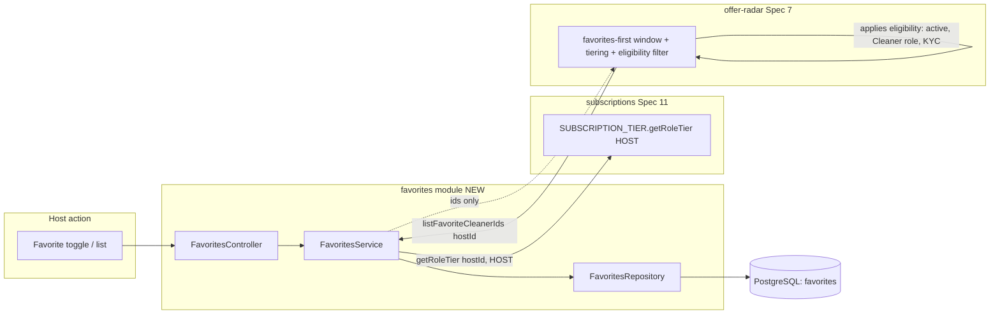
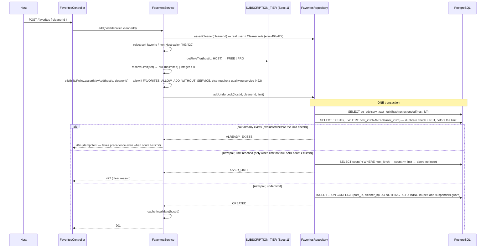
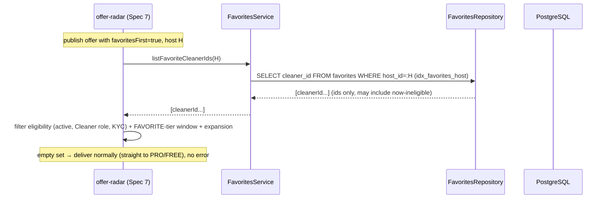

# Design Document: Favorites

## Overview

`favorites` (Spec 22, Sprint 6 — Polish & Extras) supplies the **durable directed Host→Cleaner favorite relationship** and nothing more. It is the missing data layer the tiered delivery already assumes: offer-radar (Spec 7) is already favorites-aware — an offer carries `favoritesFirst`, `DeliveryTier.FAVORITE` is the first tier, and the `offer-favorites-window` queue holds the offer for a configured window before PRO/FREE — but there is currently no favorites table, no favoriting endpoint, and no "who are this Host's favorites" resolver for the delivery to consult. This module is exactly that resolver plus its CRUD.

**It answers two questions and owns one row.** The single durable artifact is a `favorites` row `(id, host_id, cleaner_id, created_at)`, unique per pair, hard-deleted on un-favorite. The only delivery-facing surface is `isFavorite(hostId, cleanerId)` and `listFavoriteCleanerIds(hostId)` — the latter returns **only Cleaner ids**. Everything about *who is actually deliverable* (active, Cleaner role, KYC), the favorites-first window, tier ordering, radius expansion, and the read↔deliver atomicity stays in Spec 7. favorites feeds delivery; it never replaces it.

The authority split, stated precisely (it drives the whole design):

- **PostgreSQL is the source of truth for the favorite relationship.** The `favorites` row is the durable record and the single source the delivery consults. favorites exposes the **authoritative membership at query time** (a query reflects the committed rows at the moment it runs). v1 has no cache; any *future* read cache is derived and MUST guarantee freshness through a durable/versioned/non-authoritative strategy (see Key Design Decision 6) — favorites does NOT promise a derived cache is "never stale" from a best-effort post-commit invalidation alone. favorites also does NOT promise that a `DELETE` racing an in-flight delivery is atomically observed — that read↔deliver atomicity belongs to Spec 7.
- **subscriptions (Spec 11) owns the PRO entitlement.** favorites reads the Host's tier via the existing `SUBSCRIPTION_TIER` contract (`getRoleTier(hostId, HOST)`) to choose the count cap; it never re-derives entitlement state and holds no entitlement logic of its own.
- **offer-radar (Spec 7) owns tiered delivery AND Cleaner-eligibility filtering.** favorites returns ids; Spec 7 decides who is deliverable.

The design rests on six hard rules:

1. **A favorite is a directed, unique, private row — not a social graph.** Host→Cleaner only in v1; `UNIQUE (host_id, cleaner_id)` guarantees at most one row per pair; the list is readable/modifiable only by the owning Host. The Cleaner is never notified and never sees who favorited them (at most an aggregate count).
2. **The count limit is tier-based, config-driven, and never a magic sentinel.** A limit is `null` = UNLIMITED or an `integer > 0` = capped. FREE = `FAVORITES_FREE_MAX` (integer); PRO = `FAVORITES_PRO_MAX` (`null` = unlimited, or an integer). The tier is read from the Spec 11 mirror; nothing is hardcoded.
3. **The add-under-limit runs under a host-scoped serialization, never a bare COUNT+INSERT.** The add acquires a per-`host_id` PostgreSQL advisory lock in the transaction, counts, inserts only if `count < limit`, and releases on commit — so concurrent adds for the same Host can NEVER exceed the cap (a hard guarantee, not "bounded by a small amount"). PRO/unlimited skips the count check.
4. **Idempotent, one consistent CRUD semantic.** Add returns `201` when created, `204` when the pair already exists (never a second row, backed by the unique constraint), `422` when over-limit. Remove is a hard delete returning `204`, and removing a non-existent favorite is an idempotent `204`.
5. **A PRO→FREE downgrade is never destructive.** A downgrade deletes no favorites; the over-limit set is retained and keeps working for delivery — the Host simply cannot add new favorites until the count drops below `FAVORITES_FREE_MAX`.
6. **favorites keeps no Cleaner-lifecycle logic.** `listFavoriteCleanerIds` returns ids even for a now-ineligible Cleaner; Spec 7 filters eligibility at delivery; the row is never auto-pruned and the link reappears when eligibility returns.

### Terminology

> **Favorite** = one `favorites` row (directed Host→Cleaner). **Favorites-first window** = the existing Spec 7 delivery window; favorites supplies only the "who". **Count limit** = the tier-based max favorites a Host may hold (`null` = unlimited or `integer > 0`). **Host tier** = `getRoleTier(hostId, HOST)` from the Spec 11 mirror. **Delivery-facing query** = `listFavoriteCleanerIds(hostId)` / `isFavorite(hostId, cleanerId)` — internal, ids-only. **Aggregate count** = the opt-in `{ count }` a Cleaner may see (never host identities).

### Key Design Decisions

1. **Own module, one table, one responsibility.** `favorites` owns the relationship row and its CRUD/query; it does not touch the offer, negotiation, escrow, or subscription contracts beyond reading the Host's tier and answering the delivery's query.
2. **Host-scoped advisory lock for the limit (not a bare COUNT+INSERT).** `pg_advisory_xact_lock(hashtextextended(host_id))` inside the add transaction serializes concurrent adds for a single Host without a global lock; the count check and insert are then race-free (REQ-FV9). This is preferred over `SERIALIZABLE` retries (simpler, contention scoped to one Host) and over a stored counter (no denormalized drift to keep in sync).
3. **Tier read through the existing contract, not re-derived.** favorites imports only the `SUBSCRIPTION_TIER` token/interface (extended in Spec 11 with `getRoleTier`) and calls `getRoleTier(hostId, HOST)`. No new coupling, no entitlement logic (REQ-FV2).
4. **Delivery query returns ids only.** `listFavoriteCleanerIds(hostId)` is a single indexed scan on `host_id` returning `cleaner_id[]`; Spec 7 applies eligibility (REQ-FV12). favorites never performs delivery, filters eligibility, or guarantees read↔deliver atomicity (REQ-FV3, REQ-FV7).
5. **CASCADE from users is correct here.** Both FKs are `ON DELETE CASCADE` because a favorite is a *live relationship*, not shared history — the deliberate contrast with chat/calls/completions which preserve history via `SET NULL` (REQ-FV8).
6. **Cache is optional and derived — v1 reads PostgreSQL directly.** v1 ships without a cache (the `host_id`-indexed read is cheap) via a no-op pass-through, so the authoritative row is always read (REQ-FV7). The design leaves a documented seam (`FavoritesCacheService`), but a future cache MUST NOT rely on a bare post-`COMMIT` `invalidate()` to guarantee freshness — a post-commit invalidation can fail after the write committed, leaving a stale membership. A future cache MUST instead use one of: (a) **durable invalidation** driven by an outbox/event (the invalidation is itself persisted and retried, not a best-effort call), (b) a **versioned cache** where each entry carries a membership version and delivery falls back to the DB on a version miss/mismatch, or (c) the rule that **the cache is never the source of truth for a delivery decision** — Spec 7 always validates the authoritative membership (DB or version) before acting. favorites' own contract remains only "the query reflects committed rows at the moment it runs"; it does not by itself promise a derived cache is never stale.

### Responsibility Matrix

| Responsibility | Mobile | favorites (this) | subscriptions (Spec 11) | offer-radar (Spec 7) | PostgreSQL |
|----------------|:---:|:---:|:---:|:---:|:---:|
| Favorite toggle UI / optimistic update | ✅ | ❌ | ❌ | ❌ | ❌ |
| Favorites list UI | ✅ | ❌ | ❌ | ❌ | ❌ |
| Add / remove / query favorites (CRUD) | ❌ | ✅ | ❌ | ❌ | ✅ |
| Host-scoped limit enforcement (advisory lock) | ❌ | ✅ | ❌ | ❌ | ✅ (lock) |
| Resolve Host tier (FREE/PRO) | ❌ | consumes | ✅ (owns) | ❌ | ❌ |
| Count-limit value (`FAVORITES_*_MAX`) | ❌ | ✅ (config) | ❌ | ❌ | ❌ |
| `listFavoriteCleanerIds` / `isFavorite` | ❌ | ✅ | ❌ | consumes | ✅ |
| Cleaner-eligibility filter at delivery | ❌ | ❌ | ❌ | ✅ | ❌ |
| Favorites-first window / tiering / expansion | ❌ | ❌ | ❌ | ✅ | ❌ |
| Read↔deliver atomicity | ❌ | ❌ | ❌ | ✅ | ❌ |
| Aggregate-count (Cleaner-facing, opt-in) | ✅ (view) | ✅ (data) | ❌ | ❌ | ✅ |
| Cache invalidation on change (if cache used) | ❌ | ✅ | ❌ | ❌ | ❌ |

## Architecture

### Boundary — favorites feeds Spec 7, does not replace it



### Module Placement

```
services/api/src/favorites/
├── favorites.module.ts               (imports SubscriptionsModule for the tier contract + the Spec 20 qualifying-service query contract used by the eligibility policy; provides FavoritesService)
├── favorites.controller.ts           (Host CRUD + Cleaner-facing aggregate-count; JWT-guarded, role/participant-gated)
├── favorites.service.ts              (add-under-lock, remove, query; tier resolution; add-eligibility gate; cache invalidation seam)
├── favorite-eligibility.policy.ts    (FavoriteEligibilityPolicy — config-driven add gate; consults Spec 20 when service required)
├── favorites.repository.ts           (parameterized SQL: advisory lock, exists-then-count, insert, delete, list, is-favorite, aggregate-count)
├── favorites.cache.ts                (FavoritesCacheService — derived cache seam; no-op pass-through default)
├── favorites.types.ts                (FavoriteView, FavoriteLimit, internal query result types)
├── favorites.constants.ts            (env config + validateFavoritesConfig(); i18n-free server constants)
├── config/
│   └── validate-favorites-config.ts  (fail-fast startup validation)
├── dto/
│   ├── add-favorite.dto.ts           (cleanerId validation)
│   └── list-favorites-query.dto.ts   (limit + cursor validation)
├── entities/
│   └── favorite.entity.ts            (favorites mirror row)
├── __tests__/
└── README.md

services/api/src/database/migrations/
└── 1700000019000-CreateFavorites.ts  (next sequential timestamp after subscriptions 1700000018000)

apps/mobile/src/screens/favorites/
├── FavoritesListScreen.tsx           (Host: paginated list, remove, unavailable badge)
├── useFavoritesStore.ts              (Zustand: list, is-favorite map, optimistic toggle + reconcile)
├── favorites.api.ts                  (typed client: add / remove / list / is-favorite / aggregate-count)
├── favorites.types.ts                (FavoriteView mirroring backend, ConnectionState)
├── favorites.constants.ts            (ENDPOINTS, i18n keys, design tokens)
├── components/
│   ├── FavoriteToggle.tsx            (heart toggle reflecting is-favorite, optimistic)
│   ├── FavoriteCard.tsx              (list item: cleaner display + remove + unavailable state)
│   └── FavoritesLimitBanner.tsx      (FREE-limit message + optional PRO upsell)
├── __tests__/
└── README.md
```

Mobile also surfaces the toggle on the Cleaner profile / post-service screens (Spec 20 completion is the natural entry point) and reflects the "offer to favorites first" choice at publish (existing Spec 7 UX) based on whether the Host has favorites.

### Add-under-limit flow (host-scoped serialization)



> The lock is `pg_advisory_xact_lock` keyed on the `host_id` (via `hashtextextended`), held for the transaction and auto-released on commit/rollback. Ordering inside the transaction: acquire lock → **check existence first** → if the pair already exists return `ALREADY_EXISTS` (`204`) *before* any limit check → else (if capped) count and abort `OVER_LIMIT` when `count >= limit` → else `INSERT ... ON CONFLICT DO NOTHING`. Checking existence before the count is what makes a re-add of an existing favorite a `204` **even when the Host is at cap** (`count >= limit`), so a duplicate never surfaces as `422`. The `ON CONFLICT` remains as a belt-and-suspenders guard against a concurrent insert of the same pair; the existence-check-then-count-then-insert under the lock keeps the cap a hard guarantee for *new* pairs (REQ-FV5, REQ-FV9). PRO/unlimited (`limit === null`) skips the count entirely: existence check → idempotent insert.

### Downgrade (PRO → FREE) — non-destructive

```mermaid
stateDiagram-v2
    [*] --> PRO_UNLIMITED : Host is PRO
    PRO_UNLIMITED --> FREE_OVER_CAP : downgrade while count > FAVORITES_FREE_MAX
    FREE_OVER_CAP --> FREE_OVER_CAP : existing favorites RETAINED, still delivered; ADD rejected (422)
    FREE_OVER_CAP --> FREE_UNDER_CAP : Host removes favorites until count < FAVORITES_FREE_MAX
    FREE_UNDER_CAP --> FREE_UNDER_CAP : ADD allowed again
```



A downgrade never deletes a row. The cap is evaluated only at add time against the *current* count, so an over-cap Host is simply blocked from adding until they drop below the FREE cap (REQ-FV11). Delivery keeps consulting the full retained set.

### Delivery query path (Spec 7 owns eligibility)



favorites exposes committed rows at query time and invalidates any derived cache on change; it does not guarantee that a `DELETE` racing an in-flight delivery is atomically observed — that read↔deliver atomicity is Spec 7's contract (REQ-FV7). An empty favorites set is valid and delivery proceeds normally (REQ-FV4).

## Components and Interfaces

### FavoritesController (`@Controller('favorites') @UseGuards(JwtAuthGuard)`)

| Method | Path | Actor | Description |
|--------|------|-------|-------------|
| `POST` | `/favorites` | Host only | Add `{ cleanerId }` under the host-scoped lock+limit → `201` created / `204` already a favorite / `422` over-limit / `404`\|`422` invalid Cleaner |
| `DELETE` | `/favorites/:cleanerId` | Host only | Hard-delete the `(caller, cleanerId)` row → `204` (idempotent, incl. non-existent) |
| `GET` | `/favorites` | Host only | The caller's favorite Cleaners, paginated (`?limit&cursor`), deterministically ordered, with minimal safe Cleaner display info + a **display-only `unavailable` hint**. This hint is derived from a **shared user/role/KYC eligibility reader** (owned by users/roles/KYC, consumed — not owned — by favorites); favorites replicates none of Spec 7's eligibility rules. The hint is presentation only and does NOT affect `listFavoriteCleanerIds` (which always returns all ids, ids-only) |
| `GET` | `/favorites/is-favorite/:cleanerId` | Host only | `{ isFavorite: boolean }` for the UI toggle state |
| `GET` | `/favorites/aggregate-count` | Cleaner only | `{ count }` of Hosts who favorited the CALLER — ONLY if `FAVORITES_EXPOSE_AGGREGATE_COUNT = true` (else `404`); NEVER host identities |

Identity is resolved server-side from `req.user.keycloakId → userId` (never client-asserted). A non-Host attempting a Host endpoint → `403`; unauthenticated → `401`. Status codes: `200` reads, `201`/`204`/`422` on add, `204` on remove, `400` DTO validation, `401`/`403` auth, `404` unknown Cleaner (or aggregate-count disabled).

### Internal (delivery-facing) interface — consumed by Spec 7

```typescript
export interface FavoritesQuery {
  // Returns ONLY Cleaner ids for the Host's favorites. No eligibility filtering (Spec 7 owns that).
  // No read↔deliver atomicity guarantee beyond "reflects committed rows at call time".
  listFavoriteCleanerIds(hostId: string): Promise<string[]>;
  isFavorite(hostId: string, cleanerId: string): Promise<boolean>;
}
```

`FavoritesService` implements `FavoritesQuery`; Spec 7 depends on the token, not on the CRUD surface. This keeps favorites' delivery-facing contract to exactly two methods.

### FavoritesService

```typescript
@Injectable()
export class FavoritesService implements FavoritesQuery {
  constructor(
    private readonly repo: FavoritesRepository,
    @Inject(SUBSCRIPTION_TIER) private readonly tier: SubscriptionTierContract,
    private readonly eligibility: FavoriteEligibilityPolicy,
    private readonly cache: FavoritesCacheService,
  ) {}

  // POST /favorites — validate target, resolve tier→limit, add under host-scoped lock, invalidate cache
  async add(hostId: string, cleanerId: string): Promise<AddResult> { /* 201 | 204 | 422 | 404 */ }

  // DELETE /favorites/:cleanerId — hard delete, idempotent, invalidate cache
  async remove(hostId: string, cleanerId: string): Promise<void> { /* 204 always */ }

  async listFavorites(hostId: string, page: CursorPage): Promise<Paginated<FavoriteView>> { /* Host list */ }
  async listFavoriteCleanerIds(hostId: string): Promise<string[]> { /* delivery: ids only */ }
  async isFavorite(hostId: string, cleanerId: string): Promise<boolean> { /* toggle state */ }
  async aggregateCountForCleaner(cleanerId: string): Promise<number> { /* opt-in; identities never returned */ }

  private resolveLimit(tier: SubscriberTier): number | null {
    // FREE → FAVORITES_FREE_MAX (integer); PRO → FAVORITES_PRO_MAX (null=unlimited | integer). No sentinels.
  }
}
```

### FavoriteEligibilityPolicy (config-driven add gate)

```typescript
export interface FavoriteEligibilityPolicy {
  // Deterministic, server-side gate consulted by FavoritesService.add before addUnderLock.
  // FAVORITES_ALLOW_ADD_WITHOUT_SERVICE === true  → resolve to allowed (no service required).
  // FAVORITES_ALLOW_ADD_WITHOUT_SERVICE === false → require a prior qualifying/completed service
  //   between (hostId, cleanerId), read through the Spec 20 query contract; else throw 422.
  assertMayAdd(hostId: string, cleanerId: string): Promise<void>; // rejects with 422 (clear reason) when disallowed
}
```

The policy is the single place the `FAVORITES_ALLOW_ADD_WITHOUT_SERVICE` flag actually drives a decision. When the flag is `true` the check is a constant `allow` (no external read). When `false`, favorites **consults** service-completion (Spec 20) for a qualifying-service predicate `hasQualifyingService(hostId, cleanerId)` — favorites reads it, never re-derives or owns completion logic. The decision is deterministic given the flag and the service-completion answer, so it is straightforwardly testable as a property.

- `add`: reject self-favorite and non-Cleaner target (`422`), unknown user (`404`); resolve `getRoleTier(hostId, HOST)` → limit; **enforce the add-eligibility policy** via `eligibility.assertMayAdd(hostId, cleanerId)` — when `FAVORITES_ALLOW_ADD_WITHOUT_SERVICE === true` the policy allows the add unconditionally; when `false` it requires a prior qualifying/completed service between the Host and the Cleaner (read through the service-completion/Spec 20 query contract — favorites consults it and owns no completion logic) and rejects with `422` and a clear reason otherwise; then call `repo.addUnderLock(hostId, cleanerId, limit)`; on `CREATED` invalidate the cache. Functions ≤30 lines, single responsibility.
- `remove`: `repo.deleteFavorite` then `cache.invalidate` — always `204`, no error on a missing row (REQ-FV5).
- The tier lookup reuses Spec 11's bounded-timeout + FREE-degradation semantics; favorites adds no entitlement logic (REQ-FV2). A tier read that degrades to FREE simply applies the FREE cap — a safe, non-destructive default.

### FavoritesRepository

Parameterized SQL only; no string concatenation (REQ-FV10).

- `addUnderLock(hostId, cleanerId, limit)` — ONE transaction, in this order: `pg_advisory_xact_lock(hashtextextended($hostId))`; **then check existence FIRST** — `SELECT EXISTS(SELECT 1 FROM favorites WHERE host_id=$h AND cleaner_id=$c)`; if it exists return `ALREADY_EXISTS` immediately (before any count/limit check, so a duplicate is `204` even when the Host is at cap); otherwise, if `limit !== null`, `SELECT count(*) FROM favorites WHERE host_id = $hostId` and abort with `OVER_LIMIT` when `count >= limit`; otherwise `INSERT INTO favorites (host_id, cleaner_id) VALUES ($h,$c) ON CONFLICT (host_id, cleaner_id) DO NOTHING RETURNING id` (the `ON CONFLICT` is a belt-and-suspenders guard against a concurrent duplicate insert). Returns `ALREADY_EXISTS` (pair already present — evaluated before `OVER_LIMIT`), `OVER_LIMIT` (new pair, capped, `count >= limit`), or `CREATED` (row inserted). The duplicate-before-limit ordering is what satisfies Property 1: a re-add of an existing favorite at cap yields `204`, never `422`.
- `deleteFavorite(hostId, cleanerId)` — `DELETE FROM favorites WHERE host_id=$h AND cleaner_id=$c`; idempotent (0 rows is fine).
- `listByHost(hostId, limit, cursor)` — `WHERE host_id=$h` ordered by `(created_at DESC, id DESC)` (deterministic, keyset pagination on the cursor); joins minimal safe Cleaner display fields. The per-row `unavailable` hint is populated from the **shared user/role/KYC eligibility reader** (a lightweight active/role/KYC status read exposed by users/roles/KYC), not from any favorites-owned eligibility logic; it is display-only and never filters or removes rows.
- `existsFavorite(hostId, cleanerId)` — `SELECT EXISTS(...)`.
- `listCleanerIds(hostId)` — `SELECT cleaner_id FROM favorites WHERE host_id=$h` (delivery; ids only, uses `idx_favorites_host`).
- `countByCleaner(cleanerId)` — `SELECT count(*) FROM favorites WHERE cleaner_id=$c` (aggregate-count; uses `idx_favorites_cleaner`).
- `isCleaner(userId)` — resolves the target is a real user with the Cleaner role (delegated to the users/roles read; favorites keeps no role logic beyond this guard).

### FavoritesCacheService (derived seam, no-op default)

```typescript
export interface FavoritesCacheService {
  getCleanerIds(hostId: string): Promise<string[] | null>; // null = miss (default impl always misses)
  set(hostId: string, cleanerIds: string[]): Promise<void>;
  invalidate(hostId: string): Promise<void>;                // called on every add/remove
}
```

Default binding is a pass-through (`getCleanerIds` → `null`, `set`/`invalidate` → no-op), so v1 always reads PostgreSQL — the authoritative membership at query time (REQ-FV7). The seam exists so introducing a cache is a binding swap, not a service rewrite.

**A future Redis-backed cache MUST NOT depend on this `invalidate(hostId)` alone for freshness.** A bare `invalidate` called after the transaction commits can fail *after* the `DELETE`/`INSERT` is durable — leaving the cache holding a stale membership that delivery would then read. So `invalidate` here is best-effort only, and a real cache implementation MUST additionally adopt one of:

- **(a) Durable invalidation** — the invalidation is persisted (outbox/event) in the same transaction as the add/remove and applied by a retried consumer, so a crashed/failed invalidation is re-driven rather than lost.
- **(b) Versioned cache** — each cached membership carries a version bumped on every change; a reader that observes a version mismatch (or miss) falls back to the DB, so a stale entry can never be silently trusted.
- **(c) Cache-is-not-authority** — the cache is a pure read accelerator and never the source of truth for a delivery decision; Spec 7 validates the authoritative membership (DB or version) before acting.

Absent one of these, the cache MUST stay the v1 no-op. This keeps favorites from overpromising "never stale" from an imperative post-commit call.

### Mobile — useFavoritesStore + screens

- `useFavoritesStore` (Zustand): holds the paginated favorites list and an `isFavorite` map keyed by `cleanerId`; `toggle(cleanerId)` applies an **optimistic** flip then reconciles via the API, reverting on failure (limit/network) with an i18n message (REQ-FV, Req 5.1/5.5).
- `FavoriteToggle`: heart control reflecting `is-favorite`; on tap optimistically updates and calls `add`/`remove`; on a `422` limit it surfaces `FavoritesLimitBanner` (clear message + optional PRO upsell) and reverts (Req 5.2).
- `FavoritesListScreen`: paginated list (view + remove) in the Host area; a currently-ineligible Cleaner is shown with an `unavailable` badge rather than hidden (Req 3.5). The badge reflects the backend's display-only `unavailable` hint (sourced from the shared user/role/KYC eligibility reader), not any client- or favorites-owned eligibility logic; the row is never auto-removed. `en`/`es` parity; BidClean dark tokens (`#00F5D4` accent for the active heart/CTA, `#0B0C10` background, `#1F2833` cards).
- Publish "offer to favorites first" (existing Spec 7 UX) is disabled/hinted when the Host has no favorites (Req 5.4); favorites only supplies the has-favorites signal.
- The client is convenience only; membership authority is the backend (`is-favorite`/list reconcile the optimistic state).

## Data Models

### `favorites` (new — the durable directed Host→Cleaner relationship)

Follows the project database standards: `UUID` PK (`gen_random_uuid()`), snake_case, `TIMESTAMP WITH TIME ZONE` `created_at`, explicit FK `ON DELETE`, indexes on every FK. **No `updated_at`/`deleted_at`** — a favorite is add-or-remove (hard delete), not a mutable or audited entity (REQ-FV1, Req 7.1).

```sql
CREATE TABLE favorites (
    id UUID PRIMARY KEY DEFAULT gen_random_uuid(),
    host_id UUID NOT NULL,
    cleaner_id UUID NOT NULL,
    created_at TIMESTAMP WITH TIME ZONE NOT NULL DEFAULT NOW(),

    CONSTRAINT uq_favorites_host_cleaner UNIQUE (host_id, cleaner_id),
    CONSTRAINT chk_favorites_not_self CHECK (host_id <> cleaner_id),
    CONSTRAINT fk_favorites_host    FOREIGN KEY (host_id)    REFERENCES users(id) ON DELETE CASCADE,
    CONSTRAINT fk_favorites_cleaner FOREIGN KEY (cleaner_id) REFERENCES users(id) ON DELETE CASCADE
);

-- Delivery list query (listFavoriteCleanerIds) + Host list are host-scoped:
CREATE INDEX idx_favorites_host ON favorites (host_id);
-- Aggregate-count (Hosts who favorited a given Cleaner) is cleaner-scoped:
CREATE INDEX idx_favorites_cleaner ON favorites (cleaner_id);
-- Deterministic keyset pagination for the Host list:
CREATE INDEX idx_favorites_host_created ON favorites (host_id, created_at DESC, id DESC);

COMMENT ON TABLE favorites IS 'Directed Host->Cleaner favorite relationship; private to the Host; feeds Spec 7 favorites-first delivery. Hard delete on un-favorite (no soft-delete/audit).';
COMMENT ON COLUMN favorites.host_id IS 'The Host who favorited (FK users, CASCADE — a favorite is a live relationship, not history).';
COMMENT ON COLUMN favorites.cleaner_id IS 'The favorited Cleaner (FK users, CASCADE).';
```

- `uq_favorites_host_cleaner` is the uniqueness + idempotency guarantee: a Host favorites a given Cleaner at most once; the add's `ON CONFLICT DO NOTHING` relies on it (REQ-FV1, REQ-FV5).
- `chk_favorites_not_self` enforces the "cannot favorite yourself" rule at the DDL floor (Req 1.5), in addition to the service guard.
- Both FKs `ON DELETE CASCADE`: deleting either user removes the link — a favorite is a live relationship, not shared history. This is the deliberate, correct use of CASCADE-from-users, unlike chat/calls/completions which preserve history via `SET NULL` (REQ-FV8, Req 7.2).
- `idx_favorites_host` backs the delivery list query and the Host list; `idx_favorites_cleaner` backs the aggregate-count; `idx_favorites_host_created` backs deterministic keyset pagination. No over-indexing beyond the query patterns.

Migration `1700000019000-CreateFavorites.ts` is reversible (`up`/`down`), uses `IF NOT EXISTS`, and carries table/column comments (database-standards).

### Favorite count limit (tier-based, config-driven)

The limit is resolved at add time, never stored:

```typescript
// null = UNLIMITED, integer > 0 = capped. No magic sentinels (no -1).
type FavoriteLimit = number | null;

function resolveLimit(tier: SubscriberTier): FavoriteLimit {
  return tier === SubscriberTier.PRO
    ? FAVORITES_PRO_MAX   // null (unlimited) or an integer cap
    : FAVORITES_FREE_MAX; // an integer > 0
}
```

The tier is `getRoleTier(hostId, HOST)` from the Spec 11 mirror (REQ-FV2). Values come from config with fail-fast validation (below); `FAVORITES_FREE_MAX` must be a positive integer, `FAVORITES_PRO_MAX` is unset/`null` (unlimited) or a positive integer.

### TypeScript types (`favorites.types.ts`)

```typescript
export type FavoriteLimit = number | null; // null = unlimited

export const AddResult = {
  CREATED: 'CREATED',           // 201
  ALREADY_EXISTS: 'ALREADY_EXISTS', // 204
  OVER_LIMIT: 'OVER_LIMIT',     // 422
} as const;
export type AddResult = (typeof AddResult)[keyof typeof AddResult];

export interface FavoriteView {
  cleanerId: string;
  displayName: string;        // minimal safe Cleaner display info
  avatarUrl: string | null;
  favoritedAt: string;        // ISO 8601 (created_at)
  unavailable: boolean;       // DISPLAY-ONLY hint from a SHARED user/role/KYC eligibility reader (consumed, not owned).
                              // favorites owns no eligibility logic; the row is NEVER deleted, and this flag
                              // does NOT affect listFavoriteCleanerIds (which returns ALL ids, ids-only).
}

export interface CursorPage {
  limit: number;              // clamped to [1, FAVORITES_LIST_MAX_LIMIT]
  cursor: string | null;      // opaque keyset cursor (created_at,id)
}

export interface Paginated<T> {
  items: T[];
  nextCursor: string | null;
}
```

### No other tables, no new external dependencies

favorites introduces exactly one table and reads `users` (for the Cleaner-role guard and display fields) and the Spec 11 tier contract. It creates no queue, no realtime channel, and no PostGIS geometry (the relationship is non-spatial). Correctness does not depend on realtime — it is a durable row read at publish/delivery time.

## Correctness Properties

*A property is a characteristic or behavior that should hold true across all valid executions of a system — essentially, a formal statement about what the system should do. Properties serve as the bridge between human-readable specifications and machine-verifiable correctness guarantees.*

Each property is universally quantified, testable, and maps back to the requirements' acceptance criteria and the `REQ-FV` invariants.

### Property 1: Idempotent add with limit boundary

*For any* Host, target Cleaner, and prior favorites state, calling `add(host, cleaner)` under a limit `L` (`L = null` unlimited, or an integer `> 0`) SHALL result in **exactly one** `favorites` row for `(host, cleaner)` and SHALL evaluate the duplicate case **before** the limit case: it returns `ALREADY_EXISTS` (`204`) whenever the pair already exists — **including when `L !== null AND currentCount >= L`** (a duplicate at cap is `204`, never `422`; never a second row, backed by `UNIQUE (host_id, cleaner_id)`); returns `OVER_LIMIT` (`422`) **only** when the pair is new and `L !== null AND currentCount >= L`; and returns `CREATED` (`201`) when the pair is new and the count is below the limit. Thus `ALREADY_EXISTS` strictly takes precedence over `OVER_LIMIT`. A rejected (`422`) add SHALL create no row.

**Validates: Requirements 1.1, 1.2** · REQ-FV2, REQ-FV5

### Property 2: Limit holds strictly under concurrency

*For any* Host with limit `L` and *for any* interleaving of `N` concurrent `add` attempts (distinct Cleaners), the resulting number of `favorites` rows for that Host SHALL be exactly `min(N, L)` when `L !== null`, and `N` when `L === null` (unlimited) — and SHALL NEVER exceed `L`. This holds because every add acquires the per-`host_id` advisory lock before counting and inserting; concurrent adds for the same Host can never both observe a below-limit count and both insert. The guarantee is hard, not "bounded by a small amount".

**Validates: Requirements 7.4** · REQ-FV9

### Property 3: Membership round-trip and authoritative query

*For any* sequence of `add`/`remove` operations, `isFavorite(host, cleaner)` and `listFavoriteCleanerIds(host)` SHALL reflect exactly the committed rows at call time: after `add(h,c)` (or when the pair exists) `isFavorite(h,c)` is `true` and `c ∈ listFavoriteCleanerIds(h)`; after `remove(h,c)` `isFavorite(h,c)` is `false` and `c ∉ listFavoriteCleanerIds(h)`. `remove` SHALL be idempotent — removing a non-existent pair yields the same absent state and never errors. favorites' contract is exactly "a query reflects the committed rows at the moment it runs" (the authoritative read is PostgreSQL in v1). favorites SHALL NOT guarantee atomicity versus an in-flight Spec 7 delivery, and SHALL NOT claim that a *derived cache* is never stale purely from a best-effort post-commit `invalidate`: a never-stale derived cache holds only when the cache uses durable invalidation (a), a versioned entry with DB fallback (b), or is treated as non-authoritative with Spec 7 validating against the DB/version (c). The v1 no-op cache reads PostgreSQL directly and is trivially non-stale.

**Validates: Requirements 2.1, 2.4, 3.2, 4.5, 7.5** · REQ-FV5, REQ-FV7

### Property 4: Delivery query returns exactly the stored Cleaner ids, ids only

*For any* Host, `listFavoriteCleanerIds(host)` SHALL return exactly the set of `cleaner_id` values stored for that Host — no more, no less — containing **only Cleaner ids** (no eligibility filtering, no display fields, no extra data), and SHALL return `[]` (never an error) for a Host with no favorites. Ineligible Cleaners SHALL be included in the returned ids; Spec 7 owns eligibility filtering.

**Validates: Requirements 3.3, 3.4, 4.2** · REQ-FV3, REQ-FV4, REQ-FV12

### Property 5: Non-destructive downgrade

*For any* Host holding a favorites set of size `S` under PRO and *for any* subsequent resolution of that Host's tier as FREE (`FAVORITES_FREE_MAX = C` with `S > C`), no `favorites` row SHALL be deleted: the full set of size `S` SHALL remain present and be returned unchanged by `listFavorites` and `listFavoriteCleanerIds`, while any new `add` SHALL be rejected `422` until the Host's count drops below `C`. A tier change SHALL never delete a favorite.

**Validates: Requirements 1.6** · REQ-FV11

### Property 6: Row set is invariant to Cleaner eligibility

*For any* favorites set and *for any* sequence of changes to a favorited Cleaner's eligibility (role change, deactivation, re-activation), the set of `favorites` rows SHALL be unchanged — favorites SHALL never auto-delete or auto-prune a row for a now-ineligible Cleaner — and neither `listFavorites` nor `listFavoriteCleanerIds` SHALL error on such a row. `listFavoriteCleanerIds` SHALL ALWAYS return the id (ids-only, unfiltered) regardless of eligibility. The Host list MAY mark the row `unavailable`, but that flag SHALL be a **display-only hint derived from the shared user/role/KYC eligibility reader** (consumed, not owned) — favorites SHALL replicate none of Spec 7's eligibility rules, and the flag SHALL NEVER affect the ids returned by `listFavoriteCleanerIds`. The link SHALL reappear automatically as eligible when eligibility returns, because favorites stored it unchanged throughout.

**Validates: Requirements 3.5, 7.3** · REQ-FV12

### Property 7: Invalid target rejected with no row

*For any* add attempt whose target is not a valid favoritable Cleaner — the target is not a real user, is a user without the Cleaner role, or equals the Host itself — the add SHALL be rejected (`404` for a non-user, `422` for a non-Cleaner or self) and SHALL create no `favorites` row. Only a real, distinct, Cleaner-role user SHALL be addable.

**Validates: Requirements 1.3, 1.5** · REQ-FV1

### Property 8: Pagination determinism

*For any* favorites set and *for any* page size, paginating `listFavorites(host)` through its cursors SHALL return each favorite exactly once (no duplicates, no omissions), in a deterministic order (`created_at DESC, id DESC`); the union of all pages SHALL equal the Host's full favorites set.

**Validates: Requirements 3.1** · REQ-FV1

### Property 9: Aggregate-count correctness and no host-identity exposure

*For any* favorite graph and *for any* Cleaner `c`, when `FAVORITES_EXPOSE_AGGREGATE_COUNT = true` the Cleaner-facing `aggregate-count` for `c` SHALL equal the number of distinct Hosts holding a `(host, c)` row, and the response object SHALL contain **no host identifiers** (only `{ count }`). When the flag is `false`, the endpoint SHALL be unavailable (`404`). No other endpoint SHALL leak who favorited whom.

**Validates: Requirements 3.6** · REQ-FV6

### Property 10: Response privacy and shape

*For any* response from any favorites endpoint (`list`, `is-favorite`, `aggregate-count`) served to a caller, the payload SHALL contain only the caller's own data (a Host reads/modifies only their own list) and only whitelisted safe Cleaner display fields — never another user's list, never host identities in the Cleaner-facing aggregate-count, and no PII beyond the safe display fields. Authorization SHALL be resolved server-side from the JWT subject, never from a client-asserted owner id.

**Validates: Requirements 6.3, 6.4** · REQ-FV6, REQ-FV10

### Property 11: Configuration integrity and fail-fast validation

*For any* configuration map, `validateFavoritesConfig()` SHALL throw at startup (fail-fast, non-test) if and only if a required tunable is missing or invalid — specifically when `FAVORITES_FREE_MAX` is absent, non-integer, or `<= 0`, when `FAVORITES_PRO_MAX` is present but not a positive integer (unset/`null` = unlimited is valid), or when a required boolean flag is malformed. No favorite limit, aggregate-count exposure, add-without-service policy, or cache TTL SHALL be a hardcoded literal in logic; all SHALL come from configuration.

**Validates: Requirements 6.1, 6.2** · REQ-FV2, REQ-FV10

### Property 12: Add-eligibility policy is enforced and config-driven

*For any* Host, target Cleaner, prior favorites state, and value of `FAVORITES_ALLOW_ADD_WITHOUT_SERVICE`: when the flag is `true`, `add(host, cleaner)` SHALL NOT be blocked by the eligibility policy (no prior service required) and proceeds to the normal add semantics of Property 1; when the flag is `false`, `add(host, cleaner)` SHALL be permitted **if and only if** a prior qualifying service exists between `(host, cleaner)` per the consulted Spec 20 predicate — otherwise it SHALL be rejected (`422`, clear reason) and SHALL create no `favorites` row. The decision SHALL be deterministic in `(flag, hasQualifyingService(host, cleaner))`, driven only by configuration and the consulted predicate, and favorites SHALL own no completion logic (it reads the predicate, never re-derives it).

**Validates: Requirements 4.3, 6.1** · REQ-FV3, REQ-FV10

## Error Handling

| Condition | Response |
|-----------|----------|
| Add a new pair under the limit | `201` created; exactly one row; cache invalidated |
| Add a pair that already exists | `204` idempotent; no second row. The existence check runs **before** the limit check under the lock, so a re-add of an existing favorite is `204` **even when `count >= limit`** (a duplicate never surfaces as `422`) |
| Add a NEW pair while at the FREE/PRO cap (`count >= limit`) | `422` with a clear reason; no row created (only for a genuinely new pair — an existing pair already returned `204` above) |
| Add without a prior qualifying service while `FAVORITES_ALLOW_ADD_WITHOUT_SERVICE = false` | `422` with a clear reason; no row created. When the flag is `true` the policy allows the add regardless of prior service |
| Add a target that is not a real user | `404`; no row |
| Add a non-Cleaner user or self | `422`; no row (DDL `CHECK (host_id <> cleaner_id)` also blocks self) |
| Add by a non-Host / unauthenticated caller | `403` / `401`; no row |
| Concurrent adds for one Host near the cap | Host-scoped advisory lock serializes; final count never exceeds the cap |
| Tier read degrades (Spec 11 timeout) | Falls back to FREE cap (safe, non-destructive default); add still evaluated against the FREE limit |
| Remove an existing favorite | `204`; row hard-deleted; cache invalidated |
| Remove a non-existent favorite | `204` idempotent no-op; no error |
| Remove scoped to caller's `host_id` | A caller can only delete their own `(caller, cleaner)` row; another Host's row is untouched (`403`/no-op) |
| List favorites (paginated) | `200`; deterministic order; safe display fields; ineligible Cleaner marked `unavailable`, not hidden |
| `is-favorite` check | `200 { isFavorite }`; participant-gated |
| `aggregate-count` with flag `true` | `200 { count }`; no host identities |
| `aggregate-count` with flag `false` | `404` (endpoint disabled) |
| `aggregate-count` requested by a non-Cleaner | `403` |
| PRO→FREE downgrade over cap | No deletion; existing set retained + delivered; new adds `422` until under cap |
| Favorited Cleaner becomes ineligible | Row retained; `listFavoriteCleanerIds` still returns the id; list marks `unavailable`; never errors, never auto-deletes |
| Host or Cleaner user deleted | `favorites` rows referencing them removed via `ON DELETE CASCADE` |
| Delivery query for a Host with no favorites | `[]` returned (empty set valid); Spec 7 delivers normally |
| Missing/invalid required config at boot | `validateFavoritesConfig()` throws (fail-fast, skipped under `NODE_ENV=test`) |
| Mobile add fails (limit/network) | Optimistic toggle reverts; i18n message (limit banner + optional PRO upsell); no crash |

## Testing Strategy

Property-based testing **applies** to the favorites logic layer: the add/remove/query/limit surface is a decision function over a large input space (arbitrary hosts, cleaners, prior states, tier/cap combinations, concurrent interleavings, favorite graphs, config maps), so universal properties (idempotent add with duplicate-before-limit precedence, concurrency cap, membership round-trip, delivery-query exactness, non-destructive downgrade, eligibility invariance, invalid-target rejection, pagination determinism, aggregate-count correctness, response privacy, config integrity, add-eligibility policy) are meaningfully quantified. The Spec 11 tier contract is a mocked seam (a stubbed `getRoleTier`), the users/roles read and the shared user/role/KYC eligibility reader are faked, the Spec 20 qualifying-service predicate (`hasQualifyingService`) is a stubbed seam, and PostgreSQL concurrency is exercised against the repository model; mobile UI is covered by store/unit and render tests (not PBT).

### Property-Based Tests (fast-check)

Library: `fast-check` (TypeScript, mirroring the sibling specs). Each test runs **minimum 100 iterations** and is tagged with a comment: `// Feature: favorites, Property N: <title>`.

| Property | What to Generate | What to Assert |
|----------|------------------|----------------|
| P1 Add semantics | Random `(host, cleaner)` add sequences with duplicates × random limits (`null`/int>0) × prior counts, **including re-adding an existing favorite while the Host is exactly at cap (`count == limit`)** | Exactly one row per pair; `201` first, `204` on duplicate; `422` iff **new** and `count >= limit`; **a duplicate at cap returns `204`, not `422`** (existence checked before the limit); no row on `422` |
| P2 Concurrency cap | Random `N` concurrent adds (distinct cleaners) for one Host × random cap `C` | Final row count `== min(N, C)` (or `N` when unlimited); never `> C` |
| P3 Membership round-trip (authoritative query) | Random interleaved `add`/`remove`/query sequences (incl. double-remove, remove-never-added) | `isFavorite`/`listFavoriteCleanerIds` reflect committed rows exactly at call time; remove idempotent; v1 (no-op cache) reads the DB so a removed id never reappears — the property is stated over the authoritative query, not over a best-effort cache invalidation |
| P4 Delivery query exactness | Random favorite sets incl. ineligible cleaners + empty sets | `listFavoriteCleanerIds` returns exactly stored `cleaner_id`s, ids only, ineligible included; `[]` for none, never throws |
| P5 Non-destructive downgrade | Random favorite set size `S` under PRO, then tier resolved FREE with `C < S` | Zero rows deleted; full set returned unchanged; new add `422` until count `< C` |
| P6 Eligibility invariance | Random favorites × arbitrary eligibility toggles on targets | Row set unchanged; no auto-delete; list/delivery never error; id still returned (marked `unavailable`) |
| P7 Invalid target rejected | Targets partitioned {real cleaner, non-user, non-cleaner user, self} | Only real distinct Cleaner addable; others `404`/`422`; no row created |
| P8 Pagination determinism | Random favorite sets × random page sizes | Paging over cursors yields each favorite exactly once, deterministic `(created_at DESC, id DESC)`; union == full set |
| P9 Aggregate-count | Random `(host→cleaner)` graphs × flag on/off | Count == distinct hosts favoriting the cleaner; response has no host identifiers; flag-off → unavailable |
| P10 Response privacy/shape | Random responses (list, is-favorite, aggregate-count) | Only caller's own data; only whitelisted safe fields; no host identities in aggregate-count |
| P11 Config integrity | Random config maps (missing/invalid/valid; negative/zero FREE cap; malformed PRO cap/flags) | Validator throws iff required missing/invalid; passes otherwise; no literal caps in logic |
| P12 Add-eligibility policy | Random `(host, cleaner)` × flag `FAVORITES_ALLOW_ADD_WITHOUT_SERVICE` on/off × stubbed `hasQualifyingService` true/false | Flag `true` → policy never blocks; flag `false` → add allowed iff a qualifying service exists, else `422` and no row; decision deterministic in `(flag, hasQualifyingService)`; favorites owns no completion logic (predicate is consulted, not re-derived) |

### Unit Tests (NestJS)

- **`FavoritesService`**: `add` resolves `getRoleTier(hostId, HOST)` → limit, runs `eligibility.assertMayAdd` before `addUnderLock`, and invalidates cache on `CREATED` only; rejects self/non-Cleaner (`422`) and unknown user (`404`); `remove` always `204` and invalidates cache; a degraded tier read falls back to the FREE cap; `resolveLimit` maps FREE→`FAVORITES_FREE_MAX`, PRO→`FAVORITES_PRO_MAX` with `null`=unlimited and no sentinel.
- **`FavoriteEligibilityPolicy`**: with `FAVORITES_ALLOW_ADD_WITHOUT_SERVICE = true` resolves to allow without consulting Spec 20; with `false` calls the Spec 20 `hasQualifyingService(hostId, cleanerId)` predicate (stubbed) and throws `422` when it is `false`, allows when `true`; owns no completion logic.
- **`FavoritesRepository.addUnderLock`**: existence check runs before the count so a duplicate at cap returns `ALREADY_EXISTS` (not `OVER_LIMIT`); `OVER_LIMIT` only for a genuinely new pair at/over the cap.
- **`FavoritesRepository`**: parameterized SQL; `addUnderLock` acquires the advisory lock, counts only when capped, inserts with `ON CONFLICT DO NOTHING`, returns `CREATED`/`ALREADY_EXISTS`/`OVER_LIMIT`; `deleteFavorite` idempotent; `listByHost` deterministic keyset order + safe fields; `listCleanerIds` ids only; `countByCleaner` uses the cleaner index.
- **`FavoritesController`**: JWT identity → `hostId`/`cleanerId` (ignores any client-supplied owner); Host-only guards (`403` for non-Host); status codes `201`/`204`/`422`/`404`; `aggregate-count` gated by the flag (Cleaner-only, `404` when disabled), returns `{ count }` with no identities.
- **`FavoritesCacheService`** (default no-op): `getCleanerIds` misses; `invalidate`/`set` no-ops — v1 always reads Postgres. A cache implementation under test asserts `invalidate` on every add/remove.
- **`validateFavoritesConfig()`**: fail-fast on missing/invalid (`FAVORITES_FREE_MAX` absent/≤0, malformed `FAVORITES_PRO_MAX`/flags); passes on valid.

### DDL / Migration Tests

- Constraints/indexes present: `uq_favorites_host_cleaner (host_id, cleaner_id)`; `chk_favorites_not_self`; `idx_favorites_host`; `idx_favorites_cleaner`; `idx_favorites_host_created`; both FKs `ON DELETE CASCADE`; **no `updated_at`/`deleted_at`** columns; table/column comments present.
- Migration reversible: `up()` + `down()` both run; `IF NOT EXISTS`.

### Integration Tests

- Add → row created (`201`); duplicate add → `204`, still one row; add at cap → `422`.
- Concurrent adds for one Host near the cap (real transactions + advisory lock) → count never exceeds the cap.
- Remove → row gone (`204`); double-remove/remove-never-added → `204` no error; another Host cannot remove the owner's row.
- Delete a user (as host, then as cleaner) → referencing `favorites` rows cascade away.
- `listFavoriteCleanerIds` returns exactly stored ids incl. an ineligible Cleaner; empty for a Host with none.
- Downgrade PRO→FREE over cap → set retained, delivery ids unchanged, new add `422`.
- `aggregate-count` with the flag on returns the correct distinct-host count with no identities; flag off → `404`.
- Non-Host on a Host endpoint → `403`; unauthenticated → `401`.

### Mobile Tests

- **`useFavoritesStore`**: optimistic `toggle` flips then reconciles via the API; reverts on failure with an i18n message; `is-favorite` map stays consistent with the list.
- **`FavoriteToggle` / `FavoriteCard` / `FavoritesListScreen` / `FavoritesLimitBanner`**: toggle reflects `is-favorite`; a `422` surfaces the limit banner (+ optional PRO upsell) and reverts; list renders paginated with a remove action; an ineligible Cleaner shows the `unavailable` badge; the publish "offer to favorites first" control is disabled/hinted when the list is empty; `en`/`es` i18n parity; BidClean dark tokens.
- apiClient mocked (zero real external calls).
- **CI**: backend jobs (API lint/typecheck, API tests) stay green; mobile verified locally (`tsc --noEmit` + ESLint + Jest).

## Configuration

Backend (`services/api`, via `ConfigService`; `validateFavoritesConfig()` fail-fast at startup, skipped under `NODE_ENV=test`). No security-sensitive secrets are introduced by this spec; the tier is read through the Spec 11 contract.

| Variable | Description | Required |
|----------|-------------|----------|
| `FAVORITES_FREE_MAX` | Max favorites for a FREE Host (positive integer; no magic sentinel) | Yes |
| `FAVORITES_PRO_MAX` | Max favorites for a PRO Host: unset/empty = unlimited (`null`), or a positive integer cap | No (default unlimited) |
| `FAVORITES_EXPOSE_AGGREGATE_COUNT` | Whether the Cleaner-facing aggregate-count endpoint is enabled (boolean) | No (default `false`) |
| `FAVORITES_ALLOW_ADD_WITHOUT_SERVICE` | Whether a Host may favorite without a prior completed service (boolean) | No (default `true`) |
| `FAVORITES_LIST_MAX_LIMIT` | Max page size for `GET /favorites` (positive integer) | No (default `50`) |
| `FAVORITES_CACHE_TTL_MS` | Derived-cache TTL if a cache is bound (positive integer; unused by the default no-op cache) | No |

Startup validation (fail-fast): `FAVORITES_FREE_MAX` is an integer `> 0`; `FAVORITES_PRO_MAX` is unset/`null` (unlimited) or an integer `> 0`; boolean flags parse cleanly; `FAVORITES_LIST_MAX_LIMIT > 0`; `FAVORITES_CACHE_TTL_MS > 0` when set. No favorite limit, exposure flag, or policy value is a hardcoded literal in logic (REQ-FV10).

Mobile (`EXPO_PUBLIC_*`): no security-sensitive values; the FREE-limit message and optional PRO upsell are i18n strings, not embedded numeric caps (the `422` reason drives the banner).

Security: authorization is resolved server-side from the JWT subject (`keycloakId → userId`) and never client-asserted; all queries are parameterized; a Host only ever reads/modifies their own list; a Cleaner never sees the identities of Hosts who favorited them (at most an aggregate count when enabled).

## Cross-Module Contracts (consumed / emitted)

- **Consumes** `SUBSCRIPTION_TIER` (owned by commission-system, implemented by revenuecat-subscriptions Spec 11): `getRoleTier(hostId, HOST)` for the count-limit tier. favorites imports only the token/interface — no cycle, no entitlement logic (REQ-FV2).
- **Consumes** `users`/roles (Specs 1, 2): the Cleaner-role guard on a target and minimal safe display fields; authorization identity from the JWT.
- **Consumes a shared user/role/KYC eligibility read** (owned by users/roles/KYC) for the **display-only `unavailable` hint** on `GET /favorites`. favorites reads this minimal active/role/KYC status for presentation only; it owns none of the eligibility rules, and the hint never affects `listFavoriteCleanerIds` (Spec 7 remains the sole owner of delivery eligibility filtering) (REQ-FV12).
- **Exposes** `FavoritesQuery` (`listFavoriteCleanerIds`, `isFavorite`) consumed by **offer-radar (Spec 7)** for the `FAVORITE` delivery tier. favorites returns ids only; Spec 7 owns the favorites-first window, tiering, expansion, Cleaner-eligibility filtering, and read↔deliver atomicity (REQ-FV3, REQ-FV12).
- **Consumes / optionally seeded by service-completion (Spec 20)**: after a `CONFIRMED`/`AUTO_RELEASED` service the Host MAY be prompted to favorite the Cleaner. Whether a prior completed service is *required* to add is config-driven, not fixed: when `FAVORITES_ALLOW_ADD_WITHOUT_SERVICE = true` no service is required; when `false`, `FavoriteEligibilityPolicy` **consults** Spec 20's qualifying-service query (`hasQualifyingService(hostId, cleanerId)`) and rejects an add without one (`422`). favorites reads this predicate — it never owns or re-derives completion logic — and never auto-creates a row without the Host's explicit action.
- **Does not** create/dispatch offers, reorder delivery, change price/commission, auto-accept, notify the Cleaner, or expose a social graph.

## Documentation Impact

- **READMEs**: new `services/api/src/favorites/README.md` (module purpose, endpoints, the add-under-lock limit flow, the delivery-facing `FavoritesQuery`, env vars); new `apps/mobile/src/screens/favorites/README.md` (toggle + list UX, optimistic reconcile, i18n, dark tokens).
- **`docs/ARCHITECTURE.md`**: add the favorites module to the backend module diagram and a small **favorites-feeds-delivery** edge (favorites → Spec 7 `listFavoriteCleanerIds`; favorites → Spec 11 `getRoleTier`). This is not a new external integration, so no new system-context service is added.
- **`docs/CHANGELOG.md`**: `[Unreleased]` entries per task group (feature `favorites`).
- **ADR**: a new ADR only if the host-scoped advisory-lock approach to the count cap is deemed a notable decision worth recording (the CASCADE-from-users choice and the "favorites feeds, never replaces, delivery" boundary are the candidate rationale). Otherwise none.
- **`.env.example`**: document `FAVORITES_FREE_MAX`, `FAVORITES_PRO_MAX`, `FAVORITES_EXPOSE_AGGREGATE_COUNT`, `FAVORITES_ALLOW_ADD_WITHOUT_SERVICE`, `FAVORITES_LIST_MAX_LIMIT`, `FAVORITES_CACHE_TTL_MS`.
- **`.kiro/specs/ROADMAP.md`**: mark Spec 22 status on completion.
