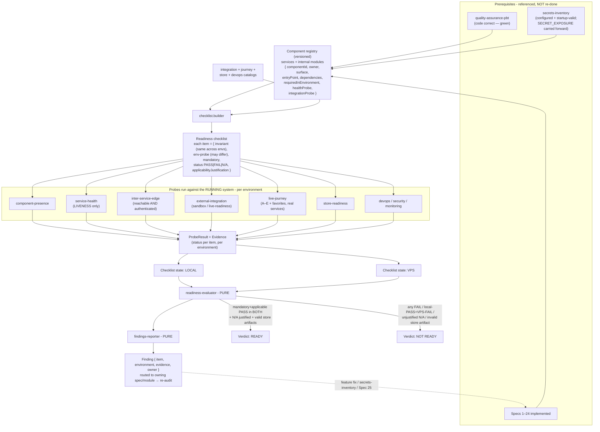
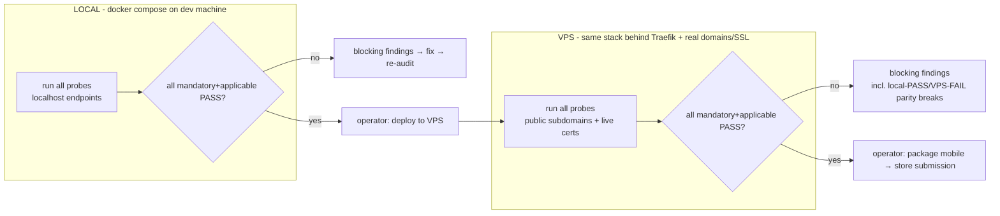
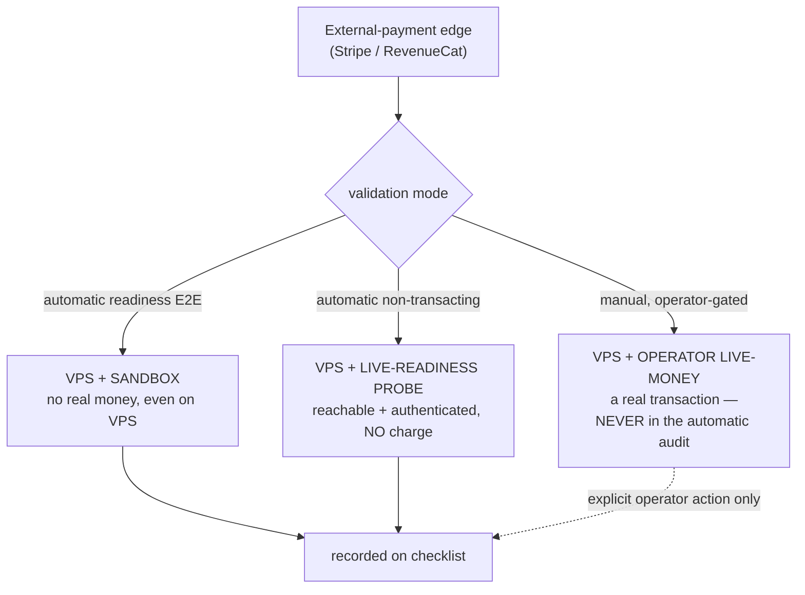
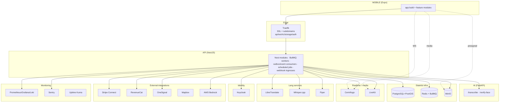

# Design Document

## Overview

`full-audit` (deployment-readiness) is the platform's **final gate before go-live**. It is a **meta / operational spec**, not a product feature: it ships no user-facing runtime behavior, adds no database tables, and re-runs no unit/property suite. Its job is exactly the operator's ask — *verify every component (backend, frontend, DevOps, engineering) is well, integrated, connected, and fully functional* — against the **live, assembled system**, first in **local Docker**, then on the **VPS behind Traefik with real domains + SSL**, and confirm the mobile app is **store-submission-ready**.

It runs after every feature is implemented (Specs 1–24), correctness is verified (`quality-assurance-pbt`, Spec 25), and configuration is inventoried + startup-valid (`secrets-inventory`). Its deliverables are:

1. A **versioned component registry** — the checkable definition of "every component", covering not just top-level services but the internal modules that can be "up but unwired" (Nest modules, BullMQ workers, event/outbox consumers, scheduled jobs, webhook ingresses, AI endpoints, mobile feature modules, notification consumers).
2. A **single maintained readiness checklist** — every component, inter-service edge, external integration, live journey, store artifact, and DevOps item as a checklist item that separates its **invariant** (the expected condition — identical across environments) from its **environment-specific probe** (HOW it is checked — MAY differ local vs VPS), each with a tri-state status `PASS | FAIL | N/A` and a required applicability justification when `N/A`.
3. A **probe library** — typed probes (component-presence, service-health, inter-service-edge, external-integration, live-journey, store-readiness, devops/security/monitoring) that produce evidence from the *running* system.
4. A **readiness evaluator + findings reporter** — pure aggregation that computes the verdict (`READY | NOT_READY`), enforces two-environment parity, and routes each `FAIL` to its owner as a finding. It reports and gates; it never patches.
5. A **readiness report** + **deployment/readiness runbook** + **ARCHITECTURE topology note** + **ADR-011** + CHANGELOG updates.

### Authority chain (the design's spine)

Every decision flows from this one-directional chain. The **running deployment is the subject under audit**; truth about "is it up / reachable / healthy / connected / functional" comes from *probing the live system*, never from re-reading code or config:

```
COMPONENT REGISTRY   →  PROBES (against the RUNNING system)  →  READINESS CHECKLIST  →  READINESS VERDICT
  (the definition of      (evidence: health, connectivity,        (per-item invariant     (READY iff every
   "every component":      auth, live journeys, store, devops)     + env-probe + status    mandatory+applicable
   services + modules)                                             PASS|FAIL|N/A)          item PASS in BOTH envs
                                                                                           + valid store artifacts)
```

- **The component registry is authoritative for "what must exist and be wired."** Completeness is verified against it, so "every component is wired" is a checkable claim, not an open-ended one. A component is "real" only because the registry declares it.
- **Probes are authoritative for "is it actually alive/reachable/functional."** A health `200` is a **liveness signal only** — never integration proof; edges are verified separately by actually connecting + authenticating. The audit **never reduces to `GET /health`**.
- **The readiness checklist is the single auditable artifact.** "Ready to ship" is a checklist *state* (every mandatory+applicable item PASS in both environments), not an opinion.
- **Owning specs remain the source of truth for behavior + config + correctness.** full-audit *observes and verifies*; a discrepancy is a **finding routed to the owner**, never fixed here.
- **This spec declares readiness; it does not perform the irreversible actions.** VPS deploy, store submission, and any live-money validation are **operator-executed**, guided by the checklist, in the order local-GREEN → VPS-GREEN → package → submit.

### Clean boundaries with neighbors (kept strict)

| Concern | Owner | full-audit's relationship |
|---|---|---|
| Code correctness (properties, PBT, unit/integration) | `quality-assurance-pbt` (Spec 25) | **References** its results (green = code correct); **never re-runs** the suites |
| Configuration existence + startup-validity; secret handling | `secrets-inventory` | Assumes config filled + validators pass; **carries forward** any `SECRET_EXPOSURE` as a **blocking** finding, **never remediates/rotates** |
| Feature behavior | each owning spec (1–24) | Routes defects to the owner; **never implements or changes** behavior |
| Ongoing production monitoring (SRE) | operations (separate) | **Verifies monitoring is wired**, does not operate it |

### "Operational-for-readiness", not "production-reliability-proven"

`operational` here is a **bounded, point-in-time bar**: healthy + reachable + critical journeys functional *at audit time*. It does **not** claim sustained production reliability — that is ongoing monitoring's job (which full-audit only verifies is *wired*). This keeps the spec out of SRE/observability.

### Live-money is never auto-triggered

External-payment edges are validated in **three explicitly-separated modes** so the automatic audit can never fire a real financial operation:

- **VPS + sandbox** → the automatic readiness E2E (no real money, even on the VPS).
- **VPS + live-readiness probes** → non-transacting reachability/auth checks of live integrations (no charge).
- **VPS + operator live-money** → a real transaction: **manual, operator-gated, NEVER part of the automatic audit.**

The audit never prints, rotates, relocates, or leaks a secret.

## Architecture

### Where the audit lives

Like its meta-spec neighbors, full-audit is a **tooling + documentation artifact**, not a NestJS module with controllers or a mobile screen. It lives in a dedicated tooling location and produces committed docs + a machine-readable report:

```
tools/full-audit/
  registry/
    component-registry.ts        # types: ComponentEntry, Surface, RequiredInEnvironment, ProbeRef
    component-registry.yaml       # the versioned registry (services + internal modules) — source artifact
  checklist/
    checklist.model.ts            # types: ChecklistItem, Invariant, Probe, Status, Environment, Finding, ReadinessReport
    checklist.builder.ts          # registry + integration/journey/store/devops catalogs → checklist items
  probes/                         # one probe family per probe TYPE (each emits ProbeResult + Evidence)
    component-presence.probe.ts   # required service exists + is up (per environment)
    service-health.probe.ts       # liveness/readiness GREEN — LIVENESS ONLY, not edge proof
    inter-service-edge.probe.ts   # edge actually reachable AND authenticated (real signed call), no secret printed
    external-integration.probe.ts # Stripe/RevenueCat/OneSignal/Mapbox/Bedrock reachable per environment (sandbox/live)
    live-journey.probe.ts         # Spec 25 journeys A–E + favorites-first against the RUNNING system (not mocks)
    store-readiness.probe.ts      # AAB/IPA + Galaxy + artifacts (icons, unfolded screenshots, listing, rating, privacy)
    devops-security.probe.ts      # Traefik SSL/domains, backups (recent readable artifact), monitoring wired, green CI, TLS, secrets server-side
  payment/
    payment-modes.ts              # sandbox | live-readiness (non-transacting) | operator-live-money (manual gate)
  evaluate/
    readiness-evaluator.ts        # PURE: checklist (both envs) → verdict + parity check + N/A validation
    findings-reporter.ts          # PURE: FAIL/unjustified-N/A → routed Finding (never patches)
  audit.cli.ts                    # entry point: runs a full audit for a given environment, emits report
  reports/                        # generated: readiness-report.{local,vps}.json, findings.json

docs/
  deployment/READINESS-CHECKLIST.md   # the maintained, human-facing checklist artifact
  deployment/READINESS-RUNBOOK.md     # local-GREEN → VPS deploy → VPS-GREEN → package → submit
  ADR/011-full-audit-live-readiness.md
```

The audit is **operator-run per environment** (local, then VPS); it is not a PR gate (the running VPS is not available to CI). CI's own green-HEAD is instead one *item* the DevOps probe checks.

### The two authority inputs: registry + checklist

Because "every component" and "ready" must be **checkable claims** rather than opinions, the design is anchored on two versioned artifacts:

- The **component registry** defines the closed set of things that must be present + wired.
- The **readiness checklist** is derived from the registry (plus the integration/journey/store/devops catalogs) and holds one item per verifiable condition, each with its invariant, its per-environment probe, and its tri-state status.

### Data-flow: how the audit derives its verdict



### Two-environment discipline: local first, then VPS

The same audit runs **twice with the same invariants** but environment-appropriate probes. Each item's *invariant* ("API authenticates to Keycloak") is identical in both; its *probe* differs (localhost endpoint vs public subdomain). Items only meaningful in one environment (real Let's Encrypt certs, production domains, VPS routing, production monitoring) are `N/A` in the other **with a justification — never forced GREEN, never silently skipped**. A mandatory+applicable item that is PASS locally but FAIL on the VPS is a **blocking finding** (parity required).



### External-payment validation modes



### Audited topology (what is probed)



Every node above is a **component-presence + service-health** item; every arrow is an **inter-service-edge** item (reachable + authenticated). Each is probed in both environments.

## Components and Interfaces

### 1. Component registry (`registry/component-registry.ts`)

The checkable definition of "every component." It enumerates **services and internal modules** so an "up but unwired" module (a worker that never consumes, a webhook ingress never mounted) is a verifiable gap, not an oversight.

```typescript
export type Surface = 'API' | 'AI' | 'MOBILE' | 'INFRA';

export type RequiredInEnvironment = 'local' | 'vps' | 'both';

/** Reference to a probe that verifies a specific condition. */
export interface ProbeRef {
  readonly probeType:
    | 'component-presence'
    | 'service-health'
    | 'inter-service-edge'
    | 'external-integration'
    | 'live-journey'
    | 'store-readiness'
    | 'devops-security';
  readonly probeId: string; // stable id, referenced by checklist items
}

export interface ComponentEntry {
  readonly componentId: string;         // e.g. 'api.bullmq.radar-worker', 'ai.verify-face'
  readonly owner: string;               // owning spec/module accountable for it
  readonly surface: Surface;
  readonly entryPoint: string;          // how it is reached/registered (route, queue name, consumer, cron)
  readonly dependencies: readonly string[]; // other componentIds it depends on
  readonly requiredInEnvironment: RequiredInEnvironment;
  readonly healthProbe: ProbeRef;       // liveness signal (NOT integration proof)
  readonly integrationProbe: ProbeRef;  // wired-into-the-system proof (edge/consumer/emitter)
}
```

The registry covers, at minimum: the top-level services + infra in the topology diagram; the API's Nest modules, BullMQ workers, outbox/event consumers, scheduled jobs, and webhook ingresses (Stripe/RevenueCat/OneSignal/LiveKit); the AI endpoints (`/transcribe`, `/verify-face`); the mobile feature modules; and the notification consumers.

### 2. Checklist model (`checklist/checklist.model.ts`)

The core type. An item **separates invariant from probe** so "same criteria across environments" means *same invariant*, not *identical probe*. Status is **tri-state**, and `N/A` **requires** a justification.

```typescript
export type Environment = 'local' | 'vps';

export type Status = 'PASS' | 'FAIL' | 'N/A';

export type CheckCategory =
  | 'COMPONENT_PRESENCE'
  | 'SERVICE_HEALTH'
  | 'INTER_SERVICE_EDGE'
  | 'EXTERNAL_INTEGRATION'
  | 'LIVE_JOURNEY'
  | 'STORE_READINESS'
  | 'DEVOPS_SECURITY';

/** The expected condition — IDENTICAL across environments. */
export interface Invariant {
  readonly id: string;
  readonly description: string; // e.g. "API authenticates to Keycloak via JWKS"
  readonly category: CheckCategory;
}

/** HOW the invariant is checked in a given environment — MAY differ local vs VPS. */
export interface Probe {
  readonly probeRef: ProbeRef;
  readonly environment: Environment;
  readonly target: string; // localhost endpoint vs public subdomain, etc.
}

/** The result of running a probe against the running system. */
export interface ProbeResult {
  readonly status: Status;
  readonly evidence: string;             // response summary, timing, auth outcome — NEVER a secret value
  readonly observedAt: string;           // ISO timestamp
}

export interface ChecklistItem {
  readonly invariant: Invariant;
  readonly owner: string;                // owning spec/module (finding routing target)
  readonly mandatory: boolean;
  readonly probes: Readonly<Record<Environment, Probe | null>>; // null iff not applicable in that env
  readonly results: Partial<Record<Environment, ProbeResult>>;
  readonly applicabilityJustification: Partial<Record<Environment, string>>; // REQUIRED when a result is N/A
}

export type FindingReason =
  | 'MISSING_OR_DOWN'          // required component absent/unhealthy
  | 'DEAD_EDGE'               // edge configured but unreachable/unauthenticated
  | 'UNWIRED_COMPONENT'       // present but not integrated (no consume/emit)
  | 'CHAIN_NOT_FIRING'        // durable event chain never fires end-to-end
  | 'LIVE_JOURNEY_FAILED'
  | 'PARITY_BREAK'            // PASS local, FAIL vps (or vice-versa) on a mandatory+applicable item
  | 'UNJUSTIFIED_NA'          // N/A on a mandatory item without a justification
  | 'INVALID_STORE_ARTIFACT'
  | 'DEVOPS_MISCONFIGURED'
  | 'SECRET_EXPOSURE';        // carried forward from secrets-inventory

export interface Finding {
  readonly reason: FindingReason;
  readonly invariantId: string;
  readonly environment: Environment | 'both';
  readonly evidence: string;   // never a secret value
  readonly owner: string;      // routed to this owning spec/module
  readonly blocking: boolean;  // all readiness findings are blocking
}

export type Verdict = 'READY' | 'NOT_READY';

export interface ReadinessReport {
  readonly items: readonly ChecklistItem[];
  readonly findings: readonly Finding[];
  readonly verdict: Verdict; // READY iff no blocking finding across BOTH environments
}
```

### 3. Probe library (`probes/*.probe.ts`)

One probe family per **probe type**. Each takes the running-system connection info for an environment and returns a `ProbeResult` with evidence. The critical design rule — encoded in the types and enforced by the evaluator — is that **service-health is liveness only and never substitutes for an edge probe**.

- **`component-presence.probe`**: the required service/module exists and is up in the given environment (process/container running, module registered). A missing required component → `FAIL` (`MISSING_OR_DOWN`). A component with no native health endpoint gets a **minimal liveness probe** rather than an assumption of "up."
- **`service-health.probe`**: probes a health/readiness endpoint (or the defined minimal liveness probe) and requires GREEN. Its evidence explicitly records that this is a **liveness signal, not edge proof** — the audit never reduces a component to `GET /health`.
- **`inter-service-edge.probe`**: performs a **real, authenticated call** across the edge (e.g. mint a Keycloak token and validate JWKS; publish to Centrifugo; presign a MinIO URL and fetch; call AI `/verify-face`), confirming the configured credential **actually authenticates** — **without printing or rotating the secret**. Configured-but-dead → `FAIL` (`DEAD_EDGE`).
- **`external-integration.probe`**: exercises the environment's configured integration (sandbox or live) for Stripe/RevenueCat/OneSignal/Mapbox/Bedrock. Uses the payment-mode policy (below) so **no real money moves in a test**.
- **`live-journey.probe`**: runs the Spec 25 critical journeys (A–E + favorites-first) against the **running** assembled system (real services, not mocks), covering both Host and Cleaner and the full lifecycle + dispute + subscription. Money touches use **sandbox only**.
- **`store-readiness.probe`**: confirms the app builds into required artifacts (Android AAB for Play + Galaxy, iOS build) meeting current store technical requirements, and that submission artifacts are present + valid (icon 1024×1024, screenshots incl. unfolded/large-screen, listing metadata, content rating, privacy link, a concrete reviewer test path with credentials supplied **without committing them to the repo**).
- **`devops-security.probe`**: Traefik SSL (valid certs) on all subdomains; monitoring stack wired + receiving data; **backups configured + a recent successful artifact exists and is readable**; CI green on HEAD + running the intended suites; TLS in transit; secrets server/infra-side (no secret in the client bundle); any carried-forward `SECRET_EXPOSURE` surfaced as blocking.

```typescript
export interface ProbeContext {
  readonly environment: Environment;
  readonly targets: Readonly<Record<string, string>>; // resolved endpoints per component
}

export type Probe = (ctx: ProbeContext, item: ChecklistItem) => Promise<ProbeResult>;
```

### 4. Payment-mode policy (`payment/payment-modes.ts`)

Encodes the three separated modes so the automatic audit can **structurally never** fire real money.

```typescript
export type PaymentMode =
  | 'sandbox'              // automatic readiness E2E — no real money
  | 'live-readiness'      // automatic non-transacting reachability/auth probe — no charge
  | 'operator-live-money'; // MANUAL, operator-gated real transaction — NEVER in the automatic audit

/** The automatic audit may only use sandbox or live-readiness. operator-live-money is refused here. */
export function assertAutomaticModeAllowed(mode: PaymentMode): void;
// throws if mode === 'operator-live-money' — a real transaction can only be an explicit operator action.
```

### 5. Readiness evaluator (`evaluate/readiness-evaluator.ts`)

**Pure** aggregation over the two environments' checklist states. It enforces two-environment parity, validates `N/A` justifications, and computes the verdict.

```typescript
export interface EvaluatorInput {
  readonly local: readonly ChecklistItem[];
  readonly vps: readonly ChecklistItem[];
  readonly storeArtifactsValid: boolean;
}

export function evaluateReadiness(input: EvaluatorInput): ReadinessReport;
// READY iff, for every mandatory item: it is PASS in both environments where APPLICABLE,
// every N/A is justified, there is no local-PASS/VPS-FAIL parity break, and store artifacts are valid.
// Any violation yields a blocking Finding and verdict NOT_READY.
```

### 6. Findings reporter (`evaluate/findings-reporter.ts`)

**Pure** function turning each violating item into a routed `Finding`. It **reports and routes; it never patches**. Every finding carries `{ item, environment, evidence, owner }`, with `owner` taken from the checklist item / registry entry so the fix lands in the right place (feature fix / `secrets-inventory` config / Spec 25 property / mobile build / DevOps).

```typescript
export function reportFindings(report: ReadinessReport): readonly Finding[];
// one finding per violating condition; no violation is silently dropped; no behavior/config is mutated.
```

### 7. Audit CLI (`audit.cli.ts`)

Entry point: `audit --env local|vps` runs every applicable probe for that environment, records results on the checklist, and (when both environment reports exist) invokes the evaluator + reporter to emit `readiness-report.{env}.json` and `findings.json`, plus refreshes the human `READINESS-CHECKLIST.md`.

## Data Models

This spec introduces **no database entities** and **no runtime schema** — it holds no product state. Where a probe needs a database (the real-infra edges/journeys), it uses the **owning specs' schema** already deployed in the environment under audit; full-audit only reads/exercises it, never defines it. Its "data models" are the in-memory + serialized artifacts:

1. **Component registry** — `ComponentEntry[]`, versioned in `component-registry.yaml`.
2. **Readiness checklist** — `ChecklistItem[]`, the maintained artifact serialized to `docs/deployment/READINESS-CHECKLIST.md` (human) and consumed as data by the evaluator.
3. **Readiness report** — `ReadinessReport` per environment, serialized to `reports/readiness-report.{local,vps}.json`.
4. **Findings** — `Finding[]`, serialized to `reports/findings.json`, each routed to an owner.

### Checklist categories consolidated (the full audited surface)

| Category | Representative items | Mandatory | Payment mode |
|---|---|---|---|
| `COMPONENT_PRESENCE` | API, AI, mobile build, Postgres+PostGIS, Redis, MinIO, Keycloak, Centrifugo, LiveKit, LibreTranslate, Whisper, Piper, Traefik, Prometheus/Grafana/Loki, Sentry, Uptime Kuma | yes | — |
| `SERVICE_HEALTH` | each service's health/readiness GREEN (liveness only) | yes | — |
| `INTER_SERVICE_EDGE` | API→{Postgres, Redis/BullMQ, MinIO, Keycloak JWKS, Centrifugo publish, LiveKit token+webhook, AI /transcribe+/verify-face}; mobile→{API, Centrifugo WS, LiveKit media, MinIO presigned} | yes | — |
| `EXTERNAL_INTEGRATION` | API→{Stripe, RevenueCat, OneSignal, Bedrock}; mobile→Mapbox | yes | sandbox / live-readiness |
| `LIVE_JOURNEY` | Spec 25 A–E + favorites-first against the running system | yes | sandbox only |
| `STORE_READINESS` | Android AAB (Play+Galaxy), iOS build, icon, screenshots (incl. unfolded), listing, rating, privacy, reviewer test path | yes | — |
| `DEVOPS_SECURITY` | Traefik SSL/domains, backups (recent readable artifact), monitoring wired, green-HEAD CI, TLS, secrets server-side, carried-forward SECRET_EXPOSURE | yes | — |

Items only meaningful in one environment (real Let's Encrypt certs, production domains, VPS routing, production monitoring) are `N/A` in `local` with an explicit applicability justification; the automatic live-money path is never a checklist item (it is an operator action outside the audit).

## Correctness Properties

*A property is a characteristic or behavior that should hold true across all valid executions of a system — essentially, a formal statement about what the system should do. Properties serve as the bridge between human-readable specifications and machine-verifiable correctness guarantees.*

full-audit is an operational spec: the *act* of probing 16 live services, exercising real event chains, running live journeys, inspecting real certs/backups/CI, and building store artifacts is **integration/E2E** work (it tests deployed/external behavior, is high-cost, and does not vary meaningfully with generated input — see the Testing Strategy). But the spec also has a genuine **pure logic core** — the registry→checklist builder, the readiness evaluator (two environments → verdict + parity), the tri-state / `N/A`-justification integrity rule, the findings reporter (routing, no-drop, no-patch), the payment-mode policy, and the no-secret-in-evidence rule. These are pure, deterministic functions over structured inputs (checklist item sets with per-environment tri-state statuses, registries, probe results) with universal invariants, so property-based testing is the right tool for them. Each property below is universally quantified and maps back to the acceptance criteria and the `REQ-FA*` invariants.

Redundant candidates from the prework were consolidated: every "a FAIL blocks readiness and routes a finding" criterion collapses into the **readiness-verdict equivalence** (Property 5) plus the **findings-reporter** (Property 6); all per-environment tri-state/justification criteria collapse into **tri-state integrity** (Property 3); all parity criteria into **parity** (Property 4); all completeness criteria into **registry→checklist completeness** (Property 1).

### Property 1: Registry→checklist completeness (every component, no silent drop)

*For any* component registry (services and internal modules across all four surfaces `{API, AI, MOBILE, INFRA}`), the checklist builder SHALL produce, for **every** registry entry, both a component-presence checklist item and an integration checklist item, each referencing a **defined, non-trivial probe** (a component with no native health endpoint still gets a minimal liveness probe, never an "assume up") — no registry entry is ever silently absent from the checklist, and every catalogued item carries an owner.

**Validates: Requirements 1.1, 1.4, 3.1, 3.5** · REQ-FA1b

### Property 2: Health is liveness only — never integration proof

*For any* checklist and *for any* set of probe results, an item of category `INTER_SERVICE_EDGE` or `EXTERNAL_INTEGRATION` SHALL be marked `PASS` only when its own edge/integration probe returned `PASS`; a `SERVICE_HEALTH` `PASS` on the same component SHALL never by itself satisfy an edge/integration item. The audit's readiness for any edge is therefore never derivable from `GET /health` alone.

**Validates: Requirements 1.2, 2.1** · REQ-FA1, REQ-FA3

### Property 3: Tri-state integrity and mandatory N/A justification

*For any* checklist item and environment, its recorded status SHALL be exactly one of `{PASS, FAIL, N/A}`; whenever the status is `N/A` there SHALL be a non-empty applicability justification for that environment; and an `N/A` SHALL never be counted as `PASS`. An `N/A` on a **mandatory** item with no justification SHALL itself yield a finding.

**Validates: Requirements 1.5, 2.5, 5.3, 8.2** · REQ-FA6

### Property 4: Two-environment parity (same invariant, per-environment probe; disagreement blocks)

*For any* mandatory checklist item that is **applicable in both** environments, if its status differs between `local` and `vps` (e.g. `PASS` local, `FAIL` vps), the evaluator SHALL emit a blocking `PARITY_BREAK` finding and the verdict SHALL be `NOT_READY`; and *for any* item, its `invariant` SHALL be a single environment-independent value while its `probes` are keyed per environment (same invariant, environment-appropriate probe). A local-only pass SHALL never satisfy a both-environments-mandatory item.

**Validates: Requirements 4.5, 5.1, 5.3, 7.5** · REQ-FA6

### Property 5: Readiness verdict equivalence

*For any* pair of per-environment checklist states plus the store-artifact validity flag, the verdict SHALL be `READY` **if and only if** every mandatory item is `PASS` in every environment where it is applicable, every `N/A` is justified, there is no parity break, and store artifacts are valid — equivalently, `READY` iff the report contains **no** blocking finding across both environments. Any mandatory+applicable `FAIL` in either environment (or an invalid store artifact) SHALL force `NOT_READY`.

**Validates: Requirements 1.3, 2.3, 3.3, 4.3, 5.5, 6.5, 7.4, 8.2** · REQ-FA10

### Property 6: Findings are routed, complete, and never patch

*For any* evaluated readiness report, the findings reporter SHALL emit **exactly one finding per violating condition** (no violation silently dropped), each carrying `{ invariantId (item), environment, evidence, owner }` with a non-empty `owner`, and SHALL **mutate none** of its inputs (the checklist and results are deep-equal before and after) — full-audit reports and gates, it never silently patches behavior or config.

**Validates: Requirements 8.1, 8.3** · REQ-FA10

### Property 7: No secret is ever emitted in evidence or findings

*For any* probe result, finding, or serialized report, the `evidence` and finding fields SHALL never contain a value matching a known secret shape (the edge/auth probes reference a credential by name/outcome — "authenticated" / "JWKS valid" — never by value); a reviewer test path likewise references credentials without embedding them. The audit never prints, rotates, or leaks a secret.

**Validates: Requirements 2.2, 6.3, 7.3** · REQ-FA9

### Property 8: The automatic audit can never move real money

*For any* automatic-audit invocation of an external-payment edge, the payment-mode policy SHALL permit only `sandbox` or `live-readiness` (non-transacting) and SHALL refuse `operator-live-money`; a real live-money transaction is only reachable through an explicit, operator-gated action outside the automatic audit. No automatic path SHALL select `operator-live-money`.

**Validates: Requirements 2.4, 4.2** · REQ-FA9

### Property 9: Carried-forward SECRET_EXPOSURE is always blocking

*For any* audit input that carries a `SECRET_EXPOSURE` finding forward from `secrets-inventory`, the evaluator SHALL surface it as a **blocking** finding and the verdict SHALL be `NOT_READY` — the exposure is never remediated here (no rotate/move) and never silently dropped or downgraded.

**Validates: Requirements 7.3** · REQ-FA8

### Property 10: Reachable-and-authenticated edge invariant is distinct from configured

*For any* inter-service-edge item, a `PASS` SHALL require evidence of an actually-completed authenticated call (reachable **and** authenticated); a merely-configured edge with no successful authenticated call SHALL resolve to `FAIL` (`DEAD_EDGE`), never `PASS`. Configuration presence alone SHALL never count as a live edge.

**Validates: Requirements 2.1, 2.3** · REQ-FA3

## Error Handling

- **Required component missing/down/unhealthy:** `component-presence`/`service-health` returns `FAIL` (`MISSING_OR_DOWN`); a blocking finding with evidence + owner is produced and readiness is `NOT_READY` — never declared ready with a hole (Req 1.3).
- **Edge configured but unreachable/unauthenticated:** `inter-service-edge` returns `FAIL` (`DEAD_EDGE`); configured-but-dead never counts as ready (Req 2.3, Property 10).
- **Present-but-unwired component / event chain that never fires:** `UNWIRED_COMPONENT` / `CHAIN_NOT_FIRING` FAIL → blocking finding routed to the owner (Req 3.3).
- **Probe cannot run (target unreachable, tooling error):** treated as `FAIL` with the error captured as evidence — **never** silently converted to `N/A` or `PASS`. An environment where a mandatory probe cannot execute cannot assert readiness.
- **`N/A` without justification on a mandatory item:** the evaluator raises an `UNJUSTIFIED_NA` finding — an item cannot be waved to `N/A` to force readiness (Req 8.2).
- **Local-PASS / VPS-FAIL on a mandatory+applicable item:** `PARITY_BREAK` blocking finding; local success alone never declares readiness (Req 5.3).
- **External-payment probe:** the automatic audit is structurally confined to `sandbox`/`live-readiness`; `assertAutomaticModeAllowed` throws if `operator-live-money` is requested in an automatic run — a real transaction is only an explicit operator action (Req 2.4, 4.2).
- **Secret encountered while probing:** evidence references the credential by name/outcome only; no probe result, finding, or report contains a secret value. A carried-forward `SECRET_EXPOSURE` is surfaced as blocking, not remediated (Req 7.3).
- **Store artifact missing/invalid:** `INVALID_STORE_ARTIFACT` blocking finding routed to the owning concern (mobile build / `samsung-optimization` / listing assets); readiness is store-readiness, never store-approval (Req 6.4, 6.5).
- **CI not green on HEAD / backups not recently succeeded / monitoring not receiving data:** `DEVOPS_MISCONFIGURED` blocking finding; "a cron exists" alone is not "ready" — a recent readable backup artifact is required (Req 7.1, 7.2).
- **Owning-spec disagreement (a probe surfaces a behavior discrepancy):** routed to the owning spec/module as a finding; full-audit never changes behavior or config to make a probe pass (Req 8.3).

## Testing Strategy

### Property-based tests (the pure logic core)

PBT applies to the deterministic core: the registry→checklist builder, the readiness evaluator (parity + verdict), the tri-state/justification integrity rule, the findings reporter, the payment-mode policy, the no-secret-in-evidence rule, and the edge-vs-config invariant. Use **fast-check** (the repo's established TypeScript PBT choice, as in the sibling `secrets-inventory` and `quality-assurance-pbt` specs). Do **not** implement PBT from scratch.

- Each of Properties 1–10 is implemented by a **single** property-based test.
- Minimum **100 iterations** per property test.
- Each test is tagged: `// Feature: full-audit, Property {n}: {property text}`.
- Generators produce: arbitrary component registries (varied surfaces, entries with/without native health endpoints, internal modules); arbitrary checklists with independently-chosen per-environment tri-state statuses, mandatory flags, justified/unjustified `N/A`s, and applicable/inapplicable-per-environment items; arbitrary probe-result sets (health vs edge vs integration) to exercise Property 2; synthetic evidence/finding strings seeded with and without secret-shaped substrings for Property 7; and inputs carrying/not-carrying a `SECRET_EXPOSURE` for Property 9 — so edge cases (empty registry, all-FAIL, all-`N/A`, single-environment-only items, parity disagreement) are covered by generation.
- For Property 6 (no-patch), the test asserts the evaluator/reporter inputs are deep-equal before and after (purity).

### Example-based unit tests

- **Checklist builder:** a fixed small registry produces the expected presence + integration items with owners; an entry lacking a native health endpoint still gets a minimal liveness probe.
- **Evaluator edges:** all-PASS both envs + valid store → `READY`; one mandatory `FAIL` → `NOT_READY`; justified `N/A` on a VPS-only item in `local` → still `READY`; unjustified `N/A` on a mandatory item → finding.
- **Payment-mode policy:** `assertAutomaticModeAllowed` permits `sandbox`/`live-readiness`, throws on `operator-live-money`.
- **Findings reporter routing:** a `DEAD_EDGE` on the API→Keycloak item routes to the auth owner; an `INVALID_STORE_ARTIFACT` routes to the mobile-build owner.

### Integration tests (against the running system — 1–3 runs per environment, not 100 iterations)

These verify the probes wired to the **actually-running** stack; behavior does not vary meaningfully with input, so they run a small number of representative times per environment (local, then VPS):

- **Component presence + service health:** every registry service answers its liveness probe GREEN in the environment under audit (Req 1.1, 1.2).
- **Inter-service edges (reachable + authenticated):** a real authenticated call succeeds on each edge — mint/validate a Keycloak token via JWKS, publish to Centrifugo, mint a LiveKit token + receive its webhook, presign + fetch a MinIO object, call AI `/transcribe` and `/verify-face`, connect to Postgres/Redis — with no secret printed (Req 2.1, 2.2).
- **External integrations:** Stripe/RevenueCat/OneSignal/Bedrock reachable via the environment's configured mode (sandbox or non-transacting live-readiness); mobile→Mapbox reachable — no real money (Req 2.4).
- **Durable event chains end-to-end:** `offer.matched`→escrow charge, `service_arrived`→video-verification, `checklist_completed`→completion, dispute routing→escrow action, outbox→push each fire against the running system (Req 3.2).
- **Live journeys:** Spec 25's A–E + favorites-first run against the running assembled system (real services, not mocks), both roles, full lifecycle + dispute + subscription, sandbox money only (Req 4.1, 4.4).
- **VPS specifics:** real domains resolve, Traefik terminates valid Let's Encrypt SSL, the api/ws/rtc/storage/auth subdomains route, production-appropriate config is in effect (Req 5.2, 5.4).
- **DevOps/security/monitoring on the VPS:** SSL valid; monitoring stack receiving data; a recent successful backup artifact exists and is readable; CI green on HEAD running the intended suites; TLS in transit; no secret in the client bundle; carried-forward `SECRET_EXPOSURE` surfaced (Req 7.1, 7.2, 7.3, 7.5).

### Build / readiness checks

- **Store artifacts:** the single Expo codebase builds an Android AAB (Play + Galaxy) and iOS build meeting current store technical requirements; icon, screenshots (incl. unfolded), listing metadata, content rating, privacy link, and a reviewer test path are present + valid — reviewer credentials supplied to the store **without committing them to the repo** (Req 6.1, 6.2, 6.3).

### Two-environment discipline

Every applicable check runs in **both** environments with the same invariant and an environment-appropriate probe; the evaluator enforces parity (local-PASS/VPS-FAIL is blocking) and validates every `N/A` justification. Readiness is declared only when both environments are all-green + store artifacts valid (Req 5.5, 8.2).

### Boundary discipline (verified by review)

- The audit invokes **no** Spec 25 unit/property suite — it references their results (Req 3.4).
- The audit performs **no** deploy/submit/live-money action — it declares readiness only; the operator executes the irreversible actions in order local-GREEN → VPS-GREEN → package → submit (Req 8.4).

### Documentation deliverables (verified by review, not tests)

- `docs/deployment/READINESS-CHECKLIST.md` (the maintained checklist artifact) and `docs/deployment/READINESS-RUNBOOK.md` created and cross-referenced.
- `docs/ARCHITECTURE.md` gains a "Deployment-Readiness Audit" note + a Mermaid diagram of the audited topology and the two-environment flow.
- `docs/ADR/011-full-audit-live-readiness.md` records the live-audit, two-environment-parity, and report-not-patch decisions.
- `docs/CHANGELOG.md` gains an entry under `## [Unreleased]`.

## Documentation Impact

- **READMEs:** new `tools/full-audit/README.md` — the audit's purpose, the registry + checklist model, the seven probe types (and why health ≠ integration), the two-environment discipline, the three payment modes, the readiness gate ordering, and the clean boundaries with `quality-assurance-pbt` and `secrets-inventory`.
- **`docs/deployment/READINESS-CHECKLIST.md`:** the single maintained auditable artifact — every component, edge, integration, live journey, store artifact, and DevOps item with its invariant, per-environment probe, and tri-state status; a re-audit artifact, not a one-off.
- **`docs/deployment/READINESS-RUNBOOK.md`:** the operator runbook — run local audit → all green → deploy to VPS → run VPS audit → all green → package mobile → submit to stores; how to run the audit per environment; how findings are routed and re-audited; how the operator-gated live-money validation is performed outside the automatic audit.
- **`docs/ARCHITECTURE.md`:** add a "Deployment-Readiness Audit (full-audit)" section with the audited-topology Mermaid diagram and the two-environment parity flow. Clarify this is a verification/operational module — no new product services, tables, or endpoints.
- **`docs/CHANGELOG.md`:** `[Unreleased]` entries for feature `full-audit`: component registry, readiness checklist + probe library, readiness evaluator + findings reporter, two-environment parity, three payment modes, readiness runbook.
- **`docs/ADR/011-full-audit-live-readiness.md`:** a new ADR recording the decisions — **(1)** audit the **live assembled system** (health ≠ integration; not reducible to `GET /health`); **(1b)** "every component" is **registry-defined** (services + internal modules); **(2)** **two-environment parity** (same invariant, environment-appropriate probe, tri-state with justified `N/A`, local-PASS/VPS-FAIL is blocking); **(3)** **three separated payment modes** (sandbox / non-transacting live-readiness / operator-gated live-money never in the automatic audit); **(4)** **report-and-gate, never patch** (findings routed to owners; the operator executes the irreversible ship actions); and the **clean boundaries** with Spec 25 (correctness, referenced not re-run) and `secrets-inventory` (config + secret handling; `SECRET_EXPOSURE` carried forward as blocking).
- **`.kiro/specs/ROADMAP.md`:** mark the `full-audit` spec status on completion.
