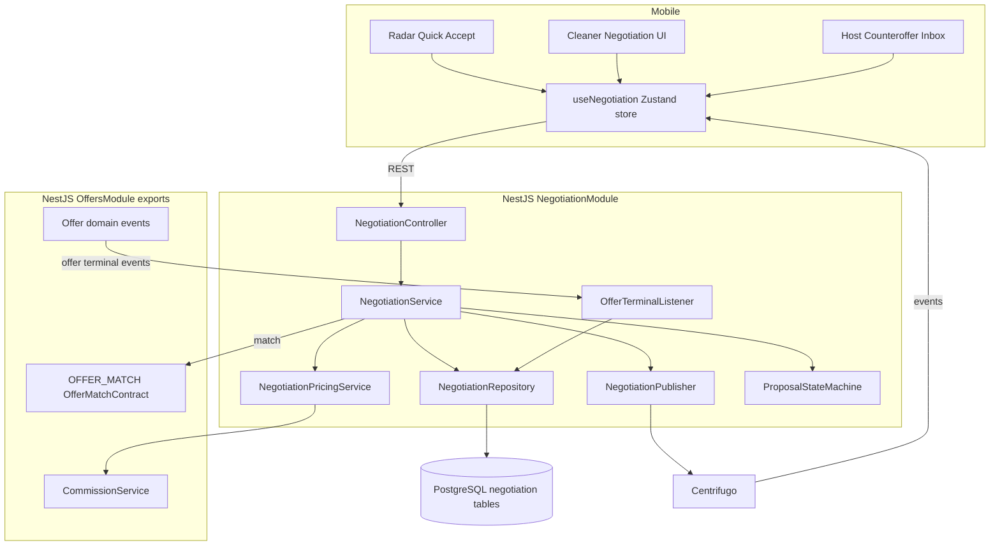
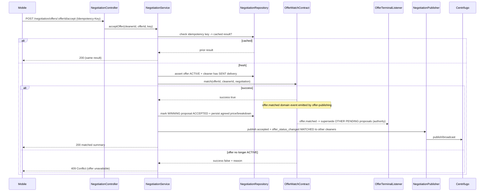
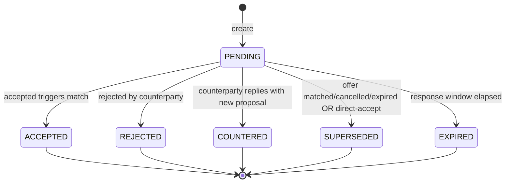

# Design Document

## Overview

The offer-negotiation module finalizes the match between a Host and a Cleaner. It sits downstream of `offer-publishing` (which owns the offer lifecycle) and `offer-radar` (which surfaces ACTIVE offers to Cleaners). Its job is to let a Cleaner **directly accept** an offer at the Host's price, or run a bounded **counteroffer negotiation** (Cleaner proposes -> Host accepts/rejects/counters -> Cleaner accepts/declines) that terminates in a single match.

The design is anchored on one hard rule inherited from offer-publishing: **external modules never write the `offers` table directly.** The only sanctioned path to ACTIVE -> MATCHED is the exposed `OfferMatchContract` (`OFFER_MATCH` DI token, `match(offerId, cleanerId, matchSource)`), which uses database-level optimistic locking to guarantee a single winner. Negotiation owns its own tables (`negotiation_threads`, `negotiation_proposals`) and references offers/cleaners/hosts by ID only.

### Key Design Decisions

1. **Generic `Proposal` entity.** A Cleaner counteroffer and a Host counter-back are the same row differing by `actor` (`CLEANER` | `HOST`). This avoids duplicate models. UX keeps the "Counteroffer / Counter-back" wording.
2. **Thread as the negotiation aggregate.** One `negotiation_thread` per `(offer_id, host_id, cleaner_id)` (DB-unique). A Host may hold many threads for one offer - one per delivered Cleaner. A thread has at most **one actionable PENDING proposal** at a time (DB-enforced partial unique index).
3. **Base Price is the immutable deviation reference.** Every proposed price is validated against `offers.offered_price_cents`, never against a prior proposal. This blocks progressive walk-down.
4. **Match via contract only.** Negotiation calls `OfferMatchContract.match(offerId, cleanerId, 'negotiation')`. It never mutates `offers`. It records the agreed price and payout breakdown on the winning proposal (its own domain).
5. **Reuse CommissionService.** All payout/host-total math reuses offer-publishing's `CommissionService` with the offer's snapshotted rate bps. No independent commission algorithm.
6. **REST is source of truth; Centrifugo is transport.** Real-time events carry a monotonic `version` so clients can drop stale events; a failed publish never rolls back persisted state.

### Responsibility Matrix

| Responsibility | offer-negotiation | offer-publishing | offer-radar | Mobile |
|----------------|:---:|:---:|:---:|:---:|
| Accept / counteroffer / reject lifecycle | YES | no | no | UI only |
| Thread & proposal persistence | YES | no | no | no |
| Deviation-bound validation | YES | no | no | mirror only |
| Payout / host-total computation | YES (via CommissionService) | YES (owns service) | no | no |
| ACTIVE -> MATCHED transition | no (calls contract) | YES (OfferMatchContract) | no | no |
| Offer lifecycle state ownership | no | YES | no | no |
| offer_status_changed{MATCHED} publish | YES (on match) | no | consumes | no |
| Negotiation real-time events | YES | no | no | consumes |
| Quick Accept trigger | no | no | delegates | YES |

## Architecture

### Module Placement

Negotiation lives in its own NestJS module that imports `OffersModule` (to inject `OFFER_MATCH` and `CommissionService`). This mirrors the precedent set by `available/` (the radar submodule) - a self-contained module rather than bloating the offers root.

```
services/api/src/negotiation/
|-- negotiation.module.ts
|-- negotiation.controller.ts        (Cleaner + Host REST endpoints)
|-- negotiation.service.ts           (orchestration: revalidate -> mutate -> match -> publish)
|-- negotiation.repository.ts        (thread + proposal queries, atomic writes)
|-- negotiation.constants.ts         (deviation bps, response window, max proposals, channels)
|-- negotiation.types.ts             (enums, internal types)
|-- proposal-state-machine.ts        (pure validation of proposal transitions)
|-- pricing/
|   `-- negotiation-pricing.service.ts  (wraps CommissionService for proposals)
|-- events/
|   |-- negotiation-events.ts        (event name constants + payload interfaces)
|   `-- negotiation-publisher.service.ts (Centrifugo channel scoping + publish)
|-- entities/
|   |-- negotiation-thread.entity.ts
|   `-- negotiation-proposal.entity.ts
|-- dto/
|   |-- accept-offer.dto.ts
|   |-- create-counteroffer.dto.ts
|   |-- host-counter.dto.ts
|   |-- respond-proposal.dto.ts      (reject / accept counter-back)
|   `-- negotiation-response.dto.ts
|-- listeners/
|   `-- offer-terminal.listener.ts   (SINGLE authority: supersede PENDING + close threads on offer terminal)
|-- reconciliation/
|   `-- negotiation-reconciliation.service.ts (periodic repair of partial post-match state)
|-- expiration/
|   `-- proposal-expiry.worker.ts    (marks EXPIRED proposals past their response window)
|-- __tests__/
|   `-- ...
`-- README.md
```

### System Context



### Accept Flow (Direct Accept & Counteroffer-Accept)



### Counteroffer Negotiation Flow

```mermaid
sequenceDiagram
    participant Cleaner
    participant Host
    participant Svc as NegotiationService
    participant Repo
    participant Pub

    Cleaner->>Svc: POST counteroffer (price)
    Svc->>Svc: validate ACTIVE + SENT delivery + deviation vs Base Price
    Svc->>Repo: upsert thread; INSERT proposal PENDING (partial-unique guards 1 PENDING)
    Svc->>Pub: negotiation_proposal_created -> Host channel
    Host->>Svc: POST counter-back (price)
    Svc->>Repo: set Cleaner proposal COUNTERED; INSERT Host proposal PENDING
    Svc->>Pub: negotiation_proposal_countered -> Cleaner channel
    Cleaner->>Svc: POST accept (Host proposal)
    Svc->>Svc: revalidate + match(offerId, cleanerId, negotiation)
    Svc->>Repo: Host proposal ACCEPTED; supersede others
    Svc->>Pub: negotiation_proposal_accepted + offer_status_changed MATCHED
```

## Proposal State Machine



Validation lives in `proposal-state-machine.ts` as a pure function mirroring offer-publishing's `validateTransition`:

```typescript
export const PROPOSAL_ALLOWED_TRANSITIONS: Record<ProposalStatus, ProposalStatus[]> = {
  PENDING: ['ACCEPTED', 'REJECTED', 'COUNTERED', 'SUPERSEDED', 'EXPIRED'],
  ACCEPTED: [],
  REJECTED: [],
  COUNTERED: [],
  SUPERSEDED: [],
  EXPIRED: [],
};

export const TERMINAL_PROPOSAL_STATUSES: ProposalStatus[] =
  ['ACCEPTED', 'REJECTED', 'COUNTERED', 'SUPERSEDED', 'EXPIRED'];
```

`SupersededReason`: `OFFER_MATCHED | OFFER_CANCELLED | OFFER_EXPIRED | DIRECT_ACCEPT`.

## Components and Interfaces

### REST Endpoints - NegotiationController

Class-level `@UseGuards(JwtAuthGuard)`. Role resolution mirrors `OffersController` (map `keycloakId` -> `User`, assert `user.roles.includes(UserRole.CLEANER | HOST)`). All mutation endpoints REQUIRE an `Idempotency-Key` header (a client-generated UUID); a missing or empty header SHALL be rejected with `400 Bad Request` before any processing. GET endpoints do not require it.

| Method | Path | Actor | Description |
|--------|------|-------|-------------|
| POST | `/negotiation/offers/:offerId/accept` | Cleaner | Direct accept at Base Price -> match |
| POST | `/negotiation/offers/:offerId/counteroffers` | Cleaner | Submit a counteroffer (price) |
| POST | `/negotiation/proposals/:proposalId/accept` | Host or Cleaner | Accept counterparty PENDING proposal -> match |
| POST | `/negotiation/proposals/:proposalId/reject` | Host or Cleaner | Reject counterparty PENDING proposal |
| POST | `/negotiation/proposals/:proposalId/counter` | Host or Cleaner | Counter back with a new price |
| GET | `/negotiation/offers/:offerId/thread` | Cleaner | Cleaner own thread for an offer |
| GET | `/negotiation/host/counteroffers` | Host | Inbox: PENDING Cleaner proposals across Host ACTIVE offers |

Status codes: `200` success, `201` proposal created, `400` validation (deviation bounds, price, missing Idempotency-Key), `401` unauthenticated, `403` forbidden (wrong role / not owner / no SENT delivery / accepting own proposal), `409` conflict (offer not ACTIVE, proposal not PENDING, thread already has PENDING, duplicate active offer match), `422` limit reached (max proposals).

**Authorization invariant (accept):** a user may only accept the counterparty's proposal — a Host accepts a `CLEANER`-actor proposal, a Cleaner accepts a `HOST`-actor proposal. Accepting your own proposal (same actor) is forbidden (`403`). Reject and counter follow the same counterparty rule.

### NegotiationService (orchestration)

Core methods, each: (1) idempotency check, (2) authorization + offer-state gate + delivery check, (3) atomic DB mutation, (4) match via contract when accepting, (5) publish events (best-effort). Match is always `OfferMatchContract.match(offerId, cleanerId, 'negotiation')`.

```typescript
interface NegotiationService {
  acceptOffer(cleanerId: string, offerId: string, idempotencyKey?: string): Promise<MatchSummary>;
  createCounteroffer(cleanerId: string, offerId: string, dto: CreateCounterofferDto, key?: string): Promise<ProposalView>;
  acceptProposal(userId: string, proposalId: string, key?: string): Promise<MatchSummary>;
  rejectProposal(userId: string, proposalId: string, key?: string): Promise<ProposalView>;
  counterProposal(userId: string, proposalId: string, dto: HostCounterDto, key?: string): Promise<ProposalView>;
  getThreadForCleaner(cleanerId: string, offerId: string): Promise<ThreadView | null>;
  getHostInbox(hostId: string): Promise<HostInboxItem[]>;
}
```

### Contract Consumption

```typescript
// Injected from OffersModule
@Inject(OFFER_MATCH) private readonly offerMatch: OfferMatchInterface;
// offerMatch.match(offerId, cleanerId, 'negotiation') => { success, reason? }

private readonly commission: CommissionService; // getFullBreakdown(priceCents, hostRateBps, cleanerRateBps)
```

### NegotiationPublisher - Channels & Events

New channel for Host-directed negotiation events (none exists yet in the offer domain):

| Channel | Audience | Events |
|---------|----------|--------|
| `negotiation:host:{hostId}` | Host | negotiation_proposal_created, negotiation_proposal_rejected (by cleaner), negotiation_proposal_accepted |
| `negotiation:cleaner:{cleanerId}` | Cleaner | negotiation_proposal_countered, negotiation_proposal_rejected (by host), negotiation_proposal_accepted |
| `offers:cleaner:{cleanerId}` | Other Cleaners | offer_status_changed { state: MATCHED } (existing radar channel - clears pins) |

Event envelope (carries `version` for out-of-order discarding, mirroring radar `changedAt` ordering approach):

```typescript
interface NegotiationEvent {
  eventId: string;         // UUID — enables client dedup, tracing, and log correlation
  type: NegotiationEventName;
  threadId: string;
  proposalId: string;
  offerId: string;
  version: number;         // == thread.version after the mutation
  sequenceNumber: number;  // proposal sequence within thread
  occurredAt: string;      // ISO 8601
  // Cleaner identity summary included ONLY on the Host channel; never leaked to losers.
}
```

Scoping rules (Requirement 7.7, 7.8): Host channel receives only events for the Host own offers; Cleaner channel only that Cleaner own thread. Losing Cleaners receive only offer_status_changed{MATCHED} with no negotiation detail or winner identity. Uses `CentrifugoClient.publish` / `broadcast`. Publish failures are logged, never rolled back (Requirement 7.9).

### NegotiationPricingService

Thin wrapper over `CommissionService` so proposals reuse the offer snapshotted rates and integer-only rounding (Requirement 6):

```typescript
computeBreakdown(offer: Offer, proposedPriceCents: number): CommissionBreakdown {
  return this.commission.getFullBreakdown(
    proposedPriceCents,
    offer.hostServiceFeeRateBps,   // snapshotted
    offer.cleanerCommissionRateBps // snapshotted
  );
}
```

### Deviation Bounds

Configurable, evaluated against Base Price (`offers.offered_price_cents`):

```typescript
// negotiation.constants.ts
export const NEGOTIATION_MIN_DEVIATION_BPS = Number(process.env.NEGOTIATION_MIN_DEVIATION_BPS ?? '2000'); // -20%
export const NEGOTIATION_MAX_DEVIATION_BPS = Number(process.env.NEGOTIATION_MAX_DEVIATION_BPS ?? '2000'); // +20%
// allowedMin = basePrice - trunc(basePrice * MIN_BPS / 10000)
// allowedMax = basePrice + trunc(basePrice * MAX_BPS / 10000)
```

## Data Models

Two new tables plus an idempotency table. Next migration timestamp is after the last offers migration (`> 1700000012000`), e.g. `1700000020000-CreateNegotiationTables`.

### negotiation_threads

One thread per (offer, host, cleaner). Holds the pointer to the current PENDING proposal and a monotonic `version` for event ordering / optimistic concurrency. `base_price_cents` MUST equal the offer's `offered_price_cents` snapshotted at thread creation and MUST never change afterwards — it is the immutable deviation reference even if the offer were later mutated by other logic.

```sql
CREATE TABLE negotiation_threads (
    id UUID PRIMARY KEY DEFAULT gen_random_uuid(),
    offer_id UUID NOT NULL REFERENCES offers(id) ON DELETE CASCADE,
    host_id UUID NOT NULL REFERENCES users(id) ON DELETE RESTRICT,
    cleaner_id UUID NOT NULL REFERENCES users(id) ON DELETE RESTRICT,
    status VARCHAR(20) NOT NULL DEFAULT 'OPEN',      -- OPEN | CLOSED
    current_proposal_id UUID,                        -- nullable until first proposal
    proposal_count INTEGER NOT NULL DEFAULT 0,
    version INTEGER NOT NULL DEFAULT 0,              -- bumped on every mutation
    base_price_cents INTEGER NOT NULL,              -- snapshot of offer.offered_price_cents at thread creation
    currency CHAR(3) NOT NULL,
    created_at TIMESTAMP WITH TIME ZONE DEFAULT NOW(),
    updated_at TIMESTAMP WITH TIME ZONE DEFAULT NOW(),

    CONSTRAINT uq_negotiation_thread UNIQUE (offer_id, host_id, cleaner_id),
    CONSTRAINT chk_thread_status CHECK (status IN ('OPEN', 'CLOSED'))
);

CREATE INDEX idx_negotiation_threads_offer ON negotiation_threads (offer_id);
CREATE INDEX idx_negotiation_threads_host ON negotiation_threads (host_id);
CREATE INDEX idx_negotiation_threads_cleaner ON negotiation_threads (cleaner_id);
```

### negotiation_proposals

Generic proposal rows (Cleaner or Host actor). The partial unique index is the DB-level guarantee for "at most one PENDING proposal per thread" (Correctness Property P4).

```sql
CREATE TABLE negotiation_proposals (
    id UUID PRIMARY KEY DEFAULT gen_random_uuid(),
    thread_id UUID NOT NULL REFERENCES negotiation_threads(id) ON DELETE CASCADE,
    actor VARCHAR(10) NOT NULL,                    -- CLEANER | HOST
    sequence_number INTEGER NOT NULL,              -- strictly increasing within thread (P5)
    proposed_price_cents INTEGER NOT NULL,
    cleaner_payout_cents INTEGER NOT NULL,         -- derived via CommissionService
    host_total_cents INTEGER NOT NULL,             -- derived via CommissionService
    currency CHAR(3) NOT NULL,
    status VARCHAR(12) NOT NULL DEFAULT 'PENDING', -- PENDING|ACCEPTED|REJECTED|COUNTERED|SUPERSEDED|EXPIRED
    superseded_reason VARCHAR(20),                 -- OFFER_MATCHED|OFFER_CANCELLED|OFFER_EXPIRED|DIRECT_ACCEPT
    expires_at TIMESTAMP WITH TIME ZONE NOT NULL,  -- created_at + response window
    responded_at TIMESTAMP WITH TIME ZONE,
    created_at TIMESTAMP WITH TIME ZONE DEFAULT NOW(),
    updated_at TIMESTAMP WITH TIME ZONE DEFAULT NOW(),

    CONSTRAINT chk_proposal_actor CHECK (actor IN ('CLEANER', 'HOST')),
    CONSTRAINT chk_proposal_status CHECK (status IN ('PENDING','ACCEPTED','REJECTED','COUNTERED','SUPERSEDED','EXPIRED')),
    CONSTRAINT chk_proposal_price_positive CHECK (proposed_price_cents > 0),
    CONSTRAINT uq_proposal_thread_sequence UNIQUE (thread_id, sequence_number)
);

-- P4: at most ONE actionable PENDING proposal per thread
CREATE UNIQUE INDEX uq_one_pending_per_thread
    ON negotiation_proposals (thread_id)
    WHERE status = 'PENDING';

CREATE INDEX idx_negotiation_proposals_thread ON negotiation_proposals (thread_id);
CREATE INDEX idx_negotiation_proposals_status ON negotiation_proposals (status);
-- Sweep index for the expiration worker
CREATE INDEX idx_negotiation_proposals_expiry ON negotiation_proposals (expires_at) WHERE status = 'PENDING';
```

### Idempotency Storage

Reuse the mobile/offers idempotency pattern. The uniqueness scope is `(user_id, operation, idempotency_key)` so the same client-generated key reused across different operations (e.g. accept-offer vs reject-proposal) never collides. Caching the serialized result guarantees Correctness Property P9 across all mutations:

```sql
CREATE TABLE negotiation_idempotency (
    id UUID PRIMARY KEY DEFAULT gen_random_uuid(),
    user_id UUID NOT NULL,
    operation VARCHAR(50) NOT NULL,          -- e.g. accept_offer | create_counteroffer | accept_proposal | reject_proposal | counter_proposal
    idempotency_key VARCHAR(255) NOT NULL,
    result_json JSONB NOT NULL,
    created_at TIMESTAMP WITH TIME ZONE DEFAULT NOW(),
    CONSTRAINT uq_negotiation_idempotency UNIQUE (user_id, operation, idempotency_key)
);
```

### TypeScript Enums (negotiation.types.ts)

```typescript
export enum ProposalActor { CLEANER = 'CLEANER', HOST = 'HOST' }
export enum ProposalStatus {
  PENDING = 'PENDING', ACCEPTED = 'ACCEPTED', REJECTED = 'REJECTED',
  COUNTERED = 'COUNTERED', SUPERSEDED = 'SUPERSEDED', EXPIRED = 'EXPIRED',
}
export enum SupersededReason {
  OFFER_MATCHED = 'OFFER_MATCHED', OFFER_CANCELLED = 'OFFER_CANCELLED',
  OFFER_EXPIRED = 'OFFER_EXPIRED', DIRECT_ACCEPT = 'DIRECT_ACCEPT',
}
export enum ThreadStatus { OPEN = 'OPEN', CLOSED = 'CLOSED' }
```

## Concurrency & Atomicity

| Race | Guard |
|------|-------|
| Two Cleaners accept the same offer (P1) | OfferMatchContract optimistic lock (UPDATE offers SET state=MATCHED WHERE state=ACTIVE); loser gets success false -> 409 |
| Two proposals inserted into one thread (P4) | Partial unique index uq_one_pending_per_thread; second insert violates constraint -> 409 |
| Duplicate proposal on retry (P9) | negotiation_idempotency unique key; cached result returned |
| Sequence collision (P5) | uq_proposal_thread_sequence; sequence computed as thread.proposal_count + 1 inside the same transaction that bumps count/version |
| Accept a stale proposal | State-machine check status === PENDING inside a transaction that flips it, plus offer-state gate |

All multi-row mutations (set prior proposal COUNTERED + insert new PENDING + bump thread/version) run inside a single DB transaction guarded by `SELECT ... FOR UPDATE` on the thread row (see "Sequence & Version Allocation" below).

**Single supersession authority.** On a successful match, `NegotiationService` marks only the WINNING proposal `ACCEPTED` (it alone knows which proposal won, since the `offer.matched` domain event payload is `{ offerId, cleanerId, matchSource }` and does not carry a `proposalId`). Superseding all OTHER PENDING proposals for the offer is delegated to the single authority — `OfferTerminalListener` reacting to `offer.matched`. This yields one consistent supersession mechanism for both negotiation-driven and external (`auto_assign`) matches. The listener write is idempotent (`WHERE status = 'PENDING'`).

### No Distributed Transaction — Recovery

There is no distributed transaction spanning the negotiation DB, the offers DB, and the contract. The real sequence is: (1) revalidate, (2) call `OfferMatchContract.match()`, (3) on success mark the winning proposal ACCEPTED, (4) listener supersedes the rest, (5) publish. A crash between (2) and (3) can leave a consistent-but-incomplete state: **offer = MATCHED while the winning proposal is still PENDING.** This is explicitly tolerated and repaired, not prevented by locking. Post-match negotiation writes MUST be retry-safe and recoverable; the `NegotiationReconciliationService` (below) detects and repairs any partial state.

### Sequence & Version Allocation

To allocate `sequence_number` and bump `version` deterministically under concurrency, every proposal-creating transaction first locks the thread row:

```sql
SELECT proposal_count, version FROM negotiation_threads WHERE id = :threadId FOR UPDATE;
-- sequence_number = proposal_count + 1 ; proposal_count += 1 ; version += 1
```

`proposal_count` counts EVERY proposal ever created in the thread, including terminal ones. Reaching `NEGOTIATION_MAX_PROPOSALS_PER_THREAD` closes negotiation regardless of how many are terminal — this prevents a loophole where superseded/countered proposals reset the budget.

## Offer Terminal-State Integration

`OfferTerminalListener` is the SINGLE authority for superseding PENDING proposals when an offer becomes terminal. It subscribes (EventEmitter2) to existing offer domain events:

- `offer.cancelled` -> supersede all PENDING proposals for the offer, `superseded_reason = OFFER_CANCELLED`.
- `offer.expired`   -> supersede all PENDING proposals, `superseded_reason = OFFER_EXPIRED`.
- `offer.matched`   -> supersede all remaining PENDING proposals, `superseded_reason = OFFER_MATCHED`. (The winning proposal was already set to ACCEPTED by `NegotiationService` within the accept transaction, so it is not PENDING and is untouched.)

On terminal events the listener also sets the thread(s) `status = CLOSED`. This closes the gap that `OfferMatchService.match()` does not itself publish `offer_status_changed` or cancel negotiations — negotiation reacts to the domain event and (for its own matches) publishes `offer_status_changed{MATCHED}` to other Cleaners so radar pins clear.

### Thread Lifecycle

`negotiation_threads.status` is `OPEN` for the entire life of an active negotiation and transitions to `CLOSED` **only when the offer becomes terminal** (MATCHED / CANCELLED / EXPIRED). A thread is NOT closed merely because its current proposal expired: while the offer is still ACTIVE and the thread has not reached `NEGOTIATION_MAX_PROPOSALS_PER_THREAD`, the Cleaner may submit a new counteroffer (Requirement 5.4). `CLOSED` is therefore driven exclusively by `OfferTerminalListener`.

## Negotiation Reconciliation

`NegotiationReconciliationService` is a periodic, config-driven safety net (second line of defense behind the listener). Because the system spans offers, negotiation, Centrifugo, and mobile — and real-time delivery can fail — it detects and repairs inconsistent states:

| Detected inconsistency | Repair |
|------------------------|--------|
| Offer MATCHED, but a proposal is still PENDING | Supersede the PENDING proposal (`OFFER_MATCHED`); ensure the matched Cleaner's proposal is ACCEPTED; close the thread |
| Offer CANCELLED/EXPIRED, but PENDING proposals remain | Supersede with the corresponding reason; close the thread |
| Thread CLOSED expected (offer terminal) but still OPEN | Close the thread |
| `offer_status_changed{MATCHED}` never delivered (best-effort publish failed) | Re-publish to other Cleaners' radar channels |

This does NOT introduce distributed transactions; it makes post-match negotiation state eventually consistent and retry-safe. Sweep interval is configurable (`NEGOTIATION_RECONCILE_INTERVAL_MS`).

## Expiration Worker

A scheduled sweep (interval configurable) marks PENDING proposals whose `expires_at < NOW()` as EXPIRED (Requirement 8.3), using idx_negotiation_proposals_expiry. This is distinct from SUPERSEDED (external invalidation) to preserve auditability (Requirement 8.4). Reuses BullMQ (already configured in offers) or a Nest @Interval - decided at task time; either is acceptable and config-driven.

## Mobile Design

### useNegotiation Zustand Store

Follows the existing `useOffers` / `useRadarStore` patterns: `create<Store>()`, lazy `getApiClient()`, `ENDPOINTS` map, `Idempotency-Key` via `expo-crypto`, i18n error keys, and real-time handlers gated by version/sequenceNumber for out-of-order discarding.

```typescript
interface NegotiationStore {
  // Cleaner side
  myThreads: Map<string, ThreadView>;          // offerId -> thread
  acceptOffer: (offerId: string) => Promise<AcceptResult>;   // direct accept
  submitCounteroffer: (offerId: string, priceCents: number) => Promise<void>;
  acceptHostCounter: (proposalId: string) => Promise<AcceptResult>;
  declineHostCounter: (proposalId: string) => Promise<void>;
  // Host side
  inbox: HostInboxItem[];
  fetchInbox: () => Promise<void>;
  acceptCounteroffer: (proposalId: string) => Promise<void>;
  rejectCounteroffer: (proposalId: string) => Promise<void>;
  counterBack: (proposalId: string, priceCents: number) => Promise<void>;
  // Real-time (idempotent, version-gated)
  handleNegotiationEvent: (event: NegotiationEvent) => void;
  // Derived pricing preview (mirrors backend bounds; server is authoritative)
  computePreviewPayout: (offer: OfferLike, priceCents: number) => Breakdown;
  isWithinDeviationBounds: (basePriceCents: number, priceCents: number) => boolean;
}
```

### Screens & Components

```
apps/mobile/src/screens/negotiation/
|-- useNegotiation.ts
|-- negotiation.api.ts
|-- negotiation.types.ts
|-- negotiation.constants.ts       (deviation bps mirror, i18n keys)
|-- CleanerNegotiationScreen.tsx   (accept / counteroffer, live payout, status tracking)
|-- HostCounterofferInboxScreen.tsx(grouped-by-offer inbox, real-time)
|-- components/
|   |-- AcceptBar.tsx              (Accept at Host price; offline-disabled)
|   |-- CounterofferInput.tsx      (price entry + live payout + bounds guard)
|   |-- ProposalStatusBadge.tsx
|   |-- PayoutPreview.tsx          (reuses breakdown formatting)
|   |-- HostCounterofferCard.tsx   (accept/reject/counter actions)
|   `-- CounterBackInput.tsx
`-- __tests__/
```

### Quick Accept Wiring (offer-radar)

`OfferPreviewSheet.handleQuickAccept` currently navigates to OfferDetail (placeholder). It will call `useNegotiation().acceptOffer(offerId)`:
- Disabled when connectionStatus === 'disconnected' (Requirement 9.2 - already implemented in the sheet).
- On success -> remove offer from radar store; show matched confirmation (Requirement 9.3).
- On 409 (offer unavailable) -> non-blocking toast + remove stale offer from radar (Requirement 9.4).
- No client-side eligibility logic (Requirement 9.5).

## Error Handling

| Case | HTTP | Mobile behavior |
|------|------|-----------------|
| Offer not ACTIVE / already matched | 409 | Toast, remove stale offer from radar/detail |
| No SENT delivery record | 403 | "This offer is no longer available to you" |
| Price outside deviation bounds | 400 | Inline validation with allowed range |
| Thread already has PENDING proposal | 409 | Show existing proposal status |
| Proposal not PENDING (raced) | 409 | Refresh thread from REST (source of truth) |
| Max proposals reached | 422 | Disable counter action, message |
| Not owner / wrong role | 403 | Hidden/disabled UI; backend rejects regardless |
| Centrifugo publish failure | 200 | State persisted; next REST fetch reconciles |

## Correctness Properties

*A property is a characteristic or behavior that should hold true across all valid executions of a system. Properties bridge human-readable specifications and machine-verifiable correctness guarantees. These map 1:1 to the property-based tests and to the requirements Correctness Properties.*

### Property 1: Single Winner

*For any* offer and *for any* set of concurrent acceptance attempts by one or more Cleaners, at most one Cleaner SHALL ever reach a MATCHED result. The OfferMatchContract optimistic lock serializes the ACTIVE to MATCHED transition; all losing attempts SHALL receive a conflict result.

**Validates: Requirements 2.1, 2.2, 2.3**

### Property 2: Money Integrity

*For any* proposed price, all payout and host-total values SHALL be computed via CommissionService using integer-only arithmetic. No floating-point currency computation SHALL occur anywhere in the negotiation module.

**Validates: Requirements 6.1, 6.2**

### Property 3: Match Payout Consistency

*For any* matched proposal at an agreed price P, the persisted cleaner_payout_cents and host_total_cents SHALL exactly equal CommissionService.getFullBreakdown(P, offer.hostServiceFeeRateBps, offer.cleanerCommissionRateBps). Where P equals the Base Price, the breakdown SHALL equal the original offer breakdown.

**Validates: Requirements 6.3, 6.4, 6.5**

### Property 4: One Pending Proposal

*For any* negotiation thread at any point in time, the number of proposals with status PENDING SHALL be at most one. The partial unique index uq_one_pending_per_thread enforces this at the database level; a second concurrent insert SHALL fail.

**Validates: Requirements 3.8**

### Property 5: Proposal Ordering

*For any* negotiation thread, the sequence_number values of its proposals SHALL be strictly increasing in creation order. The unique constraint uq_proposal_thread_sequence and single-transaction increment prevent gaps-as-collisions and duplicates.

**Validates: Requirements 3.5**

### Property 6: Terminal Immutability

*For any* proposal whose status is ACCEPTED, REJECTED, COUNTERED, SUPERSEDED, or EXPIRED, no subsequent operation SHALL change its status. Only PENDING proposals are mutable.

**Validates: Requirements 8.5**

### Property 7: Authorization

*For any* negotiation mutation, the acting user SHALL be authorized: Cleaner actions require the Cleaner to be the thread participant with a SENT delivery; Host actions require the Host to own the offer. Unauthorized attempts SHALL be rejected before any state change.

**Validates: Requirements 1.2, 1.3, 4.7**

### Property 8: Offer State Gate

*For any* negotiation mutation (accept, counteroffer, counter-back, accept-counteroffer), the operation SHALL succeed only if the offer is in ACTIVE state at mutation time. Any action against a non-ACTIVE offer SHALL be rejected with a conflict.

**Validates: Requirements 1.1, 3.1, 8.2**

### Property 9: Idempotency

*For any* mutation replayed with the same (user_id, idempotency_key), the result SHALL equal the first result and SHALL NOT create a duplicate proposal or a second match.

**Validates: Requirements 1.7, 4.9, 5.5**

### Property 10: Match Supersession

*For any* offer that becomes MATCHED, every other PENDING proposal across all of that offer threads SHALL become SUPERSEDED and non-actionable, while the winning proposal SHALL become ACCEPTED.

**Validates: Requirements 2.4, 4.3**

### Property 11: Deviation Reference Stability

*For any* proposal in a thread, the proposed price SHALL be validated against the immutable Base Price (offer.offered_price_cents) and never against any prior proposal, so a sequence of proposals cannot progressively evade the deviation bounds.

**Validates: Requirements 3.3, 4.6**

## Testing Strategy

**Property-based tests (fast-check)** covering the correctness properties:
- P1 single winner (concurrent accepts -> at most 1 match), P4 one-pending-per-thread, P5 strictly increasing sequence, P6 terminal immutability, P7 authorization, P8 offer-state gate, P9 idempotency, P10 match supersession, P11 deviation reference stability, P2/P3 money integrity (payout == CommissionService breakdown for any price).

**Unit tests:** proposal state machine, deviation-bound math, pricing wrapper, publisher channel scoping (no winner leak), service orchestration branches (accept success/conflict, counter, reject).

**Integration tests:** full accept flow (revalidate -> match contract -> supersede -> publish), counteroffer -> counter-back -> accept, offer-terminal listener supersession, idempotent replays, DB constraint enforcement (partial unique PENDING, thread uniqueness).

**Mobile tests:** store idempotency + version-gated event handling, deviation-bounds mirror, Quick Accept offline-disabled + stale-removal, payout preview equals server breakdown.

## Configuration Constants

```typescript
// negotiation.constants.ts - all env-configurable
export const NEGOTIATION_MIN_DEVIATION_BPS = Number(process.env.NEGOTIATION_MIN_DEVIATION_BPS ?? '2000');
export const NEGOTIATION_MAX_DEVIATION_BPS = Number(process.env.NEGOTIATION_MAX_DEVIATION_BPS ?? '2000');
export const NEGOTIATION_RESPONSE_WINDOW_MS = Number(process.env.NEGOTIATION_RESPONSE_WINDOW_MS ?? '900000'); // 15 min
export const NEGOTIATION_MAX_PROPOSALS_PER_THREAD = Number(process.env.NEGOTIATION_MAX_PROPOSALS ?? '6');
export const NEGOTIATION_EXPIRY_SWEEP_INTERVAL_MS = Number(process.env.NEGOTIATION_EXPIRY_SWEEP_MS ?? '60000');
export const NEGOTIATION_RECONCILE_INTERVAL_MS = Number(process.env.NEGOTIATION_RECONCILE_INTERVAL_MS ?? '120000');
export const NEGOTIATION_CHANNELS = {
  host: (hostId: string) => `negotiation:host:${hostId}`,
  cleaner: (cleanerId: string) => `negotiation:cleaner:${cleanerId}`,
} as const;
```

### Startup Configuration Validation

These values are validated at application startup (fail-fast); a misconfiguration must never surface as a runtime error while a user is negotiating. On violation the module fails to boot with a descriptive error:

- `0 <= NEGOTIATION_MIN_DEVIATION_BPS <= 10000`
- `0 <= NEGOTIATION_MAX_DEVIATION_BPS <= 10000`
- `NEGOTIATION_RESPONSE_WINDOW_MS > 0`
- `NEGOTIATION_MAX_PROPOSALS_PER_THREAD > 0`
- `NEGOTIATION_EXPIRY_SWEEP_INTERVAL_MS > 0`
- `NEGOTIATION_RECONCILE_INTERVAL_MS > 0`

## Cross-Module Contracts (consumed, not defined here)

- OFFER_MATCH -> OfferMatchInterface.match(offerId, cleanerId, 'negotiation') (offer-publishing).
- CommissionService.getFullBreakdown(priceCents, hostRateBps, cleanerRateBps) (offer-publishing).
- Offer domain events offer.cancelled | offer.expired | offer.matched via EventEmitter2 (offer-publishing).
- offers:cleaner:{cleanerId} channel + offer_status_changed event schema (offer-radar consumer).


