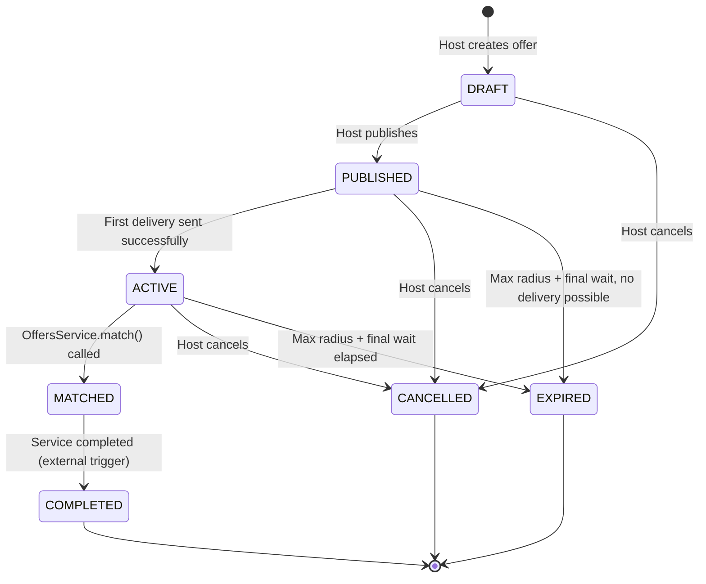
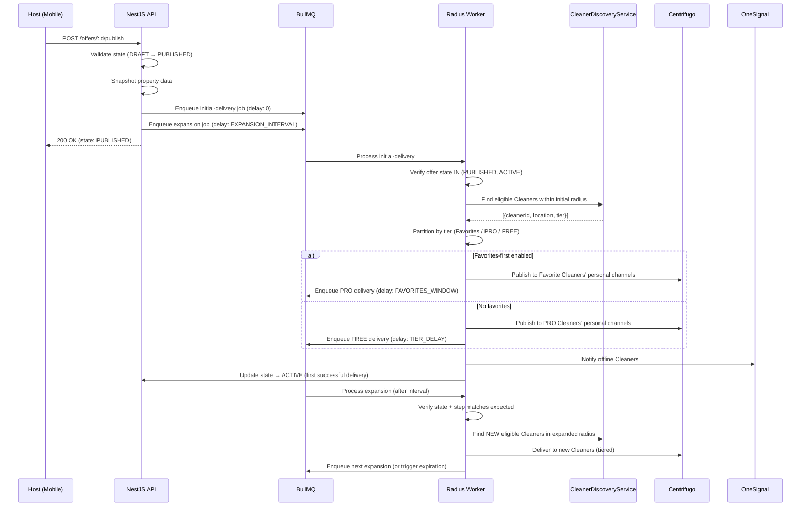

# Design Document

## Overview

The offer-publishing system enables Hosts to create, publish, and progressively deliver cleaning service offers to nearby Cleaners. The NestJS API manages the full offer lifecycle (DRAFT → PUBLISHED → ACTIVE → MATCHED/COMPLETED/CANCELLED/EXPIRED), while BullMQ handles scheduled radius expansion jobs. Delivery follows a tiered model: Favorites first (optional), then PRO Cleaners, then FREE-tier Cleaners — with configurable delays between tiers. Real-time delivery uses Centrifugo WebSocket channels (transport only — PostgreSQL is the source of truth), with OneSignal push notifications as fallback for offline Cleaners. Commission calculation is transparent: Hosts see a 10% service fee added to their price, Cleaners see a 3% commission deducted from the offered price. All monetary values are stored as integers (cents) with integer-only arithmetic to avoid floating-point issues.

### Key Design Principles

- **PostgreSQL is the source of truth.** Centrifugo is a real-time transport layer. If a Cleaner misses a WebSocket event, they reconstruct state via REST API.
- **State transitions are atomic and concurrency-safe.** Optimistic locking via `WHERE state = :expectedState` prevents race conditions.
- **BullMQ jobs are idempotent and stale-aware.** Every job validates current offer state and expansion step before acting.
- **Module boundaries are defined by contracts.** Offer Publishing depends on `CleanerDiscoveryService` and `PropertyReadinessCheck` interfaces, not on internal schemas of other modules.
- **Domain Events** are emitted on every state transition, enabling downstream features (payments, chat, tracking) to integrate without coupling.

### Responsibility Matrix

| Responsibility | Mobile App | NestJS API | BullMQ | Centrifugo | OneSignal | PostGIS |
|----------------|-----------|------------|--------|------------|-----------|---------|
| Offer creation form | ✅ | ❌ | ❌ | ❌ | ❌ | ❌ |
| Offer validation & persistence | ❌ | ✅ | ❌ | ❌ | ❌ | ❌ |
| State machine transitions | ❌ | ✅ | ❌ | ❌ | ❌ | ❌ |
| Commission calculation | ❌ | ✅ | ❌ | ❌ | ❌ | ❌ |
| Price breakdown display | ✅ | ✅ (data) | ❌ | ❌ | ❌ | ❌ |
| Radius expansion scheduling | ❌ | ✅ (enqueue) | ✅ (process) | ❌ | ❌ | ❌ |
| Cleaner discovery (geospatial) | ❌ | ✅ | ❌ | ❌ | ❌ | ✅ |
| Real-time offer delivery | ❌ | ✅ (publish) | ❌ | ✅ (transport) | ❌ | ❌ |
| Push notification dispatch | ❌ | ✅ (enqueue) | ✅ (send) | ❌ | ✅ (deliver) | ❌ |
| Offer list/detail display | ✅ | ✅ (data) | ❌ | ❌ | ❌ | ❌ |
| Cancellation + cleanup | ✅ (trigger) | ✅ (orchestrate) | ✅ (cancel jobs) | ✅ (transport) | ❌ | ❌ |
| Duplicate prevention | ❌ | ✅ (+ DB UNIQUE) | ❌ | ❌ | ❌ | ❌ |

## Architecture

```
Mobile App (Expo / React Native)
├── Offer Creation Form (property selector, price, date, duration)
├── Offer Confirmation Screen (price breakdown, favorites-first toggle)
├── Offer List Screen (tab-filtered: Active, Completed, Expired, Cancelled)
├── Offer Detail Screen (state timeline, radius progress, cancel action)
└── Zustand Store (useOfferStore — CRUD, optimistic updates, real-time sync)
        ↓ API calls (REST)
NestJS API (offers module)
├── POST   /offers                      — create offer (DRAFT)
├── POST   /offers/:id/publish          — publish offer (DRAFT → PUBLISHED)
├── POST   /offers/:id/cancel           — cancel offer
├── GET    /offers                      — list own offers (paginated, filterable)
├── GET    /offers/:id                  — get offer detail + state history
├── GET    /offers/:id/price-breakdown  — get price breakdown (Host or Cleaner view)
│
├── OffersService (lifecycle, validation, state machine, domain events)
├── CommissionService (fee calculation, integer arithmetic)
├── DeliverySchedulerService (tier orchestration, Centrifugo publish)
├── RadiusExpansionProcessor (BullMQ worker, stale-job guards)
├── CleanerDiscoveryService (interface — geospatial + eligibility)
├── PropertyReadinessCheck (interface — cross-module contract)
└── OfferNotificationService (OneSignal push fallback)
        ↓
BullMQ (Redis queues)
├── Queue: offer-radius-expansion (delayed jobs for each expansion step)
├── Queue: offer-tier-delivery (delayed jobs for PRO→FREE tier transition)
├── Queue: offer-favorites-window (delayed job for favorites expiry)
└── Queue: offer-push-notification (push delivery for offline Cleaners)
        ↓
Centrifugo (WebSocket — TRANSPORT ONLY, not source of truth)
└── Channel: offers:cleaner:{cleanerId} (personal offer feed + cancellations)
        ↓
PostgreSQL + PostGIS
├── offers (lifecycle, pricing, scheduling metadata, property snapshot)
├── offer_state_transitions (audit log)
├── offer_deliveries (stateful: PENDING/SENT/FAILED)
└── Properties table (existing — location GEOGRAPHY for spatial queries)
```

### State Machine Diagram



### Radius Expansion Flow



## Cross-Module Contracts

### CleanerDiscoveryService (Interface)

This interface decouples Offer Publishing from the internal structure of cleaner_profiles, KYC, subscriptions, and favorites. The implementation combines data from multiple modules.

```typescript
interface CleanerDiscoveryService {
  findEligibleCleaners(params: {
    propertyId: string;
    hostId: string;
    radiusMeters: number;
    excludeCleanerIds: string[];
  }): Promise<DiscoveredCleaner[]>;
}

interface DiscoveredCleaner {
  cleanerId: string;
  location: { lat: number; lng: number };
  distanceMeters: number;
  tier: 'FAVORITE' | 'PRO' | 'FREE';
  isOnline: boolean; // WebSocket connection status from Centrifugo
}
```

The implementation internally combines: Cleaner Profile (location, availability) + KYC (approved status) + Subscription (PRO/FREE tier) + Favorites (host-specific).

### PropertyReadinessCheck (Interface)

```typescript
interface PropertyReadinessCheck {
  check(propertyId: string, hostId: string): Promise<PropertyReadinessResult>;
}

interface PropertyReadinessResult {
  ready: boolean;
  reasons: PropertyReadinessFailure[];
}

type PropertyReadinessFailure =
  | 'NOT_FOUND'
  | 'NOT_OWNED'
  | 'DELETED'
  | 'NO_PHOTOS'
  | 'INVALID_LOCATION'
  | 'MISSING_REQUIRED_FIELDS'
  | 'HAS_ACTIVE_OFFER';
```

### OffersService.match() — External Transition Contract

Only `OffersService.match()` can execute the ACTIVE → MATCHED transition. External modules (offer-negotiation, offer-radar) call this method:

```typescript
interface OfferMatchContract {
  match(params: {
    offerId: string;
    cleanerId: string;
    matchSource: 'direct_accept' | 'counter_offer_accepted';
  }): Promise<MatchResult>;
}
```

External modules MUST NOT write to the `offers` table directly.

## Domain Events

Every state transition emits a domain event for downstream integration:

```typescript
type OfferDomainEvent =
  | { type: 'OfferCreated'; offerId: string; hostId: string; propertyId: string }
  | { type: 'OfferPublished'; offerId: string; hostId: string }
  | { type: 'OfferActivated'; offerId: string; firstDeliveryCleanerId: string }
  | { type: 'OfferMatched'; offerId: string; cleanerId: string; matchSource: string }
  | { type: 'OfferCancelled'; offerId: string; previousState: OfferState }
  | { type: 'OfferExpired'; offerId: string; finalRadius: number }
  | { type: 'OfferCompleted'; offerId: string; cleanerId: string };
```

Future consumers: Stripe escrow (on OfferMatched), service tracking (on OfferMatched), chat (on OfferMatched), notifications (on all events).

## Components and Interfaces

### API Endpoints (NestJS)

| Method | Path | Description | Auth |
|--------|------|-------------|------|
| POST | `/offers` | Create new offer (DRAFT) | Access token (Host role) |
| POST | `/offers/:id/publish` | Publish offer (triggers delivery) | Access token (Host role, ownership) |
| POST | `/offers/:id/cancel` | Cancel offer | Access token (Host role, ownership) |
| GET | `/offers` | List own offers (paginated, filterable by state) | Access token (Host role) |
| GET | `/offers/:id` | Get offer detail + state transition history | Access token (Host role, ownership) |
| GET | `/offers/:id/price-breakdown` | Get price breakdown (view depends on role) | Access token (Host or Cleaner role) |

### Component Structure (Backend — NestJS)

```
services/api/src/offers/
├── offers.module.ts
├── offers.controller.ts
├── offers.service.ts
├── offers.repository.ts
├── offers.types.ts
├── offers.constants.ts
├── commission/
│   ├── commission.service.ts
│   └── commission.types.ts
├── delivery/
│   ├── delivery-scheduler.service.ts
│   ├── delivery.types.ts
│   └── centrifugo.client.ts
├── discovery/
│   ├── cleaner-discovery.interface.ts
│   ├── cleaner-discovery.service.ts
│   └── cleaner-discovery.types.ts
├── expansion/
│   ├── radius-expansion.processor.ts
│   ├── radius-expansion.types.ts
│   └── stale-job.guard.ts
├── notification/
│   ├── offer-notification.service.ts
│   └── onesignal.client.ts
├── contracts/
│   ├── property-readiness.interface.ts
│   └── offer-match.interface.ts
├── events/
│   ├── offer-domain-events.ts
│   └── offer-event-emitter.service.ts
├── state-machine/
│   ├── offer-state-machine.ts
│   └── offer-state-machine.spec.ts
├── dto/
│   ├── create-offer.dto.ts
│   ├── publish-offer.dto.ts
│   ├── offer-query.dto.ts
│   └── offer-response.dto.ts
├── entities/
│   ├── offer.entity.ts
│   ├── offer-state-transition.entity.ts
│   └── offer-delivery.entity.ts
├── guards/
│   └── offer-owner.guard.ts
├── __tests__/
│   ├── offers.service.spec.ts
│   ├── offers.controller.spec.ts
│   ├── commission.service.spec.ts
│   ├── delivery-scheduler.service.spec.ts
│   ├── radius-expansion.processor.spec.ts
│   ├── offer-state-machine.spec.ts
│   ├── cleaner-discovery.service.spec.ts
│   └── state-transition-concurrency.spec.ts
└── README.md
```

### Component Structure (Mobile)

```
apps/mobile/src/screens/offers/
├── CreateOfferScreen.tsx (multi-step: property → details → confirm)
├── OfferConfirmationScreen.tsx (price breakdown + favorites toggle)
├── OfferListScreen.tsx (tab-filtered list with cards)
├── OfferDetailScreen.tsx (state timeline, radius indicator, cancel)
├── useOffers.ts (Zustand store + API integration)
├── offers.types.ts
├── offers.constants.ts
├── components/
│   ├── OfferCard.tsx (list item: property, price, state badge)
│   ├── PriceBreakdown.tsx (Host or Cleaner view)
│   ├── StateTimeline.tsx (visual state progression)
│   ├── RadiusProgress.tsx (current radius + next expansion timer)
│   ├── PropertySelector.tsx (only offer-ready properties)
│   ├── ServiceTypePicker.tsx (cleaning type selection)
│   ├── DurationSelector.tsx (min/max bounds)
│   └── FavoritesToggle.tsx (favorites-first option)
├── __tests__/
│   ├── CreateOfferScreen.spec.tsx
│   ├── OfferListScreen.spec.tsx
│   └── OfferDetailScreen.spec.tsx
└── README.md
```

### BullMQ Queues and Jobs

| Queue | Job Name | Trigger | Description |
|-------|----------|---------|-------------|
| `offer-radius-expansion` | `expand-radius` | Delayed (configurable interval) | Expands search radius, finds new Cleaners, schedules tier delivery |
| `offer-tier-delivery` | `deliver-to-tier` | Delayed (tier delay) | Delivers offer to PRO or FREE tier Cleaners within current radius |
| `offer-favorites-window` | `favorites-expired` | Delayed (favorites window) | Triggers PRO tier delivery after favorites window expires |
| `offer-push-notification` | `send-push` | Immediate | Sends push via OneSignal to offline Cleaners |

#### Stale Job Protection

Every BullMQ job payload includes: `{ offerId, expectedState, expectedStep }`. Before processing:

```typescript
// stale-job.guard.ts
async function validateJobFreshness(job: Job<ExpansionJobData>): Promise<boolean> {
  const offer = await offerRepo.findById(job.data.offerId);
  if (!offer) return false;
  if (!['PUBLISHED', 'ACTIVE'].includes(offer.state)) return false;
  if (offer.expansion_step_count !== job.data.expectedStep) return false;
  return true;
}
```

If validation fails, the job completes silently (no retry, no error).

### Centrifugo Channels

| Channel Pattern | Purpose | Payload |
|----------------|---------|---------|
| `offers:cleaner:{cleanerId}` | Personal offer delivery + cancellations | Offer payload or cancellation event |

Cancellations are delivered to the personal channels of Cleaners who received the offer (queried from `offer_deliveries`), NOT to a dedicated cancellation channel.

## Delivery Definition

A delivery is considered **successful (SENT)** when the delivery transport (Centrifugo or OneSignal) accepts the message AND the delivery record is persisted with `status = 'SENT'`. It does NOT require the Cleaner to open, view, or acknowledge the Offer.

The PUBLISHED → ACTIVE transition occurs when the **first delivery record** reaches `status = 'SENT'`.

### Delivery Flow

```
1. Create delivery record: status = PENDING
2. Attempt WebSocket delivery via Centrifugo
   ├── Success → Update status = SENT, channel = WEBSOCKET, delivered_at = NOW()
   └── Failure → Attempt push via OneSignal
       ├── Success → Update status = SENT, channel = PUSH, delivered_at = NOW()
       └── Failure → Update status = FAILED, failure_reason = '...'
3. If at least one delivery is SENT → trigger PUBLISHED→ACTIVE (if first)
```

## Data Models

### Offers Table

```sql
CREATE TABLE offers (
    id UUID PRIMARY KEY DEFAULT gen_random_uuid(),
    host_id UUID NOT NULL REFERENCES users(id) ON DELETE RESTRICT,
    property_id UUID NOT NULL REFERENCES properties(id) ON DELETE RESTRICT,
    
    -- Service details
    service_type VARCHAR(30) NOT NULL,
    description TEXT,
    scheduled_at TIMESTAMP WITH TIME ZONE NOT NULL,
    timezone VARCHAR(64) NOT NULL,
    estimated_duration_minutes INTEGER NOT NULL,
    
    -- Pricing (all in cents — integer arithmetic only)
    offered_price_cents INTEGER NOT NULL,
    currency CHAR(3) NOT NULL,
    host_service_fee_cents INTEGER NOT NULL,
    host_total_cents INTEGER NOT NULL,
    cleaner_commission_cents INTEGER NOT NULL,
    cleaner_payout_cents INTEGER NOT NULL,
    
    -- Rate snapshot (basis points at time of creation)
    host_service_fee_rate_bps INTEGER NOT NULL,
    cleaner_commission_rate_bps INTEGER NOT NULL,
    
    -- Property snapshot (immutable after publish)
    property_name_snapshot VARCHAR(255),
    property_type_snapshot VARCHAR(30),
    property_city_snapshot VARCHAR(100),
    property_cover_photo_snapshot TEXT,
    
    -- State
    state VARCHAR(20) NOT NULL DEFAULT 'DRAFT',
    
    -- Delivery configuration
    favorites_first BOOLEAN NOT NULL DEFAULT false,
    
    -- Radius expansion tracking
    current_radius_meters INTEGER NOT NULL DEFAULT 0,
    expansion_step_count INTEGER NOT NULL DEFAULT 0,
    
    -- Idempotency
    idempotency_key VARCHAR(255),
    
    -- Metadata
    published_at TIMESTAMP WITH TIME ZONE,
    expired_at TIMESTAMP WITH TIME ZONE,
    cancelled_at TIMESTAMP WITH TIME ZONE,
    matched_at TIMESTAMP WITH TIME ZONE,
    completed_at TIMESTAMP WITH TIME ZONE,
    created_at TIMESTAMP WITH TIME ZONE DEFAULT NOW(),
    updated_at TIMESTAMP WITH TIME ZONE DEFAULT NOW(),
    
    -- Constraints
    CONSTRAINT chk_state CHECK (state IN ('DRAFT', 'PUBLISHED', 'ACTIVE', 'MATCHED', 'COMPLETED', 'CANCELLED', 'EXPIRED')),
    CONSTRAINT chk_service_type CHECK (service_type IN ('standard', 'deep', 'move_in_out', 'post_construction', 'post_event', 'recurring')),
    CONSTRAINT chk_price_positive CHECK (offered_price_cents > 0),
    CONSTRAINT chk_duration_bounds CHECK (estimated_duration_minutes > 0),
    CONSTRAINT chk_host_total CHECK (host_total_cents = offered_price_cents + host_service_fee_cents),
    CONSTRAINT chk_cleaner_payout CHECK (cleaner_payout_cents = offered_price_cents - cleaner_commission_cents)
);

-- Indexes
CREATE INDEX idx_offers_host ON offers(host_id);
CREATE INDEX idx_offers_host_active ON offers(host_id, state) WHERE state IN ('DRAFT', 'PUBLISHED', 'ACTIVE');
CREATE INDEX idx_offers_state ON offers(state);
CREATE INDEX idx_offers_created ON offers(created_at DESC);
CREATE UNIQUE INDEX uq_offers_idempotency ON offers(host_id, idempotency_key) WHERE idempotency_key IS NOT NULL;

-- CRITICAL: Prevents concurrent creation of multiple active offers per property
CREATE UNIQUE INDEX uq_one_active_offer_per_property ON offers(property_id) WHERE state IN ('DRAFT', 'PUBLISHED', 'ACTIVE');
```

### Offer State Transitions Table

```sql
CREATE TABLE offer_state_transitions (
    id UUID PRIMARY KEY DEFAULT gen_random_uuid(),
    offer_id UUID NOT NULL REFERENCES offers(id) ON DELETE CASCADE,
    from_state VARCHAR(20),
    to_state VARCHAR(20) NOT NULL,
    triggered_by VARCHAR(50) NOT NULL,
    metadata JSONB,
    created_at TIMESTAMP WITH TIME ZONE DEFAULT NOW(),
    
    CONSTRAINT chk_from_state CHECK (from_state IS NULL OR from_state IN ('DRAFT', 'PUBLISHED', 'ACTIVE', 'MATCHED', 'COMPLETED', 'CANCELLED', 'EXPIRED')),
    CONSTRAINT chk_to_state CHECK (to_state IN ('DRAFT', 'PUBLISHED', 'ACTIVE', 'MATCHED', 'COMPLETED', 'CANCELLED', 'EXPIRED'))
);

CREATE INDEX idx_offer_transitions_offer ON offer_state_transitions(offer_id);
CREATE INDEX idx_offer_transitions_offer_time ON offer_state_transitions(offer_id, created_at);
```

### Offer Deliveries Table

```sql
CREATE TABLE offer_deliveries (
    id UUID PRIMARY KEY DEFAULT gen_random_uuid(),
    offer_id UUID NOT NULL REFERENCES offers(id) ON DELETE CASCADE,
    cleaner_id UUID REFERENCES users(id) ON DELETE SET NULL,
    tier VARCHAR(10) NOT NULL,
    delivery_status VARCHAR(10) NOT NULL DEFAULT 'PENDING',
    delivery_channel VARCHAR(20),
    failure_reason TEXT,
    radius_step INTEGER NOT NULL,
    created_at TIMESTAMP WITH TIME ZONE DEFAULT NOW(),
    delivered_at TIMESTAMP WITH TIME ZONE,
    
    CONSTRAINT chk_tier CHECK (tier IN ('FAVORITE', 'PRO', 'FREE')),
    CONSTRAINT chk_status CHECK (delivery_status IN ('PENDING', 'SENT', 'FAILED')),
    CONSTRAINT chk_channel CHECK (delivery_channel IS NULL OR delivery_channel IN ('WEBSOCKET', 'PUSH')),
    CONSTRAINT uq_offer_delivery UNIQUE(offer_id, cleaner_id)
);

CREATE INDEX idx_offer_deliveries_offer ON offer_deliveries(offer_id);
CREATE INDEX idx_offer_deliveries_cleaner ON offer_deliveries(cleaner_id);
CREATE INDEX idx_offer_deliveries_offer_status ON offer_deliveries(offer_id, delivery_status);
```

### Data Relationships

```
users (from user-authentication)
├── offers (1:N, host_id FK, ON DELETE RESTRICT)
│   ├── offer_state_transitions (1:N, ON DELETE CASCADE)
│   └── offer_deliveries (1:N, ON DELETE CASCADE)
└── offer_deliveries (1:N, cleaner_id FK, ON DELETE SET NULL)

properties (from property-management)
└── offers (1:N, property_id FK, ON DELETE RESTRICT)

Note: ON DELETE RESTRICT on host_id and property_id prevents accidental
deletion of users or properties that have offer history.
ON DELETE SET NULL on cleaner_id preserves delivery audit history
when a Cleaner account is deleted (cleaner_id becomes NULL, record persists).
```

### Property Protection During Active Offer

While a property has an active offer (state IN DRAFT, PUBLISHED, ACTIVE), the following property fields are locked for modification:
- location (coordinates)
- property_type
- city / country
- address

The `PropertyReadinessCheck` interface enforces this via `HAS_ACTIVE_OFFER` reason. Additionally, on publish, a snapshot of key property data is saved to the offer record for historical reference.

### Configuration Constants

```typescript
// offers.constants.ts — all values from env with these defaults
export const OFFER_CONFIG = {
  // Commission rates (basis points for precision)
  HOST_SERVICE_FEE_RATE: parseInt(process.env.OFFER_HOST_FEE_RATE || '1000'),       // 10.00%
  CLEANER_COMMISSION_RATE: parseInt(process.env.OFFER_CLEANER_RATE || '300'),        // 3.00%
  
  // Radius expansion
  INITIAL_RADIUS_METERS: parseInt(process.env.OFFER_INITIAL_RADIUS || '3000'),
  EXPANSION_STEP_METERS: parseInt(process.env.OFFER_EXPANSION_STEP || '2000'),
  MAX_RADIUS_METERS: parseInt(process.env.OFFER_MAX_RADIUS || '25000'),
  EXPANSION_INTERVAL_MS: parseInt(process.env.OFFER_EXPANSION_INTERVAL_MS || '300000'),
  FINAL_WAIT_INTERVAL_MS: parseInt(process.env.OFFER_FINAL_WAIT_MS || '600000'),
  
  // Tier delays
  FAVORITES_WINDOW_MS: parseInt(process.env.OFFER_FAVORITES_WINDOW_MS || '180000'),
  PRO_TO_FREE_DELAY_MS: parseInt(process.env.OFFER_PRO_FREE_DELAY_MS || '120000'),
  
  // Validation
  MIN_LEAD_TIME_MINUTES: parseInt(process.env.OFFER_MIN_LEAD_MINUTES || '60'),
  MIN_DURATION_MINUTES: parseInt(process.env.OFFER_MIN_DURATION_MINUTES || '30'),
  MAX_DURATION_MINUTES: parseInt(process.env.OFFER_MAX_DURATION_MINUTES || '480'),
  
  // BullMQ
  MAX_JOB_RETRIES: parseInt(process.env.OFFER_MAX_RETRIES || '3'),
  BACKOFF_TYPE: 'exponential' as const,
  BACKOFF_DELAY_MS: parseInt(process.env.OFFER_BACKOFF_DELAY_MS || '5000'),
} as const;
```

## Commission Calculation Logic

All monetary values are stored and computed as **integers (cents)**. Commission rates are stored as **basis points** (1/100th of a percent) for precision. **No floating-point arithmetic** is used in monetary calculations — we use integer division with truncation.

### Host Price Breakdown

```
offered_price_cents       = Host's proposed price (e.g., 5000 = $50.00)
host_service_fee_cents    = integerDivTrunc(offered_price_cents * HOST_RATE_BPS, 10000)
host_total_cents          = offered_price_cents + host_service_fee_cents
```

### Cleaner Price Breakdown

```
offered_price_cents         = The price the Host proposed (same value)
cleaner_commission_cents    = integerDivTrunc(offered_price_cents * CLEANER_RATE_BPS, 10000)
cleaner_payout_cents        = offered_price_cents - cleaner_commission_cents
```

### Integer Division with Truncation

```typescript
/**
 * Pure integer arithmetic for monetary calculations.
 * Uses Math.trunc to ensure no floating-point rounding issues.
 * For typical BidClean values (cents * basis_points), the intermediate
 * product fits safely within Number.MAX_SAFE_INTEGER.
 */
function calculateFeeCents(priceCents: number, rateBasisPoints: number): number {
  return Math.trunc((priceCents * rateBasisPoints) / 10000);
}
```

Note: With max realistic values (price = 10_000_00 cents = $10,000, rate = 1000 bps), the intermediate `priceCents * rateBasisPoints = 10_000_000_000` which is well within `Number.MAX_SAFE_INTEGER` (9,007,199,254,740,991).

### Rate Snapshot

At offer creation time, the current `HOST_SERVICE_FEE_RATE` and `CLEANER_COMMISSION_RATE` are stored in the offer record (`host_service_fee_rate_bps`, `cleaner_commission_rate_bps`). This provides auditability if rates change in the future.

### Example

```
offered_price_cents = 5000 ($50.00)
HOST_RATE_BPS = 1000 (10%)
CLEANER_RATE_BPS = 300 (3%)

Host breakdown:
  service_fee = trunc(5000 * 1000 / 10000) = trunc(500) = 500 ($5.00)
  total = 5000 + 500 = 5500 ($55.00)

Cleaner breakdown:
  commission = trunc(5000 * 300 / 10000) = trunc(150) = 150 ($1.50)
  payout = 5000 - 150 = 4850 ($48.50)
```

## State Machine Implementation

### Allowed Transitions

```typescript
const ALLOWED_TRANSITIONS: Record<OfferState, OfferState[]> = {
  DRAFT:     ['PUBLISHED', 'CANCELLED'],
  PUBLISHED: ['ACTIVE', 'CANCELLED', 'EXPIRED'],
  ACTIVE:    ['MATCHED', 'CANCELLED', 'EXPIRED'],
  MATCHED:   ['COMPLETED'],
  COMPLETED: [],
  CANCELLED: [],
  EXPIRED:   [],
};
```

### Concurrency-Safe Transition Execution

All state transitions use optimistic locking to prevent race conditions:

```typescript
async function transitionState(
  offerId: string,
  expectedState: OfferState,
  newState: OfferState,
  triggeredBy: string,
  metadata?: Record<string, unknown>,
): Promise<boolean> {
  // Atomic update — only succeeds if current state matches expected
  const result = await queryRunner.query(
    `UPDATE offers SET state = $1, updated_at = NOW() WHERE id = $2 AND state = $3`,
    [newState, offerId, expectedState]
  );
  
  if (result.affectedRows === 0) {
    // Another process already changed the state — transition lost the race
    return false;
  }
  
  // Record audit trail
  await insertStateTransition(offerId, expectedState, newState, triggeredBy, metadata);
  
  // Emit domain event
  await emitDomainEvent({ type: `Offer${capitalize(newState)}`, offerId, ... });
  
  return true;
}
```

### Transition Side Effects

| Transition | Side Effects |
|-----------|-------------|
| DRAFT → PUBLISHED | Snapshot property data, enqueue initial delivery job, enqueue first expansion job, set `published_at`, emit `OfferPublished` |
| PUBLISHED → ACTIVE | Set state (triggered on first successful delivery), emit `OfferActivated` |
| PUBLISHED → EXPIRED | Cancel all pending BullMQ jobs, notify Host, set `expired_at`, emit `OfferExpired` |
| ACTIVE → MATCHED | Cancel all pending BullMQ jobs, set `matched_at`, emit `OfferMatched` |
| ACTIVE → CANCELLED | Cancel all pending BullMQ jobs, notify delivered Cleaners via personal channels, set `cancelled_at`, emit `OfferCancelled` |
| PUBLISHED → CANCELLED | Cancel all pending BullMQ jobs, set `cancelled_at`, emit `OfferCancelled` |
| DRAFT → CANCELLED | Set `cancelled_at` (no side effects), emit `OfferCancelled` |
| ACTIVE → EXPIRED | Cancel all pending BullMQ jobs, notify Host, set `expired_at`, emit `OfferExpired` |
| MATCHED → COMPLETED | Set `completed_at`, emit `OfferCompleted` |

## Radius Expansion Algorithm

```
1. On PUBLISH:
   - Set current_radius = INITIAL_RADIUS_METERS
   - Snapshot property data to offer record
   - Enqueue initial-delivery job (delay: 0)
   - Enqueue first expansion job (delay: EXPANSION_INTERVAL_MS)

2. On INITIAL DELIVERY (and each expansion step):
   - Guard: Verify offer.state IN ('PUBLISHED', 'ACTIVE')
   - Guard: Verify offer.expansion_step_count === job.expectedStep
   - If guards fail → complete job silently (stale)
   - Call CleanerDiscoveryService.findEligibleCleaners(radius, excludeDelivered)
   - Create delivery records (status: PENDING)
   - Attempt delivery (WebSocket → Push fallback)
   - Update delivery status (SENT or FAILED)
   - If first SENT delivery ever → transition PUBLISHED→ACTIVE

3. On each EXPANSION STEP:
   - new_radius = Math.min(current_radius + EXPANSION_STEP_METERS, MAX_RADIUS_METERS)
   - Deliver to new cleaners (respecting tier order)
   - If new_radius >= MAX_RADIUS_METERS:
     - Enqueue final-wait job (delay: FINAL_WAIT_INTERVAL_MS)
   - Else:
     - Enqueue next expansion job (delay: EXPANSION_INTERVAL_MS)
   - Update offer.current_radius_meters, offer.expansion_step_count

4. On FINAL WAIT EXPIRY:
   - Guard: Verify offer.state IN ('PUBLISHED', 'ACTIVE')
   - If still PUBLISHED or ACTIVE → transition to EXPIRED
   - Notify Host with suggestion to modify price
```

## Centrifugo Integration

### Publishing Offers to Cleaners

```typescript
interface OfferDeliveryPayload {
  type: 'offer_new' | 'offer_cancelled';
  offerId: string;
  // Only for type 'offer_new':
  propertySnapshot?: {
    name: string;
    type: string;
    city: string;
    country: string;
    coverPhotoUrl: string;
  };
  serviceType?: string;
  description?: string | null;
  scheduledAt?: string;           // ISO 8601 with timezone
  timezone?: string;
  estimatedDurationMinutes?: number;
  priceBreakdown?: {
    offeredPriceCents: number;
    commissionCents: number;
    payoutCents: number;
    currency: string;
  };
  distanceMeters?: number;
  publishedAt?: string;
  // Only for type 'offer_cancelled':
  cancelledAt?: string;
}
```

All messages (offers and cancellations) go through the Cleaner's personal channel: `offers:cleaner:{cleanerId}`.

### Centrifugo Server API (HTTP)

```typescript
// centrifugo.client.ts
class CentrifugoClient {
  // baseUrl from env: CENTRIFUGO_API_URL
  // apiKey from env: CENTRIFUGO_API_KEY
  
  async publish(channel: string, data: unknown): Promise<void>;
  async broadcast(channels: string[], data: unknown): Promise<void>;
}
```

## Mobile State Management (Zustand)

```typescript
// useOffers.ts
interface OfferStore {
  // State
  offers: Map<string, Offer>;
  activeFilter: OfferState | 'ALL';
  isLoading: boolean;
  pagination: { page: number; totalPages: number; };
  
  // Actions
  createOffer: (dto: CreateOfferDto) => Promise<Offer>;
  publishOffer: (offerId: string, favoritesFirst: boolean) => Promise<void>;
  cancelOffer: (offerId: string) => Promise<void>;
  fetchOffers: (filter?: OfferState, page?: number) => Promise<void>;
  fetchOfferDetail: (offerId: string) => Promise<Offer>;
  
  // Real-time handlers (via Centrifugo subscription on personal channel)
  handleOfferCancelled: (offerId: string) => void;
  
  // Computed
  getOffersByState: (state: OfferState) => Offer[];
  getPriceBreakdown: (priceCents: number, role: 'host' | 'cleaner') => PriceBreakdown;
}
```

## Error Handling

| Error Case | HTTP Status | Error Code |
|-----------|-------------|------------|
| Property not owned by Host | 403 | `offer.error.property_not_owned` |
| Property not offer-ready | 422 | `offer.error.property_not_ready` |
| Active offer exists for property | 409 | `offer.error.active_offer_exists` |
| Invalid state transition | 422 | `offer.error.invalid_transition` |
| State transition lost race | 409 | `offer.error.transition_conflict` |
| Offer not found | 404 | `offer.error.not_found` |
| Not the offer owner | 403 | `offer.error.not_owner` |
| Price must be positive | 400 | `offer.error.invalid_price` |
| Scheduled time in past | 400 | `offer.error.time_in_past` |
| Duration out of bounds | 400 | `offer.error.invalid_duration` |
| Cannot cancel in current state | 422 | `offer.error.cannot_cancel` |
| Duplicate (idempotency) | 200 | Returns existing offer |
| BullMQ job failed (after retries) | — | Logged + alert (no user-facing error) |
| Centrifugo publish failed | — | Fallback to push, update delivery status |


## Correctness Properties

*A property is a characteristic or behavior that should hold true across all valid executions of a system — essentially, a formal statement about what the system should do. Properties serve as the bridge between human-readable specifications and machine-verifiable correctness guarantees.*

### Property 1: State Machine Transition Validity

*For any* pair of states (currentState, targetState), calling `transition(offer, targetState)` SHALL succeed if and only if `targetState` is in `ALLOWED_TRANSITIONS[currentState]`. All other transition attempts SHALL be rejected with an invalid transition error. This includes PUBLISHED → EXPIRED (when no delivery is possible within max radius).

**Validates: Requirements 3.10, 3.7, 3.9, 11.1, 11.4**

### Property 2: Initial State Invariant

*For any* valid offer creation input (valid property, valid price, valid date, valid duration), the resulting persisted offer SHALL always have state = `DRAFT`.

**Validates: Requirements 1.9, 3.2**

### Property 3: Host Commission Calculation Invariant

*For any* positive integer `offeredPriceCents` and the configured `HOST_SERVICE_FEE_RATE` (in basis points), the Host price breakdown SHALL satisfy:
- `hostServiceFeeCents = Math.trunc(offeredPriceCents * HOST_SERVICE_FEE_RATE / 10000)`
- `hostTotalCents = offeredPriceCents + hostServiceFeeCents`
- All three values (offeredPriceCents, hostServiceFeeCents, hostTotalCents) are present and are positive integers.
- No floating-point intermediate values are used.

**Validates: Requirements 8.1, 8.2**

### Property 4: Cleaner Commission Calculation Invariant

*For any* positive integer `offeredPriceCents` and the configured `CLEANER_COMMISSION_RATE` (in basis points), the Cleaner price breakdown SHALL satisfy:
- `cleanerCommissionCents = Math.trunc(offeredPriceCents * CLEANER_COMMISSION_RATE / 10000)`
- `cleanerPayoutCents = offeredPriceCents - cleanerCommissionCents`
- `cleanerPayoutCents` is always less than `offeredPriceCents` (commission is always deducted)
- All three values are present and non-negative integers.

**Validates: Requirements 9.1, 9.2**

### Property 5: Price Validation — Positive Only

*For any* integer value `priceCents` where `priceCents <= 0`, offer creation SHALL be rejected. *For any* `priceCents > 0`, price validation SHALL pass.

**Validates: Requirements 1.5**

### Property 6: Duration Bounds Validation

*For any* integer `durationMinutes`, offer creation SHALL accept the duration if and only if `MIN_DURATION_MINUTES <= durationMinutes <= MAX_DURATION_MINUTES`. Values outside this range SHALL be rejected.

**Validates: Requirements 1.7**

### Property 7: Scheduled Time Validation

*For any* timestamp `scheduledAt`, offer creation SHALL accept the time if and only if `scheduledAt >= now() + MIN_LEAD_TIME_MINUTES`. Past times and times too close to the present SHALL be rejected.

**Validates: Requirements 1.6**

### Property 8: Idempotency — Create Offer Round Trip

*For any* valid offer creation payload and a given idempotency key, calling create twice with the same (hostId, idempotencyKey) SHALL return the exact same offer (same ID, same data) without creating a duplicate.

**Validates: Requirements 1.8**

### Property 9: Duplicate Active Offer Prevention

*For any* property that has an existing offer in state `DRAFT`, `PUBLISHED`, or `ACTIVE`, attempting to create a new offer for that same property SHALL be rejected with a conflict error. The UNIQUE partial index `uq_one_active_offer_per_property` is the database-level guarantee. *For any* property whose most recent offer is in state `COMPLETED`, `CANCELLED`, or `EXPIRED`, creating a new offer SHALL succeed.

**Validates: Requirements 2.1, 2.2, 2.3, 7.4**

### Property 10: Ownership Isolation

*For any* (userId, offerId) pair where the offer's `host_id != userId`, all mutation operations (publish, cancel) and detail retrieval SHALL be rejected with a forbidden error. A Host can only operate on their own offers.

**Validates: Requirements 1.1**

### Property 11: Radius Expansion Monotonicity (Capped)

*For any* expansion step N applied to an offer, the resulting `current_radius_meters` SHALL equal `Math.min(INITIAL_RADIUS_METERS + (N * EXPANSION_STEP_METERS), MAX_RADIUS_METERS)`. The radius never exceeds `MAX_RADIUS_METERS` regardless of configuration combinations.

**Validates: Requirements 6.2**

### Property 12: State Transition Audit Completeness

*For any* successful state transition on an offer, the `offer_state_transitions` table SHALL contain a record with the correct `from_state`, `to_state`, `triggered_by`, and a non-null `created_at` timestamp.

**Validates: Requirements 3.11**

### Property 13: Offer List Filtering Correctness

*For any* state filter value applied to the offer list endpoint, ALL returned offers SHALL have that exact state. Additionally, the list SHALL be sorted by `created_at` descending (each item's timestamp is <= the previous item's timestamp).

**Validates: Requirements 10.2, 10.3, 10.5**

### Property 14: Required Fields Validation

*For any* offer creation payload missing one or more required fields (propertyId, serviceType, offeredPrice, scheduledAt, timezone, estimatedDuration), the creation SHALL be rejected with a validation error identifying the missing fields.

**Validates: Requirements 1.4**

### Property 15: State Transition Atomicity (Concurrency Safety)

*For any* set of N concurrent transition attempts on the same offer (e.g., MATCHED, CANCELLED, EXPIRED all racing on an ACTIVE offer), exactly ONE transition SHALL succeed and (N-1) SHALL fail with a conflict error. The winning transition is determined by `UPDATE ... WHERE state = :expectedState` returning `affectedRows = 1`.

**Validates: Requirements 3.10, Non-functional (atomic transitions)**

### Property 16: Stale Job Idempotency

*For any* BullMQ job that wakes up and finds the offer in a state NOT IN ('PUBLISHED', 'ACTIVE') OR with an `expansion_step_count` different from the job's `expectedStep`, the job SHALL complete without side effects (no delivery, no state change, no error).

**Validates: Requirements 6.6, 6.7, Non-functional (idempotent jobs)**

## Testing Strategy

### Property-Based Tests (fast-check)

The following properties will be tested using `fast-check` with minimum 100 iterations per property:

| Property | What to Generate | What to Assert |
|----------|-----------------|----------------|
| State Machine Transitions | Random (state, targetState) pairs from all 7x7 combinations | Transition succeeds iff pair is in allowed map (including PUBLISHED→EXPIRED) |
| Host Commission Calculation | Random positive integers 1-100_000_000 (cents) | Fee = trunc(price * rate / 10000), total = price + fee, all integers |
| Cleaner Commission Calculation | Random positive integers 1-100_000_000 | Commission = trunc(price * rate / 10000), payout = price - commission |
| Price Validation | Random integers -1_000_000 to 1_000_000 | Only positive values pass |
| Duration Bounds | Random integers 0 to 1000 | Only values in [MIN, MAX] pass |
| Idempotency Round Trip | Random valid payloads + random string keys | Two calls return same offer ID |
| Radius Monotonicity (Capped) | Random step counts 0 to 20 + random configs | Radius = min(initial + step * size, max) |
| List Filtering | Random state filters + random offer sets | All returned items match filter, sorted DESC |
| Duplicate Prevention | Random state values for existing offers | Only terminal states allow new creation |
| Concurrency Race | Random concurrent transitions on same offer | Exactly 1 wins, others fail |

**Library:** `fast-check` (TypeScript)
**Configuration:** Each test runs minimum 100 iterations
**Tagging:** Each test includes a comment: `// Feature: offer-publishing, Property N: [title]`

### Unit Tests (NestJS)

- **OffersService**: Create flow (validation, idempotency, duplicate check), publish flow (state transition, job enqueueing, property snapshot), cancel flow (per-state behavior)
- **CommissionService**: Fee calculation with edge cases (1 cent, very large amounts), integer arithmetic verification
- **OfferStateMachine**: All valid transitions (including PUBLISHED→EXPIRED), all invalid transitions, side effect triggers, concurrency simulation
- **CleanerDiscoveryService**: Interface contract compliance, tier classification
- **StaleJobGuard**: Fresh job passes, stale step rejected, terminal state rejected
- **OfferOwnerGuard**: Ownership check pass/fail

### Integration Tests (NestJS)

- Full offer lifecycle: create → publish → receive delivery → match → complete
- Cancellation from each allowed state with job cleanup and Cleaner notification
- BullMQ job processing: radius expansion triggers, tier delivery delays, stale job handling
- Centrifugo publish: correct personal channel, correct payload shape
- Expiration flow (from PUBLISHED): no cleaners in range → max radius → expire
- Expiration flow (from ACTIVE): cleaners received but none accepted → expire
- Concurrent duplicate prevention: two simultaneous creates for same property → DB UNIQUE rejects one
- **State transition race condition**: MATCHED + CANCELLED + EXPIRED racing → exactly 1 wins
- **Delivery race condition**: two workers delivering to same Cleaner → UNIQUE constraint → 1 delivery

### Component Tests (Mobile)

- **CreateOfferScreen**: Multi-step form flow, validation, property selector filtering
- **OfferConfirmationScreen**: Price breakdown display, favorites toggle
- **OfferListScreen**: Tab filtering, card rendering, pagination
- **OfferDetailScreen**: State timeline rendering, radius indicator, cancel action visibility
- **PriceBreakdown**: Correct calculation display for Host and Cleaner views

### Non-Functional Tests

- Offer creation endpoint responds within 500ms (load test with k6)
- 500 concurrent active offers without degradation
- Centrifugo delivery latency < 1 second (measured via test subscriber)
- State transition under contention: 10 concurrent transitions → exactly 1 succeeds (< 100ms)
