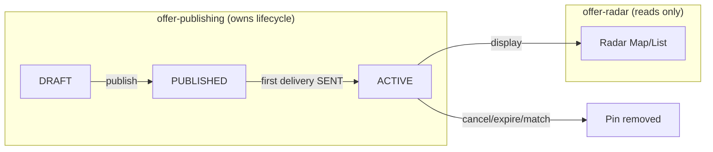
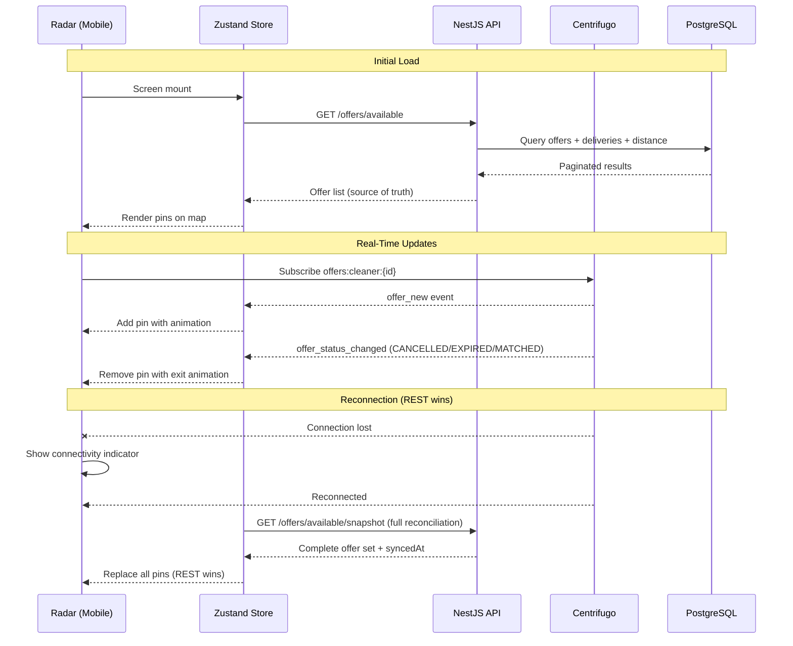
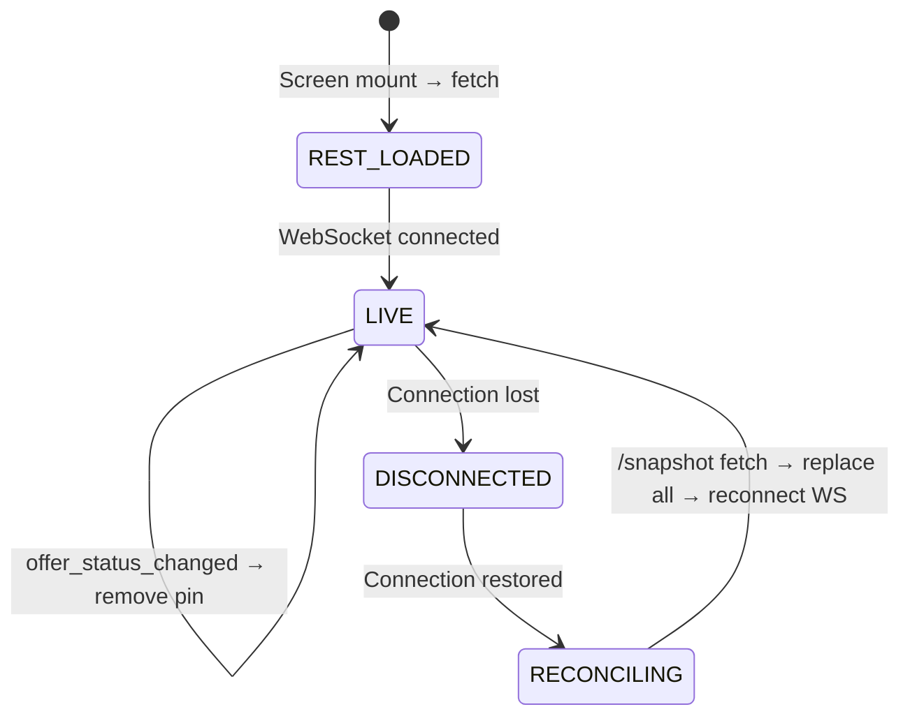

# Design Document

## Overview

The Offer Radar is the Cleaner's primary interface for discovering and interacting with available cleaning offers. It is a **consumption-side** module that reads offers already delivered by the `offer-publishing` system and presents them via a full-screen Mapbox map with real-time updates. The mobile app renders offers as animated pins using native Mapbox symbol layers (NOT React Native Marker components) for 60fps performance at 200+ concurrent offers. Real-time delivery arrives via Centrifugo WebSocket on the Cleaner's personal channel (`offers:cleaner:{cleanerId}`), while the REST endpoint `GET /offers/available` serves as the authoritative source of truth for reconciliation. The backend query joins `offers` + `offer_deliveries` with PostGIS distance calculation to return only offers validly delivered to the authenticated Cleaner. The Zustand store manages local state (offers map, filters, view mode, connection status) with a clear reconciliation strategy: REST always wins over stale WebSocket data.

### Key Design Decisions

1. **No new database tables.** The radar reads from existing `offers` and `offer_deliveries` tables (defined by offer-publishing). The only new backend code is a query endpoint.
2. **Native Mapbox layers over React Native markers.** Symbol layers with GeoJSON source enable GPU-accelerated rendering and native clustering — critical for 200+ pins at 60fps.
3. **Dual data path: REST + WebSocket.** REST for initial load and reconciliation; WebSocket for incremental real-time updates. Clear conflict resolution: REST wins.
4. **Server-side filtering.** Filters are query parameters on the REST endpoint, not client-side post-fetch filtering. This avoids transporting unnecessary data.
5. **Work zone defines discovery, GPS defines UX.** The radar never influences which offers are delivered — it only controls how they're displayed.

### Responsibility Matrix

| Responsibility | Mobile App | NestJS API | Centrifugo | PostGIS |
|----------------|-----------|------------|------------|---------|
| Map rendering (pins, clusters, layers) | ✅ | ❌ | ❌ | ❌ |
| Pin animations (entrance, exit, urgency) | ✅ | ❌ | ❌ | ❌ |
| Filter UI (chips, sliders, date picker) | ✅ | ❌ | ❌ | ❌ |
| Filter execution (query filtering) | ❌ | ✅ | ❌ | ❌ |
| Available offers query | ❌ | ✅ | ❌ | ✅ |
| Distance calculation | ❌ | ✅ | ❌ | ✅ |
| Real-time offer delivery (transport) | ✅ (receive) | ❌ | ✅ | ❌ |
| WebSocket connection management | ✅ | ❌ | ✅ | ❌ |
| Reconciliation (REST fetch on reconnect) | ✅ (trigger) | ✅ (data) | ❌ | ❌ |
| Offer visibility enforcement | ❌ | ✅ | ❌ | ❌ |
| List view rendering | ✅ | ❌ | ❌ | ❌ |
| Bottom sheet preview | ✅ | ❌ | ❌ | ❌ |
| Ad slot injection | ✅ | ❌ | ❌ | ❌ |
| Offline state management | ✅ | ❌ | ❌ | ❌ |

## Architecture

### Offer State Consumption Boundary

The Radar only consumes offers in the `ACTIVE` state. The PUBLISHED → ACTIVE transition is handled internally by `offer-publishing` (triggered on first successful delivery). The Radar never sees DRAFT or PUBLISHED offers.



```
┌─────────────────────────────────────────────────────────────────────┐
│  Mobile App (Expo / React Native)                                    │
│                                                                       │
│  ┌──────────────────────────────────────────────────────────┐        │
│  │  Radar Screen                                             │        │
│  │  ├── MapView (Mapbox native layers + clustering)          │        │
│  │  │   ├── SymbolLayer (offer pins — GeoJSON source)        │        │
│  │  │   ├── CircleLayer (work zone radius)                   │        │
│  │  │   └── SymbolLayer (Cleaner position marker)            │        │
│  │  ├── FilterPanel (bottom sheet with chips/sliders)        │        │
│  │  ├── ListView (alternative — FlatList with OfferCards)    │        │
│  │  ├── OfferPreviewSheet (bottom sheet on pin tap)          │        │
│  │  └── EmptyState / OfflineState (conditional)              │        │
│  └──────────────────────────────────────────────────────────┘        │
│                                                                       │
│  ┌────────────────────┐  ┌──────────────────────────┐               │
│  │  useRadarStore     │  │  useCentrifugoChannel    │               │
│  │  (Zustand)         │  │  (WebSocket hook)        │               │
│  │  - offers Map      │  │  - subscribe/unsubscribe │               │
│  │  - filters         │  │  - reconnection logic    │               │
│  │  - viewMode        │  │  - exponential backoff   │               │
│  │  - connectivity    │  │  - event dispatching     │               │
│  └────────┬───────────┘  └──────────┬───────────────┘               │
│           │ REST                      │ WebSocket                     │
└───────────┼───────────────────────────┼──────────────────────────────┘
            │                           │
            ▼                           ▼
┌───────────────────────┐  ┌──────────────────────────┐
│  NestJS API           │  │  Centrifugo              │
│  GET /offers/available│  │  Channel:                │
│  (offers module)      │  │  offers:cleaner:{id}     │
│                       │  │                          │
│  ┌─────────────────┐ │  │  Events:                 │
│  │ AvailableOffers │ │  │  - offer_new             │
│  │ QueryService    │ │  │  - offer_status_changed  │
│  │                 │ │  └──────────────────────────┘
│  │ Joins:          │ │
│  │ offers          │ │    (Already implemented by
│  │ offer_deliveries│ │     offer-publishing spec)
│  │ + PostGIS dist  │ │
│  └─────────────────┘ │
└───────────┬───────────┘
            │
            ▼
┌───────────────────────────────────┐
│  PostgreSQL + PostGIS              │
│                                    │
│  offers (existing — offer-publishing)
│  offer_deliveries (existing)       │
│  cleaner_profiles (work zone data) │
│  properties (cover photo, type)    │
└───────────────────────────────────┘
```

### Data Flow Diagram



### Reconciliation Strategy



## Components and Interfaces

### API Endpoint — `GET /offers/available` + `/offers/available/snapshot`

This endpoint lives within the existing **offers module** (created by offer-publishing). It adds new controller methods and query service specifically for Cleaner consumption.

| Method | Path | Description | Auth |
|--------|------|-------------|------|
| GET | `/offers/available` | Available offers for authenticated Cleaner (paginated) | Access token (Cleaner role) |
| GET | `/offers/available/snapshot` | Full unpaginated snapshot for reconciliation | Access token (Cleaner role) |

#### Snapshot Endpoint — `GET /offers/available/snapshot`

The snapshot endpoint returns ALL available offers for the authenticated Cleaner without pagination. 
It is used exclusively for WebSocket reconnection reconciliation.
This endpoint MUST NOT be paginated — it returns the complete authoritative set.
The client replaces its entire local offer collection with the snapshot response.

Rate limiting: Max 1 request per 30 seconds per Cleaner (anti-abuse for full-table scan).

**Response:**

```typescript
interface AvailableOffersSnapshotResponse {
  offers: AvailableOffer[];  // Full set, no pagination
  syncedAt: string;          // ISO 8601 server timestamp
}
```

#### Paginated Endpoint — `GET /offers/available`

**Query Parameters:**

| Parameter | Type | Default | Description |
|-----------|------|---------|-------------|
| `serviceType` | string[] | — | Filter by service types (comma-separated) |
| `minPriceCents` | integer | — | Minimum Cleaner payout (cents) |
| `maxPriceCents` | integer | — | Maximum Cleaner payout (cents) |
| `maxDistanceMeters` | integer | — | Max distance from Cleaner's work zone center |

> **Design Note:** `maxDistanceMeters` is a presentation filter applied to already-delivered offers. It MUST NOT affect offer delivery eligibility or trigger redistribution of offers. Offer delivery eligibility is determined exclusively by `offer-publishing` at delivery time.

| `scheduledBefore` | ISO 8601 | — | Offers scheduled before this time |
| `scheduledAfter` | ISO 8601 | — | Offers scheduled after this time |
| `sort` | enum | `distance_asc` | `distance_asc`, `price_desc`, `scheduled_asc`, `published_desc` |
| `page` | integer | 1 | Page number |
| `limit` | integer | 20 | Items per page (max: 50) |

**Response Payload:**

```typescript
interface AvailableOffersResponse {
  items: AvailableOffer[];
  pagination: {
    page: number;
    limit: number;
    total: number;
    totalPages: number;
  };
}

interface AvailableOffer {
  offerId: string;
  propertySnapshot: {
    name: string;
    type: string;
    city: string;
    coverPhotoUrl: string | null;
  };
  serviceType: string;
  description: string | null;
  scheduledAt: string;           // ISO 8601
  timezone: string;
  estimatedDurationMinutes: number;
  priceBreakdown: {
    offeredPriceCents: number;
    commissionCents: number;
    payoutCents: number;
    currency: string;
  };
  distanceMeters: number;
  publishedAt: string;
  isUrgent: boolean;
  publicLocation: {
    lat: number;
    lng: number;
  };
}
```

### Urgency Derivation

`isUrgent` in the REST response is a point-in-time hint computed at query time.
However, urgency is a time-dependent property that changes without any event delivery.

Client-side implementation:
- The client MUST derive urgency locally as: `isUrgent = (scheduledAt - now) <= 2 hours`
- This derived value is refreshed every 60 seconds via a timer
- The REST `isUrgent` field is used as initial seed only
- An offer can transition from non-urgent to urgent purely through time passing (no event needed)
```

**Query Logic (SQL):**

```sql
SELECT
  o.id AS offer_id,
  o.property_name_snapshot,
  o.property_type_snapshot,
  o.property_city_snapshot,
  o.property_cover_photo_snapshot,
  o.service_type,
  o.description,
  o.scheduled_at,
  o.timezone,
  o.estimated_duration_minutes,
  o.offered_price_cents,
  o.cleaner_commission_cents,
  o.cleaner_payout_cents,
  o.currency,
  o.published_at,
  -- Distance from Cleaner's work zone center (NOT GPS)
  ST_Distance(
    o.public_location::geography,
    cp.work_zone_center::geography
  )::integer AS distance_meters,
  -- Urgency: scheduled within 2 hours
  (o.scheduled_at <= NOW() + INTERVAL '2 hours') AS is_urgent,
  -- Public location (stable approximate point)
  ST_Y(o.public_location::geometry) AS public_lat,
  ST_X(o.public_location::geometry) AS public_lng
FROM offers o
INNER JOIN offer_deliveries od ON od.offer_id = o.id
INNER JOIN cleaner_profiles cp ON cp.user_id = od.cleaner_id
WHERE
  od.cleaner_id = :authenticatedCleanerId
  AND od.delivery_status = 'SENT'
  AND o.state = 'ACTIVE'
  AND o.scheduled_at > NOW()  -- Not expired (server-side check)
  -- Dynamic filters (applied when provided)
  AND (:serviceTypes IS NULL OR o.service_type = ANY(:serviceTypes))
  AND (:minPriceCents IS NULL OR o.cleaner_payout_cents >= :minPriceCents)
  AND (:maxPriceCents IS NULL OR o.cleaner_payout_cents <= :maxPriceCents)
  AND (:maxDistanceMeters IS NULL OR ST_DWithin(
    o.public_location::geography,
    cp.work_zone_center::geography,
    :maxDistanceMeters
  ))
  AND (:scheduledBefore IS NULL OR o.scheduled_at <= :scheduledBefore)
  AND (:scheduledAfter IS NULL OR o.scheduled_at >= :scheduledAfter)
ORDER BY
  CASE WHEN :sort = 'distance_asc' THEN ST_Distance(o.public_location::geography, cp.work_zone_center::geography) END ASC,
  CASE WHEN :sort = 'price_desc' THEN o.cleaner_payout_cents END DESC,
  CASE WHEN :sort = 'scheduled_asc' THEN o.scheduled_at END ASC,
  CASE WHEN :sort = 'published_desc' THEN o.published_at END DESC
LIMIT :limit OFFSET (:page - 1) * :limit;
```

### Timestamp Semantics

All persisted offer timestamps use UTC (`TIMESTAMP WITH TIME ZONE` / `timestamptz`).
The `timezone` field on an offer identifies the service location timezone and is used exclusively for display/business-time interpretation on the client.

Server-side comparisons (e.g., `scheduled_at > NOW()`) operate on UTC instants.
Client-side display converts `scheduledAt` to the offer's `timezone` for user-friendly rendering.

**Required Schema Addition (on existing `offers` table):**

```sql
-- public_location: stable approximate point snapshotted at publish time
-- This column is populated by offer-publishing during the DRAFT→PUBLISHED transition
-- It is a city-level jittered point derived from the property's real coordinates
ALTER TABLE offers ADD COLUMN IF NOT EXISTS public_location GEOGRAPHY(Point, 4326);

CREATE INDEX idx_offers_public_location ON offers USING GIST(public_location)
  WHERE state = 'ACTIVE';
```

**Required Schema Reference (existing `cleaner_profiles`):**

```sql
-- Already exists in cleaner_profiles (from user-profile spec)
-- work_zone_center GEOGRAPHY(Point, 4326) NOT NULL
-- work_radius_meters INTEGER NOT NULL DEFAULT 10000
```

### Component Structure (Backend — NestJS)

The radar endpoint is added to the existing offers module:

```
services/api/src/offers/
├── ... (existing offer-publishing files)
├── available/
│   ├── available-offers.controller.ts   (GET /offers/available + /snapshot)
│   ├── available-offers.service.ts      (query logic, filtering, sorting)
│   ├── available-offers.repository.ts   (raw SQL with PostGIS)
│   ├── available-offers.types.ts        (response interfaces)
│   └── dto/
│       ├── available-offers-query.dto.ts (query params validation)
│       └── available-offer-response.dto.ts
├── __tests__/
│   ├── ... (existing)
│   ├── available-offers.service.spec.ts
│   ├── available-offers.repository.spec.ts
│   └── available-offers.controller.spec.ts
└── README.md (updated)
```

### Component Structure (Mobile)

```
apps/mobile/src/screens/radar/
├── RadarScreen.tsx                (main container — map + list toggle)
├── useRadarStore.ts              (Zustand store — offers, filters, state)
├── useCentrifugoChannel.ts       (WebSocket connection + event handling)
├── useLocationPermission.ts      (permission request + fallback)
├── radar.types.ts                (TypeScript interfaces)
├── radar.constants.ts            (animation configs, timing, layer IDs)
├── components/
│   ├── map/
│   │   ├── RadarMapView.tsx      (Mapbox MapView + layers + gesture handling)
│   │   ├── OfferPinsLayer.tsx    (SymbolLayer + GeoJSON source for offers)
│   │   ├── ClusterLayer.tsx      (cluster circle + count badge)
│   │   ├── CleanerMarker.tsx     (pulsing animated self-position marker)
│   │   ├── WorkZoneCircle.tsx    (semi-transparent radius ring)
│   │   └── mapStyles.ts         (Mapbox expressions for pin styling)
│   ├── list/
│   │   ├── OfferListView.tsx    (FlatList with infinite scroll + pull-refresh)
│   │   ├── OfferCard.tsx        (list item: photo, price, distance, badge)
│   │   └── AdSlot.tsx           (ad placeholder for free-tier Cleaners)
│   ├── filters/
│   │   ├── FilterPanel.tsx      (bottom sheet container)
│   │   ├── ServiceTypeChips.tsx (multi-select chips)
│   │   ├── PriceRangeSlider.tsx (min/max dual slider)
│   │   ├── DistanceSlider.tsx   (max distance km slider)
│   │   └── DateRangeFilter.tsx  (quick picks + custom date picker)
│   ├── OfferPreviewSheet.tsx    (bottom sheet on pin tap)
│   ├── EmptyState.tsx           (no offers / no matching filters)
│   ├── OfflineBanner.tsx        (connectivity indicator)
│   ├── ConnectivityIndicator.tsx(WebSocket status dot)
│   └── ViewToggle.tsx           (map ↔ list segmented control)
├── hooks/
│   ├── useOfferAnimations.ts    (Reanimated 3 spring configs)
│   ├── useRadarReconciliation.ts(REST reconciliation on reconnect)
│   └── useAdVisibility.ts      (RevenueCat entitlement check)
├── __tests__/
│   ├── RadarScreen.spec.tsx
│   ├── useRadarStore.spec.ts
│   ├── useCentrifugoChannel.spec.ts
│   ├── OfferPinsLayer.spec.tsx
│   ├── OfferListView.spec.tsx
│   ├── FilterPanel.spec.tsx
│   └── OfferPreviewSheet.spec.tsx
└── README.md
```

### Zustand Store Design

```typescript
// useRadarStore.ts
interface RadarOffer {
  offerId: string;
  propertySnapshot: {
    name: string;
    type: string;
    city: string;
    coverPhotoUrl: string | null;
  };
  serviceType: string;
  description: string | null;
  scheduledAt: string;
  timezone: string;
  estimatedDurationMinutes: number;
  priceBreakdown: {
    offeredPriceCents: number;
    commissionCents: number;
    payoutCents: number;
    currency: string;
  };
  distanceMeters: number;
  publishedAt: string;
  isUrgent: boolean;
  publicLocation: { lat: number; lng: number };
  // Client-only state
  isViewed: boolean;
  isStale: boolean;
}

type ViewMode = 'map' | 'list';
type SortOption = 'distance_asc' | 'price_desc' | 'scheduled_asc' | 'published_desc';
type ConnectionStatus = 'connected' | 'disconnected' | 'reconnecting';

interface RadarFilters {
  serviceTypes: string[];
  minPriceCents: number | null;
  maxPriceCents: number | null;
  maxDistanceMeters: number | null;
  scheduledAfter: string | null;
  scheduledBefore: string | null;
}

interface RadarStore {
  // State
  offers: Map<string, RadarOffer>;
  offerEventTimestamps: Map<string, string>; // offerId → latest changedAt ISO timestamp
  filters: RadarFilters;
  sort: SortOption;
  viewMode: ViewMode;
  connectionStatus: ConnectionStatus;
  isLoading: boolean;
  isRefreshing: boolean;
  pagination: { page: number; totalPages: number; total: number };
  selectedOfferId: string | null;

  // Observability
  lastSuccessfulSyncAt: string | null;     // ISO 8601 — when last REST fetch succeeded
  lastWebSocketEventAt: string | null;     // ISO 8601 — when last WS event was processed

  // Actions — REST
  fetchAvailableOffers: (page?: number) => Promise<void>;
  refreshOffers: () => Promise<void>;
  loadMoreOffers: () => Promise<void>;

  // Actions — WebSocket events (IDEMPOTENT)
  handleOfferNew: (offer: RadarOffer) => void;
  // Implementation: upsert (insert if new, update if exists)
  // Processing the same offer_new event multiple times produces exactly one offer entry.

  handleOfferStatusChanged: (offerId: string, state: string, changedAt: string) => void;
  // Implementation: only apply if changedAt > existing offer's last known event timestamp
  // Older status events MUST NOT overwrite newer offer state.

  // Actions — Reconciliation
  reconcile: () => Promise<void>;

  // Actions — Filters
  setFilters: (filters: Partial<RadarFilters>) => void;
  clearFilters: () => void;
  setSort: (sort: SortOption) => void;

  // Actions — UI
  setViewMode: (mode: ViewMode) => void;
  selectOffer: (offerId: string | null) => void;
  markOfferViewed: (offerId: string) => void;
  setConnectionStatus: (status: ConnectionStatus) => void;
  markAllStale: () => void;

  // Computed (derived via selectors)
  getOffersAsGeoJSON: () => GeoJSON.FeatureCollection;
  getOffersList: () => RadarOffer[];
  getActiveFilterCount: () => number;
}
```

### Centrifugo WebSocket Hook

```typescript
// useCentrifugoChannel.ts
interface UseCentrifugoChannelOptions {
  cleanerId: string;
  onOfferNew: (offer: RadarOffer) => void;
  onOfferStatusChanged: (offerId: string, state: string, changedAt: string) => void;
  onConnectionChange: (status: ConnectionStatus) => void;
  onReconnect: () => void;
}

interface UseCentrifugoChannelReturn {
  isConnected: boolean;
  reconnectAttempts: number;
  disconnect: () => void;
}

// Reconnection strategy:
// - Exponential backoff: 1s, 2s, 4s, 8s, 16s, 30s (capped)
// - After 3 failed attempts: emit fallback signal (periodic REST polling)
// - On successful reconnect: trigger full reconciliation via REST
```

### Event Ordering Guarantee

WebSocket events may arrive out of order. The client MUST use the `changedAt` timestamp to enforce ordering:

1. On `offer_new`: upsert the offer. If offer already exists with a newer timestamp, skip.
2. On `offer_status_changed`: only apply if `changedAt > lastKnownEventTimestamp` for that offerId.

This prevents scenarios like:
- CANCELLED at 10:05, MATCHED at 10:06 → WebSocket delivers MATCHED then CANCELLED
- Without ordering check, offer would be incorrectly removed
- With ordering check, only the latest event (10:06 MATCHED) takes effect

### Polling Fallback Configuration

When WebSocket fails persistently (3+ reconnection attempts):

| Setting | Value | Source |
|---------|-------|--------|
| Polling interval | 30 seconds | Constant: RADAR_POLLING_INTERVAL_MS (env configurable) |
| Max polling duration | 5 minutes | After this, stop polling and show "reconnecting" permanently |
| Stop condition | WebSocket reconnects successfully |
| Transition | On WS reconnect → stop polling → full reconciliation via /snapshot → resume WS-only mode |

CRITICAL: WebSocket and polling MUST NOT run simultaneously except during a controlled recovery window (max 5 seconds overlap while reconciliation completes).

### Map Layer Architecture

```typescript
// Layer rendering order (bottom to top):
// 1. Base map (Mapbox dark/light style)
// 2. WorkZoneCircle (semi-transparent fill + border)
// 3. OfferPinsLayer (clustered symbol layer)
// 4. ClusterLayer (cluster circles with count)
// 5. CleanerMarker (pulsing animated position)

// GeoJSON source for offers (updated reactively from Zustand):
interface OfferFeature {
  type: 'Feature';
  geometry: {
    type: 'Point';
    coordinates: [number, number]; // [lng, lat]
  };
  properties: {
    offerId: string;
    serviceType: string;
    payoutCents: number;
    isUrgent: boolean;
    isViewed: boolean;
    isStale: boolean;
  };
}

// Mapbox expressions for dynamic pin styling:
// - Icon: mapped from serviceType → icon asset name
// - Color: urgent = pulsing accent, normal = white, viewed = reduced opacity
// - Text: formatted payout price label
// - Cluster: circle with count badge at zoom threshold
```

### Mapbox Clustering Configuration

```typescript
const CLUSTER_CONFIG = {
  clusterRadius: 50,          // Cluster pins within 50px
  clusterMaxZoom: 14,         // Don't cluster beyond zoom 14
  clusterProperties: {
    urgentCount: ['+', ['case', ['get', 'isUrgent'], 1, 0]],
  },
};

// Cluster tap → zoom to expand:
// camera.flyTo({ center, zoom: currentZoom + 2 }) until cluster breaks apart
```

### Configuration Constants

```typescript
// radar.constants.ts — all values from env with these defaults
export const RADAR_CONFIG = {
  // Public location jitter (read-only — generated by offer-publishing)
  PROPERTY_PUBLIC_LOCATION_MIN_JITTER_METERS: parseInt(process.env.PUBLIC_LOCATION_MIN_JITTER || '200'),
  PROPERTY_PUBLIC_LOCATION_MAX_JITTER_METERS: parseInt(process.env.PUBLIC_LOCATION_MAX_JITTER || '500'),

  // Polling fallback (when WebSocket fails persistently)
  RADAR_POLLING_INTERVAL_MS: parseInt(process.env.RADAR_POLLING_INTERVAL_MS || '30000'),
  RADAR_MAX_POLLING_DURATION_MS: parseInt(process.env.RADAR_MAX_POLLING_MS || '300000'),

  // Urgency refresh
  URGENCY_REFRESH_INTERVAL_MS: 60000, // 60 seconds — local timer for urgency recalculation

  // WebSocket reconnection
  WS_MAX_BACKOFF_MS: 30000,
  WS_FALLBACK_THRESHOLD: 3, // attempts before polling fallback
} as const;
```

## Data Models

### No New Tables

The radar feature does **not** create new database tables. It reads from:

1. **`offers`** (owned by offer-publishing) — offer data, state, pricing, property snapshot, `public_location`
2. **`offer_deliveries`** (owned by offer-publishing) — delivery records linking offers to Cleaners
3. **`cleaner_profiles`** (owned by user-profile) — Cleaner's work zone center for distance calculation

### Schema Extension: `public_location` on offers

The `public_location` column is added to the existing `offers` table as part of the offer-publishing enhancement. It's populated during the DRAFT → PUBLISHED transition:

```sql
-- Added to offers table (offer-publishing responsibility to populate)
-- Radar only READS this column
public_location GEOGRAPHY(Point, 4326)

-- Spatial index for radar queries (filtered to ACTIVE offers)
CREATE INDEX idx_offers_public_location ON offers USING GIST(public_location)
  WHERE state = 'ACTIVE';
```

**How `public_location` is generated** (by offer-publishing at publish time):

```typescript
// Public Location Generation (executed by offer-publishing at publish time)
// The Radar only READS this value — never generates it.

interface PublicLocationConfig {
  MIN_JITTER_METERS: number;  // env: PROPERTY_PUBLIC_LOCATION_MIN_JITTER_METERS (default: 200)
  MAX_JITTER_METERS: number;  // env: PROPERTY_PUBLIC_LOCATION_MAX_JITTER_METERS (default: 500)
}

/**
 * Generates a stable, privacy-preserving approximate location for an offer.
 * - Deterministic: same offerId always produces same jittered point
 * - Uses offerId as seed for reproducibility
 * - Result is stable and NEVER changes after initial generation
 */
function generatePublicLocation(
  exactLocation: { lat: number; lng: number },
  offerId: string,     // deterministic seed
  config: PublicLocationConfig
): { lat: number; lng: number };
```

The generated public location:
- MUST be displaced at least MIN_JITTER_METERS from exact coordinates
- MUST NOT be displaced more than MAX_JITTER_METERS from exact coordinates
- MUST be deterministic (same offerId → same result)
- MUST remain within the same municipality/city boundary as the property
- MUST NOT expose the exact property coordinates under any input

This value NEVER changes after publish — stable across all requests.

### WebSocket Event Schemas (from offer-publishing)

```typescript
// offer_new — delivered by offer-publishing when Cleaner is in discovery radius
interface OfferNewEvent {
  type: 'offer_new';
  offerId: string;
  propertySnapshot: {
    name: string;
    type: string;
    city: string;
    coverPhotoUrl: string | null;
  };
  serviceType: string;
  description: string | null;
  scheduledAt: string;
  timezone: string;
  estimatedDurationMinutes: number;
  priceBreakdown: {
    offeredPriceCents: number;
    commissionCents: number;
    payoutCents: number;
    currency: string;
  };
  distanceMeters: number;
  publishedAt: string;
  isUrgent: boolean;
  publicLocation: { lat: number; lng: number };
}

// offer_status_changed — delivered when offer leaves ACTIVE state
interface OfferStatusChangedEvent {
  type: 'offer_status_changed';
  offerId: string;
  state: 'CANCELLED' | 'EXPIRED' | 'MATCHED';
  changedAt: string; // ISO 8601
}
```

### GeoJSON Transformation (Client-Side)

The Zustand store maintains offers as a `Map<string, RadarOffer>`. The map component derives a GeoJSON FeatureCollection reactively:

```typescript
function offersToGeoJSON(offers: Map<string, RadarOffer>): GeoJSON.FeatureCollection {
  const features: GeoJSON.Feature[] = [];
  for (const [id, offer] of offers) {
    features.push({
      type: 'Feature',
      geometry: {
        type: 'Point',
        coordinates: [offer.publicLocation.lng, offer.publicLocation.lat],
      },
      properties: {
        offerId: id,
        serviceType: offer.serviceType,
        payoutCents: offer.priceBreakdown.payoutCents,
        isUrgent: offer.isUrgent,
        isViewed: offer.isViewed,
        isStale: offer.isStale,
      },
    });
  }
  return { type: 'FeatureCollection', features };
}
```

## Error Handling

| Error Case | Behavior | User-Facing |
|-----------|----------|-------------|
| REST fetch fails | Show toast notification, keep existing cached data | Non-blocking toast |
| WebSocket disconnects | Show connectivity indicator, exponential backoff reconnect | Subtle dot/banner |
| WebSocket fails 3+ times | Fall back to periodic REST polling | "Live updates paused" banner |
| Location permission denied | Show fallback state with settings CTA | Full-screen explanation |
| No offers available | Show empty state with illustration + expand radius CTA | Friendly empty state |
| All offers filtered out | Show "No offers match filters" + Clear filters CTA | Filter-specific message |
| Offer data stale (offline) | Mark pins with reduced opacity, disable Quick Accept | Visual staleness + disabled button |
| Pin tap while offline | Show preview but disable Quick Accept | Bottom sheet with disabled CTA |
| REST returns empty after reconciliation | Clear all pins from map | Clean state |
| Invalid WebSocket event payload | Log warning, skip event (defensive) | Silent — no user impact |
| REST 401 (token expired) | Trigger token refresh via auth module | Transparent to user |
| REST 429 (rate limited) | Retry with backoff, show brief toast | "Updating..." toast |

## Correctness Properties

*A property is a characteristic or behavior that should hold true across all valid executions of a system — essentially, a formal statement about what the system should do. Properties serve as the bridge between human-readable specifications and machine-verifiable correctness guarantees.*

### Property 1: Visibility Contract Enforcement

*For any* set of offers in the database with varying combinations of `state` (DRAFT, PUBLISHED, ACTIVE, MATCHED, COMPLETED, CANCELLED, EXPIRED), `delivery_status` (PENDING, SENT, FAILED), and `scheduled_at` (past, future), the `GET /offers/available` endpoint SHALL return an offer if and only if ALL of the following conditions are true: `state = 'ACTIVE'`, `delivery_status = 'SENT'` for the authenticated Cleaner, and `scheduled_at > NOW()`. No offer violating any of these conditions SHALL ever appear in results.

**Validates: Requirements 4.1, 4.8, 3.7**

### Property 2: Filter Predicate Satisfaction

*For any* valid filter combination (`serviceType`, `minPriceCents`, `maxPriceCents`, `maxDistanceMeters`, `scheduledBefore`, `scheduledAfter`) applied to `GET /offers/available`, ALL returned offers SHALL satisfy every active filter predicate simultaneously. Specifically: if `serviceType` is set, the offer's `service_type` must be in the set; if `minPriceCents` is set, `cleaner_payout_cents >= minPriceCents`; if `maxPriceCents` is set, `cleaner_payout_cents <= maxPriceCents`; if `maxDistanceMeters` is set, `distance_meters <= maxDistanceMeters`; if `scheduledBefore` is set, `scheduled_at <= scheduledBefore`; if `scheduledAfter` is set, `scheduled_at >= scheduledAfter`.

**Validates: Requirements 4.3, 5.3**

### Property 3: Sort Ordering Guarantee

*For any* sort option (`distance_asc`, `price_desc`, `scheduled_asc`, `published_desc`) applied to the available offers query, the returned result array SHALL be ordered according to the sort's comparator: `distance_asc` implies `distance[i] <= distance[i+1]`, `price_desc` implies `payout[i] >= payout[i+1]`, `scheduled_asc` implies `scheduled[i] <= scheduled[i+1]`, `published_desc` implies `published[i] >= published[i+1]` for all consecutive pairs.

**Validates: Requirements 4.2, 4.7**

### Property 4: Privacy Field Exclusion

*For any* response from `GET /offers/available` and *for any* offer in that response, the serialized response object SHALL NOT contain the fields: `address_street`, `address_state`, `address_postal_code`, `formatted_address`, `access_instructions`, `location_source`, or exact property `location` coordinates. Only `publicLocation` (approximate) and `city` (from property snapshot) are permitted.

**Validates: Requirements 4.5, 4.6**

### Property 5: Reconciliation Completeness (REST Wins)

*For any* local offer state accumulated through WebSocket events and *for any* authoritative reconciliation snapshot returned by `GET /offers/available/snapshot`, after reconciliation the local offer set SHALL equal exactly the snapshot returned by the server — no more, no less. The reconciliation endpoint MUST NOT be paginated; it returns the complete set. Offers present locally but absent from the snapshot are removed. Offers in the snapshot but absent locally are added.

**Validates: Requirements 14.3, 14.4, 3.6**

### Property 6: Ad Slot Positioning

*For any* list of N offers rendered in list view with `adsEnabled = true`, ad slots SHALL appear at positions `4, 9, 14, 19, ...` (every 5th position, 0-indexed). *For any* list rendered with `adsEnabled = false`, no ad slots SHALL appear regardless of list length.

**Validates: Requirements 6.7**

### Property 7: WebSocket Event Idempotency

*For any* sequence of `offer_new` events where the same `offerId` appears N times (N >= 1), the resulting offer store SHALL contain exactly one entry for that offerId. The final state of that entry SHALL reflect the most recent event data (by `publishedAt` timestamp). Duplicate processing MUST NOT create duplicate entries or corrupt existing data.

**Validates: Requirements 3.2, 14.2**

### Property 8: Event Temporal Ordering

*For any* pair of `offer_status_changed` events for the same offerId with timestamps T1 and T2 where T1 < T2, if the client processes T2 before T1 (out-of-order delivery), the event with T1 SHALL be discarded. The offer's local state SHALL always reflect the event with the latest `changedAt` timestamp, regardless of arrival order.

**Validates: Requirements 3.3, 14.4**

### Property 9: Pagination Uniqueness

*For any* sequence of paginated requests to `GET /offers/available` with pages 1 through N (where N = totalPages), the union of all returned offer IDs SHALL contain no duplicates. Each offer appears on exactly one page.

**Validates: Requirements 4.2, 6.5**

### Property 10: Public Location Privacy Displacement

*For any* offer with an exact property location L_exact and a generated public location L_public, the geodesic distance between L_exact and L_public SHALL be >= PROPERTY_PUBLIC_LOCATION_MIN_JITTER_METERS and <= PROPERTY_PUBLIC_LOCATION_MAX_JITTER_METERS. The public location SHALL be deterministic: the same offerId always produces the same L_public.

**Validates: Requirements 4.5, 4.6, Non-functional (privacy)**

### Property 11: Offline Acceptance Safety

*For any* device state where network connectivity is unavailable (`connectionStatus = 'disconnected'`), the "Quick Accept" action SHALL be non-executable (button disabled, action blocked). No acceptance request SHALL be sent to the server while the device is offline, regardless of user interaction.

**Validates: Requirements 7.5, 13.3**

## Testing Strategy

### Property-Based Tests (fast-check)

The following properties will be tested using `fast-check` with minimum 100 iterations per property:

| Property | What to Generate | What to Assert |
|----------|-----------------|----------------|
| Visibility Contract Enforcement | Random offers with all 7 states × 3 delivery statuses × (expired/not expired) | Only ACTIVE + SENT + not-expired offers appear in results |
| Filter Predicate Satisfaction | Random offers + random valid filter combinations (service types, price ranges, distance, dates) | Every returned offer satisfies ALL active filter predicates |
| Sort Ordering Guarantee | Random offer sets + each sort option | Consecutive pair invariant holds for selected comparator |
| Privacy Field Exclusion | Random valid query results | No response object contains forbidden fields (street, postal code, formatted address, access instructions, location source) |
| Reconciliation Completeness | Random pre-reconciliation store state + random snapshot response payload | Post-reconciliation store === snapshot response (exact set equality) |
| Ad Slot Positioning | Random list lengths (0–200) + random adsEnabled boolean | Ad slots at positions 4,9,14,19... when enabled; none when disabled |
| WebSocket Event Idempotency | Random sequences of offer_new events with duplicate offerIds | Store contains exactly one entry per unique offerId |
| Event Temporal Ordering | Random pairs of status events with varying timestamps delivered in random order | Only the event with latest changedAt takes effect |
| Pagination Uniqueness | Random offer sets across multiple pages | Union of all pages contains no duplicate offerIds |
| Public Location Privacy Displacement | Random exact locations + random offerIds | Distance between exact and public is in [MIN_JITTER, MAX_JITTER], deterministic |
| Offline Acceptance Safety | Random connectivity states (connected/disconnected) + random user interactions | Quick Accept is non-executable when disconnected |

**Library:** `fast-check` (TypeScript)
**Configuration:** Each test runs minimum 100 iterations
**Tagging:** Each test includes a comment: `// Feature: offer-radar, Property N: [title]`

### Unit Tests (NestJS)

- **AvailableOffersService**: Filter application (each filter independently and combined), sort ordering, pagination math, urgency calculation, distance computation mock
- **AvailableOffersRepository**: SQL query builder verification, parameter binding, null-filter handling
- **AvailableOffersController**: Auth guard, role check (Cleaner only), DTO validation, response shape

### Unit Tests (Mobile)

- **useRadarStore**: All actions (add offer, remove offer, reconcile, filter changes), computed selectors (GeoJSON, list, filter count)
- **useCentrifugoChannel**: Event parsing, reconnection attempts counter, connection status transitions
- **OfferPinsLayer**: GeoJSON source updates, tap handler, cluster zoom behavior
- **FilterPanel**: Filter state persistence, clear all, badge count
- **OfferPreviewSheet**: Data display, Quick Accept disabled when offline

### Integration Tests

- Full radar flow: Authenticate → fetch available → verify response shape and visibility rules
- Filter combinations: serviceType + price + distance → verify all returned offers match ALL filters
- Sort verification: Each sort option → verify ordering in response
- Visibility contract: Only offers with `delivery_status = 'SENT'` and `state = 'ACTIVE'` appear
- Distance calculation: Known coordinates → verify PostGIS distance within tolerance
- Pagination: Total count, page boundaries, no duplicates across pages

### Component Tests (Mobile)

- **RadarScreen**: Initial load → pins appear, WebSocket event → pin added/removed
- **OfferListView**: Pull to refresh, infinite scroll pagination, ad slot injection every 5th position
- **FilterPanel**: Apply filters → triggers REST fetch with params
- **EmptyState**: Correct message for no-offers vs filtered-out
- **OfflineBanner**: Appears on disconnect, disappears on reconnect

### Performance Tests

- Map with 200+ pins: No frame drops during pan/zoom (manual + automated profiling)
- Pin addition latency: WebSocket event → pin visible < 300ms
- REST endpoint: < 300ms p95 with 50 results + PostGIS distance calc
- Memory: Radar screen < 150MB including map tiles (profiled on Galaxy A14)
