# Design Document: Push Notifications

## Overview

`push-notifications` (Spec 16) gives BidClean a **single, first-class notification system** that reliably reaches a Host or Cleaner when the app is backgrounded/closed, and coordinates with in-app realtime alerts when it is open. It is a **consolidation, not an invention**: push already exists in a limited, offer-scoped form (`OneSignalClient` + `OfferNotificationService` inside the `offers` module, an `offer-push-notification` BullMQ queue, best-effort send by external user id with `en`/`es` content). This spec **extracts a dedicated `notifications` module** that owns the device registry, the notification ledger + dedup/idempotency, the outbox-driven event listeners, the localized content catalog, per-user preferences/quiet-hours, the BullMQ delivery worker, and the OneSignal webhook ingress — **reusing `OneSignalClient`'s behavior** (best-effort send, `en`/`es`, BullMQ retries, graceful failure) and **migrating the offers path onto it without changing offer-radar behavior**.

The design rests on three seams, each mirroring a pattern already proven in sibling specs (chat's persist-then-publish, voip's single-winner state machine + signed webhook, the Stripe/RevenueCat raw-body webhook auth):

1. **A durable transactional outbox is the trigger contract — not the in-process event bus.** For a fact to be notification-worthy, the emitting domain writes a durable `<domain>_outbox` row **in the same transaction that commits the business fact** (after-commit-safe). A relay drains committed-but-unrelayed rows into notification intents. `EventEmitter2`/Centrifugo remain as **optional low-latency fast-paths that never replace outbox durability**. This closes the gap where a business fact commits but a crash means the notification is never created.
2. **PostgreSQL is the source of truth for notification delivery intent and device registry.** The `notifications` ledger (`dedup_key UNIQUE`, exactly-once *intent*), `notification_devices` (Model B per-device consent), and `notification_preferences` are authoritative on the notification side. **Delivery intent is deduplicated exactly-once in PostgreSQL; external OneSignal delivery is at-least-once/best-effort** — exactly-once end-to-end push is explicitly not claimed.
3. **OneSignal is a first-class, always-synchronized delivery transport.** The registry and OneSignal are reconciled **bidirectionally** (register/consent → push external-user-id + tags to OneSignal; subscription webhooks → reconcile back via `provider_event_id UNIQUE`; a bounded periodic sweep repairs drift). Per-send **targeting is per consented player id (Model B)** — never a blanket external-user-id fan-out — so an opted-out device on a multi-device user is never reached, and a stale player id is never repeatedly targeted.

**Authority split (kept strict):**
- **The emitting domain module is the source of truth for the fact.** `offers`, `payments`, `negotiation`, `chat`, `voip-calls` own their facts in their own tables. The notifications module only *reacts*.
- **PostgreSQL is the source of truth for notification delivery intent + device registry.** Notification *content* is derived and localized, never business truth.
- **OneSignal is the delivery transport for background/closed-app push.** It owns device tokens and OS delivery (APNs/FCM); it never learns BidClean business rules. Player ids / OS tokens never become BidClean identifiers.
- **Centrifugo remains the in-app (foreground) realtime channel.** Foreground de-dup is **fail-open**, preferably client-side; it never suppresses when foreground status is unknown. Messages and calls always fail open.

This design maps every requirement and correctness invariant (REQ-NP1 … REQ-NP15) to concrete, verifiable properties **P1 … P18** (below), each backed by tests.

## Ownership Boundary — notifications vs. emitting domains vs. OneSignal

```
emitting domains (offers, payments, negotiation, chat, voip-calls)
  └─ write <domain>_outbox row IN THE SAME TX as the business fact (event_id UNIQUE, version)
        │  (EventEmitter2/Centrifugo may also fire — fast-path only, never the sole trigger)
        ▼
notifications module (NEW — reacts, never a source of business truth)
  OutboxRelay  ── drains committed-but-unrelayed rows ──► NotificationService.createIntent()
  NotificationService ── dedup(dedupKey) → persist ledger PENDING → enqueue delivery
  DeliveryWorker (BullMQ) ── single-winner PENDING→PROCESSING → resolve CONSENTED player ids (Model B)
                             → OneSignalClient.send (per-device; en/es; deep-link; idempotency key)
  OneSignalRegistrySync ── register/consent → push external-user-id + tags to OneSignal
  OneSignalWebhook ── delivery/subscription callbacks (provider_event_id UNIQUE, signed, idempotent)
  ReconcileSweep ── bounded periodic drift repair (registry ↔ OneSignal)
        ▼
OneSignal (transport) — device tokens, APNs/FCM, journeys/segments driven by tags this module sets
```

- **The `notifications` module (new)** owns: the device/subscription registry, the ledger + dedup/idempotency, the outbox relay + event listeners, the localized content catalog, preferences/quiet-hours, deep-link routing metadata, the BullMQ delivery worker, the OneSignal webhook ingress, and the reconciliation sweep. It **holds `OneSignalClient`** (moved/generalized from `offers`).
- **Emitting modules** keep emitting their existing domain events unchanged and gain **no** dependency on notifications. The one migration: `offers` stops calling `OneSignalClient` directly and instead writes an `offer` outbox row; the notifications listener maps `offer.*` to intents (behavior preserved).
- **OneSignal** owns device tokens + OS delivery. It receives a localized payload + an external user id + a deep-link data blob; it never learns business rules.

Dependency is one-directional (notifications → emitting-domain outbox tables, read-only via the relay). No business transaction depends on a push succeeding. The only code shared across domains is the **domain-agnostic `OutboxWriter`** in `packages/shared` (pure row-writing infrastructure — `writeOutbox(tx, { eventId, aggregateType, aggregateId, type, payload, version })`); it carries no offer/payment/negotiation/chat/voip semantics, and both the per-domain `event_id`/payload shaping (in each emitting domain) and the domain→intent mapping (in the notifications per-domain mapper) live outside it.

## Architecture

```mermaid
graph TB
    subgraph Mobile["Mobile (Expo / RN)"]
        AppBoot["App bootstrap: permission + register device"]
        NotifStore["notifications.store.ts (Zustand)"]
        DeepLink["useNotificationRouting (deep-link → screen + GET reconcile)"]
        IncomingCall["IncomingCallSheet (Spec 15 handoff)"]
        SettingsScreen["NotificationSettingsScreen (categories + quiet hours)"]
        OneSignalSDK["OneSignal SDK (EXPO_PUBLIC_ONESIGNAL_APP_ID)"]
        NotifApi["notifications.api.ts (apiClient)"]
    end

    subgraph API["NestJS API — notifications module (NEW)"]
        DeviceCtrl["NotificationDeviceController<br/>register / update-consent / unregister"]
        PrefCtrl["NotificationPreferenceController<br/>get / update (categories + quiet hours)"]
        WebhookCtrl["OneSignalWebhookController<br/>POST /webhooks/onesignal (signed, idempotent)"]
        Relay["OutboxRelayProcessor (BullMQ repeatable, per-domain drain)"]
        NotifSvc["NotificationService (intent mapping, dedup, suppression decision)"]
        DeliveryWorker["DeliveryWorker (BullMQ: single-winner PENDING→PROCESSING → send)"]
        RegistrySvc["DeviceRegistryService (Model B consent, OneSignal sync)"]
        PrefSvc["PreferenceService (metadata-driven decisions)"]
        ContentCatalog["NotificationContentCatalog (per-type en/es)"]
        TypeMeta["NotificationTypeRegistry (priority/category/quietHours/defaultEnabled)"]
        OneSignalClient["OneSignalClient (moved/generalized from offers)"]
        ReconcileSweep["ReconcileSweepProcessor (bounded drift repair)"]
    end

    subgraph Emitters["Emitting domains (unchanged sources of truth)"]
        Offers["offers → offer_outbox"]
        Payments["payments → payment_outbox"]
        Negotiation["negotiation → negotiation_outbox"]
        Chat["chat → chat_outbox (message-created)"]
        Voip["voip-calls → voip_outbox (call-invited)"]
    end

    subgraph Infra["Infra"]
        PG[("PostgreSQL<br/>*_outbox, notification_devices,<br/>notification_preferences, notifications")]
        Redis["Redis + BullMQ (relay, delivery, sweep queues)"]
        OneSignal["OneSignal (APNs/FCM, journeys/segments)"]
        Cent["Centrifugo (foreground realtime — existing)"]
    end

    AppBoot --> OneSignalSDK
    AppBoot --> NotifApi
    SettingsScreen --> NotifApi
    NotifApi --> DeviceCtrl
    NotifApi --> PrefCtrl
    OneSignalSDK -->|player id| DeviceCtrl

    Offers --> PG
    Payments --> PG
    Negotiation --> PG
    Chat --> PG
    Voip --> PG

    Relay -->|drain committed rows| PG
    Relay --> NotifSvc
    NotifSvc --> TypeMeta
    NotifSvc --> PrefSvc
    NotifSvc --> PG
    NotifSvc -->|enqueue| Redis
    Redis --> DeliveryWorker
    DeliveryWorker --> RegistrySvc
    DeliveryWorker --> ContentCatalog
    DeliveryWorker --> OneSignalClient
    OneSignalClient --> OneSignal
    DeliveryWorker --> PG
    DeviceCtrl --> RegistrySvc
    PrefCtrl --> PrefSvc
    RegistrySvc --> PG
    RegistrySvc -->|external-user-id + tags| OneSignal
    OneSignal -->|delivery/subscription webhook| WebhookCtrl --> RegistrySvc
    Redis --> ReconcileSweep
    ReconcileSweep --> RegistrySvc

    OneSignal -->|push| OneSignalSDK
    OneSignalSDK --> DeepLink
    OneSignalSDK --> IncomingCall
    Cent -.->|foreground alert| NotifStore
```



**Data flow — fact to delivery (durable-first):**
1. An emitting domain commits a business fact and, in the **same transaction**, writes a `<domain>_outbox` row (`event_id UNIQUE`, aggregate ref, type, payload, version). The fact and its trigger are atomic.
2. `OutboxRelayProcessor` (BullMQ repeatable) drains committed-but-unrelayed rows in batches, ordered by `created_at`, and hands each to `NotificationService.createIntent()`. It marks each row `relayed_at` after the intent is durably persisted (at-least-once, idempotent).
3. `NotificationService` derives `{ recipientUserId, type, category, dedupKey (from event_id), deepLink, localizedContentRef, priority }`, reads `NotificationTypeRegistry` metadata + preferences/consent, and **persists a `notifications` ledger row (PENDING) with its `dedup_key` BEFORE enqueue** (durable-first). A duplicate `dedup_key` is a no-op (exactly-once intent). No-device or opted-out/quiet → ledger `SUPPRESSED(reason)`, no enqueue.
4. `DeliveryWorker` single-winner transitions `PENDING → PROCESSING` (only one worker owns the row), resolves the recipient's **consented player ids** (Model B), and calls `OneSignalClient` **per player id** with localized `en`/`es` `headings`/`contents`, a `data` deep-link, and a provider idempotency key where supported → `SENT` / `FAILED_RETRYABLE` (BullMQ retry) / `FAILED_FINAL`.
5. `OneSignalWebhookController` ingests delivery/subscription callbacks over the **preserved raw body** (signature-verified), deduped by `provider_event_id UNIQUE`, and reconciles the ledger/registry idempotently.

**Data flow — incoming-call handoff (Spec 15):** a `voip_calls` row reaching `RINGING` writes a `voip_outbox` `call-invited` row in the same transaction. The relay maps it to a `call-invited` intent whose `NotificationType` metadata is `priority=HIGH`, `quietHoursBehavior=EXEMPT`; the delivery worker always attempts the call push (respecting only a full device unregister) carrying `{ callId, conversationId }` so the app opens the incoming-call UI and `GET`-reconciles.

## Components and Interfaces

### Backend — notifications module (`services/api/src/notifications/`)

**`OutboxRelayProcessor`** (BullMQ repeatable; interval/batch from config) — drains each `<domain>_outbox` for committed-but-unrelayed rows (`relayed_at IS NULL`), ordered by `created_at`, bounded batch. For each row: build the intent via a per-domain mapper, call `NotificationService.createIntent()`, then `markRelayed(event_id)`. At-least-once and idempotent (a re-drained row is deduped by `dedup_key`). A mapper/relay throw is isolated — it never touches the emitting transaction (already committed).

**`NotificationService`** — the orchestrator.
- `createIntent(intent)` — dedup by `dedup_key` (a caught unique-violation → return existing, no-op); resolve `NotificationTypeRegistry` metadata; **evaluate the `PreferenceService.decide(...)` decision BEFORE (or within the same DB transaction as) the ledger INSERT**, and insert the row **already in its final initial state**: `SUPPRESSED(reason)` when suppressed (audit only, never enqueued) or `PENDING` only when it will be enqueued. Because the suppression decision and the initial persisted status are one atomic step, **there is no window where a transient `PENDING` row is visible/enqueueable before the suppression decision is applied** — a row is never observable as `PENDING` and then flipped to `SUPPRESSED` in a way that lets the `DeliveryWorker` consume it in between. The enqueue happens **only AFTER the `PENDING` row is committed** (durable-first, unchanged). Exactly-once dedup (unique `dedup_key`) behavior is intact. Never throws into the relay in a way that stops the batch (per-row try/catch, failed rows retried).
- `getLedger(id)` / `listForRecipient(userId)` — audit/reconciliation reads (self-scoped).
- Functions ≤30 lines, SRP; no branching on specific type names (metadata-driven — REQ-NP5).

**`NotificationTypeRegistry`** — config-driven `Map<NotificationType, NotificationTypeMetadata>` where `NotificationTypeMetadata = { priority: 'HIGH'|'NORMAL'|'LOW', category: string, quietHoursBehavior: 'RESPECT'|'EXEMPT', defaultEnabled: boolean }`. Delivery decisions read this registry instead of `if incoming_call`. `call-invited` is `{ priority: HIGH, quietHoursBehavior: EXEMPT }`. Loaded from constants; no literals in logic.

**`PreferenceService`** — pure decision function `decide(metadata, prefs, hasConsentedDevice, foregroundKnownActive): DeliveryDecision` returning `DELIVER | SUPPRESS(reason)`. Applies: no consented device → `SUPPRESS(no-device)`; category opt-out with `defaultEnabled`/absent-prefs fallback from metadata → `SUPPRESS(opted-out)`; quiet-hours window (with tz) when `quietHoursBehavior=RESPECT` → `SUPPRESS(quiet-hours)`; `EXEMPT`/`HIGH` bypasses quiet-hours + non-urgent opt-outs (still honors full unregister); foreground reliably-active → `SUPPRESS(foreground)` **only** when known, else `DELIVER` (fail-open). Pure and unit/property-testable.

**`DeviceRegistryService`** — Model B registry authority.
- `registerDevice(userId, playerId, platform, consentGranted)` — upsert `notification_devices` keyed by `(user_id, onesignal_player_id)`; set `onesignal_external_user_id = userId`; then best-effort push external-user-id association + tags to OneSignal (sync). Rejects a JWT-subject mismatch upstream in the controller.
- `updateConsent(userId, playerId, consentGranted)` / `unregisterDevice(userId, playerId)` — per-device consent/removal without affecting other devices; sync to OneSignal.
- `resolveConsentedPlayerIds(userId): string[]` — the reconciled per-send targeting set (Model B); excludes stale/invalid.
- `applySubscriptionWebhook(providerEvent)` — idempotent registry reconcile (unsubscribe / token-invalidation / player-id change) deduped by `provider_event_id`.
- `markStale(playerId)` — flag a player id OneSignal reported invalid so it is not repeatedly targeted.
- `computeTags(user)` — role, subscription, country, language, verified, last_active (from existing profile/user data) for OneSignal segmentation.

**`DeliveryWorker`** (BullMQ) — `PENDING → PROCESSING` via single-winner conditional update (`UPDATE ... WHERE id=:id AND status='PENDING'`; rows=0 → another worker owns it → no-op). Resolves consented player ids; if none → `SUPPRESSED(no-device)`, no OneSignal call. Otherwise renders content from `NotificationContentCatalog`, calls `OneSignalClient.send` per player id with a provider idempotency key where supported, then `SENT`. OneSignal error/timeout → `FAILED_RETRYABLE` (BullMQ retry with configured backoff) until exhausted → `FAILED_FINAL`. Never throws into a business flow. An invalid player id reported by OneSignal → `markStale`, not repeated retry.

**`NotificationContentCatalog`** — per-type `{ en, es }` `{ headings, contents }` templates interpolated with payload ids/labels; `en`/`es` parity enforced by a startup check; none hardcoded in delivery logic (elevates the existing `NOTIFICATION_CONTENT`).

**`OneSignalClient`** (moved/generalized from `offers`) — best-effort `send({ playerIds, headings, contents, data, idempotencyKey })`; associate external-user-id + set tags; reads `ONESIGNAL_*` from config; wraps the REST API; graceful failure (logs without secrets/PII, never throws into callers). The REST key is server-only.

**`OneSignalWebhookController`** (`POST /webhooks/onesignal`, public, not JWT) — authenticates the OneSignal signature/secret over the **preserved raw body** (mirroring the Stripe/RevenueCat controllers), rejects unauthenticated callbacks (`401`), idempotent via stored `provider_event_id UNIQUE`. Routes delivery callbacks → opportunistic ledger status update (open/click never drives business logic); subscription-change callbacks → `DeviceRegistryService.applySubscriptionWebhook`.

**`ReconcileSweepProcessor`** (BullMQ repeatable; `NOTIFICATIONS_RECONCILE_INTERVAL_MS` / `_BATCH_SIZE`) — bounded periodic drift repair: registry devices missing/invalid in OneSignal are marked stale or re-pushed; OneSignal subscriptions absent from the registry are reconciled. Ensures a send never targets a stale player id and a consented device is never silently unreachable.

**Controllers** (`@UseGuards(JwtAuthGuard)`, whitelisting `ValidationPipe`):
- `NotificationDeviceController` — `POST /notifications/devices` (register/upsert), `PATCH /notifications/devices/:playerId/consent`, `DELETE /notifications/devices/:playerId` (unregister). Identity from `req.user.keycloakId → userId`; a body `userId` differing from the JWT subject → `403`, register nothing (REQ 1.4).
- `NotificationPreferenceController` — `GET /notifications/preferences`, `PUT /notifications/preferences` (categories + quiet-hours window + tz + language). Self-scoped.

### Outbox in emitting domains (additive, one migration)

Each emitting domain gains a `<domain>_outbox` table and writes to it **inside the same transaction** as the business fact (a repository call added to the existing write path — no new source of truth, no dependency on notifications). Options: a per-domain outbox (chosen — keeps each bounded context owning its table, consistent with the "each context owns its tables" standard) with a shared `OutboxWriter` helper in `packages/shared` for the row shape. The `offers` migration additionally removes the direct `OneSignalClient.send` call from `OfferNotificationService`, replacing it with an `offer_outbox` write (behavior preserved via the notifications `offer.*` mapper — REQ-NP13).

**The shared `OutboxWriter` is pure infrastructure, strictly domain-agnostic.** Its signature is `writeOutbox(tx, { eventId, aggregateType, aggregateId, type, payload, version })` (optionally with a target table-name parameter). It knows nothing about offer/payment/negotiation/chat/voip semantics — no domain mapping, no business logic, no type-specific branches — it only writes the given row into the outbox table (passed to it, or named via parameter) within the caller's transaction. Consequently:
- **Each bounded context OWNS its own outbox schema/table and is the only writer to it.** The per-domain `event_id` derivation and payload shaping happen **inside the emitting domain (the caller)**, never in `packages/shared`.
- **The domain→intent mapping** (deriving recipient, deep-link, `dedupKey`, priority from a `<domain>_outbox` row) lives **only in the notifications module's per-domain mapper**, never in shared.
- **Invariant:** `packages/shared` MUST never gain knowledge of offers/payments/chat/voip/negotiation — it stays free of any domain semantics.

### Mobile (`apps/mobile/src/screens/notifications/` + bootstrap)

- **App bootstrap** — after auth, request notification permission at an appropriate moment, initialize the OneSignal SDK with `EXPO_PUBLIC_ONESIGNAL_APP_ID`, obtain the player id, and register the device (`POST /notifications/devices`) with `consent_granted` reflecting the OS permission. Permission-denied is handled gracefully with an i18n explanation (never crash, never block app use).
- **`notifications.store.ts`** (Zustand) — device/permission state, preferences, and foreground-coordination bookkeeping (client-preferred dedup: when a realtime alert for event E is shown in-foreground, record E so a redundant push for E is dismissed locally).
- **`useNotificationRouting`** — parses the push `data` deep-link (`{ type, ...ids }`), routes to the correct screen, and reconciles authoritative state via the owning module's `GET`.
- **`IncomingCallSheet` integration** — an `incoming_call` push opens the Spec 15 incoming-call UI (accept/decline) and `GET`-reconciles the call.
- **`NotificationSettingsScreen`** — toggle categories + quiet-hours window, persisted to `PUT /notifications/preferences`; `en`/`es` parity; BidClean dark design tokens.
- **Foreground alerts** reuse the existing Centrifugo signals (banner/toast); this spec adds no new toast transport — only the client-side dedup coordination (fail-open).

## Data Models

All tables follow the project database standards: `UUID` PKs (`gen_random_uuid()`), snake_case, `TIMESTAMP WITH TIME ZONE`, explicit FK `ON DELETE`, indexes on every FK, application-validated `VARCHAR` for `type`/`status`/`channel`/`platform`/`category` (no PG enums). Reversible migrations with `IF NOT EXISTS`, table/column comments.

### `<domain>_outbox` (one per emitting domain: `offer_outbox`, `payment_outbox`, `negotiation_outbox`, `chat_outbox`, `voip_outbox`)
| Column | Type | Notes |
|---|---|---|
| `id` | `UUID PK DEFAULT gen_random_uuid()` | |
| `event_id` | `VARCHAR(255) NOT NULL` | **`UNIQUE`** — deterministic per business fact; source of the ledger dedup key |
| `aggregate_type` | `VARCHAR(30) NOT NULL` | e.g. `offer`, `payment`, `message`, `call` (app-validated) |
| `aggregate_id` | `UUID NOT NULL` | the fact's entity id (offer/payment/message/call) |
| `type` | `VARCHAR(50) NOT NULL` | e.g. `offer.matched`, `payment.released`, `message-created`, `call-invited` |
| `payload` | `JSONB NOT NULL` | minimal ids/labels needed to build the intent (no sensitive content) |
| `version` | `INTEGER NOT NULL DEFAULT 1` | schema/version of the payload; part of dedup derivation |
| `created_at` | `TIMESTAMPTZ NOT NULL DEFAULT NOW()` | committed WITH the fact |
| `relayed_at` | `TIMESTAMPTZ` (nullable) | set by the relay after the intent is durably persisted |

Indexes: `uq_<domain>_outbox_event (event_id)`; `idx_<domain>_outbox_unrelayed (created_at) WHERE relayed_at IS NULL` (bounded relay scan). No FK to `users` (the outbox is owned by the emitting domain; recipient resolution happens in the mapper).

### `notification_devices`
| Column | Type | Notes |
|---|---|---|
| `id` | `UUID PK DEFAULT gen_random_uuid()` | |
| `user_id` | `UUID NOT NULL` | FK → `users(id)` **ON DELETE CASCADE** (notification data is user-owned) |
| `platform` | `VARCHAR(10) NOT NULL` | app-validated `IOS`/`ANDROID`/`WEB` |
| `onesignal_player_id` | `VARCHAR(255) NOT NULL` | the per-device subscription **target** (Model B) |
| `onesignal_external_user_id` | `VARCHAR(255) NOT NULL` | `= user_id` (tags/segments only, never a target) |
| `consent_granted` | `BOOLEAN NOT NULL DEFAULT false` | per-device consent |
| `is_stale` | `BOOLEAN NOT NULL DEFAULT false` | set when OneSignal reports the player id invalid |
| `last_seen_at` | `TIMESTAMPTZ` (nullable) | updated on register/ping |
| `created_at` / `updated_at` | `TIMESTAMPTZ DEFAULT NOW()` | |

Indexes/constraints: `uq_notification_devices_user_player (user_id, onesignal_player_id)`; `idx_notification_devices_user (user_id)`; `idx_notification_devices_consented (user_id) WHERE consent_granted = true AND is_stale = false` (fast Model B targeting resolution). No `deleted_at` — unregister is a hard delete; consent withdrawal flips `consent_granted`.

### `notification_preferences`
| Column | Type | Notes |
|---|---|---|
| `id` | `UUID PK DEFAULT gen_random_uuid()` | |
| `user_id` | `UUID NOT NULL` | FK → `users(id)` **ON DELETE CASCADE**; `UNIQUE` (one row per user) |
| `category_opt_out` | `JSONB NOT NULL DEFAULT '{}'` | `{ [category]: false }` overrides; absent category → metadata `defaultEnabled` |
| `quiet_hours_start` | `TIME` (nullable) | local start of do-not-disturb (null = disabled) |
| `quiet_hours_end` | `TIME` (nullable) | local end |
| `quiet_hours_timezone` | `VARCHAR(64)` (nullable) | IANA tz for the window |
| `language` | `VARCHAR(35)` (nullable) | BCP 47; falls back to user/profile language |
| `created_at` / `updated_at` | `TIMESTAMPTZ DEFAULT NOW()` | |

Indexes: `uq_notification_preferences_user (user_id)`.

### `notifications` (ledger)
| Column | Type | Notes |
|---|---|---|
| `id` | `UUID PK DEFAULT gen_random_uuid()` | |
| `recipient_user_id` | `UUID NOT NULL` | FK → `users(id)` **ON DELETE CASCADE** |
| `type` | `VARCHAR(50) NOT NULL` | matches an outbox type / `NotificationType` |
| `category` | `VARCHAR(30) NOT NULL` | from `NotificationType` metadata |
| `channel` | `VARCHAR(20) NOT NULL DEFAULT 'PUSH'` | app-validated; modeled for future `EMAIL`/`SMS` |
| `dedup_key` | `VARCHAR(255) NOT NULL` | **`UNIQUE`** — derived from `event_id` + version + recipient (exactly-once intent) |
| `deep_link` | `JSONB NOT NULL` | `{ type, ...ids }` (ids only, no sensitive content) |
| `payload_ref` | `JSONB` (nullable) | minimal reference for content rendering |
| `priority` | `VARCHAR(10) NOT NULL` | `HIGH`/`NORMAL`/`LOW` (from metadata) |
| `status` | `VARCHAR(20) NOT NULL DEFAULT 'PENDING'` | app-validated `PENDING/PROCESSING/SENT/FAILED_RETRYABLE/FAILED_FINAL/SUPPRESSED` |
| `suppression_reason` | `VARCHAR(30)` (nullable) | `no-device`/`opted-out`/`quiet-hours`/`foreground` |
| `attempt` | `INTEGER NOT NULL DEFAULT 0` | delivery attempts |
| `sent_at` | `TIMESTAMPTZ` (nullable) | set on `SENT` |
| `created_at` / `updated_at` | `TIMESTAMPTZ DEFAULT NOW()` | **no `deleted_at`** (hard-prune via retention window) |

Indexes/constraints: `uq_notifications_dedup (dedup_key)` — the hard guarantee behind exactly-once intent; `idx_notifications_recipient_created (recipient_user_id, created_at DESC)`; `idx_notifications_status (status)` (delivery worker scan); `idx_notifications_pending (status, created_at) WHERE status='PENDING'` (bounded pick-up). `CHECK` constraints (VARCHAR + app validation) for `status`/`priority`/`channel`/`category`.

**Ledger grain — per notification intent, not per device delivery.** One `notifications` row represents **one notification INTENT for a recipient**, NOT one row per `(notification, player_id)` device delivery. Consequently `SENT` means **"at least one successful provider submission for this intent"**, NOT "every targeted device was delivered exactly once". Because there is no per-device delivery state on the ledger, a `FAILED_RETRYABLE` retry MAY re-attempt player ids that already received the push on a prior attempt → **external duplicates are possible**. This is acceptable and consistent with the already-declared at-least-once/best-effort external-delivery contract (mitigated by the provider idempotency key where OneSignal supports it). *Future enhancement (OUT OF SCOPE for the MVP):* a `notification_deliveries` table keyed by `(notification_id, player_id)` could later track per-device delivery state, making retries device-scoped so they avoid re-hitting already-delivered devices.

### `onesignal_webhook_events` (webhook idempotency)
| Column | Type | Notes |
|---|---|---|
| `id` | `UUID PK DEFAULT gen_random_uuid()` | |
| `provider_event_id` | `VARCHAR(255) NOT NULL` | **`UNIQUE`** — OneSignal's own event id; a redelivered callback is a no-op |
| `event_type` | `VARCHAR(50) NOT NULL` | delivery / subscription-change discriminator |
| `received_at` | `TIMESTAMPTZ NOT NULL DEFAULT NOW()` | |

Index: `uq_onesignal_webhook_provider_event (provider_event_id)`.

### Deletion coherence (deliberate contrast with chat/voip)
Notification data is **user-owned, not shared history**, so `notification_devices`, `notification_preferences`, and `notifications` are **`ON DELETE CASCADE` from `users`** — deleting a user removes their notification data entirely. This is the intentional difference from chat/voip, where participant FKs are `SET NULL` to preserve shared conversation/call history (REQ-NP10). The `<domain>_outbox` tables carry no `users` FK and are owned/pruned by their emitting domain.

### Retention & dedup horizon
A configurable retention window (`NOTIFICATIONS_RETENTION_DAYS`) hard-prunes terminal ledger rows (`SENT`/`FAILED_FINAL`/`SUPPRESSED`) beyond the horizon. Dedup correctness holds **within the retention window**: because `dedup_key` derives from the durable `event_id` + version, a replay of a still-relevant event is deduped; a replay of an event older than the horizon is accepted by design (documented tradeoff — REQ 7.3). Outbox rows are pruned after `relayed_at` beyond their own horizon.

## Key Flows

### Outbox write (in the business transaction)
```
emitting domain TRANSACTION:
  ... commit the business fact (INSERT/UPDATE offers/payments/... row) ...
  INSERT <domain>_outbox(event_id=<deterministic>, aggregate_*, type, payload, version)  -- SAME TX
COMMIT
  (optional) EventEmitter2 / Centrifugo fast-path fire — never the sole trigger
```

### Relay → intent (durable-first, exactly-once intent)
```
OutboxRelayProcessor (repeatable, bounded batch):
  SELECT * FROM <domain>_outbox WHERE relayed_at IS NULL ORDER BY created_at LIMIT :batch
  for each row:
    intent = domainMapper(row)   -- { recipientUserId, type, dedupKey=derive(event_id,version,recipient), deepLink, ... }
    NotificationService.createIntent(intent):
        -- compute decision FIRST, then INSERT the row already in its final initial status
        decision = PreferenceService.decide(metadata, prefs, hasConsentedDevice, foregroundKnown)
        initialStatus = (decision == SUPPRESS(reason)) ? SUPPRESSED(reason) : PENDING
        INSERT notifications(status=initialStatus, suppression_reason=reason?, dedup_key=...)
           unique-violation on dedup_key => no-op (exactly-once intent)
        -- atomic: no transient PENDING is ever visible before suppression is applied;
        --         a DeliveryWorker can never consume a row that should be SUPPRESSED
        if initialStatus == PENDING: enqueue delivery(ledgerId)  -- only AFTER PENDING committed (durable-first)
        -- SUPPRESSED rows are never enqueued
    markRelayed(event_id)   -- at-least-once; a re-drain is deduped
```

### Delivery (single-winner, per-consented-device, best-effort)
```
DeliveryWorker(ledgerId):
  UPDATE notifications SET status=PROCESSING, attempt=attempt+1
    WHERE id=:ledgerId AND status='PENDING'
  rows=0 => another worker owns it => no-op
  rows=1 => winner:
     playerIds = DeviceRegistryService.resolveConsentedPlayerIds(recipient)   -- Model B
     if empty => UPDATE status=SUPPRESSED, suppression_reason='no-device'; return  (no OneSignal call)
     content = ContentCatalog.render(type, language)   -- en/es parity
     for each playerId: OneSignalClient.send({ playerId, headings, contents, data=deepLink, idempotencyKey })
        invalid player id => DeviceRegistryService.markStale(playerId)  (not repeatedly retried)
     success => UPDATE status=SENT, sent_at=NOW()
        -- SENT = at least one successful provider submission for THIS intent (not per-device);
        --        the ledger is per-intent, so a retry may re-attempt already-delivered player ids
        --        => external duplicates are possible (at-least-once, mitigated by idempotency key)
     OneSignal error/timeout => UPDATE status=FAILED_RETRYABLE => BullMQ retry (config backoff)
        retries exhausted => UPDATE status=FAILED_FINAL
  (never throws into any business flow; external delivery is at-least-once, mitigated by idempotency key)
```

### Incoming-call handoff (Spec 15)
```
voip-calls: call reaches RINGING => voip_outbox 'call-invited' row (SAME TX as the voip_calls insert)
relay => intent { type: 'call-invited', priority: HIGH, quietHoursBehavior: EXEMPT,
                  deepLink: { type: 'incoming_call', callId, conversationId } }
decision: EXEMPT/HIGH bypasses quiet-hours + non-urgent opt-outs (honors only full unregister)
delivery: always attempts the call push to consented devices
mobile: incoming_call push => open IncomingCallSheet (accept/decline) => GET /chat/.../calls/:callId reconcile
```

### Registry ↔ OneSignal bidirectional sync
```
register/consent change => upsert notification_devices => push external-user-id + tags to OneSignal (best-effort)
OneSignal subscription webhook (signed, provider_event_id UNIQUE) => applySubscriptionWebhook (idempotent reconcile)
ReconcileSweepProcessor (bounded, periodic) => repair drift both directions (stale-mark / re-push / reconcile)
targeting for a send => resolveConsentedPlayerIds (reconciled, excludes stale) — Model B
```

## Correctness Properties

*A property is a characteristic or behavior that should hold true across all valid executions of a system — essentially, a formal statement about what the system should do. Properties serve as the bridge between human-readable specifications and machine-verifiable correctness guarantees.*

Each property is testable and maps back to the requirements' REQ-NP invariants and acceptance criteria.

### Property 1: Additive & non-blocking isolation

*For any* emitting-domain business transaction and *for any* failure injected into the relay, mapper, delivery worker, or OneSignal transport, the business fact SHALL commit unchanged and its outcome SHALL be identical to a run with notifications disabled — no notification-side failure ever propagates into, delays, or alters the source transaction.

**Validates: Requirements 2.5, 3.2** · REQ-NP1

### Property 2: Outbox trigger durability

*For any* committed notification-worthy business fact, a corresponding `<domain>_outbox` row with a `UNIQUE event_id` SHALL exist (written in the same transaction), so a fact can never exist without a recoverable notification trigger — even if the process crashes immediately after commit.

**Validates: Requirements 2.1** · REQ-NP2, REQ-NP2b

### Property 3: Exactly-once intent under redelivery and races

*For any* outbox event relayed N≥1 times and *for any* interleaving of concurrent relays/workers, the `notifications` ledger SHALL contain at most one row for that event's `dedup_key`; every duplicate SHALL be a no-op, never a second intent.

**Validates: Requirements 2.2, 2.3, 7.5** · REQ-NP2, REQ-NP11

### Property 4: Durable-first intent persistence

*For any* created intent, its `notifications` ledger row SHALL be committed before delivery is enqueued, so a crash between persist and enqueue is recoverable (the row is re-enqueued) and never lost.

**Validates: Requirements 2.2** · REQ-NP2

### Property 5: No-device suppression is non-throwing

*For any* intent whose recipient has no consented device, the system SHALL persist the ledger row and mark it `SUPPRESSED(no-device)` without throwing into the relay/emitting flow.

**Validates: Requirements 2.4, 3.5** · REQ-NP1, REQ-NP5

### Property 6: Per-device consent targeting (Model B)

*For any* recipient with a set of devices of arbitrary per-device `consent_granted`/`is_stale` values, a send SHALL target exactly the consented, non-stale player ids and never any opted-out or stale device — so an opted-out device on a multi-device user is never reached, and targeting is never a blanket external-user-id fan-out.

**Validates: Requirements 1.1, 1.2, 1.3, 3.1** · REQ-NP4

### Property 7: Registry authorization

*For any* device-registration/consent/unregister request, the operation SHALL be authorized only for the JWT subject's own user id; a request for a different user id or an unauthenticated caller SHALL be rejected (`401`/`403`) and mutate nothing.

**Validates: Requirements 1.4** · REQ-NP4

### Property 8: Metadata-driven suppression, calls exempt

*For any* `NotificationType` and user preferences, the delivery decision SHALL be a pure function of the type's metadata (`priority/category/quietHoursBehavior/defaultEnabled`) and the preferences: a `RESPECT` type violating quiet-hours/opt-out is `SUPPRESSED` without sending, while an `EXEMPT`/`HIGH` type (incoming call) is delivered regardless of quiet-hours and non-urgent opt-outs — still honoring a full device unregister/consent withdrawal.

**Validates: Requirements 4.1, 4.2, 4.4** · REQ-NP5, REQ-NP8

### Property 9: Default preferences from metadata

*For any* recipient with absent preferences for a category, the decision SHALL apply that `NotificationType`'s `defaultEnabled` (transactional/urgent on, marketing/journey off), never a value hardcoded in logic.

**Validates: Requirements 4.4** · REQ-NP5

### Property 10: Foreground coordination is fail-open

*For any* delivery decision, a redundant background push SHALL be suppressed ONLY when foreground status is reliably known to be active; when foreground status is unknown the push SHALL be delivered, and `message-created`/`call-invited` types SHALL always fail open — so an important background notification is never silently dropped.

**Validates: Requirements 4.3** · REQ-NP6

### Property 11: Suppression is audited, never a failure

*For any* suppression decision (`no-device`/`opted-out`/`quiet-hours`/`foreground`), the ledger row SHALL record `SUPPRESSED` + `suppression_reason` and SHALL never be reported as a delivery failure.

**Validates: Requirements 4.5** · REQ-NP5

### Property 12: Single-winner status transition

*For any* number of concurrent delivery attempts on one ledger row, exactly one worker SHALL transition it `PENDING → PROCESSING`; the others observe rows=0 and no-op, so one row is never delivered by two workers (local double-processing is bounded; external delivery remains at-least-once).

**Validates: Requirements 3.1, 7.5** · REQ-NP11

### Property 13: Best-effort delivery with graceful failure

*For any* OneSignal outcome (success, timeout, error, misconfiguration), delivery SHALL never throw into a business flow and SHALL never lose the ledger row: success → `SENT`; retryable failure → `FAILED_RETRYABLE` (BullMQ-retried) → `FAILED_FINAL` on exhaustion.

**Validates: Requirements 3.1, 3.2** · REQ-NP3, REQ-NP11

### Property 14: Deep-link routing, ids only

*For any* delivered notification, its `data` payload SHALL carry a typed id-based deep-link (`{ type, ...ids }`, e.g. `{ type:'offer_matched', offerId }` / `{ type:'incoming_call', callId, conversationId }`) enabling route + `GET` reconcile, and SHALL contain no sensitive content.

**Validates: Requirements 3.3, 5.2, 5.3, 6.3** · REQ-NP7, REQ-NP8

### Property 15: Localization parity

*For any* notification type, rendered content SHALL come from the per-type catalog with `en` and `es` in parity (both present, no missing keys) and SHALL never be hardcoded in delivery logic.

**Validates: Requirements 3.4** · REQ-NP9

### Property 16: Webhook authenticity & idempotency

*For any* OneSignal webhook callback, an invalid/missing signature SHALL be rejected (`401`) with no mutation, and a callback whose `provider_event_id` was already stored SHALL be a no-op — a redelivered callback never re-mutates the ledger/registry.

**Validates: Requirements 6.4** · REQ-NP14

### Property 17: Registry ↔ OneSignal convergence

*For any* sequence of register/consent/unregister operations, subscription webhooks, and reconciliation sweeps, the reconciled consented-player-id set used for targeting SHALL never include a player id OneSignal reports invalid, and a consented device present in the registry SHALL be represented in OneSignal after sync/sweep — so a send never targets a stale player id and a consented device is never silently unreachable.

**Validates: Requirements 1.5, 1.6, 1.7** · REQ-NP15

### Property 18: Deletion coherence (user-owned)

*For any* deleted user, their `notification_devices`, `notification_preferences`, and `notifications` rows SHALL be removed by `ON DELETE CASCADE`; notification data is not preserved as shared history (the deliberate contrast with chat/voip `SET NULL`).

**Validates: Requirements 7.2** · REQ-NP10

## Error Handling

| Condition | Response |
|---|---|
| Relay/mapper throws on a row | Row-scoped catch; row not marked `relayed_at`; retried next drain; emitting TX unaffected |
| Duplicate outbox redelivery / worker race | `dedup_key` unique-violation → no-op (exactly-once intent) |
| Recipient has no consented device | Ledger `SUPPRESSED(no-device)`, no OneSignal call, no throw |
| Opted-out / quiet-hours (RESPECT type) | Ledger `SUPPRESSED(opted-out|quiet-hours)`, no send |
| Foreground status unknown | Fail-open → deliver (messages/calls always) |
| OneSignal timeout/error/misconfig | Ledger `FAILED_RETRYABLE` → BullMQ retry → `FAILED_FINAL`; never throws into business flow |
| Retry re-attempts already-delivered devices | Acceptable — the ledger is per-intent (not per-device), so `SENT` = "≥1 successful submission for this intent"; a retry may re-hit already-delivered player ids → external duplicates possible (at-least-once, mitigated by idempotency key). Device-scoped retries via a future `notification_deliveries` table are OUT OF SCOPE for the MVP |
| OneSignal reports invalid player id | `markStale(playerId)`; excluded from future targeting; not repeatedly retried |
| Device register for a non-subject user id | `403`, register nothing |
| Unauthenticated device/preference request | `401` |
| Webhook bad/missing signature | `401`, no mutation |
| Webhook duplicate `provider_event_id` | idempotent `200 { received: true }`, no mutation |
| Concurrent delivery on one ledger row | single-winner `PENDING→PROCESSING`; losers no-op |
| Missing required config at boot | `validateNotificationsConfig()` throws (fail-fast) |
| Notification permission denied (mobile) | graceful i18n explanation; never crash, never block app use |
| Deep-link for a since-changed entity | app routes then `GET`-reconciles authoritative state |

## Testing Strategy

Property-based testing **applies** to this feature: the core logic is pure decision + dedup + targeting over a large input space (arbitrary device/consent sets, preferences, quiet-hours windows, event redeliveries, worker interleavings). Universal properties (exactly-once intent, Model B targeting, quiet-hours exemption, fail-open, deletion coherence) are meaningfully quantified over inputs, so PBT is the right tool for the logic layer; OneSignal/BullMQ/Postgres I/O is covered by mock-based unit and integration tests.

**Property-based (fast-check, min 100 iterations each; tag `// Feature: push-notifications, Property N: <text>`):**
- P3 exactly-once intent — arbitrary redelivery counts + concurrent relay/worker interleavings → exactly one ledger row per `dedup_key`.
- P6 Model B targeting — arbitrary device sets with random `consent_granted`/`is_stale` → resolved target set equals exactly the consented, non-stale player ids.
- P8/P9 metadata-driven decision — arbitrary type metadata × preferences × quiet-hours windows/tz → decision matches the pure spec; `EXEMPT`/`HIGH` always delivers (mod full unregister); absent prefs use `defaultEnabled`.
- P10 fail-open — arbitrary foreground-known/unknown states × types → suppress only when reliably active; messages/calls always deliver.
- P12 single-winner — N concurrent `PENDING→PROCESSING` attempts → exactly one winner.
- P14 deep-link shape — arbitrary types/ids → payload carries the typed id-based deep-link and no forbidden content fields.
- P17 registry convergence — arbitrary op/webhook/sweep sequences → target set excludes stale ids; consented devices represented after sync.
- P18 deletion coherence — arbitrary user notification graphs → CASCADE removes devices/preferences/ledger.

**Unit (NestJS):** `NotificationService` (dedup no-op, durable-first ordering, suppression paths — P3/P4/P5/P11); `PreferenceService` decision matrix (P8/P9/P10); `DeviceRegistryService` (Model B resolution, stale marking, JWT-subject authorization — P6/P7/P17); `DeliveryWorker` (single-winner, per-device send, retry/backoff, graceful failure — P12/P13); `OneSignalWebhookController` (signature verify valid/invalid/tampered, `provider_event_id` idempotency — P16); `NotificationContentCatalog` (en/es parity startup check — P15); `validateNotificationsConfig()` fail-fast (P-config).
**Unit (repositories):** parameterized SQL; relay scan selects only `relayed_at IS NULL`; single-winner conditional update; consented-device index query; retention prune selects only aged terminal rows.
**Integration:** fact-in-TX → outbox row committed atomically → relay → PENDING → delivery → `SENT` (OneSignal mocked); crash-after-commit-before-relay → intent recovered on next drain; offers migration → offer-radar new-offer push behavior preserved (REQ-NP13); incoming-call push exempt from quiet-hours; signed webhook reconciles registry; user deletion cascades notification data.
**Mobile:** store applies foreground dedup idempotently; `useNotificationRouting` maps each deep-link type to the right screen + `GET`; permission-denied fallback; `NotificationSettingsScreen` category/quiet-hours persistence; i18n `en`/`es` parity; OneSignal SDK + apiClient mocked (zero real external calls).
**CI:** backend jobs (API lint/typecheck, API tests, AI tests) stay green; mobile verified locally (`tsc --noEmit` + ESLint + Jest).

## Configuration

Backend (`services/api`, via `ConfigService`; `validateNotificationsConfig()` fail-fast at startup):
- `ONESIGNAL_APP_ID`, `ONESIGNAL_API_KEY` (REST key — **server-only, never to client**), `ONESIGNAL_API_URL`, `ONESIGNAL_TIMEOUT_MS`.
- `ONESIGNAL_WEBHOOK_SECRET` (signature verification over raw body).
- `NOTIFICATIONS_DELIVERY_MAX_ATTEMPTS`, `NOTIFICATIONS_DELIVERY_BACKOFF_MS` (retry/backoff).
- `NOTIFICATIONS_RELAY_INTERVAL_MS`, `NOTIFICATIONS_RELAY_BATCH_SIZE` (outbox drain).
- `NOTIFICATIONS_RECONCILE_INTERVAL_MS`, `NOTIFICATIONS_RECONCILE_BATCH_SIZE` (OneSignal sync sweep).
- `NOTIFICATIONS_RETENTION_DAYS` (ledger/outbox prune horizon).
- Default preferences + quiet-hours defaults (from constants, none hardcoded in logic).

Mobile (`EXPO_PUBLIC_*`):
- `EXPO_PUBLIC_ONESIGNAL_APP_ID` (public app id only — the REST key never reaches the client).
- Notification settings/routes constants; i18n keys.

Security: the REST key lives only in server config; content/logs carry no secrets or unnecessary PII (no raw tokens, no message bodies); deep-links carry ids, not sensitive content; the webhook is signature-authenticated over the raw body (REQ-NP12).

## Documentation Impact

- New module READMEs: `services/api/src/notifications/README.md`, `apps/mobile/src/screens/notifications/README.md`; note the outbox additions in each emitting module's README.
- `docs/ARCHITECTURE.md`: add the notifications module + a **notification flow** diagram (fact → outbox → relay → intent → delivery → OneSignal) and the OneSignal transport node.
- `docs/CHANGELOG.md`: `[Unreleased]` entries per task group.
- `.env.example`: add all `ONESIGNAL_*`, `NOTIFICATIONS_*`, and `EXPO_PUBLIC_ONESIGNAL_APP_ID` keys.
- **ADR:** a new ADR for *the dedicated notifications module + OneSignal-as-transport + durable-outbox event-driven consumption* decision (per Req 6.5).
