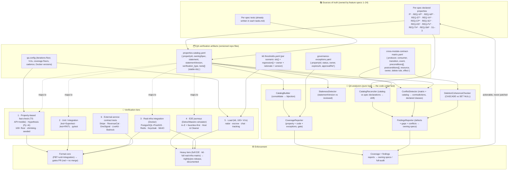
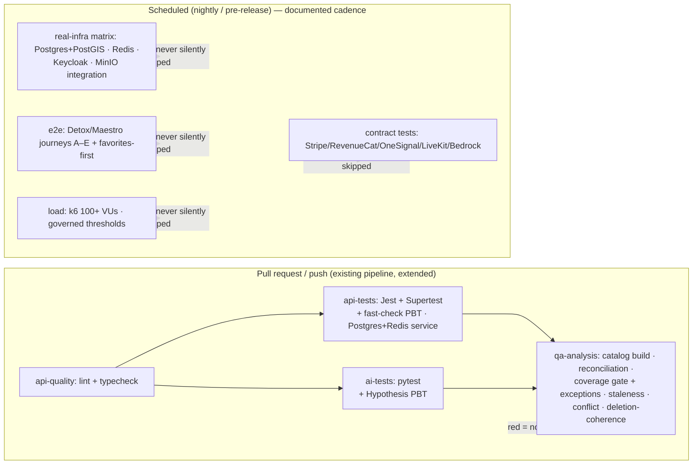

# Design Document: Quality Assurance & Property-Based Testing (PBT)

## Overview

`quality-assurance-pbt` (Spec 25, Sprint 7 — QA & Formal Testing) is the platform's **system-wide quality gate**. It depends on **all specs (1–24)** and is not a product feature: it adds test suites, harnesses, fixtures, a properties catalog, a cross-module contract matrix, conflict/gap reporting, and CI wiring. **It changes no product behavior.** Where a test surfaces a real defect, the fix belongs to the *owning* feature (and its spec); this module owns the *verification*, the feature specs own the *behavior*.

Its guarantee is bounded and defensible — not "the whole system is proven correct." What it guarantees is: (a) every *declared* correctness property maps to at least one executable test and those pass to the coverage this spec defines; (b) the defined E2E journeys pass; (c) the configured tiers (PBT / integration / load) meet their thresholds; and (d) uncovered behavior, cross-spec contradictions, and verification limits are *reported* — never silently "fixed" by inventing behavior.

The design is anchored on six hard rules that mirror the requirements' authority split and non-goals:

1. **The feature spec is authoritative for its behavior + properties.** QA references and executes them; it never redefines an invariant. A discrepancy between a property test and a spec is resolved by fixing the code or the spec (or filing a gap), never by weakening the test to pass.
2. **The correctness-properties catalog is the single index QA verifies against — and it is a drift-checked projection of the specs, not a hand-maintained copy.** Every spec's declared properties (`P*`, `REQ-VP*`, `REQ-NP*`, `REQ-ST*`, `REQ-VV*`, `REQ-CP*`, `REQ-SC*`, `REQ-DS*`, `REQ-FV*`, `REQ-TH*`, `REQ-SM*`, plus Sprint 1–3) are consolidated into one traceable, versioned catalog. Every declared property maps to ≥1 executable test by **stable id**; an unmapped property FAILS CI unless it carries an accepted governance exception. A **reconciliation** step (`CatalogReconciler`) continuously compares the catalog against each feature spec's authoritative per-spec declarations and fails CI on any drift (a declared property missing from the catalog, or a differing `statement` / `owningSpec` / `statementVersion`), so the catalog can never silently diverge from the specs.
3. **Two coverage kinds, never conflated; a known gap does not pass CI.** *Property coverage* (declared properties → passing tests, a floor of 100% **mapped-or-explicitly-accepted-exception**) and *code coverage* (business 90% / API 80% / critical UI 70% + 5 E2E flows) are separate metrics. An **unmapped property** (zero mapped passing tests) FAILS CI — "we know it is uncovered" is not "it is verified" — unless it carries an `ACCEPTED`, unexpired **governance exception**, which is surfaced as an explicit EXCEPTION line item and is never counted as covered. A **discovered gap** (a PBT-found behavior no requirement covers) is a separate reported finding against the owning spec, distinct from an unmapped property. Code-coverage floors never substitute for property coverage — a 95%-lines suite can still miss a concurrent-release/double-refund invariant.
4. **Real infra where it matters; contract-tested mocks where it must.** PostgreSQL(+PostGIS), Redis, Keycloak, and MinIO run real (Docker) for the paths that depend on them. Genuinely external/paid services (Stripe, RevenueCat, OneSignal, LiveKit, AWS Bedrock) are exercised via sandbox or **contract-tested** mocks (success / retry / duplicate / timeout / failure against documented provider responses) — never real production credentials, never real money.
5. **CI is the enforcement surface; heavy tiers run on a documented cadence.** The formal core (PBT + unit + integration) gates CI — a broken invariant fails the build. Full E2E, k6 load, and the full real-infra matrix run nightly/pre-release, documented, never silently skipped.
6. **Gaps and conflicts are reported, not patched — but a defect is routed to be fixed.** Conflict detection runs against a versioned cross-module contract matrix + the property catalog over **structured, machine-analyzable contract fields** (not free-text), and is sound + complete only **for a declared, closed set of conflict classes**. A PBT failure against a **declared invariant** is an implementation **defect** routed to the owning feature (fix the code); a PBT exploration reaching behavior **no spec defines** is an **unspecified-behavior gap** routed to the owning spec (define the behavior). Contradictions and uncovered cases are reported (with minimal reproducers) to the owning specs; QA never chooses a behavior.

Because this is a verification module, the "design" below is the **architecture of the test tiers**, the **catalog data model**, the **contract matrix**, the **mock contract-testing approach**, the **CI/cadence topology**, the **directory/file layout of the harnesses**, and **how the QA system's own meta-properties (REQ-QA1…REQ-QA12) map to concrete mechanisms** — not new product tables or endpoints. The catalog + matrix are stored as versioned artifacts in the repo (not new database tables), because QA holds no product state and adds no runtime schema.

### Scope boundaries (what this module is NOT)

- **Not a second implementation.** No business logic lives here. A defect QA finds is fixed in the owning feature.
- **Not deployment/audit.** Verifying the *deployed* system is wired and live (running VPS, secrets present, services connected in production) is the separate `full-audit`/deployment-readiness concern. QA verifies *code correctness* against infra it stands up for testing.
- **Not secrets management.** Provisioning production credentials is `secrets-inventory`. QA uses only test/sandbox credentials.
- **Not a replacement for per-spec tests.** QA consolidates each feature's own tests, adds the system-wide PBT/E2E/load/conflict tiers, and enforces the catalog; it never deletes a feature's unit tests.

### Responsibility Matrix

| Responsibility | QA module (this spec) | Owning feature spec (1–24) | CI (GitHub Actions) | Codemagic (mobile) | `full-audit` / `secrets-inventory` |
|---|:---:|:---:|:---:|:---:|:---:|
| Declare a correctness property / behavior | ❌ | ✅ (source of truth) | ❌ | ❌ | ❌ |
| Consolidate properties into the catalog | ✅ | ❌ | ❌ | ❌ | ❌ |
| Map property → executable test (stable id) | ✅ | ✅ (writes its own tests) | ❌ | ❌ | ❌ |
| Detect stale mappings (statementVersion) | ✅ | ❌ | ✅ (runs check) | ❌ | ❌ |
| Reconcile catalog ↔ spec declarations (drift) | ✅ | ✅ (owns declarations) | ✅ (runs check) | ❌ | ❌ |
| Own/approve a governance exception | ❌ | ✅ (owner + approval) | ✅ (enforces expiry) | ❌ | ❌ |
| Report property vs code coverage (2 metrics) | ✅ | ❌ | ✅ (gate) | ❌ | ❌ |
| Author system-wide PBT (fast-check / Hypothesis) | ✅ | ✅ (per-module) | ❌ | ❌ | ❌ |
| Real-infra integration harness (Docker) | ✅ | ❌ | ✅ (nightly matrix) | ❌ | ❌ |
| Contract-test external-service mocks | ✅ | ❌ | ❌ | ❌ | ❌ |
| E2E journeys (Detox/Maestro) | ✅ | ❌ | ❌ | ✅ (runs simulator) | ❌ |
| k6 load scenarios + governed thresholds | ✅ | ❌ | ✅ (nightly) | ❌ | ❌ |
| Cross-module conflict / ambiguity detection | ✅ | ❌ | ✅ (runs check) | ❌ | ❌ |
| Fix a defect QA surfaces | ❌ | ✅ | ❌ | ❌ | ❌ |
| Verify deployed/live wiring, prod secrets | ❌ | ❌ | ❌ | ❌ | ✅ |

### Authority split (kept strict)

- **The feature specs own behavior + properties.** QA executes them; a test never overrides a spec.
- **The catalog + contract matrix are QA's verification artifacts** (versioned files), the single index/graph QA checks against; the catalog is a **drift-checked projection** of the specs (reconciled every run), never a copy that can silently diverge.
- **CI is the enforcement surface.** The formal core gates merges; heavy tiers run on cadence.
- **Owning specs (and `full-audit`) receive the findings.** Conflicts/gaps flow back as actionable reports, never discarded.

This design maps every requirement and QA meta-property (REQ-QA1 … REQ-QA12) to concrete, verifiable properties **PQA1 … PQA15** (below), each backed by tests.

## Research & Key Decisions

Research was conducted against the existing repo (the 24 specs' design docs, the CI workflow, the steering rules) and the declared testing stack (fixed by the plan, not re-chosen here). Key findings that inform the design:

- **The stack is already chosen** — `fast-check` (TS), `hypothesis` (Py), Jest + Supertest (API), Jest + RNTL (mobile), pytest (AI), Detox/Maestro (E2E), k6 (load), Docker for real infra. This spec wires them into tiers, it does not select new tools. ([fast-check](https://fast-check.dev/) supports a configurable `numRuns` and automatic shrinking; [Hypothesis](https://hypothesis.readthedocs.io/) supports `@settings(max_examples=…)`, `derandomize`/explicit seeds, and typed strategies; [k6](https://k6.io/docs/using-k6/thresholds/) supports per-scenario `thresholds` as pass/fail gates. Content rephrased for compliance with licensing restrictions.)
- **The catalog and contract matrix are best stored as versioned repo artifacts**, not product DB tables. QA must add no runtime schema (Rule 1 / non-goal: no product state). YAML/JSON files under the QA package are diff-reviewable, CI-loadable, and carry `statementVersion` for staleness detection. Because a hand-maintained catalog can drift from the specs it indexes, the catalog is treated as a **projection** of the per-spec declarations and is **reconciled against them on every run** (`CatalogReconciler`) — a missing/differing entry fails CI, so the catalog cannot silently disagree with a spec.
- **A known coverage gap must not pass CI.** An unmapped property (zero mapped passing tests) fails the build; the only sanctioned escape is an `ACCEPTED`, time-boxed **governance exception** (a versioned `governance-exceptions.yaml` artifact with `{ propertyId, status, owner, expiresAt, approvalRef }`), which is surfaced as an explicit EXCEPTION line item and never counted as covered. This keeps "we chose to defer this" auditable and expiring, distinct from silently green.
- **Determinism-by-seed is a first-class requirement** across both PBT libraries; both support recording and replaying a failing seed. The harness must inject the clock, RNG, and provider seams so time/randomness/external calls are controlled (no `Date.now()`/`Math.random()`/live network inside test logic).
- **The existing CI (`.github/workflows/ci.yml`)** already runs API lint/typecheck, API tests (with a Dockerized `postgis/postgis:16-3.4` + `redis:7-alpine` service), and AI pytest. The formal-core additions must fit this pipeline; the AI Hypothesis PBT extends the existing `ai-tests` job; the heavy tiers (full E2E, k6, full real-infra matrix incl. Keycloak + MinIO) become **separate scheduled workflows** so the green-HEAD, fast-PR rule is preserved.
- **A "faithful mock" is not one that returns `200`.** Each external-service mock must be contract-tested against recorded provider response/event fixtures across success/retry/duplicate/timeout/failure, so a mock cannot pass while the real provider would diverge (the review's explicit requirement, REQ-QA5).
- **Conflict detection cannot claim sound+complete over free text.** Holding preconditions/postconditions/ownership as one prose string each makes any "iff" contradiction claim over natural language undecidable. The contract model is therefore **structured** (state transitions, discrete events, predicate lists, resource, delete-rule, effect), and the detector is sound + complete only **for a declared, closed set of conflict classes** over those structured fields; a contradiction outside the declared classes is reported as needing a *new* conflict class, not silently missed or over-claimed.

## Architecture

### Test-tier topology



### Data flow — catalog build, reconciliation, coverage, and gate (formal core, every PR)

```mermaid
sequenceDiagram
    participant Specs as Feature specs (declared properties)
    participant Builder as CatalogBuilder
    participant Reconciler as CatalogReconciler
    participant Exc as governance-exceptions
    participant Registry as Test registry (stable ids from run)
    participant Coverage as CoverageReporter
    participant Stale as StalenessDetector
    participant Gate as CI gate

    Specs->>Builder: load per-spec property declarations
    Builder->>Builder: consolidate → catalog (bijection over propertyId; dup id → CatalogError)
    Builder->>Reconciler: catalog
    Specs->>Reconciler: authoritative per-spec declarations
    Reconciler->>Reconciler: drift iff a declared property is missing, or statement/owningSpec/statementVersion differ
    Registry->>Coverage: stable test ids + pass/fail + code-coverage buckets
    Builder->>Coverage: catalog (declared properties + verification_type)
    Exc->>Coverage: governance exceptions { status, owner, expiresAt, approvalRef }
    Coverage->>Coverage: property coverage = mapped∧passing / declared; unmapped + ACCEPTED-exceptions broken out separately (exceptions never counted as covered)
    Coverage->>Coverage: code coverage buckets vs floors (business/API/UI + E2E count)
    Builder->>Stale: catalog (statementVersion per property)
    Stale->>Stale: flag mapping stale iff statementVersion > any mapped test reviewedVersion
    Reconciler->>Gate: drift (if any)
    Coverage->>Gate: property coverage (mapped-or-accepted-exception) + exceptions + code floors
    Stale->>Gate: stale mappings (if any)
    alt drift / unmapped-without-accepted-exception / expired exception / sub-floor / stale
        Gate-->>Specs: FAIL build (red = no merge) + finding
    else reconciled, every property mapped-or-ACCEPTED-unexpired-exception, floors met, no stale
        Gate-->>Specs: PASS (formal core green)
    end
```

### Data flow — conflict & ambiguity analysis (over the versioned artifacts)

```mermaid
sequenceDiagram
    participant Matrix as cross-module-contract-matrix
    participant Catalog as properties-catalog
    participant Conflict as ConflictDetector
    participant Lifecycle as DeletionCoherenceChecker
    participant PBT as PBT run (uncovered-case discovery)
    participant Reporter as FindingsReporter
    participant Owner as Owning spec / full-audit

    Matrix->>Conflict: contracts { transition, event, preconditions[], postconditions[], resource, owner, delete-rule, effect } (structured)
    Catalog->>Conflict: declared properties (per owning spec)
    Conflict->>Conflict: over the DECLARED CONFLICT CLASSES, flag pairs that cannot both hold (producer-post ⊥ consumer-pre on same resource/state; incompatible delete-rule on same relation; two invariants unsatisfiable on a shared entity/state)
    Note over Conflict: a contradiction outside the declared classes ⇒ "needs a new conflict class", not silently missed
    Matrix->>Lifecycle: delete-rule field + FK metadata
    Lifecycle->>Lifecycle: user-owned ⇒ CASCADE-from-users; shared-history ⇒ SET NULL; flag mismatch
    PBT->>Reporter: DEFECT (fails a DECLARED invariant) { reproducer, seed, owningFeature }
    PBT->>Reporter: GAP (behavior no spec defines) { minimal reproducer, seed, owningSpec }
    Conflict->>Reporter: contradiction { specs, contract ids, reproducer }
    Lifecycle->>Reporter: coherence violation { relation, expected, actual }
    Reporter->>Reporter: build actionable report; kind ∈ {defect, gap/unspecified, conflict, coherence}; NO prescribed behavior; no drop
    Reporter->>Owner: defect → fix code in owning feature; gap/conflict/coherence → owning spec (and full-audit where relevant)
    Note over Reporter,Owner: QA never resolves a gap by inventing behavior; a defect is fixed in the owning feature, not here
```

### CI / cadence topology



- The **formal core** (`api-tests` incl. fast-check, `ai-tests` incl. Hypothesis, and the new `qa-analysis` job) runs on every PR/push and **gates the build** (REQ-QA10). It extends the existing `api-quality` → `api-tests` / `ai-tests` jobs without breaking green-HEAD (REQ 7.4).
- The **heavy tiers** run as **separate scheduled workflows** (nightly + a pre-release trigger). Standing up Keycloak + MinIO, running Detox/Maestro on a simulator, and driving k6 at 100+ VUs is too slow for every commit; the cadence is documented in the QA README and the workflow files, never silently skipped (REQ-QA10).

## Components and Interfaces

The QA harnesses live in a dedicated package plus per-service test suites. No product module is modified; QA imports product code **read-only** (for PBT/integration) and never imports a product write-path into its own logic (REQ-QA11 / non-goal).

### Package layout (`packages/qa/`)

```
packages/qa/
├── package.json
├── README.md                                  # QA overview, catalog location, tiers, cadence
├── src/
│   ├── qa.config.ts                           # ALL tunables from env/constants (no magic numbers)
│   ├── config/
│   │   └── validate-qa-config.ts              # fail-fast validateQaConfig()
│   ├── catalog/
│   │   ├── properties-catalog.yaml            # the consolidated, versioned catalog (source artifact)
│   │   ├── governance-exceptions.yaml         # { propertyId, status, owner, expiresAt, approvalRef }
│   │   ├── catalog.types.ts                   # PropertyEntry, VerificationType, GovernanceException, CatalogError
│   │   ├── catalog-builder.ts                 # consolidate per-spec declarations → catalog (bijection)
│   │   ├── catalog-loader.ts                  # parse + schema-validate the YAML
│   │   ├── catalog-reconciler.ts              # catalog vs authoritative per-spec declarations → drift (fails CI)
│   │   └── staleness-detector.ts              # statementVersion vs mapped-test reviewedVersion
│   ├── coverage/
│   │   ├── coverage-reporter.ts               # property + code coverage + accepted-exception breakout (three line items)
│   │   └── coverage-gate.ts                    # pass/fail: mapped-or-accepted-exception + floors (pure predicate)
│   ├── contract-matrix/
│   │   ├── cross-module-contract-matrix.yaml  # the versioned, STRUCTURED contract matrix (source artifact)
│   │   ├── matrix.types.ts                     # Contract (structured fields), Predicate, DeleteRule, ConflictClass
│   │   ├── conflict-detector.ts                # matrix + catalog → contradictions over the declared conflict classes
│   │   └── deletion-coherence-checker.ts       # CASCADE user-owned vs SET NULL shared-history
│   ├── findings/
│   │   ├── findings.types.ts                   # Finding (gap|conflict|coherence), Report
│   │   └── findings-reporter.ts                # actionable report, routed, no invented behavior, no drop
│   ├── generators/                             # SHARED typed fast-check arbitraries (reused across suites)
│   │   ├── money.arbitraries.ts                # integer minor units, currencies
│   │   ├── geo.arbitraries.ts                  # lat/lng, radius, PostGIS points
│   │   ├── identity.arbitraries.ts             # users, roles, participant pairs
│   │   ├── offer.arbitraries.ts                # offers, negotiation states, phases
│   │   └── time-seed.ts                        # injected clock + seed helpers (determinism)
│   ├── harness/
│   │   ├── docker-compose.qa.yml               # Postgres+PostGIS · Redis · Keycloak · MinIO (versions from config)
│   │   ├── infra-bootstrap.ts                  # bring up / tear down real infra, idempotent
│   │   └── seam/                               # injectable clock / rng / provider seams
│   │       ├── clock.ts
│   │       └── rng.ts
│   ├── mocks/                                  # CONTRACT-TESTED external-service mocks
│   │   ├── stripe/                             # fixtures + mock + contract test (webhooks: success/retry/dup/timeout/fail)
│   │   ├── revenuecat/                         # entitlement/event fixtures + contract test
│   │   ├── onesignal/                          # delivery-callback fixtures + contract test
│   │   ├── livekit/                            # call-lifecycle webhook fixtures + contract test
│   │   └── bedrock/                            # AI-response fixtures + contract test
│   └── reports/                                # generated: coverage.json, findings.json, load-baselines/
├── e2e/                                        # Detox/Maestro journeys (mobile simulator)
│   ├── journey-a.registration-kyc-offer.e2e.ts
│   ├── journey-b.offer-negotiation-escrow.e2e.ts
│   ├── journey-c.escrow-service-completion-release.e2e.ts
│   ├── journey-d.dispute-resolution-escrow.e2e.ts
│   ├── journey-e.subscription-pro.e2e.ts
│   ├── journey-favorites-first.e2e.ts
│   └── support/                                # per-journey fixtures, independent setup, i18n parity helpers
├── load/                                       # k6 scenarios + governed thresholds
│   ├── thresholds.yaml                         # per-scenario { owner, rationale, version, thresholds }
│   ├── radar-delivery.k6.js
│   ├── escrow-charge.k6.js
│   ├── chat-throughput.k6.js
│   ├── tracking-ingest.k6.js
│   └── contention/                             # single-winner/idempotency stress (accept/release/favorite)
└── __tests__/                                  # PBT + unit tests for the QA logic itself (PQA1–PQA15)
```

The Python (AI) PBT lives with the AI service (`services/ai/tests/pbt/` using Hypothesis) so it runs under the existing `ai-tests` Poetry/pytest job; the catalog references those tests by stable id. Mobile PBT lives with the mobile suite (`apps/mobile/**/__tests__/pbt/` using fast-check + RNTL) and runs under Codemagic + local verification.

### `CatalogBuilder` — consolidate declarations into one traceable index

```typescript
type VerificationType = 'PBT' | 'unit' | 'integration' | 'E2E';

interface PropertyEntry {
  propertyId: string;            // e.g. 'REQ-DS6', 'P3', 'REQ-ST4' — globally unique
  owningSpec: string;            // e.g. 'dispute-system'
  statement: string;            // the invariant text
  statementVersion: number;      // bumped by the owning spec when the statement changes
  verificationType: VerificationType;
  tests: StableTestId[];         // ≥1 required, or the property is a reported gap
  tags?: string[];               // e.g. 'high-risk:single-winner', 'module:escrow'
}

interface CatalogBuilder {
  // Pure: a set of per-spec declarations → a catalog keyed by propertyId (bijection: no loss, no dup).
  build(declarations: PropertyDeclaration[]): { catalog: Catalog; errors: CatalogError[] };
  // Duplicate propertyId → CatalogError listing the id + its owningSpec values (never a silent merge/overwrite);
  // missing/invalid required field (propertyId/owningSpec/statement/statementVersion/verificationType) → CatalogError,
  // and the malformed property is NOT admitted into the catalog.
}
```

- One entry per `propertyId` (bijection); a **duplicate `propertyId`** yields a `CatalogError` listing the id and its conflicting `owningSpec` values (**PQA1**, Req 1.6), and a **malformed entry** (missing/invalid required field or out-of-enum `verificationType`) is rejected with a finding and never admitted (**PQA1/PQA4**, Req 1.1a) — never silently merged or dropped.
- Loaded from `properties-catalog.yaml` via `catalog-loader.ts`, which schema-validates every entry (enum-valid `verificationType`, non-empty `tests` unless explicitly gap-tagged).

### `CatalogReconciler` — the catalog is a drift-checked projection of the specs

```typescript
interface SpecDeclaration {
  propertyId: string;
  owningSpec: string;
  statement: string;
  statementVersion: number;
}

interface CatalogReconciler {
  // The authoritative declarations come from each feature spec's declared properties.
  // Reconciliation FAILS iff the catalog drifts from those declarations:
  //  - a declared property is MISSING from the catalog,
  //  - a catalog `statement` differs from the spec's,
  //  - a catalog `owningSpec` differs from the spec's,
  //  - a catalog `statementVersion` is inconsistent with the spec's.
  reconcile(catalog: Catalog, declarations: SpecDeclaration[]): DriftFinding[];   // [] iff catalog == projection
}
```

- The catalog is not a hand-maintained copy: `CatalogReconciler` compares it against the authoritative per-spec declarations on every `qa-analysis` run and fails CI on any drift (**PQA15**, Req 1.1). This closes the gap where a spec could say statement A while the catalog silently indexes statement B.

### `GovernanceException` — the only sanctioned way an unmapped property does not fail CI

```typescript
type ExceptionStatus = 'OPEN' | 'ACCEPTED';

interface GovernanceException {
  propertyId: string;        // the unmapped property this exception covers
  status: ExceptionStatus;   // only ACCEPTED (with all fields + future expiresAt) permits the property
  owner: string;             // who owns closing the gap
  expiresAt: string;         // ISO-8601 UTC; at/after it, the exception no longer permits the property
  approvalRef: string;       // audit reference (PR/approval)
}
```

- A versioned repo artifact (`governance-exceptions.yaml`). An unmapped property is **permitted (not CI-failing)** only when a matching exception has `status = ACCEPTED`, all four fields non-empty/parseable, and `expiresAt` strictly later than the CI run's evaluation timestamp (UTC). An expired exception, or an `ACCEPTED` one with an empty/unparseable `owner`/`expiresAt`/`approvalRef`, **fails CI** with a finding (Req 1.2b). An `ACCEPTED` exception is surfaced in coverage output as an explicit **EXCEPTION** line item — never counted toward the covered count, never reported as full/complete coverage (Req 1.2c). This is distinct from a discovered gap (**PQA2/PQA10**).

### `CoverageReporter` + `CoverageGate` — two independent metrics, one gate

```typescript
interface CoverageReport {
  property: {
    declared: number;
    mappedPassing: number;                 // mapped to ≥1 passing test of its verificationType
    coveragePct: number;                   // mappedPassing / declared — the property-coverage ratio
    exceptions: AcceptedException[];        // unmapped BUT covered by an ACCEPTED, unexpired governance exception
    unmapped: PropertyGap[];               // unmapped AND no accepted exception ⇒ these FAIL the gate
    fullyMappedOrAccepted: boolean;        // unmapped.length === 0 (exceptions are permitted, not "covered")
    // NOTE: `exceptions` are NEVER folded into mappedPassing/coveragePct, and never reported as full coverage.
  };
  code: {
    businessLogicPct: number;              // floor from config (90%)
    apiPct: number;                        // floor (80%)
    criticalUiPct: number;                 // floor (70%)
    e2eFlowCount: number;                  // floor (5)
  };
  // `gaps` (discovered-behavior findings) live in the findings report, NOT here — a discovered gap is not an unmapped property.
  // Invariant: `property` is derived ONLY from mapping/pass/exception state; `code` ONLY from the runner.
}

interface CoverageGate {
  // Pure predicate. Passes iff EVERY declared property is either mapped-to-a-passing-test
  // OR covered by an ACCEPTED, unexpired governance exception, AND every code floor is met,
  // AND the E2E flow count is met. An unmapped property with NO accepted exception FAILS —
  // reporting it as a finding does not make the gate pass. Code coverage NEVER substitutes for property coverage.
  evaluate(report: CoverageReport, floors: CoverageFloors, now: Date): GateResult;
}
```

- Property coverage, accepted exceptions, and code coverage are computed from disjoint inputs and all appear in the report as separate line items (**PQA10**). The gate fails on any unmapped property that has no `ACCEPTED`, unexpired exception, any sub-floor code bucket, or fewer than the configured E2E flow count. An `ACCEPTED` exception permits its property but is surfaced as an EXCEPTION and never counted toward the covered ratio; "we know it is uncovered" (a reported finding) does **not** by itself pass the gate (Req 1.2, 1.2a, 1.2c, 7.3).

### `StalenessDetector` — traceability integrity, not just link presence

```typescript
interface TestReview {
  testId: StableTestId;             // the mapped test this review record covers
  reviewedStatementVersion: number; // the statementVersion the reviewer actually validated the test against
  testContentHash: string;          // hash of the test's source at review time (detects a bare version bump)
  approvalRef: string;              // PR/approval reference that recorded the review
}

interface StalenessDetector {
  // A mapping is STALE iff the property's statementVersion is newer than the
  // reviewedVersion recorded on any of its mapped tests (the test may no longer verify the current statement).
  // A review is only VALID if its testContentHash matches the test's current source: bumping
  // reviewedStatementVersion without changing the test (hash mismatch) is rejected as an invalid review.
  detect(catalog: Catalog, reviews: TestReview[], currentHashes: Map<StableTestId, string>): StaleMapping[];
}
```

- If a property's `statement`/`statementVersion` advances in its owning spec without a matching test review bump, the mapping is flagged **stale** and CI reports/fails — so a property can never appear "covered" by a test that no longer verifies its current definition (**PQA3**, REQ-QA1).
- **Review governance (who maintains it, and why a bare version bump is caught).** A `TestReview` is governance/CI metadata, not code the test author freely edits to silence the gate. Each review binds `reviewedStatementVersion` to the reviewed test's **content hash** and an **approval reference** (the PR that recorded it). Bumping `reviewedStatementVersion` without actually modifying/reviewing the test leaves the recorded `testContentHash` disagreeing with the test's current source, so the review is rejected as invalid and the mapping stays **stale** — a version bump alone cannot clear staleness (ORANGE 5, Req 1.3). The review record is created/updated by the reviewer on the owning feature's PR, not by the QA module.

### `ConflictDetector` — sound + complete for the declared conflict classes over structured contract fields

Detection cannot be sound + complete over free-text preconditions/postconditions (contradiction of natural language is undecidable). The contract is therefore **structured and machine-analyzable**: state transitions, a discrete event, lists of structured predicates, the shared resource, the owner, the delete-rule, and the effect. A human-readable `note` MAY remain for reviewers, but the detector operates **only** on the structured fields.

```typescript
// A structured predicate over the shared vocabulary (entity/state/attribute + op + value),
// NOT a prose sentence — so satisfiability of a pair is decidable.
interface Predicate {
  subject: string;   // e.g. 'offer.state', 'payment.count', 'favorite.owner'
  op: 'eq' | 'neq' | 'lt' | 'lte' | 'gt' | 'gte' | 'in' | 'not_in' | 'exists' | 'not_exists';
  value?: string | number | string[];
}

interface Contract {
  producer: string; consumer: string;
  stateTransition?: { from: string; to: string };   // structured transition (nullable for pure events)
  event: string;                                     // the discrete event/state crossing the boundary
  preconditions: Predicate[];                        // structured, not one prose string
  postconditions: Predicate[];                       // structured, not one prose string
  resource: string;                                  // the shared entity/relation the contract acts on
  owner: string;                                     // which module owns the resource (authority)
  deleteRule: 'CASCADE' | 'SET_NULL' | 'RESTRICT' | 'NONE';
  effect?: string;                                   // declared side effect (e.g. 'charge', 'release')
  note?: string;                                     // human-readable only; NOT used by detection
  version: number;
}

// The closed, declared set of contradictions the detector handles.
type ConflictClass =
  | 'PRODUCER_POST_VS_CONSUMER_PRE'   // producer postcondition ⊥ consumer precondition on the same resource/state
  | 'INCOMPATIBLE_DELETE_RULE'        // two contracts assert incompatible deleteRule on the same relation
  | 'UNSATISFIABLE_SHARED_INVARIANT'; // two catalog invariants mutually unsatisfiable on a shared entity/state
                                      //   under the declared predicate vocabulary

interface ConflictDetector {
  // Sound + complete FOR THE DECLARED CONFLICT CLASSES over the structured fields:
  // flags exactly the contract/property pairs that cannot both hold under one of the ConflictClass rules,
  // identifying the exact pair + the class. A contradiction OUTSIDE these classes is NOT silently missed:
  // it is reported as `needsNewConflictClass` (out of current scope), never falsely claimed as covered.
  detect(matrix: Contract[], catalog: Catalog): {
    contradictions: Contradiction[];        // [] on a consistent matrix (no false positives)
    needsNewConflictClass: OutOfScopeNote[]; // structurally-suspicious pairs no declared class decides
  };
}
```

- **Closed set of conflict classes handled** (this is the honest scope of the sound+complete claim): (1) a producer postcondition that contradicts a consumer precondition on the same `resource`/state; (2) two contracts asserting incompatible `deleteRule` on the same relation; (3) two catalog invariants mutually unsatisfiable on a shared entity/state under the declared predicate vocabulary. Anything outside these classes is reported as needing a new conflict class — the detector never claims to decide arbitrary semantic contradiction.
- Deterministic analysis over defined artifacts (not an unspecified "check"): within the declared classes a seeded contradiction is always detected and localized to the exact pair; a consistent matrix yields none (**PQA8**, REQ-QA9). The matrix covers at least: offer↔negotiation↔escrow, service-tracking↔completion↔dispute, subscription↔commission↔favorites↔ads, notifications↔lifecycle/delete, chat↔calls↔account-deletion.

### `DeletionCoherenceChecker` — CASCADE user-owned vs SET NULL shared-history

```typescript
interface DeletionCoherenceChecker {
  // Classifies each relation (user-owned | shared-history) and asserts its delete rule matches policy:
  //   user-owned (favorites, notifications) ⇒ CASCADE from users
  //   shared-history (chat, calls, completions, disputes, tracking) ⇒ SET NULL
  // Flags exactly the relations whose declared/actual rule ≠ policy-expected.
  check(matrix: Contract[], fkMetadata: FkMetadata[]): CoherenceViolation[];
}
```

- Verifies the deliberate cross-spec deletion policy holds consistently, reading the matrix's `deleteRule` column and (in the real-infra tier) the actual FK metadata (**PQA9**, REQ 6.4).

### `FindingsReporter` — actionable, routed, never patched, never dropped

```typescript
type Finding =
  // (A) PBT failed against a DECLARED invariant ⇒ an implementation DEFECT: fix the CODE in the owning feature.
  | { kind: 'defect'; owningFeature: string; propertyId: string; reproducer: Reproducer }
  // (B) exploration reached behavior NO spec defines ⇒ an UNSPECIFIED-BEHAVIOR gap: DEFINE it in the owning spec.
  | { kind: 'gap'; subKind: 'unspecified'; owningSpec: string; propertyId?: string; reproducer: Reproducer }
  | { kind: 'conflict'; specs: string[]; contractIds: string[]; conflictClass: ConflictClass; reproducer?: Reproducer }
  | { kind: 'coherence'; owningSpec: string; relation: string; expected: string; actual: string };

interface FindingsReporter {
  // Every finding → a well-formed report addressed to its target (and full-audit where relevant).
  // A 'defect' routes to the owning FEATURE (fix the code); a 'gap'/'unspecified' routes to the owning SPEC
  // (define the behavior); 'conflict'/'coherence' route to the owning spec(s).
  // The report carries specs/feature + property/contract ids + minimal reproducer + seed.
  // It NEVER carries a prescribed-behavior/resolution field, and NEVER drops a finding.
  report(findings: Finding[]): { reports: FindingReport[] };      // reports.length === findings.length
}
```

- A PBT failure is split by cause (ORANGE 6, Req 2.6/7 & the Introduction's authority split): **(A)** a failure against a **declared invariant** is an implementation **defect** routed to the owning *feature* to be fixed in code — QA does not touch the code; **(B)** an exploration reaching behavior **no requirement covers** is an **unspecified-behavior gap** routed to the owning *spec* to define the behavior — QA never invents it. Every defect/gap and every conflict/coherence violation becomes an actionable report carrying the minimal reproducer + seed and no invented behavior; the reporter emits exactly one report per finding (no silent drop) (**PQA7**, REQ 2.6/6.2/6.3/6.5).

### Contract-tested external-service mocks (`packages/qa/src/mocks/`)

Each provider mock ships with recorded contract **fixtures** (the documented provider responses/events the app actually consumes) and a **contract test** that runs the mock across the required response classes and validates the emitted shape against the fixture schema, then drives the app consumer to the expected state:

| Provider | Consumed surface | Response classes contract-tested |
|---|---|---|
| Stripe | PaymentIntent / Transfer / Refund / Reversal + `charge.dispute.*`, `payment_intent.*`, `transfer.*`, `account.updated` webhooks | success · retry · **duplicate** · timeout · failure |
| RevenueCat | entitlement state + subscription lifecycle events | success · retry · duplicate · timeout · failure |
| OneSignal | send + delivery callbacks | success · retry · duplicate · timeout · failure |
| LiveKit | room/token + call-lifecycle webhooks | success · retry · duplicate · timeout · failure |
| AWS Bedrock | AI request/response (the only cloud service) | success · retry · duplicate · timeout · failure |

A mock cannot pass while diverging from the recorded provider contract (**PQA11**, REQ-QA5). No mock uses real credentials, a live endpoint, or moves real money.

### E2E journey registry (`packages/qa/e2e/`)

Each journey is an **independently-runnable** target with its own fixtures (no cross-journey ordering dependency); a shared setup layer MAY chain them for a full smoke run, but each also runs alone so a failure localizes to a stage (REQ-QA12). Requirement 4.4 asks the suite to cover **both** Host and Cleaner — but a single journey need not fully simulate both roles. The **role assignment below assigns each journey the actor(s) it actually exercises**, and the journeys **collectively cover both roles**; this keeps each journey focused (less setup, less fragility) without losing role coverage.

| Journey | Flow | Actor(s) exercised | Notes |
|---|---|---|---|
| A | registration → KYC → publish offer | Host (primary); Cleaner registration+KYC variant | Host publishes; Cleaner exercises the register→KYC arm |
| B | offer → negotiation → escrow | Host + Cleaner (both, negotiation needs both sides) | escrow via Stripe sandbox/mock |
| C | escrow → service (tracking → arrival verification → checklist) → completion → release | Cleaner (primary — performs service); Host confirms/releases | full service lifecycle |
| D | dispute → resolution → escrow effect | Host (raises/auto-release path) | incl. auto-release (no confirmation → auto-release) |
| E | subscription → PRO entitlement | Cleaner PRO (primary); Host PRO variant | PRO commission / favorites-unlimited / ad-free via RevenueCat sandbox |
| Favorites-first | favorites-first offer delivery | Host (favorites a Cleaner) + Cleaner (receives priority) | favorites priority path |

Collectively the six journeys exercise **both Host and Cleaner** (Req 4.4): Host is primary in A/D and present in B/C/E/favorites; Cleaner is primary in C/E and present in A/B/favorites — no journey is forced to fully simulate both unless the flow inherently needs both (B, favorites-first). Each journey documents which flow and actor(s) it verifies; the registry size must meet or exceed the configured `E2E_MIN_FLOWS` (5). i18n-bearing screens assert `en`/`es` parity where the owning spec requires it (**PQA14**, REQ 8.4).

### k6 load scenarios + governed thresholds (`packages/qa/load/`)

`thresholds.yaml` holds, **per scenario**, a versioned entry `{ owner, rationale, version, slo, regression }` that separates **two distinct checks**:

- **`slo`** — an **absolute** pass/fail condition (e.g. `p95 < 500ms`, `error_rate < 1%`). A breach fails the run regardless of history.
- **`regression`** — a **relative** check against the previous stored baseline (e.g. `p95 not worse than the prior baseline by > 10%`). A breach flags a regression even when the absolute SLO still passes.

```yaml
# thresholds.yaml  (versioned; per scenario)
- scenario: "escrow-charge"
  owner: "payments-team"
  rationale: "escrow charge is a launch-critical hot path"
  version: 2
  slo:
    - "p(95) < 500"          # absolute pass/fail
    - "error_rate < 0.01"
  regression:
    - metric: "p(95)"
      maxWorseThanBaselinePct: 10   # relative to reports/load-baselines/escrow-charge@1.json
```

Each scenario runs at ≥ `K6_MIN_VUS` (100) VUs against the Dockerized non-prod environment:

| Scenario | Hot path | Contention stress |
|---|---|---|
| radar-delivery | offer radar delivery / expansion | — |
| escrow-charge | escrow charge on match | concurrent offer accepts (single-winner) |
| chat-throughput | chat message throughput | — |
| tracking-ingest | service-tracking position ingest | — |
| contention/release | escrow release triggers | concurrent release (single release per payment) |
| contention/favorite | favorite adds | concurrent favorite adds (idempotent) |

Both the `slo` and `regression` blocks are governed by config with an explicit owner + rationale + version — this spec does not fix the numbers, it requires they be governed and versioned, and it requires the two concepts stay distinct (absolute SLO ≠ regression-vs-baseline) (**PQA12**, REQ 5.2). Results are emitted to `reports/load-baselines/` keyed by scenario + version so the regression comparator has a prior baseline to compare against (REQ 5.5).

## Data Models

QA adds **no product database tables** and **no runtime schema** — it holds no product state (Rule 1 / non-goal). Its "data models" are the versioned artifacts it verifies against and the report artifacts it emits. Where the real-infra tier needs a database, it uses the **owning specs' migrations** against a throwaway Dockerized PostgreSQL, not schema of its own.

### The properties catalog (`properties-catalog.yaml`) — the single verification index

Consolidates every declared property (REQ-QA1). One entry per `propertyId`:

```yaml
# properties-catalog.yaml  (versioned; the single index QA verifies against)
- propertyId: "REQ-DS6"
  owningSpec: "dispute-system"
  statement: "At most one financial effect per dispute (single-winner terminal + idempotent Spec 9)."
  statementVersion: 3
  verificationType: "PBT"
  tests:
    - "qa/pbt/dispute-system/single-financial-effect#P11"   # stable test id
  tags: ["high-risk:no-double-refund", "module:disputes"]

- propertyId: "P3"
  owningSpec: "stripe-escrow"
  statement: "Single charge per offer under any number of offer.matched deliveries."
  statementVersion: 1
  verificationType: "PBT"
  tests: ["qa/pbt/stripe-escrow/single-charge#P3"]
  tags: ["high-risk:idempotent-intent", "module:escrow"]

- propertyId: "REQ-ST4"
  owningSpec: "service-tracking"
  statement: "Server-authoritative geofence validation on arrival."
  statementVersion: 2
  verificationType: "integration"
  tests: ["qa/integration/service-tracking/geofence-arrival"]
  tags: ["high-risk:server-authoritative", "module:service-tracking"]
```

| Field | Type | Notes |
|---|---|---|
| `propertyId` | string | globally unique across all specs (`P*`/`REQ-*`/`S1–3`); the catalog key |
| `owningSpec` | string | the feature spec that owns the behavior + property (authoritative) |
| `statement` | string | the invariant text (human-readable) |
| `statementVersion` | integer | bumped by the owning spec when the statement changes; drives staleness |
| `verificationType` | enum | `PBT` \| `unit` \| `integration` \| `E2E` — how the property is verified |
| `tests` | string[] | ≥1 **stable test id**; empty ⇒ unmapped property (fails CI unless an accepted exception exists) |
| `tags` | string[]? | high-risk class + module for required-subset checks |

**Integrity rules.** Two entries sharing a `propertyId` fail the build with a finding listing the id + conflicting `owningSpec` values (Req 1.6); an entry missing/invalid on any required field (`propertyId`/`owningSpec`/`statement`/`statementVersion`/`verificationType`, or an out-of-enum `verificationType`) fails with a finding and is not admitted (Req 1.1a).

**Coverage rule.** Every declared property maps to ≥1 passing executable test of its `verificationType`; an **unmapped property fails CI** unless covered by an `ACCEPTED`, unexpired governance exception (surfaced as an EXCEPTION, never counted as covered). A **discovered gap** (a PBT-found behavior no requirement covers) is a *separate* finding against the owning spec, never conflated with an unmapped property (REQ-QA1). A test review record carries `{ testId, reviewedStatementVersion, testContentHash, approvalRef }` for staleness (a bump without a test-content change is an invalid review).

**Reconciliation invariant (drift-checked projection).** The catalog is a **projection** of the specs, not a hand-maintained copy: on every `qa-analysis` run, `CatalogReconciler` compares each entry against the **authoritative per-spec declarations** (each feature spec's declared properties). CI fails if a declared property is **missing** from the catalog, or if a catalog `statement`, `owningSpec`, or `statementVersion` **differs** from the spec's. This guarantees the catalog can never silently say statement B while the spec says statement A (**PQA15**, Req 1.1).

### The governance-exceptions artifact (`governance-exceptions.yaml`) — auditable, time-boxed escapes

A versioned artifact; one entry per unmapped property that the team has explicitly, temporarily accepted (Req 1.2b/1.2c):

```yaml
# governance-exceptions.yaml  (versioned)
- propertyId: "REQ-FV7"
  status: "ACCEPTED"                 # OPEN | ACCEPTED — only ACCEPTED permits the property
  owner: "favorites-team"
  expiresAt: "2025-09-30T00:00:00Z"  # ISO-8601 UTC; at/after ⇒ fails as unmapped
  approvalRef: "PR-1487"             # audit reference
```

| Field | Type | Notes |
|---|---|---|
| `propertyId` | string | the unmapped property this exception covers |
| `status` | enum | `OPEN` \| `ACCEPTED`; only `ACCEPTED` (all fields set, future `expiresAt`) permits the property |
| `owner` | string | who owns closing the gap; empty ⇒ invalid ⇒ fail |
| `expiresAt` | string | ISO-8601 UTC; at/after the CI run's evaluation timestamp ⇒ fail as unmapped |
| `approvalRef` | string | audit reference (PR/approval); empty ⇒ invalid ⇒ fail |

An `ACCEPTED` exception is surfaced in coverage output as an explicit **EXCEPTION** line item — never folded into the covered count, never reported as full/complete coverage (Req 1.2c). Expired or malformed ⇒ CI fails with a finding (Req 1.2b).

### The cross-module contract matrix (`cross-module-contract-matrix.yaml`) — conflict-detection input

An explicit, versioned artifact; one row per inter-module contract (REQ 6.1):

The contract is **structured and machine-analyzable** (not free-text): preconditions/postconditions are lists of `{ subject, op, value }` predicates over a shared vocabulary, so pairwise satisfiability is decidable and the detector's sound+complete claim is bounded to the declared conflict classes. A human-readable `note` MAY remain for reviewers but is **not** used by detection.

```yaml
# cross-module-contract-matrix.yaml  (versioned; STRUCTURED fields)
- producer: "offer-negotiation"
  consumer: "stripe-escrow"
  stateTransition: { from: "NEGOTIATING", to: "MATCHED" }
  event: "offer.matched"
  resource: "offer"
  owner: "escrow (money); offer (lifecycle)"
  preconditions:
    - { subject: "offer.state", op: "eq", value: "MATCHED" }
    - { subject: "offer.agreedPrice", op: "exists" }
  postconditions:
    - { subject: "payment.count", op: "eq", value: 1 }   # exactly one payment charged
  effect: "charge"
  deleteRule: "RESTRICT"            # payments.offer_id ON DELETE RESTRICT
  note: "escrow owns money; offer owns lifecycle"
  version: 1

- producer: "users"
  consumer: "favorites"
  event: "user.deleted"
  resource: "favorite"
  owner: "favorites (user-owned data)"
  preconditions:
    - { subject: "favorite.owner", op: "eq", value: "deletedUser" }
  postconditions:
    - { subject: "favorite.row", op: "not_exists" }       # favorite removed
  deleteRule: "CASCADE"             # user-owned ⇒ CASCADE from users
  version: 1

- producer: "users"
  consumer: "realtime-chat"
  event: "user.deleted"
  resource: "message"
  owner: "chat (shared history)"
  preconditions:
    - { subject: "message.author", op: "eq", value: "deletedUser" }
  postconditions:
    - { subject: "message.row", op: "exists" }             # retained
    - { subject: "message.author", op: "eq", value: "null" } # author nulled
  deleteRule: "SET_NULL"            # shared-history ⇒ SET NULL
  version: 1
```

| Field | Type | Notes |
|---|---|---|
| `producer` / `consumer` | string | the two modules bound by the contract |
| `stateTransition` | `{ from, to }`? | structured transition the contract governs (nullable for pure events) |
| `event` | string | the discrete event/state crossing the boundary |
| `preconditions` | Predicate[] | **structured** `{ subject, op, value }` list; conflict detection compares producer post vs consumer pre |
| `postconditions` | Predicate[] | **structured** list; what holds after |
| `resource` | string | the shared entity/relation the contract acts on |
| `owner` | string | which module owns the resource (authority) |
| `deleteRule` | enum | `CASCADE` \| `SET_NULL` \| `RESTRICT` \| `NONE` — checked for lifecycle coherence |
| `effect` | string? | declared side effect (`charge`, `release`, …) |
| `note` | string? | human-readable only; **not** used by detection |
| `version` | integer | versioned so matrix changes are diff-reviewable |

**Declared conflict classes** the `ConflictDetector` decides over these fields (the honest bound of its sound+complete claim): (1) `PRODUCER_POST_VS_CONSUMER_PRE` — a producer postcondition predicate contradicts a consumer precondition predicate on the same `resource`/state; (2) `INCOMPATIBLE_DELETE_RULE` — two contracts assert incompatible `deleteRule` on the same relation; (3) `UNSATISFIABLE_SHARED_INVARIANT` — two catalog invariants mutually unsatisfiable on a shared entity/state under the declared predicate vocabulary. A structurally-suspicious pair outside these classes is reported as needing a new conflict class — never silently missed, never over-claimed as decided.

### The QA config (`qa.config.ts`) — all tunables, no magic numbers

Every tunable comes from env/constants and is validated fail-fast (REQ-QA11 / REQ 8.1). No iteration count, VU count, coverage floor, cadence schedule, or Docker version is a literal in test logic.

| Tunable | Meaning |
|---|---|
| `PBT_MIN_ITERATIONS_FLOOR` | the 100+ floor for every property-based test (per-property override may raise it, never lower) |
| `PBT_HIGH_RISK_ITERATIONS` | higher default for high-risk state machines (escrow/disputes/concurrency/idempotency) |
| `PBT_SHRINKING_ENABLED` | shrinking on (always true; validated) |
| `K6_MIN_VUS` | minimum virtual users per hot-path scenario (100) |
| `COVERAGE_FLOOR_BUSINESS` / `_API` / `_CRITICAL_UI` | code-coverage floors (90 / 80 / 70) |
| `E2E_MIN_FLOWS` | minimum critical E2E flows (5) |
| `CADENCE_HEAVY_TIERS` | schedule descriptor for nightly/pre-release heavy tiers |
| `DOCKER_POSTGRES_VERSION` / `_REDIS_` / `_KEYCLOAK_` / `_MINIO_` | pinned Docker image versions for the real-infra tier |
| `PROVIDER_SANDBOX_MODE` | forces sandbox/mock for all external providers (no prod keys, no real money) |
| `QA_GOVERNANCE_EXCEPTIONS_PATH` | path to `governance-exceptions.yaml` (accepted, time-boxed unmapped-property exceptions) |

### Report artifacts (generated, `packages/qa/src/reports/`)

- `coverage.json` — property coverage (mapped-passing ratio), the **exceptions** breakout (accepted, never counted as covered), the **unmapped** list, and code coverage — plus the gate result.
- `findings.json` — every defect / gap / conflict / coherence violation + drift finding, addressed to its owning feature or spec (never dropped, no prescribed behavior).
- `load-baselines/{scenario}@{version}.json` — comparable k6 results per run; the prior baseline the `regression` check compares against (distinct from the absolute `slo` check).

### TypeScript enums / types (`catalog.types.ts`, `matrix.types.ts`, `findings.types.ts`)

```typescript
export enum VerificationType { PBT = 'PBT', UNIT = 'unit', INTEGRATION = 'integration', E2E = 'E2E' }
export enum DeleteRule { CASCADE = 'CASCADE', SET_NULL = 'SET_NULL', RESTRICT = 'RESTRICT', NONE = 'NONE' }
export enum FindingKind { DEFECT = 'defect', GAP = 'gap', CONFLICT = 'conflict', COHERENCE = 'coherence' }
export enum ExceptionStatus { OPEN = 'OPEN', ACCEPTED = 'ACCEPTED' }
export enum ConflictClass {
  PRODUCER_POST_VS_CONSUMER_PRE = 'PRODUCER_POST_VS_CONSUMER_PRE',
  INCOMPATIBLE_DELETE_RULE = 'INCOMPATIBLE_DELETE_RULE',
  UNSATISFIABLE_SHARED_INVARIANT = 'UNSATISFIABLE_SHARED_INVARIANT',
}
export enum RelationClass { USER_OWNED = 'user-owned', SHARED_HISTORY = 'shared-history' }
export enum ResponseClass { SUCCESS = 'success', RETRY = 'retry', DUPLICATE = 'duplicate', TIMEOUT = 'timeout', FAILURE = 'failure' }
export enum ExternalProvider { STRIPE = 'stripe', REVENUECAT = 'revenuecat', ONESIGNAL = 'onesignal', LIVEKIT = 'livekit', BEDROCK = 'bedrock' }
```

## Correctness Properties

*A property is a characteristic or behavior that should hold true across all valid executions of a system — essentially, a formal statement about what the system should do. Properties serve as the bridge between human-readable specifications and machine-verifiable correctness guarantees.*

These are the **meta-properties of the QA system itself** (REQ-QA1 … REQ-QA12): its tests verify the *product's* declared properties, and these ensure the QA is *honest* — that coverage is complete-or-explicitly-excepted (a known gap never silently passes CI), mappings are not stale, the catalog does not drift from the specs, findings are reported not patched, and the harness is deterministic and standards-compliant. The code under test is the QA logic layer: the catalog builder, catalog reconciler, coverage reporter, staleness detector, conflict detector, deletion-coherence checker, findings reporter, iteration resolver, mock contract-tests, and config validator — all pure or seam-isolated functions over a large input space, so PBT is the right tool. Infrastructure wiring (real-Docker connectivity), specific E2E journeys, CI gating semantics, secrets/standards enforcement, and the authority policy (spec-wins) are verified by integration / E2E / config / lint / process and recorded with those `verificationType`s in the catalog — not forced into generation.

Redundant candidates from the prework were consolidated: the "required set ⊆ mapped catalog" checks (declared coverage, high-risk-invariant subset, per-module subset) collapse into one **coverage partition** property (PQA2); the gap/conflict/coherence reporter shape + routing + no-invented-behavior + no-drop collapse into one **findings reporter** property (PQA7); determinism-by-seed + isolation/order-independence + controlled seams collapse into one **determinism** property (PQA6); the two-metrics separation + the coverage gate collapse into one **coverage** property (PQA10).

### Property 1: [PQA1] Catalog is a lossless bijection over propertyId

*For any* set of per-spec property declarations (arbitrary `propertyId`s, `owningSpec`s, `statementVersion`s, and `verificationType`s), the `CatalogBuilder` SHALL produce a catalog with **exactly one entry per `propertyId`** — no declared property dropped, none duplicated, `owningSpec`/`statement`/`statementVersion`/`verificationType` preserved — and a duplicate `propertyId` or a missing required field SHALL surface as an explicit `CatalogError`, never a silent merge, overwrite, or omission.

**Validates: Requirements 1.1** · REQ-QA1

### Property 2: [PQA2] Complete coverage partition (mapped ∪ unmapped = declared, disjoint), including required subsets by the right method

*For any* catalog and *for any* registry of stable test ids, every declared property SHALL be either **mapped** (≥1 live passing test **of its own `verificationType`**) or **unmapped** — `mapped ∪ unmapped == declared` and `mapped ∩ unmapped == ∅`; no declared property is ever silently absent from both. For the **per-module** required subset — all 22 named modules — every module SHALL have **executable verification coverage of the appropriate `verification_type`** (PBT *or* unit *or* integration *or* E2E, matching each covered property's type); module coverage SHALL NOT require `verificationType = PBT` for every module. For the **high-risk invariant** subset (single-winner, no-double-pay/refund, idempotent intents, server-authoritative validation, stale-safe attempts, tier/limit enforcement, ordering/idempotency) every member SHALL specifically have `verificationType = PBT` with a mapped test. A member of either subset that is unmapped SHALL be reported (and fail the gate unless an accepted exception exists).

**Validates: Requirements 1.2, 2.4, 2.5, 2.6** · REQ-QA1, REQ-QA6

### Property 3: [PQA3] Staleness detection on statementVersion

*For any* property and *for any* set of test-review records `{ reviewedStatementVersion, testContentHash, approvalRef }` on its mapped tests, the `StalenessDetector` SHALL flag the mapping **stale if and only if** the property's current `statementVersion` is greater than the `reviewedStatementVersion` of any mapped test **or** a review's recorded `testContentHash` disagrees with the test's current source (an invalid review) — a property whose statement changed without a corresponding *genuine* test review (a bare `reviewedStatementVersion` bump with no test change) SHALL never appear "covered," and a mapping whose reviews are all current and hash-valid SHALL never be falsely flagged.

**Validates: Requirements 1.3** · REQ-QA1

### Property 4: [PQA4] verification_type integrity and correct runner language

*For any* catalog entry, its `verificationType` SHALL be a member of `{ PBT, unit, integration, E2E }`, each of its mapped tests SHALL be of that kind, and *for any* entry with `verificationType = PBT`, the mapped test's declared runner SHALL match the owning spec's language (TypeScript ⇒ `fast-check`, Python ⇒ `hypothesis`) — a property SHALL never be recorded with an out-of-enum type, mapped to a test of the wrong kind, or PBT-verified with the wrong library.

**Validates: Requirements 2.1, 2.7** · REQ-QA3

### Property 5: [PQA5] Iteration floor honored, configurable upward, shrinking always on

*For any* per-property iteration configuration, the iteration resolver SHALL yield an effective count **≥ `PBT_MIN_ITERATIONS_FLOOR` (100)** and SHALL never disable shrinking; a per-property/risk override MAY raise the count (e.g. for escrow/dispute/concurrency/idempotency state machines) but a configured value below the floor SHALL be rejected or clamped up per policy, never run below the floor.

**Validates: Requirements 2.2, 2.7** · REQ-QA3

### Property 6: [PQA6] Deterministic by seed, isolated, order-independent

*For any* seed, running a given deterministic property harness twice with that seed SHALL produce the identical outcome — the same pass/fail and, on failure, the same minimal (shrunk) counterexample — and a recorded failing seed SHALL re-fail; and *for any* ordering or subset of a representative integration slice, the final state SHALL be reset to baseline by idempotent teardown so results are **order-independent** (no flaky-by-design tests). Time, randomness, and external calls SHALL be taken from injected seams (clock/RNG/provider), never from direct `Date.now()`/`Math.random()`/live network inside test logic.

**Validates: Requirements 2.3, 3.5, 7.5** · REQ-QA4

### Property 7: [PQA7] Findings are actionable, correctly routed by cause, never invent behavior, never dropped

*For any* set of findings, the `FindingsReporter` SHALL emit **exactly one report per finding** (no silent drop), routed by cause: a PBT failure against a **declared invariant** SHALL be classified a `defect` and routed to the owning **feature** (fix the code); a PBT-explored behavior **no requirement covers** SHALL be classified an unspecified-behavior `gap` and routed to the owning **spec** (define the behavior); a detected conflict or deletion-coherence violation SHALL route to the owning spec(s) (and to `full-audit` where relevant). Each report SHALL carry the involved feature/specs + property/contract ids + the minimal reproducer and seed, and SHALL **never** include a prescribed-behavior/resolution field — QA reports the defect/gap/conflict, it never chooses a behavior to make a test pass.

**Validates: Requirements 2.6, 6.2, 6.3, 6.5** · REQ-QA2, REQ-QA9

### Property 8: [PQA8] Conflict detection is sound and complete for the declared conflict classes over structured fields

*For any* cross-module contract matrix + property catalog expressed in **structured fields** (state transitions, events, structured precondition/postcondition predicates, resource, delete-rule), the `ConflictDetector` SHALL flag a pair as conflicting **if and only if** it falls in one of the **declared conflict classes** — `PRODUCER_POST_VS_CONSUMER_PRE` (a producer postcondition predicate contradicting a consumer precondition predicate on the same resource/state), `INCOMPATIBLE_DELETE_RULE` (incompatible delete-rules on the same relation), or `UNSATISFIABLE_SHARED_INVARIANT` (two invariants mutually unsatisfiable on a shared entity/state under the declared predicate vocabulary) — identifying the exact pair and the class. A matrix seeded with a deliberate in-class contradiction SHALL always be detected; a consistent matrix SHALL yield **no** flags (no false positives); and a contradiction **outside** the declared classes SHALL be reported as needing a new conflict class, **never** silently missed nor falsely claimed as decided (the claim is bounded to the declared classes, not arbitrary NL contradiction).

**Validates: Requirements 6.1** · REQ-QA9

### Property 9: [PQA9] Deletion/lifecycle coherence across specs

*For any* set of relations classified `user-owned` or `shared-history` with their declared/actual delete rules, the `DeletionCoherenceChecker` SHALL flag **exactly** those whose rule violates the policy — `user-owned` (favorites, notifications) must be `CASCADE` from `users`; `shared-history` (chat, calls, completions, disputes, tracking) must be `SET NULL` — and a policy-consistent set SHALL yield no flags.

**Validates: Requirements 6.4** · REQ-QA9

### Property 10: [PQA10] Two independent coverage metrics + a mapped-or-accepted-exception gate; a known gap never passes; code never substitutes property

*For any* measured inputs (property mapping/pass state, the set of governance exceptions, per-bucket code coverage + E2E count, and an evaluation timestamp), the reporter SHALL compute **property coverage as the ratio of mapped-passing to declared from the mapping/pass state only**, break out **ACCEPTED exceptions** and **unmapped** properties as separate line items (exceptions never folded into the covered count), and compute **code coverage from the runner only** (the two independent — changing one never moves the other). The gate SHALL pass **if and only if** every declared property is either mapped-to-a-passing-test **or** covered by an `ACCEPTED` exception whose fields are complete and whose `expiresAt` is strictly after the evaluation timestamp, **and** every code-coverage bucket meets its floor, **and** the E2E flow count meets its floor. An **unmapped property with no accepted exception SHALL fail the gate** — merely reporting it SHALL NOT make the gate pass — an expired/malformed exception SHALL fail, a sub-floor bucket SHALL fail, and code-coverage floors SHALL never substitute for property coverage.

**Validates: Requirements 1.2, 1.2a, 1.2b, 1.2c, 1.4, 7.3** · REQ-QA1b, REQ-QA10

### Property 11: [PQA11] External-service mocks conform to the recorded provider contract

*For any* external provider (Stripe, RevenueCat, OneSignal, LiveKit, Bedrock) and *for any* response class in `{ success, retry, duplicate, timeout, failure }`, the mock's emitted response/event SHALL validate against the recorded provider-contract fixture schema for that class, and the application consumer SHALL reach the correct state — so a mock SHALL never pass while the real provider would behave differently — and no contract test SHALL use a real credential, a live endpoint, or move real money.

**Validates: Requirements 3.4** · REQ-QA5

### Property 12: [PQA12] k6 thresholds are governed, and SLO (absolute) is distinct from regression (vs baseline)

*For any* k6 scenario configuration, the threshold validator SHALL accept it **if and only if** every hot-path scenario declares ≥ `K6_MIN_VUS` (100) virtual users, carries a non-empty `owner`, `rationale`, and `version`, and declares its checks under **two distinct blocks**: an **`slo`** block of ≥1 **absolute** pass/fail condition (e.g. `p95 < 500ms`) and a **`regression`** block of ≥0 **relative** checks against the stored prior baseline (e.g. `p95 not worse than baseline by > X%`). An ad-hoc threshold (missing owner/rationale/version), a below-floor VU count, or a config that **conflates** the absolute SLO with the regression-vs-baseline check SHALL be rejected. At run time an `slo` breach SHALL fail regardless of history, and a `regression` breach SHALL flag even when the absolute SLO still passes. This spec does not fix the numbers; it requires they be governed and the two concepts kept separate.

**Validates: Requirements 5.2, 5.5** · REQ-QA12

### Property 13: [PQA13] Config safety — all tunables validated, no magic numbers

*For any* QA configuration map, `validateQaConfig()` SHALL accept it **if and only if** every required tunable (PBT iteration floor, k6 VUs, coverage floors, cadence schedule, Docker image versions, provider-sandbox mode) is present and in range, and SHALL fail fast otherwise; and no iteration count, VU count, coverage floor, cadence value, or Docker version SHALL appear as an inline literal in test logic (all sourced from config/constants).

**Validates: Requirements 8.1** · REQ-QA11

### Property 14: [PQA14] i18n en/es parity in E2E where a spec requires it

*For any* i18n-bearing screen exercised in an E2E journey whose owning spec requires parity, and *for any* required translation key on that screen, both `en` and `es` SHALL resolve the key to a real translation (no missing key, no placeholder) — a missing or untranslated key SHALL fail the parity check.

**Validates: Requirements 8.4** · REQ-QA11

### Property 15: [PQA15] Catalog is a drift-checked projection of the specs

*For any* catalog and *for any* set of authoritative per-spec declarations (each feature spec's declared properties, with their `statement`, `owningSpec`, and `statementVersion`), the `CatalogReconciler` SHALL report drift **if and only if** the catalog diverges from those declarations — a declared property **missing** from the catalog, or a catalog `statement`, `owningSpec`, or `statementVersion` that **differs** from the spec's — identifying the offending `propertyId` and the divergent field; a catalog that is a faithful projection of the declarations SHALL yield **no** drift (the catalog can never silently disagree with a spec).

**Validates: Requirements 1.1** · REQ-QA1

## Error Handling

QA "errors" are of two natures: (1) *findings* about the product (gaps, conflicts, coherence violations) — reported, never patched; and (2) *harness faults* (bad catalog, missing config, flaky infra) — surfaced fail-fast so CI stays trustworthy.

| Condition | Handling |
|---|---|
| Duplicate `propertyId` in declarations | `CatalogError` listing the id + conflicting `owningSpec` values; catalog build fails fast — never a silent merge/overwrite (PQA1, Req 1.6) |
| Malformed catalog entry (missing/invalid required field, out-of-enum `verificationType`) | Finding emitted; the property is **not admitted** to the catalog; build fails (PQA1/PQA4, Req 1.1a) |
| Catalog drifts from the specs (declared property missing, or `statement`/`owningSpec`/`statementVersion` differs) | `CatalogReconciler` reports **drift**; CI fails — the catalog is a projection, not a hand-maintained copy (PQA15, Req 1.1) |
| Declared property with no mapped test (**unmapped property**) | **Gate FAILS** unless an `ACCEPTED`, unexpired governance exception exists; merely reporting it does NOT pass the gate. An `ACCEPTED` exception permits it but is surfaced as an **EXCEPTION**, never counted as covered (PQA2, PQA10, Req 1.2/1.2a/1.2c) |
| Governance exception expired, or `ACCEPTED` with empty/unparseable `owner`/`expiresAt`/`approvalRef` | Invalid exception; CI **fails** on the property as unmapped, with a finding (PQA10, Req 1.2b) |
| Property `statementVersion` advanced without genuine test review (or a bare version bump with no test change — `testContentHash` mismatch) | Mapping flagged **stale** (the review is invalid); CI reports/fails — property not counted as covered (PQA3, ORANGE 5, Req 1.3) |
| Catalog entry with out-of-enum `verificationType` / test of wrong kind | Schema validation error at load; build fails (PQA4) |
| PBT iteration config below the floor | Rejected or clamped up to `PBT_MIN_ITERATIONS_FLOOR`; never runs below 100 (PQA5) |
| PBT failure | Minimal (shrunk) counterexample + recorded seed emitted; re-runs deterministically from the seed (PQA6) |
| PBT fails against a **declared invariant** | Classified a **defect**; routed to the owning **feature** to fix the **code** (QA does not touch code) with the minimal reproducer + seed (PQA7, ORANGE 6) |
| PBT reaches behavior **no requirement covers** | Classified an **unspecified-behavior gap**; routed to the owning **spec** to define the behavior; QA does not invent it (PQA7, ORANGE 6) |
| Conflict detected in the contract matrix (a declared conflict class) | Reported as an actionable **conflict** (exact pair, `conflictClass`, specs, contract ids, reproducer) to the owning specs; never auto-resolved (PQA7, PQA8) |
| Structurally-suspicious pair outside the declared conflict classes | Reported as **needs a new conflict class** (out of current scope) — never silently missed, never claimed as decided (PQA8) |
| Deletion-policy violation (CASCADE/SET NULL mismatch) | Reported as a **coherence** finding (relation, expected, actual) (PQA9) |
| Coverage below a code floor / unmapped property without accepted exception | Coverage **gate fails**; property coverage, exceptions, and code coverage reported as distinct line items (PQA10) |
| Mock diverges from the recorded provider contract | Contract test fails for that provider × response class; the mock cannot be used until it conforms (PQA11) |
| k6 threshold missing owner/rationale/version, VUs < floor, or `slo`/`regression` conflated | Threshold-governance validation fails; the scenario cannot run un-governed (PQA12) |
| k6 scenario breaches an absolute **`slo`** threshold | Load run **fails** for that scenario regardless of history (PQA12, REQ 5.2) |
| k6 scenario breaches a **`regression`** check vs the stored baseline | Regression flagged even when the absolute SLO passes; compared against `reports/load-baselines/` (PQA12, REQ 5.5) |
| Missing/invalid required QA config | `validateQaConfig()` throws (fail-fast) at startup (PQA13) |
| Real-infra container unavailable (Docker) in the heavy tier | The tier fails loudly (never silently skipped); PR formal core is unaffected (isolated to the scheduled workflow) (REQ-QA10) |
| Real credential / prod key / live endpoint detected in a test path | Safety check fails; test blocked — sandbox/mock only, no real money (REQ 8.2) |
| Integration test leaves residual state | Idempotent teardown resets to baseline; an order-dependent result is a harness fault to fix (PQA6) |
| Missing `en`/`es` translation on a parity-required E2E screen | Parity check fails (PQA14) |
| A test/property vs spec disagreement | Escalated to the owning spec (fix code or spec, or file a gap); the test is **never** weakened to pass (REQ-QA2 — process, not code) |

## Testing Strategy

Property-based testing **applies** to this feature: the QA logic layer (catalog builder, catalog reconciler, coverage reporter, staleness detector, conflict detector, deletion-coherence checker, findings reporter, iteration resolver, config + threshold validators, mock contract conformance) is a set of pure/seam-isolated functions over a large, structured input space (arbitrary property-declaration sets, test-id registries, `statementVersion`/`reviewedVersion`/`testContentHash` tuples, governance-exception sets, spec-declaration sets for reconciliation, structured contract matrices with/without seeded in-class contradictions, relation classifications, coverage inputs, provider response payloads per class, config maps). Universal properties (bijection, reconciliation drift, coverage partition, staleness predicate, verification-type integrity, iteration floor, determinism-by-seed, defect-vs-gap routing, conflict soundness+completeness over declared classes, deletion coherence, two-metric-plus-exception independence + gate, mock contract conformance, SLO-vs-regression threshold governance, config safety, i18n parity) are meaningfully quantified over inputs, so PBT is the right tool for the logic layer. Infrastructure connectivity, specific E2E journeys, CI gating semantics, and secrets/standards enforcement are verified by integration / E2E / config / lint / process.

The QA suite is itself dual (unit + property) and — like every module — its own tests are catalogued and mapped.

### Property-Based Tests (fast-check — TS; Hypothesis — Py)

Library: `fast-check` for the TypeScript QA logic (mirroring the sibling specs). Each of PQA1–PQA15 is implemented by a **single** property-based test, runs **minimum 100 iterations** (from `PBT_MIN_ITERATIONS_FLOOR`, raised for the heavier analyzers), uses shrinking, is seeded/deterministic, and is tagged with a comment: `// Feature: quality-assurance-pbt, Property N: <text>`. The AI-service PBT that this module *runs across the product* uses `hypothesis` with typed strategies under the `ai-tests` job; PQA1–PQA15 (verifying QA's own logic) are TypeScript/fast-check.

| Property | What to Generate | What to Assert |
|---|---|---|
| PQA1 Catalog bijection | Random declaration sets (dup ids, missing fields, varied specs/versions/types) | One entry per `propertyId`; no loss/dup; fields preserved; duplicate/missing → `CatalogError`, never silent merge |
| PQA2 Coverage partition + required subsets | Random catalogs × random test-id registries × required-subset configs | `mapped ∪ unmapped == declared`, disjoint; every per-module member has executable coverage of the appropriate `verification_type` (not forced to PBT); every high-risk member is PBT-mapped; unmapped never silently absent |
| PQA3 Staleness detection | Random `(statementVersion, per-test reviewedVersion, testContentHash)` tuples (some bare-bump, some hash-mismatch) | Stale iff current version > any mapped test's reviewed version OR a review's content hash mismatches; a bare version bump with no test change stays stale; all-current-and-hash-valid never flagged |
| PQA4 verification_type integrity | Random catalogs × runner/language pairings | Type in enum; mapped tests of that kind; PBT ⇒ language-correct library (TS→fast-check, Py→hypothesis) |
| PQA5 Iteration floor | Random per-property iteration configs (below/at/above floor) | Resolved count ≥ floor; overrides raise but never lower; shrinking never disabled; below-floor rejected/clamped |
| PQA6 Determinism + isolation | Random seeds × random orderings/subsets of a representative slice | Same seed ⇒ identical outcome + identical shrunk counterexample; recorded failing seed re-fails; order-independent after idempotent teardown; seams injected (no direct clock/rng/network) |
| PQA7 Findings reporter | Random findings (defect/gap/conflict/coherence) | One report per finding (no drop); `defect`→owning feature, `gap`/unspecified→owning spec, conflict/coherence→owning spec(s) (+full-audit); carries feature/specs+ids+reproducer+seed; NO prescribed-behavior field |
| PQA8 Conflict soundness+completeness (declared classes) | Random **structured** contract matrices, some seeded with an in-class contradiction (post⊥pre, delete-rule clash, unsatisfiable shared invariant), some with an out-of-class oddity | Flagged iff an in-class contradiction was injected; exact pair + `conflictClass` identified; consistent matrix ⇒ no flags (no false positives); out-of-class ⇒ reported as needs-new-conflict-class, never silently missed |
| PQA9 Deletion coherence | Random relation sets tagged user-owned/shared-history with declared rules (some wrong) | Flags exactly the mismatches (user-owned≠CASCADE, shared-history≠SET NULL); consistent ⇒ none |
| PQA10 Two metrics + exceptions + gate | Random (declared/mapped/passing) × governance-exception sets (accepted/expired/malformed) × per-bucket code coverage × E2E count × eval timestamp | Property metric from mapping-only, code from runner-only (independent); property/exception/unmapped/code all distinct line items; exceptions never counted as covered; gate passes iff every property mapped-or-ACCEPTED-unexpired-exception ∧ all floors ∧ E2E count; unmapped-without-exception / expired-exception / sub-floor fails; code never substitutes property |
| PQA11 Mock contract conformance | Per provider × response class {success,retry,duplicate,timeout,failure}, generated within-class payloads | Mock output validates the recorded contract fixture schema; consumer reaches correct state; no real credential/endpoint/money |
| PQA12 Threshold governance (SLO vs regression) | Random k6 scenario config maps (missing owner/rationale/version, below-floor VUs, conflated/absent slo/regression blocks) | Accepted iff every hot-path scenario ≥ `K6_MIN_VUS`, carries owner+rationale+version, and declares distinct `slo` (≥1 absolute) + `regression` (relative-to-baseline) blocks; conflated/ad-hoc/below-floor rejected; slo breach fails regardless of history, regression breach flags even when slo passes |
| PQA13 Config safety | Random config maps (valid/missing/invalid/out-of-range) | `validateQaConfig()` accepts iff all required tunables present & in range; else throws; complement with a lint check that literals aren't inline |
| PQA14 i18n parity | Random subsets of parity-required `(screen, key)` pairs | Both `en` and `es` resolve every required key (no missing/placeholder); a missing translation fails |
| PQA15 Catalog reconciliation | Random catalogs × authoritative spec-declaration sets (some with missing/differing statement/owningSpec/statementVersion) | Drift flagged iff a declared property is missing or a statement/owningSpec/statementVersion differs; offending propertyId + field identified; a faithful projection ⇒ no drift |

### Unit Tests (QA logic)

- **`CatalogBuilder` / `catalog-loader`**: single-entry-per-id; `CatalogError` on duplicate id (lists conflicting `owningSpec`s) / missing-or-invalid field (not admitted); YAML schema validation (enum `verificationType`, non-empty `tests` unless gap-tagged).
- **`CatalogReconciler`**: drift on a missing declared property and on each differing field (`statement`/`owningSpec`/`statementVersion`); a faithful projection is clean.
- **`CoverageReporter` / `CoverageGate`**: property / exception / unmapped / code line items from disjoint inputs; gate pass/fail across floor edges; unmapped-without-accepted-exception, expired/malformed exception, and sub-floor all fail; an ACCEPTED unexpired exception permits but is never counted as covered.
- **`StalenessDetector`**: version-comparison edges (equal, newer, older, multiple mapped tests) + review validity (content-hash match vs bare version bump).
- **`ConflictDetector`**: each declared conflict class (`PRODUCER_POST_VS_CONSUMER_PRE`, `INCOMPATIBLE_DELETE_RULE`, `UNSATISFIABLE_SHARED_INVARIANT`) detected + localized over structured fields; consistent matrix clean; out-of-class oddity → needs-new-conflict-class.
- **`DeletionCoherenceChecker`**: each policy class + each violation direction.
- **`FindingsReporter`**: report shape (feature/specs+ids+reproducer, no behavior field); one-per-finding; routing by cause (`defect`→feature, `gap`/unspecified→spec, conflict/coherence→spec(s) / full-audit).
- **Iteration resolver**: floor + per-property override + shrinking flag.
- **`validateQaConfig` / threshold validator**: fail-fast on each missing/invalid tunable; threshold governance edges incl. distinct `slo` (absolute) vs `regression` (vs-baseline) blocks and rejection when conflated.
- **Shared arbitraries** (`generators/`): each produces only valid-by-construction values (typed money/geo/identity/offer), with edge coverage (empty, boundary, non-ASCII).

### Contract Tests (external-service mocks)

- Per provider (Stripe / RevenueCat / OneSignal / LiveKit / Bedrock) × response class {success, retry, duplicate, timeout, failure}: assert the mock's emitted response/event validates the recorded provider-contract fixture schema, and the app consumer reaches the expected state (e.g. Stripe `duplicate` webhook → idempotent no-op; RevenueCat `retry` → eventual entitlement; LiveKit `timeout` → call-lifecycle recovery; Bedrock `failure` → graceful degradation). Assert no real credential, live endpoint, or real money.

### Integration Tests (real infra — Docker, heavy tier)

- **Bootstrap connectivity**: the integration tier connects to Dockerized `postgis/postgis` (version from config), `redis`, `keycloak`, `minio` — real instances, not mocks (REQ 3.1).
- **DB guarantees** (executing the owning specs' tests against real Postgres): migrations up **and** down (reversible); transactions; single-winner conditional writes; unique/partial-unique constraints; `ON DELETE` cascade/SET-NULL policies; outbox/tombstone drains (REQ 3.2).
- **Cross-module durable chains** end-to-end: `offer.matched`→escrow charge; `service_arrived`→video-verification; `checklist_completed`→completion; dispute routing→escrow action — assert the terminal durable state against real infra (REQ 3.3).
- **Deletion coherence against real FK metadata**: read the live schema and confirm user-owned CASCADE vs shared-history SET NULL matches the matrix (PQA9 / REQ 6.4).
- **Isolation**: run a representative slice in random order/subset; assert idempotent teardown resets to baseline (PQA6 / REQ 3.5).

### E2E Tests (Detox/Maestro simulator — heavy tier)

- Journeys A–E + favorites-first, each **independently runnable** with its own fixtures; per the role matrix each journey exercises the actor(s) it needs and the six **collectively cover both Host and Cleaner** (Req 4.4) — no journey is forced to fully simulate both unless the flow inherently needs both (B, favorites-first); the auto-release (no-confirmation) path in Journey D; subscription→PRO effects in Journey E; `en`/`es` parity on parity-required screens (PQA14). Registry size ≥ `E2E_MIN_FLOWS`; each journey documents what flow and actor(s) it verifies. A shared chain MAY run them together for a full smoke pass.

### Load Tests (k6 — heavy tier)

- Hot-path scenarios (radar delivery/expansion, escrow charge, chat throughput, tracking ingest) at ≥ `K6_MIN_VUS` (100) VUs, each governed by a distinct **`slo`** block (absolute pass/fail, e.g. p95 threshold) and a **`regression`** block (relative-to-stored-baseline); contention scenarios (concurrent accepts, concurrent release triggers, concurrent favorite adds) with a post-run assertion that exactly one winner / one effect occurred (single-winner/idempotency under real contention). Against the Dockerized non-prod env, sandbox payments, no real money; results emitted comparably per scenario+version so the `regression` check has a prior baseline to compare against.

### CI

- Formal core (`api-tests` incl. fast-check, `ai-tests` incl. Hypothesis, new `qa-analysis` — catalog build, **catalog↔spec reconciliation**, coverage gate + governance exceptions, staleness, conflict, deletion-coherence) runs on every PR/push and gates the build (red = no merge); existing `api-quality` → `api-tests` / `ai-tests` jobs stay green; heavy tiers run as scheduled (nightly/pre-release) workflows, documented, never silently skipped. All QA code passes `tsc --noEmit`, `eslint --max-warnings 0` (no `any`), and (AI) `mypy`/`ruff` with typed Hypothesis strategies (REQ 8.3).

## Configuration

All QA tunables come from env/constants via `qa.config.ts`; `validateQaConfig()` fails fast at startup (skipped under `NODE_ENV=test` for unit runs). No magic numbers in test logic (REQ-QA11 / REQ 8.1).

| Variable | Description |
|---|---|
| `PBT_MIN_ITERATIONS_FLOOR` | Minimum iterations per property-based test (floor; default 100). |
| `PBT_HIGH_RISK_ITERATIONS` | Higher iteration default for high-risk state machines (escrow/disputes/concurrency/idempotency). |
| `PBT_SHRINKING_ENABLED` | Whether shrinking is enabled (validated true). |
| `K6_MIN_VUS` | Minimum virtual users per hot-path k6 scenario (default 100). |
| `COVERAGE_FLOOR_BUSINESS` | Business-logic code-coverage floor (default 90). |
| `COVERAGE_FLOOR_API` | API code-coverage floor (default 80). |
| `COVERAGE_FLOOR_CRITICAL_UI` | Critical-UI code-coverage floor (default 70). |
| `E2E_MIN_FLOWS` | Minimum critical E2E flows (default 5). |
| `CADENCE_HEAVY_TIERS` | Schedule descriptor for nightly/pre-release heavy tiers (E2E, k6, full real-infra matrix). |
| `DOCKER_POSTGRES_VERSION` | Pinned PostgreSQL+PostGIS image version for the real-infra tier. |
| `DOCKER_REDIS_VERSION` | Pinned Redis image version. |
| `DOCKER_KEYCLOAK_VERSION` | Pinned Keycloak image version. |
| `DOCKER_MINIO_VERSION` | Pinned MinIO image version. |
| `PROVIDER_SANDBOX_MODE` | Forces sandbox/mock for all external providers (no prod keys, no real money). |
| `QA_CATALOG_PATH` | Path to `properties-catalog.yaml`. |
| `QA_GOVERNANCE_EXCEPTIONS_PATH` | Path to `governance-exceptions.yaml` (accepted, time-boxed unmapped-property exceptions). |
| `QA_CONTRACT_MATRIX_PATH` | Path to `cross-module-contract-matrix.yaml`. |
| `QA_REPORTS_DIR` | Output directory for `coverage.json` / `findings.json` / load baselines. |

Startup validation (fail-fast): all iteration/VU/floor/flow values `> 0`; `PBT_MIN_ITERATIONS_FLOOR >= 100`; `K6_MIN_VUS >= 100`; coverage floors within `0–100` and matching the plan's minimums; `PBT_SHRINKING_ENABLED` true; Docker versions present; `PROVIDER_SANDBOX_MODE` on (no prod-key pattern present); catalog + governance-exceptions + matrix paths resolvable.

External-service credentials used by contract tests and E2E/load resolve to **sandbox/test** values only, sourced from test config — never real production secrets, never real money (REQ 8.2), consistent with the secrets policy (the `secrets-inventory`/`full-audit` specs own production secrets, not QA).

## Documentation Impact

- **READMEs**: new `packages/qa/README.md` (QA purpose, the six tiers, the formal-core-vs-cadence split, the properties-catalog + governance-exceptions + contract-matrix locations, the **catalog↔spec reconciliation** step, the **governance-exception** mechanism (how a known gap is accepted, time-boxed, and surfaced — never silently green), how to add a property mapping, how to run each tier locally, the mock contract-testing approach, the k6 **SLO-vs-regression** split, all `QA_*`/`PBT_*`/`K6_*`/`COVERAGE_*`/`DOCKER_*` env vars). Note in each owning feature's README that its declared properties are consolidated + verified by `quality-assurance-pbt` (the property is still owned by the feature spec, and the catalog is a drift-checked projection of it).
- **`docs/ARCHITECTURE.md`**: add a **QA & test-tier topology** note + Mermaid diagram (the six tiers, the analyzers over the catalog + contract matrix, the CI formal-core-vs-cadence topology, the findings feedback loop to owning specs / full-audit) and a node for the QA Docker harness (Postgres+PostGIS · Redis · Keycloak · MinIO) used only for testing. Clarify this is a verification module — no new product services, tables, or endpoints.
- **`docs/CHANGELOG.md`**: `[Unreleased]` entries per task group (feature `quality-assurance-pbt`), e.g. properties catalog + traceability, fast-check + Hypothesis PBT tiers, real-infra integration harness, contract-tested external mocks, E2E journeys, k6 load + governed thresholds, cross-module conflict/ambiguity analysis, CI formal-core gate + cadence tiers.
- **ADR**: a new ADR (next free number at merge time) recording the QA strategy: **(1) the PBT properties-catalog with full traceability + staleness detection** (every declared property → ≥1 stable-id test, `statementVersion`-driven stale detection with a content-hash-backed review record so a bare version bump can't clear staleness, two coverage kinds never conflated); **(1a) the governance-exception mechanism** (an unmapped property FAILS CI unless covered by an `ACCEPTED`, time-boxed `governance-exceptions.yaml` entry `{ propertyId, status, owner, expiresAt, approvalRef }`, surfaced as an EXCEPTION and never counted as covered — "we know it's uncovered" is not "it's verified"); **(1b) the catalog↔spec reconciliation step** (`CatalogReconciler` fails CI on any drift so the catalog is a faithful projection of the specs, not a hand-maintained copy); **(2) real-infra integration via Docker + contract-tested external mocks** (Postgres+PostGIS/Redis/Keycloak/MinIO real; Stripe/RevenueCat/OneSignal/LiveKit/Bedrock via sandbox or contract-tested mocks across success/retry/duplicate/timeout/failure — never real money/prod secrets); **(2a) the structured cross-module contract model + closed set of conflict classes** (contracts hold structured transitions/events/predicate lists — not free text — and the `ConflictDetector` is sound+complete only for the declared conflict classes `PRODUCER_POST_VS_CONSUMER_PRE` / `INCOMPATIBLE_DELETE_RULE` / `UNSATISFIABLE_SHARED_INVARIANT`, reporting anything else as needing a new class); **(3) the CI cadence-tier split** (formal core gates PRs; full E2E, k6, and the full real-infra matrix run nightly/pre-release, documented); **(3a) the k6 SLO-vs-regression split** (an absolute `slo` pass/fail block distinct from a relative `regression`-vs-baseline block per scenario); and explicitly the authority decisions: **the feature spec is authoritative** (a test never overrides a spec — discrepancy → fix code/spec or file a gap), **defects vs gaps are routed distinctly** (a failure against a declared invariant is a code defect fixed in the owning feature; an unspecified-behavior gap is defined in the owning spec), **the claim is bounded** (coverage-bounded verification + reporting of gaps/contradictions/limits, not proof the whole system is correct), **conflicts/gaps are reported via a versioned contract matrix + catalog, never patched by inventing behavior**, and **QA is verification-only** (no product behavior, sandbox credentials only, test-code-is-code standards).
- **`.env.example`**: document all `QA_*` (incl. `QA_CATALOG_PATH`, `QA_GOVERNANCE_EXCEPTIONS_PATH`, `QA_CONTRACT_MATRIX_PATH`, `QA_REPORTS_DIR`), `PBT_*`, `K6_*`, `COVERAGE_*`, `E2E_MIN_FLOWS`, `CADENCE_HEAVY_TIERS`, `DOCKER_*`, and `PROVIDER_SANDBOX_MODE` keys (test/sandbox defaults only).
- **CI**: document the extended `.github/workflows/ci.yml` (formal core + `qa-analysis` job) and the new scheduled heavy-tier workflow(s) in the QA README and ARCHITECTURE note.
- **`.kiro/specs/ROADMAP.md`**: mark Spec 25 status on completion.
