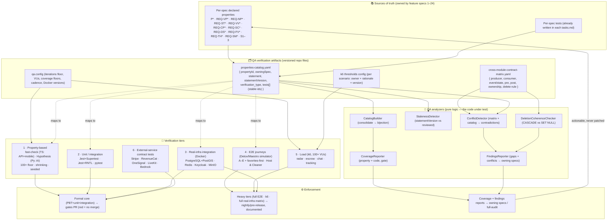
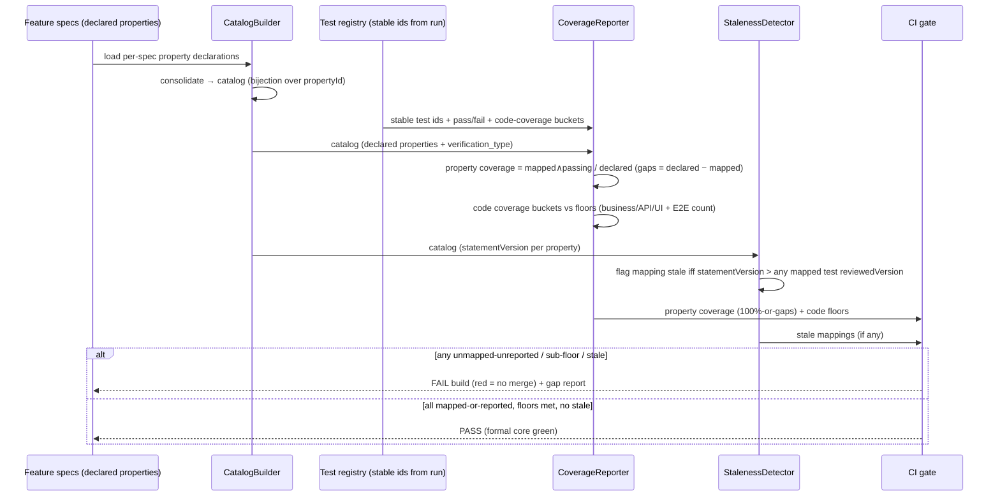
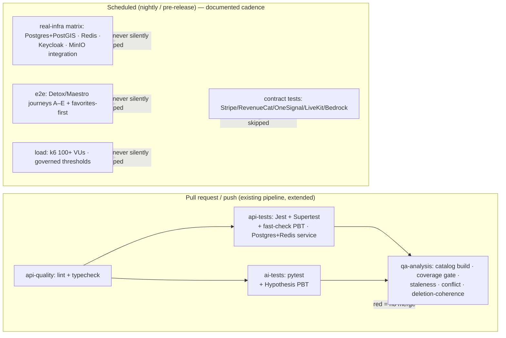

# Design Document: Quality Assurance & Property-Based Testing (PBT)

## Overview

`quality-assurance-pbt` (Spec 25, Sprint 7 — QA & Formal Testing) is the platform's **system-wide quality gate**. It depends on **all specs (1–24)** and is not a product feature: it adds test suites, harnesses, fixtures, a properties catalog, a cross-module contract matrix, conflict/gap reporting, and CI wiring. **It changes no product behavior.** Where a test surfaces a real defect, the fix belongs to the *owning* feature (and its spec); this module owns the *verification*, the feature specs own the *behavior*.

Its guarantee is bounded and defensible — not "the whole system is proven correct." What it guarantees is: (a) every *declared* correctness property maps to at least one executable test and those pass to the coverage this spec defines; (b) the defined E2E journeys pass; (c) the configured tiers (PBT / integration / load) meet their thresholds; and (d) uncovered behavior, cross-spec contradictions, and verification limits are *reported* — never silently "fixed" by inventing behavior.

The design is anchored on six hard rules that mirror the requirements' authority split and non-goals:

1. **The feature spec is authoritative for its behavior + properties.** QA references and executes them; it never redefines an invariant. A discrepancy between a property test and a spec is resolved by fixing the code or the spec (or filing a gap), never by weakening the test to pass.
2. **The correctness-properties catalog is the single index QA verifies against.** Every spec's declared properties (`P*`, `REQ-VP*`, `REQ-NP*`, `REQ-ST*`, `REQ-VV*`, `REQ-CP*`, `REQ-SC*`, `REQ-DS*`, `REQ-FV*`, `REQ-TH*`, `REQ-SM*`, plus Sprint 1–3) are consolidated into one traceable, versioned catalog. Every declared property maps to ≥1 executable test by **stable id**; an unmapped property is a *reported* coverage gap.
3. **Two coverage kinds, never conflated.** *Property coverage* (declared properties → passing tests, 100% mapped, gaps reported) and *code coverage* (business 90% / API 80% / critical UI 70% + 5 E2E flows) are separate metrics. Code-coverage floors never substitute for property coverage — a 95%-lines suite can still miss a concurrent-release/double-refund invariant.
4. **Real infra where it matters; contract-tested mocks where it must.** PostgreSQL(+PostGIS), Redis, Keycloak, and MinIO run real (Docker) for the paths that depend on them. Genuinely external/paid services (Stripe, RevenueCat, OneSignal, LiveKit, AWS Bedrock) are exercised via sandbox or **contract-tested** mocks (success / retry / duplicate / timeout / failure against documented provider responses) — never real production credentials, never real money.
5. **CI is the enforcement surface; heavy tiers run on a documented cadence.** The formal core (PBT + unit + integration) gates CI — a broken invariant fails the build. Full E2E, k6 load, and the full real-infra matrix run nightly/pre-release, documented, never silently skipped.
6. **Gaps and conflicts are reported, not patched.** Conflict detection runs against a versioned cross-module contract matrix + the property catalog; contradictions and PBT-discovered uncovered cases are reported (with minimal reproducers) to the owning specs. QA never chooses a behavior.

Because this is a verification module, the "design" below is the **architecture of the test tiers**, the **catalog data model**, the **contract matrix**, the **mock contract-testing approach**, the **CI/cadence topology**, the **directory/file layout of the harnesses**, and **how the QA system's own meta-properties (REQ-QA1…REQ-QA12) map to concrete mechanisms** — not new product tables or endpoints. The catalog + matrix are stored as versioned artifacts in the repo (not new database tables), because QA holds no product state and adds no runtime schema.

### Scope boundaries (what this module is NOT)

- **Not a second implementation.** No business logic lives here. A defect QA finds is fixed in the owning feature.
- **Not deployment/audit.** Verifying the *deployed* system is wired and live (running VPS, secrets present, services connected in production) is the separate `full-audit`/deployment-readiness concern. QA verifies *code correctness* against infra it stands up for testing.
- **Not secrets management.** Provisioning production credentials is `secrets-inventory`. QA uses only test/sandbox credentials.
- **Not a replacement for per-spec tests.** QA consolidates each feature's own tests, adds the system-wide PBT/E2E/load/conflict tiers, and enforces the catalog; it never deletes a feature's unit tests.

### Responsibility Matrix

| Responsibility | QA module (this spec) | Owning feature spec (1–24) | CI (GitHub Actions) | Codemagic (mobile) | `full-audit` / `secrets-inventory` |
|---|:---:|:---:|:---:|:---:|:---:|
| Declare a correctness property / behavior | ❌ | ✅ (source of truth) | ❌ | ❌ | ❌ |
| Consolidate properties into the catalog | ✅ | ❌ | ❌ | ❌ | ❌ |
| Map property → executable test (stable id) | ✅ | ✅ (writes its own tests) | ❌ | ❌ | ❌ |
| Detect stale mappings (statementVersion) | ✅ | ❌ | ✅ (runs check) | ❌ | ❌ |
| Report property vs code coverage (2 metrics) | ✅ | ❌ | ✅ (gate) | ❌ | ❌ |
| Author system-wide PBT (fast-check / Hypothesis) | ✅ | ✅ (per-module) | ❌ | ❌ | ❌ |
| Real-infra integration harness (Docker) | ✅ | ❌ | ✅ (nightly matrix) | ❌ | ❌ |
| Contract-test external-service mocks | ✅ | ❌ | ❌ | ❌ | ❌ |
| E2E journeys (Detox/Maestro) | ✅ | ❌ | ❌ | ✅ (runs simulator) | ❌ |
| k6 load scenarios + governed thresholds | ✅ | ❌ | ✅ (nightly) | ❌ | ❌ |
| Cross-module conflict / ambiguity detection | ✅ | ❌ | ✅ (runs check) | ❌ | ❌ |
| Fix a defect QA surfaces | ❌ | ✅ | ❌ | ❌ | ❌ |
| Verify deployed/live wiring, prod secrets | ❌ | ❌ | ❌ | ❌ | ✅ |

### Authority split (kept strict)

- **The feature specs own behavior + properties.** QA executes them; a test never overrides a spec.
- **The catalog + contract matrix are QA's verification artifacts** (versioned files), the single index/graph QA checks against.
- **CI is the enforcement surface.** The formal core gates merges; heavy tiers run on cadence.
- **Owning specs (and `full-audit`) receive the findings.** Conflicts/gaps flow back as actionable reports, never discarded.

This design maps every requirement and QA meta-property (REQ-QA1 … REQ-QA12) to concrete, verifiable properties **PQA1 … PQA14** (below), each backed by tests.

## Research & Key Decisions

Research was conducted against the existing repo (the 24 specs' design docs, the CI workflow, the steering rules) and the declared testing stack (fixed by the plan, not re-chosen here). Key findings that inform the design:

- **The stack is already chosen** — `fast-check` (TS), `hypothesis` (Py), Jest + Supertest (API), Jest + RNTL (mobile), pytest (AI), Detox/Maestro (E2E), k6 (load), Docker for real infra. This spec wires them into tiers, it does not select new tools. ([fast-check](https://fast-check.dev/) supports a configurable `numRuns` and automatic shrinking; [Hypothesis](https://hypothesis.readthedocs.io/) supports `@settings(max_examples=…)`, `derandomize`/explicit seeds, and typed strategies; [k6](https://k6.io/docs/using-k6/thresholds/) supports per-scenario `thresholds` as pass/fail gates. Content rephrased for compliance with licensing restrictions.)
- **The catalog and contract matrix are best stored as versioned repo artifacts**, not product DB tables. QA must add no runtime schema (Rule 1 / non-goal: no product state). YAML/JSON files under the QA package are diff-reviewable, CI-loadable, and carry `statementVersion` for staleness detection.
- **Determinism-by-seed is a first-class requirement** across both PBT libraries; both support recording and replaying a failing seed. The harness must inject the clock, RNG, and provider seams so time/randomness/external calls are controlled (no `Date.now()`/`Math.random()`/live network inside test logic).
- **The existing CI (`.github/workflows/ci.yml`)** already runs API lint/typecheck, API tests (with a Dockerized `postgis/postgis:16-3.4` + `redis:7-alpine` service), and AI pytest. The formal-core additions must fit this pipeline; the AI Hypothesis PBT extends the existing `ai-tests` job; the heavy tiers (full E2E, k6, full real-infra matrix incl. Keycloak + MinIO) become **separate scheduled workflows** so the green-HEAD, fast-PR rule is preserved.
- **A "faithful mock" is not one that returns `200`.** Each external-service mock must be contract-tested against recorded provider response/event fixtures across success/retry/duplicate/timeout/failure, so a mock cannot pass while the real provider would diverge (the review's explicit requirement, REQ-QA5).

## Architecture

### Test-tier topology



### Data flow — catalog build, coverage, and gate (formal core, every PR)



### Data flow — conflict & ambiguity analysis (over the versioned artifacts)

```mermaid
sequenceDiagram
    participant Matrix as cross-module-contract-matrix
    participant Catalog as properties-catalog
    participant Conflict as ConflictDetector
    participant Lifecycle as DeletionCoherenceChecker
    participant PBT as PBT run (uncovered-case discovery)
    participant Reporter as FindingsReporter
    participant Owner as Owning spec / full-audit

    Matrix->>Conflict: contracts { producer, consumer, event/state, pre, post, ownership, delete-rule }
    Catalog->>Conflict: declared properties (per owning spec)
    Conflict->>Conflict: find pairs that cannot both hold (post⊥pre, contradictory delete-rule, overlapping incompatible invariants)
    Matrix->>Lifecycle: delete-rule column + FK metadata
    Lifecycle->>Lifecycle: user-owned ⇒ CASCADE-from-users; shared-history ⇒ SET NULL; flag mismatch
    PBT->>Reporter: uncovered case { minimal reproducer, seed, owningSpec }
    Conflict->>Reporter: contradiction { specs, properties/contracts, reproducer }
    Lifecycle->>Reporter: coherence violation { relation, expected, actual }
    Reporter->>Reporter: build actionable report (specs + properties + reproducer; NO prescribed behavior; no drop)
    Reporter->>Owner: route every finding to its owning spec (and full-audit where relevant)
    Note over Reporter,Owner: QA never resolves by inventing behavior
```

### CI / cadence topology



- The **formal core** (`api-tests` incl. fast-check, `ai-tests` incl. Hypothesis, and the new `qa-analysis` job) runs on every PR/push and **gates the build** (REQ-QA10). It extends the existing `api-quality` → `api-tests` / `ai-tests` jobs without breaking green-HEAD (REQ 7.4).
- The **heavy tiers** run as **separate scheduled workflows** (nightly + a pre-release trigger). Standing up Keycloak + MinIO, running Detox/Maestro on a simulator, and driving k6 at 100+ VUs is too slow for every commit; the cadence is documented in the QA README and the workflow files, never silently skipped (REQ-QA10).

## Components and Interfaces

The QA harnesses live in a dedicated package plus per-service test suites. No product module is modified; QA imports product code **read-only** (for PBT/integration) and never imports a product write-path into its own logic (REQ-QA11 / non-goal).

### Package layout (`packages/qa/`)

```
packages/qa/
├── package.json
├── README.md                                  # QA overview, catalog location, tiers, cadence
├── src/
│   ├── qa.config.ts                           # ALL tunables from env/constants (no magic numbers)
│   ├── config/
│   │   └── validate-qa-config.ts              # fail-fast validateQaConfig()
│   ├── catalog/
│   │   ├── properties-catalog.yaml            # the consolidated, versioned catalog (source artifact)
│   │   ├── catalog.types.ts                   # PropertyEntry, VerificationType, CatalogError
│   │   ├── catalog-builder.ts                 # consolidate per-spec declarations → catalog (bijection)
│   │   ├── catalog-loader.ts                  # parse + schema-validate the YAML
│   │   └── staleness-detector.ts              # statementVersion vs mapped-test reviewedVersion
│   ├── coverage/
│   │   ├── coverage-reporter.ts               # property coverage + code coverage (two metrics)
│   │   └── coverage-gate.ts                    # pass/fail against floors (pure predicate)
│   ├── contract-matrix/
│   │   ├── cross-module-contract-matrix.yaml  # the versioned contract matrix (source artifact)
│   │   ├── matrix.types.ts                     # Contract, DeleteRule, Ownership
│   │   ├── conflict-detector.ts                # matrix + catalog → contradictions
│   │   └── deletion-coherence-checker.ts       # CASCADE user-owned vs SET NULL shared-history
│   ├── findings/
│   │   ├── findings.types.ts                   # Finding (gap|conflict|coherence), Report
│   │   └── findings-reporter.ts                # actionable report, routed, no invented behavior, no drop
│   ├── generators/                             # SHARED typed fast-check arbitraries (reused across suites)
│   │   ├── money.arbitraries.ts                # integer minor units, currencies
│   │   ├── geo.arbitraries.ts                  # lat/lng, radius, PostGIS points
│   │   ├── identity.arbitraries.ts             # users, roles, participant pairs
│   │   ├── offer.arbitraries.ts                # offers, negotiation states, phases
│   │   └── time-seed.ts                        # injected clock + seed helpers (determinism)
│   ├── harness/
│   │   ├── docker-compose.qa.yml               # Postgres+PostGIS · Redis · Keycloak · MinIO (versions from config)
│   │   ├── infra-bootstrap.ts                  # bring up / tear down real infra, idempotent
│   │   └── seam/                               # injectable clock / rng / provider seams
│   │       ├── clock.ts
│   │       └── rng.ts
│   ├── mocks/                                  # CONTRACT-TESTED external-service mocks
│   │   ├── stripe/                             # fixtures + mock + contract test (webhooks: success/retry/dup/timeout/fail)
│   │   ├── revenuecat/                         # entitlement/event fixtures + contract test
│   │   ├── onesignal/                          # delivery-callback fixtures + contract test
│   │   ├── livekit/                            # call-lifecycle webhook fixtures + contract test
│   │   └── bedrock/                            # AI-response fixtures + contract test
│   └── reports/                                # generated: coverage.json, findings.json, load-baselines/
├── e2e/                                        # Detox/Maestro journeys (mobile simulator)
│   ├── journey-a.registration-kyc-offer.e2e.ts
│   ├── journey-b.offer-negotiation-escrow.e2e.ts
│   ├── journey-c.escrow-service-completion-release.e2e.ts
│   ├── journey-d.dispute-resolution-escrow.e2e.ts
│   ├── journey-e.subscription-pro.e2e.ts
│   ├── journey-favorites-first.e2e.ts
│   └── support/                                # per-journey fixtures, independent setup, i18n parity helpers
├── load/                                       # k6 scenarios + governed thresholds
│   ├── thresholds.yaml                         # per-scenario { owner, rationale, version, thresholds }
│   ├── radar-delivery.k6.js
│   ├── escrow-charge.k6.js
│   ├── chat-throughput.k6.js
│   ├── tracking-ingest.k6.js
│   └── contention/                             # single-winner/idempotency stress (accept/release/favorite)
└── __tests__/                                  # PBT + unit tests for the QA logic itself (PQA1–PQA14)
```

The Python (AI) PBT lives with the AI service (`services/ai/tests/pbt/` using Hypothesis) so it runs under the existing `ai-tests` Poetry/pytest job; the catalog references those tests by stable id. Mobile PBT lives with the mobile suite (`apps/mobile/**/__tests__/pbt/` using fast-check + RNTL) and runs under Codemagic + local verification.

### `CatalogBuilder` — consolidate declarations into one traceable index

```typescript
type VerificationType = 'PBT' | 'unit' | 'integration' | 'E2E';

interface PropertyEntry {
  propertyId: string;            // e.g. 'REQ-DS6', 'P3', 'REQ-ST4' — globally unique
  owningSpec: string;            // e.g. 'dispute-system'
  statement: string;            // the invariant text
  statementVersion: number;      // bumped by the owning spec when the statement changes
  verificationType: VerificationType;
  tests: StableTestId[];         // ≥1 required, or the property is a reported gap
  tags?: string[];               // e.g. 'high-risk:single-winner', 'module:escrow'
}

interface CatalogBuilder {
  // Pure: a set of per-spec declarations → a catalog keyed by propertyId (bijection: no loss, no dup).
  build(declarations: PropertyDeclaration[]): { catalog: Catalog; errors: CatalogError[] };
  // Duplicate propertyId or missing required field → CatalogError (never a silent drop/overwrite).
}
```

- One entry per `propertyId` (bijection); a duplicate id or a missing required field is a `CatalogError`, never silently merged or dropped (**PQA1**).
- Loaded from `properties-catalog.yaml` via `catalog-loader.ts`, which schema-validates every entry (enum-valid `verificationType`, non-empty `tests` unless explicitly gap-tagged).

### `CoverageReporter` + `CoverageGate` — two independent metrics, one gate

```typescript
interface CoverageReport {
  property: {
    declared: number;
    mappedPassing: number;                 // mapped to ≥1 passing test of its verificationType
    gaps: PropertyGap[];                   // declared − mappedPassing, each with owningSpec
    fullyMapped: boolean;                  // gaps.length === 0
  };
  code: {
    businessLogicPct: number;              // floor from config (90%)
    apiPct: number;                        // floor (80%)
    criticalUiPct: number;                 // floor (70%)
    e2eFlowCount: number;                  // floor (5)
  };
  // Invariant: `property` is derived ONLY from mapping/pass state; `code` ONLY from the runner.
}

interface CoverageGate {
  // Pure predicate. Passes iff property fully-mapped-or-gaps-reported AND every code floor met.
  // Code coverage NEVER substitutes for property coverage.
  evaluate(report: CoverageReport, floors: CoverageFloors): GateResult;
}
```

- Property coverage and code coverage are computed from disjoint inputs and both appear in the report (**PQA10**). The gate fails on any unmapped-unreported property, any sub-floor code bucket, or fewer than the configured E2E flow count.

### `StalenessDetector` — traceability integrity, not just link presence

```typescript
interface StalenessDetector {
  // A mapping is STALE iff the property's statementVersion is newer than the
  // reviewedVersion recorded on any of its mapped tests (the test may no longer verify the current statement).
  detect(catalog: Catalog, reviews: TestReview[]): StaleMapping[];
}
```

- If a property's `statement`/`statementVersion` advances in its owning spec without a matching test review bump, the mapping is flagged **stale** and CI reports/fails — so a property can never appear "covered" by a test that no longer verifies its current definition (**PQA3**, REQ-QA1).

### `ConflictDetector` — sound + complete over the matrix + catalog

```typescript
interface Contract {
  producer: string; consumer: string;
  eventOrState: string;
  precondition: string; postcondition: string;
  ownership: string;
  deleteRule: 'CASCADE' | 'SET_NULL' | 'RESTRICT' | 'NONE';
  version: number;
}

interface ConflictDetector {
  // Flags exactly the pairs of contracts/requirements that cannot both hold:
  //  - a producer postcondition that contradicts a consumer precondition,
  //  - two contracts asserting incompatible delete-rules on the same relation,
  //  - two catalog properties whose invariants are mutually unsatisfiable on a shared entity.
  detect(matrix: Contract[], catalog: Catalog): Contradiction[];   // [] on a consistent matrix (no false positives)
}
```

- Deterministic analysis over defined artifacts (not an unspecified "check"): a seeded contradiction is always detected and localized to the exact pair; a consistent matrix yields none (**PQA8**, REQ-QA9). The matrix covers at least: offer↔negotiation↔escrow, service-tracking↔completion↔dispute, subscription↔commission↔favorites↔ads, notifications↔lifecycle/delete, chat↔calls↔account-deletion.

### `DeletionCoherenceChecker` — CASCADE user-owned vs SET NULL shared-history

```typescript
interface DeletionCoherenceChecker {
  // Classifies each relation (user-owned | shared-history) and asserts its delete rule matches policy:
  //   user-owned (favorites, notifications) ⇒ CASCADE from users
  //   shared-history (chat, calls, completions, disputes, tracking) ⇒ SET NULL
  // Flags exactly the relations whose declared/actual rule ≠ policy-expected.
  check(matrix: Contract[], fkMetadata: FkMetadata[]): CoherenceViolation[];
}
```

- Verifies the deliberate cross-spec deletion policy holds consistently, reading the matrix's `deleteRule` column and (in the real-infra tier) the actual FK metadata (**PQA9**, REQ 6.4).

### `FindingsReporter` — actionable, routed, never patched, never dropped

```typescript
type Finding =
  | { kind: 'gap'; owningSpec: string; propertyId?: string; reproducer: Reproducer }
  | { kind: 'conflict'; specs: string[]; contractIds: string[]; reproducer?: Reproducer }
  | { kind: 'coherence'; owningSpec: string; relation: string; expected: string; actual: string };

interface FindingsReporter {
  // Every finding → a well-formed report addressed to its owning spec (and full-audit where relevant).
  // The report carries specs + property/contract ids + minimal reproducer + seed.
  // It NEVER carries a prescribed-behavior/resolution field, and NEVER drops a finding.
  report(findings: Finding[]): { reports: FindingReport[] };      // reports.length === findings.length
}
```

- Every gap (from PBT uncovered-case discovery or an unmapped property) and every conflict/coherence violation becomes an actionable report routed to the owning spec, carrying the minimal reproducer + seed and no invented behavior; the reporter emits one report per finding (no silent drop) (**PQA7**, REQ 2.6/6.2/6.3/6.5).

### Contract-tested external-service mocks (`packages/qa/src/mocks/`)

Each provider mock ships with recorded contract **fixtures** (the documented provider responses/events the app actually consumes) and a **contract test** that runs the mock across the required response classes and validates the emitted shape against the fixture schema, then drives the app consumer to the expected state:

| Provider | Consumed surface | Response classes contract-tested |
|---|---|---|
| Stripe | PaymentIntent / Transfer / Refund / Reversal + `charge.dispute.*`, `payment_intent.*`, `transfer.*`, `account.updated` webhooks | success · retry · **duplicate** · timeout · failure |
| RevenueCat | entitlement state + subscription lifecycle events | success · retry · duplicate · timeout · failure |
| OneSignal | send + delivery callbacks | success · retry · duplicate · timeout · failure |
| LiveKit | room/token + call-lifecycle webhooks | success · retry · duplicate · timeout · failure |
| AWS Bedrock | AI request/response (the only cloud service) | success · retry · duplicate · timeout · failure |

A mock cannot pass while diverging from the recorded provider contract (**PQA11**, REQ-QA5). No mock uses real credentials, a live endpoint, or moves real money.

### E2E journey registry (`packages/qa/e2e/`)

Each journey is an **independently-runnable** target with its own fixtures (no cross-journey ordering dependency); a shared setup layer MAY chain them for a full smoke run, but each also runs alone so a failure localizes to a stage (REQ-QA12).

| Journey | Flow | Roles | Notes |
|---|---|---|---|
| A | registration → KYC → publish offer | Host, Cleaner | KYC via Keycloak + sandbox |
| B | offer → negotiation → escrow | Host, Cleaner | escrow via Stripe sandbox/mock |
| C | escrow → service (tracking → arrival verification → checklist) → completion → release | Host, Cleaner | full service lifecycle |
| D | dispute → resolution → escrow effect | Host, Cleaner | incl. auto-release (no confirmation → auto-release) |
| E | subscription → PRO entitlement | Host, Cleaner | PRO commission / favorites-unlimited / ad-free via RevenueCat sandbox |
| Favorites-first | favorites-first offer delivery | Host, Cleaner | favorites priority path |

Each journey documents which flow it verifies; the registry size must meet or exceed the configured `E2E_MIN_FLOWS` (5). i18n-bearing screens assert `en`/`es` parity where the owning spec requires it (**PQA14**, REQ 8.4).

### k6 load scenarios + governed thresholds (`packages/qa/load/`)

`thresholds.yaml` holds, **per scenario**, a versioned entry `{ owner, rationale, version, thresholds }`; each scenario runs at ≥ `K6_MIN_VUS` (100) VUs against the Dockerized non-prod environment:

| Scenario | Hot path | Contention stress |
|---|---|---|
| radar-delivery | offer radar delivery / expansion | — |
| escrow-charge | escrow charge on match | concurrent offer accepts (single-winner) |
| chat-throughput | chat message throughput | — |
| tracking-ingest | service-tracking position ingest | — |
| contention/release | escrow release triggers | concurrent release (single release per payment) |
| contention/favorite | favorite adds | concurrent favorite adds (idempotent) |

Thresholds are pass/fail gates governed by config with an explicit owner + rationale — this spec does not fix the numbers, it requires they be governed and versioned (**PQA12**, REQ 5.2). Results are emitted to `reports/load-baselines/` keyed by scenario + version so a comparator flags regressions across runs (REQ 5.5).

## Data Models

QA adds **no product database tables** and **no runtime schema** — it holds no product state (Rule 1 / non-goal). Its "data models" are the versioned artifacts it verifies against and the report artifacts it emits. Where the real-infra tier needs a database, it uses the **owning specs' migrations** against a throwaway Dockerized PostgreSQL, not schema of its own.

### The properties catalog (`properties-catalog.yaml`) — the single verification index

Consolidates every declared property (REQ-QA1). One entry per `propertyId`:

```yaml
# properties-catalog.yaml  (versioned; the single index QA verifies against)
- propertyId: "REQ-DS6"
  owningSpec: "dispute-system"
  statement: "At most one financial effect per dispute (single-winner terminal + idempotent Spec 9)."
  statementVersion: 3
  verificationType: "PBT"
  tests:
    - "qa/pbt/dispute-system/single-financial-effect#P11"   # stable test id
  tags: ["high-risk:no-double-refund", "module:disputes"]

- propertyId: "P3"
  owningSpec: "stripe-escrow"
  statement: "Single charge per offer under any number of offer.matched deliveries."
  statementVersion: 1
  verificationType: "PBT"
  tests: ["qa/pbt/stripe-escrow/single-charge#P3"]
  tags: ["high-risk:idempotent-intent", "module:escrow"]

- propertyId: "REQ-ST4"
  owningSpec: "service-tracking"
  statement: "Server-authoritative geofence validation on arrival."
  statementVersion: 2
  verificationType: "integration"
  tests: ["qa/integration/service-tracking/geofence-arrival"]
  tags: ["high-risk:server-authoritative", "module:service-tracking"]
```

| Field | Type | Notes |
|---|---|---|
| `propertyId` | string | globally unique across all specs (`P*`/`REQ-*`/`S1–3`); the catalog key |
| `owningSpec` | string | the feature spec that owns the behavior + property (authoritative) |
| `statement` | string | the invariant text (human-readable) |
| `statementVersion` | integer | bumped by the owning spec when the statement changes; drives staleness |
| `verificationType` | enum | `PBT` \| `unit` \| `integration` \| `E2E` — how the property is verified |
| `tests` | string[] | ≥1 **stable test id**; empty ⇒ reported coverage gap |
| `tags` | string[]? | high-risk class + module for required-subset checks |

Coverage rule: every declared property maps to ≥1 executable test of its `verificationType`; an unmapped property is a reported gap, never silently omitted (REQ-QA1). A test review record carries `{ testId, reviewedStatementVersion }` for staleness.

### The cross-module contract matrix (`cross-module-contract-matrix.yaml`) — conflict-detection input

An explicit, versioned artifact; one row per inter-module contract (REQ 6.1):

```yaml
# cross-module-contract-matrix.yaml  (versioned)
- producer: "offer-negotiation"
  consumer: "stripe-escrow"
  eventOrState: "offer.matched"
  precondition: "offer.state == MATCHED && agreedPrice resolved"
  postcondition: "exactly one payment charged for the offer"
  ownership: "escrow owns money; offer owns lifecycle"
  deleteRule: "RESTRICT"            # payments.offer_id ON DELETE RESTRICT
  version: 1

- producer: "users"
  consumer: "favorites"
  eventOrState: "user deletion"
  precondition: "favorite owned by the deleted user"
  postcondition: "favorite row removed"
  ownership: "favorites is user-owned data"
  deleteRule: "CASCADE"             # user-owned ⇒ CASCADE from users
  version: 1

- producer: "users"
  consumer: "realtime-chat"
  eventOrState: "user deletion"
  precondition: "message authored by the deleted user"
  postcondition: "message retained; author nulled"
  ownership: "chat is shared history"
  deleteRule: "SET_NULL"            # shared-history ⇒ SET NULL
  version: 1
```

| Field | Type | Notes |
|---|---|---|
| `producer` / `consumer` | string | the two modules bound by the contract |
| `eventOrState` | string | the event or shared state crossing the boundary |
| `precondition` / `postcondition` | string | what must hold before/after; conflict detection compares producer post vs consumer pre |
| `ownership` | string | which module owns the entity (authority) |
| `deleteRule` | enum | `CASCADE` \| `SET_NULL` \| `RESTRICT` \| `NONE` — checked for lifecycle coherence |
| `version` | integer | versioned so matrix changes are diff-reviewable |

### The QA config (`qa.config.ts`) — all tunables, no magic numbers

Every tunable comes from env/constants and is validated fail-fast (REQ-QA11 / REQ 8.1). No iteration count, VU count, coverage floor, cadence schedule, or Docker version is a literal in test logic.

| Tunable | Meaning |
|---|---|
| `PBT_MIN_ITERATIONS_FLOOR` | the 100+ floor for every property-based test (per-property override may raise it, never lower) |
| `PBT_HIGH_RISK_ITERATIONS` | higher default for high-risk state machines (escrow/disputes/concurrency/idempotency) |
| `PBT_SHRINKING_ENABLED` | shrinking on (always true; validated) |
| `K6_MIN_VUS` | minimum virtual users per hot-path scenario (100) |
| `COVERAGE_FLOOR_BUSINESS` / `_API` / `_CRITICAL_UI` | code-coverage floors (90 / 80 / 70) |
| `E2E_MIN_FLOWS` | minimum critical E2E flows (5) |
| `CADENCE_HEAVY_TIERS` | schedule descriptor for nightly/pre-release heavy tiers |
| `DOCKER_POSTGRES_VERSION` / `_REDIS_` / `_KEYCLOAK_` / `_MINIO_` | pinned Docker image versions for the real-infra tier |
| `PROVIDER_SANDBOX_MODE` | forces sandbox/mock for all external providers (no prod keys, no real money) |

### Report artifacts (generated, `packages/qa/src/reports/`)

- `coverage.json` — the two coverage metrics (property + code) + gate result.
- `findings.json` — every gap / conflict / coherence violation, addressed to its owning spec (never dropped, no prescribed behavior).
- `load-baselines/{scenario}@{version}.json` — comparable k6 results per run for regression detection.

### TypeScript enums / types (`catalog.types.ts`, `matrix.types.ts`, `findings.types.ts`)

```typescript
export enum VerificationType { PBT = 'PBT', UNIT = 'unit', INTEGRATION = 'integration', E2E = 'E2E' }
export enum DeleteRule { CASCADE = 'CASCADE', SET_NULL = 'SET_NULL', RESTRICT = 'RESTRICT', NONE = 'NONE' }
export enum FindingKind { GAP = 'gap', CONFLICT = 'conflict', COHERENCE = 'coherence' }
export enum RelationClass { USER_OWNED = 'user-owned', SHARED_HISTORY = 'shared-history' }
export enum ResponseClass { SUCCESS = 'success', RETRY = 'retry', DUPLICATE = 'duplicate', TIMEOUT = 'timeout', FAILURE = 'failure' }
export enum ExternalProvider { STRIPE = 'stripe', REVENUECAT = 'revenuecat', ONESIGNAL = 'onesignal', LIVEKIT = 'livekit', BEDROCK = 'bedrock' }
```

## Correctness Properties

*A property is a characteristic or behavior that should hold true across all valid executions of a system — essentially, a formal statement about what the system should do. Properties serve as the bridge between human-readable specifications and machine-verifiable correctness guarantees.*

These are the **meta-properties of the QA system itself** (REQ-QA1 … REQ-QA12): its tests verify the *product's* declared properties, and these ensure the QA is *honest* — that coverage is complete-or-reported, mappings are not stale, findings are reported not patched, and the harness is deterministic and standards-compliant. The code under test is the QA logic layer: the catalog builder, coverage reporter, staleness detector, conflict detector, deletion-coherence checker, findings reporter, iteration resolver, mock contract-tests, and config validator — all pure or seam-isolated functions over a large input space, so PBT is the right tool. Infrastructure wiring (real-Docker connectivity), specific E2E journeys, CI gating semantics, secrets/standards enforcement, and the authority policy (spec-wins) are verified by integration / E2E / config / lint / process and recorded with those `verificationType`s in the catalog — not forced into generation.

Redundant candidates from the prework were consolidated: the "required set ⊆ mapped catalog" checks (declared coverage, high-risk-invariant subset, per-module subset) collapse into one **coverage partition** property (PQA2); the gap/conflict/coherence reporter shape + routing + no-invented-behavior + no-drop collapse into one **findings reporter** property (PQA7); determinism-by-seed + isolation/order-independence + controlled seams collapse into one **determinism** property (PQA6); the two-metrics separation + the coverage gate collapse into one **coverage** property (PQA10).

### Property 1: [PQA1] Catalog is a lossless bijection over propertyId

*For any* set of per-spec property declarations (arbitrary `propertyId`s, `owningSpec`s, `statementVersion`s, and `verificationType`s), the `CatalogBuilder` SHALL produce a catalog with **exactly one entry per `propertyId`** — no declared property dropped, none duplicated, `owningSpec`/`statement`/`statementVersion`/`verificationType` preserved — and a duplicate `propertyId` or a missing required field SHALL surface as an explicit `CatalogError`, never a silent merge, overwrite, or omission.

**Validates: Requirements 1.1** · REQ-QA1

### Property 2: [PQA2] Complete coverage partition (mapped ∪ gap = declared, disjoint), including required subsets

*For any* catalog and *for any* registry of stable test ids, every declared property SHALL be either **mapped** (≥1 live test id of its `verificationType`) or **reported as a gap** — `mapped ∪ gaps == declared` and `mapped ∩ gaps == ∅`; no declared property is ever silently absent from both. In particular, *for any* configured required subset — the high-risk invariant set (single-winner, no-double-pay/refund, idempotent intents, server-authoritative validation, stale-safe attempts, tier/limit enforcement, ordering/idempotency) and the per-module set (all 22 named modules) — every member SHALL appear in the catalog with `verificationType = PBT` and a mapped test, or be reported as a gap.

**Validates: Requirements 1.2, 2.4, 2.5** · REQ-QA1, REQ-QA6

### Property 3: [PQA3] Staleness detection on statementVersion

*For any* property and *for any* set of `reviewedStatementVersion`s recorded on its mapped tests, the `StalenessDetector` SHALL flag the mapping **stale if and only if** the property's current `statementVersion` is greater than the `reviewedStatementVersion` of any mapped test — a property whose statement changed without a corresponding test review SHALL never appear "covered," and a mapping whose reviews are all current SHALL never be falsely flagged.

**Validates: Requirements 1.3** · REQ-QA1

### Property 4: [PQA4] verification_type integrity and correct runner language

*For any* catalog entry, its `verificationType` SHALL be a member of `{ PBT, unit, integration, E2E }`, each of its mapped tests SHALL be of that kind, and *for any* entry with `verificationType = PBT`, the mapped test's declared runner SHALL match the owning spec's language (TypeScript ⇒ `fast-check`, Python ⇒ `hypothesis`) — a property SHALL never be recorded with an out-of-enum type, mapped to a test of the wrong kind, or PBT-verified with the wrong library.

**Validates: Requirements 2.1, 2.7** · REQ-QA3

### Property 5: [PQA5] Iteration floor honored, configurable upward, shrinking always on

*For any* per-property iteration configuration, the iteration resolver SHALL yield an effective count **≥ `PBT_MIN_ITERATIONS_FLOOR` (100)** and SHALL never disable shrinking; a per-property/risk override MAY raise the count (e.g. for escrow/dispute/concurrency/idempotency state machines) but a configured value below the floor SHALL be rejected or clamped up per policy, never run below the floor.

**Validates: Requirements 2.2, 2.7** · REQ-QA3

### Property 6: [PQA6] Deterministic by seed, isolated, order-independent

*For any* seed, running a given deterministic property harness twice with that seed SHALL produce the identical outcome — the same pass/fail and, on failure, the same minimal (shrunk) counterexample — and a recorded failing seed SHALL re-fail; and *for any* ordering or subset of a representative integration slice, the final state SHALL be reset to baseline by idempotent teardown so results are **order-independent** (no flaky-by-design tests). Time, randomness, and external calls SHALL be taken from injected seams (clock/RNG/provider), never from direct `Date.now()`/`Math.random()`/live network inside test logic.

**Validates: Requirements 2.3, 3.5, 7.5** · REQ-QA4

### Property 7: [PQA7] Findings are actionable, routed, never invent behavior, never dropped

*For any* set of findings (a PBT-discovered uncovered case, a detected conflict, or a deletion-coherence violation), the `FindingsReporter` SHALL emit **exactly one report per finding** (no silent drop), each addressed to its owning spec (and to `full-audit` where relevant), carrying the involved specs + property/contract ids + the minimal reproducer and seed, and SHALL **never** include a prescribed-behavior/resolution field — QA reports the gap/conflict, it never chooses a behavior to make a test pass.

**Validates: Requirements 2.6, 6.2, 6.3, 6.5** · REQ-QA2, REQ-QA9

### Property 8: [PQA8] Conflict detection is sound and complete over the matrix + catalog

*For any* cross-module contract matrix + property catalog, the `ConflictDetector` SHALL flag a pair as conflicting **if and only if** the two cannot both hold — a producer postcondition contradicting a consumer precondition, two contracts asserting incompatible delete-rules on the same relation, or two catalog invariants mutually unsatisfiable on a shared entity — identifying the exact conflicting pair; a matrix seeded with a deliberate contradiction SHALL always be detected, and a consistent matrix SHALL yield **no** flags (no false positives).

**Validates: Requirements 6.1** · REQ-QA9

### Property 9: [PQA9] Deletion/lifecycle coherence across specs

*For any* set of relations classified `user-owned` or `shared-history` with their declared/actual delete rules, the `DeletionCoherenceChecker` SHALL flag **exactly** those whose rule violates the policy — `user-owned` (favorites, notifications) must be `CASCADE` from `users`; `shared-history` (chat, calls, completions, disputes, tracking) must be `SET NULL` — and a policy-consistent set SHALL yield no flags.

**Validates: Requirements 6.4** · REQ-QA9

### Property 10: [PQA10] Two independent coverage metrics and a floor gate; code never substitutes property

*For any* measured inputs (property mapping/pass state and per-bucket code coverage + E2E count), the reporter SHALL compute **property coverage from the mapping/pass state only** and **code coverage from the runner only** (the two are independent — changing one never moves the other), report both distinctly, and the gate SHALL pass **if and only if** property coverage is fully mapped (or every gap is reported) **and** every code-coverage bucket meets its floor **and** the E2E flow count meets its floor — a sub-floor bucket or an unmapped-unreported property SHALL fail the gate, and code-coverage floors SHALL never substitute for property coverage.

**Validates: Requirements 1.4, 7.3** · REQ-QA1b, REQ-QA10

### Property 11: [PQA11] External-service mocks conform to the recorded provider contract

*For any* external provider (Stripe, RevenueCat, OneSignal, LiveKit, Bedrock) and *for any* response class in `{ success, retry, duplicate, timeout, failure }`, the mock's emitted response/event SHALL validate against the recorded provider-contract fixture schema for that class, and the application consumer SHALL reach the correct state — so a mock SHALL never pass while the real provider would behave differently — and no contract test SHALL use a real credential, a live endpoint, or move real money.

**Validates: Requirements 3.4** · REQ-QA5

### Property 12: [PQA12] k6 thresholds are governed (per-scenario, owned, rationalized, versioned)

*For any* k6 scenario configuration, the threshold validator SHALL accept it **if and only if** every hot-path scenario declares ≥ `K6_MIN_VUS` (100) virtual users and ≥1 pass/fail threshold, and **every** threshold entry carries a non-empty `owner`, `rationale`, and `version` — an ad-hoc threshold (missing owner/rationale/version) or a below-floor VU count SHALL be rejected. This spec does not fix the numbers; it requires they be governed.

**Validates: Requirements 5.2** · REQ-QA12

### Property 13: [PQA13] Config safety — all tunables validated, no magic numbers

*For any* QA configuration map, `validateQaConfig()` SHALL accept it **if and only if** every required tunable (PBT iteration floor, k6 VUs, coverage floors, cadence schedule, Docker image versions, provider-sandbox mode) is present and in range, and SHALL fail fast otherwise; and no iteration count, VU count, coverage floor, cadence value, or Docker version SHALL appear as an inline literal in test logic (all sourced from config/constants).

**Validates: Requirements 8.1** · REQ-QA11

### Property 14: [PQA14] i18n en/es parity in E2E where a spec requires it

*For any* i18n-bearing screen exercised in an E2E journey whose owning spec requires parity, and *for any* required translation key on that screen, both `en` and `es` SHALL resolve the key to a real translation (no missing key, no placeholder) — a missing or untranslated key SHALL fail the parity check.

**Validates: Requirements 8.4** · REQ-QA11

## Error Handling

QA "errors" are of two natures: (1) *findings* about the product (gaps, conflicts, coherence violations) — reported, never patched; and (2) *harness faults* (bad catalog, missing config, flaky infra) — surfaced fail-fast so CI stays trustworthy.

| Condition | Handling |
|---|---|
| Duplicate `propertyId` in declarations | `CatalogError`; catalog build fails fast — never a silent merge/overwrite (PQA1) |
| Declared property with no mapped test | Reported as a coverage **gap** (routed to the owning spec); gate fails unless the gap is acknowledged/reported per policy (PQA2, PQA10) |
| Property `statementVersion` advanced without test review | Mapping flagged **stale**; CI reports/fails — property not counted as covered (PQA3) |
| Catalog entry with out-of-enum `verificationType` / test of wrong kind | Schema validation error at load; build fails (PQA4) |
| PBT iteration config below the floor | Rejected or clamped up to `PBT_MIN_ITERATIONS_FLOOR`; never runs below 100 (PQA5) |
| PBT failure | Minimal (shrunk) counterexample + recorded seed emitted; re-runs deterministically from the seed (PQA6) |
| PBT surfaces a case no requirement covers | Filed as an **ambiguity/gap** against the owning spec with the minimal reproducer; QA does not invent a behavior (PQA7) |
| Conflict detected in the contract matrix | Reported as an actionable **conflict** (exact pair, specs, contracts, reproducer) to the owning specs; never auto-resolved (PQA7, PQA8) |
| Deletion-policy violation (CASCADE/SET NULL mismatch) | Reported as a **coherence** finding (relation, expected, actual) (PQA9) |
| Coverage below a code floor / property not fully mapped | Coverage **gate fails**; the two metrics reported distinctly (PQA10) |
| Mock diverges from the recorded provider contract | Contract test fails for that provider × response class; the mock cannot be used until it conforms (PQA11) |
| k6 threshold missing owner/rationale/version, or VUs < floor | Threshold-governance validation fails; the scenario cannot run un-governed (PQA12) |
| k6 scenario breaches a pass/fail threshold | Load run fails for that scenario; regression flagged vs the stored baseline (REQ 5.5) |
| Missing/invalid required QA config | `validateQaConfig()` throws (fail-fast) at startup (PQA13) |
| Real-infra container unavailable (Docker) in the heavy tier | The tier fails loudly (never silently skipped); PR formal core is unaffected (isolated to the scheduled workflow) (REQ-QA10) |
| Real credential / prod key / live endpoint detected in a test path | Safety check fails; test blocked — sandbox/mock only, no real money (REQ 8.2) |
| Integration test leaves residual state | Idempotent teardown resets to baseline; an order-dependent result is a harness fault to fix (PQA6) |
| Missing `en`/`es` translation on a parity-required E2E screen | Parity check fails (PQA14) |
| A test/property vs spec disagreement | Escalated to the owning spec (fix code or spec, or file a gap); the test is **never** weakened to pass (REQ-QA2 — process, not code) |

## Testing Strategy

Property-based testing **applies** to this feature: the QA logic layer (catalog builder, coverage reporter, staleness detector, conflict detector, deletion-coherence checker, findings reporter, iteration resolver, config + threshold validators, mock contract conformance) is a set of pure/seam-isolated functions over a large, structured input space (arbitrary property-declaration sets, test-id registries, `statementVersion`/`reviewedVersion` tuples, contract matrices with/without seeded contradictions, relation classifications, coverage inputs, provider response payloads per class, config maps). Universal properties (bijection, coverage partition, staleness predicate, verification-type integrity, iteration floor, determinism-by-seed, actionable-findings, conflict soundness+completeness, deletion coherence, two-metric independence + gate, mock contract conformance, threshold governance, config safety, i18n parity) are meaningfully quantified over inputs, so PBT is the right tool for the logic layer. Infrastructure connectivity, specific E2E journeys, CI gating semantics, and secrets/standards enforcement are verified by integration / E2E / config / lint / process.

The QA suite is itself dual (unit + property) and — like every module — its own tests are catalogued and mapped.

### Property-Based Tests (fast-check — TS; Hypothesis — Py)

Library: `fast-check` for the TypeScript QA logic (mirroring the sibling specs). Each of PQA1–PQA14 is implemented by a **single** property-based test, runs **minimum 100 iterations** (from `PBT_MIN_ITERATIONS_FLOOR`, raised for the heavier analyzers), uses shrinking, is seeded/deterministic, and is tagged with a comment: `// Feature: quality-assurance-pbt, Property N: <text>`. The AI-service PBT that this module *runs across the product* uses `hypothesis` with typed strategies under the `ai-tests` job; PQA1–PQA14 (verifying QA's own logic) are TypeScript/fast-check.

| Property | What to Generate | What to Assert |
|---|---|---|
| PQA1 Catalog bijection | Random declaration sets (dup ids, missing fields, varied specs/versions/types) | One entry per `propertyId`; no loss/dup; fields preserved; duplicate/missing → `CatalogError`, never silent merge |
| PQA2 Coverage partition + required subsets | Random catalogs × random test-id registries × required-subset configs | `mapped ∪ gaps == declared`, disjoint; every high-risk + per-module member mapped-or-reported; unmapped never silently absent |
| PQA3 Staleness detection | Random `(statementVersion, per-test reviewedVersion)` tuples | Stale iff current version > any mapped test's reviewed version; all-current never flagged |
| PQA4 verification_type integrity | Random catalogs × runner/language pairings | Type in enum; mapped tests of that kind; PBT ⇒ language-correct library (TS→fast-check, Py→hypothesis) |
| PQA5 Iteration floor | Random per-property iteration configs (below/at/above floor) | Resolved count ≥ floor; overrides raise but never lower; shrinking never disabled; below-floor rejected/clamped |
| PQA6 Determinism + isolation | Random seeds × random orderings/subsets of a representative slice | Same seed ⇒ identical outcome + identical shrunk counterexample; recorded failing seed re-fails; order-independent after idempotent teardown; seams injected (no direct clock/rng/network) |
| PQA7 Findings reporter | Random findings (gap/conflict/coherence) | One report per finding (no drop); addressed to owning spec (+full-audit); carries specs+ids+reproducer+seed; NO prescribed-behavior field |
| PQA8 Conflict soundness+completeness | Random contract matrices, some seeded with a contradiction (post⊥pre, delete-rule clash, incompatible invariants) | Flagged iff a contradiction was injected; exact pair identified; consistent matrix ⇒ no flags (no false positives) |
| PQA9 Deletion coherence | Random relation sets tagged user-owned/shared-history with declared rules (some wrong) | Flags exactly the mismatches (user-owned≠CASCADE, shared-history≠SET NULL); consistent ⇒ none |
| PQA10 Two metrics + gate | Random (declared/mapped/passing) × per-bucket code coverage × E2E count | Property metric from mapping-only, code from runner-only (independent); both present; gate passes iff fully-mapped-or-gaps ∧ all floors ∧ E2E count; sub-floor/unmapped-unreported fails; code never substitutes property |
| PQA11 Mock contract conformance | Per provider × response class {success,retry,duplicate,timeout,failure}, generated within-class payloads | Mock output validates the recorded contract fixture schema; consumer reaches correct state; no real credential/endpoint/money |
| PQA12 Threshold governance | Random k6 scenario config maps (missing owner/rationale/version, below-floor VUs) | Accepted iff every hot-path scenario ≥ `K6_MIN_VUS` with ≥1 pass/fail threshold and every threshold carries owner+rationale+version; else rejected |
| PQA13 Config safety | Random config maps (valid/missing/invalid/out-of-range) | `validateQaConfig()` accepts iff all required tunables present & in range; else throws; complement with a lint check that literals aren't inline |
| PQA14 i18n parity | Random subsets of parity-required `(screen, key)` pairs | Both `en` and `es` resolve every required key (no missing/placeholder); a missing translation fails |

### Unit Tests (QA logic)

- **`CatalogBuilder` / `catalog-loader`**: single-entry-per-id; `CatalogError` on duplicate/missing-field; YAML schema validation (enum `verificationType`, non-empty `tests` unless gap-tagged).
- **`CoverageReporter` / `CoverageGate`**: property vs code metrics computed from disjoint inputs; gate pass/fail across floor edges; unmapped-unreported and sub-floor fail.
- **`StalenessDetector`**: version-comparison edges (equal, newer, older, multiple mapped tests).
- **`ConflictDetector`**: each contradiction class (post⊥pre, delete-rule clash, incompatible invariant) detected + localized; consistent matrix clean.
- **`DeletionCoherenceChecker`**: each policy class + each violation direction.
- **`FindingsReporter`**: report shape (specs+ids+reproducer, no behavior field); one-per-finding; routing to owning spec / full-audit.
- **Iteration resolver**: floor + per-property override + shrinking flag.
- **`validateQaConfig` / threshold validator**: fail-fast on each missing/invalid tunable; threshold governance edges.
- **Shared arbitraries** (`generators/`): each produces only valid-by-construction values (typed money/geo/identity/offer), with edge coverage (empty, boundary, non-ASCII).

### Contract Tests (external-service mocks)

- Per provider (Stripe / RevenueCat / OneSignal / LiveKit / Bedrock) × response class {success, retry, duplicate, timeout, failure}: assert the mock's emitted response/event validates the recorded provider-contract fixture schema, and the app consumer reaches the expected state (e.g. Stripe `duplicate` webhook → idempotent no-op; RevenueCat `retry` → eventual entitlement; LiveKit `timeout` → call-lifecycle recovery; Bedrock `failure` → graceful degradation). Assert no real credential, live endpoint, or real money.

### Integration Tests (real infra — Docker, heavy tier)

- **Bootstrap connectivity**: the integration tier connects to Dockerized `postgis/postgis` (version from config), `redis`, `keycloak`, `minio` — real instances, not mocks (REQ 3.1).
- **DB guarantees** (executing the owning specs' tests against real Postgres): migrations up **and** down (reversible); transactions; single-winner conditional writes; unique/partial-unique constraints; `ON DELETE` cascade/SET-NULL policies; outbox/tombstone drains (REQ 3.2).
- **Cross-module durable chains** end-to-end: `offer.matched`→escrow charge; `service_arrived`→video-verification; `checklist_completed`→completion; dispute routing→escrow action — assert the terminal durable state against real infra (REQ 3.3).
- **Deletion coherence against real FK metadata**: read the live schema and confirm user-owned CASCADE vs shared-history SET NULL matches the matrix (PQA9 / REQ 6.4).
- **Isolation**: run a representative slice in random order/subset; assert idempotent teardown resets to baseline (PQA6 / REQ 3.5).

### E2E Tests (Detox/Maestro simulator — heavy tier)

- Journeys A–E + favorites-first, each **independently runnable** with its own fixtures, covering **both Host and Cleaner** roles; the auto-release (no-confirmation) path in Journey D; subscription→PRO effects in Journey E; `en`/`es` parity on parity-required screens (PQA14). Registry size ≥ `E2E_MIN_FLOWS`; each journey documents what it verifies. A shared chain MAY run them together for a full smoke pass.

### Load Tests (k6 — heavy tier)

- Hot-path scenarios (radar delivery/expansion, escrow charge, chat throughput, tracking ingest) at ≥ `K6_MIN_VUS` (100) VUs with governed pass/fail thresholds; contention scenarios (concurrent accepts, concurrent release triggers, concurrent favorite adds) with a post-run assertion that exactly one winner / one effect occurred (single-winner/idempotency under real contention). Against the Dockerized non-prod env, sandbox payments, no real money; results emitted comparably per scenario+version for regression detection.

### CI

- Formal core (`api-tests` incl. fast-check, `ai-tests` incl. Hypothesis, new `qa-analysis`) runs on every PR/push and gates the build (red = no merge); existing `api-quality` → `api-tests` / `ai-tests` jobs stay green; heavy tiers run as scheduled (nightly/pre-release) workflows, documented, never silently skipped. All QA code passes `tsc --noEmit`, `eslint --max-warnings 0` (no `any`), and (AI) `mypy`/`ruff` with typed Hypothesis strategies (REQ 8.3).

## Configuration

All QA tunables come from env/constants via `qa.config.ts`; `validateQaConfig()` fails fast at startup (skipped under `NODE_ENV=test` for unit runs). No magic numbers in test logic (REQ-QA11 / REQ 8.1).

| Variable | Description |
|---|---|
| `PBT_MIN_ITERATIONS_FLOOR` | Minimum iterations per property-based test (floor; default 100). |
| `PBT_HIGH_RISK_ITERATIONS` | Higher iteration default for high-risk state machines (escrow/disputes/concurrency/idempotency). |
| `PBT_SHRINKING_ENABLED` | Whether shrinking is enabled (validated true). |
| `K6_MIN_VUS` | Minimum virtual users per hot-path k6 scenario (default 100). |
| `COVERAGE_FLOOR_BUSINESS` | Business-logic code-coverage floor (default 90). |
| `COVERAGE_FLOOR_API` | API code-coverage floor (default 80). |
| `COVERAGE_FLOOR_CRITICAL_UI` | Critical-UI code-coverage floor (default 70). |
| `E2E_MIN_FLOWS` | Minimum critical E2E flows (default 5). |
| `CADENCE_HEAVY_TIERS` | Schedule descriptor for nightly/pre-release heavy tiers (E2E, k6, full real-infra matrix). |
| `DOCKER_POSTGRES_VERSION` | Pinned PostgreSQL+PostGIS image version for the real-infra tier. |
| `DOCKER_REDIS_VERSION` | Pinned Redis image version. |
| `DOCKER_KEYCLOAK_VERSION` | Pinned Keycloak image version. |
| `DOCKER_MINIO_VERSION` | Pinned MinIO image version. |
| `PROVIDER_SANDBOX_MODE` | Forces sandbox/mock for all external providers (no prod keys, no real money). |
| `QA_CATALOG_PATH` | Path to `properties-catalog.yaml`. |
| `QA_CONTRACT_MATRIX_PATH` | Path to `cross-module-contract-matrix.yaml`. |
| `QA_REPORTS_DIR` | Output directory for `coverage.json` / `findings.json` / load baselines. |

Startup validation (fail-fast): all iteration/VU/floor/flow values `> 0`; `PBT_MIN_ITERATIONS_FLOOR >= 100`; `K6_MIN_VUS >= 100`; coverage floors within `0–100` and matching the plan's minimums; `PBT_SHRINKING_ENABLED` true; Docker versions present; `PROVIDER_SANDBOX_MODE` on (no prod-key pattern present); catalog + matrix paths resolvable.

External-service credentials used by contract tests and E2E/load resolve to **sandbox/test** values only, sourced from test config — never real production secrets, never real money (REQ 8.2), consistent with the secrets policy (the `secrets-inventory`/`full-audit` specs own production secrets, not QA).

## Documentation Impact

- **READMEs**: new `packages/qa/README.md` (QA purpose, the six tiers, the formal-core-vs-cadence split, the properties-catalog + contract-matrix locations, how to add a property mapping, how to run each tier locally, the mock contract-testing approach, all `QA_*`/`PBT_*`/`K6_*`/`COVERAGE_*`/`DOCKER_*` env vars). Note in each owning feature's README that its declared properties are consolidated + verified by `quality-assurance-pbt` (the property is still owned by the feature spec).
- **`docs/ARCHITECTURE.md`**: add a **QA & test-tier topology** note + Mermaid diagram (the six tiers, the analyzers over the catalog + contract matrix, the CI formal-core-vs-cadence topology, the findings feedback loop to owning specs / full-audit) and a node for the QA Docker harness (Postgres+PostGIS · Redis · Keycloak · MinIO) used only for testing. Clarify this is a verification module — no new product services, tables, or endpoints.
- **`docs/CHANGELOG.md`**: `[Unreleased]` entries per task group (feature `quality-assurance-pbt`), e.g. properties catalog + traceability, fast-check + Hypothesis PBT tiers, real-infra integration harness, contract-tested external mocks, E2E journeys, k6 load + governed thresholds, cross-module conflict/ambiguity analysis, CI formal-core gate + cadence tiers.
- **ADR**: a new ADR (next free number at merge time) recording the QA strategy: **(1) the PBT properties-catalog with full traceability + staleness detection** (every declared property → ≥1 stable-id test, `statementVersion`-driven stale detection, two coverage kinds never conflated); **(2) real-infra integration via Docker + contract-tested external mocks** (Postgres+PostGIS/Redis/Keycloak/MinIO real; Stripe/RevenueCat/OneSignal/LiveKit/Bedrock via sandbox or contract-tested mocks across success/retry/duplicate/timeout/failure — never real money/prod secrets); **(3) the CI cadence-tier split** (formal core gates PRs; full E2E, k6, and the full real-infra matrix run nightly/pre-release, documented); and explicitly the authority decisions: **the feature spec is authoritative** (a test never overrides a spec — discrepancy → fix code/spec or file a gap), **the claim is bounded** (coverage-bounded verification + reporting of gaps/contradictions/limits, not proof the whole system is correct), **conflicts/gaps are reported via a versioned contract matrix + catalog, never patched by inventing behavior**, and **QA is verification-only** (no product behavior, sandbox credentials only, test-code-is-code standards).
- **`.env.example`**: document all `QA_*`, `PBT_*`, `K6_*`, `COVERAGE_*`, `E2E_MIN_FLOWS`, `CADENCE_HEAVY_TIERS`, `DOCKER_*`, and `PROVIDER_SANDBOX_MODE` keys (test/sandbox defaults only).
- **CI**: document the extended `.github/workflows/ci.yml` (formal core + `qa-analysis` job) and the new scheduled heavy-tier workflow(s) in the QA README and ARCHITECTURE note.
- **`.kiro/specs/ROADMAP.md`**: mark Spec 25 status on completion.
