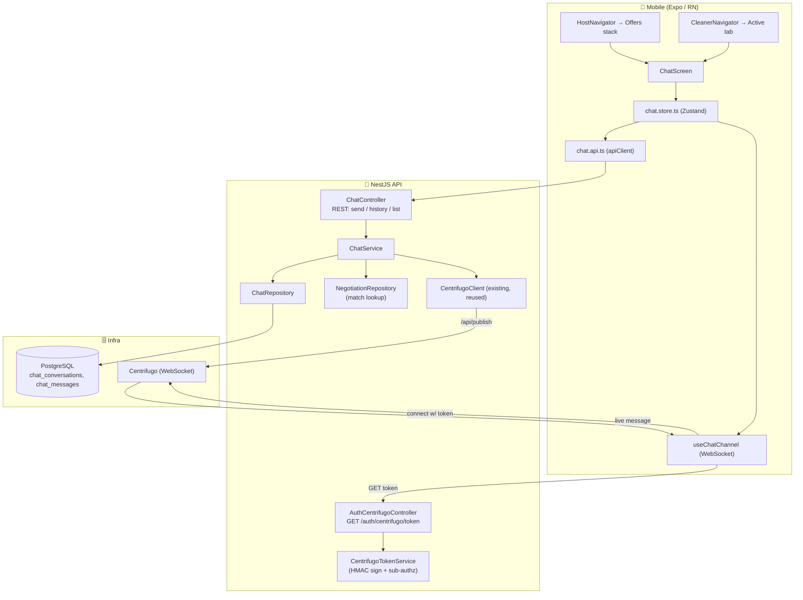

# Design Document: Realtime Chat

## Overview

`realtime-chat` adds post-match Host↔Cleaner messaging. It is a **full-stack, thin feature** built entirely on existing seams:

- **Backend `chat` module** (`services/api/src/chat/`) owns conversations and messages, exposes REST for send/history/list, and reuses the existing `CentrifugoClient` to publish. It persists to PostgreSQL first and publishes second (transport only), exactly as the offers pipeline does.
- **Backend Centrifugo token endpoint** (`GET /auth/centrifugo/token`) — the single missing piece the mobile client already expects. It HMAC-signs a connection token for the authenticated Keycloak subject using the (currently unused) `CENTRIFUGO_TOKEN_SECRET`, and authorizes per-conversation subscriptions to participants only.
- **Mobile chat feature** (`apps/mobile/src/screens/chat/`): a `chat.store.ts` Zustand store, a `useChatChannel` hook mirroring the resilient lifecycle of `useCentrifugoChannel`, a `ChatScreen`, and `chat` i18n (en+es), reachable from both role navigators.

The parent of a conversation is a **matched `negotiation_thread`** (a thread with an `ACCEPTED` proposal). The conversation copies `hostId`, `cleanerId`, `offerId` from the thread; those two users are the only participants and the sole authorization basis for both REST and Centrifugo subscription.

## Architecture

**Data flow — send:**
1. Client optimistically renders the message keyed by `client_message_id`, POSTs to `ChatController`.
2. `ChatService` verifies the caller is a participant and the conversation is `OPEN`, then `ChatRepository` inserts the message inside a transaction that assigns the next `sequence_number` (concurrency-safe) and dedups on `(conversation_id, client_message_id)`.
3. After commit, `ChatService` publishes the persisted message to `chat:conversation:{id}` via `CentrifugoClient` (best-effort; failure logged, request still `201`).
4. The counterparty's `useChatChannel` receives the push and appends in order; the sender reconciles its optimistic message with the returned persisted one (same `client_message_id`).

**Data flow — connect/subscribe:**
1. `useChatChannel` fetches a connection token from `GET /auth/centrifugo/token` (authenticated by the Keycloak JWT).
2. `CentrifugoTokenService` signs an HS256 JWT with `sub` = the caller's stable user id and a bounded `exp`, using `CENTRIFUGO_TOKEN_SECRET`.
3. The client connects and subscribes to `chat:conversation:{id}`. Subscription is authorized to participants only — see "Subscription authorization" below.

## Components

### Backend — Centrifugo token & subscription authorization

- **`AuthCentrifugoController`** (`services/api/src/auth/centrifugo/`): `GET /auth/centrifugo/token` under `JwtAuthGuard`. Resolves `req.user.keycloakId` → BidClean `User`, returns `{ token }`. (Route path matches the client's existing default `EXPO_PUBLIC_CENTRIFUGO_TOKEN_URL`.)
- **`CentrifugoTokenService`**: `mintConnectionToken(userId): string` — HS256 JWT `{ sub: userId, exp: now + TTL }` signed with `CENTRIFUGO_TOKEN_SECRET`. Pure and unit-testable. `TTL` from config.
- **Subscription authorization strategy.** Centrifugo supports two models; the design uses **server-issued subscription tokens** for private channels to avoid standing up a new proxy surface:
  - The token endpoint can additionally issue, or the connection token can embed, the set of channels the user may subscribe to. Because a user's conversation set is dynamic, the chosen approach is a **per-channel subscription token**: `GET /auth/centrifugo/token?channel=chat:conversation:{id}` returns a subscription token only when the caller is a participant of `{id}` (checked via `ChatRepository.isParticipant`), else `403`. The connection token (no channel) authenticates the socket; subscription tokens authorize each private channel. Both are HMAC-signed with the same secret and bounded TTL.
  - This keeps authorization in the app (participant check against PostgreSQL) and requires no Centrifugo proxy endpoint.

### Backend — chat domain

- **`ChatModule`** wires controller/service/repository, imports `OffersModule` (or a shared realtime provider) to reuse the exported `CentrifugoClient`, and `TypeOrmModule` for the entities. Registers config via `chat.constants.ts` with `validateChatConfig()` fail-fast in non-test.
- **`ChatController`** (`@Controller('chat') @UseGuards(JwtAuthGuard)`):
  - `GET /chat/conversations` → caller's conversations (inbox), most-recent first.
  - `GET /chat/conversations/:id` → single conversation (participant-only).
  - `GET /chat/conversations/:id/messages?before=<seq>&limit=N` → keyset history.
  - `POST /chat/conversations/:id/messages` → send (requires `Idempotency-Key` header per repo convention; `client_message_id` in body for dedup/optimistic reconcile).
  - `POST /chat/threads/:threadId/conversation` → open-or-get the conversation for a matched thread (idempotent; `409`/`404` if not matched).
- **`ChatService`**: participant/lifecycle authorization, body validation (length/non-empty), match verification via `NegotiationRepository.findMatchedCleanerId` (or an equivalent thread+accepted-proposal lookup), persist-then-publish orchestration. Keeps functions ≤30 lines, SRP.
- **`ChatRepository`**: transactional insert assigning `sequence_number` (via `MAX(sequence_number)+1` within a row-locking transaction or a per-conversation counter column bumped `RETURNING`), participant checks, keyset history query, inbox query with last-message join. Parameterized SQL only.

### Mobile

- **`chat.types.ts`** — `ChatConversation`, `ChatMessage` (`id`, `conversationId`, `senderId`, `type`, `body`, `sequenceNumber`, `clientMessageId`, `createdAt`, local `sendState`), `SendState` (`sending|sent|failed`).
- **`chat.constants.ts`** — routes/endpoints, channel prefix, message max length, page size (all from `EXPO_PUBLIC_*`/constants), i18n keys.
- **`chat.api.ts`** — typed calls over the shared `apiClient` (list, get, history, send, open-conversation, get-token).
- **`useChatChannel.ts`** — mirrors `useCentrifugoChannel`'s skeleton (token fetch, WS connect to `chat:conversation:{id}`, Centrifugo push-envelope unwrap, exponential backoff reconnect, foreground reconcile, teardown) but parses chat message events and calls store actions. No new dependency.
- **`chat.store.ts`** — Zustand `create` with `ChatState` (conversations, messagesByConversation, connectionStatus, per-message sendState) + `ChatActions` (`loadConversations`, `openConversation`, `loadOlder`, `sendMessage`, `onIncomingMessage`, `reconcile`, `reset`) + `reset`. Optimistic send keyed by `clientMessageId`; incoming dedup by id/`clientMessageId`; insert in `sequenceNumber` order.
- **`ChatScreen.tsx`** + `components/` (`MessageBubble`, `MessageComposer`, `ConversationHeader`) — dark tokens, own/counterparty distinction, send-state affordance, i18n.
- **Navigation** — add a `Chat` route to the Host Offers stack (`HostNavigator`) opened from `OfferDetailScreen` when matched; introduce a small stack in the Cleaner `Active` tab (`CleanerNavigator`) to mount `ChatScreen`. Both open the conversation for the matched `threadId`/`conversationId`.

## Data Model

### `chat_conversations`
| Column | Type | Notes |
|--------|------|-------|
| `id` | `uuid PK` | `gen_random_uuid()` |
| `thread_id` | `uuid` | FK → `negotiation_threads(id)` `ON DELETE CASCADE`; `UNIQUE` (one conversation per thread) |
| `offer_id` | `uuid` | FK → `offers(id)` `ON DELETE CASCADE`; indexed |
| `host_id` | `uuid` | FK → `users(id)` `ON DELETE CASCADE`; indexed |
| `cleaner_id` | `uuid` | FK → `users(id)` `ON DELETE CASCADE`; indexed |
| `status` | `varchar(20)` | `OPEN`\|`CLOSED`, app-validated |
| `last_message_at` | `timestamptz null` | for inbox ordering |
| `created_at` / `updated_at` | `timestamptz` | defaults `NOW()` |

### `chat_messages`
| Column | Type | Notes |
|--------|------|-------|
| `id` | `uuid PK` | `gen_random_uuid()` |
| `conversation_id` | `uuid` | FK → `chat_conversations(id)` `ON DELETE CASCADE`; indexed |
| `sender_id` | `uuid` | FK → `users(id)` `ON DELETE SET NULL` (keep history if user deleted); indexed |
| `type` | `varchar(20)` | `TEXT` only in MVP (discriminator for future attachments) |
| `body` | `text` | validated length; parameterized |
| `sequence_number` | `integer` | monotonic per conversation; `UNIQUE (conversation_id, sequence_number)` |
| `client_message_id` | `varchar(64)` | `UNIQUE (conversation_id, client_message_id)` for idempotency |
| `created_at` | `timestamptz` | default `NOW()` |
| `deleted_at` | `timestamptz null` | soft delete; partial index `WHERE deleted_at IS NULL` |

Indexes: `idx_chat_messages_conversation_seq (conversation_id, sequence_number DESC)` for keyset history; FK indexes on all FK columns; `idx_chat_conversations_host`, `_cleaner`, `_offer`; partial active-message index.

Migration: `services/api/src/migrations/1700000019000-CreateChatTables.ts`, reversible `up()`/`down()`, `IF NOT EXISTS`, table/column comments.

### Sequence assignment (concurrency-safe)
Insert within a transaction that either (a) `SELECT ... FOR UPDATE` the conversation row and uses a `message_seq` counter column bumped and returned, or (b) computes `COALESCE(MAX(sequence_number),0)+1` under the conversation row lock. Option (a) is preferred (one indexed row lock, no table scan). The `UNIQUE (conversation_id, sequence_number)` constraint is the backstop against races.

## Correctness Properties

- **P1 — Conversation ⇔ match.** A conversation is retrievable/sendable iff its thread has an `ACCEPTED` proposal; no match ⇒ no conversation. *Validates: Requirements 1.1, 1.3.*
- **P2 — One conversation per thread.** At most one `chat_conversations` row per `thread_id`; open-or-get is idempotent. *Validates: Requirements 1.2.*
- **P3 — Participant-only access.** Only `hostId`/`cleanerId` may read or write a conversation; everyone else gets `403` and no content leak. *Validates: Requirements 1.4, 2.5, 4.3, 4.4.*
- **P4 — Durable before realtime.** Every delivered message exists in PostgreSQL; a publish failure never loses a message nor fails the send. *Validates: Requirements 2.1, 2.2.*
- **P5 — Idempotent send.** Repeated `client_message_id` yields exactly one persisted message. *Validates: Requirements 2.3.*
- **P6 — Total order.** `sequence_number` is strictly increasing per conversation and unique even under concurrent sends. *Validates: Requirements 2.6, 8.4.*
- **P7 — Validated content.** Empty/oversized bodies are rejected and persist nothing; content is stored parameterized. *Validates: Requirements 2.4, 7.4.*
- **P8 — Keyset history correctness.** `before=<seq>&limit=N` returns exactly the N messages immediately older than `seq`, newest-first, with no gaps/overlaps as the client pages. *Validates: Requirements 3.1, 3.2.*
- **P9 — History is authoritative.** History reconstructed from PostgreSQL alone is complete and correctly ordered, independent of realtime. *Validates: Requirements 3.4, 5.6.*
- **P10 — Token scoping.** A minted connection token's subject is the caller's own id; a subscription token is issued only to a participant of the requested channel. *Validates: Requirements 4.1, 4.3.*
- **P11 — Token integrity & expiry.** Tokens are HMAC-signed with the configured secret and bounded expiry; tampered/expired tokens are rejected. *Validates: Requirements 4.2.*
- **P12 — Fail-fast config.** Missing token secret / Centrifugo config in production fails startup, never silently disables chat or ships an unusable token. *Validates: Requirements 4.5, 7.1, 7.2.*
- **P13 — Client dedup & ordering.** The client appends live + fetched messages with no duplicates (by id/`clientMessageId`) and in `sequenceNumber` order; optimistic sends reconcile exactly once. *Validates: Requirements 5.2, 5.5.*
- **P14 — Resilient reconnect.** Disconnect → bounded-backoff reconnect → reconcile fetches only newer messages, without duplicate subscriptions or duplicate rendered messages across background/foreground. *Validates: Requirements 5.3, 5.4.*
- **P15 — Graceful degradation.** With realtime unavailable, send-via-REST + history-fetch keep chat functional (non-live). *Validates: Requirements 5.6, 2.2.*
- **P16 — Lifecycle & deletion integrity.** Closing/removing the parent offer/thread closes/removes the conversation coherently; account deletion handles the user's chat data via the existing cascade with referential integrity preserved. *Validates: Requirements 1.5, 8.2, 8.3.*

## Testing Strategy

- **Backend unit:** `CentrifugoTokenService` (sign/verify/expiry, sub scoping), `ChatService` (participant/lifecycle authz, validation, persist-then-publish, publish-failure non-blocking), `ChatRepository` (sequence assignment, dedup, keyset query, inbox query) against an in-memory/data-source harness like the subscriptions repo tests.
- **Backend property-based (fast-check):** P5 idempotent send over arbitrary ret/interleavings; P6 monotonic/unique sequence under concurrent inserts; P8 keyset paging over random histories (no gap/overlap); P10 token scoping over random participant/non-participant pairs.
- **Backend integration/scenario:** match → open conversation → send → persisted+published; non-participant denied; closed conversation rejects send; publish failure still `201` and message present in history.
- **Mobile unit:** `chat.store` (optimistic send + reconcile, incoming dedup, order insert, reset), `useChatChannel` (token fetch, reconnect/backoff, foreground reconcile, teardown — with WS + apiClient mocked), `ChatScreen` render (own vs counterparty, send states, i18n).
- **Mobile property-based (fast-check):** P13 client dedup/order over arbitrary interleavings of live + fetched + optimistic messages.
- All backend tests run in the existing Jest/CI; mobile verified locally (`tsc --noEmit` + ESLint + Jest). CI must stay green on the 3 API/AI jobs.

## Configuration

Backend (`services/api`, via `ConfigService`):
- `CENTRIFUGO_TOKEN_SECRET` (already declared, now used) — HMAC signing secret. Fail-fast if absent in production.
- `CENTRIFUGO_API_URL` / `CENTRIFUGO_API_KEY` (existing) — publish transport.
- `CHAT_CONNECTION_TOKEN_TTL_SECONDS`, `CHAT_MESSAGE_MAX_LENGTH`, `CHAT_HISTORY_PAGE_SIZE`, `CHAT_CHANNEL_PREFIX` (default `chat:conversation:`).

Mobile (`EXPO_PUBLIC_*`, reuse existing):
- `EXPO_PUBLIC_CENTRIFUGO_WS_URL`, `EXPO_PUBLIC_CENTRIFUGO_TOKEN_URL` (existing defaults already point at `/auth/centrifugo/token`).
- `EXPO_PUBLIC_CHAT_MESSAGE_MAX_LENGTH`, `EXPO_PUBLIC_CHAT_HISTORY_PAGE_SIZE` (optional; sensible constants otherwise).

## Documentation Impact

- New module READMEs: `services/api/src/chat/README.md`, `apps/mobile/src/screens/chat/README.md`, and note the new `auth/centrifugo` endpoint in the auth module README.
- `docs/ARCHITECTURE.md`: add the chat module + the `Mobile → Centrifugo (chat)` and `Chat → Centrifugo publish` flows; the Centrifugo node already exists.
- `docs/CHANGELOG.md`: `[Unreleased]` entries per task group.
- **ADR candidates:** (1) *Chat conversation attached to the matched negotiation thread with PostgreSQL as source of truth and Centrifugo as transport*; (2) *Centrifugo token issuance & per-conversation subscription authorization*. Create at least one ADR (the transport/authority decision) when the module lands.
