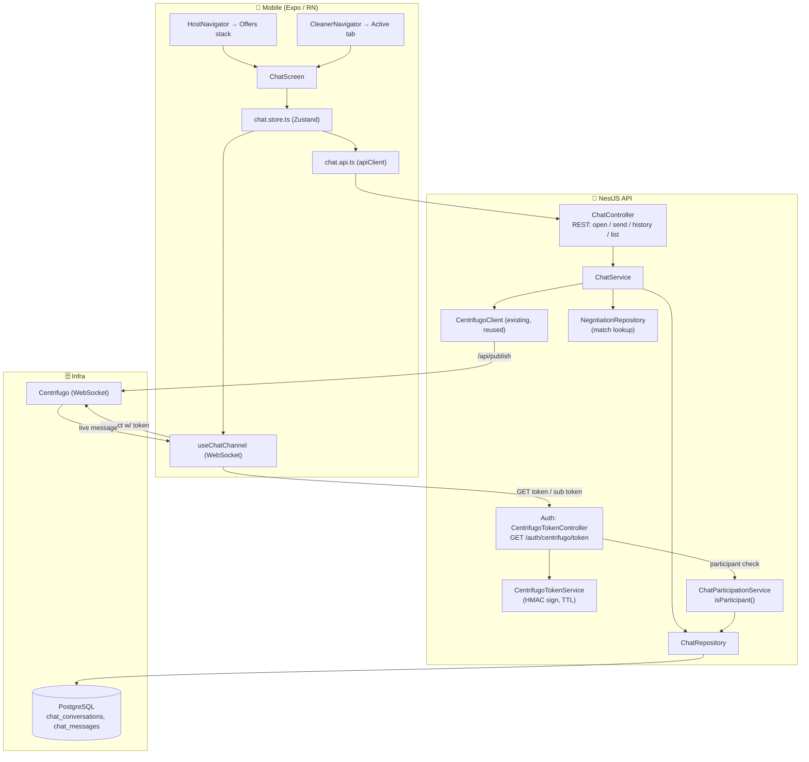

# Design Document: Realtime Chat

## Overview

`realtime-chat` adds post-match Host↔Cleaner messaging. It is a **full-stack but thin feature** built entirely on existing seams:

- **Backend `chat` module** (`services/api/src/chat/`) owns conversations and messages, exposes REST for open/send/history/list, and reuses the existing `CentrifugoClient` to publish. It persists to PostgreSQL first and publishes second (transport only), exactly as the offers pipeline does. Message insertion and the conversation `last_message_at` summary update happen in one transaction.
- **Auth-owned Centrifugo token endpoint** (`GET /auth/centrifugo/token`) — the single missing infra piece the mobile client already expects. It HMAC-signs a **connection token** for the authenticated Keycloak subject using the (currently unused) `CENTRIFUGO_TOKEN_SECRET`, and — for `?channel=chat:conversation:{id}` — mints a **subscription token** only after asking the chat module whether the authenticated subject is a participant. The `chat` module does not own an `AuthController`; auth owns identity/token, chat owns the participation rule.
- **Mobile chat feature** (`apps/mobile/src/screens/chat/`): a `chat.store.ts` Zustand store, a `useChatChannel` hook mirroring the resilient lifecycle of `useCentrifugoChannel`, a `ChatScreen`, and `chat` i18n (en+es), reachable from both role navigators.

The parent of a conversation is a **matched `negotiation_thread`** (a thread with an `ACCEPTED` proposal). The conversation copies `hostId`, `cleanerId`, `offerId` from the thread; those two users are the only participants and the sole authorization basis for both REST and Centrifugo subscription. A conversation stays `OPEN` only while its **match remains valid** (thread not CLOSED/invalidated and offer not terminal).

**Scope reflected in this design:** text-only (`type` discriminator kept for the future); **no** message edit/delete (no `deleted_at`, no tombstone); **no** read/delivery receipts in persistence/correctness; **no** durable offline outbox; **no** translation/attachments. See `requirements.md`.

## Ownership Boundary (auth ↔ chat)

```
auth module                                   chat module
  GET /auth/centrifugo/token                    ChatParticipationService.isParticipant(userId, conversationId)
    ├─ connection token: sub = JWT sub    ◄──────── (consulted only for subscription tokens)
    └─ subscription token for a channel ──────────► asks chat: is this authenticated subject a participant?
         issued IFF isParticipant === true
```

- **Auth owns** identity resolution (Keycloak JWT `sub`), HMAC signing (`CENTRIFUGO_TOKEN_SECRET`), and token TTL/expiry.
- **Chat owns** the participation rule (a conversation lookup returning whether a given user id is the conversation's `hostId`/`cleanerId`).
- Dependency is one-directional (auth → chat participation check). No duplicated auth surface; chat never issues tokens.

## Architecture



**Data flow — send:**
1. Client optimistically renders the message keyed by `client_message_id`, POSTs to `ChatController`.
2. `ChatService` verifies the caller is a participant and the conversation is `OPEN`, validates the body, then `ChatRepository.insertMessage` runs a single transaction that assigns the next `sequence_number` (row-locked counter, concurrency-safe), dedups on `(conversation_id, client_message_id)`, inserts the message, AND updates `conversations.last_message_at` — all atomic.
3. After commit, `ChatService` publishes the persisted message to `chat:conversation:{id}` via `CentrifugoClient` (best-effort; failure logged, request still `201`).
4. The counterparty's `useChatChannel` receives the push and upserts by `message.id` in `sequence_number` order; the sender reconciles its optimistic message with the returned persisted one (same `client_message_id`).

**Data flow — connect/subscribe:**
1. `useChatChannel` GETs a connection token from `/auth/centrifugo/token` (authenticated by the Keycloak JWT).
2. `CentrifugoTokenService` signs an HS256 JWT `{ sub: userId, exp: now + TTL }` with `CENTRIFUGO_TOKEN_SECRET`.
3. To subscribe to a private channel, the client GETs `/auth/centrifugo/token?channel=chat:conversation:{id}`; auth asks `ChatParticipationService.isParticipant(sub, id)` and issues a subscription token only if true, else `403`.
4. The client connects and subscribes; identity is always the JWT subject — the id in the channel string is never trusted.

## Components

### Auth — Centrifugo token issuance

- **`CentrifugoTokenController`** (`services/api/src/auth/centrifugo/`): `GET /auth/centrifugo/token` under `JwtAuthGuard`. Resolves `req.user.keycloakId` → BidClean `User`. Without `channel` → returns `{ token }` (connection token). With `?channel=chat:conversation:{id}` → returns `{ token }` (subscription token) only when `ChatParticipationService.isParticipant(user.id, id)` is true, else `403`. Route matches the client's existing default `EXPO_PUBLIC_CENTRIFUGO_TOKEN_URL`.
- **`CentrifugoTokenService`**: `mintConnectionToken(userId): string` and `mintSubscriptionToken(userId, channel): string` — HS256 over `{ sub, exp, channel? }` with `CENTRIFUGO_TOKEN_SECRET`; TTL from config. Pure and unit-testable. Never reads a client-supplied subject.

### Chat — domain

- **`ChatModule`** wires controller/service/repository/participation, imports the source of `CentrifugoClient` (reuse via `OffersModule`'s export or a small shared realtime provider), the negotiation match lookup, and `TypeOrmModule` for the entities. Registers config via `chat.constants.ts` with `validateChatConfig()` fail-fast in non-test. Exports `ChatParticipationService` for auth to consume.
- **`ChatController`** (`@Controller('chat') @UseGuards(JwtAuthGuard)`):
  - `POST /chat/threads/:threadId/conversation` → open-or-get the conversation for a matched thread (idempotent; `404`/`409` when the thread is not matched).
  - `GET /chat/conversations` → caller's conversations (inbox), `last_message_at` desc.
  - `GET /chat/conversations/:id` → single conversation (participant-only).
  - `GET /chat/conversations/:id/messages?before=<seq>&limit=N` → older history (backward scroll).
  - `GET /chat/conversations/:id/messages?after=<seq>&limit=N` → newer messages (reconnect reconciliation).
  - `POST /chat/conversations/:id/messages` → send (requires `Idempotency-Key` header per repo convention; body carries `client_message_id` + `body`).
- **`ChatService`**: match verification (thread has `ACCEPTED` proposal) before opening; participant authorization; body validation (non-empty, ≤ max length). The `OPEN`-lifecycle check is delegated INTO the repository's serialized send transaction (not a pre-check in the service) so it cannot race a concurrent close. Orchestrates persist-then-publish (publish best-effort, failure logged not thrown, body never logged verbatim) and maps the repository's payload-mismatch signal to `409`. Functions ≤30 lines, SRP.
- **`ChatParticipationService`**: `isParticipant(userId, conversationId): Promise<boolean>` — a thin participant lookup used by both chat authorization and the auth subscription-token endpoint. Single source of the participation rule.
- **`ChatRepository`**: transactional `insertMessage` implementing the serialized send transaction above — row-lock the conversation, verify `OPEN` inside the lock, dedup on `(conversation_id, client_message_id)` (identical payload → return existing; different payload → signal conflict → `409`), bump `message_seq`, insert, update `last_message_at` — all one transaction. Plus `openOrGetConversationForThread` (idempotent upsert, only when matched), `isParticipant`, `getMessagesBefore` / `getMessagesAfter` (keyset), `listConversationsForUser` (inbox with last-message summary), `closeConversation` (on match invalidation). Parameterized SQL only.

### Chat — lifecycle (match invalidation → CLOSED)

The conversation is CLOSED when the match stops being valid, from either signal:
- **Offer terminal** (cancelled/expired/completed) — hooked via the existing offer state-change path/event.
- **Thread CLOSED/invalidated** — negotiation already sets the thread `status = CLOSED` when the offer becomes terminal; chat closes the conversation on that transition too.

Design choice: a single `ChatService.closeConversationForThread(threadId)` (idempotent) is invoked from the negotiation/offer terminal transition (via an event listener or a direct call in the existing close path). CLOSED conversations reject new sends (`409`) but remain readable (subject to retention). No new scheduler is introduced.

### Mobile

- **`chat.types.ts`** — `ChatConversation`, `ChatMessage` (`id`, `conversationId`, `senderId`, `type`, `body`, `sequenceNumber`, `clientMessageId`, `createdAt`, local `sendState`), `SendState` (`sending|sent|failed`), `ConnectionStatus`.
- **`chat.constants.ts`** — routes/endpoints, channel prefix, message max length, page size, send timeout (all from `EXPO_PUBLIC_*`/constants), i18n keys.
- **`chat.api.ts`** — typed calls over the shared `apiClient` (open-or-get, list, get, history `before`, history `after`, send, get connection/subscription token).
- **`useChatChannel.ts`** — mirrors `useCentrifugoChannel`'s skeleton (token fetch, WS connect to `chat:conversation:{id}`, Centrifugo push-envelope unwrap, bounded exponential-backoff reconnect, foreground reconcile via `after`, teardown) but parses chat message events and calls store actions. No new dependency.
- **`chat.store.ts`** — Zustand `create` with `ChatState` (conversations, messagesByConversation, connectionStatus) + `ChatActions` (`loadConversations`, `openConversation`, `loadOlder`, `reconcileNewer`, `sendMessage`, `onIncomingMessage`, `reset`) + `reset`. Optimistic send keyed by `clientMessageId` with a bounded timeout → `failed`; incoming upsert/dedup by `id` (and `clientMessageId` for own sends); insert in `sequenceNumber` order.
- **`ChatScreen.tsx`** + `components/` (`MessageBubble`, `MessageComposer`, `ConversationHeader`) — dark tokens, own vs counterparty distinction, send-state affordance, i18n.
- **Navigation** — add a `Chat` route to the Host Offers stack (`HostNavigator`) opened from `OfferDetailScreen` when matched; introduce a small stack in the Cleaner `Active` tab (`CleanerNavigator`) to mount `ChatScreen`. Both open the conversation for the matched `threadId`/`conversationId`.

## Data Model

### `chat_conversations`
| Column | Type | Notes |
|--------|------|-------|
| `id` | `uuid PK` | `gen_random_uuid()` |
| `thread_id` | `uuid` | FK → `negotiation_threads(id)` `ON DELETE CASCADE`; **`UNIQUE`** (one conversation per thread) |
| `offer_id` | `uuid` | FK → `offers(id)` `ON DELETE CASCADE`; indexed |
| `host_id` | `uuid null` | FK → `users(id)` **`ON DELETE SET NULL`** (never cascade from users; retain conversation on participant deletion); indexed |
| `cleaner_id` | `uuid null` | FK → `users(id)` **`ON DELETE SET NULL`**; indexed |
| `status` | `varchar(20)` | `OPEN`\|`CLOSED`, app-validated |
| `message_seq` | `integer` | per-conversation monotonic counter (source of `sequence_number`), default `0` |
| `last_message_at` | `timestamptz null` | inbox ordering; updated atomically with each insert |
| `created_at` / `updated_at` | `timestamptz` | defaults `NOW()` |

### `chat_messages`
| Column | Type | Notes |
|--------|------|-------|
| `id` | `uuid PK` | `gen_random_uuid()` |
| `conversation_id` | `uuid` | FK → `chat_conversations(id)` `ON DELETE CASCADE`; indexed |
| `sender_id` | `uuid null` | FK → `users(id)` `ON DELETE SET NULL` (keep history if a participant is deleted/anonymized); indexed |
| `type` | `varchar(20)` | `TEXT` only in MVP (discriminator for future attachments) |
| `body` | `text` | validated length; parameterized; never logged verbatim |
| `sequence_number` | `integer` | unique + strictly increasing per conversation (gaps allowed); `UNIQUE (conversation_id, sequence_number)` |
| `client_message_id` | `varchar(64)` | `UNIQUE (conversation_id, client_message_id)` for idempotent send |
| `created_at` | `timestamptz` | default `NOW()` |

No `deleted_at` — messages are immutable in v1 (no soft delete/tombstone).

Indexes: `idx_chat_messages_conversation_seq (conversation_id, sequence_number DESC)` for keyset history (both `before` and `after` use it); FK indexes on all FK columns; `idx_chat_conversations_host`, `_cleaner`, `_offer`, and `_last_message_at` (partial `WHERE status='OPEN'` optional for inbox).

Migration: `services/api/src/migrations/1700000019000-CreateChatTables.ts`, reversible `up()`/`down()`, `IF NOT EXISTS`, table/column comments.

### Deletion-policy coherence (resolving the FK contradiction)
The platform's central deletion (`DeletionJobProcessor`) anonymizes PII and marks the user `DELETED`; it does **not** physically remove the `users` row. To keep the schema coherent with the "retain conversation + anonymize participant" guarantee (and safe even against a hypothetical hard delete), the participant FKs (`host_id`, `cleaner_id`) and `sender_id` use **`ON DELETE SET NULL`**, never `CASCADE` from `users`. Thus removing a user never destroys a shared conversation or its history; only `thread_id`/`offer_id` cascade (removing a parent thread/offer removes its conversation). Chat needs no destructive deletion step of its own — the global PII anonymization covers participant display, and the SET NULL policy preserves referential integrity (REQ-P2, Req 8.2, 8.3). If chat later needs an explicit cascade step, it participates as an idempotent, non-destructive step consistent with the existing cascade.

### Send transaction (serialized: OPEN-check + sequence + insert + summary, gaps allowed)
The entire send is one serialized transaction under the conversation row lock, so the lifecycle check cannot race a concurrent close (fixes the check-then-act window where T1 reads OPEN, T2 closes, T1 inserts):
```
BEGIN
  SELECT ... FROM chat_conversations WHERE id = $1 FOR UPDATE   -- row lock
  -- verify status = 'OPEN' HERE, inside the lock (else ROLLBACK → 409)
  -- dedup: if (conversation_id, client_message_id) exists →
  --   identical payload → return existing (idempotent);
  --   different payload  → ROLLBACK → 409 CONFLICT
  next := message_seq + 1
  UPDATE chat_conversations SET message_seq = next, last_message_at = NOW() WHERE id = $1
  INSERT chat_messages (... sequence_number = next ...)
COMMIT
```
`UNIQUE (conversation_id, sequence_number)` and `UNIQUE (conversation_id, client_message_id)` are the backstops. Gaps are acceptable (a rolled-back transaction may consume a counter value); the invariant is uniqueness + strict monotonicity, not contiguity (REQ-P4). Because the OPEN-check and the insert share the lock, a CLOSED conversation can never admit a new message (REQ-P8).

## Correctness Properties (verifiable / testable)

Each maps to the requirements' business invariants (REQ-P1…REQ-P9) and the acceptance criteria.

- **P1 — Conversation lifecycle follows match validity.** A conversation may be created/opened only for a thread with an `ACCEPTED` proposal; an OPEN conversation accepts sends only while the match is valid; once CLOSED it remains readable by participants but rejects sends. (Creation/open + send are match-gated; read is not gated by CLOSED.) *Validates: Requirements 1.1, 1.3, 1.5, 1.6 · REQ-P7.*
- **P2 — One conversation per thread.** At most one `chat_conversations` row per `thread_id`; open-or-get is idempotent and concurrency-safe. *Validates: Requirements 1.2 · REQ-P1.*
- **P3 — Participant-only access.** Only `hostId`/`cleanerId` may read, write, or subscribe; everyone else gets `403` and no content leak; identity comes from the JWT subject, never the channel string. *Validates: Requirements 1.4, 2.5, 4.3, 4.4 · REQ-P2.*
- **P4 — Durable before realtime.** Every delivered message exists in PostgreSQL before publish; a publish failure never loses a message nor fails the send. *Validates: Requirements 2.1, 2.2 · REQ-P3.*
- **P5 — Idempotent send (payload-checked).** Repeated `client_message_id` with the SAME payload yields exactly one persisted message and returns the existing one; the SAME `client_message_id` with a DIFFERENT payload is rejected with `409 CONFLICT` and persists nothing (no silent contract corruption). *Validates: Requirements 2.3 · REQ-P5.*
- **P6 — Total order, gaps allowed.** `sequence_number` is unique and strictly increasing per conversation, even under concurrent sends; contiguity is not required. *Validates: Requirements 2.6, 8.5 · REQ-P4.*
- **P7 — Validated content, no verbatim logging.** Empty/oversized bodies are rejected and persist nothing; content is stored parameterized and never written verbatim to logs/metrics/errors. *Validates: Requirements 2.4, 7.4.*
- **P8 — Keyset history correctness (both cursors).** `before=<seq>&limit=N` returns exactly the N messages immediately older than `seq` (newest-first); `after=<seq>&limit=N` returns exactly the messages newer than `seq`; paging has no gaps/overlaps. *Validates: Requirements 3.1, 3.2, 3.3 · REQ-P9.*
- **P9 — History is authoritative.** History reconstructed from PostgreSQL alone is complete and correctly ordered, independent of realtime. *Validates: Requirements 3.5, 5.6 · REQ-P9.*
- **P10 — Token scoping.** A connection token's subject is the authenticated caller's id; a subscription token is issued only when the authenticated subject is a participant of the requested channel (resolved by lookup, not by the channel string). *Validates: Requirements 4.1, 4.3 · REQ-P2.*
- **P11 — Token integrity & expiry.** Tokens are HMAC-signed with the configured secret and bounded expiry; tampered/expired tokens are rejected. *Validates: Requirements 4.2.*
- **P12 — Fail-fast config.** Missing token secret / Centrifugo config in production fails startup, never silently disables chat or ships an unusable token. *Validates: Requirements 4.5, 7.1, 7.2.*
- **P13 — Client dedup & ordering.** The client upserts live + fetched messages with no duplicates (by `id`, and `clientMessageId` for own sends) in `sequenceNumber` order; the same event processed twice never renders twice; optimistic sends reconcile exactly once. *Validates: Requirements 5.2, 5.5 · REQ-P6.*
- **P14 — Resilient reconnect (via `after`).** Disconnect → bounded-backoff reconnect → reconcile fetches only messages `after` the last held sequence, without duplicate subscriptions or duplicate rendered messages across background/foreground. *Validates: Requirements 5.3, 5.4 · REQ-P9.*
- **P15 — Graceful degradation.** With the WebSocket unavailable but network up, send-via-REST + history-fetch keep chat functional (non-live); with no network, a send stays locally `failed`/`pending` and is retryable with the same `client_message_id` (no durable outbox). *Validates: Requirements 5.6, 2.2 · REQ-P3.*
- **P19 — Recovery over immediate delivery.** v1 provides NO guarantee of immediate realtime delivery. A message whose publish failed or whose recipient was offline is recovered through history reconciliation (the `after` cursor); PostgreSQL + reconciliation is the delivery/consistency guarantee. A transactional outbox is the documented future evolution, not part of v1. *Validates: Requirements 2.2, 2.7, 5.3 · REQ-P3, REQ-P9.*
- **P16 — Atomic summary.** A message insert and its conversation's `last_message_at` update are atomic; the inbox never observes a new message without its updated summary. *Validates: Requirements 2.1, 8.4.*
- **P17 — Lifecycle on match invalidation, race-free close.** Offer-terminal OR thread-CLOSED closes the conversation idempotently; CLOSED rejects new sends and keeps history readable. The OPEN-check lives inside the serialized send transaction, so a concurrent close can never admit a message (no check-then-act race). *Validates: Requirements 1.5, 1.6, 2.5 · REQ-P8.*
- **P18 — Deletion integrity (no cascade-from-users).** Participant FKs (`host_id`, `cleaner_id`) and `sender_id` are `ON DELETE SET NULL`, never `CASCADE` from `users`, so deleting/anonymizing a user never destroys a shared conversation or its history; only `thread_id`/`offer_id` cascade. This is coherent with the central deletion policy (which anonymizes + marks `DELETED` and does not physically remove the `users` row). *Validates: Requirements 8.2, 8.3.*

## Testing Strategy

- **Backend unit:** `CentrifugoTokenService` (sign/verify/expiry, sub scoping — P10/P11), `ChatService` (participant/lifecycle authz, validation, atomic persist-then-publish, publish-failure non-blocking — P3/P4/P7/P16/P17), `ChatParticipationService`, `ChatRepository` (sequence assignment, dedup, keyset `before`/`after`, inbox, close) against an in-memory data-source harness like the subscriptions repo tests.
- **Backend property-based (fast-check):** P5 idempotent send over arbitrary retries/interleavings; P6 unique+strictly-increasing sequence (gaps allowed) under concurrent inserts; P8 keyset paging (`before` and `after`) over random histories (no gap/overlap); P10 token scoping over random participant/non-participant pairs.
- **Backend integration/scenario:** match → open → send → persisted+published+summary-updated; non-participant denied (read/write/subscribe); unmatched thread has no conversation; closed conversation rejects send; publish failure still `201` and present in history; match invalidation closes the conversation.
- **Mobile unit:** `chat.store` (optimistic send + timeout→failed + reconcile once, incoming upsert/dedup by id, order insert, `reconcileNewer`, reset — P13), `useChatChannel` (token fetch, reconnect/backoff, foreground reconcile via `after`, teardown, no duplicate subscription — P14, with WS + apiClient mocked), `ChatScreen` render (own vs counterparty, send states, i18n).
- **Mobile property-based (fast-check):** P13 client dedup/order over arbitrary interleavings of live + fetched + optimistic messages.
- All backend tests run in the existing Jest/CI; mobile verified locally (`tsc --noEmit` + ESLint + Jest). CI must stay green on the 3 API/AI jobs.

## Configuration

Backend (`services/api`, via `ConfigService`):
- `CENTRIFUGO_TOKEN_SECRET` (already declared, now used) — HMAC signing secret. Fail-fast if absent in production.
- `CENTRIFUGO_API_URL` / `CENTRIFUGO_API_KEY` (existing) — publish transport.
- `CHAT_CONNECTION_TOKEN_TTL_SECONDS`, `CHAT_MESSAGE_MAX_LENGTH`, `CHAT_HISTORY_PAGE_SIZE`, `CHAT_CHANNEL_PREFIX` (default `chat:conversation:`).

Mobile (`EXPO_PUBLIC_*`, reuse existing):
- `EXPO_PUBLIC_CENTRIFUGO_WS_URL`, `EXPO_PUBLIC_CENTRIFUGO_TOKEN_URL` (existing defaults already point at `/auth/centrifugo/token`).
- `EXPO_PUBLIC_CHAT_MESSAGE_MAX_LENGTH`, `EXPO_PUBLIC_CHAT_HISTORY_PAGE_SIZE`, `EXPO_PUBLIC_CHAT_SEND_TIMEOUT_MS` (optional; sensible constants otherwise).

## Documentation Impact

- New module READMEs: `services/api/src/chat/README.md`, `apps/mobile/src/screens/chat/README.md`; note the new `auth/centrifugo` endpoint in the auth module README.
- `docs/ARCHITECTURE.md`: add the chat module + the `Mobile → Centrifugo (chat)` and `Chat → Centrifugo publish` flows; the Centrifugo node already exists.
- `docs/CHANGELOG.md`: `[Unreleased]` entries per task group.
- **ADR candidates:** (1) *Chat conversation attached to the matched negotiation thread with PostgreSQL as source of truth and Centrifugo as transport*; (2) *Centrifugo token issuance owned by auth with a chat-owned participation rule (connection + per-channel subscription tokens)*. Create at least the transport/authority ADR when the module lands.
