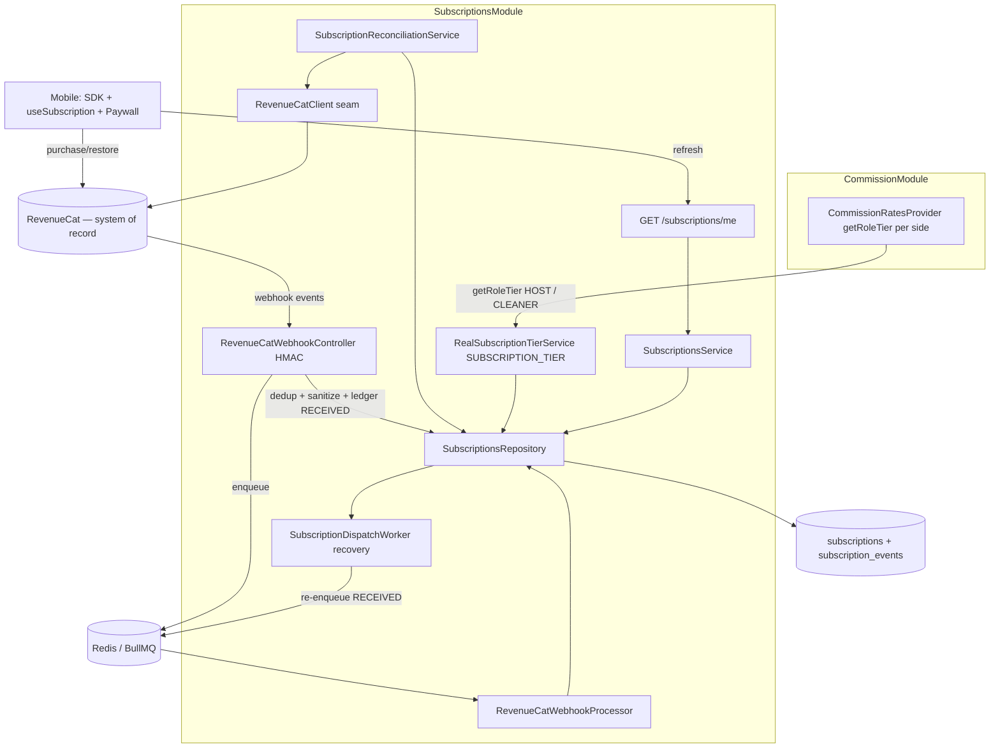
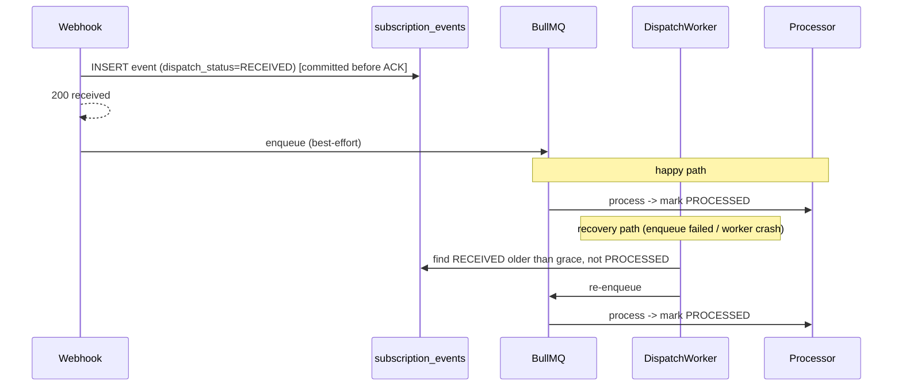

# Design Document

## Overview

The `revenuecat-subscriptions` module is the **source of truth for a user's subscription tier** inside BidClean. It integrates RevenueCat (the IAP system of record) and maintains a **durable, reconcilable local mirror** of each user's entitlements (`cleaner_pro`, `host_pro`, `ad_free`), then implements the existing `SUBSCRIPTION_TIER` contract for real — retiring the FREE-returning stub that `commission-system` ships today.

The authority split, restated precisely (it drives the whole design):

- **RevenueCat = source of truth** for purchase/renewal/entitlement state.
- **The BidClean mirror = authoritative runtime read model** for BidClean's own authorization/business decisions (tier resolution, commission gating, ad/PRO gates). The mirror never grants access on its own; it only reflects RevenueCat, reconciled via webhooks + a periodic backstop.

The design rests on seven hard rules:

1. **Derive tier, never store a flag.** Tier is derived at query time from active entitlements; expiration is always evaluated. `ad_free` never implies PRO.
2. **Role-aware resolution, not just global.** `getTier(userId)` keeps the global `FREE | PRO` for compatibility, but the contract also exposes `getRoleTier(userId, role)`: the Host fee resolves against `host_pro` only, and the Cleaner commission against `cleaner_pro` only. A user with only `host_pro` is PRO as a Host and FREE as a Cleaner.
3. **Per-entitlement ordering.** Out-of-order protection is tracked per entitlement (`*_last_event_at`), so a late-but-valid event for one entitlement is never discarded because a newer event arrived for a different entitlement.
4. **Durable webhook delivery (outbox/recovery).** A webhook is only ACKed after its ledger row is committed with `dispatch_status = RECEIVED`; a recovery worker guarantees every RECEIVED row is eventually queued and processed — an acknowledged webhook is never lost.
5. **One-directional wiring (A).** `SubscriptionsModule` provides and exports the real `SUBSCRIPTION_TIER`; `CommissionModule` imports `SubscriptionsModule` and drops its default stub binding. No circular dependency.
6. **Server authority, client convenience.** The mobile SDK reads `customerInfo` for instant UI; anything affecting money/access reads the backend mirror. The client never grants entitlements and refreshes `/subscriptions/me` after purchase to converge the purchase->mirror window.
7. **Fail into last-known, never into an error.** Tier resolution is a bounded mirror read; a RevenueCat outage degrades to the last-known mirror state and never blocks offer creation, match, or account deletion.

### Terminology

> **Global tier** = `getTier` result (`FREE | PRO`). **Role tier** = `getRoleTier(userId, role)` — the tier for one role, derived from that role's entitlement. **Role-specific entitlement** = `cleaner_pro` / `host_pro`. **Mirror** = the `subscriptions` table (runtime read model). **Ledger/outbox** = the append-only `subscription_events` table (sanitized webhook history + dispatch state). **`app_user_id`** = the internal user UUID. **Logical entitlement key** = internal constant (`CLEANER_PRO`); **RevenueCat entitlement id** = the configured external identifier it maps to.

### Key Design Decisions

1. **Own module, implements + extends an existing contract.** `commission-system` keeps owning the token/interface definition; this module binds the real provider. The `SubscriptionTierContract` is EXTENDED (in commission-system) with `getRoleTier(userId, role)`; `getTier` stays for compatibility. commission-system's `CommissionRatesProvider` switches to `getRoleTier(userId, HOST)` for the Host fee and `getRoleTier(userId, CLEANER)` for the Cleaner commission — resolving the two-role ambiguity at the correct granularity.
2. **Wiring A (explicit, no globals, no cycle).** `SubscriptionsModule` `exports` `SUBSCRIPTION_TIER`; `CommissionModule` `imports: [SubscriptionsModule]` and removes its default stub binding. `SubscriptionsModule` imports only the contract types/token from commission-system, not the module — no cycle.
3. **Mirror = one row per user, ledger = history + outbox.** `subscriptions` holds the current per-entitlement snapshot with a per-entitlement `last_event_at`; `subscription_events` is the append-only history AND the delivery outbox (`dispatch_status`). Multi-row per-subscription modeling is deferred.
4. **Durable delivery over ledger-then-enqueue.** The ACK is given after the ledger row commits; enqueue happens after, and a recovery worker re-queues any RECEIVED row not yet processed. This closes the "ACKed but never queued" gap.
5. **Per-entitlement out-of-order guard.** A delta applies to entitlement E only when `delta.eventTimestampMs > E.last_event_at`; other entitlements' timestamps are irrelevant.
6. **Entitlement state is replicated, not inferred by event type alone.** The mapper sets a target state, but the authoritative truth is RevenueCat's; ambiguous transitions (e.g. `SUBSCRIPTION_PAUSED`, `BILLING_ISSUE`) keep the entitlement active until its expiry unless RevenueCat says otherwise, and reconciliation is the final arbiter.
7. **HMAC-signed webhooks.** The webhook verifies an HMAC-SHA256 signature over the raw body with a timestamp tolerance and constant-time comparison (falling back to a shared-secret bearer only if HMAC is unavailable), raising security to the level of a monetization-affecting endpoint.
8. **RevenueCat reached only through a versioned seam.** `RevenueCatClient` wraps the REST API (subscriber fetch for reconciliation, delete for account deletion). The rest of the module is agnostic to v1/v2.
9. **No hardcoded identifiers.** Internal logical entitlement keys (`CLEANER_PRO`) are mapped to configured RevenueCat ids via required configuration; production startup validation fails if a mapping is missing (no silent hardcoded fallback).
10. **Platform matrix: iOS + Android (MVP).** Amazon Appstore is out of MVP scope; the SDK is configured with iOS and Android public keys only. Amazon can be added later without design change.

### Responsibility Matrix

| Responsibility | revenuecat-subscriptions | commission-system | offer-radar / ads | account deletion | RevenueCat |
|----------------|:---:|:---:|:---:|:---:|:---:|
| Resolve global tier (`getTier`) | YES (implements) | consumes | no | no | source of truth |
| Resolve role tier (`getRoleTier`) | YES (implements) | consumes (per side) | no | no | source |
| Ingest/verify RevenueCat webhooks (HMAC) | YES | no | no | no | emits |
| Durable mirror + ledger/outbox | YES | no | no | reads for cleanup | source |
| Reconcile mirror to RevenueCat (+discover) | YES | no | no | no | authority |
| Commission math / PRO discount | no | YES | no | no | no |
| Ad rendering / placement | no | no | YES (Spec 12) | no | no |
| `ad_free` entitlement state | YES (supplies) | no | consumes | no | source |
| Cancel subscriptions on deletion | supplies client | no | no | YES (calls) | executes |
| Mobile paywalls / purchase / restore | YES | no | no | no | serves paywalls |

## Architecture

### Module Placement

```
services/api/src/subscriptions/
|-- subscriptions.module.ts               (provides + exports SUBSCRIPTION_TIER real impl)
|-- subscriptions.constants.ts            (env config + validateSubscriptionsConfig(); reuses REVENUECAT_API_KEY/URL; entitlement id MAP)
|-- subscriptions.types.ts                (EntitlementId logical keys, Store, RevenueCatEventType, view + delta types, Role)
|-- subscription-tier.service.ts          (RealSubscriptionTierService: getTier + getRoleTier from mirror)
|-- subscriptions.service.ts              (read model: getMyEntitlements; self-heal trigger; mirror upsert orchestration)
|-- subscriptions.repository.ts           (mirror + ledger/outbox reads/writes; dedup; per-entitlement ordering; discovery; deletion cleanup)
|-- subscriptions.controller.ts           (GET /subscriptions/me — JWT, scoped, self-heal on missing/stale)
|-- revenuecat/
|   |-- revenuecat.client.ts              (versioned REST seam: getSubscriber, deleteSubscriber)
|   |-- revenuecat.constants.ts           (event type constants; logical->configured id mapping helpers)
|   |-- revenuecat-signature.ts           (HMAC-SHA256 verify: timestamp tolerance + constant-time compare)
|   `-- revenuecat-event.mapper.ts        (pure: RevenueCat event -> EntitlementDelta[])
|-- webhooks/
|   |-- revenuecat-webhook.controller.ts  (public POST /webhooks/revenuecat; HMAC verify; dedup; ledger RECEIVED; enqueue; ACK)
|   |-- revenuecat-webhook.processor.ts   (BullMQ: apply deltas per entitlement, out-of-order safe; mark PROCESSED)
|   |-- subscription-dispatch.worker.ts   (recovery: re-enqueue RECEIVED ledger rows not yet PROCESSED)
|   `-- revenuecat-payload.sanitizer.ts   (pure: whitelist safe fields only)
|-- reconciliation/
|   `-- subscription-reconciliation.service.ts  (@Interval sweep: converge existing rows + discover missing subscribers)
|-- entities/
|   |-- subscription.entity.ts            (subscriptions mirror)
|   `-- subscription-event.entity.ts      (append-only ledger + outbox)
|-- __tests__/
`-- README.md

apps/mobile/src/screens/subscriptions/
|-- useSubscription.ts                    (Zustand: customerInfo, active entitlements, purchase/restore, refresh /subscriptions/me)
|-- subscriptions.api.ts                  (typed client for GET /subscriptions/me)
|-- subscriptions.types.ts               (EntitlementId, SubscriptionView mirroring backend)
|-- subscriptions.constants.ts            (ENDPOINTS, entitlement/offering ids from config, i18n keys)
|-- PaywallScreen.tsx                      (RevenueCat Paywalls V2 via react-native-purchases-ui)
|-- components/ProBadge.tsx               (PRO badge gated per-role entitlement)
`-- __tests__/
```

Mobile also updates `apps/mobile/src/screens/radar/hooks/useAdVisibility.ts` to read the real `ad_free` entitlement, and the account-deletion flow keeps its RevenueCat cancel step and gains mirror cleanup. commission-system is edited: contract extended with `getRoleTier`, `CommissionRatesProvider` switches to per-role resolution, default stub binding removed, `SubscriptionsModule` imported.

### System Context



### Purchase -> Webhook -> Mirror Flow

```mermaid
sequenceDiagram
    participant User
    participant App as Mobile (SDK + useSubscription)
    participant RC as RevenueCat
    participant WH as RevenueCatWebhookController
    participant Q as BullMQ
    participant Proc as RevenueCatWebhookProcessor
    participant Mirror as subscriptions (mirror)
    participant Me as GET /subscriptions/me

    User->>App: tap "Upgrade to PRO"
    App->>RC: purchase(package)
    RC-->>App: customerInfo (cleaner_pro active) — optimistic UI only
    RC->>WH: webhook INITIAL_PURCHASE (HMAC signature + timestamp)
    WH->>WH: verify HMAC, dedup by event id, sanitize -> ledger dispatch_status=RECEIVED
    WH->>Q: enqueue; return { received: true }
    Q->>Proc: process event
    Proc->>Mirror: apply delta to cleaner_pro (if event newer than cleaner_pro_last_event_at); mark PROCESSED
    App->>Me: refresh after purchase
    Me-->>App: authoritative entitlements (server-authorized PRO now effective)
```

### Webhook Durability (outbox/recovery)



### Cross-Module Wiring (A) + contract extension

- `commission-system` OWNS the contract. It is EXTENDED (in `contracts/subscription-tier.interface.ts`) to:
  ```typescript
  export interface SubscriptionTierContract {
    getTier(userId: string): Promise<SubscriberTier>;                 // global (compat)
    getRoleTier(userId: string, role: SubscriberRole): Promise<SubscriberTier>; // role-aware
  }
  ```
  `SubscriberRole` = `'HOST' | 'CLEANER'` (add to commission types; maps to the existing `RateSide`).
- `CommissionRatesProvider` changes: the Host fee lookup calls `getRoleTier(hostId, 'HOST')`; the Cleaner commission lookup calls `getRoleTier(cleanerId, 'CLEANER')`. (`getTier` remains for any non-role-scoped consumer.) The bounded-timeout + FREE-degradation wrapper is unchanged.
- `SubscriptionsModule` binds `{ provide: SUBSCRIPTION_TIER, useClass: RealSubscriptionTierService }`, `exports: [SUBSCRIPTION_TIER]`. `CommissionModule` `imports: [SubscriptionsModule]` and removes the default stub binding. Direction: `Commission -> Subscriptions` only. `SubscriptionsModule` imports just the contract types/token, not `CommissionModule` — no cycle. The `DefaultSubscriptionTierService` stub is deleted (its role passes to the real impl); commission-system tests inject a fake `SubscriptionTierContract` implementing both methods.

## Data Models

Two tables. Migration timestamps after commission (`1700000016000`): `1700000017000-CreateSubscriptions`, `1700000018000-CreateSubscriptionEvents`.

### subscriptions (mirror)

One row per user; per-entitlement snapshot with per-entitlement ordering timestamps. `active` is a replicated RevenueCat state; runtime authorization MUST evaluate `active AND (expires_at IS NULL OR expires_at > now)`.

```sql
CREATE TABLE subscriptions (
    id UUID PRIMARY KEY DEFAULT gen_random_uuid(),
    user_id UUID NOT NULL,                        -- = RevenueCat app_user_id

    cleaner_pro_active BOOLEAN NOT NULL DEFAULT FALSE,
    cleaner_pro_expires_at TIMESTAMP WITH TIME ZONE,
    cleaner_pro_store VARCHAR(20),
    cleaner_pro_last_event_at TIMESTAMP WITH TIME ZONE,   -- per-entitlement out-of-order guard

    host_pro_active BOOLEAN NOT NULL DEFAULT FALSE,
    host_pro_expires_at TIMESTAMP WITH TIME ZONE,
    host_pro_store VARCHAR(20),
    host_pro_last_event_at TIMESTAMP WITH TIME ZONE,

    ad_free_active BOOLEAN NOT NULL DEFAULT FALSE,
    ad_free_expires_at TIMESTAMP WITH TIME ZONE,
    ad_free_store VARCHAR(20),
    ad_free_last_event_at TIMESTAMP WITH TIME ZONE,

    last_reconciled_at TIMESTAMP WITH TIME ZONE,  -- last full reconcile against RevenueCat (distinct from webhook events)
    created_at TIMESTAMP WITH TIME ZONE DEFAULT NOW(),
    updated_at TIMESTAMP WITH TIME ZONE DEFAULT NOW(),

    CONSTRAINT uq_subscriptions_user UNIQUE (user_id),
    CONSTRAINT fk_subscriptions_user FOREIGN KEY (user_id) REFERENCES users(id) ON DELETE CASCADE,
    CONSTRAINT chk_sub_cleaner_store CHECK (cleaner_pro_store IS NULL OR cleaner_pro_store IN
        ('app_store','play_store','amazon','stripe','promotional')),
    CONSTRAINT chk_sub_host_store CHECK (host_pro_store IS NULL OR host_pro_store IN
        ('app_store','play_store','amazon','stripe','promotional')),
    CONSTRAINT chk_sub_adfree_store CHECK (ad_free_store IS NULL OR ad_free_store IN
        ('app_store','play_store','amazon','stripe','promotional'))
);

CREATE INDEX idx_subscriptions_user ON subscriptions (user_id);
CREATE INDEX idx_subscriptions_reconcile ON subscriptions (last_reconciled_at);
CREATE INDEX idx_subscriptions_expiry ON subscriptions (cleaner_pro_expires_at, host_pro_expires_at)
    WHERE cleaner_pro_active = TRUE OR host_pro_active = TRUE;
```

> `getRoleTier(userId, HOST)` = `host_pro_active AND (host_pro_expires_at IS NULL OR host_pro_expires_at > now)`. `getRoleTier(userId, CLEANER)` = same for `cleaner_pro`. `getTier` = HOST-tier OR CLEANER-tier. `ad_free` never participates in tier (P12).

### subscription_events (append-only ledger + outbox)

Every webhook event, sanitized, with a dispatch lifecycle so no acknowledged event is lost. **No FK to `users`** — audit history must survive user deletion (user_id is nullable and anonymized on deletion).

```sql
CREATE TABLE subscription_events (
    id UUID PRIMARY KEY DEFAULT gen_random_uuid(),
    revenuecat_event_id VARCHAR(255) NOT NULL,
    user_id UUID,                                  -- resolved app_user_id (NOT a FK; anonymized on deletion)
    event_type VARCHAR(40) NOT NULL,
    entitlement_ids VARCHAR(40)[] NOT NULL DEFAULT '{}',
    store VARCHAR(20),
    event_timestamp_ms BIGINT NOT NULL,            -- RevenueCat event time (per-entitlement ordering)
    expiration_at TIMESTAMP WITH TIME ZONE,
    payload_json JSONB NOT NULL,                   -- sanitized (no PII/secrets)
    dispatch_status VARCHAR(12) NOT NULL DEFAULT 'RECEIVED',  -- RECEIVED | QUEUED | PROCESSED | FAILED
    processed_at TIMESTAMP WITH TIME ZONE,
    created_at TIMESTAMP WITH TIME ZONE DEFAULT NOW(),
    CONSTRAINT uq_subscription_event_rc_id UNIQUE (revenuecat_event_id),
    CONSTRAINT chk_subscription_event_dispatch CHECK
        (dispatch_status IN ('RECEIVED','QUEUED','PROCESSED','FAILED'))
);

CREATE INDEX idx_subscription_events_user ON subscription_events (user_id, created_at);
CREATE INDEX idx_subscription_events_type ON subscription_events (event_type);
-- Recovery worker: RECEIVED/QUEUED rows not yet processed.
CREATE INDEX idx_subscription_events_dispatch ON subscription_events (dispatch_status, created_at)
    WHERE dispatch_status IN ('RECEIVED','QUEUED');
```

`uq_subscription_event_rc_id` is the dedup guarantee (P4). `dispatch_status` is the outbox: RECEIVED on insert (before ACK), QUEUED after enqueue, PROCESSED after the mirror applied, FAILED after retries exhausted. The recovery worker re-enqueues RECEIVED/QUEUED rows older than a grace period (P16). On deletion the mirror row is removed via `ON DELETE CASCADE`; ledger rows are anonymized (`user_id -> NULL`), which is why there is no FK.

### TypeScript types (subscriptions.types.ts)

```typescript
export const EntitlementKey = { CLEANER_PRO: 'CLEANER_PRO', HOST_PRO: 'HOST_PRO', AD_FREE: 'AD_FREE' } as const;
export type EntitlementKey = (typeof EntitlementKey)[keyof typeof EntitlementKey];

export const SubscriberRole = { HOST: 'HOST', CLEANER: 'CLEANER' } as const;
export type SubscriberRole = (typeof SubscriberRole)[keyof typeof SubscriberRole];

export const Store = {
  APP_STORE: 'app_store', PLAY_STORE: 'play_store', AMAZON: 'amazon',
  STRIPE: 'stripe', PROMOTIONAL: 'promotional',
} as const;
export type Store = (typeof Store)[keyof typeof Store];

export const RevenueCatEventType = {
  INITIAL_PURCHASE: 'INITIAL_PURCHASE', RENEWAL: 'RENEWAL', PRODUCT_CHANGE: 'PRODUCT_CHANGE',
  CANCELLATION: 'CANCELLATION', UNCANCELLATION: 'UNCANCELLATION', EXPIRATION: 'EXPIRATION',
  BILLING_ISSUE: 'BILLING_ISSUE', SUBSCRIPTION_PAUSED: 'SUBSCRIPTION_PAUSED', TRANSFER: 'TRANSFER',
} as const;
export type RevenueCatEventType = (typeof RevenueCatEventType)[keyof typeof RevenueCatEventType];

export interface EntitlementState {
  readonly key: EntitlementKey;
  readonly active: boolean;
  readonly expiresAt: string | null;
  readonly store: Store | null;
}

export interface SubscriptionView {
  readonly tier: 'FREE' | 'PRO';               // global
  readonly roleTiers: { HOST: 'FREE' | 'PRO'; CLEANER: 'FREE' | 'PRO' };
  readonly entitlements: EntitlementState[];
}

/** The normalized effect of a RevenueCat event on ONE entitlement of ONE user. */
export interface EntitlementDelta {
  readonly userId: string;                     // app_user_id
  readonly transferToUserId?: string;          // set on TRANSFER (destination)
  readonly entitlementKey: EntitlementKey;
  readonly active: boolean;
  readonly expiresAt: string | null;
  readonly store: Store | null;
  readonly eventTimestampMs: number;           // compared against that entitlement's last_event_at
}
```

## Components and Interfaces

### RealSubscriptionTierService — implements the extended SUBSCRIPTION_TIER

```typescript
@Injectable()
export class RealSubscriptionTierService implements SubscriptionTierContract {
  constructor(private readonly repo: SubscriptionsRepository) {}

  async getRoleTier(userId: string, role: SubscriberRole): Promise<SubscriberTier> {
    const row = await this.repo.findByUserId(userId);
    if (!row) return SubscriberTier.FREE;                         // P2
    const now = Date.now();
    const proForRole = role === SubscriberRole.HOST
      ? row.hostProActive && isFuture(row.hostProExpiresAt, now)
      : row.cleanerProActive && isFuture(row.cleanerProExpiresAt, now);
    return proForRole ? SubscriberTier.PRO : SubscriberTier.FREE;  // P1, P11, P17
  }

  async getTier(userId: string): Promise<SubscriberTier> {
    const [host, cleaner] = await Promise.all([
      this.getRoleTier(userId, SubscriberRole.HOST),
      this.getRoleTier(userId, SubscriberRole.CLEANER),
    ]);
    return host === SubscriberTier.PRO || cleaner === SubscriberTier.PRO
      ? SubscriberTier.PRO : SubscriberTier.FREE;                  // ad_free ignored (P12)
  }
}
```

### RevenueCatWebhookController (public, HMAC)

```typescript
@Controller('webhooks')
export class RevenueCatWebhookController {
  @Post('revenuecat')
  @HttpCode(HttpStatus.OK)
  async handle(req /* raw body */, signatureHeader, timestampHeader): Promise<{ received: true }> {
    // 1. verifyHmac(rawBody, signature, timestamp) — constant-time, tolerance window (P3); else 401/400, no mutation
    // 2. parse event; dedup by revenuecat_event_id (P4) -> ack if seen
    // 3. sanitize -> INSERT ledger row dispatch_status=RECEIVED (committed BEFORE ack)  (P16)
    // 4. enqueue BullMQ (best-effort) -> mark QUEUED on success
    // 5. return { received: true }
  }
}
```

`revenuecat-signature.ts` verifies HMAC-SHA256 over the raw body using `REVENUECAT_WEBHOOK_SIGNING_SECRET`, rejects stale timestamps beyond tolerance, and uses constant-time comparison. If HMAC is not configured, it falls back to a shared-secret bearer (`REVENUECAT_WEBHOOK_AUTH_SECRET`). Not behind `JwtAuthGuard`.

### RevenueCatWebhookProcessor + SubscriptionDispatchWorker

- Processor: `event -> revenuecat-event.mapper -> EntitlementDelta[]`, then `repo.applyDeltas(deltas)` in one transaction; mark ledger `PROCESSED`. Effects by type:

| Event | Per-entitlement effect (target; RevenueCat/reconciliation is final arbiter) |
|-------|------------------------------|
| `INITIAL_PURCHASE`, `RENEWAL`, `UNCANCELLATION`, `PRODUCT_CHANGE` | active=true, expiry updated |
| `CANCELLATION` | active stays true until expiry (cancellation != immediate loss) |
| `EXPIRATION` | active=false |
| `BILLING_ISSUE` | keep active until expiry if RC still grants access (grace); expiry from payload |
| `SUBSCRIPTION_PAUSED` | active stays true until expiry (Play retains to term); reconciliation flips it when RC revokes — NOT forced false on the event |
| `TRANSFER` | destination gains, source loses — in ONE transaction (P13) |
| unknown/unhandled | recorded in ledger, no mirror mutation; reconciliation authoritative |

  `applyDeltas` writes entitlement E only when `delta.eventTimestampMs > E.last_event_at` (per-entitlement, P5/P15), updating that entitlement's `*_last_event_at`.
- Dispatch worker (`@Interval`): finds ledger rows `dispatch_status IN (RECEIVED, QUEUED)` older than a grace period and not PROCESSED, re-enqueues them (P16). Idempotent with the processor via the per-entitlement guard + dedup.

### SubscriptionsRepository

`findByUserId`; `hasProcessedEvent`; `appendEvent(RECEIVED)`; `markQueued/markProcessed/markFailed`; `applyDeltas` (per-entitlement out-of-order guard, TRANSFER both rows, one transaction); `findRecovered(grace, limit)`; `findStaleForReconciliation(window, limit)`; `findUserIdsMissingMirror(candidateUserIds)` (discovery); `upsertFromReconcile`; `markReconciled`; `removeForUser`; `anonymizeLedgerForUser`.

### RevenueCatClient (versioned seam)

`getSubscriber(appUserId)` (reconciliation), `deleteSubscriber(appUserId)` (account deletion). Only file calling RevenueCat over the network; internally targets a pinned API version and can migrate v1->v2 without touching callers. Reads `REVENUECAT_API_KEY`/`REVENUECAT_API_URL`.

### SubscriptionReconciliationService (converge + discover)

`@Interval` sweep with two passes: (1) **converge** existing stale/near-expiry rows against `getSubscriber`, idempotent no-op when correct (P6); (2) **discover** subscribers with no mirror row yet — from a candidate set of recently-active users (and users known to have events) — creating rows from RevenueCat truth (P18). RevenueCat unreachable -> log + retry next interval; mirror untouched (P8). Updates `last_reconciled_at`.

### SubscriptionsController — GET /subscriptions/me (self-healing)

`@UseGuards(JwtAuthGuard)`; resolves keycloakId -> user id; returns `SubscriptionView` (global tier + role tiers + entitlements) from the mirror, scoped to caller (P7). If the mirror row is missing or `last_reconciled_at` is older than the stale window, it returns the current (FREE/last-known) view immediately AND enqueues an async reconciliation for that user — never a synchronous RevenueCat call on the request path (self-heal without breaking the performance NFR).

### Mobile — useSubscription + PaywallScreen

- `react-native-purchases` (SDK) + `react-native-purchases-ui` (Paywalls V2) — both required; a validated minimum version is pinned during implementation (not fixed in this spec).
- `useSubscription` (Zustand): configures the SDK with the internal UUID as `app_user_id` and platform public keys (iOS/Android); derives active entitlements from `customerInfo`; `purchase(pkg)`, `restore()`; on purchase/`customerInfo` change, calls `GET /subscriptions/me` to converge (P14). Never grants entitlements (P7).
- `PaywallScreen`: RevenueCatUI paywall for the role-appropriate offering (Cleaner PRO for Cleaners, Host PRO for Hosts) from active role; i18n cancel/pending/error handling.
- `useAdVisibility` reads the real `ad_free` entitlement; `ProBadge` gated per-role (`cleaner_pro` in Cleaner view, `host_pro` in Host view).

## Account Deletion Integration

The existing cascade already calls RevenueCat DELETE first. This spec keeps it (routed through `RevenueCatClient.deleteSubscriber` for one seam) and adds: `subscriptions` row removed via `ON DELETE CASCADE`; `subscription_events` anonymized (`user_id -> NULL`, no FK cascade so audit history survives). Deletion never blocks on RevenueCat availability (P8).

## Concurrency, Idempotency, Ordering

| Race / failure | Guard |
|----------------|-------|
| Redelivered webhook event | `uq_subscription_event_rc_id` + controller dedup (P4) |
| Out-of-order events, same entitlement | `applyDeltas` writes only if `eventTimestampMs > E.last_event_at` (P5) |
| Late event for A suppressed by newer event for B | per-entitlement `*_last_event_at` (P15) |
| ACKed webhook never queued (enqueue fail/crash) | ledger RECEIVED before ACK + dispatch recovery worker (P16) |
| Ledger + mirror must both reflect an event | processor applies deltas + marks PROCESSED in one transaction |
| Missed/dropped webhook | reconciliation converge (P6) |
| New subscriber with no row | reconciliation discovery + `/subscriptions/me` self-heal trigger (P18) |
| RevenueCat outage on tier read | mirror is last-known; commission bounds + FREE-degrades (P8) |
| TRANSFER partial application | source-remove + destination-apply in ONE transaction (P13) |
| PAUSED misinterpreted as immediate loss | event keeps active-until-expiry; reconciliation is arbiter |

## Error Handling

| Case | Behavior |
|------|----------|
| Invalid/stale HMAC signature | 401/400, no mutation (P3) |
| Duplicate event id | 200 ack, no reprocessing (P4) |
| Unknown/unhandled event type | ledger recorded, no mirror change; reconciliation backstops |
| No mirror row on tier read | FREE (P2), never throws; `/subscriptions/me` triggers self-heal |
| Enqueue failure after ACK | ledger stays RECEIVED; recovery worker re-enqueues (P16) |
| RevenueCat unreachable (reconcile) | log + retry next interval; mirror untouched |
| Mobile purchase cancelled/pending/error | i18n message; UI consistent; converge via /subscriptions/me |

## Correctness Properties

### Property 1: Tier Derivation Correctness
A role's tier is PRO iff that role's entitlement is active with future/null expiry at query time. **Validates: Requirements 1.2, 1.3.**

### Property 2: Backward-Compatible Default
No mirror row -> FREE (global and per-role). **Validates: Requirements 1.5.**

### Property 3: Webhook Authenticity
Invalid/stale HMAC (or missing secret) -> rejected, no mutation. **Validates: Requirements 2.2.**

### Property 4: Idempotent Ingestion
Reprocessing the same event id / replay never produces an incorrect mirror state. **Validates: Requirements 2.3, 2.8.**

### Property 5: Out-of-Order Convergence (same entitlement)
A stale event (older `eventTimestampMs`) never overwrites a newer state for its entitlement. **Validates: Requirements 2.7.**

### Property 6: Reconciliation Convergence
After a missed webhook, the sweep converges the mirror to RC truth; a correct row is a no-op. **Validates: Requirements 4.1, 4.3.**

### Property 7: Server Authority
Client entitlement state never grants access; money/access reads the mirror. **Validates: Requirements 5.4, 5.6, 7.3.**

### Property 8: Safe Degradation
A RevenueCat outage never changes a resolved tier and never blocks creation/match/deletion. **Validates: Requirements 1.6, 8.3.**

### Property 9: No Sensitive Persistence
Ledger and mirror store entitlement metadata only. **Validates: Requirements 2.4, 3.4.**

### Property 10: Configuration Integrity
No entitlement/offering id, price, interval, or secret is hardcoded; production requires the id mapping. **Validates: Requirements 9.4, 6.6.**

### Property 11: Role-Tier Independence
`cleaner_pro`/`host_pro` resolve independently; a user can be PRO in one role and FREE in the other. **Validates: Requirements 1.7.**

### Property 12: `ad_free` Non-Implication
`ad_free` alone never resolves PRO. **Validates: Requirements 1.8.**

### Property 13: Transfer Integrity
After a TRANSFER identifying both users, the entitlement is on the destination and not the source (atomic). **Validates: Requirements 2.9.**

### Property 14: Purchase-Window Determinism
Server-authorized PRO effective only after mirror update; client optimistic view converges via `/subscriptions/me`. **Validates: Requirements 6.3, 6.4.**

### Property 15: Per-Entitlement Ordering
An event for entitlement A never invalidates or suppresses a newer/valid event for entitlement B. **Validates: Requirements 2.7.**

### Property 16: Webhook Durability
Once a webhook is acknowledged, its ledger record remains recoverable (RECEIVED) until successfully PROCESSED. **Validates: Requirements 2.5, 2.8.**

### Property 17: Role-Specific Tier
`cleaner_pro` affects the Cleaner tier only; `host_pro` affects the Host tier only. **Validates: Requirements 1.7.**

### Property 18: Reconciliation Discovers Missing Subscribers
Reconciliation can create missing mirror rows for known RevenueCat subscribers/recently-active users, not only refresh existing rows. **Validates: Requirements 4.1, 4.2.**

## Testing Strategy

**Property-based (fast-check)** for P1-P18: role-tier derivation over random per-role entitlement/expiry; empty-mirror -> FREE; HMAC accept/reject (tamper, stale timestamp); dedup over replayed ids; per-entitlement out-of-order over interleaved A/B streams (a late A never dropped by a newer B — P15); reconciliation convergence + discovery of missing rows (P18); role independence + `ad_free`-alone -> FREE; transfer atomicity; durability (RECEIVED recovered when enqueue fails — P16).

**Unit:** `RealSubscriptionTierService` (getRoleTier/getTier across states); `revenuecat-event.mapper` (each type -> deltas incl. PAUSED semantics); `revenuecat-signature` (HMAC valid/invalid/stale, constant-time); `revenuecat-payload.sanitizer`; `applyDeltas` per-entitlement guard + TRANSFER transaction; webhook controller (HMAC 401, dedup ack, ledger RECEIVED before ack, enqueue+markQueued); dispatch worker recovery; reconciliation converge/discover/no-op/outage; controller scoping + self-heal trigger.

**Integration/scenario:** purchase -> mirror PRO -> commission resolves PRO at match via `getRoleTier(CLEANER)`; host-only PRO -> Cleaner side FREE, Host side PRO (the P0 case); expiration -> FREE; enqueue-fail -> recovery processes; interleaved out-of-order A/B; TRANSFER; missed webhook -> reconciliation heals; new subscriber discovered; account deletion removes mirror + anonymizes ledger; empty mirror path reproduces prior flat commission behavior.

**Mobile:** `useSubscription` (customerInfo -> entitlements, purchase/restore, refresh-on-purchase); `useAdVisibility` real `ad_free`; PaywallScreen role selection + error/cancel. SDK + UI mocked; no live infra.

No live RevenueCat is required — the `RevenueCatClient` seam and a faked repository cover ingestion, resolution, recovery, and reconciliation.

## Configuration Constants

```typescript
// subscriptions.constants.ts — env-configurable, validated at startup (fail-fast, non-test)
export const REVENUECAT_API_KEY = process.env.REVENUECAT_API_KEY ?? '';        // reused from deletion cascade
export const REVENUECAT_API_URL = process.env.REVENUECAT_API_URL ?? 'https://api.revenuecat.com/v1';

// HMAC signing (preferred) + bearer fallback.
export const REVENUECAT_WEBHOOK_SIGNING_SECRET = process.env.REVENUECAT_WEBHOOK_SIGNING_SECRET ?? '';
export const REVENUECAT_WEBHOOK_AUTH_SECRET = process.env.REVENUECAT_WEBHOOK_AUTH_SECRET ?? '';
export const REVENUECAT_WEBHOOK_TOLERANCE_SECONDS = Number(process.env.REVENUECAT_WEBHOOK_TOLERANCE_SECONDS ?? '300');

export const SUBSCRIPTION_RECONCILE_INTERVAL_MS = Number(process.env.SUBSCRIPTION_RECONCILE_INTERVAL_MS ?? '900000');
export const SUBSCRIPTION_STALE_WINDOW_MS = Number(process.env.SUBSCRIPTION_STALE_WINDOW_MS ?? '86400000');
export const SUBSCRIPTION_RECONCILE_BATCH = Number(process.env.SUBSCRIPTION_RECONCILE_BATCH ?? '100');
export const SUBSCRIPTION_DISPATCH_GRACE_MS = Number(process.env.SUBSCRIPTION_DISPATCH_GRACE_MS ?? '60000');
export const SUBSCRIPTION_MAX_RETRIES = Number(process.env.SUBSCRIPTION_MAX_RETRIES ?? '5');
export const SUBSCRIPTION_BACKOFF_DELAY_MS = Number(process.env.SUBSCRIPTION_BACKOFF_DELAY_MS ?? '5000');

// Logical entitlement key -> configured RevenueCat id. REQUIRED in production (no silent hardcoded fallback).
export const ENTITLEMENT_ID_MAP: Record<EntitlementKey, string> = {
  CLEANER_PRO: process.env.RC_ENTITLEMENT_CLEANER_PRO ?? '',
  HOST_PRO: process.env.RC_ENTITLEMENT_HOST_PRO ?? '',
  AD_FREE: process.env.RC_ENTITLEMENT_AD_FREE ?? '',
};

export const SUBSCRIPTION_QUEUE_NAME = 'subscriptions-revenuecat-webhook';
export const SUBSCRIPTION_JOB_NAME = 'process-revenuecat-event';
```

### Startup Validation (fail-fast, non-test)
- `REVENUECAT_API_KEY` non-empty.
- At least one of `REVENUECAT_WEBHOOK_SIGNING_SECRET` / `REVENUECAT_WEBHOOK_AUTH_SECRET` non-empty (signing preferred).
- Every `ENTITLEMENT_ID_MAP` value non-empty (no hardcoded fallback — P10).
- reconcile interval / stale window / batch / dispatch grace / retries / backoff are positive integers; tolerance > 0.

## Environment Variables

| Variable | Description | Required |
|----------|-------------|----------|
| `REVENUECAT_API_KEY` | RevenueCat secret REST key (server; reused from deletion cascade) | Yes |
| `REVENUECAT_API_URL` | RevenueCat REST base URL | No (default v1) |
| `REVENUECAT_WEBHOOK_SIGNING_SECRET` | HMAC-SHA256 webhook signing secret (preferred) | Yes* |
| `REVENUECAT_WEBHOOK_AUTH_SECRET` | Shared-secret bearer fallback for the webhook | Yes* |
| `REVENUECAT_WEBHOOK_TOLERANCE_SECONDS` | Max webhook age (replay guard) | No (default 300) |
| `SUBSCRIPTION_RECONCILE_INTERVAL_MS` | Reconciliation sweep interval | No (default 900000) |
| `SUBSCRIPTION_STALE_WINDOW_MS` | Staleness window for reconcile + self-heal | No (default 86400000) |
| `SUBSCRIPTION_RECONCILE_BATCH` | Rows per reconcile sweep | No (default 100) |
| `SUBSCRIPTION_DISPATCH_GRACE_MS` | Age before the recovery worker re-enqueues a RECEIVED row | No (default 60000) |
| `SUBSCRIPTION_MAX_RETRIES` / `SUBSCRIPTION_BACKOFF_DELAY_MS` | BullMQ retry/backoff | No |
| `RC_ENTITLEMENT_CLEANER_PRO` / `RC_ENTITLEMENT_HOST_PRO` / `RC_ENTITLEMENT_AD_FREE` | RevenueCat entitlement ids (logical->external map) | Yes |
| `EXPO_PUBLIC_RC_IOS_KEY` / `EXPO_PUBLIC_RC_ANDROID_KEY` | Mobile public SDK keys (iOS/Android — MVP platforms) | Yes (mobile) |

*At least one webhook secret is required (HMAC signing preferred). Server secret keys are NEVER shipped in the mobile app; the app uses only the `EXPO_PUBLIC_RC_*` public keys. Secrets are referenced by name only; none are committed. Amazon Appstore is out of MVP scope.

## Cross-Module Contracts (consumed / emitted)

- **Implements + extends** `SUBSCRIPTION_TIER` (owned by commission-system): adds `getRoleTier(userId, role)` alongside `getTier`. `CommissionRatesProvider` uses `getRoleTier` per side. `SubscriptionsModule` exports the token; `CommissionModule` imports it and drops the stub (wiring A, no cycle).
- **Supplies** the `ad_free` entitlement state consumed by `offer-radar`'s `useAdVisibility` and, later, `revenuecat-ads` (Spec 12).
- **Extends** the account-deletion cascade with mirror cleanup; keeps the RevenueCat cancel step.
- **Consumes** `users` (internal UUID = `app_user_id`, roles for role-appropriate paywall) and Redis/BullMQ for async processing + recovery + reconciliation.
- **Does not** compute commissions, render/serve ads, or reorder offer delivery.
