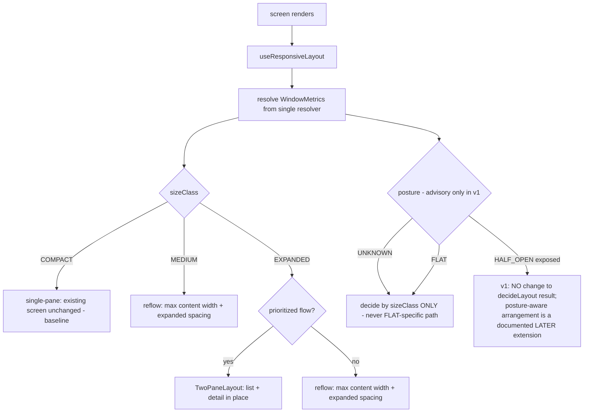

# Design Document: Samsung Optimization (Adaptive Layout & Foldable Support)

## Overview

`samsung-optimization` (Spec 23, Sprint 6 — Polish & Extras) is a **mobile-only, client-only adaptive-presentation layer** over the screens BidClean already ships. It touches **no backend, no money, no domain data, no PostgreSQL, no queue, no realtime channel, no data model**. Its entire job is to make existing screens respond to the **available window** (size class), **orientation**, and **foldable posture** — rendering single-pane on a phone and two-pane (list + detail) when there is room — while guaranteeing that a **fold / unfold / rotate** never loses the user's place or in-progress work, and that the same Expo codebase is **publishable on the Galaxy Store**.

**It is adaptive arrangement, not new features.** The screens and their content are unchanged; this spec only *chooses how to arrange them* and adds responsive spacing/breakpoints on top of the design tokens established by `dark-light-theme` (Spec 24). It reuses those tokens verbatim — **no new colors**.

The authority split, stated precisely (it drives the whole design):

- **A single window-metrics resolver is the one input** that drives layout selection. Layout is a **pure function of `{ sizeClass, orientation, posture, safeAreaInsets, cutout, hinge }`** — never of device brand or model. A Galaxy Z Fold unfolded is simply an `EXPANDED` window and gets the two-pane treatment, exactly like a tablet or a large phone in landscape. There is **no `if (isSamsung)` branch anywhere in app logic**.
- **`useResponsiveLayout()` is the single adaptive contract** every prioritized screen consumes. It returns `{ sizeClass, orientation, posture, isTwoPane, safeAreaInsets, cutout?, hinge? }`. Layout logic is centralized here and in the pure decision functions it calls, so adaptivity is unit-testable by simulating window metrics — **no physical device required**.
- **`posture` is a three-valued enum `{ FLAT, HALF_OPEN, UNKNOWN }`, and `UNKNOWN` is never conflated with `FLAT`.** `UNKNOWN` means the platform does not expose posture; in that case the layout decides by `sizeClass` alone. **In v1, `posture` is advisory-only: it does NOT modify the base `decideLayout()` result (`SINGLE_PANE` / `REFLOW` / `TWO_PANE`), which is fully deterministic from `(sizeClass, isPrioritized)`.** A posture-aware arrangement for `HALF_OPEN` (e.g. content top / controls bottom) is a documented *later extension* (`MAY`), not part of the v1 decision.
- **The adaptive layer causes no observable owned-state loss; existing owners keep their state.** A fold/unfold/rotate is an Android **configuration change within the same running session** (explicitly *not* process death / app restart). The primary guarantee is stated over **observable owned state**: the adaptive re-layout SHALL NOT cause loss, reset, or unintended replacement of the navigation stack/route, form input, in-progress actions (call / tracking / upload / timer / open sheet), scroll position, authenticated session, or theme — each **owned by its existing owner**. Avoiding destructive remounts and preserving stable component identity is the **preferred implementation strategy** for achieving this, not the invariant itself: a component MAY be reconstructed during re-layout provided it rehydrates from its owner with **no observable state loss**.
- **The active two-pane selection lives in navigation/flow state, never in the adaptive container.** So when a two-pane container unmounts on collapse to single-pane, the same detail screen is resolved from the flow's navigation params / shared store — and the reverse hydrates the detail pane from that same selection (REQ-SM5b).
- **Galaxy Store is a publish-readiness target, not a code change.** One Expo codebase → Android AAB → Galaxy Store listing (assets incl. unfolded screenshots, content rating, privacy, signing). It is a build/submission concern captured as readiness requirements + documentation; it does not alter app logic.

### Terminology

> **Window metrics** = the resolved `{ sizeClass, orientation, posture, safeAreaInsets, cutout, hinge }` from the single resolver. **Size class** = coarse width bucket `COMPACT | MEDIUM | EXPANDED`. **Posture** = `FLAT | HALF_OPEN | UNKNOWN` (foldable state; `UNKNOWN` = platform doesn't expose it). **Two-pane** = list + detail side by side on prioritized flows. **Reflow** = non-two-pane screens adapting via expanded spacing + a max readable content width. **Configuration change** = a fold / unfold / rotate that relays out the UI within the running session. **State continuity** = owned state (nav, input, in-progress action, scroll, session, theme) survives a configuration change. **`useResponsiveLayout()`** = the hook exposing the adaptive contract. **Prioritized flow** = a list+detail flow that gets the two-pane treatment (radar+offer, properties+property, activity+item).

### Key Design Decisions

1. **One window-metrics resolver, one adaptive hook, pure decision functions.** Everything keys off the resolver's output; `sizeClass` classification, `isTwoPane` derivation, reflow width clamping, and posture fallback are all **pure functions** with no device-brand parameter — testable in isolation and identical for any device presenting the same window (REQ-SM1, REQ-SM9).
2. **Respond to window/posture, never brand-detect.** The resolver signature has no brand/model field, so "if Samsung" branching is structurally impossible in layout logic. Samsung foldables are the primary *validation* surface; the capability is general and also improves tablets and large-phone landscape (REQ-SM1).
3. **Two-pane only on prioritized flows; reflow everywhere else.** A full two-pane rewrite of every screen is out of scope. The three highest-value list+detail flows get `TwoPaneLayout`; all other screens reflow (max content width + expanded spacing) rather than force a split (REQ-SM3).
4. **Selection lives in navigation/flow state, not the container.** The two-pane container is a *presentation* wrapper. The selected id (`selectedOfferId`, `selectedPropertyId`, `selectedActivityId`) is read from the flow's navigation params / shared store, so collapse→single-pane and expand→two-pane both resolve the same detail from durable flow state, never from state local to the unmountable container (REQ-SM5b).
5. **The adaptive layer never owns owned state, and causes no observable owned-state loss.** The invariant is behavioral: across a configuration change, observable owned state (nav route/stack, form input, in-progress action state, scroll, session, theme) is unchanged. The **preferred mechanism** is to rearrange children with stable React keys/identity so the navigation container, forms, active-action screens, and lists are not destructively remounted; but the spec does not mandate that every component instance avoid unmount — a child MAY be reconstructed as long as it rehydrates from its owner with no observable loss. Continuity is a property of "the adaptive layer only rearranges presentation", not a new persistence mechanism (REQ-SM5).
6. **Reuse Spec 24 tokens and existing components; add only responsive spacing.** Adaptive layouts consume `useTheme()` tokens and compose the existing screen components — no forked screen logic, no new colors; the hex-guard from Spec 24 continues to enforce "no raw hex outside `primitives.ts`" (REQ-SM4).
7. **Named, typed responsive config.** Breakpoints, max content widths, and spacing scales are named constants in a single config module, with size-class/posture/orientation TypeScript enums and no `any` (REQ-SM10).
8. **Galaxy Store publish readiness via config + docs, not code branches.** Store identifiers come from build configuration; readiness artifacts (AAB config, unfolded screenshots, listing metadata) are documented; the single Expo codebase is unchanged (REQ-SM8).

### Responsibility Matrix

| Responsibility | Window-metrics resolver | `useResponsiveLayout()` | Two-pane / reflow containers | Existing screens/owners | OS / Platform | Build/CI |
|----------------|:---:|:---:|:---:|:---:|:---:|:---:|
| Provide raw window dimensions, orientation, insets, cutout, hinge | ❌ | ❌ | ❌ | ❌ | ✅ | ❌ |
| Normalize raw metrics → total `WindowMetrics` (every field valued or unavailable sentinel) | ✅ | ❌ | ❌ | ❌ | ❌ | ❌ |
| Classify `sizeClass` from width (named breakpoints) | ✅ | consumes | ❌ | ❌ | ❌ | ❌ |
| Derive `posture` (FLAT/HALF_OPEN/UNKNOWN) | ✅ | consumes | ❌ | ❌ | provides raw | ❌ |
| Derive `isTwoPane` (pure decision) | ❌ | ✅ | consumes | ❌ | ❌ | ❌ |
| Choose layout (single / two-pane / reflow) | ❌ | ✅ | ✅ (renders) | ❌ | ❌ | ❌ |
| Render content (screens, list items, detail) | ❌ | ❌ | composes | ✅ | ❌ | ❌ |
| Own the active selection (selectedId) | ❌ | ❌ | ❌ (reads only) | ✅ (nav/flow state) | ❌ | ❌ |
| Own navigation stack / route | ❌ | ❌ | ❌ | ✅ (navigation) | ❌ | ❌ |
| Own form input / in-progress action / scroll / session / theme | ❌ | ❌ | ❌ | ✅ (each owner) | ❌ | ❌ |
| Preserve owned state across config change (by not remounting) | ❌ | ❌ | ✅ (obligation: don't cause loss) | ✅ (holds state) | recreates UI | ❌ |
| Apply Spec 24 tokens / spacing | ❌ | provides scale | ✅ | ✅ | ❌ | ❌ |
| Produce AAB / Galaxy Store listing | ❌ | ❌ | ❌ | ❌ | ❌ | ✅ |

## Architecture

### Layered model — platform → resolver → hook → layout → existing screens

```mermaid
flowchart TD
    subgraph Platform[OS / Platform primitives]
        Dims[useWindowDimensions width/height]
        SA[safe-area-context insets]
        Cut[display cutout bounds where present]
        Hinge[fold feature / hinge bounds where exposed]
        Sch[posture / display-feature API where exposed]
    end
    subgraph Resolver[Window-metrics resolver NEW - single source]
        Norm[normalize to TOTAL WindowMetrics\nevery field = value OR defined unavailable sentinel\nnever throws, never assumes a missing metric]
        Cls[classify sizeClass from width\nnamed RESPONSIVE_BREAKPOINTS]
        Post[derive posture FLAT / HALF_OPEN / UNKNOWN\nUNKNOWN != FLAT]
    end
    subgraph Hook[useResponsiveLayout NEW - adaptive contract]
        Dec[pure decideLayout mode, posture, prioritized\n-> single-pane | two-pane | reflow]
        TP[isTwoPane = EXPANDED and prioritized\nposture UNKNOWN -> decide by sizeClass alone]
        Sp[spacing scale + maxContentWidth\nfrom named RESPONSIVE_LAYOUT config]
    end
    subgraph Layouts[Adaptive containers NEW - presentation only]
        Two[TwoPaneLayout list + detail\nreads selectedId from FLOW STATE]
        Re[ReflowContainer max width + expanded spacing]
    end
    subgraph Existing[Existing screens + owners - source of truth]
        Nav[navigation stack + route]
        Screens[radar / properties / activity / others\nreuse Spec 24 tokens]
        Owners[form / call / tracking / upload / list scroll / session / theme]
    end

    Dims --> Norm
    SA --> Norm
    Cut --> Norm
    Hinge --> Norm
    Sch --> Post
    Norm --> Cls
    Cls --> Dec
    Post --> Dec
    Dec --> TP
    TP --> Two
    TP --> Re
    Sp --> Two
    Sp --> Re
    Two --> Screens
    Re --> Screens
    Two -. reads .-> Nav
    Screens --> Owners
```

### Where it lives (mobile only)

```
apps/mobile/src/
├── responsive/                              (NEW — the adaptive layer)
│   ├── windowMetrics.ts                     (resolver: raw platform → TOTAL WindowMetrics; pure normalizers)
│   ├── responsive.constants.ts              (RESPONSIVE_BREAKPOINTS, MAX_CONTENT_WIDTH, SPACING_SCALE, PRIORITIZED_FLOWS)
│   ├── responsive.types.ts                  (SizeClass, Orientation, Posture, LayoutMode enums; WindowMetrics, ResponsiveLayout)
│   ├── classifySizeClass.ts                 (pure: width → SizeClass)
│   ├── derivePosture.ts                     (pure: raw display feature → Posture; UNKNOWN when unavailable)
│   ├── decideLayout.ts                      (pure: (sizeClass, posture, isPrioritized) → LayoutMode + isTwoPane)
│   ├── clampContentWidth.ts                 (pure: (windowWidth) → min(windowWidth, MAX_CONTENT_WIDTH))
│   ├── paneGeometry.ts                      (pure: (window, insets, cutout, hinge) → { listRect, detailRect } non-overlapping, cutout- & hinge-safe)
│   ├── useResponsiveLayout.ts               (hook: resolver → { sizeClass, orientation, posture, isTwoPane, insets, cutout?, hinge? })
│   ├── components/
│   │   ├── TwoPaneLayout.tsx                (generic list+detail container; reads selectedId from flow state; empty-state)
│   │   ├── ReflowContainer.tsx             (max content width + expanded spacing wrapper)
│   │   └── AdaptiveScreen.tsx              (thin wrapper picking single / two-pane / reflow per useResponsiveLayout)
│   ├── __tests__/
│   │   ├── classifySizeClass.spec.ts
│   │   ├── decideLayout.spec.ts
│   │   ├── clampContentWidth.spec.ts
│   │   ├── derivePosture.spec.ts
│   │   ├── windowMetrics.spec.ts
│   │   ├── paneGeometry.spec.ts
│   │   ├── useResponsiveLayout.spec.ts
│   │   ├── stateContinuity.spec.tsx
│   │   ├── TwoPaneLayout.spec.tsx
│   │   └── ReflowContainer.spec.tsx
│   └── README.md
├── screens/
│   ├── radar/          (prioritized flow: radar map + offer detail — wrapped in TwoPaneLayout on EXPANDED)
│   ├── properties/     (prioritized flow: properties list + property detail)
│   ├── offers/ negotiation/ activity  (activity/history list + item — prioritized flow)
│   └── ... (all other screens → ReflowContainer)
└── navigation/         (unchanged owner of stack/route; selection ids live in nav params / shared store)

docs/deployment/galaxy-store.md              (NEW — Galaxy Store readiness: AAB config, listing, unfolded screenshots, current submission reqs)
```

### Layout decision flow



### State continuity across a configuration change (the core correctness invariant)

```mermaid
sequenceDiagram
    participant OS as OS (fold/unfold/rotate)
    participant Adapt as Adaptive layer (useResponsiveLayout + containers)
    participant Nav as Navigation (owns stack/route)
    participant Own as Owners (form/call/tracking/upload/scroll/session/theme)
    participant UI as Rendered UI

    OS->>Adapt: configuration change (new window metrics) — same running session
    Note over Adapt: NOT process death / restart — those are out of scope
    Adapt->>Adapt: recompute sizeClass/posture → recompute layout mode
    Adapt->>UI: re-lay-out; preserve stable keys/identity where practical (preferred), rearrange not reset
    Adapt-->>Nav: navigation stack/route preserved (source of truth = navigation)
    Adapt-->>Own: input/action/scroll/session/theme preserved by their owners (rehydrate if reconstructed)
    Note over Adapt,Own: adaptive layer's obligation: no OBSERVABLE owned-state loss. Each owner keeps its own state.
    UI-->>OS: same place, same work, no crash, no destructive whole-tree remount
```

### Two-pane collapse/expand with selection in flow state (REQ-SM5b)

```mermaid
stateDiagram-v2
    [*] --> Compact
    Compact --> Expanded : window grows (unfold / rotate to landscape)
    Expanded --> Compact : window shrinks (fold / rotate to portrait)

    state Expanded {
        [*] --> TwoPane
        TwoPane : list + detail; detail = resolve(selectedId from FLOW STATE)
    }
    state Compact {
        [*] --> SinglePane
        SinglePane : push nav; visible screen = resolve(selectedId from FLOW STATE)
    }
    note right of Expanded
        selectedId lives in navigation params / shared store,
        NOT in TwoPaneLayout. Container unmount on collapse
        does not clear it → same detail resolves in single-pane.
        Reverse hydrates the detail pane from the same id.
    end note
```



## Components and Interfaces

### Enums and core types (`responsive.types.ts`)

```typescript
// Coarse width bucket — the primary adaptive input. Derived from window width via named breakpoints.
export enum SizeClass {
  COMPACT = 'COMPACT',   // phone (baseline — unchanged)
  MEDIUM = 'MEDIUM',     // large phone landscape / small tablet — reflow
  EXPANDED = 'EXPANDED', // unfolded foldable / tablet / large landscape — two-pane on prioritized flows
}

export enum Orientation {
  PORTRAIT = 'PORTRAIT',
  LANDSCAPE = 'LANDSCAPE',
}

// Foldable posture. UNKNOWN = platform does not expose posture; it is NEVER conflated with FLAT.
export enum Posture {
  FLAT = 'FLAT',
  HALF_OPEN = 'HALF_OPEN',
  UNKNOWN = 'UNKNOWN',
}

// The chosen arrangement for a screen.
export enum LayoutMode {
  SINGLE_PANE = 'SINGLE_PANE',
  TWO_PANE = 'TWO_PANE',
  REFLOW = 'REFLOW',
}

// A rectangle in device-independent pixels (used for pure geometry checks).
export interface Rect { x: number; y: number; width: number; height: number; }

// Safe-area insets — every side always defined (0 when unavailable, never undefined).
export interface SafeAreaInsets { top: number; bottom: number; left: number; right: number; }

// The TOTAL resolved window metrics. Optional platform features use `null` as the DEFINED
// "unavailable" sentinel — never `undefined`, so a screen can never read a metric it doesn't have.
export interface WindowMetrics {
  width: number;
  height: number;
  sizeClass: SizeClass;
  orientation: Orientation;
  posture: Posture;                 // UNKNOWN when the platform does not expose posture
  safeAreaInsets: SafeAreaInsets;   // always populated (0s if unavailable)
  cutout: Rect | null;              // null = no cutout / not exposed (defined unavailable value)
  hinge: Rect | null;               // null = no hinge / not exposed (defined unavailable value)
}

// What useResponsiveLayout() exposes to screens.
export interface ResponsiveLayout {
  sizeClass: SizeClass;
  orientation: Orientation;
  posture: Posture;
  isTwoPane: boolean;               // true iff EXPANDED AND the flow is prioritized
  layoutMode: LayoutMode;
  safeAreaInsets: SafeAreaInsets;
  cutout: Rect | null;
  hinge: Rect | null;
  maxContentWidth: number;          // clamp for reflow (from named config)
  spacing: SpacingScale;            // size-class-scaled spacing (from named config)
}

export type SpacingScale = Readonly<Record<'xs' | 'sm' | 'md' | 'lg' | 'xl', number>>;

// Identifies which prioritized flow a screen belongs to (drives isTwoPane). Non-prioritized => reflow.
export enum PrioritizedFlow {
  RADAR_OFFER = 'RADAR_OFFER',
  PROPERTIES = 'PROPERTIES',
  ACTIVITY = 'ACTIVITY',
}
```

### Named responsive config (`responsive.constants.ts`)

```typescript
// All thresholds are NAMED constants (no scattered magic numbers), typed, no `any`.
// Breakpoints follow the widely-used Material window size-class widths (dp), configurable in one place.
export const RESPONSIVE_BREAKPOINTS = {
  // width < MEDIUM_MIN → COMPACT; [MEDIUM_MIN, EXPANDED_MIN) → MEDIUM; >= EXPANDED_MIN → EXPANDED
  MEDIUM_MIN_DP: 600,
  EXPANDED_MIN_DP: 840,
} as const;

// Reflow: content never stretches edge-to-edge on large windows.
export const MAX_CONTENT_WIDTH_DP = 720;

// Spacing scale per size class (reuses Spec 24 spacing tokens; only the *scale selection* is responsive).
export const SPACING_SCALE: Readonly<Record<SizeClass, SpacingScale>> = {
  [SizeClass.COMPACT]:  { xs: 4, sm: 8,  md: 16, lg: 24, xl: 32 },
  [SizeClass.MEDIUM]:   { xs: 6, sm: 12, md: 20, lg: 28, xl: 40 },
  [SizeClass.EXPANDED]: { xs: 8, sm: 16, md: 24, lg: 36, xl: 48 },
} as const;

// The only flows that receive two-pane treatment; every other screen reflows.
export const PRIORITIZED_FLOWS = [
  PrioritizedFlow.RADAR_OFFER,
  PrioritizedFlow.PROPERTIES,
  PrioritizedFlow.ACTIVITY,
] as const;

// Two-pane split ratio (list : detail) on EXPANDED windows.
export const TWO_PANE_LIST_FRACTION = 0.38;
```

### Window-metrics resolver (`windowMetrics.ts`)

```typescript
// The SINGLE source of window metrics. Pure normalizers + a small hook that reads the platform.
// Every field of the returned WindowMetrics is defined; optional features use `null` as the
// defined "unavailable" value. The resolver NEVER throws and NEVER assumes a metric it lacks.

export function resolveWindowMetrics(raw: RawPlatformMetrics): WindowMetrics;
// raw may have missing insets, no cutout, no hinge, no posture feature — all fold to safe defaults:
//   insets → 0 per missing side; cutout/hinge → null; posture feature absent → Posture.UNKNOWN.

interface RawPlatformMetrics {
  width: number;
  height: number;
  insets?: Partial<SafeAreaInsets> | null;
  cutout?: Rect | null;
  displayFeature?: { kind: 'FOLD'; state?: 'FLAT' | 'HALF_OPENED'; bounds?: Rect } | null;
}

// Hook form used by useResponsiveLayout — wires useWindowDimensions + safe-area-context + display feature.
export function useWindowMetrics(): WindowMetrics;
```

- `resolveWindowMetrics` is a **pure function** so it is fully unit-testable with simulated inputs (REQ-SM9). The hook is a thin adapter that feeds live platform values into it.
- Totality is the contract: for *any* raw input, every `WindowMetrics` field is present (value or `null`/`0`), so downstream code never dereferences an undefined metric (REQ-SM7).

### Pure decision functions

```typescript
// classifySizeClass.ts — width (dp) → SizeClass, using RESPONSIVE_BREAKPOINTS. Exactly one class per width.
export function classifySizeClass(widthDp: number): SizeClass;

// derivePosture.ts — raw display feature → Posture. Absent/unrecognized feature → Posture.UNKNOWN (never FLAT).
export function derivePosture(feature: RawPlatformMetrics['displayFeature']): Posture;

// decideLayout.ts — the core arrangement decision. NO device-brand parameter exists.
export function decideLayout(input: {
  sizeClass: SizeClass;
  posture: Posture;          // UNKNOWN → decide by sizeClass alone (never the FLAT-specific branch)
  isPrioritized: boolean;    // whether the flow is in PRIORITIZED_FLOWS
}): { layoutMode: LayoutMode; isTwoPane: boolean };
// Rule:
//   EXPANDED & isPrioritized      → TWO_PANE  (isTwoPane = true)
//   EXPANDED & !isPrioritized     → REFLOW
//   MEDIUM                        → REFLOW
//   COMPACT                       → SINGLE_PANE (baseline unchanged)
// The result is FULLY DETERMINISTIC from (sizeClass, isPrioritized). In v1 `posture` is advisory-only
// and does NOT change this result for ANY value (FLAT, HALF_OPEN, or UNKNOWN): a HALF_OPEN posture-aware
// arrangement is a documented later extension layered on top, never a different decideLayout output.

// clampContentWidth.ts — reflow width clamp. For all widths: result = min(width, MAX_CONTENT_WIDTH_DP) and result <= width.
export function clampContentWidth(windowWidthDp: number): number;

// paneGeometry.ts — computes non-overlapping, cutout- & hinge-safe list/detail rects for a
// TWO_PANE window. Only ever called for valid TWO_PANE configurations (EXPANDED + prioritized);
// decideLayout is what determines whether TWO_PANE applies at all.
export function computePaneGeometry(input: {
  window: { width: number; height: number };
  insets: SafeAreaInsets;
  cutout: Rect | null;
  hinge: Rect | null;
}): { listRect: Rect; detailRect: Rect };
// Occluded region = union of (safe-area insets) ∪ (cutout when present) ∪ (hinge when present).
// Guarantees: both rects lie within the safe window bounds (respecting insets), are pairwise
// non-overlapping, and neither pane's interactive content region intersects the cutout region
// nor the hinge occlusion region when either is present.
```

### `useResponsiveLayout()` — the adaptive contract (`useResponsiveLayout.ts`)

```typescript
// The single hook prioritized screens consume. Pure logic (resolver + decision functions) behind a hook,
// so it is unit-testable by simulating window sizes/postures with NO physical device (REQ-SM9).
export function useResponsiveLayout(flow?: PrioritizedFlow): ResponsiveLayout;
//  - reads useWindowMetrics()
//  - isPrioritized = flow != null && PRIORITIZED_FLOWS.includes(flow)
//  - { layoutMode, isTwoPane } = decideLayout({ sizeClass, posture, isPrioritized })
//  - maxContentWidth = clampContentWidth(width); spacing = SPACING_SCALE[sizeClass]
//  - returns the full ResponsiveLayout (metrics + decision + spacing)
```

### Adaptive containers (`components/`)

```typescript
// AdaptiveScreen — thin wrapper that picks the arrangement for a screen.
export function AdaptiveScreen(props: {
  flow?: PrioritizedFlow;                 // omitted → non-prioritized → reflow/single per size class
  renderSingle: () => React.ReactNode;    // COMPACT baseline (existing screen, unchanged)
  renderTwoPane?: () => React.ReactNode;  // required only for prioritized flows
  children?: React.ReactNode;             // reflow content when not two-pane
}): React.JSX.Element;

// TwoPaneLayout — generic list+detail container. Selection is READ from flow state, never owned here.
export function TwoPaneLayout<TItem>(props: {
  selectedId: string | null;              // SOURCED FROM navigation params / shared store (REQ-SM5b)
  onSelect: (id: string) => void;         // updates the FLOW's selection state (nav param / store), not local state
  renderList: (args: { selectedId: string | null; onSelect: (id: string) => void }) => React.ReactNode;
  renderDetail: (id: string) => React.ReactNode;   // in-place detail update — NOT a push navigation
  renderEmpty: () => React.ReactNode;              // shown when selectedId === null
}): React.JSX.Element;
//  - list pane + detail pane sized via computePaneGeometry
//  - selecting an item calls onSelect → flow state changes → detail pane updates IN PLACE
//  - holds NO selection state itself, so unmounting on collapse cannot lose the selection

// ReflowContainer — non-prioritized screens on larger windows.
export function ReflowContainer(props: {
  children: React.ReactNode;
}): React.JSX.Element;
//  - centers content, caps width at maxContentWidth, applies size-class spacing; never edge-to-edge stretch
```

### Prioritized flow integration (reuse, no fork — REQ-SM4, REQ-SM5b)

| Flow | List component (existing) | Detail component (existing) | Selection state (owner) |
|------|---------------------------|-----------------------------|-------------------------|
| `RADAR_OFFER` | `screens/radar` map + offer list | offer detail / preview sheet | `selectedOfferId` in radar flow nav param / shared store |
| `PROPERTIES` | `screens/properties` list | property detail | `selectedPropertyId` in properties nav param / store |
| `ACTIVITY` | activity/history list | activity item detail | `selectedActivityId` in activity nav param / store |

Each prioritized screen wraps its **existing** list and detail components in `TwoPaneLayout` on EXPANDED and renders the **same** components single-pane on COMPACT — no forked logic, no duplicated screen. All other screens wrap their existing content in `ReflowContainer`. Colors come exclusively from `useTheme()` (Spec 24) — the adaptive layer introduces no hex.

### Foldable posture & large-screen polish (REQ-SM6, REQ-SM7)

- **In v1, `HALF_OPEN` does not change the layout decision** — `decideLayout` returns the same `SINGLE_PANE` / `REFLOW` / `TWO_PANE` result it would for any posture at the same `sizeClass`. A posture-aware arrangement (e.g. content in the upper half, controls in the lower half) is a documented **later extension** layered on top where the platform exposes `HALF_OPEN` and it adds value; where posture is `UNKNOWN` the layout falls back to the `sizeClass` decision **without error**. This keeps the MVP fully deterministic.
- Safe-area insets, display cutout, and hinge bounds all come from the **single** resolver, each with a defined unavailable value (`0` / `null`). Layout respects them where present (no content under hinge/cutout; correct insets in every posture/orientation) and degrades gracefully when absent.
- In a two-pane map/radar layout, `computePaneGeometry` guarantees the map pane is not clipped by the fold, the display cutout, or the detail pane and remains fully interactive in its own rect. Its occluded region is the union of safe-area insets, cutout, and hinge.

### Galaxy Store publish readiness (REQ-SM8 — build/docs, not code)

- **Single Expo/RN codebase → Android AAB.** No Samsung-brand branching in app logic (structurally guaranteed by the brandless resolver + a CI brand-guard scan). The Galaxy Store AAB is produced from the same codebase and a reproducible Android build configuration, with store-specific metadata and signing supplied by configuration (not a separate code path).
- **Store config from configuration.** Package identifiers and listing metadata are supplied via build config / environment, never hardcoded per-store branches in app logic.
- **Readiness artifacts documented** in `docs/deployment/galaxy-store.md`: listing metadata, app icon, screenshots including **unfolded/large-screen** captures, content rating, privacy policy link, AAB build config, and Samsung's **current** submission requirements (target API level, 64-bit binary, correct signing, applicable binary-compatibility such as 16 KB page-size) — **validated at build time**, with specific version numbers tracked in deployment docs (not hardcoded in this spec, since external requirements change).

## Data Models

This spec has **no database, no API, no server model, no migration**. Its "data models" are the in-memory, on-device value types the adaptive layer computes — all defined above in *Components and Interfaces*:

- `WindowMetrics` — the total, always-populated resolver output (optional features use `null` as the defined unavailable value).
- `ResponsiveLayout` — the `useResponsiveLayout()` return contract consumed by screens.
- `SizeClass`, `Orientation`, `Posture`, `LayoutMode`, `PrioritizedFlow` — typed enums (no `any`).
- `Rect`, `SafeAreaInsets`, `SpacingScale` — pure geometry/spacing value types.

**Selection state is not owned here.** The active two-pane selection (`selectedOfferId`, `selectedPropertyId`, `selectedActivityId`) is owned by each flow's existing navigation params / shared store — the adaptive layer only *reads* it (REQ-SM5b). Likewise navigation, form, in-progress action, scroll, session, and theme state remain owned by their existing owners; the adaptive layer holds none of them.

### No new external dependencies of substance

Uses only libraries already present in the mobile app: `react-native` `useWindowDimensions` (window size + orientation), `react-native-safe-area-context` (insets), React Navigation (owner of stack/route + params for selection), Expo/RN display-feature/posture APIs where exposed (foldable posture; absent → `UNKNOWN`), and `dark-light-theme` (Spec 24) tokens for all colors/spacing seeds. `fast-check` (already a devDependency) backs the property tests. No backend, no PostgreSQL, no queue, no realtime.

## Correctness Properties

*A property is a characteristic or behavior that should hold true across all valid executions of a system — essentially, a formal statement about what the system should do. Properties serve as the bridge between human-readable specifications and machine-verifiable correctness guarantees.*

This feature is a client-only adaptive-presentation layer. Much of it — screen migration to reflow, posture-aware arrangement, Galaxy Store readiness, native-chrome integration, the "no new colors" and "named typed config" rules — is **UI rendering, static analysis, or build/documentation** and is verified by snapshot/render/example tests, CI guards, and deliverable checks, **not** property-based testing. However, a well-defined **pure logic core** — size-class classification, the layout decision, the reflow width clamp, the selection round-trip, state-continuity preservation, resolver totality, pane geometry, and i18n key parity — is universally quantifiable over a real input space, so those get property-based tests. Each property below is universally quantified, testable by simulating window metrics (no physical device), and maps back to the acceptance criteria and the `REQ-SM` invariants.

### Property 1: Size-class classification is total and deterministic

*For all* window widths `w` (any finite non-negative dp value), `classifySizeClass(w)` SHALL return exactly one `SizeClass` according to the named `RESPONSIVE_BREAKPOINTS`: `COMPACT` when `w < MEDIUM_MIN_DP`, `MEDIUM` when `MEDIUM_MIN_DP <= w < EXPANDED_MIN_DP`, and `EXPANDED` when `w >= EXPANDED_MIN_DP`. The classification SHALL be monotonic in `w` (a larger width never maps to a smaller size class) and SHALL depend only on the width — never on any device brand/model (no such parameter exists).

**Validates: Requirements 1.1, 1.4, 1.5** · REQ-SM1

### Property 2: Layout decision — two-pane vs single vs reflow, with posture-UNKNOWN fallback and no brand input

*For all* combinations of `sizeClass ∈ {COMPACT, MEDIUM, EXPANDED}`, `posture ∈ {FLAT, HALF_OPEN, UNKNOWN}`, and `isPrioritized ∈ {true, false}`, `decideLayout` SHALL return: `TWO_PANE` with `isTwoPane = true` iff `sizeClass = EXPANDED ∧ isPrioritized`; `REFLOW` when (`sizeClass = EXPANDED ∧ ¬isPrioritized`) or `sizeClass = MEDIUM`; and `SINGLE_PANE` when `sizeClass = COMPACT`. In v1 the decision SHALL be **fully deterministic from `(sizeClass, isPrioritized)` and independent of `posture` for ALL three posture values** — `FLAT`, `HALF_OPEN`, and `UNKNOWN` all yield exactly the same result as the size-class-only decision, and `UNKNOWN` is never routed through a `FLAT`-specific branch — and SHALL have no device-brand parameter, so any two inputs with equal `(sizeClass, isPrioritized)` produce the identical decision regardless of posture or brand.

**Validates: Requirements 1.2, 1.3, 1.4, 2.1, 2.3, 4.1** · REQ-SM1, REQ-SM2, REQ-SM3, REQ-SM6

### Property 3: Reflow content-width clamp and spacing-scale monotonicity

*For all* window widths `w`, `clampContentWidth(w)` SHALL equal `min(w, MAX_CONTENT_WIDTH_DP)`, and therefore SHALL always satisfy `result <= w` and `result <= MAX_CONTENT_WIDTH_DP` (content never stretches edge-to-edge beyond the cap and never exceeds the window). Additionally, *for all* size-class pairs ordered `COMPACT < MEDIUM < EXPANDED`, each key of `SPACING_SCALE` SHALL be non-decreasing across that order (spacing scales up, never down, on larger windows).

**Validates: Requirements 2.3, 4.2** · REQ-SM3, REQ-SM7

### Property 4: In-place detail resolution from selection

*For all* lists of items and *for all* selected ids `s`, when `s` is a non-null id present in the list, `TwoPaneLayout` SHALL render the detail produced by `renderDetail(s)` in the detail pane (an in-place update, not a push navigation); when `s` is `null`, it SHALL render the empty state. The detail pane SHALL always correspond to exactly the current `selectedId` supplied by the flow.

**Validates: Requirements 2.2** · REQ-SM3

### Property 5: Selection lives in flow state — collapse/expand round-trip resolves the same detail

*For all* selected ids `s` held in the flow's navigation/shared state and *for all* finite sequences of size-class transitions (e.g. `EXPANDED → COMPACT → EXPANDED`, including repeated fold/unfold/rotate), the detail resolved for display SHALL always equal `resolve(s)` regardless of which arrangement is active: in `TWO_PANE` the detail pane resolves `s`, and after collapsing to `SINGLE_PANE` the visible detail screen resolves the same `s`. Because `s` is owned by navigation/flow state and not by the adaptive container, unmounting the container on collapse SHALL NOT change or clear `s`, and re-expanding SHALL hydrate the detail pane from the same `s`.

**Validates: Requirements 2.4** · REQ-SM5b

### Property 6: State continuity — a configuration change preserves all observable owned state and does not destructively remount the tree

*For all* owned-state snapshots (navigation stack + route, form input, in-progress action state such as an active call/tracking/upload/timer/open sheet, list scroll offset, authenticated session, and active theme) and *for all* finite sequences of configuration-change events (fold / unfold / rotate) applied within the same running session, the adaptive re-layout SHALL be an **identity over observable owned state**: each owner's observable state after the sequence SHALL equal its observable state before, and no event SHALL cause a crash or a destructive whole-tree remount. This is asserted over the **observable state**, not over the internal lifecycle of individual component instances — a child MAY be reconstructed provided it rehydrates from its owner with no observable difference. Preserving stable component identity (not tearing down the navigation container / owners) is the preferred means of satisfying this and is exercised where practical, but the invariant is the observable-state equality, not "no instance ever unmounted". (Scope: within-session configuration changes only — process death / app restart is explicitly out of scope.)

**Validates: Requirements 3.1, 3.2, 3.3, 3.4, 3.5** · REQ-SM5

### Property 7: Window-metrics resolver totality

*For all* raw platform inputs — including inputs with missing/partial safe-area insets, no display cutout, no hinge/fold feature, and no exposed posture — `resolveWindowMetrics` SHALL return a `WindowMetrics` in which **every field is defined**: `sizeClass`, `orientation`, and `posture` are valid enum values (`posture = UNKNOWN` when unexposed), `safeAreaInsets` has all four sides numeric (`0` where unavailable), and `cutout`/`hinge` are either a valid `Rect` or the defined `null` unavailable sentinel — never `undefined`. The resolver SHALL never throw for any input, so downstream code can never read a metric it does not have.

**Validates: Requirements 4.3** · REQ-SM7

### Property 8: Two-pane geometry is within bounds, non-overlapping, and cutout- & hinge-safe across the two-pane-applicable universe

*For all* window sizes and orientations in the **two-pane-applicable universe** — i.e. valid `TWO_PANE` configurations only (`EXPANDED` on a prioritized flow, across `{PORTRAIT, LANDSCAPE}`), with or without a display cutout, and with or without a hinge — `computePaneGeometry` SHALL produce a `listRect` and `detailRect` that both lie entirely within the safe window bounds (respecting `safeAreaInsets`), are pairwise **non-overlapping**, each meet a minimum usable size, and — when a cutout `Rect` and/or a hinge `Rect` is present — neither pane's interactive content region intersects the cutout region **nor** the hinge occlusion region. (Whether a configuration is `TWO_PANE` at all is decided by `decideLayout`, not by this function; `computePaneGeometry` is exercised and quantified only over configurations for which `TWO_PANE` applies.) No such configuration SHALL yield clipped, overlapping, or unusable pane geometry.

**Validates: Requirements 4.4, 4.5** · REQ-SM7

### Property 9: i18n en/es parity for adaptive labels

*For all* adaptive/responsive i18n keys `key` introduced for adaptive UI states, `key` SHALL exist and resolve to a non-empty string in **both** the `en` and `es` locales — the two locales expose an identical set of adaptive keys with no missing or empty translation on either side.

**Validates: Requirements 6.3** · REQ-SM10

> **Not expressed as properties (verified otherwise):** named/typed config with no magic numbers and no `any` (Req 1.5, 6.1) is a **compile-time + static** guarantee (`tsc --noEmit`, `eslint @typescript-eslint/no-explicit-any`, constants referenced from `responsive.constants.ts`); reuse of Spec 24 tokens and no new colors (Req 2.5, 6.2) is a **CI hex-guard scan** plus import assertions; COMPACT baseline appearance (Req 1.3) and the optional `HALF_OPEN` posture-aware arrangement (Req 4.1) are **snapshot/example** tests; no-brand-branching + single-codebase AAB + store config + CI fit + current submission requirements + readiness artifacts (Req 5.1–5.6) are **build-time checks, a brand-guard scan, and documentation-presence** deliverables; testability without devices (Req 6.4) is satisfied by design (pure resolver + injectable metrics) and demonstrated by the property tests themselves; documentation (Req 6.5) is a **deliverable presence** check.

## Error Handling

| Condition | Behavior |
|-----------|----------|
| Platform does not expose foldable posture | `derivePosture` → `Posture.UNKNOWN`; layout decides by `sizeClass` alone; never conflated with `FLAT`; no error. In v1 posture never changes the decision regardless (Req 1.2, 4.1) |
| Safe-area insets missing/partial | Missing sides resolve to `0` in `safeAreaInsets`; layout still respects the sides it has; never reads `undefined` (Req 4.3) |
| No display cutout / no hinge exposed | `cutout` / `hinge` resolve to the defined `null` sentinel; geometry proceeds without a hinge occlusion region (Req 4.3) |
| Window width at an exact breakpoint boundary | `classifySizeClass` is deterministic at boundaries per the named thresholds (`>=` upper bound wins); exactly one class (Req 1.1) |
| Zero/degenerate window dimensions during a transition | Resolver still returns a total `WindowMetrics`; decision falls back to `SINGLE_PANE` (safest baseline) rather than throwing (Req 3.5, 4.5) |
| Prioritized screen missing `renderTwoPane` on EXPANDED | Fall back to `renderSingle` (reflowed) rather than crash; logged in dev as a misuse warning (Req 2.3) |
| Configuration change (fold/unfold/rotate) mid-session | Adaptive layer re-lays out; observable owned state (nav/input/action/scroll/session/theme) is unchanged; stable identity is preserved where practical (preferred), a child may be reconstructed only if it rehydrates with no observable loss; no crash, no destructive whole-tree remount (Req 3.1–3.5) |
| Selection id no longer resolvable (item removed) after a transition | `TwoPaneLayout` renders the empty state; collapse resolves to the flow's default/empty screen — never a crash (Req 2.2, 2.4) |
| Posture-aware arrangement (later extension) requested where posture unavailable | Silently fall back to the size-class arrangement (the `MAY` extension is skipped); v1 decision is unaffected either way; no error (Req 4.1) |
| A supported configuration would clip/overlap | Caught by the geometry property test (Property 8) in CI before ship; geometry is corrected, not shipped broken (Req 4.5) |
| Adaptive UI text key missing in a locale | Caught by the i18n parity property (Property 9) in CI; i18next fallback prevents a runtime crash but CI blocks the gap (Req 6.3) |
| Galaxy Store build fails a current Samsung requirement (target API, 64-bit, signing, page size) | Caught at build time; deployment docs track the current requirement; the app codebase is unchanged (Req 5.6) |

No error path renders a clipped/overlapping layout, causes observable owned-state loss on a configuration change, or introduces brand-based branching — the resolver is total, the decision functions are pure, and the adaptive layer never owns owned state (rearranging presentation with stable identity preferred, reconstruction allowed only when it rehydrates with no observable loss).

## Testing Strategy

Property-based testing **applies to the pure logic core** of this feature — size-class classification, the layout decision (including the posture-`UNKNOWN` fallback and the absence of any brand parameter), the reflow width clamp + spacing monotonicity, in-place detail resolution, the selection round-trip, state-continuity preservation, resolver totality, pane geometry over the two-pane-applicable universe, and i18n key parity — because each is a genuine "for all inputs, property holds" statement over a meaningful input space that can be exercised by **simulating window metrics with no physical device** (REQ-SM9). Property-based testing **does not apply** to the UI-rendering parts (COMPACT baseline appearance, posture-aware arrangement rendering, migrated-screen reflow snapshots), the static/config guarantees, or the build/documentation deliverables; those use snapshot, render, and example tests, CI guards, and presence checks. `useWindowDimensions`, `react-native-safe-area-context`, the platform display-feature/posture API, and navigation are mocked/injected so the logic is tested in isolation from the device.

### Property-Based Tests (fast-check)

Library: **`fast-check`** (already a `devDependency`), matching sibling specs. Each property test runs **minimum 100 iterations** and is tagged with a comment: `// Feature: samsung-optimization, Property N: <title>`.

| Property | What to Generate | What to Assert |
|----------|------------------|----------------|
| P1 Size-class classification | Arbitrary non-negative widths (incl. values around `MEDIUM_MIN_DP` / `EXPANDED_MIN_DP`) | Exactly one `SizeClass` per the named breakpoints; monotonic in width; no brand input exists |
| P2 Layout decision | `sizeClass × posture × isPrioritized` (all combinations, generated) | `TWO_PANE` iff `EXPANDED ∧ prioritized`; `REFLOW` for MEDIUM / EXPANDED-non-prioritized; `SINGLE_PANE` for COMPACT; result is invariant across ALL posture values (FLAT/HALF_OPEN/UNKNOWN) in v1, UNKNOWN never routed through a FLAT branch; equal `(sizeClass, isPrioritized)` → equal decision |
| P3 Reflow clamp + spacing | Arbitrary widths; the `SPACING_SCALE` map | `clampContentWidth(w) == min(w, MAX_CONTENT_WIDTH_DP)` and `<= w`; each spacing key non-decreasing across COMPACT→MEDIUM→EXPANDED |
| P4 In-place detail resolution | Random item lists + a selected id (null or an item's id) | Non-null present id → detail pane == `renderDetail(id)`; null → empty state; detail always matches current `selectedId` |
| P5 Selection round-trip | A selected id in a flow-state fake + arbitrary size-class transition sequences | Resolved detail always equals `resolve(s)` in both two-pane and single-pane; container unmount on collapse does not clear/alter `s`; re-expand hydrates from `s` |
| P6 State continuity | Arbitrary owned-state snapshots (nav/form/action/scroll/session/theme) + arbitrary config-change sequences | Observable state after == before (identity over observable owned state); no crash; no destructive whole-tree remount. Asserted over observable state, not per-instance lifecycle; stable identity checked where practical (preferred), reconstruction acceptable if it rehydrates with no observable loss |
| P7 Resolver totality | Arbitrary/partial raw platform inputs (missing insets, no cutout, no hinge, no posture feature) | Every `WindowMetrics` field defined (valid enum / numeric insets / `Rect`-or-`null`); never `undefined`; never throws; `posture = UNKNOWN` when unexposed |
| P8 Pane geometry | Two-pane-applicable configs only (EXPANDED + prioritized) × orientations, with/without cutout AND with/without hinge, + insets | `listRect`/`detailRect` within safe bounds, non-overlapping, each ≥ min usable size, neither intersects the cutout region nor the hinge occlusion region when present |
| P9 i18n en/es parity | Enumerate adaptive/responsive i18n keys | Each key present and non-empty in both `en` and `es`; identical adaptive-key set |

### Unit / Example Tests (Jest + @testing-library/react-native)

- **Breakpoint boundaries (Req 1.1, 1.5):** `classifySizeClass(MEDIUM_MIN_DP - 1) === COMPACT`, `classifySizeClass(MEDIUM_MIN_DP) === MEDIUM`, `classifySizeClass(EXPANDED_MIN_DP) === EXPANDED`; thresholds read from `RESPONSIVE_BREAKPOINTS`.
- **COMPACT baseline unchanged (Req 1.3):** for each prioritized flow, `useResponsiveLayout` at a COMPACT width yields `layoutMode === SINGLE_PANE`; a COMPACT render matches the pre-existing single-pane snapshot (baseline not regressed).
- **`useResponsiveLayout` contract (Req 1.2):** with mocked window metrics, the hook returns `{ sizeClass, orientation, posture, isTwoPane, layoutMode, safeAreaInsets, cutout, hinge, maxContentWidth, spacing }`; `isTwoPane === (sizeClass === EXPANDED && isPrioritized)`.
- **Two-pane in-place update (Req 2.2):** selecting an item calls `onSelect` (which updates flow state) and the detail pane updates without a navigation push; null selection renders the empty state.
- **Collapse/expand selection source (Req 2.4):** with `selectedId` in a flow-state fake, simulate EXPANDED→COMPACT; assert the single-pane visible detail resolves the same id and that `TwoPaneLayout` holds no local selection state (unmount does not clear it).
- **State continuity (Req 3.1–3.5):** render a tree with a mounted form + a stubbed active-action owner + a scrollable list under the adaptive layer; simulate a dimensions/posture change; assert the observable state — form value, action-owner state, scroll offset, session, and theme — is unchanged and no crash/destructive whole-tree remount occurs. Stable identity (no navigation-container/owner teardown) is checked as the preferred path; a reconstructed child passes as long as it rehydrates with no observable difference.
- **Posture fallback / v1 determinism (Req 4.1):** `derivePosture(null) === UNKNOWN`; a screen with `posture = UNKNOWN` renders the size-class layout without error; `decideLayout` returns the same result for `FLAT`, `HALF_OPEN`, and `UNKNOWN` at a given `(sizeClass, isPrioritized)` (v1 determinism). Any `HALF_OPEN` posture-aware arrangement is validated separately as the documented later extension.
- **Resolver unavailable values (Req 4.3):** `resolveWindowMetrics` with missing insets → `0`s; no cutout/hinge → `null`; assert no field is `undefined`.
- **Pane geometry non-overlap + cutout + hinge (Req 4.4):** for a representative unfolded (EXPANDED) window with a hinge rect and a display-cutout rect, assert map and detail rects are disjoint and clear of both the hinge and the cutout.
- **Reflow container (Req 2.3, 4.2):** on a wide window, `ReflowContainer` caps rendered content width at `maxContentWidth` and centers it; non-prioritized flow never selects `TWO_PANE`.
- **Appearance selector / adaptive text (Req 6.3):** any adaptive UI strings render from i18n keys (`en`/`es`).

### Snapshot / Migration Tests (Req 2.5, reuse — REQ-SM4)

- **Reuse, no fork:** each prioritized two-pane flow composes the **existing** list and detail components (import assertions); the two-pane render and the single-pane render use the same underlying components.
- **Reflow smoke per adapted screen:** each non-prioritized screen renders without error under MEDIUM/EXPANDED with no clipped content and colors sourced only from `useTheme()`.
- **Two-pane render (radar/properties/activity):** EXPANDED render shows list + detail side by side; selecting updates detail in place.

### Static / Compile / CI Guards (Req 1.5, 2.5, 5.1, 5.3, 6.1, 6.2)

- **Brand-guard scan:** a CI check greps app logic for device-brand branching (e.g. `isSamsung`, brand/model comparisons in layout code) and fails if any appear — layout must key only off window metrics (REQ-SM1, Req 5.1).
- **Hex-guard scan:** the existing Spec 24 hex-guard is extended to the `responsive/` layer — no raw `#RRGGBB`/`rgba(...)` outside `primitives.ts`; adaptive layouts use `useTheme()` tokens only (Req 2.5, 6.2).
- **Type / no-`any`:** `tsc --noEmit` proves the enums/config are typed and a bad size-class/posture value is a compile error; `eslint` (`@typescript-eslint/no-explicit-any`) enforces no `any` in the adaptive layer (Req 6.1).
- **Named-config check:** breakpoints, max content width, spacing scale, and prioritized-flow list are all referenced from `responsive.constants.ts` (no scattered literals) (Req 1.5, 6.1).

### Build / Readiness Checks (Req 5.1–5.6 — REQ-SM8)

- **Single-codebase AAB:** the mobile build produces an Android AAB from the same Expo codebase and a reproducible Android build configuration with no per-store code branch; store-specific metadata and signing are supplied by configuration.
- **Current submission requirements:** build-time validation of target API level, 64-bit binary, correct signing, and applicable binary-compatibility (e.g. 16 KB page size); the current required values are tracked in `docs/deployment/galaxy-store.md`, not hardcoded in this spec.
- **Readiness artifacts present:** listing metadata, icon, unfolded/large-screen screenshots, content rating, and privacy link documented and checked in CI/review.

### CI scope

Mobile is verified locally and in CI via `tsc --noEmit` + `eslint src/` + `jest` (with `fast-check`); there is no backend surface for this spec, so no API/DB jobs are involved. All adaptive property/unit tests run against simulated window metrics — no device farm required (REQ-SM9).

## Cross-Module Contracts (consumed / emitted)

- **Consumes** `react-native` `useWindowDimensions` (window size + orientation, live), `react-native-safe-area-context` (insets), the platform foldable display-feature/posture API where exposed (absent → `Posture.UNKNOWN`), React Navigation (owner of the stack/route and the params that hold each flow's selection id), and `dark-light-theme` (Spec 24) `useTheme()` tokens for every color and the spacing seeds. All already present in the mobile app.
- **Consumes** the existing `i18n` layer for any adaptive UI strings (`en`/`es` parity).
- **Exposes** `useResponsiveLayout()`, `AdaptiveScreen`, `TwoPaneLayout`, `ReflowContainer`, the window-metrics resolver, and the `SizeClass` / `Orientation` / `Posture` / `LayoutMode` / `WindowMetrics` / `ResponsiveLayout` types for prioritized and future screens to consume. This is the app-wide adaptive-layout contract.
- **Reads (does not own)** each prioritized flow's selection id from navigation params / shared store, and reads — but never owns or resets — navigation, form, in-progress action, scroll, session, and theme state; across a configuration change it guarantees **no observable owned-state loss** (stable identity preferred, reconstruction allowed only if it rehydrates with no observable loss) (REQ-SM5, REQ-SM5b).
- **Does not** add backend, API, DB, money, or domain data; does not persist or sync layout state (layout is ephemeral from the current window/posture); does not fork or restyle screens; does not add new colors or a UI component library; does not branch on device brand; does not change the CI/CD architecture (Galaxy Store fits the existing single-codebase build) (Non-Goals).

## Documentation Impact

- **READMEs:** new `apps/mobile/src/responsive/README.md` (the resolver → hook → layout model, `useResponsiveLayout` contract, two-pane vs reflow, the "selection lives in flow state" rule, the no-brand-detection and no-new-color rules, and how to make a screen adaptive). Update `apps/mobile/src/navigation/README.md` to note that selection ids live in navigation/flow state for two-pane collapse/expand.
- **`docs/ARCHITECTURE.md`:** add the adaptive-presentation layer to the mobile frontend diagram — the single window-metrics resolver feeding `useResponsiveLayout`, and the two-pane/reflow containers wrapping existing prioritized/other screens. Not a new external integration, so no system-context service is added.
- **`docs/deployment/galaxy-store.md`:** new deployment doc — single-codebase AAB build config, Galaxy Store listing artifacts (incl. unfolded screenshots), content rating, privacy link, and Samsung's current submission requirements (target API, 64-bit, signing, page-size) tracked here rather than hardcoded.
- **`docs/CHANGELOG.md`:** `[Unreleased]` entries for feature `samsung-optimization`: window-metrics resolver + `useResponsiveLayout`, two-pane prioritized flows, reflow for other screens, state-continuity guarantee across fold/unfold/rotate, and Galaxy Store publish readiness.
- **ADR:** a new `docs/ADR/0NN-window-driven-adaptivity.md` recording the decisions — window/posture-driven adaptivity (never brand detection), two-pane on prioritized flows with selection in navigation/flow state, the adaptive layer causing no state loss, and Galaxy Store publishing from a single Expo codebase — following the existing ADR format (next sequential number).
- **`.kiro/specs/ROADMAP.md`:** mark Spec 23 status on completion.
- **Steering/hooks:** the existing clean-code and documentation rules already cover the no-hardcoded-values and no-`any` guarantees; the brand-guard is best added as a small CI/lint check alongside the existing Spec 24 hex-guard rather than a new steering file.
