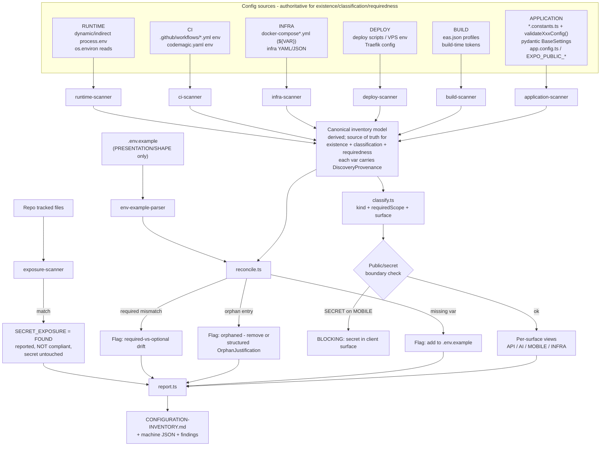

# Design Document

## Overview

The `secrets-inventory` module is a **meta / operational spec**: it produces the single, complete catalog of every external configuration input BidClean needs across four surfaces (API, AI, MOBILE, INFRA), reconciles the committed `.env.example` against that catalog, enforces the hard public/secret boundary, classifies each variable by `requiredScope`, produces a deterministic bring-up runbook, and reports (never rotates) any `SECRET_EXPOSURE` finding.

It is **not** a new product feature. It ships no user-facing runtime behavior and introduces no new database tables. Its deliverables are:

1. A **derived inventory catalog** — a machine-checkable list of every variable `{ name, surface, group, kind, requiredScope, envApplicability, placeholder, consumedBy, sourceType, sourceFile, sourceLocation }`, generated from the full configuration-source taxonomy (APPLICATION | BUILD | DEPLOY | INFRA | CI | RUNTIME) — not just `*.constants.ts` — with each variable recording *where it was discovered*, and reconciled into `.env.example`.
2. A **reconciled `.env.example`** — the source of truth for variable *shape* (names, grouping, placeholders, required/optional), extending the existing sectioned format so nothing is missing and nothing is orphaned.
3. **Reconciliation tooling** — a script/test that parses the validators + `.env.example`, computes the diff (missing / orphaned / mismatched), and fails CI when they drift.
4. A **secret-exposure & hygiene scanner** — runs `git check-ignore`, a tracked-file scan, and a secret-pattern scan; surfaces findings without touching any credential.
5. A **bring-up runbook** + **inventory doc** + **ADR-010** + ARCHITECTURE/CHANGELOG updates.

### Authority chain (the design's spine)

Every decision below flows from this one-directional chain. The **canonical inventory model** (the in-memory `ConfigVariable[]` catalog) is the single derived source of truth; `.env.example` is *generated/reconciled from* that model, never the other way around:

```
CODE / CONFIG SOURCES  →  CANONICAL INVENTORY MODEL  →  .env.example        →  RUNTIME ENV / Vault
  (existence,               (derived catalog:            (generated/reconciled  (actual values)
   classification,           the source of truth for      PRESENTATION/SHAPE
   requiredness)             existence + classification    ONLY)
                             + requiredness)
```

- **Code/config sources are authoritative for existence, classification, and requiredness.** A variable is "real" only because some source reads it — see the configuration-source taxonomy (APPLICATION | BUILD | DEPLOY | INFRA | CI | RUNTIME) below. Existence is never inferred from `.env.example`.
- **The canonical inventory model is the derived source of truth.** It is reconciled against the code/sources, never invented, and it — not `.env.example` — decides what a variable *is* (its `kind`, `surface`, `requiredScope`, `envApplicability`).
- **`.env.example` is authoritative for PRESENTATION/SHAPE ONLY** — variable names, section grouping, safe placeholders, and required/optional annotations *as documentation*. It is **never** authoritative for a variable's existence, classification, or requiredness; those come from the canonical model. `.env.example` MAY NOT declare a variable the canonical model does not recognize. It is a generated/reconciled projection of the model.
- **Runtime env / Vault holds actual values**, operator-supplied, never committed. The mobile client receives `EXPO_PUBLIC_*` values only.

Because `.env.example` is a projection, `report.ts` (which emits both the inventory doc and the reconciled `.env.example` shape) reads from the canonical model in one direction only — it renders the model into presentation artifacts and never treats `.env.example` as an authority feeding back into the catalog.

### Explicit scope boundaries (carried from requirements)

- **No rotation, revocation, regeneration, relocation, or staging** of any credential this iteration. Deferred to separate secrets-security work.
- **A discovered real secret in a committed/tracked artifact is a blocking finding** (`SECRET_EXPOSURE = FOUND`): reported, config NOT marked compliant, secret left untouched.
- **Ends at "configured & startup-valid"** (validators pass), NOT "operational/healthy" (that is `full-audit`/deployment-readiness).

## Architecture

### Where the inventory lives

The inventory is a tooling + documentation artifact, not a NestJS module with controllers. It lives in a dedicated tooling location and produces committed docs:

```
tools/config-inventory/
  inventory.model.ts        # types: ConfigVariable, Surface, Kind, RequiredScope,
                            #        SourceType, DiscoveryProvenance, OrphanJustification, Finding
  sources/                  # one dedicated scanner PER configuration-source type
                            # (NOT one heuristic scanner) — each emits DiscoveryProvenance
    application-scanner.ts  # APPLICATION: *.constants.ts + validateXxxConfig() keys,
                            #   pydantic BaseSettings, app.config.ts / Expo config,
                            #   EXPO_PUBLIC_* usage, indirectly-propagated config
    build-scanner.ts        # BUILD: eas.json build profiles, Expo build-time config, build tokens
    deploy-scanner.ts       # DEPLOY: deployment scripts, VPS env manifests, Traefik config
    infra-scanner.ts        # INFRA: docker-compose*.yml (incl. ${VAR} interpolation), infra YAML/JSON
    ci-scanner.ts           # CI: .github/workflows/*.yml env, codemagic.yaml env
    runtime-scanner.ts      # RUNTIME: dynamic/indirect process.env / os.environ reads
    env-example-parser.ts   # parses .env.example into shape entries (presentation input only)
  reconcile.ts              # diff engine: missing / orphaned / mismatched
  classify.ts               # kind (SECRET|CONFIG|PUBLIC) + requiredScope + surface
  exposure-scanner.ts       # git check-ignore + tracked-file scan + secret-pattern scan
  report.ts                 # renders canonical model → inventory doc + .env.example + JSON + findings
  inventory.cli.ts          # entry point (also runnable in CI)

docs/
  CONFIGURATION-INVENTORY.md  # the maintained, human-facing inventory doc (placeholders only)
  ADR/010-configuration-inventory-and-secret-boundary.md
```

The reconciliation and exposure checks are also wired as a **CI job** and a **test suite**, so drift and exposure fail loudly rather than silently rot.

#### Configuration-source taxonomy

Because a real external configuration input can enter through many surfaces — not just `*.constants.ts` — completeness is defined against an explicit taxonomy, with a dedicated scanner per source type. Each variable records which source type discovered it and exactly where:

| `sourceType` | What it covers | Representative source files |
|--------------|----------------|-----------------------------|
| `APPLICATION` | Values an app surface reads through its normal config layer | `services/api/src/**/*.constants.ts`, `validateXxxConfig()`, pydantic `BaseSettings`, `apps/mobile/app.config.ts`, `EXPO_PUBLIC_*` usage, config that propagates indirectly to another module |
| `BUILD` | Values needed to build a client artifact | `apps/mobile/eas.json` build profiles, Expo build-time config, build-time `EXPO_PUBLIC_*` tokens |
| `DEPLOY` | Values needed to deploy but not to run locally | deployment scripts, VPS env manifests, Traefik labels/config |
| `INFRA` | Service bootstrap values for containers | `docker-compose*.yml` (including `${VAR}` shell interpolation), infra YAML/JSON |
| `CI` | Values injected by the CI/build system | `.github/workflows/*.yml` `env:` blocks, `codemagic.yaml` env |
| `RUNTIME` | Dynamic/indirect `process.env` / `os.environ` reads not captured by the APPLICATION layer | any surface performing a non-declarative env read |

A variable may be discovered by more than one source (e.g. `DATABASE_URL` appears in both INFRA compose and APPLICATION reads); the inventory records the full provenance set so completeness is audited against **every** source type, not just constants files. This is the taxonomy that Property 1 (completeness) is defined against.

### Data-flow: how the catalog is derived and checked



### Configuration surfaces (grounded in the real codebase)

| Surface | Runtime home | Reads config via | Never holds |
|---------|-------------|------------------|-------------|
| **API** (NestJS) | server `.env` / VPS env / Vault | `*.constants.ts` consts + `validateXxxConfig()` in `onModuleInit` | — |
| **AI** (FastAPI) | its own `.env` | pydantic `BaseSettings` (`KYCSettings`, etc.) | object-storage credentials (Option A) |
| **MOBILE** (Expo) | build-time `EXPO_PUBLIC_*` | `process.env.EXPO_PUBLIC_*` + Expo config plugin | any SECRET |
| **INFRA** (compose) | service env in `docker-compose*.yml` | container env | — |

The validator pattern is already uniform across the API: each module has a `*.constants.ts` that reads `process.env.X ?? default`, and exports a `validateXxxConfig()` invoked from the module's `onModuleInit()`. The `application-scanner` keys off exactly this pattern for the APPLICATION source type — but it is only one of six scanners. Completeness comes from covering the full source taxonomy (APPLICATION | BUILD | DEPLOY | INFRA | CI | RUNTIME), so build profiles, CI env, compose interpolation, deploy scripts, and indirect reads are captured too, not just the code in `*.constants.ts`.

## Components and Interfaces

### 1. Inventory model (`inventory.model.ts`)

The core type. `requiredScope` is a discriminated set, never a bare boolean, so prod-only / build-time / infra-only requirements are represented faithfully.

```typescript
export type Surface = 'API' | 'AI' | 'MOBILE' | 'INFRA';

export type Kind = 'SECRET' | 'CONFIG' | 'PUBLIC';

/**
 * Which configuration-source type discovered a variable.
 * Completeness is defined against this full taxonomy, not just constants files.
 */
export type SourceType =
  | 'APPLICATION' // *.constants.ts + validateXxxConfig(), pydantic, app.config.ts, EXPO_PUBLIC_* usage
  | 'BUILD'       // eas.json build profiles, Expo build-time config, build-time tokens
  | 'DEPLOY'      // deployment scripts, VPS env manifests, Traefik config
  | 'INFRA'       // docker-compose*.yml (incl. ${VAR} interpolation), infra YAML/JSON
  | 'CI'          // .github/workflows/*.yml env, codemagic.yaml env
  | 'RUNTIME';    // dynamic/indirect process.env / os.environ reads

/** Where a variable was discovered — its discovery provenance. */
export interface DiscoveryProvenance {
  readonly sourceType: SourceType;
  readonly sourceFile: string;     // e.g. "services/api/src/payments/payments.constants.ts"
  readonly sourceLocation: string; // line number or section, e.g. "L42" or "jobs.api-tests.env"
}

/**
 * WHAT scope requires the variable. This axis is ORTHOGONAL to environment
 * applicability: it says which lifecycle scope needs the value, never in which
 * environments. Environment semantics live exclusively in `envApplicability`.
 */
export type RequiredScope =
  | 'runtime'  // a fail-fast validator rejects startup without it
  | 'build'    // needed at build-time (e.g. an EXPO_PUBLIC_* token)
  | 'deploy'   // needed to deploy (VPS/deploy scripts) but not local runtime
  | 'infra';   // needed by a docker-compose service bootstrap

/**
 * WHICH environments the variable applies to. This is the ONLY place
 * environment semantics are expressed (orthogonal to `requiredScope`).
 */
export type EnvApplicability = ReadonlyArray<'local' | 'staging' | 'production'>;

/** Structured justification for a deliberately-kept orphan — never free text. */
export interface OrphanJustification {
  readonly type: 'LEGACY' | 'BUILD_ONLY' | 'EXTERNAL_TOOL' | 'DEPRECATED';
  readonly owner: string;       // team/person accountable for the orphan
  readonly expiresAt: string;   // ISO date after which the orphan must be revisited
}

export interface ConfigVariable {
  readonly name: string;                 // e.g. STRIPE_SECRET_KEY
  readonly surface: Surface;
  readonly group: string;                // owning module/section, e.g. "payments"
  readonly kind: Kind;
  readonly requiredScope: readonly RequiredScope[];  // WHAT scope (orthogonal axis)
  readonly envApplicability: EnvApplicability;        // WHICH environments (orthogonal axis)
  readonly placeholder: string;          // safe placeholder, NEVER a real value
  readonly consumedBy: readonly string[]; // consts/validators/services that read it
  readonly provenance: readonly DiscoveryProvenance[]; // WHERE it was discovered (>=1)
  readonly orphanJustification?: OrphanJustification;  // present only for justified orphans
  readonly notes?: string;
}

export type FindingCode =
  | 'MISSING_IN_ENV_EXAMPLE'    // a source reads it, .env.example lacks it
  | 'ORPHANED_ENV_EXAMPLE'      // .env.example declares it, no source reads it
  | 'REQUIRED_MISMATCH'         // required-vs-optional drift vs validator
  | 'SECRET_ON_CLIENT'          // a SECRET exposed on the MOBILE surface
  | 'SECRET_EXPOSURE';          // a known secret pattern detected in a tracked artifact

export interface Finding {
  readonly code: FindingCode;
  readonly variable?: string;
  readonly detail: string;
  readonly blocking: boolean; // SECRET_EXPOSURE and SECRET_ON_CLIENT are blocking
}

export interface InventoryReport {
  readonly variables: readonly ConfigVariable[];
  readonly findings: readonly Finding[];
  readonly compliant: boolean; // false if any blocking finding exists
}
```

**Orthogonality note (two axes, never conflated):** `requiredScope` answers *what lifecycle scope requires the value* (`runtime | build | deploy | infra`); `envApplicability` answers *which environments it applies to* (`local | staging | production`). For example `STRIPE_SECRET_KEY` is `requiredScope: ['runtime']` with `envApplicability: ['staging', 'production']` — required at runtime, and applicable only to non-local environments. There is no `environment-specific` scope, because that would collapse the two axes back together.

### 2. Per-source scanners (`sources/*-scanner.ts`)

Instead of one heuristic scanner, there is a **dedicated scanner per configuration-source type**. Each scanner knows how to parse its own source shape and emits `DeclaredVariable`s carrying explicit `DiscoveryProvenance` — so every variable states *where* it was found, and completeness can be audited against the whole taxonomy.

- **`application-scanner`** (APPLICATION): scans `services/api/src/**/*.constants.ts` for `process.env.NAME` reads and the keys each `validateXxxConfig()` asserts as required (names pushed into the `errors` array on absence → `requiredScope` includes `runtime`); scans pydantic `BaseSettings` subclasses (a field with a non-empty default is optional; a validated-required field is `runtime`-required); scans `apps/mobile/app.config.ts` and `EXPO_PUBLIC_*` usage.
- **`build-scanner`** (BUILD): parses `apps/mobile/eas.json` build profiles and Expo build-time config → `requiredScope` includes `build`.
- **`deploy-scanner`** (DEPLOY): parses deployment scripts, VPS env manifests, and Traefik config → `requiredScope` includes `deploy`.
- **`infra-scanner`** (INFRA): parses `docker-compose*.yml`, resolving `${VAR}` shell interpolation, plus infra YAML/JSON → `requiredScope` includes `infra`.
- **`ci-scanner`** (CI): parses `.github/workflows/*.yml` `env:` blocks and `codemagic.yaml` env.
- **`runtime-scanner`** (RUNTIME): captures dynamic/indirect `process.env` / `os.environ` reads not already covered by the APPLICATION layer, and config that propagates indirectly to another module.

Each returns `DeclaredVariable[]`; the model layer merges by `name`, unioning provenance so a variable seen by multiple sources keeps every discovery site.

```typescript
export interface DeclaredVariable {
  name: string;
  surface: Surface;
  group: string;
  consumedBy: string[];
  requiredByValidator: boolean;
  provenance: DiscoveryProvenance; // WHERE this scanner found it
}

export type SourceScanner = (repoRoot: string) => DeclaredVariable[];

// One scanner per source type; the CLI runs all six and merges by name.
export const scanners: Record<SourceType, SourceScanner>;
```

### 3. `.env.example` parser (`sources/env-example-parser.ts`)

Parses the committed `.env.example` into shape entries, preserving section headers (`# --- Payments ---`) as the `group` and the trailing comment as the documented purpose/required flag.

```typescript
export interface EnvExampleEntry {
  name: string;
  section: string;      // from the nearest "# --- X ---" header
  placeholder: string;  // the value after '='
  comment?: string;     // inline/preceding comment
}

export function parseEnvExample(path: string): EnvExampleEntry[];
```

### 4. Reconciliation engine (`reconcile.ts`)

The heart of the authority chain. Given declared variables (from the config sources, via the canonical model) and `.env.example` entries, computes the diff:

```typescript
export interface ReconcileResult {
  missingInEnvExample: DeclaredVariable[]; // a source reads it, not in .env.example → add
  orphanedInEnvExample: EnvExampleEntry[];  // in .env.example, no source reads it   → flag
  requiredMismatches: Array<{ name: string; declaredRequired: boolean; documentedRequired: boolean }>;
}

export function reconcile(
  declared: DeclaredVariable[],
  envExample: EnvExampleEntry[],
): ReconcileResult;
```

Reconciliation direction is fixed by the authority chain: the config sources (via the canonical model) win on existence; `.env.example` must not declare an unrecognized variable. An orphan is either **removed** or **kept with a structured `OrphanJustification`** — `{ type: LEGACY | BUILD_ONLY | EXTERNAL_TOOL | DEPRECATED, owner, expiresAt }` carried on the `ConfigVariable`, never a free-text `notes` blurb. The structured form makes a justified orphan accountable (an owner) and time-bounded (an `expiresAt`), so justifications cannot silently rot; a `DEPRECATED` orphan or one past its `expiresAt` can be surfaced by CI for removal.

### 5. Classifier (`classify.ts`)

Assigns `kind`, `surface`, and `requiredScope`. **Classification is by rule + explicit override, verified against bundle exposure — never by naming alone.**

- Default heuristics: `*_SECRET`, `*_API_KEY`, `*_PASSWORD`, `*_PRIVATE_KEY`, service-account JSON, shared/signing secrets → candidate `SECRET`; `EXPO_PUBLIC_*` → candidate `PUBLIC`; everything else → `CONFIG`.
- **The heuristic is a candidate, not a verdict.** Each entry carries an explicit classification in the inventory. The boundary check (below) verifies the classification against where the value actually flows (client bundle vs server), so a mis-prefixed secret (`EXPO_PUBLIC_STRIPE_SECRET_KEY`) is caught rather than trusted because of its prefix.

### 6. Public/secret boundary check (in `classify.ts` + `report.ts`)

Auditable invariant:
- Any variable classified `SECRET` appearing on the `MOBILE` surface (or prefixed `EXPO_PUBLIC_` yet classified `SECRET`) → `Finding{ code: 'SECRET_ON_CLIENT', blocking: true }`.
- Any value reaching the client bundle must be explicitly classified `PUBLIC`; the `EXPO_PUBLIC_` prefix alone does not establish safety.
- The AI surface is asserted to hold **no** object-storage credentials (Option A): any MinIO/storage secret classified onto the AI surface is a finding.

### 7. Exposure & hygiene scanner (`exposure-scanner.ts`)

Real verification, not "the `.gitignore` mentions `.env`". **Framing matters:** the pattern detectors are *detectors of known secret shapes*, not a proof that no secret exists. A clean run means **"no known secret-pattern exposure detected"**, never "no secret exists" — a novel or non-matching secret shape can still slip past any detector. The result is phrased accordingly throughout the report.

```typescript
export interface ExposureResult {
  checkIgnore: Array<{ file: string; ignored: boolean }>; // git check-ignore
  trackedEnvFiles: string[];   // env files still tracked despite .gitignore
  secretPatternHits: Array<{ file: string; provider: string; pattern: string; line: number }>;
  // true only means: no KNOWN pattern matched — NOT proof of absence.
  noKnownExposureDetected: boolean;
  findings: Finding[];         // any hit → SECRET_EXPOSURE (blocking), secret untouched
}

export function scanExposure(repoRoot: string): ExposureResult;
```

- Runs `git check-ignore` on the runtime env files (`.env`, `.env.local`, `.env.staging`, `.env.production`).
- Runs a **tracked-file scan** (`git ls-files`) — a file in `.gitignore` can still already be tracked.
- Runs a **secret-pattern scan** across tracked files, **skipping `.env.example` placeholders** by design (placeholders are the expected safe shape). Detectors combine generic patterns (PEM blocks, generic high-entropy assignments) with **provider-specific detectors** as a complement:

  | Provider | Detector pattern (illustrative) |
  |----------|-------------------------------|
  | Stripe | `sk_live_` / `sk_test_` / `rk_live_` / `whsec_` |
  | AWS | `AKIA…` access key ids, `aws_secret_access_key` assignments |
  | RevenueCat | `sk_…` REST keys / webhook signing secrets |
  | OneSignal | REST API key + `app_id` pairing |
  | Keycloak | client-secret / admin-password assignments |
  | LiveKit | API key + API secret assignments |

- Any tracked env file or matched pattern → `SECRET_EXPOSURE = FOUND`, **reported, blocking, secret NOT touched, moved, or rotated**. The finding names the file, line, and matched provider/pattern — never the captured secret value.
- Provider-specific detectors *complement* the generic ones; together they raise confidence, but the scan still only asserts detection of **known** patterns, so a clean result is reported as "no known secret-pattern exposure detected".

### 8. Report & runbook (`report.ts`, `inventory.cli.ts`)

Renders the **canonical inventory model** into presentation artifacts — the human doc (`docs/CONFIGURATION-INVENTORY.md`, placeholders only) with per-surface views, the reconciled `.env.example` shape, a machine-readable JSON for CI assertions, and the aggregated findings. This projection is **one-directional**: `report.ts` reads the canonical model and writes `.env.example`/docs; it never treats those presentation artifacts as an authority feeding existence, classification, or requiredness back into the catalog. `compliant` is `false` if any blocking finding exists.

## Data Models

This spec introduces **no database entities**. Its "data model" is the in-memory `ConfigVariable` catalog and its serialized forms:

1. **In-memory catalog** — `ConfigVariable[]` (see above).
2. **`.env.example`** — the committed shape artifact, sectioned by module/surface, placeholders only. Existing format is extended, not replaced.
3. **`docs/CONFIGURATION-INVENTORY.md`** — the maintained human doc. Table columns: `name | surface | group | kind | requiredScope | env applicability | placeholder | consumed_by | source_type | source_file | notes`. `requiredScope` (what) and `env applicability` (which environments) are shown as separate columns to keep the two axes visibly orthogonal. No real secret values.
4. **Findings JSON** — the CI-consumable list of `Finding` records.

### Variable families consolidated (superset of current `.env.example` + specs 14–25)

| Group | Surface(s) | Example variables | Kind |
|-------|-----------|-------------------|------|
| infra: database | INFRA/API | `DATABASE_URL`, `POSTGRES_PASSWORD` | SECRET/CONFIG |
| infra: redis | INFRA/API | `REDIS_URL` | CONFIG |
| infra: minio | INFRA/API | `MINIO_ROOT_USER`, `MINIO_ROOT_PASSWORD`, `MINIO_ENDPOINT` | SECRET/CONFIG |
| infra: keycloak | INFRA/API | `KEYCLOAK_ADMIN_PASSWORD`, `KEYCLOAK_CLIENT_SECRET`, `KEYCLOAK_JWKS_URI` | SECRET/CONFIG |
| infra: centrifugo | INFRA/API | `CENTRIFUGO_API_KEY`, `CENTRIFUGO_TOKEN_SECRET` | SECRET |
| infra: livekit | INFRA/API | LiveKit API key/secret/URL | SECRET/CONFIG |
| payments | API | `STRIPE_SECRET_KEY`, `STRIPE_WEBHOOK_SECRET`, `PAYMENTS_*`, `ESCROW_AUTO_RELEASE_HOURS` | SECRET/CONFIG |
| monetization | API/MOBILE | `REVENUECAT_API_KEY`, `REVENUECAT_WEBHOOK_SIGNING_SECRET`, `EXPO_PUBLIC_RC_IOS_KEY` | SECRET/PUBLIC |
| ads | MOBILE | `EXPO_PUBLIC_ADMOB_*`, `EXPO_PUBLIC_ADS_PROVIDER` | PUBLIC |
| comms | API | `ONESIGNAL_API_KEY`, `LIBRE_TRANSLATE_URL`, `CHAT_*`, `VOICE_*`, `VOIP_*`, `NOTIFICATIONS_*` | SECRET/CONFIG |
| service exec | API | `SERVICE_*`, `VIDEO_VERIFICATION_*`, `CHECKLIST_PHOTO_*`, `SERVICE_AUTO_RELEASE_*` | CONFIG |
| sprint6 | API | `DISPUTE_*`, `FAVORITES_*` | CONFIG |
| ai | AI | `AWS_REGION`, `AWS_ACCESS_KEY_ID`, `AWS_SECRET_ACCESS_KEY`, `AI_SERVICE_AUTH_TOKEN`, KYC thresholds | SECRET/CONFIG |
| cross-cutting | API/MOBILE | `PORT`, `NODE_ENV`, rate-limit `*`, `DEFAULT_USER_COUNTRY/LANGUAGE`, per-country config | CONFIG |

Per-country config (currencies COP/USD/CAD/EUR/GBP, commission rates, enabled payment methods, compliance toggles) is catalogued as **configuration parameters/flags**, not absorbed business logic — the logic stays in its owning module.

## Correctness Properties

*A property is a characteristic or behavior that should hold true across all valid executions of a system — essentially, a formal statement about what the system should do. Properties serve as the bridge between human-readable specifications and machine-verifiable correctness guarantees.*

This spec's core deliverables (the per-source scanners' merge, the reconciliation engine, the classifier, the boundary check, the exposure scanner) are **pure, deterministic functions over structured inputs** (declared-variable lists carrying provenance, `.env.example` entries, file lists). That makes them genuinely amenable to property-based testing: we can generate arbitrary catalogs (across the full source taxonomy) and env-example sets and assert universal invariants (the authority chain, the orthogonality of the two axes, the public/secret boundary, orphan/missing symmetry). The documentation, ADR, and runbook deliverables are not property-testable and are covered by the Testing Strategy instead.

### Property 1: Reconciliation completeness across the full source taxonomy

*For any* set of declared variables discovered across the full configuration-source taxonomy (APPLICATION, BUILD, DEPLOY, INFRA, CI, RUNTIME) and any `.env.example` entry set, after reconciliation every declared variable — regardless of which `sourceType` discovered it — either appears in `.env.example` or is reported as `MISSING_IN_ENV_EXAMPLE`; none is silently dropped, and every catalogued variable carries at least one `DiscoveryProvenance`.

**Validates: Requirements 1.1, 1.2, 1.3, 1.4, 2.1**

### Property 2: Orphan detection is exhaustive

*For any* `.env.example` entry set and declared-variable set, every `.env.example` entry whose name has no consumer in the declared set is reported as `ORPHANED_ENV_EXAMPLE` unless it carries a valid structured `OrphanJustification`, and every entry that does have a consumer is not reported as an orphan.

**Validates: Requirements 1.3, 2.1**

### Property 3: Reconciliation missing/orphan symmetry

*For any* declared set D and env-example set E, the reconciliation result's `missingInEnvExample` equals exactly the names in D but not E, and `orphanedInEnvExample` equals exactly the names in E but not D (set-difference symmetry, no overlap, no omission).

**Validates: Requirements 1.3, 1.4**

### Property 4: Authority chain forbids unrecognized declarations

*For any* reconciled inventory, no variable exists in the final `.env.example` shape unless it is present in the declared (config-source-derived) set or carries a structured `OrphanJustification`; an unrecognized declaration lacking a valid justification always produces a finding. Existence, classification, and requiredness are never sourced from `.env.example`.

**Validates: Requirements 1.3, 2.1**

### Property 5: No known secret pattern in produced artifacts

*For any* generated inventory report and `.env.example` output, every `SECRET`-kind variable's emitted value matches the safe-placeholder shape and never matches any known secret-pattern detector (generic or provider-specific). This asserts detection of known patterns, not a proof that no secret could ever be present.

**Validates: Requirements 1.5, 2.2, 2.4, 6.2**

### Property 6: Public/secret boundary holds by classification

*For any* catalog of variables, if a variable is classified `SECRET` then it never appears on the `MOBILE` surface and is never emitted as `EXPO_PUBLIC_*`; and any variable on the `MOBILE`/client surface is classified `PUBLIC`. A `SECRET` on the client surface always yields a blocking `SECRET_ON_CLIENT` finding.

**Validates: Requirements 3.2, 3.5**

### Property 7: Mis-prefixed secret is caught by classification not naming

*For any* variable whose name carries the `EXPO_PUBLIC_` prefix but whose classification is `SECRET`, the boundary check produces a blocking finding rather than accepting it as safe.

**Validates: Requirements 3.2, 3.5**

### Property 8: AI surface holds no storage credentials

*For any* catalog, no variable classified as an object-storage credential (MinIO/S3 access/secret keys) is assigned to the `AI` surface.

**Validates: Requirements 3.3**

### Property 9: requiredScope matches the validator

*For any* variable a fail-fast validator asserts as required, the inventory's `requiredScope` includes `runtime`, and its `.env.example` documentation is marked required; conversely a variable with a validator-backed default is not marked runtime-required.

**Validates: Requirements 2.5, 5.2**

### Property 10: Scope and environment axes are orthogonal

*For any* catalogued variable, its `requiredScope` values are drawn only from `{ runtime, build, deploy, infra }` and its `envApplicability` values only from `{ local, staging, production }`; no environment token ever appears in `requiredScope` and no scope token ever appears in `envApplicability`, so the two axes are independently assignable.

**Validates: Requirements 1.2, 4.1**

### Property 11: Exposure scan flags any known-pattern secret in a tracked artifact

*For any* set of tracked files, if any file is a runtime env file or contains a known secret pattern (generic or provider-specific, excluding `.env.example` placeholders), the scanner produces a blocking `SECRET_EXPOSURE` finding and the report's `compliant` flag is `false`; and the scan never mutates, moves, or rotates the file. A clean run asserts only that no known pattern was detected.

**Validates: Requirements 1.6, 6.3**

### Property 12: Compliance requires zero blocking findings

*For any* inventory report, `compliant` is `true` if and only if the report contains no blocking finding (`SECRET_EXPOSURE`, `SECRET_ON_CLIENT`).

**Validates: Requirements 1.6, 3.5**

## Error Handling

- **Scanner cannot read a source (missing file, parse error):** fail loudly with the file path and reason; never silently skip a source, which would let a variable escape the inventory. Partial inventories are never emitted as authoritative.
- **Reconciliation drift (missing/orphan/required-mismatch):** these are *findings*, not crashes — reported in the report and (in CI) cause a non-zero exit so drift blocks merge.
- **`SECRET_EXPOSURE` / `SECRET_ON_CLIENT`:** blocking findings. The tooling reports them and sets `compliant = false`; it **never** attempts remediation (no rotate/move/delete). The secret value is never echoed into any output — findings reference the file, line, and matched pattern name, not the captured secret.
- **`git` unavailable (exposure scan):** treat as an error, not a pass. An environment where `git check-ignore`/`git ls-files` cannot run cannot assert hygiene, so the scan reports an inconclusive/blocking result rather than a false "clean".
- **AI/pydantic and NestJS validators remain the runtime enforcement:** this spec does not replace them; if a required value is missing at bring-up, the owning module's `validateXxxConfig()` (or pydantic) throws with a clear message. The inventory only guarantees the documented shape matches those validators.

## Testing Strategy

### Property-based tests (pure reconciliation/classification/scanner logic)

PBT applies to the deterministic core (per-source merge, reconcile, classify, boundary check, exposure classification). Use **fast-check** (already the TypeScript PBT choice in this repo's quality-assurance-pbt spec). Do **not** implement PBT from scratch.

- Each of Properties 1–12 is implemented by a **single** property-based test.
- Minimum **100 iterations** per property.
- Each test is tagged: `// Feature: secrets-inventory, Property {n}: {property text}`.
- Generators produce arbitrary `ConfigVariable[]` with varied `sourceType`/`DiscoveryProvenance`, independently-chosen `requiredScope` and `envApplicability` tuples (to exercise Property 10's orthogonality), arbitrary `.env.example` entry sets (overlapping/disjoint name sets, orphans with/without valid `OrphanJustification`), mis-prefixed secrets, and synthetic file lists with/without generic and provider-specific secret patterns — so edge cases (empty sets, duplicate names, all-secret catalogs, whitespace placeholders) are covered by generation, not hand-written cases.
- For Property 11, the exposure scanner is tested against a **temp fixture repo** with mocked `git` output so no real credential is ever involved and the "never mutates" invariant is asserted (file bytes unchanged before/after).

### Example-based unit tests

- Parser: `.env.example` sectioning and comment extraction on representative fixtures (including the real section headers used in the committed file).
- Classifier heuristics: concrete cases for `STRIPE_SECRET_KEY` (SECRET), `EXPO_PUBLIC_RC_IOS_KEY` (PUBLIC), `CHAT_MESSAGE_MAX_LENGTH` (CONFIG).
- `requiredScope` mapping: `CENTRIFUGO_TOKEN_SECRET` (runtime-required per `validateChatConfig`) vs `CHAT_HISTORY_PAGE_SIZE` (has default → not runtime-required).

### Integration tests (against the real repo)

These verify the tooling wired to the actual codebase (1–3 representative runs, not 100 iterations — behavior does not vary meaningfully with input):

- **Reconciliation over the real tree:** run all six per-source scanners against their real sources (APPLICATION: `services/api/src/**/*.constants.ts` + AI pydantic + `apps/mobile/app.config.ts`; BUILD: `apps/mobile/eas.json`; INFRA: `docker-compose*.yml`; CI: `.github/workflows/*.yml` + `codemagic.yaml`; DEPLOY: deploy scripts) and reconcile against the committed `.env.example`; assert zero `MISSING_IN_ENV_EXAMPLE` and zero unjustified `ORPHANED_ENV_EXAMPLE`, and that every variable carries provenance. This is the deliverable's acceptance gate.
- **Boundary audit over the real catalog:** assert no `SECRET_ON_CLIENT` finding and that the AI surface has no storage credential.
- **Exposure/hygiene over the real repo:** `git check-ignore` confirms `.env*` are ignored; tracked-file scan confirms no runtime env file is tracked; the generic + provider-specific secret-pattern scan over tracked files (excluding `.env.example`) detects no known pattern — reported as "no known secret-pattern exposure detected" — or, if a pattern matches, the run reports `SECRET_EXPOSURE` and fails, as designed.

### CI wiring

A CI job (`config-inventory`) runs the reconciliation + boundary + exposure checks and fails the build on any blocking finding or drift, keeping the inventory a *maintained* artifact rather than a one-off snapshot.

### Documentation deliverables (verified by review, not tests)

- `docs/CONFIGURATION-INVENTORY.md` created and referenced from the deployment docs.
- `docs/ARCHITECTURE.md` gains a "Configuration Surfaces" note + a Mermaid diagram of the API/AI/MOBILE/INFRA surfaces and the public/secret boundary.
- `docs/ADR/010-configuration-inventory-and-secret-boundary.md` records the configuration-inventory + configuration-source taxonomy + orthogonal `requiredScope`/`envApplicability` axes + public/secret-boundary + no-rotation-this-iteration decisions.
- `docs/CHANGELOG.md` gains an entry under `## [Unreleased]`.
- The bring-up runbook (copy `.env.example` → env per surface → fill operator values → `docker compose up` infra → start services so validators run → adapt until validators pass) is documented in the inventory doc, reproducible for local and VPS, noting operator-supplied vs infra-generated values.
