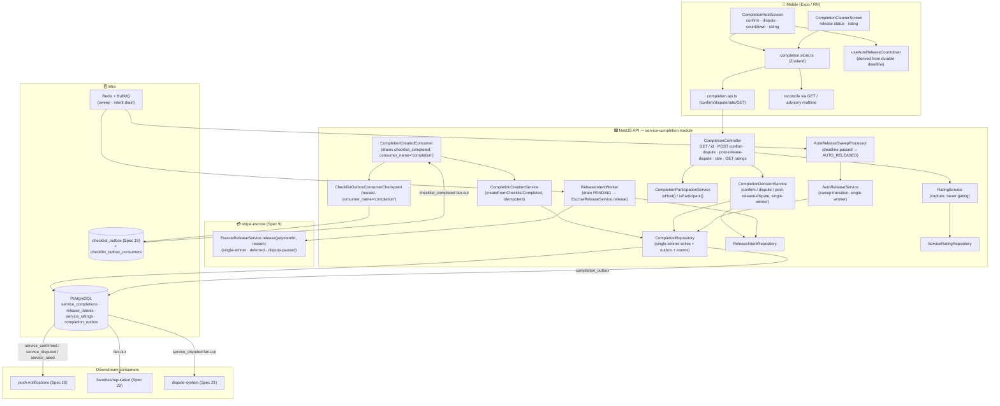
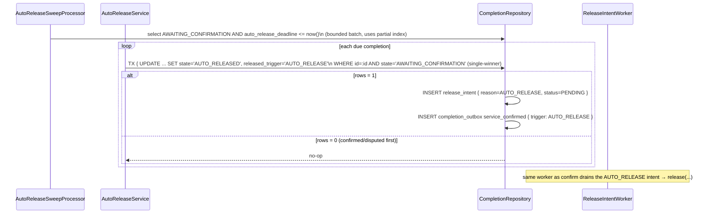
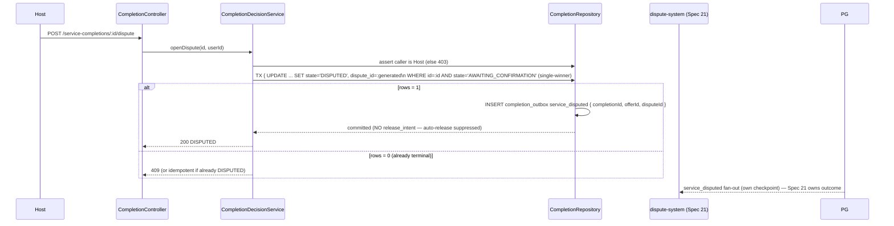
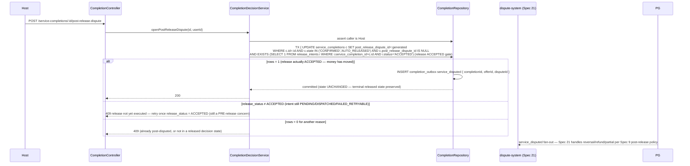

# Design Document: Service Completion

## Overview

`service-completion` (Spec 20, the last of Sprint 5 — Service Execution) closes the service loop. After the Cleaner finalizes the checklist (Spec 19 emits the durable `checklist_completed` fact), the Host either **confirms satisfaction** — which releases the escrowed payment to the Cleaner — or does nothing, in which case an **auto-release** fires after a configured window (the plan's 24h), or the Host **opens a dispute** (routed to Spec 21), which pauses auto-release. A mutual **rating** is captured at the end, but never gates release.

**It owns the completion DECISION and durably enqueues the release intent; it never moves money.** The escrow is already built (Spec 9): `EscrowReleaseService.release(paymentId, ReleaseReason)` performs the Stripe Transfer, is **single-winner** (concurrent triggers yield exactly one Transfer), **defers** the payout when the Cleaner's account is not `payouts_enabled`, and is **paused** while `dispute_status = OPEN`. `service-completion` maps a decision to a `ReleaseReason` (`HOST_CONFIRMED` | `AUTO_RELEASE`) and **crucially does NOT call `release()` synchronously in the request/sweep path**. Instead, in the **same transaction** that commits the decision (`CONFIRMED`/`AUTO_RELEASED`), it persists a durable **release intent** (`{ paymentId, reason, status: PENDING }`); a separate worker/outbox processor then drains PENDING intents into `EscrowReleaseService.release(...)` with idempotent retries. This closes the crash gap: if the process dies after committing `CONFIRMED` but before the Stripe call, the durable intent is retried on recovery — a terminal completion can never be left with no release path. `service-completion` never issues Stripe calls, holds no Stripe keys, and recomputes no commission.

It **invents almost nothing** — it composes patterns proven in the two dependency specs and their siblings:

1. **Creation is triggered by a durable event, never a synchronous call.** `service-completion` consumes the `checklist_completed` outbox fact Spec 19 emits, draining it via its **own per-consumer checkpoint** (`consumer_name = 'completion'`) over Spec 19's `checklist_outbox` fan-out, and creates the completion idempotently. This is the exact fan-out / per-consumer-checkpoint discipline the Spec 20/21 consumers already share on Spec 19's outbox. checklist-photos never calls this module; a completion-creation failure never rolls back the checklist finalize.
2. **The auto-release deadline is a durable, server-swept snapshot from the authoritative finish time.** `checklist_completed_at` is the finish timestamp **carried on the `checklist_completed` event** (not the consume time); `auto_release_deadline = checklist_completed_at + SERVICE_AUTO_RELEASE_WINDOW_MS` is snapshotted at creation and swept by a bounded, idempotent, single-winner server sweep — never a client timer, never a live config value. This mirrors the durable-deadline / snapshot discipline in Spec 9's auto-release worker and Spec 19's snapshotted policies.
3. **Every money-bearing transition is single-winner + durable-intent.** Confirm / auto-release / dispute-open are conditional writes (`WHERE state = AWAITING_CONFIRMATION`) so exactly one wins; each release-bearing winner persists exactly one `release_intent` in the same transaction; the escrow release is itself single-winner. Together: at most one Transfer per payment (even under confirm-racing-auto-release), and never a lost release under partial failure.
4. **Durable outbox events, consumed via each downstream's own checkpoint.** `service_confirmed`, `service_disputed`, `service_rated` are written in the same transaction as their transition and consumed by Push (Spec 16) and reputation (Spec 22) via their own checkpoints — the exact per-domain outbox convention Spec 19 uses.
5. **`GET` reconciliation is authority; realtime is advisory.** Completion state + the durable deadline + `GET /service-completions/:id` are authoritative; a missed push/realtime frame never changes whether/when release fires.

### `checklist_completed` payload reconciliation (additive, backward-safe extension)

The requirements make `checklist_completed_at` — the **authoritative finish time** — the clock the auto-release deadline derives from. Spec 19's documented `checklist_completed` payload is `{ runId, serviceSessionId, totalTasks, completedTasks, photoCount }` and does **not** yet carry a finish timestamp. Rather than have `service-completion` read the consume time (which the requirements forbid — a delayed queue must not grant the Host extra time), the payload is extended **exactly as Spec 19 extended `service_started`** for its policy snapshots: an **additive, backward-safe** field.

- Spec 19's `checklist_completed` gains one field, `completedAt` (the `checklist_runs.completed_at` stamped in the same transaction as `ACTIVE → COMPLETED`), alongside the existing fields. This is the run's durable, server-authoritative finish time — the moment the checklist became terminal, captured in Spec 19's transition transaction, not re-derived here.
- This is a one-directional, additive coupling: Spec 19 gains one field on an event it already emits (no new call, no new table, no behavioral dependency). A consumer that ignores it is unaffected; the extension is backward-safe.
- `service-completion` copies `completedAt` onto `service_completions.checklist_completed_at` at creation and derives the snapshotted `auto_release_deadline` from it. It never reads its own consume time, and never re-reads Spec 19's run.

> Fallback guard (defensive, documented): if a `checklist_completed` row is observed without `completedAt` (a pre-extension event during rollout), creation is rejected/deferred rather than silently substituting consume time — the deadline must never be anchored to a non-authoritative clock. In steady state every event carries `completedAt`.

### Authority split (kept strict)

- **PostgreSQL is the source of truth for the completion DECISION + ratings.** The `service_completions` row (state, who confirmed, when, the snapshotted deadline, the dispute links, the rating rows) is durable. It records the decision; it is **not** the money ledger.
- **The escrow module (Spec 9) is the source of truth for money.** Whether funds are HELD/RELEASED/REFUNDED, the Transfer, the payout status — all live in payments and are authoritative there. `service-completion` never calls `release(...)` synchronously: it persists a durable release intent in the decision transaction, and a worker drives that intent into Spec 9's single-winner release with idempotent retries (or the dispute path suppresses it). The intent stays `PENDING`/`DISPATCHED` until Spec 9 accepts the release COMMAND, at which point it is `ACCEPTED` — meaning Spec 9 durably accepted the command, not that the payout has settled (Spec 9 may leave `payout_status = PENDING` when the Cleaner is not yet `payouts_enabled`, and reconcile the payout later). The Cleaner UI's released / pending-payout / disputed distinction reflects exactly this: an `ACCEPTED` release whose payout is still pending is normal, not an error.
- **checklist-photos (Spec 19) is the source of truth for what was done + the finish time.** `service-completion` reacts to `checklist_completed` (carrying `completedAt`); it never re-derives checklist state or the finish clock.
- **The auto-release deadline is server-authoritative and durable.** The 24h (configurable) countdown is a persisted, snapshotted deadline swept by the server; a client "confirm" is the fast path, the sweep is the guarantee.
- **Spec 21 owns dispute outcomes.** `service-completion` provides the entry point (pre-release `DISPUTED` + suppression, or post-release routing) and never weighs evidence, reverses Transfers, or issues refunds.

### Responsibility Matrix

| Responsibility | Mobile (Host) | Mobile (Cleaner) | NestJS API (this module) | PostgreSQL | Escrow (Spec 9) | checklist-photos (Spec 19) | dispute-system (Spec 21) |
|---|:---:|:---:|:---:|:---:|:---:|:---:|:---:|
| Emit `checklist_completed` (carries `completedAt`) | ❌ | ❌ | ❌ | ❌ | ❌ | ✅ (outbox) | ❌ |
| Consume `checklist_completed`, create completion (idempotent) | ❌ | ❌ | ✅ | ✅ (source of truth) | ❌ | ❌ | ❌ |
| Snapshot `auto_release_deadline` from `completedAt` | ❌ | ❌ | ✅ | ✅ | ❌ | ❌ (carries clock) | ❌ |
| Host confirm (single-winner) | ✅ (trigger) | ❌ | ✅ | ✅ | ❌ | ❌ | ❌ |
| Persist `release_intent` in decision tx | ❌ | ❌ | ✅ | ✅ | ❌ | ❌ | ❌ |
| Drain intent → `release(paymentId, reason)` | ❌ | ❌ | ✅ (worker) | ✅ | ✅ (owns Transfer) | ❌ | ❌ |
| Perform Stripe Transfer / move money | ❌ | ❌ | ❌ | ❌ | ✅ | ❌ | ❌ |
| Auto-release sweep past deadline (single-winner) | ❌ | ❌ | ✅ (job) | ✅ | ❌ | ❌ | ❌ |
| Open pre-release dispute (suppress auto-release) | ✅ (trigger) | ❌ | ✅ | ✅ | ❌ | ❌ | ✅ (owns outcome) |
| Post-release dispute routing (no state overload) | ✅ (trigger) | ❌ | ✅ | ✅ | ❌ (reversal primitive) | ❌ | ✅ (owns outcome) |
| Capture rating (one per side, never gating) | ✅ | ✅ | ✅ | ✅ | ❌ | ❌ | ❌ |
| Emit `service_confirmed`/`service_disputed`/`service_rated` | ❌ | ❌ | ✅ (outbox) | ✅ | ❌ | ❌ | ❌ |
| View completion state / release status / rating | ✅ | ✅ | ✅ (data) | ❌ | (state ref) | ❌ | ❌ |
| `GET` reconciliation | ✅ (trigger) | ✅ (trigger) | ✅ (data) | ❌ | ❌ | ❌ | ❌ |

### Ownership Boundary — service-completion vs escrow vs checklist-photos vs disputes

```
checklist-photos (Spec 19)                 service-completion module (NEW)                 stripe-escrow (Spec 9)
  checklist_outbox: checklist_completed  ──►  CompletionCreatedConsumer                       EscrowReleaseService.release(
   (fan-out source; per-consumer               drains checklist_completed for consumer_name     paymentId, HOST_CONFIRMED|AUTO_RELEASE)
    checkpoints; carries completedAt =          = 'completion' (its OWN checkpoint row)   ◄──── internal, single-winner,
    the authoritative finish time)               → CompletionCreationService                     defers if !payouts_enabled,
                                                 .createFromChecklistCompleted()                 paused while dispute OPEN
                                                (idempotent, UNIQUE service_session_id)

service-completion owns:                                                             dispute-system (Spec 21, downstream)
  service_completions (the DECISION)              release_intents (durable intent)      consumes service_disputed; owns
  the single-winner state machine                 drained by ReleaseIntentWorker →       evidence/refund/partial/reversal;
  the snapshotted auto_release_deadline           EscrowReleaseService.release(...)      uses Spec 9's reversal primitive
  the auto-release sweep (server-authoritative)   (idempotent, retried, single-winner)  for post-release
  service_ratings (captured, never gating)
  completion_outbox: service_confirmed / service_disputed / service_rated  ──► Push (Spec 16) + reputation (Spec 22)
                                                                                 via their OWN checkpoints
```

- **Spec 19 is the source of truth for the completion fact + the finish clock.** It emits `checklist_completed` into its `checklist_outbox` (a fan-out source drained by independent per-consumer checkpoints keyed by `(event_id, consumer_name)`). `service-completion` is the `consumer_name = 'completion'` consumer: it drains rows it has not yet acked, creates the completion, then acks only its own `(event_id, 'completion')` row — so the Spec 21 dispute-evidence consumer acking the same event never starves it, and vice versa. It never reads Spec 19's run rows directly.
- **Spec 9 is the source of truth for money.** `service-completion` calls only the internal `EscrowReleaseService.release(paymentId, reason)` — via the durable intent worker, never synchronously — and consumes no Stripe keys. Spec 9's single-winner release + deferred-payout + dispute-pause guarantees are relied upon, not reimplemented.
- **Spec 21 owns dispute resolution.** `service-completion` emits the routing event and guarantees auto-release suppression (pre-release) or preserves the terminal released state (post-release); it never resolves.
- Dependency is one-directional (service-completion → Spec 19 `checklist_outbox` read-only via its checkpoint; → the finish clock on the event; → Spec 9's internal release primitive). `service-completion` introduces no new coupling into the checklist, escrow, or offer contracts beyond creating the completion from `checklist_completed`, driving the existing release, and routing to disputes.

This design maps every requirement (Req 1–8) and every correctness invariant (REQ-SC1 … REQ-SC12) to concrete, verifiable properties **P1 … P13** (below), each backed by tests.

## Architecture



### Data flow — creation (durable-first, idempotent, own checkpoint, deadline snapshotted from the finish clock)

1. Spec 19 commits `ACTIVE → COMPLETED` and, in the same transaction, writes a `checklist_completed` `checklist_outbox` row carrying `{ runId, serviceSessionId, totalTasks, completedTasks, photoCount, completedAt }` (`completedAt` = the run's durable finish time — the additive extension above).
2. `CompletionCreatedConsumer` drains `checklist_completed` rows with **no `checklist_outbox_consumers` row for `consumer_name = 'completion'`** (`NOT EXISTS`, ordered by `created_at`, bounded batch), reusing Spec 19's checkpoint table. For each it calls `CompletionCreationService.createFromChecklistCompleted(payload)`, then acks its own `(event_id, 'completion')` row (`ON CONFLICT DO NOTHING`).
3. `createFromChecklistCompleted` resolves the participants (`host_id`/`cleaner_id`) and `payment_id` server-side from the offer bound to the session, sets `checklist_completed_at = payload.completedAt` and snapshots `auto_release_deadline = checklist_completed_at + SERVICE_AUTO_RELEASE_WINDOW_MS`, then `INSERT ... ON CONFLICT (service_session_id) DO NOTHING` the `service_completions` row (`state = AWAITING_CONFIRMATION`). `UNIQUE service_session_id` guarantees at most one; a redelivered/re-drained-but-unacked event is a no-op. A missing `completedAt` is rejected (defensive guard) so the deadline is never anchored to consume time. Per-row try/catch: a creation failure never touches the already-committed checklist finalize and is retried next drain.

### Data flow — Host confirm (single-winner decision → durable intent → worker → release)

```mermaid
sequenceDiagram
    participant Host
    participant Ctrl as CompletionController
    participant Dec as CompletionDecisionService
    participant Repo as CompletionRepository
    participant Worker as ReleaseIntentWorker
    participant Escrow as EscrowReleaseService (Spec 9)

    Host->>Ctrl: POST /service-completions/:id/confirm
    Ctrl->>Dec: confirm(id, userId)
    Dec->>Repo: assert caller is Host (else 403)
    Dec->>Repo: TX { UPDATE ... SET state='CONFIRMED', confirmed_at, released_trigger='HOST_CONFIRMED'\n           WHERE id=:id AND state='AWAITING_CONFIRMATION' (single-winner)
    alt rows = 1 (winner)
        Repo->>Repo: INSERT release_intent { payment_id, reason=HOST_CONFIRMED, status=PENDING }
        Repo->>Repo: INSERT completion_outbox service_confirmed { completionId, offerId, trigger }
        Repo-->>Dec: committed
        Dec-->>Ctrl: 200 CONFIRMED
    else rows = 0 (already CONFIRMED)
        Dec-->>Ctrl: 200 idempotent no-op (current state)
    else terminal-different (DISPUTED)
        Dec-->>Ctrl: 409 conflict
    end
    Note over Worker,Escrow: OUT OF BAND — never in the request path
    Worker->>Repo: CLAIM intent (single-winner conditional UPDATE):<br/>SET status='DISPATCHED', dispatched_at=now, lease_until=now+RELEASE_INTENT_LEASE_MS<br/>WHERE status IN ('PENDING','FAILED_RETRYABLE') OR (status='DISPATCHED' AND lease_until <= now)
    Worker->>Escrow: release(payment_id, reason)  (idempotent; Spec 9 single-winner)
    alt release COMMAND accepted (Spec 9 durably accepted; payout may be deferred)
        Escrow-->>Worker: ok
        Worker->>Repo: intent ACCEPTED (release command accepted, NOT funds settled)
    else transient failure
        Escrow-->>Worker: error
        Worker->>Repo: intent FAILED_RETRYABLE (attempt++), retried next drain
    end
    Note over Worker,Repo: crash after CLAIM (DISPATCHED) but before ACCEPTED →<br/>lease expires → intent re-claimable by the next drain →<br/>release() re-called (Spec 9 single-winner → no-op)
```

- The request path commits the decision + intent + outbox and returns. It **never** calls Stripe. A crash after commit but before the Stripe call is fully recoverable via a **lease-based claim**: the worker claims an intent by conditionally setting `status='DISPATCHED', dispatched_at=now, lease_until=now+SERVICE_COMPLETION_RELEASE_INTENT_LEASE_MS` in the SAME conditional `UPDATE` that selects it (`WHERE status IN ('PENDING','FAILED_RETRYABLE') OR (status='DISPATCHED' AND lease_until <= now)`) — a single-winner claim. A crash after the claim (intent left `DISPATCHED`) but before `ACCEPTED` is not stuck: once its `lease_until` passes, the very next drain re-selects and re-claims it and re-calls `release(...)` (REQ-SC2). Spec 9's single-winner release makes the re-call a no-op — at most one Transfer.
- `ACCEPTED` means **Spec 9 durably/idempotently accepted the release COMMAND** — NOT that the Stripe Transfer funds have settled. Deferred payout: if the Cleaner's account is not `payouts_enabled`, Spec 9's `release` returns having set `payout_status = PENDING` without failing; that is still an `ACCEPTED` release command (the payout completes later via Spec 9's own reconciliation when the account becomes eligible). The completion stays `CONFIRMED` (REQ-SC7).

### Data flow — auto-release sweep (server-authoritative, durable deadline, single-winner)



- The deadline evaluated is the snapshotted `auto_release_deadline` (from `checklist_completed_at`, the authoritative finish time), never a client timer and never a live config value (REQ-SC4). A delayed queue never grants extra time; a config change never moves an in-flight deadline.
- A `DISPUTED` completion is excluded (its state is no longer `AWAITING_CONFIRMATION`), so the sweep never auto-releases a disputed completion (REQ-SC5). The sweep is bounded, idempotent, and single-winner; re-running is safe.

### Data flow — pre-release dispute (suppress auto-release, route to Spec 21)



- `DISPUTED` writes no `release_intent` and no release trigger fires from `service-completion`; auto-release is suppressed because the state is no longer `AWAITING_CONFIRMATION` (REQ-SC5). Spec 21 owns release/refund/partial.

### Data flow — post-release dispute (distinct concept, no state overload)



- **A post-release dispute is allowed ONLY when the escrow release has actually been ACCEPTED by Spec 9** (the completion's `release_intent.status = ACCEPTED` — equivalently `release_status = ACCEPTED`, see the derived `release_status` in the `GET` contract). `CONFIRMED`/`AUTO_RELEASED` is only the DECISION state; while the completion is `CONFIRMED`/`AUTO_RELEASED` but the intent is still `PENDING`/`DISPATCHED` (not yet `ACCEPTED`), the money has not necessarily moved, so a dispute is still a **PRE-release** concern and MUST NOT be routed as post-release — the endpoint rejects it with `409` (release not yet executed) and the caller/Spec-21 entry retries once `release_status = ACCEPTED`. This `409`-until-`ACCEPTED` rule is the primary, money-safe design (no intent-cancellation race). Once accepted, a post-release dispute sets `post_release_dispute_id` and routes to Spec 21 **without** transitioning to `DISPUTED` (which is pre-release only, reachable solely from `AWAITING_CONFIRMATION`) and **without** reversing the Transfer (Spec 21 does that via Spec 9's reversal primitive). The completion's terminal released state is preserved (REQ-SC12).

### Data flow — rating (captured, never gating)

1. On `CONFIRMED`/`AUTO_RELEASED` (and only those two states — REQ-SC8), a participant `POST /service-completions/:id/ratings { stars, comment? }`.
2. `RatingService` resolves the caller's `role` (`HOST_RATES_CLEANER` or `CLEANER_RATES_HOST`) server-side, validates `stars ∈ [SERVICE_RATING_MIN_STARS, SERVICE_RATING_MAX_STARS]` (1..5), and `INSERT ... ON CONFLICT (service_completion_id, role) DO NOTHING` (one per side), writing `service_rated { completionId, role, stars }` to `completion_outbox` in the same transaction.
3. A rating never touches `service_completions.state`, never persists a `release_intent`, and never blocks the sweep — a release never waits on a rating (REQ-SC8). A duplicate for the same side → `409`; a non-participant → `403`.

## Components and Interfaces

### Backend — service-completion module (`services/api/src/service-completion/`)

```
services/api/src/service-completion/
├── service-completion.module.ts
├── completion.controller.ts
├── completion.types.ts                       # enums, internal view/summary types
├── completion.constants.ts                   # env-configurable values + queue names
├── config/
│   └── validate-service-completion-config.ts # fail-fast validateServiceCompletionConfig()
├── service/
│   ├── completion-decision.service.ts        # confirm / dispute / post-release-dispute (single-winner)
│   ├── auto-release.service.ts               # sweep transition (single-winner)
│   ├── rating.service.ts                     # capture rating (never gating)
│   ├── completion-creation.service.ts        # createFromChecklistCompleted (idempotent)
│   └── completion-participation.service.ts   # isHost / isParticipant (from offer)
├── repository/
│   ├── completion.repository.ts              # single-winner writes + outbox + intent (one tx)
│   ├── release-intent.repository.ts          # drain / dispatch / accept / fail-retryable
│   └── service-rating.repository.ts          # one-per-side insert
├── consumers/
│   └── completion-created.consumer.ts        # drains checklist_completed (consumer_name='completion')
├── jobs/
│   ├── auto-release-sweep.processor.ts       # deadline passed → AUTO_RELEASED (bounded, idempotent)
│   └── release-intent.worker.ts              # drain PENDING/FAILED_RETRYABLE → EscrowReleaseService.release
├── dto/
│   ├── open-dispute.dto.ts
│   └── submit-rating.dto.ts
├── entities/
│   ├── service-completion.entity.ts
│   ├── release-intent.entity.ts
│   └── service-rating.entity.ts
├── __tests__/  (see Testing Strategy)
└── README.md
```

**`CompletionCreationService`** — idempotent creation off the `checklist_completed` fact.
- `createFromChecklistCompleted(payload)` — reject if `payload.completedAt` is absent (deadline must anchor to the authoritative finish time, never consume time); resolve `host_id`/`cleaner_id`/`payment_id` server-side from the offer bound to `serviceSessionId`; set `checklist_completed_at = payload.completedAt`, snapshot `auto_release_deadline = checklist_completed_at + SERVICE_AUTO_RELEASE_WINDOW_MS`; `INSERT ... ON CONFLICT (service_session_id) DO NOTHING` (`state = AWAITING_CONFIRMATION`). Never throws into the consumer batch (per-row try/catch); a creation failure never touches the committed checklist finalize. Functions ≤30 lines, SRP.

**`CompletionDecisionService`** — the single-winner pre-release + post-release decisions.
- `confirm(id, userId)` — assert caller is the Host (else `403`); in ONE transaction single-winner `UPDATE ... WHERE id=:id AND state='AWAITING_CONFIRMATION'` setting `confirmed_at` + `released_trigger='HOST_CONFIRMED'`, persist `release_intent { HOST_CONFIRMED, PENDING }`, write `service_confirmed`. `rows=0` + current `CONFIRMED` → idempotent no-op returning current state; `rows=0` + `DISPUTED`/terminal-different → `409`. Never calls Stripe in the request path.
- `openDispute(id, userId)` — assert Host; single-winner `AWAITING_CONFIRMATION → DISPUTED` setting `dispute_id`, write `service_disputed`, **no intent** (auto-release suppressed). `rows=0` + already `DISPUTED` → idempotent; else `409`.
- `openPostReleaseDispute(id, userId)` — assert Host; conditional `UPDATE ... WHERE state IN ('CONFIRMED','AUTO_RELEASED') AND post_release_dispute_id IS NULL AND EXISTS(release_intent for this completion WITH status='ACCEPTED')` setting `post_release_dispute_id`, write `service_disputed`; state unchanged; no Transfer reversal. **Gates on the release actually being `ACCEPTED`**, not merely on the decision state: `CONFIRMED`/`AUTO_RELEASED` is the DECISION, but the release may still be `PENDING`/`DISPATCHED` (money not necessarily moved). If the decision state matches but the release is not yet `ACCEPTED`, this is still a PRE-release concern → `409` (release not yet executed; the caller/Spec-21 retries once `release_status = ACCEPTED`). It does NOT route as post-release and does NOT cancel the in-flight intent (which may already be mid-flight). `rows=0` for any reason (not released-accepted, already post-disputed) → `409`.

**`AutoReleaseService`** — the sweep transition (invoked by the sweep job).
- `autoReleaseDue(id)` — single-winner `UPDATE ... WHERE id=:id AND state='AWAITING_CONFIRMATION'` setting `released_trigger='AUTO_RELEASE'`, persist `release_intent { AUTO_RELEASE, PENDING }`, write `service_confirmed { trigger: AUTO_RELEASE }`, all in ONE transaction. `rows=0` (confirmed/disputed first) → no-op. Idempotent.

**`RatingService`** — captured, never gating.
- `submitRating(id, userId, dto)` — assert participant + completion state ∈ {`CONFIRMED`,`AUTO_RELEASED`} (else `403`/`409`); resolve `role` from participants; validate stars in `[min,max]`; `INSERT ... ON CONFLICT (service_completion_id, role) DO NOTHING`; write `service_rated` in the same transaction. Never touches `state` or intents.
- `getRatings(id, userId)` — participant-gated read; consistent with the completion's participants.

**`CompletionParticipationService`** — `isHost(userId, completion)` / `isParticipant(userId, completion)`, resolving `host_id`/`cleaner_id` (from the offer at creation, denormalized on the row). Single source of the authorization rule used by every endpoint; a nulled participant after user deletion resolves to non-participant for that id — history retained.

**`CompletionRepository`** (`service_completions` + `completion_outbox`, and coordinates `release_intents`)
- `createCompletion(params, manager)` — idempotent `ON CONFLICT (service_session_id) DO NOTHING`.
- `transition(id, expected, next, derivedFields, intent?, outboxEvents, manager)` — the single-winner `UPDATE ... WHERE id=:id AND state=:expected` that sets derived fields AND (when release-bearing) inserts exactly one `release_intent` AND writes the `completion_outbox` row(s), all in ONE transaction. Returns rows affected (winner=1).
- `transitionPostReleaseDispute(id, disputeId, outboxEvents, manager)` — conditional `WHERE state IN ('CONFIRMED','AUTO_RELEASED') AND post_release_dispute_id IS NULL AND EXISTS (SELECT 1 FROM release_intents i WHERE i.service_completion_id = :id AND i.status = 'ACCEPTED')`; no state change, no intent. The `ACCEPTED` `EXISTS` clause makes the write succeed only when the release has actually executed (money moved); a matching decision state with a still-`PENDING`/`DISPATCHED` intent yields rows=0 → the service maps it to `409` (release not yet executed).
- `findById(id)`, `findBySessionId`, `findDueForAutoRelease(now, limit)` (partial-index scan `state='AWAITING_CONFIRMATION' AND auto_release_deadline <= now`).

**`ReleaseIntentRepository`** (`release_intents`)
- `drainClaimable(limit)` — selects intents eligible for a claim: `status IN ('PENDING','FAILED_RETRYABLE') OR (status = 'DISPATCHED' AND lease_until <= NOW())`, oldest first, bounded (partial-index scan matching the claim predicate). This is what makes an orphaned `DISPATCHED` durably reclaimable.
- `claimForDispatch(id, leaseMs, manager)` — the **single-winner lease claim** (replaces the old `markDispatched`): `UPDATE ... SET status='DISPATCHED', dispatched_at=NOW(), lease_until=NOW() + :leaseMs WHERE id=:id AND (status IN ('PENDING','FAILED_RETRYABLE') OR (status='DISPATCHED' AND lease_until <= NOW()))`. Returns rows affected (winner=1); a concurrent worker or a not-yet-expired lease observes rows=0 and skips. Marking `DISPATCHED` is therefore a lease-claim, never an unconditional write.
- `markAccepted(id, manager)` / `markFailedRetryable(id, manager)` (increments `attempt`, clears `lease_until`). All idempotent per final state.

**`ServiceRatingRepository`** (`service_ratings`)
- `insertOnePerSide(params, manager)` — `ON CONFLICT (service_completion_id, role) DO NOTHING`.
- `findByCompletion(completionId)`.

**`CompletionCreatedConsumer`** (relay) — drains `checklist_completed` rows unacked for `consumer_name = 'completion'` (reusing Spec 19's `ChecklistOutboxConsumerCheckpoint.drainUnacked('completion', batch)`), calls `createFromChecklistCompleted`, then `ack(eventId, 'completion')`. At-least-once + idempotent (dedup by `UNIQUE service_session_id`). Row-scoped try/catch so one bad row never stalls the batch.

**`AutoReleaseSweepProcessor`** (BullMQ repeatable; interval/batch from config) — selects `service_completions` where `state='AWAITING_CONFIRMATION' AND auto_release_deadline <= NOW()` (bounded batch, partial index), calls `AutoReleaseService.autoReleaseDue(id)` per row (single-winner, idempotent). A disputed/confirmed completion is not selected (state changed). Bounded and re-runnable.

**`ReleaseIntentWorker`** (BullMQ repeatable; interval/batch from config) — drains claimable `release_intents` (`status IN ('PENDING','FAILED_RETRYABLE') OR (status='DISPATCHED' AND lease_until <= NOW())`, oldest first, batched): **claims** each via the single-winner lease `claimForDispatch(id, SERVICE_COMPLETION_RELEASE_INTENT_LEASE_MS)` (sets `status='DISPATCHED', dispatched_at=NOW(), lease_until=NOW()+leaseMs`), calls `EscrowReleaseService.release(payment_id, reason)` (idempotent; Spec 9 single-winner), then marks `ACCEPTED` on success or `FAILED_RETRYABLE` (attempt++) on transient failure → retried next drain. `ACCEPTED` records that **Spec 9 durably accepted the release COMMAND** — not that funds have settled (Spec 9 may leave `payout_status = PENDING` when `payouts_enabled = false`; that is still `ACCEPTED`). This is the only path that calls Spec 9; it holds no Stripe keys. Recovery-safe **by lease, not by drain-selection alone**: an intent left `DISPATCHED` by a crash is stuck only until its `lease_until` passes, after which the next drain re-selects and re-claims it and re-calls `release(...)` (a Spec-9 no-op) — an orphaned `DISPATCHED` is never permanently lost.

**`CompletionController`** (`@Controller('service-completions') @UseGuards(JwtAuthGuard)`, whitelisting `ValidationPipe`):

| Method | Path | Actor | Description |
|---|---|---|---|
| `GET` | `/service-completions/:id` | Host or Cleaner | Authoritative state + snapshotted `auto_release_deadline` + rating status + derived `release_status` (`NOT_TRIGGERED`/`PENDING`/`ACCEPTED`) (reconcile path). Lets the Cleaner see a `CONFIRMED` completion whose payout order is still `PENDING` vs `ACCEPTED`; also what `openPostReleaseDispute` gates on. Internal intent fields (`attempt`, `dispatched_at`, `lease_until`, `last_error`) are NOT exposed |
| `POST` | `/service-completions/:id/confirm` | Host only | Single-winner `→ CONFIRMED` + `release_intent(HOST_CONFIRMED)` + `service_confirmed` |
| `POST` | `/service-completions/:id/dispute` | Host only | Single-winner `→ DISPUTED` + `service_disputed`; suppresses auto-release |
| `POST` | `/service-completions/:id/post-release-dispute` | Host only | Sets `post_release_dispute_id` + `service_disputed`; state preserved. Allowed ONLY when the release is actually `ACCEPTED` (`release_status = ACCEPTED`); a decision state of `CONFIRMED`/`AUTO_RELEASED` with the intent still pending → `409` (release not yet executed) |
| `POST` | `/service-completions/:id/ratings` | Host or Cleaner | One rating per side (1..5, optional comment) + `service_rated`; never gating |
| `GET` | `/service-completions/:id/ratings` | Host or Cleaner | Participant-gated ratings read |

Identity from `req.user.keycloakId → userId`; a non-participant receives `403` and learns nothing about the completion's existence. `release` is **not** a REST action — it is driven only by the release-intent worker.

**Derived `release_status` (GET reconciliation):** because the release is asynchronous, `GET` returns a derived `release_status` computed authoritatively from the completion's `release_intent`:
- `NOT_TRIGGERED` — no `release_intent` exists yet (e.g. `AWAITING_CONFIRMATION` or `DISPUTED` — no release-bearing decision was made).
- `PENDING` — an intent exists but is not yet `ACCEPTED` (covers intent status `PENDING`/`DISPATCHED`/`FAILED_RETRYABLE`).
- `ACCEPTED` — the intent is `ACCEPTED` (Spec 9 durably accepted the release command; the payout may still be settling).

This is derived server-side from the intent's status; it never exposes the internal intent fields (`attempt`, `dispatched_at`, `lease_until`, `last_error`). It is the value the Cleaner UI uses to distinguish "released / pending payout" and the exact condition `openPostReleaseDispute` gates on (post-release only when `release_status = ACCEPTED`).

Status codes: `200` success/idempotent no-op, `400` validation (stars out of range, bad payload), `401` unauthenticated, `403` forbidden (non-participant, or Cleaner attempting confirm/dispute), `404` unknown completion (non-participant sees `403`/`404` with no disclosure), `409` conflict (confirm on `DISPUTED`/terminal-different, duplicate rating side, post-release dispute on non-released, on a release not yet `ACCEPTED` (release not yet executed), or already-disputed).

### Mobile (`apps/mobile/src/screens/completion/`)

```
apps/mobile/src/screens/completion/
├── CompletionHostScreen.tsx         # Host: confirm / dispute + countdown + rating prompt
├── CompletionCleanerScreen.tsx      # Cleaner: release status + rating prompt
├── useAutoReleaseCountdown.ts       # derives countdown from durable deadline (display only)
├── completion.api.ts                # confirm / dispute / post-release-dispute / rate / GET
├── completion.store.ts              # Zustand
├── completion.types.ts
├── completion.constants.ts          # routes, i18n keys, design tokens
├── components/
│   ├── ConfirmDisputeActions.tsx
│   ├── AutoReleaseCountdown.tsx
│   ├── ReleaseStatusBadge.tsx
│   └── RatingSheet.tsx              # stars 1..5 + optional comment
├── __tests__/  (see Testing Strategy)
└── README.md
```

- **`completion.types.ts`** — `ServiceCompletion` (`id`, `serviceSessionId`, `offerId`, `state`, `autoReleaseDeadline`, `releasedTrigger`, `confirmedAt`, `disputeId`, `postReleaseDisputeId`, `releaseStatus`), where `releaseStatus: 'NOT_TRIGGERED' | 'PENDING' | 'ACCEPTED'` is the server-derived release-execution status from `GET` (no internal intent fields — attempt/lease/last_error — are exposed); `ServiceRating` (`role`, `stars`, `comment`), enums, `ConnectionStatus`.
- **`completion.constants.ts`** — routes/endpoints, i18n keys, design tokens (`#00F5D4` accent for confirm/rating CTAs, `#0B0C10` background, `#1F2833` cards); no security-sensitive values embedded.
- **`useAutoReleaseCountdown.ts`** — derives a display-only countdown from the durable `auto_release_deadline` returned by `GET`; it is a display of the server deadline, not an authoritative client timer (REQ-SC10). On expiry it re-fetches via `GET` rather than mutating state locally.
- **`completion.store.ts`** (Zustand) — completion + rating status; optimistic confirm/dispute reconciled via `GET`; idempotent state application (ignore regressions/older/illegal transitions).
- **`CompletionHostScreen`** — confirm-satisfaction action, dispute action, visible auto-release countdown (from the durable deadline, reconciled via `GET`); on confirm reflects `CONFIRMED` and prompts for a rating; if the Host does nothing, reflects `AUTO_RELEASED` after the deadline (reconciled via `GET`); on dispute reflects `DISPUTED` and hands off to Spec 21 clearly indicating auto-release is paused.
- **`CompletionCleanerScreen`** — release status (released / pending payout / disputed) sourced from the completion's server-derived `release_status` (`NOT_TRIGGERED`/`PENDING`/`ACCEPTED`) returned by `GET`, so the Cleaner sees that a `CONFIRMED` completion's payout order is still `PENDING` vs `ACCEPTED`; prompts for a rating.
- **i18n** `en`/`es` parity for all strings; BidClean dark tokens.

## Data Models

All tables follow the project database standards: `UUID` PK (`gen_random_uuid()`), snake_case, `TIMESTAMP WITH TIME ZONE`, explicit FK `ON DELETE`, indexes on every FK, application-validated `VARCHAR` for `state`/`released_trigger`/`role`/intent `reason`/`status` (no PG enums). Reversible migration with `IF NOT EXISTS`, table/column comments. Next migration timestamp is after the last Sprint-5 migration.

### `service_completions` (new — the durable completion DECISION; never the money ledger)

| Column | Type | Notes |
|---|---|---|
| `id` | `UUID PK DEFAULT gen_random_uuid()` | |
| `service_session_id` | `UUID NOT NULL` | FK → `service_sessions(id)` **ON DELETE CASCADE**; **`UNIQUE`** (one completion per session — the idempotency backstop) |
| `offer_id` | `UUID NOT NULL` | FK → `offers(id)` **ON DELETE CASCADE**; indexed |
| `payment_id` | `UUID NOT NULL` | reference to the escrow payment (Spec 9, its own bounded context); indexed; **no FK cascade from payments** |
| `host_id` | `UUID` (nullable) | FK → `users(id)` **ON DELETE SET NULL**; indexed |
| `cleaner_id` | `UUID` (nullable) | FK → `users(id)` **ON DELETE SET NULL**; indexed |
| `state` | `VARCHAR(30) NOT NULL DEFAULT 'AWAITING_CONFIRMATION'` | app-validated `AWAITING_CONFIRMATION/CONFIRMED/AUTO_RELEASED/DISPUTED` (pre-release only) |
| `checklist_completed_at` | `TIMESTAMPTZ NOT NULL` | the AUTHORITATIVE finish time carried on `checklist_completed` (`completedAt`), never consume time |
| `auto_release_deadline` | `TIMESTAMPTZ NOT NULL` | `= checklist_completed_at + SERVICE_AUTO_RELEASE_WINDOW_MS`; **snapshotted** at creation, server-swept |
| `confirmed_at` | `TIMESTAMPTZ` (nullable) | set on `→ CONFIRMED` |
| `released_trigger` | `VARCHAR(20)` (nullable) | app-validated `HOST_CONFIRMED/AUTO_RELEASE`; set with `CONFIRMED`/`AUTO_RELEASED` |
| `dispute_id` | `UUID` (nullable) | pre-release dispute link (routed to Spec 21) |
| `post_release_dispute_id` | `UUID` (nullable) | a dispute opened AFTER release fired (distinct concept; does not overload `DISPUTED`) |
| `created_at` / `updated_at` | `TIMESTAMPTZ DEFAULT NOW()` | **no `deleted_at`** — a terminal completion is an immutable audit fact |

Indexes/constraints: `uq_service_completions_session (service_session_id)`; FK indexes `idx_service_completions_offer (offer_id)`, `idx_service_completions_payment (payment_id)`, `idx_service_completions_host (host_id)`, `idx_service_completions_cleaner (cleaner_id)`; the sweep scan `idx_service_completions_due (auto_release_deadline) WHERE state = 'AWAITING_CONFIRMATION'`; `CHECK` on `state`; `CHECK` on `released_trigger`; `CHECK (released_trigger IS NULL) = (state NOT IN ('CONFIRMED','AUTO_RELEASED'))` so a released state always carries a trigger and a non-released state never does (REQ-SC3 integrity).

### `release_intents` (new — durable intent so a crash between decision and Stripe never loses the release)

| Column | Type | Notes |
|---|---|---|
| `id` | `UUID PK DEFAULT gen_random_uuid()` | |
| `service_completion_id` | `UUID` (nullable) | FK → `service_completions(id)` **ON DELETE SET NULL** (NOT CASCADE): the intent is a durable financial command that outlives the completion; if the originating completion is deleted, this reference is nulled but the intent is retained so the worker still drives the release. Indexed |
| `payment_id` | `UUID NOT NULL` | reference to the escrow payment (passed to `release`); indexed. **Self-sufficient**: together with `reason`, it lets the worker complete the release even after the completion row is gone |
| `reason` | `VARCHAR(20) NOT NULL` | app-validated `HOST_CONFIRMED/AUTO_RELEASE` (a subset of Spec 9's `ReleaseReason`); retained on the intent so the release command is complete independent of the completion |
| `status` | `VARCHAR(20) NOT NULL DEFAULT 'PENDING'` | app-validated `PENDING/DISPATCHED/ACCEPTED/FAILED_RETRYABLE`. **`ACCEPTED` = Spec 9 durably/idempotently accepted the release COMMAND, NOT that the Stripe Transfer funds have settled** — Spec 9 may leave `payout_status = PENDING` when `payouts_enabled = false`; that is still an `ACCEPTED` release command, and the payout completes later via Spec 9's own reconciliation. `DISPATCHED` = a worker has claimed a lease and is (or was) mid-flight calling Spec 9. |
| `attempt` | `INTEGER NOT NULL DEFAULT 0` | incremented on `FAILED_RETRYABLE` |
| `dispatched_at` | `TIMESTAMPTZ` (nullable) | set when a worker claims the intent (`→ DISPATCHED`); null while `PENDING`/`FAILED_RETRYABLE`, and after a terminal `ACCEPTED` it records the last dispatch |
| `lease_until` | `TIMESTAMPTZ` (nullable) | claim lease expiry (`= dispatched_at + SERVICE_COMPLETION_RELEASE_INTENT_LEASE_MS`); a `DISPATCHED` intent whose `lease_until <= NOW()` is an orphaned (crashed) dispatch and is durably re-claimable by the next drain — this is what gives `DISPATCHED` a real recovery path |
| `last_error` | `TEXT` (nullable) | sanitized transient-failure reason (no secrets/PII) |
| `created_at` / `updated_at` | `TIMESTAMPTZ DEFAULT NOW()` | |

**Note — durable financial command:** a `release_intent` is a **durable financial command / audit fact** that must SURVIVE the lifecycle of the completion that originated it. It carries its own `payment_id` and `reason`, so the worker can still complete the release even if the originating `service_completions` row is later deleted (see `service_completion_id` above and the Deletion-policy coherence subsection).

Indexes/constraints: `idx_release_intents_completion (service_completion_id)`, `idx_release_intents_payment (payment_id)`; the drain/claim scan `idx_release_intents_drain (created_at) WHERE status IN ('PENDING','FAILED_RETRYABLE','DISPATCHED')` — the predicate now also matches `DISPATCHED` rows so the claim scan (`... OR (status='DISPATCHED' AND lease_until <= NOW())`) can find an expired-lease dispatch to reclaim (the `lease_until` comparison is applied by the query; the partial index scopes the scan to the claimable statuses); `uq_release_intents_completion (service_completion_id)` — **at most one intent per completion while the completion exists** (a completion has at most one release-bearing terminal decision, so one intent; this is the durable-intent single-winner backstop). Because `service_completion_id` is nullable (`ON DELETE SET NULL` — see below) and Postgres treats `NULL`s as distinct in a `UNIQUE`, retained intents whose completion was deleted (`service_completion_id = NULL`) do not collide with each other; the one-intent-per-completion invariant holds for every completion that still exists. `CHECK` on `reason` and `status`.

### `service_ratings` (new — mutual rating, captured not gating)

| Column | Type | Notes |
|---|---|---|
| `id` | `UUID PK DEFAULT gen_random_uuid()` | |
| `service_completion_id` | `UUID NOT NULL` | FK → `service_completions(id)` **ON DELETE CASCADE**; indexed |
| `rater_id` | `UUID` (nullable) | FK → `users(id)` **ON DELETE SET NULL** |
| `ratee_id` | `UUID` (nullable) | FK → `users(id)` **ON DELETE SET NULL** |
| `role` | `VARCHAR(20) NOT NULL` | app-validated `HOST_RATES_CLEANER/CLEANER_RATES_HOST` |
| `stars` | `SMALLINT NOT NULL` | `CHECK (stars >= 1 AND stars <= 5)` |
| `comment` | `TEXT` (nullable) | user content — validated/escaped, never executed |
| `created_at` | `TIMESTAMPTZ DEFAULT NOW()` | **no `deleted_at`** — audit/reputation history |

Indexes/constraints: `uq_service_ratings_completion_role (service_completion_id, role)` (one rating per side); `idx_service_ratings_completion (service_completion_id)`, `idx_service_ratings_rater (rater_id)`, `idx_service_ratings_ratee (ratee_id)`; `CHECK` on `role` and `stars` (bounds are app-config-driven at the service layer but the hard `1..5` floor/ceiling is a DDL invariant).

### `completion_outbox` (durable events — consumed by Spec 16 / Spec 21 / Spec 22)

Mirrors the per-domain outbox convention (checklist-photos / service-tracking). Written in the SAME transaction as the transition that produced it. It is a fan-out source; per-consumer progress lives in the consumers' own checkpoint tables, so this row carries no shared processing marker.

| Column | Type | Notes |
|---|---|---|
| `id` | `UUID PK DEFAULT gen_random_uuid()` | |
| `event_id` | `VARCHAR(255) NOT NULL` | **`UNIQUE`** — deterministic per transition (e.g. `service_confirmed:{completionId}`, `service_disputed:{completionId}:{disputeId}`, `service_rated:{completionId}:{role}`) |
| `aggregate_type` | `VARCHAR(30) NOT NULL DEFAULT 'service_completion'` | app-validated |
| `aggregate_id` | `UUID NOT NULL` | the `service_completions.id` |
| `type` | `VARCHAR(50) NOT NULL` | `service_confirmed` / `service_disputed` / `service_rated` |
| `payload` | `JSONB NOT NULL` | `service_confirmed { completionId, offerId, trigger }` · `service_disputed { completionId, offerId, disputeId }` · `service_rated { completionId, role, stars }` — no secrets, no PII beyond ids |
| `version` | `INTEGER NOT NULL DEFAULT 1` | payload version |
| `created_at` | `TIMESTAMPTZ NOT NULL DEFAULT NOW()` | committed WITH the transition |

Indexes: `uq_completion_outbox_event (event_id)`; `idx_completion_outbox_created (created_at)` (per-consumer drain scan). No `relayed_at` (per-consumer acknowledgement lives in each consumer's checkpoint table).

### Deletion-policy coherence (Spec 13 invariant)

Consistent with the siblings: user references (`host_id`/`cleaner_id`/`rater_id`/`ratee_id`) are **`ON DELETE SET NULL`**, never `CASCADE` from `users` — deleting/anonymizing a participant never destroys the completion + rating audit/reputation history (REQ-SC9). `service_session_id`/`offer_id` (→ `service_completions`) **CASCADE**, so removing the parent session/offer removes the completion itself; and `service_completion_id` (→ `service_ratings`) **CASCADES**, so ratings — which are audit/reputation data, NOT financial commands — are removed with their completion.

**`release_intents.service_completion_id` is deliberately `ON DELETE SET NULL`, NOT `CASCADE`.** A `release_intent` is a **durable financial command / audit fact** that must survive the deletion of the completion that originated it: if the parent session/offer cascades the `service_completions` row away while the intent is still `PENDING`/`DISPATCHED`, cascading the intent too would destroy the only mechanism that drives the release to Spec 9 — leaving completion=gone, intent=gone, payment=still `HELD`, which would violate "a terminal completion can never be left with no release path." Instead, deleting the completion nulls `release_intents.service_completion_id` and **retains the intent**; because the intent carries its own `payment_id` and `reason`, the `ReleaseIntentWorker` still drives it into `EscrowReleaseService.release(...)` to completion. `payment_id` is a **reference by id** with **no cascade from payments** — payments is its own bounded context, its lifecycle unaffected by completion deletion and vice versa (REQ-SC9). The rows have **no `deleted_at`** — they persist as audit.

> **Alternative considered (option C):** rather than retaining the intent, block/deny the completion cascade while a non-`ACCEPTED` intent exists (e.g. `ON DELETE RESTRICT` gated on intent status). This keeps the parent alive until the release is accepted, but couples the completion's deletability to Spec 9's async progress and complicates parent (session/offer) deletion. We adopt **option B (SET NULL, retain the intent as a durable command)** as the primary design — the intent completes independently and the release path is never lost regardless of parent deletion timing.

### State machine (durable, single-winner; pre-release only)

```mermaid
stateDiagram-v2
    [*] --> AWAITING_CONFIRMATION : checklist_completed (idempotent create; deadline snapshotted from completedAt)
    AWAITING_CONFIRMATION --> CONFIRMED : Host confirms [single-winner] (+release_intent HOST_CONFIRMED, +service_confirmed)
    AWAITING_CONFIRMATION --> AUTO_RELEASED : deadline sweep [single-winner] (+release_intent AUTO_RELEASE, +service_confirmed)
    AWAITING_CONFIRMATION --> DISPUTED : Host opens dispute [single-winner] (+service_disputed; SUPPRESS auto-release; NO intent)
    CONFIRMED --> [*]
    AUTO_RELEASED --> [*]
    DISPUTED --> [*]

    note right of CONFIRMED
        DECISION state ≠ RELEASE EXECUTION state.
        The release runs asynchronously via the
        release_intent (PENDING → DISPATCHED → ACCEPTED).
        Post-release dispute is NOT a transition: it sets
        post_release_dispute_id on CONFIRMED/AUTO_RELEASED
        ONLY when the release_intent is ACCEPTED
        (else 409 — release not yet executed), preserves
        the released state, routes to Spec 21.
    end note
```

Every transition is `UPDATE service_completions SET state=:next, <derived>=... WHERE id=:id AND state='AWAITING_CONFIRMATION'` — the winner (rows=1) sets the derived fields AND (when release-bearing) inserts exactly one `release_intent` AND writes the `completion_outbox` row in the SAME transaction; concurrent losers observe rows=0 and no-op. Confirm racing auto-release racing dispute-open resolves to exactly one of `CONFIRMED`/`AUTO_RELEASED`/`DISPUTED` (never two), and at most one `release_intent` per completion while the completion exists (`uq_release_intents_completion`). Terminal states are immutable; a second confirm is an idempotent no-op or `409`, never a second intent. The DECISION state (`CONFIRMED`/`AUTO_RELEASED`) is distinct from the release EXECUTION state carried on the `release_intent` (`PENDING`/`DISPATCHED`/`ACCEPTED`); a released decision does not by itself mean money has moved (see the post-release-dispute `ACCEPTED` gate). The `release_intent` is a durable financial command: if the completion is later deleted, the intent is retained (its `service_completion_id` nulled) and the release still completes.

## Correctness Properties

*A property is a characteristic or behavior that should hold true across all valid executions of a system — essentially, a formal statement about what the system should do. Properties serve as the bridge between human-readable specifications and machine-verifiable correctness guarantees.*

Each property is universally quantified, testable, and maps back to the requirements' acceptance criteria and REQ-SC invariants.

### Property 1: One completion per session, created idempotently, deadline snapshotted from the authoritative finish time

*For any* `checklist_completed` event (carrying `completedAt`) delivered N ≥ 1 times, and *for any* interleaving of concurrent creation attempts for the same `service_session_id`, the store SHALL contain exactly one `service_completions` row for that session (`UNIQUE service_session_id`), in state `AWAITING_CONFIRMATION`, with `checklist_completed_at = completedAt` and `auto_release_deadline = completedAt + SERVICE_AUTO_RELEASE_WINDOW_MS`, and participants + `payment_id` resolved server-side. Every redelivery or concurrent attempt SHALL be a no-op — a second completion SHALL never exist — and the deadline SHALL be anchored to `completedAt` (the authoritative finish time), never to the consume time.

**Validates: Requirements 1.1, 1.5** · REQ-SC1, REQ-SC4

### Property 2: Completion durably enqueues release, never performs it (crash-safe, only release path)

*For any* release-bearing decision (`CONFIRMED` or `AUTO_RELEASED`), exactly one durable `release_intent { payment_id, reason, status: PENDING }` SHALL be committed in the SAME transaction as the decision, and `service-completion` SHALL NOT call `EscrowReleaseService.release(...)` synchronously in the request/sweep path. *For any* crash point between the committed decision and the Stripe call — **including a crash after the intent was claimed and left `DISPATCHED`** — the intent SHALL be recoverable: the worker SHALL claim intents via a single-winner lease (`status IN ('PENDING','FAILED_RETRYABLE') OR (status='DISPATCHED' AND lease_until <= now)`), then call `EscrowReleaseService.release(payment_id, reason)` with idempotent retries, marking `ACCEPTED` on Spec 9's confirmation and `FAILED_RETRYABLE` (retried) on transient failure — so a terminal completion is never left with no release path. Specifically, *for any* intent left `DISPATCHED` by a crash, once its `lease_until` elapses it SHALL be re-claimed and re-driven, and because Spec 9's release is single-winner the re-call SHALL be a no-op (at most one Transfer). `ACCEPTED` SHALL mean **Spec 9 durably accepted the release COMMAND**, NOT that funds have settled: a release for a Cleaner whose account is not `payouts_enabled` (Spec 9 leaves `payout_status = PENDING`) SHALL still be `ACCEPTED`. The worker SHALL be the ONLY path that calls Spec 9; `service-completion` SHALL hold no Stripe keys, make no Stripe calls, and recompute no commission.

**Validates: Requirements 2.1, 2.2, 7.2** · REQ-SC2

### Property 3: Host-only decisions, participant isolation

*For any* user and *for any* completion, every endpoint (`GET`, confirm, dispute, post-release-dispute, submit-rating, read-ratings) SHALL be authorized server-side from the offer's `host_id`/`cleaner_id`; a non-participant SHALL receive `403` and learn nothing about the completion's existence. Confirmation and dispute-opening (pre- and post-release) SHALL be permitted only for the Host; the Cleaner and non-participants SHALL be denied (`403`). Rating submission/read SHALL be permitted only for the two participants and be consistent with them.

**Validates: Requirements 1.3, 2.4, 4.4, 5.5** · REQ-SC6, REQ-SC1

### Property 4: Single-winner decision + single-winner release ⇒ no double pay & no lost release

*For any* completion and *for any* N concurrent actors (Host confirm vs. auto-release sweep vs. dispute-open), exactly one conditional write (`... WHERE state = 'AWAITING_CONFIRMATION'`) SHALL succeed and resolve to exactly one of `CONFIRMED`/`AUTO_RELEASED`/`DISPUTED` (never two); losers observe rows=0 and no-op. At most one `release_intent` SHALL exist per completion (`uq_release_intents_completion`) — a release-bearing winner persists exactly one, a dispute persists none — and, combined with Spec 9's single-winner `release`, at most one Transfer SHALL result per payment (even under confirm-racing-auto-release) AND no release SHALL be lost under partial failure. A confirm on a non-`AWAITING_CONFIRMATION` completion SHALL be an idempotent no-op (if already `CONFIRMED`) or `409` (if `DISPUTED`/terminal-different), never a second intent.

**Validates: Requirements 2.1, 2.5, 3.1, 3.3, 8.5** · REQ-SC3

### Property 5: Transition + outbox atomicity

*For any* state transition (`→ CONFIRMED`, `→ AUTO_RELEASED`, `→ DISPUTED`), the derived fields (`confirmed_at`/`released_trigger`/`dispute_id`) AND exactly one `completion_outbox` row (`service_confirmed` for a release, `service_disputed` for a dispute) SHALL be written in the SAME transaction as the state change; and *for any* stored rating, exactly one `service_rated` row SHALL be written in the same transaction as the rating. History SHALL never observe a `CONFIRMED`/`AUTO_RELEASED` completion without a `released_trigger` (enforced by the DDL `CHECK`), nor a release-bearing transition without its `service_confirmed` event, nor two triggers.

**Validates: Requirements 2.6, 3.5, 4.1, 5.4, 8.4** · REQ-SC3

### Property 6: Server-authoritative, durable auto-release from the authoritative finish time

*For any* completion left `AWAITING_CONFIRMATION` past its snapshotted `auto_release_deadline`, a bounded, idempotent, single-winner server sweep SHALL transition it `→ AUTO_RELEASED` (with `released_trigger = AUTO_RELEASE` and a `PENDING` intent), evaluating the durable snapshotted deadline (derived from `checklist_completed_at`, the authoritative finish time) — never a client timer and never a live config value. An unconfirmed, non-disputed completion SHALL always converge to `AUTO_RELEASED`; the sweep SHALL NOT call Stripe directly. A delayed queue SHALL never grant extra time.

**Validates: Requirements 3.1, 3.2, 7.3** · REQ-SC4

### Property 7: Dispute suppresses auto-release

*For any* completion transitioned to `DISPUTED` (pre-release), the auto-release sweep SHALL never transition it and SHALL never create a `release_intent`, and no `HOST_CONFIRMED`/`AUTO_RELEASE` trigger SHALL fire from `service-completion` — the release/refund/partial outcome is owned by Spec 21.

**Validates: Requirements 3.4, 4.2** · REQ-SC5

### Property 8: Deadline invariance to later config change

*For any* completion created with `auto_release_deadline = checklist_completed_at + window`, and *for any* subsequent change to `SERVICE_AUTO_RELEASE_WINDOW_MS`, the completion's `auto_release_deadline` SHALL remain the value snapshotted at creation — a config change SHALL never retroactively move an in-flight deadline.

**Validates: Requirements 3.2, 7.3** · REQ-SC4, REQ-SC11

### Property 9: Pre-release vs post-release disputes are distinct

*For any* completion and *for any* post-release-dispute attempt, the attempt SHALL be accepted **if and only if** the completion's `release_intent.status = ACCEPTED` (the release was actually executed by Spec 9). When accepted, it SHALL set `post_release_dispute_id`, emit `service_disputed`, and leave the completion's terminal released `state` unchanged — it SHALL NOT transition to `DISPUTED` (pre-release only), SHALL NOT reverse the Transfer, and SHALL NOT create or cancel a `release_intent`. *For any* completion whose decision is `CONFIRMED`/`AUTO_RELEASED` but whose intent is still `PENDING`/`DISPATCHED`/`FAILED_RETRYABLE` (release not yet `ACCEPTED`), the attempt SHALL be rejected with `409` (release not yet executed) and treated as a PRE-release concern — never routed as post-release. A pre-release `DISPUTED` SHALL only ever be reachable from `AWAITING_CONFIRMATION`. The two dispute concepts SHALL never be conflated on the same field, and the DECISION state SHALL never be mistaken for the RELEASE EXECUTION state.

**Validates: Requirements 4.2, 4.3** · REQ-SC12

### Property 10: Ratings captured, never gating

*For any* completion and *for any* rating attempt, a rating SHALL be accepted if and only if the completion state ∈ {`CONFIRMED`,`AUTO_RELEASED`}, the caller is the corresponding participant, `stars ∈ [1,5]`, and the side is not yet taken (`UNIQUE (service_completion_id, role)`) — else `403`/`409`/`400`. *For any* flow with or without ratings, the confirm/auto-release decision, the persisted `release_intent`, and release timing SHALL be identical — a release SHALL never wait on a rating, and a missing rating SHALL never block confirm/auto-release.

**Validates: Requirements 5.1, 5.2, 5.3, 5.4** · REQ-SC8

### Property 11: Realtime is advisory; `GET` reconciliation is authoritative

*For any* realtime/push publish outcome (success, failure, dropped/delayed frame), the durable `service_completions` state and snapshotted `auto_release_deadline` SHALL be unchanged, and `GET /service-completions/:id` SHALL return the authoritative PostgreSQL state + deadline + rating status + derived `release_status` independent of realtime delivery. The `release_status` returned by `GET` SHALL be the authoritative derivation from the completion's `release_intent` (`NOT_TRIGGERED` when no intent exists, `PENDING` while an intent is not yet `ACCEPTED`, `ACCEPTED` when the intent is `ACCEPTED`), exposing no internal intent fields. The mobile auto-release countdown SHALL be a display of the durable server deadline, and a missed frame SHALL never change whether/when release fires or the authoritative `release_status`.

**Validates: Requirements 6.1, 6.2** · REQ-SC10

### Property 12: Deletion coherence (no cascade-from-users; session/offer cascades the completion)

*For any* completion, deleting/anonymizing a participant SHALL null `host_id`/`cleaner_id`/`rater_id`/`ratee_id` (`ON DELETE SET NULL`) while retaining the completion, intents, and ratings as audit/reputation history — no user-cascade path SHALL destroy completion history. *For any* deletion of the parent session/offer, the `service_completions` row and its `service_ratings` SHALL cascade, while its `release_intents` SHALL **survive** (`service_completion_id` set to NULL via `ON DELETE SET NULL`, not cascaded) — because a `release_intent` is a durable financial command carrying its own `payment_id`/`reason`, the release path SHALL never be lost even when the originating completion is deleted, and the worker SHALL still be able to drive the retained intent to `ACCEPTED`. The referenced escrow payment (`payment_id`, referenced by id, no FK cascade from payments) SHALL be unaffected — payments is its own bounded context.

**Validates: Requirements 8.2, 8.3** · REQ-SC9

### Property 13: No hardcoded config/secrets; no PII/secrets leaked

*For any* tunable (`SERVICE_AUTO_RELEASE_WINDOW_MS`, sweep interval/batch, release-intent interval/batch, release-intent lease ms, rating stars min/max), the value SHALL come from environment/config with none hardcoded, and `validateServiceCompletionConfig()` SHALL fail fast at startup for required/invalid values (including `SERVICE_COMPLETION_RELEASE_INTENT_LEASE_MS > 0` and `> SERVICE_COMPLETION_RELEASE_INTENT_INTERVAL_MS`). `service-completion` SHALL hold no Stripe keys. *For any* log line or outbox payload, no payment secrets or PII SHALL be present (only ids/enums/amount-free routing fields), and rating comments SHALL be treated as user content (validated/escaped, never executed).

**Validates: Requirements 7.1, 7.2, 7.4** · REQ-SC11

## Error Handling

| Condition | Response |
|---|---|
| Non-participant / unauthenticated on any endpoint | `403`, no existence disclosure, no data |
| Redelivered `checklist_completed` / concurrent create | `UNIQUE service_session_id` (`ON CONFLICT DO NOTHING`) → idempotent no-op |
| `checklist_completed` without `completedAt` (pre-extension event) | Creation rejected/deferred (defensive guard); deadline never anchored to consume time; retried when a compliant event arrives |
| Completion-creation failure in the consumer | Row-scoped catch; no `(event_id,'completion')` ack inserted; retried next drain; the checklist finalize tx unaffected |
| No completed checklist for a session | No completion exists; confirm/dispute/rate → `404`/`403` (nothing to act on) |
| Confirm by the Cleaner / a non-participant | `403`, nothing changes (Host-only) |
| Confirm on `AWAITING_CONFIRMATION` (winner) | `200 CONFIRMED`; single-winner transition + one `PENDING` intent + `service_confirmed`, all in one tx |
| Confirm on already `CONFIRMED` | `200` idempotent no-op (current state); no second intent |
| Confirm on `DISPUTED` / terminal-different | `409`; no intent |
| Confirm racing auto-release racing dispute-open | Single-winner conditional writes: exactly one of `CONFIRMED`/`AUTO_RELEASED`/`DISPUTED`; losers no-op; ≤ one intent |
| Release intent drain transient failure | Intent `FAILED_RETRYABLE` (attempt++), retried next drain; never lost |
| Release intent left `DISPATCHED` by a crash | Durably reclaimable via its lease: once `lease_until` passes, the next drain re-selects it (`status='DISPATCHED' AND lease_until <= NOW()`), re-claims it single-winner (`claimForDispatch`), and re-calls `EscrowReleaseService.release` (Spec 9 single-winner → no-op); marked `ACCEPTED`. Never permanently stuck |
| Cleaner payout account not eligible | Spec 9 `release` defers (`payout_status = PENDING`) without failing; intent `ACCEPTED`; completion stays `CONFIRMED` |
| Auto-release sweep on a `DISPUTED` completion | Not selected (state ≠ `AWAITING_CONFIRMATION`); never transitions, never creates an intent |
| Dispute by the Cleaner / a non-participant | `403`, nothing changes |
| Dispute on `AWAITING_CONFIRMATION` (winner) | `200 DISPUTED` + `dispute_id` + `service_disputed`; no intent; auto-release suppressed |
| Dispute on already `DISPUTED` | `200` idempotent; else `409` |
| Post-release dispute on `CONFIRMED`/`AUTO_RELEASED` **with release_intent `ACCEPTED`** | `200`; `post_release_dispute_id` set + `service_disputed`; state preserved; no reversal, no intent |
| Post-release dispute while `release_intent` **not yet `ACCEPTED`** (decision `CONFIRMED`/`AUTO_RELEASED` but intent still `PENDING`/`DISPATCHED`/`FAILED_RETRYABLE`) | `409` release not yet executed (still a PRE-release concern); the intent is NOT cancelled; the caller/Spec-21 retries once `release_status = ACCEPTED` |
| Post-release dispute on non-released (state not `CONFIRMED`/`AUTO_RELEASED`) / already post-disputed | `409`, nothing changes |
| Rating on a non-`CONFIRMED`/`AUTO_RELEASED` completion | `409`, nothing stored |
| Rating with stars out of `[1,5]` | `400`, nothing stored |
| Duplicate rating for the same side | `409` (`UNIQUE (service_completion_id, role)`), nothing stored |
| Rating never blocks release | A release path outcome + timing is identical with or without a rating |
| Parent session / offer cascades away | `service_completions` + `service_ratings` cascade; **`release_intents` are RETAINED** with `service_completion_id` set to NULL (durable financial command) so the release still completes via the worker; the escrow payment (`payment_id`) untouched |
| Participant user deleted | `host_id`/`cleaner_id`/`rater_id`/`ratee_id` SET NULL; completion + ratings retained |
| Best-effort realtime publish failure | Swallowed; durable rows + deadline intact; recoverable via `GET` |
| Missing/invalid required config at boot | `validateServiceCompletionConfig()` throws (fail-fast) |

## Testing Strategy

Property-based testing **applies** to this feature: the core logic is a pure decision + conditional-write + durable-intent + validation surface over a large input space (arbitrary event redeliveries and concurrent creations, arbitrary finish timestamps, interleaved confirm/auto-release/dispute races, participant/role pairs, arbitrary prior states, config maps, deletion/cascade graphs, rating inputs). Universal properties (idempotent creation, deadline snapshot/invariance, single-winner decision + single-winner release ⇒ no double pay/no lost release, durable-intent crash recovery, transition/outbox atomicity, dispute suppression, post-release distinctness, ratings-never-gating, deletion coherence, config safety) are meaningfully quantified over inputs, so PBT is the right tool for the logic layer. Stripe (`EscrowReleaseService`) is a mocked seam — this module makes no real Stripe calls; BullMQ/Postgres I/O is covered by mock-based unit and integration tests; mobile UI is covered by store/unit and render tests (not PBT).

### Property-Based Tests (fast-check)

Library: `fast-check` (TypeScript, mirroring the sibling specs). Each test runs **minimum 100 iterations** and is tagged with a comment: `// Feature: service-completion, Property N: <text>`.

| Property | What to Generate | What to Assert |
|---|---|---|
| P1 Idempotent creation + snapshotted deadline | Random `checklist_completed` payloads (varying `completedAt`) × N redeliveries × concurrent interleavings | Exactly one completion per session, `AWAITING_CONFIRMATION`; `deadline == completedAt + window`; redelivery is a no-op; anchored to `completedAt`, not consume time |
| P2 Durable intent, crash-safe (lease-reclaim), only release path | Random release-bearing decisions × crash points between commit and Stripe (including a crash leaving the intent `DISPATCHED` with an expired lease) × transient failures (mocked `release`) × deferred-payout (`payouts_enabled=false`) | Exactly one `PENDING` intent committed with the decision; no synchronous release; worker claims via single-winner lease; a `DISPATCHED`-with-expired-lease intent is re-claimed and re-driven, and the re-call is a Spec-9 no-op (at most one Transfer); eventual `ACCEPTED` = release COMMAND accepted (still `ACCEPTED` when payout deferred, not funds-settled); `FAILED_RETRYABLE` retried; never lost; only the worker calls Spec 9; no Stripe keys |
| P3 Host-only + participant isolation | Random (user, endpoint, role) tuples | Access iff participant; confirm/dispute (pre/post) iff Host; else `403`, no disclosure; ratings participant-consistent |
| P4 Single-winner decision + single-winner release | Random concurrent confirm/auto-release/dispute-open × mocked single-winner `release` | Exactly one of `CONFIRMED`/`AUTO_RELEASED`/`DISPUTED`; ≤ one `release_intent`; at most one Transfer per payment; no lost release; confirm on non-`AWAITING` → idempotent/`409`, never a second intent |
| P5 Transition + outbox atomicity | Random transitions + random rating inserts | Every transition co-writes derived fields + exactly one `service_confirmed`/`service_disputed` in the same tx; every rating co-writes one `service_rated`; no `CONFIRMED`/`AUTO_RELEASED` without `released_trigger` |
| P6 Server-authoritative auto-release | Random completions × deadlines × `now` | Due, non-disputed completions converge to `AUTO_RELEASED` (single-winner, one intent) using the snapshotted deadline; sweep bounded/idempotent; no Stripe call; a delayed queue grants no extra time |
| P7 Dispute suppresses auto-release | Random `DISPUTED` completions past the deadline | Sweep never transitions, never creates an intent; no completion-side release trigger fires |
| P8 Deadline invariance | Random creation + later `SERVICE_AUTO_RELEASE_WINDOW_MS` mutations | `auto_release_deadline` == the value snapshotted at creation, invariant to later config |
| P9 Post-release dispute distinctness + ACCEPTED gate | Random `CONFIRMED`/`AUTO_RELEASED` completions × intent status ∈ {PENDING, DISPATCHED, FAILED_RETRYABLE, ACCEPTED} | Post-release dispute accepted **iff** `release_intent.status = ACCEPTED`: then sets `post_release_dispute_id`, emits `service_disputed`, leaves state unchanged (no `DISPUTED` transition, no intent, no reversal, no intent cancellation); while intent still PENDING/DISPATCHED/FAILED_RETRYABLE → `409` (release not yet executed), nothing changed; `DISPUTED` only reachable from `AWAITING_CONFIRMATION` |
| P10 Ratings captured, never gating | Random states × stars (in/out of range) × sides × duplicates × with/without rating | Accept iff eligible state + participant + in-range + free side; else `403`/`409`/`400`; `UNIQUE` per side; release decision/intent/timing identical regardless of rating |
| P11 Realtime advisory, GET authority (incl. derived `release_status`) | Random publish outcomes / dropped frames × intent statuses | Durable state + deadline + rating status identical; `GET` returns authoritative state + derived `release_status` (`NOT_TRIGGERED`/`PENDING`/`ACCEPTED`, no internal intent fields) independent of realtime |
| P12 Deletion coherence (release path never lost) | Random completion/intent/rating graphs (intents in varied statuses) + participant deletion + parent session/offer cascade | user FKs nulled + rows retained; session/offer delete cascades completion + ratings but **`release_intents` survive** (`service_completion_id` → NULL) so the worker can still complete the release — the release path is never lost; `payment_id` row untouched |
| P13 No hardcoded config/secrets | Random config maps (missing/invalid/valid, incl. lease ≤ drain interval) | Validator throws iff required missing/invalid (incl. `SERVICE_COMPLETION_RELEASE_INTENT_LEASE_MS ≤ 0` or `≤ interval`); no Stripe keys; logs/outbox carry no secrets/PII; comments escaped, never executed |

### Unit Tests (NestJS)

- **`CompletionCreationService`**: creates from the event; snapshots `auto_release_deadline` from `completedAt`; rejects a missing `completedAt`; idempotent `ON CONFLICT`; resolves participants/`payment_id` from the offer; never re-reads Spec 19's run.
- **`CompletionDecisionService`**: Host-only gates; single-winner confirm/dispute/post-release-dispute; confirm co-persists exactly one `PENDING` intent + `service_confirmed`; dispute persists no intent; post-release-dispute succeeds only when `release_intent.status = ACCEPTED` (leaves state unchanged, no reversal) and returns `409` when the decision is `CONFIRMED`/`AUTO_RELEASED` but the release is not yet `ACCEPTED` (release not yet executed); idempotent no-op vs `409`.
- **`AutoReleaseService`**: single-winner `→ AUTO_RELEASED` + one intent + `service_confirmed`; no-op on non-`AWAITING`; never calls Stripe.
- **`RatingService`**: eligibility (state, participant), stars bounds from config, one-per-side `ON CONFLICT`, `service_rated` co-write; never touches `state`/intents.
- **`ReleaseIntentWorker`** (mocked `EscrowReleaseService`): drains claimable intents (`PENDING`/`FAILED_RETRYABLE`/expired-lease `DISPATCHED`); claims via single-winner `claimForDispatch` lease → `ACCEPTED`; `FAILED_RETRYABLE` on transient error (attempt++); re-claims and re-drives a `DISPATCHED` intent only after its lease expires (a live, unexpired dispatch is not stolen); a re-call is a Spec-9 no-op; `ACCEPTED` recorded when the release command is accepted even if payout is deferred; the only path calling Spec 9; holds no Stripe keys.
- **`AutoReleaseSweepProcessor`**: selects only due `AWAITING_CONFIRMATION` rows (partial index); bounded batch; idempotent; excludes `DISPUTED`.
- **`CompletionCreatedConsumer`**: idempotent creation via its own `'completion'` checkpoint; row-scoped try/catch; failure isolated from the upstream flow.
- **`CompletionParticipationService`**: host/cleaner resolution; Host-only checks; nulled participant → non-participant, row retained.
- **`CompletionRepository`** / **`ReleaseIntentRepository`** / **`ServiceRatingRepository`**: parameterized SQL; single-winner transition co-writing intent + outbox in one tx; `uq_release_intents_completion` enforced; drain scans select only eligible rows; one-per-side rating insert.
- **`validateServiceCompletionConfig()`**: fail-fast on missing/invalid, including `SERVICE_COMPLETION_RELEASE_INTENT_LEASE_MS > 0` and `> SERVICE_COMPLETION_RELEASE_INTENT_INTERVAL_MS`.
- **Auth/exposure & negative**: `GET` payload exposes state/deadline/rating status + derived `release_status` only (never internal intent fields `attempt`/`dispatched_at`/`lease_until`/`last_error`); `release_status` derived correctly (`NOT_TRIGGERED`/`PENDING`/`ACCEPTED`) across intent statuses; no Stripe SDK imported anywhere in the module; no commission call.

### DDL / Migration Tests

- Constraints/indexes present: `UNIQUE service_session_id`; `uq_release_intents_completion`; `uq_service_ratings_completion_role`; FK indexes on every FK; the sweep partial index (`WHERE state='AWAITING_CONFIRMATION'`); the intent drain/claim partial index (`WHERE status IN ('PENDING','FAILED_RETRYABLE','DISPATCHED')`, supporting the expired-lease reclaim scan); `dispatched_at`/`lease_until` columns present and nullable; `CHECK` on `state`/`released_trigger`/`reason`/`status`/`role`/`stars (1..5)`; the `released_trigger` coherence `CHECK`; no `deleted_at` on any table.
- Deletion coherence: user FKs (`host_id`/`cleaner_id`/`rater_id`/`ratee_id`) are `ON DELETE SET NULL`; `service_session_id`/`offer_id` (→ `service_completions`) and `service_ratings.service_completion_id` are `ON DELETE CASCADE`; **`release_intents.service_completion_id` is `ON DELETE SET NULL`** (durable financial command, retained on completion deletion); `payment_id` has no FK cascade from payments.
- Migration reversible: `up()` + `down()` both run; `IF NOT EXISTS`; table/column comments present.

### Integration Tests

- `checklist_completed` (with `completedAt`) → completion created (`AWAITING_CONFIRMATION`) via the `'completion'` checkpoint; redelivery → still one completion; fan-out coexistence with the Spec 21 dispute-evidence consumer.
- Confirm → `CONFIRMED` + `PENDING` intent + `service_confirmed`; worker claims (lease) + drains → `EscrowReleaseService.release(HOST_CONFIRMED)` (mocked) → intent `ACCEPTED`; crash between commit and drain → intent still drained on recovery; crash leaving the intent `DISPATCHED` → after `lease_until` passes it is re-claimed and re-driven (no double, no lost).
- Deferred payout: `release` reports not-eligible → confirm stays `CONFIRMED`, intent `ACCEPTED`, no failure.
- Auto-release: unconfirmed past the snapshotted deadline → sweep `AUTO_RELEASED` + intent + `service_confirmed { AUTO_RELEASE }`; disputed-before-deadline → never auto-released.
- Three-way race: concurrent confirm/auto-release/dispute → exactly one terminal, ≤ one intent, at most one Transfer.
- Pre-release dispute → `DISPUTED` + `service_disputed`, auto-release suppressed; post-release dispute on a completion whose intent is `ACCEPTED` → `post_release_dispute_id` set, state preserved, `service_disputed` emitted, no reversal; post-release dispute while the intent is still `PENDING`/`DISPATCHED` → `409` (release not yet executed), then succeeds after the worker drives the intent to `ACCEPTED`.
- Ratings: one per side on a released completion; duplicate side → `409`; rating on non-released → `409`; a release never waits on a rating.
- Non-participant denied on every endpoint; Cleaner denied on confirm/dispute; user deletion → FKs SET NULL, rows retained; session/offer cascade removes completion + ratings but retains `release_intents` (`service_completion_id` nulled) and the worker still drives the retained intent to `ACCEPTED`; payment untouched.

### Mobile Tests

- **`completion.store`**: idempotent state application (ignore regressions/older/illegal transitions), `reconcile` via `GET`, optimistic confirm/dispute reconciled.
- **`useAutoReleaseCountdown`**: derives from the durable deadline; on expiry re-fetches via `GET` rather than mutating locally; never an authoritative client timer.
- **`CompletionHostScreen`/`CompletionCleanerScreen`/`ConfirmDisputeActions`/`AutoReleaseCountdown`/`ReleaseStatusBadge`/`RatingSheet`**: confirm/dispute actions + countdown; Host reflects `CONFIRMED`/`AUTO_RELEASED`/`DISPUTED` (paused indicator on dispute); Cleaner shows release status from completion+escrow; rating stars 1..5 + optional comment; dark tokens; `en`/`es` i18n parity.
- apiClient mocked (zero real external calls).
- **CI**: backend jobs (API lint/typecheck, API tests) stay green; mobile verified locally (`tsc --noEmit` + ESLint + Jest).

## Configuration

Backend (`services/api`, via `ConfigService`; `validateServiceCompletionConfig()` fail-fast at startup, skipped under `NODE_ENV=test`). **No Stripe keys live here** — money authority stays entirely in Spec 9.

- `SERVICE_AUTO_RELEASE_WINDOW_MS` — auto-release window (default `86400000` = 24h); snapshotted onto each completion at creation (added to `checklist_completed_at`), then never re-read for an in-flight completion.
- `SERVICE_COMPLETION_SWEEP_INTERVAL_MS` — auto-release sweep interval (bounded, repeatable).
- `SERVICE_COMPLETION_SWEEP_BATCH_SIZE` — max completions processed per sweep pass.
- `SERVICE_COMPLETION_RELEASE_INTENT_INTERVAL_MS` — release-intent drain interval.
- `SERVICE_COMPLETION_RELEASE_INTENT_BATCH_SIZE` — max intents drained per pass.
- `SERVICE_COMPLETION_RELEASE_INTENT_LEASE_MS` — the claim lease held on an intent when a worker marks it `DISPATCHED`. A `DISPATCHED` intent is durably re-claimable once its `lease_until` (`= dispatched_at + this`) passes, giving an orphaned (crashed) dispatch a real recovery path. Must exceed the drain interval so a live, in-flight dispatch is never stolen by a concurrent drain pass.
- `SERVICE_RATING_MIN_STARS` — rating floor (default `1`).
- `SERVICE_RATING_MAX_STARS` — rating ceiling (default `5`).

Startup validation (fail-fast): `SERVICE_AUTO_RELEASE_WINDOW_MS > 0`; all sweep/intent interval + batch values `> 0`; `SERVICE_COMPLETION_RELEASE_INTENT_LEASE_MS > 0` AND `SERVICE_COMPLETION_RELEASE_INTENT_LEASE_MS > SERVICE_COMPLETION_RELEASE_INTENT_INTERVAL_MS` (a lease shorter than the drain interval could let a concurrent pass reclaim a still-live dispatch); `1 <= SERVICE_RATING_MIN_STARS <= SERVICE_RATING_MAX_STARS <= 5`.

Mobile (`EXPO_PUBLIC_*`): no security-sensitive values; the auto-release countdown is derived entirely from the server-returned durable `auto_release_deadline`, not a client-embedded window.

Security: `service-completion` holds no Stripe keys and makes no Stripe calls (the release-intent worker calls only Spec 9's internal `release`); no payment secrets or PII are logged or placed in outbox payloads (ids/enums/routing fields only); rating comments are user content — validated/escaped, never executed.

## Documentation Impact

- **READMEs**: new `services/api/src/service-completion/README.md` (module purpose, endpoints, the confirm→intent→worker→release flow, the auto-release sweep, the dispute + post-release-dispute routing, the rating capture, env vars); new `apps/mobile/src/screens/completion/README.md` (Host confirm/dispute/countdown/rating + Cleaner release-status/rating, i18n, tokens). Note the new `checklist_outbox` `consumer_name = 'completion'` checkpoint usage in the checklist-photos README, and the additive `completedAt` field on `checklist_completed`.
- **`docs/ARCHITECTURE.md`**: add the service-completion module and a **completion/release flow diagram** (`checklist_completed` (carrying `completedAt`) → create + snapshot deadline → Host confirm / deadline sweep / dispute-open → single-winner transition + `release_intent` → release-intent worker → `EscrowReleaseService.release` → Spec 9 Transfer; the dispute + post-release-dispute routing edges; the `service_confirmed`/`service_disputed`/`service_rated` fan-out to Push/reputation). Update the system Mermaid diagram(s) for the new module and its edges to Spec 19 (`checklist_outbox`) and Spec 9 (`EscrowReleaseService`).
- **`docs/CHANGELOG.md`**: `[Unreleased]` entries per task group (feature `service-completion`).
- **ADR**: new **ADR-010** recording: the **completion-decision-vs-escrow-authority split** (service-completion owns the WHEN/decision + ratings; Spec 9 owns the money/HOW); the **durable-release-intent pattern** (persist a `release_intent` in the same transaction as the `CONFIRMED`/`AUTO_RELEASED` decision, drained out-of-band by a worker into Spec 9's single-winner `release` with idempotent retries — closing the crash gap between the committed decision and the Stripe call) with a **lease-based `DISPATCHED` reclaim** (a claimed intent carries `dispatched_at`/`lease_until`; an intent orphaned `DISPATCHED` by a crash is durably re-claimable once its lease expires, so a `DISPATCHED` intent always has a real recovery path); the **`ACCEPTED` = release-COMMAND-accepted semantics** (`ACCEPTED` means Spec 9 durably accepted the release command, NOT that the payout funds have settled — a deferred `payout_status = PENDING` is still `ACCEPTED`); the **server-authoritative, snapshotted auto-release deadline from the authoritative finish time** (`completedAt` carried on `checklist_completed`, an additive backward-safe payload extension mirroring Spec 19's `service_started` extension); **single-winner conditional transitions** combined with Spec 9's single-winner release for at-most-one-Transfer; the **pre-release `DISPUTED` vs post-release `post_release_dispute_id`** distinction (never overloading the state, never reversing the Transfer here), with the **post-release dispute gated on the release actually being `ACCEPTED`** (a dispute while the release is still `PENDING`/`DISPATCHED` is a pre-release concern → `409` until `release_status = ACCEPTED`, separating the DECISION state from the RELEASE EXECUTION state); and the **release_intent as a durable financial command that survives completion deletion** (`release_intents.service_completion_id` is `ON DELETE SET NULL`, not `CASCADE`, so a cascaded completion never destroys a still-pending release path — the intent, carrying its own `payment_id`/`reason`, completes independently; ratings still cascade).
- **`.env.example`**: document `SERVICE_AUTO_RELEASE_WINDOW_MS`, `SERVICE_COMPLETION_SWEEP_INTERVAL_MS`, `SERVICE_COMPLETION_SWEEP_BATCH_SIZE`, `SERVICE_COMPLETION_RELEASE_INTENT_INTERVAL_MS`, `SERVICE_COMPLETION_RELEASE_INTENT_BATCH_SIZE`, `SERVICE_COMPLETION_RELEASE_INTENT_LEASE_MS` (the `DISPATCHED` claim lease; must be `> SERVICE_COMPLETION_RELEASE_INTENT_INTERVAL_MS`), `SERVICE_RATING_MIN_STARS`, `SERVICE_RATING_MAX_STARS` (no Stripe keys added by this spec).
- **`.kiro/specs/ROADMAP.md`**: mark Spec 20 status on completion.
