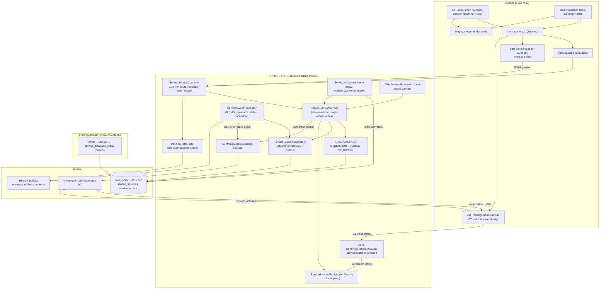
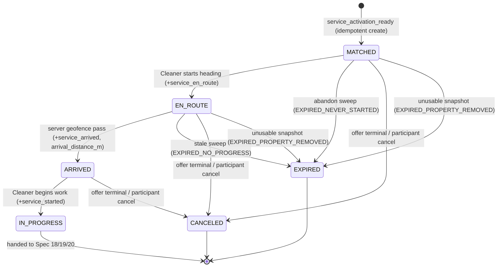

# Design Document: Service Tracking

## Overview

`service-tracking` (Spec 17, first of Sprint 5 — Service Execution) covers the phase **after a match is locked and escrow is charged, but before the work begins**: the Cleaner heads to the property, the Host watches the live position approach on a map, and a **server-authoritative geofence** confirms physical arrival and unlocks on-arrival video verification (Spec 18). It is **not a new domain** — a `service_sessions` row is a durable execution lifecycle bound 1:1 to one matched offer, inheriting that offer's two participants (`hostId`/`cleanerId`) and their server-side authorization exactly the way chat/voip inherit authorization from a conversation. It introduces no new participant, ownership, or payment model.

The design rests on four seams, each mirroring a pattern already proven in sibling specs (chat's persist-then-publish, voip's single-winner state machine + best-effort transport, push-notifications' transactional outbox, chat/voip's auth-owned realtime tokens):

1. **A durable domain event is the creation trigger — never two cross-context status queries.** service-tracking creates a session in reaction to the single `service_activation_ready` fact (offer `MATCHED` AND escrow `CAPTURED`, emitted as one outbox event by the offer/escrow path). It **does not** read `offer.status` and `payment.status` independently. Creation is idempotent (a redelivered activation event never creates a second session), off the same outbox seam other consumers use, and a failure to create the session never rolls back or blocks the match/escrow.
2. **Position ingress puts the backend on the path (Option A) — the control plane / media plane split.** The Cleaner does **not** publish position to Centrifugo. Position samples are POSTed to `POST /service-sessions/:id/position`; the server rate-limits, gates eligibility (accuracy + staleness), runs the PostGIS geofence, transitions durably if arrived, then **re-publishes** the position to the session's Centrifugo channel `service:session:{id}` for the Host. The channel is an **output** transport (server → Host), never the geofence input. Live position is ephemeral and **never persisted** — the sole durable location datum is `arrival_distance_m`.
3. **PostgreSQL is the source of truth for the session lifecycle + the arrival geofence-crossing fact.** The `service_sessions` row (participants, `offerId`, state, timestamps, `arrival_distance_m`) is authoritative. Every transition is a single-winner conditional write (`UPDATE ... WHERE id=:id AND state=:expected`) that, in the SAME transaction, sets the derived timestamps and writes a durable outbox event. Live coordinates are never authoritative and never persisted as a trail.
4. **Realtime tokens stay owned by auth.** Auth mints the `service:session:{id}` channel token (reusing `CENTRIFUGO_TOKEN_SECRET`) only after service-tracking's participation rule passes — the exact ownership boundary chat/voip use for Centrifugo/LiveKit tokens. service-tracking owns only the participation rule.

**Authority split (kept strict):**
- **The matched offer owns who may participate.** A session belongs to one matched offer; its only two participants are that offer's `hostId`/`cleanerId`, resolved server-side. A session id or channel name never authorizes.
- **PostgreSQL is the source of truth for the session lifecycle + arrival fact.** Ephemeral position is never authoritative and never persisted.
- **Centrifugo is best-effort transport for live position + state signals.** The DB state machine is authoritative and reconciled via `GET`; a dropped frame never corrupts state.
- **The server owns the geofence computation, with an explicit GPS threat model.** Arrival is decided server-side via PostGIS; reported coordinates are **client telemetry, not cryptographic proof of physical presence**. Anti-spoofing is out of scope (human presence is complemented by Spec 18).

**Scope reflected in this design:** one geofence (property arrival only, no departure/dwell/multi-point); no persistent breadcrumb/route history; no durable ETA (a live ETA MAY be shown but is not a durable fact); the session's tracking role ends at `IN_PROGRESS` (handed to Specs 18/19/20); no SOS/panic, no in-app turn-by-turn navigation; push delivery is Spec 16 (service-tracking only emits durable `service_*` events). See `requirements.md`.

This design maps every requirement and correctness invariant (REQ-ST1 … REQ-ST12) to concrete, verifiable properties **P1 … P14** (below), each backed by tests.

### Responsibility Matrix

| Responsibility | Mobile App | NestJS API | Centrifugo | PostGIS | Offer/Escrow |
|----------------|-----------|------------|------------|---------|--------------|
| Emit `service_activation_ready` (MATCHED + CAPTURED) | ❌ | ❌ | ❌ | ❌ | ✅ (outbox) |
| Create session (idempotent, off activation event) | ❌ | ✅ | ❌ | ❌ | ❌ |
| Session state machine (single-winner writes) | ❌ | ✅ | ❌ | ❌ | ❌ |
| Position ingress endpoint | ❌ (send) | ✅ (receive) | ❌ | ❌ | ❌ |
| Rate-limit / eligibility gate (accuracy, staleness) | ❌ | ✅ | ❌ | ❌ | ❌ |
| Geofence computation (ST_DWithin) | ❌ | ✅ | ❌ | ✅ | ❌ |
| Re-publish position to Host | ❌ | ✅ (publish) | ✅ (transport) | ❌ | ❌ |
| Live position rendering | ✅ | ❌ | ❌ | ❌ | ❌ |
| Realtime token minting | ❌ | ✅ (auth) | ❌ | ❌ | ❌ |
| Participation rule | ❌ | ✅ | ❌ | ❌ | ❌ |
| Durable `service_*` outbox events | ❌ | ✅ | ❌ | ❌ | ❌ |
| Force-expire stale/abandoned sessions (sweep) | ❌ | ✅ | ❌ | ❌ | ❌ |
| Force-cancel on offer-terminal | ❌ | ✅ | ❌ | ❌ | ✅ (signal) |
| Map surface (destination, position) | ✅ (Mapbox) | ❌ | ❌ | ❌ | ❌ |
| `GET` reconciliation | ✅ (trigger) | ✅ (data) | ❌ | ❌ | ❌ |

## Ownership Boundary — service-tracking vs. auth vs. offer/escrow

```
offer/escrow path                         service-tracking module                    auth module
  emits ONE durable event                   ServiceSessionParticipationService          GET /auth/centrifugo/token
  service_activation_ready  ──outbox──►        .isParticipant(userId, sessionId)  ◄──── (consulted for sub tokens)
   (MATCHED AND CAPTURED)                     creates session idempotently                mints service:session:{id}
  offer terminal ──────────────────────────► force-cancel session (idempotent)           token IFF isParticipant
```

- **The offer/escrow path is the source of truth for the activation fact.** It emits `service_activation_ready` as one outbox event; service-tracking reacts, never queries the two contexts separately.
- **service-tracking owns** the session state machine, the participation rule, the server-side geofence computation, position ingress + rate limiting, and the durable `service_*` outbox events.
- **Auth owns** identity resolution (Keycloak JWT `sub`), HMAC signing (`CENTRIFUGO_TOKEN_SECRET`), and token TTL/expiry. It consults service-tracking's participation rule to mint a session channel token; it learns no tracking business rules.
- Dependency is one-directional (auth → service-tracking participation check; service-tracking → offer/escrow outbox, read-only). No business transaction depends on tracking; no duplicated auth surface.

## Architecture



**Data flow — activation → session creation (durable-first, idempotent):**
1. The offer/escrow path commits the match + escrow capture and, in the same transaction, writes a `service_activation_ready` outbox row (`event_id UNIQUE`, `payload = { offerId, hostId, cleanerId, propertyId }`).
2. `ServiceActivationListener` (relay) drains committed-but-unrelayed activation rows and calls `ServiceSessionService.createFromActivation()`.
3. `createFromActivation` snapshots the property point (`property_location_snapshot`) and the configured radius (`geofence_radius_m`), then `INSERT ... ON CONFLICT (offer_id) DO NOTHING` — `UNIQUE offer_id` guarantees at most one session; a redelivered event is a no-op (idempotent).

**Data flow — position ingress → geofence → arrival (Option A):**
1. Cleaner POSTs `{ lat, lng, accuracy, heading?, at }` to `POST /service-sessions/:id/position`.
2. `ServiceSessionController` authorizes the caller as the session's Cleaner, then `PositionRateLimiter` drops/coalesces samples faster than `SERVICE_POSITION_MIN_INTERVAL_MS` per `(user, session)` (ignored, not errored).
3. `GeofenceService` computes **eligibility** (`accuracy ≤ SERVICE_POSITION_MAX_ACCURACY_M` AND `server_now − at ≤ SERVICE_POSITION_MAX_AGE_MS`). An ineligible sample is ignored for arrival (never errors).
4. For an eligible sample on an `EN_ROUTE` session, PostGIS `ST_DWithin(property_location_snapshot, ST_MakePoint(lng, lat)::geography, geofence_radius_m)` runs. On pass, a single-winner `EN_ROUTE → ARRIVED` write sets `arrived_at` (server timestamp), `arrival_distance_m`, and writes a `service_arrived` outbox event in the SAME transaction.
5. Regardless of arrival, the server best-effort re-publishes the position to `service:session:{id}` for the Host. A publish failure is swallowed; correctness is unaffected.

**Data flow — connect/subscribe (Host, read-only):**
1. `useTrackingChannel` GETs a subscription token from `/auth/centrifugo/token?channel=service:session:{id}`.
2. Auth asks `ServiceSessionParticipationService.isParticipant(sub, id)`; issues a subscription token only if true, else `403`.
3. The Host connects and subscribes read-only; identity is always the JWT subject — the id in the channel string is never trusted. The Cleaner is not a channel publisher at all.

## Components and Interfaces

### Backend — service-tracking module (`services/api/src/service-tracking/`)

**`ServiceSessionService`** — the orchestrator, resolving authorization from the matched offer's parties.
- `createFromActivation(payload)` — idempotent creation off the `service_activation_ready` fact: snapshot property point + radius, `INSERT ... ON CONFLICT (offer_id) DO NOTHING`. Never throws into the relay in a way that blocks the batch (per-row try/catch); a creation failure never touches the already-committed match/escrow.
- `startEnRoute(sessionId, userId)` — assert caller is the Cleaner; single-winner `MATCHED → EN_ROUTE`, set `en_route_at`, write `service_en_route` outbox event in the same tx.
- `ingestPosition(sessionId, userId, sample)` — assert caller is the Cleaner + session `EN_ROUTE`; delegate eligibility + geofence to `GeofenceService`; on arrival, single-winner `EN_ROUTE → ARRIVED`; always best-effort re-publish. Rate limiting is enforced in the controller before this runs.
- `start(sessionId, userId)` — assert caller is the Cleaner; single-winner `ARRIVED → IN_PROGRESS`, set `started_at`, write `service_started` outbox event; `IN_PROGRESS` is the hand-off to Specs 18/19/20.
- `cancelByParticipant(sessionId, userId)` — single-winner non-terminal → `CANCELED` (`ended_reason = CANCELED_BY_PARTICIPANT`).
- `forceCancelForOffer(offerId, reason)` — idempotent single-winner non-terminal → `CANCELED` (`CANCELED_OFFER_TERMINAL`) for the offer's session, invoked from the offer-terminal path.
- `getSession(sessionId, userId)` — participant-gated reconciliation read (authoritative state machine truth).
- Functions ≤30 lines, SRP; the geofence and rate-limit concerns live in dedicated collaborators.

**`GeofenceService`** — the pure eligibility + arrival decision.
- `isEligible(sample, serverNow, config): boolean` — `accuracy ≤ MAX_ACCURACY_M` AND `(serverNow − at) ≤ MAX_AGE_MS`. Pure, unit/property-testable.
- `isWithinGeofence(snapshotPoint, sample, radiusM): Promise<{ within: boolean; distanceM: number }>` — PostGIS `ST_DWithin` + `ST_Distance` over the session's **snapshot** (not the live property row), returning the server-observed distance. Uses the session's snapshotted radius so a config change or mid-session property edit never retroactively alters an in-flight session.

**`PositionRateLimiter`** — server-side throttle per `(user, session)` backed by Redis (never trusting the client to self-limit). `shouldAccept(userId, sessionId, now): boolean` — rejects (drops/coalesces) samples faster than `SERVICE_POSITION_MIN_INTERVAL_MS`; over-frequent samples are ignored, not errored.

**`ServiceSessionParticipationService`** — `isParticipant(userId, sessionId): Promise<boolean>`, a thin lookup resolving the session's `host_id`/`cleaner_id`, used by both service-tracking authorization and the auth subscription-token endpoint. Single source of the participation rule.

**`ServiceSessionRepository`** — parameterized SQL only. `createSession(payload)` (idempotent upsert on `offer_id`), single-winner `transition(id, expected, next, derivedFields, outboxEvent)` (state change + timestamps + outbox row in ONE transaction), `findById`, `findExpirableEnRoute(before)` / `findAbandonedMatched(before)` (bounded sweep queries), `findByOfferId`. The geofence `ST_DWithin`/`ST_Distance` run through this repository against `property_location_snapshot`.

**`ServiceActivationListener`** (relay) — drains committed-but-unrelayed `service_activation_ready` outbox rows (`relayed_at IS NULL`, ordered by `created_at`, bounded batch), calls `createFromActivation`, then marks the row relayed. At-least-once and idempotent (a re-drained row is deduped by `UNIQUE offer_id`).

**`OfferTerminalSessionListener`** — mirrors voip's `OfferTerminalCallListener`: on offer terminal (cancelled/expired/completed) or match invalidation, `forceCancelForOffer(offerId, CANCELED_OFFER_TERMINAL)` idempotently. Wired via the existing offer-terminal path (event listener or direct call), introducing no new coupling.

**`ServiceSweepProcessor`** (BullMQ repeatable; interval/batch from config) — bounded, idempotent, single-winner force-expiry so no session is stuck:
- **Abandon sweep:** `MATCHED` older than `SERVICE_SESSION_ABANDON_MS` → `EXPIRED` (`EXPIRED_NEVER_STARTED`).
- **Stale sweep:** `EN_ROUTE` with no eligible position within `SERVICE_EN_ROUTE_STALE_MS` (tracked via `last_progress_at`) → `EXPIRED` (`EXPIRED_NO_PROGRESS`).
- **Property-removed sweep:** a non-terminal session whose `property_location_snapshot` is unusable → `EXPIRED` (`EXPIRED_PROPERTY_REMOVED`). Because the geofence uses the snapshot, a mere property deletion does NOT trigger this — only an unusable snapshot does.
Each expiry is a single-winner write that best-effort publishes a state signal.

**Auth: Centrifugo session token** (extends the existing `CentrifugoTokenController` from realtime-chat) — for `?channel=service:session:{id}`, mints a subscription token only after `ServiceSessionParticipationService.isParticipant(sub, id)` is true, else `403`. The token scopes the **Host to subscribe** (read-only) on that one session channel; the Cleaner is not a channel publisher. HMAC-signed with `CENTRIFUGO_TOKEN_SECRET`, bounded TTL from config.

**`ServiceSessionController`** (`@Controller('service-sessions') @UseGuards(JwtAuthGuard)`, whitelisting `ValidationPipe`):
- `GET /service-sessions/:id` → participant-gated reconciliation (authoritative state; latest live position is transient, only over the channel).
- `POST /service-sessions/:id/en-route` → Cleaner marks heading out (`MATCHED → EN_ROUTE`).
- `POST /service-sessions/:id/position` → Cleaner reports `{ lat, lng, accuracy, heading?, at }`; rate-limited, eligibility-gated, geofence-evaluated, re-published.
- `POST /service-sessions/:id/start` → Cleaner begins work (`ARRIVED → IN_PROGRESS`).
- `POST /service-sessions/:id/cancel` → explicit participant cancel (`CANCELED_BY_PARTICIPANT`).
JWT-guarded; identity from `req.user.keycloakId → userId`; a non-participant receives `403` and learns nothing about the session's existence.

### Mobile (`apps/mobile/src/screens/tracking/`)

- **`tracking.types.ts`** — `ServiceSession` (`id`, `offerId`, `state`, `enRouteAt`, `arrivedAt`, `startedAt`, `arrivalDistanceM`, `geofenceRadiusM`, `propertyLocation`), `LivePosition` (`lat`, `lng`, `accuracy`, `heading?`, `at`), `SessionState`, `ConnectionStatus`.
- **`tracking.constants.ts`** — routes/endpoints, channel prefix, client send cadence (`EXPO_PUBLIC_SERVICE_POSITION_MIN_INTERVAL_MS`), map defaults, i18n keys (all from `EXPO_PUBLIC_*`/constants; none hardcoded).
- **`tracking.api.ts`** — typed calls over the shared `apiClient` (get session, en-route, post position, start, cancel, get session channel subscription token).
- **`usePositionReporter.ts`** (Cleaner) — requests location permission, throttles sends to the client cadence, POSTs samples to the position endpoint; degrades gracefully when permission is denied/unavailable (i18n explanation, never crash) — the session still functions via server-side geofence on whatever coordinates are provided.
- **`useTrackingChannel.ts`** (Host) — mirrors `useCentrifugoChannel`'s resilient skeleton (token fetch, WS connect to `service:session:{id}`, push-envelope unwrap, bounded exponential-backoff reconnect, foreground reconcile via `GET`, teardown) but parses live position + state signals and updates the store. Read-only subscriber; no publish path.
- **`tracking.store.ts`** — Zustand `create` with `TrackingState` (session, latest live position, connectionStatus) + actions (`loadSession`, `startEnRoute`, `reportPosition`, `markStarted`, `cancel`, `onLivePosition`, `onStateSignal`, `reconcile`, `reset`). State-signal application is idempotent and ignores regressions (older/illegal transitions no-op); the authoritative state is always recoverable via `GET`.
- **`EnRouteScreen.tsx`** (Cleaner) — destination + optional live ETA (shown, not durable), a "Start" affordance enabled only when `ARRIVED`; **`TrackingScreen.tsx`** (Host) — Mapbox rendering the Cleaner's live position + the current state ("on the way / arrived / started"), a clear "Cleaner has arrived" indication on `ARRIVED`, and a "location unavailable" state rather than a stale position. Dark BidClean tokens; i18n `en`/`es` parity.
- **Navigation** — reachable from the matched/active job entry point in both role navigators (Host active-job view opens `TrackingScreen`; Cleaner active-job view opens `EnRouteScreen`), keyed by the session's `offerId`/`id`.
- **Map** — Mapbox renders position/destination only; it is never the source of truth for position or arrival (that is Centrifugo transport + the server geofence).

## Data Models

All tables follow the project database standards: `UUID` PK (`gen_random_uuid()`), snake_case, `TIMESTAMP WITH TIME ZONE`, explicit FK `ON DELETE`, indexes on every FK, application-validated `VARCHAR` for `state`/`ended_reason` (no PG enums), `geography` for PostGIS points. Reversible migration with `IF NOT EXISTS`, table/column comments.

### `service_sessions` (new — the durable execution lifecycle; never live coordinates)

| Column | Type | Notes |
|---|---|---|
| `id` | `UUID PK DEFAULT gen_random_uuid()` | |
| `offer_id` | `UUID NOT NULL` | FK → `offers(id)` **ON DELETE CASCADE**; **`UNIQUE`** (one session per matched offer — the idempotency backstop) |
| `host_id` | `UUID` (nullable) | FK → `users(id)` **ON DELETE SET NULL** (never cascade from users; retain session on participant deletion); indexed |
| `cleaner_id` | `UUID` (nullable) | FK → `users(id)` **ON DELETE SET NULL**; indexed |
| `property_id` | `UUID` (nullable) | FK → `properties(id)` **ON DELETE SET NULL** (referential coherence; geofence uses the snapshot, not this row); indexed |
| `property_location_snapshot` | `GEOGRAPHY(Point, 4326) NOT NULL` | geofence center captured at creation; survives a mid-session property deletion |
| `geofence_radius_m` | `INTEGER NOT NULL` | radius snapshotted from config at creation (default from `SERVICE_GEOFENCE_RADIUS_M`) |
| `state` | `VARCHAR(20) NOT NULL DEFAULT 'MATCHED'` | app-validated `MATCHED/EN_ROUTE/ARRIVED/IN_PROGRESS/CANCELED/EXPIRED` |
| `ended_reason` | `VARCHAR(30)` (nullable) | `STARTED/CANCELED_OFFER_TERMINAL/CANCELED_BY_PARTICIPANT/EXPIRED_NO_PROGRESS/EXPIRED_NEVER_STARTED/EXPIRED_PROPERTY_REMOVED` |
| `en_route_at` | `TIMESTAMPTZ` (nullable) | set on `MATCHED → EN_ROUTE` |
| `arrived_at` | `TIMESTAMPTZ` (nullable) | set on `EN_ROUTE → ARRIVED` (**server** timestamp, not the client `at`) |
| `started_at` | `TIMESTAMPTZ` (nullable) | set on `ARRIVED → IN_PROGRESS` |
| `arrival_distance_m` | `INTEGER` (nullable) | **the only durable location-derived datum**; server-observed distance at the geofence crossing |
| `last_progress_at` | `TIMESTAMPTZ` (nullable) | updated on each eligible EN_ROUTE sample; drives the stale sweep (a scalar timestamp, not a coordinate) |
| `created_at` / `updated_at` | `TIMESTAMPTZ DEFAULT NOW()` | **no `deleted_at`** — a terminal-for-tracking session is an immutable audit fact |

Indexes / constraints:
- `uq_service_sessions_offer (offer_id)` — the hard guarantee behind "at most one session per offer".
- FK indexes: `idx_service_sessions_host (host_id)`, `idx_service_sessions_cleaner (cleaner_id)`, `idx_service_sessions_property (property_id)`.
- `idx_service_sessions_sweep (state, last_progress_at) WHERE state IN ('MATCHED','EN_ROUTE')` — bounded sweep scan over non-terminal states.
- GiST is implicit on `property_location_snapshot` via PostGIS usage; the geofence is a per-row `ST_DWithin` on the session's own snapshot (no cross-table spatial index needed).
- `CHECK` constraints (VARCHAR + app validation, not PG enums) for `state` and `ended_reason`.
- **No breadcrumb / location-history column** — only the single scalar `arrival_distance_m` persists.

Migration: `services/api/src/migrations/<timestamp>-CreateServiceSessions.ts`, reversible `up()`/`down()`, `IF NOT EXISTS`, table/column comments.

### `service_outbox` (durable events consumed by Spec 16 push / Spec 18 video)

Mirrors the per-domain outbox convention (push-notifications). Written in the SAME transaction as the state transition; the notifications relay and the video verification listener consume it.

| Column | Type | Notes |
|---|---|---|
| `id` | `UUID PK DEFAULT gen_random_uuid()` | |
| `event_id` | `VARCHAR(255) NOT NULL` | **`UNIQUE`** — deterministic per transition (e.g. `service_arrived:{sessionId}`) |
| `aggregate_type` | `VARCHAR(30) NOT NULL DEFAULT 'service_session'` | app-validated |
| `aggregate_id` | `UUID NOT NULL` | the `service_sessions.id` |
| `type` | `VARCHAR(50) NOT NULL` | `service_en_route` / `service_arrived` / `service_started` |
| `payload` | `JSONB NOT NULL` | minimal ids (e.g. `{ sessionId, offerId, cleanerId, hostId }`; `service_arrived` adds `arrivalDistanceM`) — no coordinate stream, no PII |
| `version` | `INTEGER NOT NULL DEFAULT 1` | payload version |
| `created_at` | `TIMESTAMPTZ NOT NULL DEFAULT NOW()` | committed WITH the transition |
| `relayed_at` | `TIMESTAMPTZ` (nullable) | set by a consumer's relay after durable handling |

Indexes: `uq_service_outbox_event (event_id)`; `idx_service_outbox_unrelayed (created_at) WHERE relayed_at IS NULL`.

> **Consumes `service_activation_ready`.** service-tracking does not own the activation outbox table (the offer/escrow domain owns it, per "each context owns its tables"); `ServiceActivationListener` reads it read-only via the shared relay seam and dedups creation on `UNIQUE offer_id`.

### Deletion-policy coherence (Spec 13 invariant)

Consistent with chat/voip: participant/property FKs (`host_id`, `cleaner_id`, `property_id`) are **`ON DELETE SET NULL`**, never `CASCADE` from `users`. The platform's central deletion anonymizes PII and marks the user `DELETED` without physically removing the `users` row; SET NULL means deleting/anonymizing a participant never destroys a session's audit history. Only `offer_id` cascades (removing the parent offer removes its session). service-tracking introduces **no user-cascade path** and needs no destructive deletion step of its own. No media/location cleanup is required on cascade because live position is never persisted.

### State machine (durable, single-winner)



Every transition is `UPDATE service_sessions SET state=:next, <derived fields>=... WHERE id=:id AND state=:expected` — the winner (rows=1) sets the derived timestamps AND writes the outbox event in the same transaction; concurrent losers observe rows=0 and no-op. Terminal-for-tracking states (`IN_PROGRESS`, `CANCELED`, `EXPIRED`) are immutable.

## Correctness Properties

*A property is a characteristic or behavior that should hold true across all valid executions of a system — essentially, a formal statement about what the system should do. Properties serve as the bridge between human-readable specifications and machine-verifiable correctness guarantees.*

Each property is testable and maps back to the requirements' REQ-ST invariants and acceptance criteria.

### Property 1: Session is a matched+charged-offer lifecycle, created idempotently from one durable fact

*For any* `service_activation_ready` event delivered N ≥ 1 times (and *for any* interleaving of concurrent creation attempts for the same `offer_id`), the store SHALL contain exactly one `service_sessions` row for that `offer_id`, in state `MATCHED`, with `property_location_snapshot` and `geofence_radius_m` snapshotted at creation. Every redelivery/concurrent attempt is a no-op — never a second session.

**Validates: Requirements 1.1, 1.5** · REQ-ST1

### Property 2: Additive & non-blocking isolation

*For any* failure injected into the activation listener or the session-creation path, the emitting match/escrow business fact SHALL commit unchanged and its outcome SHALL be identical to a run with tracking disabled, and the activation outbox row SHALL remain re-drainable — no tracking-side failure ever propagates into, delays, or alters the source transaction.

**Validates: Requirements 1.2** · REQ-ST1

### Property 3: Participant isolation

*For any* user and *for any* session, every session read/action (`GET`, en-route, position, start, cancel) and every channel subscription SHALL be authorized server-side from the matched offer's `hostId`/`cleanerId`; a non-participant SHALL receive `403`, learn nothing about the session's existence, and see no position data. A session id or channel name SHALL never by itself authorize.

**Validates: Requirements 1.3, 2.5** · REQ-ST2

### Property 4: Token scoping (auth-owned, read-only Host)

*For any* `(user, session)` pair, a `service:session:{id}` subscription token SHALL be issued if and only if the authenticated JWT subject `isParticipant` of that session (resolved by lookup, never from the channel string). The token SHALL scope the Host to subscribe (read-only); no publish grant is ever issued to the Cleaner (the server is the sole publisher), and the signing secret SHALL never reach the client except as the time-boxed token.

**Validates: Requirements 2.4, 6.2** · REQ-ST2, REQ-ST8

### Property 5: Server-authoritative geofence over the snapshot (eligibility-gated)

*For any* reported sample and *for any* session with `property_location_snapshot` L and snapshotted radius R, an `EN_ROUTE → ARRIVED` transition (with `arrival_distance_m`) SHALL occur if and only if the sample is **eligible** (`accuracy ≤ SERVICE_POSITION_MAX_ACCURACY_M` AND `server_now − at ≤ SERVICE_POSITION_MAX_AGE_MS`) AND the geodesic distance between L and the reported point ≤ R. The evaluation SHALL use the creation-time snapshot L and R, invariant to any later config or property mutation. A client "arrived" claim without a passing eligible sample SHALL never set the arrival fact, and an ineligible sample SHALL be ignored for arrival without erroring.

**Validates: Requirements 3.1, 3.2, 3.4, 3.5, 4.7** · REQ-ST4, REQ-ST12

### Property 6: Single-winner, atomic, monotonic state machine

*For any* transition and *for any* N concurrent actors, exactly one conditional write (`... WHERE id=:id AND state=:expected`) SHALL succeed and, in one transaction, set the derived timestamps (`en_route_at`/`arrived_at`/`started_at`/`arrival_distance_m`/`ended_reason`) AND the corresponding outbox event (`service_en_route`/`service_arrived`/`service_started`); concurrent losers observe rows=0 and no-op. A transition SHALL succeed only if it is an allowed edge of `MATCHED → EN_ROUTE → ARRIVED → IN_PROGRESS` plus terminal `CANCELED | EXPIRED`; illegal transitions leave state unchanged and terminal-for-tracking states are immutable. History SHALL never observe an `ARRIVED` session without `arrived_at`, nor a `service_arrived` event without a committed arrival.

**Validates: Requirements 3.3, 4.1, 4.2, 4.3, 4.4, 7.4** · REQ-ST5, REQ-ST6

### Property 7: No stuck session, differentiated causes

*For any* non-terminal session past its configured threshold, a bounded, idempotent, single-winner sweep SHALL force it terminal with the correct differentiated `ended_reason`: a stale `EN_ROUTE` (no eligible progress within `SERVICE_EN_ROUTE_STALE_MS`) → `EXPIRED_NO_PROGRESS`; a session that never left `MATCHED` within `SERVICE_SESSION_ABANDON_MS` → `EXPIRED_NEVER_STARTED`; an unusable snapshot → `EXPIRED_PROPERTY_REMOVED`. An offer-terminal signal SHALL idempotently force `CANCELED` with `CANCELED_OFFER_TERMINAL`, and an explicit participant cancel SHALL use `CANCELED_BY_PARTICIPANT`.

**Validates: Requirements 4.5, 4.6, 4.7** · REQ-ST7

### Property 8: Server-side rate limiting

*For any* sequence of position sample arrival times for a `(user, session)`, the accepted samples SHALL be spaced at least `SERVICE_POSITION_MIN_INTERVAL_MS` apart; samples faster than the interval SHALL be dropped/coalesced (ignored, never errored), never trusting the client to self-limit — bounding CPU/PostGIS/Centrifugo load.

**Validates: Requirements 2.3, 6.1** · REQ-ST11

### Property 9: Position is ephemeral (no persisted trail)

*For any* sequence of position samples posted to a session, the only location-derived datum ever persisted SHALL be the single scalar `arrival_distance_m` (set once on the geofence crossing); no coordinate row, breadcrumb, or route history SHALL exist in PostgreSQL, and no raw coordinate or participant PII SHALL be written to logs.

**Validates: Requirements 2.2, 6.3, 7.5** · REQ-ST3

### Property 10: Best-effort transport, authoritative reconciliation

*For any* re-publish outcome (success, failure, timeout) and *for any* dropped/delayed frame, the durable session state and arrival fact SHALL be identical, and a `GET /service-sessions/:id` SHALL return the authoritative PostgreSQL state independent of realtime delivery — a lost signal is always recoverable by reading the session.

**Validates: Requirements 2.6, 4.8** · REQ-ST3, REQ-ST7

### Property 11: Deletion coherence (no cascade-from-users)

*For any* session, deleting/anonymizing a participant SHALL null `host_id`/`cleaner_id`/`property_id` (`ON DELETE SET NULL`) while retaining the session record and its `arrival_distance_m` arrival fact; only `offer_id` cascades. No user-cascade path SHALL ever destroy session history.

**Validates: Requirements 7.3** · REQ-ST9

## Error Handling

| Condition | Response |
|---|---|
| Non-participant / unauthenticated on any session endpoint | `403`, no existence disclosure, no position data |
| Subscription-token request by a non-participant | `403`, no token minted |
| Redelivered `service_activation_ready` / concurrent create | `UNIQUE offer_id` (`ON CONFLICT DO NOTHING`) → idempotent no-op |
| Activation-listener / create-path failure | Row-scoped catch; activation row not marked relayed; retried next drain; match/escrow tx unaffected |
| Position sample faster than min interval | Rate-limited: dropped/coalesced, ignored (never errored) |
| Ineligible sample (low accuracy / stale) | Ignored for arrival, never sets `ARRIVED`, never errors; still best-effort re-published |
| Geofence check does not pass | Session stays `EN_ROUTE`; no arrival fact regardless of any client claim |
| Concurrent transition on one session | Single-winner: exactly one write succeeds; losers observe rows=0 and no-op |
| Illegal state transition attempted | Rejected (`409`); state unchanged; terminal states immutable |
| Best-effort Centrifugo publish failure | Swallowed; state intact; recoverable via `GET` |
| Offer becomes terminal mid-session | `OfferTerminalSessionListener` force-cancels idempotently (`CANCELED_OFFER_TERMINAL`); further tracking rejected |
| Property deleted mid-session | Geofence continues via `property_location_snapshot`; only an unusable snapshot → `EXPIRED_PROPERTY_REMOVED` |
| Stale `EN_ROUTE` / never-started `MATCHED` | Bounded idempotent sweep → `EXPIRED_NO_PROGRESS` / `EXPIRED_NEVER_STARTED` |
| Missing required config at boot | `validateServiceTrackingConfig()` throws (fail-fast) |
| Location permission denied (mobile) | Graceful i18n explanation; never crash; session still works via server-side geofence; Host sees "location unavailable" |

## Testing Strategy

Property-based testing **applies** to this feature: the core logic is pure decision + conditional-write + rate-limit over a large input space (arbitrary coordinates/accuracy/timestamps, concurrent transitions, event redeliveries, participant/non-participant pairs, session graphs). Universal properties (idempotent creation, server-authoritative geofence, single-winner state machine, ephemeral position, rate limiting, deletion coherence) are meaningfully quantified over inputs, so PBT is the right tool for the logic layer; Centrifugo/BullMQ/Postgres+PostGIS I/O is covered by mock-based unit and integration tests.

### Property-Based Tests (fast-check)

Library: `fast-check` (TypeScript). Each test runs **minimum 100 iterations** and is tagged with a comment: `// Feature: service-tracking, Property N: <text>`.

| Property | What to Generate | What to Assert |
|----------|-----------------|----------------|
| P1 Idempotent creation | Random activation payloads × N redeliveries × concurrent interleavings | Exactly one session per `offer_id`, MATCHED, snapshot copied |
| P2 Non-blocking isolation | Random failures injected into listener/create path | Source match/escrow fact unchanged; activation row re-drainable |
| P3 Participant isolation | Random (user, session) pairs across all endpoints | Access iff user ∈ {host_id, cleaner_id}; else `403`, no disclosure |
| P4 Token scoping | Random participant/non-participant pairs + channels | Sub token iff participant; read-only Host scope; no publish grant; secret never shipped |
| P5 Geofence + eligibility + snapshot | Random points, accuracy, sample age, radii, post-creation config/property mutations | ARRIVED iff eligible AND distance ≤ snapshot radius; snapshot values used; claim/ineligible never arrives |
| P6 State machine single-winner + atomicity | Random (from,to) pairs + N concurrent actors per transition | One winner sets derived fields + outbox atomically; illegal edges rejected; terminal immutable |
| P7 No-stuck sweep | Random session ages/progress/thresholds + terminal signals | Correct differentiated `ended_reason`; bounded, idempotent, single-winner |
| P8 Rate limiting | Random sample arrival-time sequences per (user, session) | Accepted samples spaced ≥ MIN_INTERVAL; excess ignored, not errored |
| P9 Ephemeral position | Random sequences of position samples | Persisted location data == {arrival_distance_m} only; no trail; no PII in logs |
| P10 Best-effort + reconciliation | Random publish outcomes / dropped frames | Durable state + arrival fact identical; `GET` returns authoritative state |
| P11 Deletion coherence | Random session graphs + participant deletion | host/cleaner/property nulled; session + arrival fact retained; no user-cascade |

### Unit Tests (NestJS)

- **`GeofenceService`**: `isEligible` boundary matrix (accuracy/age at, below, above limits); `isWithinGeofence` distance/radius edges; snapshot-invariance to config/property changes.
- **`ServiceSessionService`**: participant + state gates; single-winner transition (rows=1 winner vs rows=0 no-op); atomic persist + outbox; best-effort publish failure non-blocking; server-timestamp on `arrived_at`.
- **`PositionRateLimiter`**: accept/drop decisions across arrival cadences; per-(user,session) isolation.
- **`ServiceSessionParticipationService`**: host/cleaner resolution; non-participant denial.
- **`ServiceSessionRepository`**: parameterized SQL; single-winner conditional write; sweep queries select only aged non-terminal rows; `ST_DWithin`/`ST_Distance` over the snapshot; idempotent `ON CONFLICT` create.
- **`ServiceActivationListener`** / **`OfferTerminalSessionListener`**: idempotent creation off the activation event; idempotent force-cancel; failures isolated from the source flow.
- **`validateServiceTrackingConfig()`**: fail-fast when required config missing.
- **Auth session token**: participant-gated mint; read-only Host scope; expiry/signature.

### Integration Tests

- Activation event → session created (`MATCHED`); redelivery → still one session.
- Full flow: en-route → eligible position within radius → `ARRIVED` (server ts + `arrival_distance_m` + `service_arrived`) → start → `IN_PROGRESS` (`service_started`).
- Ineligible/out-of-radius samples → stays `EN_ROUTE`, no arrival fact.
- Rate limiting: burst of samples → only spaced ones evaluated.
- Publish failure → `201`/state intact; `GET` reconciles.
- Offer terminal → session force-`CANCELED`; abandon/stale sweeps → correct `EXPIRED_*`.
- Non-participant denied on read/post/subscribe.
- Property deletion mid-session → arrival still evaluates from the snapshot.
- User deletion → participant FKs SET NULL; session retained.

### Mobile Tests

- **`tracking.store`**: idempotent state-signal application (ignore regressions/older/illegal), `reconcile` via `GET`, reset.
- **`usePositionReporter`**: client-side throttle to the send cadence; permission-denied graceful degrade (no crash); posts only while `EN_ROUTE`.
- **`useTrackingChannel`**: token fetch, bounded backoff reconnect, foreground reconcile, teardown, no duplicate subscription; read-only (no publish path).
- **`EnRouteScreen` / `TrackingScreen`**: destination + live ETA (not persisted); "Start" enabled only when `ARRIVED`; Host live position + state + "arrived" + "location unavailable"; dark tokens; `en`/`es` i18n parity.
- LiveKit/Centrifugo/apiClient/Mapbox mocked (zero real external calls).
- **CI**: backend jobs (API lint/typecheck, API tests, AI tests) stay green; mobile verified locally (`tsc --noEmit` + ESLint + Jest).

## Configuration

Backend (`services/api`, via `ConfigService`; `validateServiceTrackingConfig()` fail-fast at startup):
- `SERVICE_GEOFENCE_RADIUS_M` (default ~50) — geofence radius snapshotted at session creation.
- `SERVICE_POSITION_MIN_INTERVAL_MS` — **server-side** rate limit per `(user, session)`.
- `SERVICE_POSITION_MAX_ACCURACY_M` — eligibility: max reported accuracy.
- `SERVICE_POSITION_MAX_AGE_MS` — eligibility: max sample age (`server_now − at`).
- `SERVICE_POSITION_CHANNEL_PREFIX` (default `service:session:`).
- `SERVICE_POSITION_TOKEN_TTL_SECONDS` — session channel token TTL.
- `SERVICE_EN_ROUTE_STALE_MS`, `SERVICE_SESSION_ABANDON_MS` — sweep thresholds.
- `SERVICE_SWEEP_INTERVAL_MS`, `SERVICE_SWEEP_BATCH_SIZE` — bounded sweep tuning.
- Reused: `CENTRIFUGO_TOKEN_SECRET` (token signing), `CENTRIFUGO_API_URL` / `CENTRIFUGO_API_KEY` (publish transport).

Mobile (`EXPO_PUBLIC_*`):
- `EXPO_PUBLIC_SERVICE_POSITION_MIN_INTERVAL_MS` — **client-side** send cadence (the server independently rate-limits — never trusting the client to self-limit).
- `EXPO_PUBLIC_CENTRIFUGO_WS_URL`, `EXPO_PUBLIC_CENTRIFUGO_TOKEN_URL` (existing), Mapbox token config consistent with the radar screen.

Security: the Centrifugo secret lives only in server config, shipped only as a time-boxed token; coordinates are never persisted or logged as a trail; position payloads/logs carry no participant PII; the only durable location datum is `arrival_distance_m`.

## Documentation Impact

- New module READMEs: `services/api/src/service-tracking/README.md`, `apps/mobile/src/screens/tracking/README.md`; note the new `auth/centrifugo` `service:session:{id}` channel token in the auth module README.
- `docs/ARCHITECTURE.md`: add the service-tracking module + a **service-tracking lifecycle flow** diagram (activation → session → en-route → position ingress → geofence → arrived → started) and the position-ingress (Option A) control-plane/media-plane split; the Centrifugo node already exists.
- `docs/CHANGELOG.md`: `[Unreleased]` entries per task group.
- `.env.example`: add all `SERVICE_*` keys and `EXPO_PUBLIC_SERVICE_POSITION_MIN_INTERVAL_MS`.
- **ADR:** a new ADR for *ephemeral live position + server-authoritative geofence over a creation-time snapshot, with position ingress on the backend path (Option A)* (per Req 6.5).
