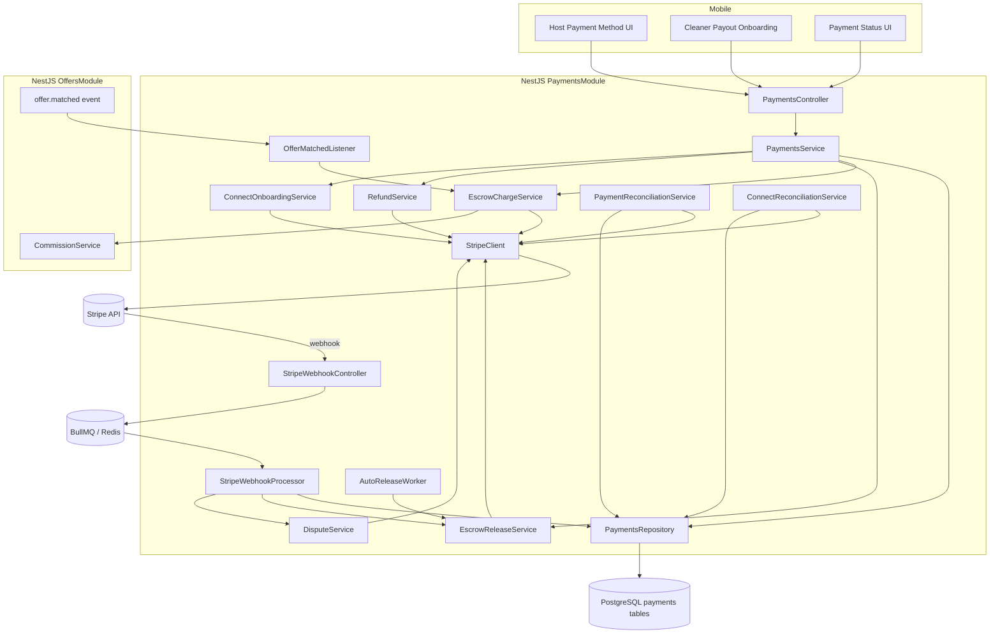
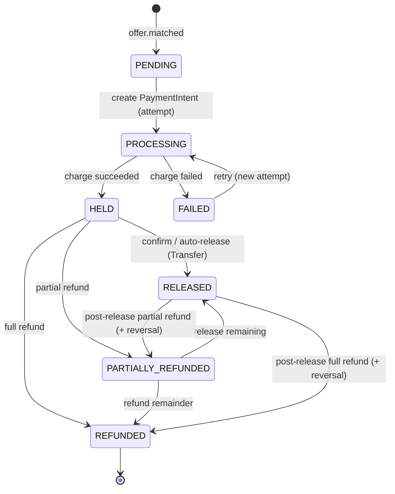
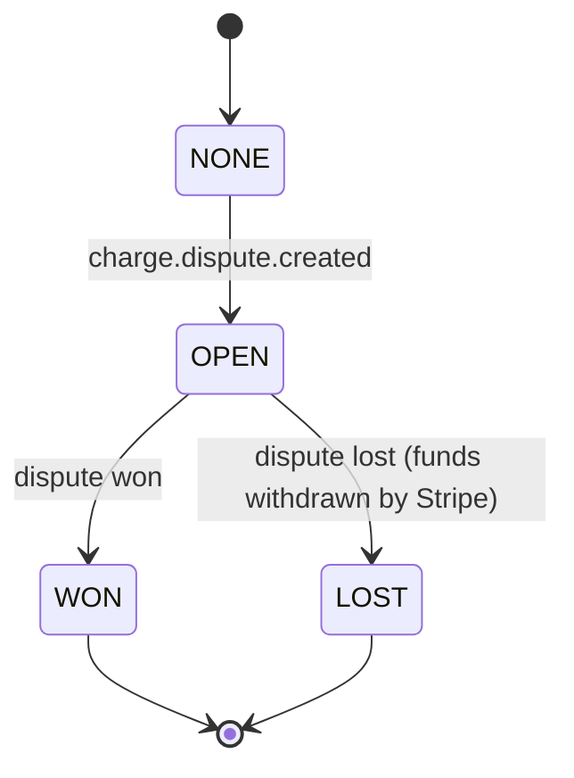
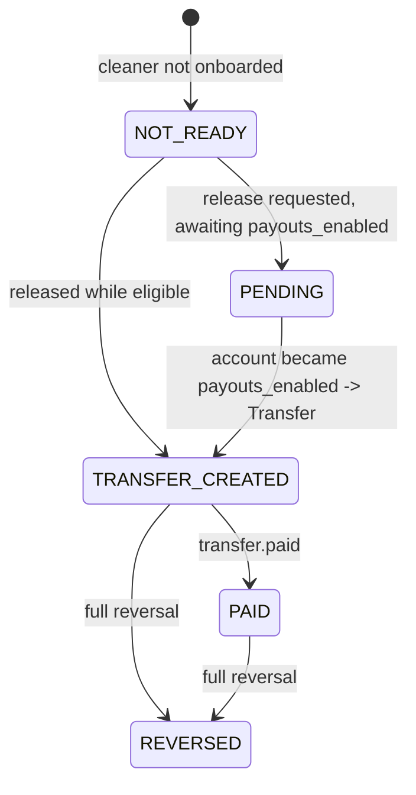

# Design Document

## Overview

The stripe-escrow module moves money for a matched offer. It sits downstream of `offer-negotiation` (which finalizes ACTIVE → MATCHED and emits `offer.matched`) and reuses `offer-publishing`'s `CommissionService` for all fee/payout math. Its job is to charge the Host immediately on match, hold the funds on the platform's Stripe balance (business-level "escrow"), and release the Cleaner's payout to their Stripe Express Connected Account when the service is confirmed (or after a configurable auto-release window) — while keeping the platform commission.

The design is anchored on four hard rules:

1. **Separate charges and transfers.** The platform charges the Host (funds land on the platform balance = escrow), then later creates a Transfer to the Cleaner's Connected Account. This is Stripe's recommended marketplace model and avoids the ~7-day expiry of card authorizations, so a service scheduled weeks out never loses its hold.
2. **Stripe is the external financial system of record; Postgres is BidClean's internal financial ledger and orchestration state.** Every state-changing Stripe call is idempotent and mirrored into an append-only `payment_events` ledger. Webhooks and a reconciliation sweep converge persisted state to Stripe's truth. A crashed synchronous call is always recoverable.
3. **The module never touches the offer lifecycle.** It reacts to `offer.matched` and emits its own domain events (`payment.captured`, `payment.released`, `payment.failed`, `payment.refunded`, `payment.disputed`). It references offers/users by ID only. When a charge fails, it emits `payment.failed` and offer-publishing/offer-negotiation decides the offer's next state (contract below).
4. **Three independent lifecycles, not one status.** A Payment's financial state, its Dispute state, and its Payout state are tracked separately (`payment_status`, `dispute_status`, `payout_status`). This reflects reality: a payment can be `RELEASED` while a dispute is `OPEN` and the payout is `PAID`. Collapsing these into a single enum loses expressiveness and creates money bugs.

### Terminology: "Escrow" (precise definition)

> BidClean's **escrow** is a **business concept**: a platform-managed funds-holding state. It is **implemented** using Stripe's *Separate Charges and Transfers* model — funds are charged onto the platform's Stripe balance and held until a delayed Transfer is created. **It is NOT** a Stripe "Escrow" product and **NOT** a legally segregated escrow bank account. Throughout this module, "held in escrow" means "captured onto the platform balance, payout Transfer not yet created."

### Key Design Decisions

1. **Express Connected Accounts.** Stripe hosts Cleaner onboarding, KYC, payout dashboard, and per-country compliance. Chosen over Custom to avoid owning compliance and to scale to 5 countries on day 1.
2. **Escrow via platform balance, not manual card auth.** `capture_method: automatic` charges the Host at match; funds sit on the platform balance; a Transfer moves the payout later. This is the durable model (Rule 1).
3. **Payout gate + deferred transfer.** A Cleaner can win before finishing Stripe onboarding. The Host is charged regardless; `payout_status` starts `NOT_READY`/`PENDING` and the Transfer is created only once `account.updated` (or account reconciliation) reports `payouts_enabled = true`.
4. **`payment_attempts` for charge retries.** Each PaymentIntent is a `payment_attempt` row. A Payment aggregates one-or-more attempts; a failed charge does not mutate a shared PaymentIntent id — it creates a new attempt. This yields a clean financial history and removes the earlier "reuse the row / FAILED→AUTHORIZING" inconsistency.
5. **Post-release refunds via Transfer Reversal.** Refunds before release are plain Stripe Refunds. Refunds after release also reverse the Cleaner's Transfer (fully or partially) per an explicit policy (below), because the money is no longer wholly on the platform balance.
6. **Separate Dispute lifecycle.** Stripe disputes (`charge.dispute.*`) drive a `dispute_status` (`NONE|OPEN|WON|LOST`) that is orthogonal to `payment_status`. A dispute may arrive after the payout; resolution may require a Transfer Reversal. The full evidence workflow is owned by the future `dispute-system` spec; this module tracks state and reacts.
7. **Reuse CommissionService.** No independent commission/rounding algorithm. The Payment snapshots the breakdown at creation.
8. **Idempotency everywhere.** Stripe idempotency keys are deterministic (`charge:{offerId}:{attempt}`, `release:{paymentId}`, `refund:{paymentId}:{key}`, `reversal:{paymentId}:{key}`) and persisted on `payment_events` for full traceability.

### Responsibility Matrix

| Responsibility | stripe-escrow | offer-publishing | offer-negotiation | service-completion | dispute-system | Mobile |
|----------------|:---:|:---:|:---:|:---:|:---:|:---:|
| Charge Host / hold escrow | YES | no | no | no | no | UI only |
| Release payout / Transfer | YES | no | no | triggers confirm | no | UI only |
| Refunds / Transfer reversal | YES | no | no | no | may trigger | UI only |
| Connected Account onboarding | YES | no | no | no | no | opens link |
| Commission math | reuses | YES (owns) | reuses | no | no | no |
| ACTIVE → MATCHED | no | YES | triggers | no | no | no |
| Offer next-state after payment.failed | no (emits) | YES (decides) | may react | no | no | no |
| Service completion signal | consumes | no | no | YES (owns) | no | UI |
| Stripe webhooks | YES | no | no | no | no | no |
| Dispute evidence workflow | tracks only | no | no | no | YES (owns) | UI |

## Architecture

### Module Placement

Payments live in their own NestJS module that imports `OffersModule` (to reuse `CommissionService`) and subscribes to offer domain events via EventEmitter2. It mirrors the self-contained module precedent set by `negotiation/`.

```
services/api/src/payments/
|-- payments.module.ts
|-- payments.controller.ts            (Host + Cleaner REST endpoints)
|-- payments.service.ts               (orchestration: charge / release / refund / status)
|-- payments.repository.ts            (payment, attempt, account, event reads/writes; atomic transitions)
|-- payments.constants.ts             (env-configurable values + startup validation, queue names)
|-- payments.types.ts                 (enums, internal view/summary types)
|-- payment-state-machine.ts          (pure validation of payment / dispute / payout transitions)
|-- refund-policy.ts                  (pure: given state, decide Refund vs Refund+Reversal, fee handling)
|-- stripe/
|   |-- stripe.client.ts              (thin wrapper around the Stripe SDK; injectable, mockable)
|   |-- stripe.constants.ts           (Stripe API version, webhook event names)
|   `-- stripe-idempotency.ts         (deterministic idempotency-key builders)
|-- connect/
|   |-- connect-onboarding.service.ts (Express account create + Account Link + capability sync)
|   `-- connect-reconciliation.service.ts (periodic account retrieve + capability repair)
|-- escrow/
|   |-- escrow-charge.service.ts      (offer.matched -> PaymentIntent charge, via payment_attempts)
|   `-- escrow-release.service.ts     (confirm/auto-release -> Transfer; payout-gate deferral)
|-- refunds/
|   `-- refund.service.ts             (full / partial refund; post-release Transfer reversal)
|-- disputes/
|   `-- dispute.service.ts            (charge.dispute.* -> dispute_status; block auto-release)
|-- webhooks/
|   |-- stripe-webhook.controller.ts  (signature verify, replay-window guard, persist raw event, enqueue)
|   `-- stripe-webhook.processor.ts   (BullMQ worker: dedup + dispatch by event type)
|-- listeners/
|   `-- offer-matched.listener.ts     (EventEmitter2 -> escrow charge)
|-- release/
|   `-- auto-release.worker.ts        (scheduled sweep: release escrows past the window, not disputed)
|-- reconciliation/
|   `-- payment-reconciliation.service.ts (periodic repair against Stripe: intents, transfers, refunds)
|-- events/
|   `-- payment-events.ts             (domain event names + payload interfaces)
|-- entities/
|   |-- payment.entity.ts
|   |-- payment-attempt.entity.ts
|   |-- stripe-account.entity.ts
|   `-- payment-event.entity.ts
|-- dto/
|   |-- refund.dto.ts
|   |-- payment-response.dto.ts
|   `-- account-status-response.dto.ts
|-- __tests__/
|   `-- ...
`-- README.md
```

### System Context



### Escrow Charge Flow (on match, with attempts)

```mermaid
sequenceDiagram
    participant Emitter as offer-publishing
    participant Listener as OfferMatchedListener
    participant Charge as EscrowChargeService
    participant Commission
    participant Repo as PaymentsRepository
    participant Stripe

    Emitter->>Listener: offer.matched { offerId, hostId, cleanerId }
    Listener->>Repo: existing HELD/RELEASED payment for offer?
    alt already charged
        Repo-->>Listener: yes -> no-op (P3 single charge)
    else fresh or previously FAILED
        Listener->>Charge: chargeForOffer(offer)
        Charge->>Commission: getFullBreakdown(agreedPrice, hostBps, cleanerBps)
        Charge->>Repo: upsert payment (PENDING, breakdown snapshot) + INSERT payment_attempt (n)
        Charge->>Stripe: PaymentIntent.create(hostTotal, currency, customer, Idempotency-Key charge:offerId:n)
        alt succeeded
            Stripe-->>Charge: payment_intent succeeded
            Charge->>Repo: attempt -> SUCCEEDED; payment -> HELD; record fee; event
            Charge->>Emitter: emit payment.captured
        else failed
            Stripe-->>Charge: payment_intent failed
            Charge->>Repo: attempt -> FAILED; payment -> FAILED; event
            Charge->>Emitter: emit payment.failed  (offer module decides next offer state)
        end
    end
    Note over Stripe,Repo: payment_intent.succeeded webhook later reconciles state (P11)
```

### Escrow Release Flow (confirm / auto-release / deferred)

```mermaid
sequenceDiagram
    participant Trigger as Host confirm / AutoReleaseWorker / account eligible
    participant Release as EscrowReleaseService
    participant Repo
    participant Stripe

    Trigger->>Release: release(paymentId, reason)
    Release->>Repo: load payment (payment_status HELD/PARTIALLY_REFUNDED, dispute_status != OPEN)
    Release->>Repo: load cleaner stripe account
    alt payouts_enabled = false
        Release->>Repo: payout_status -> PENDING (no Transfer) [P6]
    else payouts_enabled = true
        Release->>Stripe: Transfer.create(cleanerPayout, destination=acct, Idempotency-Key release:paymentId) [P4]
        Stripe-->>Release: transfer created
        Release->>Repo: payout_status -> TRANSFER_CREATED; payment_status -> RELEASED; transfer id; event
        Release->>Trigger: emit payment.released
    end
    Note over Trigger,Repo: transfer.paid webhook -> payout_status PAID; account reconcile releases deferred payouts (P6)
```

### Post-Release Refund & Transfer Reversal Flow

```mermaid
sequenceDiagram
    participant Host
    participant Refund as RefundService
    participant Policy as refund-policy
    participant Repo
    participant Stripe

    Host->>Refund: refund(offerId, amount?)
    Refund->>Repo: load payment (+ payout_status, dispute_status)
    Refund->>Policy: decide(paymentState, payoutState, amount)
    alt before release (HELD / PARTIALLY_REFUNDED)
        Refund->>Stripe: Refund.create(amount, Idempotency-Key refund:paymentId:key)
        Refund->>Repo: refunded_amount += amount; status REFUNDED/PARTIALLY_REFUNDED
    else after release (payout TRANSFER_CREATED/PAID)
        Refund->>Stripe: TransferReversal.create(reverseAmount, Idempotency-Key reversal:paymentId:key)
        Refund->>Stripe: Refund.create(amount, Idempotency-Key refund:paymentId:key)
        Refund->>Repo: refunded_amount += amount; reversed_amount += reverseAmount; recompute net revenue
    end
    Note over Refund,Repo: refund ceiling (P7) enforced against host_total; reversal ceiling against cleaner_payout
```

## State Machines (three orthogonal lifecycles)

### 1. Payment (financial) lifecycle



- `FAILED → PROCESSING` is explicitly allowed (retry via a **new** `payment_attempt`), resolving the earlier inconsistency.
- `RELEASED` is **not** absolutely terminal: a post-release refund can move it to `REFUNDED`/`PARTIALLY_REFUNDED` with an accompanying Transfer Reversal. Only `REFUNDED` (fully) is terminal for the financial lifecycle.

```typescript
export const PAYMENT_ALLOWED_TRANSITIONS: Record<PaymentStatus, PaymentStatus[]> = {
  PENDING: ['PROCESSING', 'FAILED'],
  PROCESSING: ['HELD', 'FAILED'],
  FAILED: ['PROCESSING'],                                  // retry -> new attempt
  HELD: ['RELEASED', 'REFUNDED', 'PARTIALLY_REFUNDED'],
  PARTIALLY_REFUNDED: ['RELEASED', 'REFUNDED'],
  RELEASED: ['REFUNDED', 'PARTIALLY_REFUNDED'],            // post-release refund + reversal
  REFUNDED: [],
};
```

### 2. Dispute lifecycle (orthogonal)



- Tracked in `dispute_status`, independent of `payment_status`. While `dispute_status = OPEN`, the auto-release worker SKIPS the payment (P5).
- A dispute may arrive after payout; a `LOST` dispute typically requires a Transfer Reversal to recover funds from the Cleaner (handled by `dispute-system` using this module's reversal primitive).

### 3. Payout lifecycle (orthogonal)



- Tracked in `payout_status`. Enables the real combination the review flagged: `payment_status = RELEASED`, `dispute_status = OPEN`, `payout_status = PAID`.

Validation for all three lives in `payment-state-machine.ts` as pure functions.

## Post-Release Refund & Transfer Reversal Policy

`refund-policy.ts` is a pure module deciding, given the current state and requested amount, what Stripe operations to perform and how money is apportioned.

| Payment state | Payout state | Refund action | Transfer reversal | Notes |
|---------------|-------------|---------------|-------------------|-------|
| HELD | NOT_READY / PENDING | Stripe Refund | none | funds fully on platform balance |
| PARTIALLY_REFUNDED | NOT_READY / PENDING | Stripe Refund (remaining) | none | ceiling = host_total − refunded |
| RELEASED | TRANSFER_CREATED / PAID | Stripe Refund | **required** | reverse Cleaner's share proportionally |
| DISPUTED (OPEN) before release | any | blocked (no manual refund) | none | dispute workflow decides |
| DISPUTED (LOST) after release | PAID | handled by dispute-system | **required** | recover funds from Cleaner |

**Fee & commission handling on refund (explicit):**
- **Stripe processing fee:** on a refund, Stripe returns the refunded amount to the Host but the original **processing fee is not returned** to the platform. This cost is absorbed by BidClean (reduces `net_platform_revenue_cents`), never charged back to the Cleaner.
- **Platform commission on a full pre-release refund:** BidClean's commission is fully refunded conceptually (the platform keeps nothing); the Host gets the full `host_total` back minus nothing (BidClean eats the Stripe fee).
- **Post-release refund:** the reversal recovers the Cleaner's payout share (`reverse_amount ≤ cleaner_payout`); the platform's commission share is refunded from the platform balance. `net_platform_revenue_cents` is recomputed. The Stripe fee remains absorbed by BidClean.
- **Reversal ceiling (P7 companion):** the sum of Transfer Reversals for a payment never exceeds `cleaner_payout_cents`.

This policy is encoded as data (`refund-policy.ts`) and unit-tested, so the money apportionment is never implicit.

## Components and Interfaces

### REST Endpoints — PaymentsController

Class-level `@UseGuards(JwtAuthGuard)`. Role resolution mirrors `OffersController` / `NegotiationController`. The webhook route is on a separate controller and is NOT under the JWT guard (it authenticates by Stripe signature).

| Method | Path | Actor | Description |
|--------|------|-------|-------------|
| POST | `/payments/connect/onboarding` | Cleaner | Create/reuse Express account, return onboarding Account Link |
| GET | `/payments/connect/status` | Cleaner | Return capability flags (charges/payouts/details) |
| GET | `/payments/offers/:offerId` | Host or matched Cleaner | Payment + dispute + payout status, role-scoped breakdown |
| POST | `/payments/offers/:offerId/refund` | Host (owner) | Full/partial refund (pre- or post-release, per policy) |
| POST | `/payments/webhooks/stripe` | Stripe (signature) | Webhook ingestion (separate controller, raw body) |

Note: **release** is not a public REST action; it is driven by the service-completion confirmation event, the auto-release worker, and the deferred-release path when an account becomes eligible. `EscrowReleaseService.release(paymentId, reason)` is internal. A guarded admin release/reversal endpoint can be added later if operations require manual intervention.

Status codes: `200` success, `201` account/onboarding created, `400` validation (refund amount, missing/invalid signature), `401` unauthenticated, `403` forbidden, `409` conflict (already charged, not releasable/refundable state, disputed-blocked), `422` unprocessable (refund/reversal exceeds ceiling).

### PaymentsService (orchestration)

```typescript
interface PaymentsService {
  startCleanerOnboarding(cleanerId: string): Promise<{ onboardingUrl: string }>;
  getCleanerAccountStatus(cleanerId: string): Promise<StripeAccountStatus>;
  getPaymentForOffer(userId: string, offerId: string): Promise<PaymentView>;   // includes dispute + payout state
  refund(hostId: string, offerId: string, dto: RefundDto, idempotencyKey: string): Promise<PaymentView>;
  // internal (event/worker-driven):
  chargeForMatchedOffer(offerId: string): Promise<void>;
  release(paymentId: string, reason: ReleaseReason): Promise<void>;
  applyDisputeEvent(stripeEvent: StripeDisputeEvent): Promise<void>;
}
```

### StripeClient (thin, injectable, mockable)

```typescript
@Injectable()
class StripeClient {
  createConnectedAccount(params): Promise<Stripe.Account>;
  createAccountLink(accountId): Promise<Stripe.AccountLink>;
  retrieveAccount(accountId): Promise<Stripe.Account>;         // used by account reconciliation
  createPaymentIntent(params, idempotencyKey): Promise<Stripe.PaymentIntent>;
  retrievePaymentIntent(id): Promise<Stripe.PaymentIntent>;    // reconciliation
  createTransfer(params, idempotencyKey): Promise<Stripe.Transfer>;
  createTransferReversal(transferId, params, idempotencyKey): Promise<Stripe.TransferReversal>;
  createRefund(params, idempotencyKey): Promise<Stripe.Refund>;
  constructWebhookEvent(rawBody, signature): Stripe.Event;     // signature verification (+ tolerance window)
}
```

Initialized from `STRIPE_SECRET_KEY` with a pinned API version. `constructWebhookEvent` uses `STRIPE_WEBHOOK_SECRET` with a configured tolerance so events older than the replay window are rejected.

### Deterministic Idempotency Keys

```typescript
export const idem = {
  charge: (offerId: string, attempt: number) => `charge:${offerId}:${attempt}`, // P3 + retry
  release: (paymentId: string) => `release:${paymentId}`,                         // P4
  refund: (paymentId: string, key: string) => `refund:${paymentId}:${key}`,       // P8
  reversal: (paymentId: string, key: string) => `reversal:${paymentId}:${key}`,   // P8
};
```

Every key used is persisted in `payment_events.idempotency_key` for auditability.

### Commission Reuse & Agreed Price

```typescript
const breakdown = this.commission.getFullBreakdown(agreedPriceCents, offer.hostServiceFeeRateBps, offer.cleanerCommissionRateBps);
// host_total_cents             = breakdown.hostTotalCents
// cleaner_payout_cents         = breakdown.cleanerPayoutCents
// platform_gross_revenue_cents = host_total_cents - cleaner_payout_cents
// stripe_fee_cents             = from charge/balance_transaction (recorded on capture)
// net_platform_revenue_cents   = platform_gross_revenue_cents - stripe_fee_cents - reversed/absorbed adjustments
```

> **Agreed price:** for a negotiated match the agreed price differs from `offers.offered_price_cents`. offer-negotiation persists the agreed price + breakdown on the winning proposal. The charge service resolves the agreed price via the offer-negotiation match summary when a negotiation thread exists, falling back to `offers.offered_price_cents` for a direct/auto match. Captured as a cross-module contract (below).

### Payment Domain Events

```typescript
export const PAYMENT_EVENT_NAMES = {
  CAPTURED: 'payment.captured',
  RELEASED: 'payment.released',
  FAILED: 'payment.failed',       // consumed by offer-publishing to decide offer next-state
  REFUNDED: 'payment.refunded',
  DISPUTED: 'payment.disputed',
} as const;
```

## Data Models

Four new tables. Next migration timestamp is after the last negotiation migration (`> 1700000013000`), e.g. `1700000014000-CreatePaymentTables`.

### payments

One row per matched offer — the escrow aggregate. Holds the money snapshot and the three orthogonal statuses. Stripe ids for the *current* intent live on `payment_attempts`.

```sql
CREATE TABLE payments (
    id UUID PRIMARY KEY DEFAULT gen_random_uuid(),
    offer_id UUID NOT NULL REFERENCES offers(id) ON DELETE RESTRICT,
    host_id UUID NOT NULL REFERENCES users(id) ON DELETE RESTRICT,
    cleaner_id UUID NOT NULL REFERENCES users(id) ON DELETE RESTRICT,

    -- Three orthogonal lifecycles
    payment_status VARCHAR(20) NOT NULL DEFAULT 'PENDING',  -- PENDING|PROCESSING|HELD|RELEASED|REFUNDED|PARTIALLY_REFUNDED|FAILED
    dispute_status VARCHAR(10) NOT NULL DEFAULT 'NONE',     -- NONE|OPEN|WON|LOST
    payout_status  VARCHAR(20) NOT NULL DEFAULT 'NOT_READY',-- NOT_READY|PENDING|TRANSFER_CREATED|PAID|REVERSED

    currency CHAR(3) NOT NULL,

    -- Money snapshot (integer minor units), from CommissionService
    agreed_price_cents INTEGER NOT NULL,
    host_total_cents INTEGER NOT NULL,                      -- charged to Host
    cleaner_payout_cents INTEGER NOT NULL,                  -- transferred to Cleaner
    platform_gross_revenue_cents INTEGER NOT NULL,          -- host_total - cleaner_payout (before Stripe fees)
    stripe_fee_cents INTEGER NOT NULL DEFAULT 0,            -- recorded on capture from balance transaction
    net_platform_revenue_cents INTEGER NOT NULL DEFAULT 0,  -- gross - stripe_fee - adjustments
    refunded_amount_cents INTEGER NOT NULL DEFAULT 0,       -- sum of Refunds to Host
    reversed_amount_cents INTEGER NOT NULL DEFAULT 0,       -- sum of Transfer Reversals from Cleaner

    -- Stripe transfer reference (payout); intent/charge ids live on attempts
    stripe_transfer_id VARCHAR(255),

    -- Release coordination
    held_at TIMESTAMP WITH TIME ZONE,                       -- auto-release clock start
    released_at TIMESTAMP WITH TIME ZONE,

    created_at TIMESTAMP WITH TIME ZONE DEFAULT NOW(),
    updated_at TIMESTAMP WITH TIME ZONE DEFAULT NOW(),

    CONSTRAINT uq_payment_offer UNIQUE (offer_id),          -- P3: one payment per offer
    CONSTRAINT chk_payment_status CHECK (payment_status IN
      ('PENDING','PROCESSING','HELD','RELEASED','REFUNDED','PARTIALLY_REFUNDED','FAILED')),
    CONSTRAINT chk_dispute_status CHECK (dispute_status IN ('NONE','OPEN','WON','LOST')),
    CONSTRAINT chk_payout_status CHECK (payout_status IN ('NOT_READY','PENDING','TRANSFER_CREATED','PAID','REVERSED')),
    CONSTRAINT chk_amounts_positive CHECK (agreed_price_cents > 0 AND host_total_cents > 0 AND cleaner_payout_cents >= 0),
    CONSTRAINT chk_refund_ceiling CHECK (refunded_amount_cents >= 0 AND refunded_amount_cents <= host_total_cents),   -- P7
    CONSTRAINT chk_reversal_ceiling CHECK (reversed_amount_cents >= 0 AND reversed_amount_cents <= cleaner_payout_cents) -- P7 companion
);

CREATE INDEX idx_payments_host ON payments (host_id);
CREATE INDEX idx_payments_cleaner ON payments (cleaner_id);
CREATE INDEX idx_payments_status ON payments (payment_status);
CREATE INDEX idx_payments_dispute ON payments (dispute_status) WHERE dispute_status <> 'NONE';
-- Auto-release sweep: held, not disputed, past window
CREATE INDEX idx_payments_auto_release ON payments (held_at) WHERE payment_status = 'HELD' AND dispute_status = 'NONE';
-- Deferred payout sweep: releases waiting on onboarding
CREATE INDEX idx_payments_pending_payout ON payments (cleaner_id) WHERE payout_status = 'PENDING';
```

### payment_attempts

One row per PaymentIntent (charge attempt). A Payment aggregates 1..N attempts; retries after `FAILED` add a new attempt rather than mutating the payment row's Stripe ids.

```sql
CREATE TABLE payment_attempts (
    id UUID PRIMARY KEY DEFAULT gen_random_uuid(),
    payment_id UUID NOT NULL REFERENCES payments(id) ON DELETE CASCADE,
    attempt_number INTEGER NOT NULL,                        -- 1,2,3...

    stripe_payment_intent_id VARCHAR(255) NOT NULL,
    stripe_charge_id VARCHAR(255),

    status VARCHAR(12) NOT NULL DEFAULT 'PROCESSING',       -- PROCESSING|SUCCEEDED|FAILED
    failure_reason TEXT,
    amount_cents INTEGER NOT NULL,
    currency CHAR(3) NOT NULL,

    created_at TIMESTAMP WITH TIME ZONE DEFAULT NOW(),
    updated_at TIMESTAMP WITH TIME ZONE DEFAULT NOW(),

    CONSTRAINT uq_attempt_payment_number UNIQUE (payment_id, attempt_number),
    CONSTRAINT uq_attempt_intent UNIQUE (stripe_payment_intent_id),
    CONSTRAINT chk_attempt_status CHECK (status IN ('PROCESSING','SUCCEEDED','FAILED'))
);

-- At most ONE successful attempt per payment (single successful charge)
CREATE UNIQUE INDEX uq_one_succeeded_attempt ON payment_attempts (payment_id) WHERE status = 'SUCCEEDED';
CREATE INDEX idx_payment_attempts_payment ON payment_attempts (payment_id);
```

### stripe_accounts

One row per Cleaner — their Express Connected Account.

```sql
CREATE TABLE stripe_accounts (
    id UUID PRIMARY KEY DEFAULT gen_random_uuid(),
    cleaner_id UUID NOT NULL REFERENCES users(id) ON DELETE CASCADE,
    stripe_account_id VARCHAR(255) NOT NULL,        -- acct_...

    charges_enabled BOOLEAN NOT NULL DEFAULT FALSE,
    payouts_enabled BOOLEAN NOT NULL DEFAULT FALSE, -- P6 payout gate
    details_submitted BOOLEAN NOT NULL DEFAULT FALSE,

    country CHAR(2),
    default_currency CHAR(3),
    last_synced_at TIMESTAMP WITH TIME ZONE,        -- set by webhook or account reconciliation

    created_at TIMESTAMP WITH TIME ZONE DEFAULT NOW(),
    updated_at TIMESTAMP WITH TIME ZONE DEFAULT NOW(),

    CONSTRAINT uq_stripe_account_cleaner UNIQUE (cleaner_id),
    CONSTRAINT uq_stripe_account_id UNIQUE (stripe_account_id)
);

CREATE INDEX idx_stripe_accounts_cleaner ON stripe_accounts (cleaner_id);
-- Accounts not yet payout-eligible are candidates for periodic reconciliation
CREATE INDEX idx_stripe_accounts_not_payable ON stripe_accounts (last_synced_at) WHERE payouts_enabled = FALSE;
```

### payment_events

Append-only internal ledger for audit + webhook idempotency + idempotency-key traceability.

```sql
CREATE TABLE payment_events (
    id UUID PRIMARY KEY DEFAULT gen_random_uuid(),
    payment_id UUID REFERENCES payments(id) ON DELETE CASCADE,  -- nullable: some events precede the payment link

    source VARCHAR(20) NOT NULL,                    -- 'api' | 'webhook'
    event_type VARCHAR(80) NOT NULL,                -- e.g. payment_intent.succeeded, transfer.created, charge.dispute.created
    stripe_event_id VARCHAR(255),                   -- Stripe event id (webhooks) — unique for dedup (P8)
    idempotency_key VARCHAR(255),                   -- the idempotency key used on the Stripe request (audit)
    amount_cents INTEGER,
    currency CHAR(3),
    payload_json JSONB NOT NULL,                    -- SANITIZED snapshot (see policy below)

    created_at TIMESTAMP WITH TIME ZONE DEFAULT NOW(),

    CONSTRAINT chk_payment_event_source CHECK (source IN ('api','webhook'))
);

CREATE UNIQUE INDEX uq_payment_event_stripe_id ON payment_events (stripe_event_id) WHERE stripe_event_id IS NOT NULL;
CREATE INDEX idx_payment_events_payment ON payment_events (payment_id);
CREATE INDEX idx_payment_events_type ON payment_events (event_type);
CREATE INDEX idx_payment_events_idem ON payment_events (idempotency_key) WHERE idempotency_key IS NOT NULL;
```

**`payload_json` sanitization policy (explicit):** the persisted snapshot contains ONLY: event id, event type, object id (intent/transfer/refund/dispute/account), amounts, currency, status, and Stripe-side timestamps. It NEVER contains: card numbers or any PAN/CVC, `client_secret`, payment-method fingerprints/tokens beyond the id, raw customer PII (email, phone, address) beyond internal ids, or full raw Stripe objects. A sanitizer function whitelists fields before persistence.

### TypeScript Enums (payments.types.ts)

```typescript
export enum PaymentStatus {
  PENDING = 'PENDING', PROCESSING = 'PROCESSING', HELD = 'HELD',
  RELEASED = 'RELEASED', REFUNDED = 'REFUNDED', PARTIALLY_REFUNDED = 'PARTIALLY_REFUNDED', FAILED = 'FAILED',
}
export enum DisputeStatus { NONE = 'NONE', OPEN = 'OPEN', WON = 'WON', LOST = 'LOST' }
export enum PayoutStatus { NOT_READY = 'NOT_READY', PENDING = 'PENDING', TRANSFER_CREATED = 'TRANSFER_CREATED', PAID = 'PAID', REVERSED = 'REVERSED' }
export enum AttemptStatus { PROCESSING = 'PROCESSING', SUCCEEDED = 'SUCCEEDED', FAILED = 'FAILED' }
export enum ReleaseReason { HOST_CONFIRMED = 'HOST_CONFIRMED', AUTO_RELEASE = 'AUTO_RELEASE', DEFERRED_ONBOARDING = 'DEFERRED_ONBOARDING' }
```

> The shared `packages/shared/src/types/payment.types.ts` `PaymentStatus` maps to this module's `payment_status` (business "held_in_escrow" == `HELD`). Task 1 aligns the shared type: it keeps the existing business-facing values and this module adds internal in-flight/attempt/dispute/payout enums locally. The shared `PaymentBreakdown` gains optional `stripeFeeAmount` and `netPlatformRevenue` (backward-compatible).

## Concurrency, Atomicity & Idempotency

| Race / failure | Guard |
|----------------|-------|
| Two `offer.matched` deliveries (P3) | `uq_payment_offer` + `uq_one_succeeded_attempt` + idempotency key `charge:{offerId}:{n}` |
| Duplicate release (P4) | payment_status gate inside a `FOR UPDATE` tx + idempotency key `release:{paymentId}` |
| Webhook redelivery (P8) | `uq_payment_event_stripe_id` |
| Refund exceeds ceiling (P7) | `chk_refund_ceiling` + service validation |
| Reversal exceeds payout (P7) | `chk_reversal_ceiling` + service validation |
| Crash between charge call and DB write (P11) | `payment_intent.succeeded` webhook + reconciliation; idempotent charge → no double-charge |
| Release before onboarding (P6) | `payouts_enabled` gate → `payout_status=PENDING`; released on account eligible |
| Auto-release while disputed (P5) | auto-release index excludes `dispute_status <> 'NONE'` |
| Out-of-order webhooks | state-machine validation + reconciliation converge to Stripe truth |

All multi-step DB mutations run in a single transaction guarded by `SELECT ... FOR UPDATE` on the payment row.

### No Distributed Transaction — Recovery

No distributed transaction spans Postgres and Stripe. Sequence: (1) persist intent/attempt, (2) call Stripe idempotently, (3) persist result, (4) emit event. A crash between (2) and (3) is reconciled by the matching webhook and by `PaymentReconciliationService`, which retrieves the intent/transfer/refund from Stripe and repairs persisted state. Retry-safe throughout.

## Auto-Release Worker

Scheduled sweep (`@Interval`, configurable) selecting `payment_status = HELD AND dispute_status = 'NONE' AND held_at + AUTO_RELEASE_WINDOW < NOW()`, then `EscrowReleaseService.release(paymentId, AUTO_RELEASE)`. Uses `idx_payments_auto_release`. Disputed payments are excluded by the partial index (P5).

## Payment Reconciliation

Periodic, config-driven safety net (behind webhooks). Repairs:

| Detected inconsistency | Repair |
|------------------------|--------|
| Latest attempt PROCESSING but Stripe intent succeeded | attempt SUCCEEDED, payment HELD, record fee |
| Latest attempt PROCESSING but Stripe intent failed (`canceled` / `requires_payment_method`) | attempt FAILED, payment FAILED |
| Latest attempt PROCESSING but intent non-terminal (`requires_action` / `requires_confirmation` / `processing`) | leave PROCESSING, log a warning so aged rows are alertable (never silently stuck) |
| payout_status PENDING and account now payouts_enabled | create deferred Transfer, payout TRANSFER_CREATED |
| Transfer exists in Stripe but payment not RELEASED | reconcile RELEASED + transfer id |
| Refund/Reversal present in Stripe but not persisted | reconcile refunded/reversed amounts + status |

Interval via `PAYMENTS_RECONCILE_INTERVAL_MS`.

### Dispute Reconciliation (webhook backstop)

The `charge.dispute.*` webhook is the ONLY signal that drives `dispute_status`, and losing the queued job would leave auto-release un-paused — so the payment reconciliation service runs a **second sweep** (`reconcileDisputes`) that converges dispute state to Stripe without relying solely on webhooks:

| Detected inconsistency | Repair |
|------------------------|--------|
| dispute_status NONE but Stripe reports an open dispute on the charge | `DisputeService.openDispute` → dispute_status OPEN, auto-release paused (P5) |
| dispute_status OPEN but Stripe resolved the dispute `won` | `DisputeService.closeDispute(..., true)` → dispute_status WON |
| dispute_status OPEN but Stripe resolved the dispute `lost` | `DisputeService.closeDispute(..., false)` → dispute_status LOST |

It joins the SUCCEEDED attempt's `stripe_charge_id` (`PaymentsRepository.findChargedPaymentsForDisputeCheck`) and lists disputes per charge (`StripeClient.listDisputesForCharge`). Only status is reconciled here; the formal evidence/resolution workflow remains owned by the future `dispute-system` spec, which consumes this module's Transfer Reversal primitive. Runs on the same `PAYMENTS_RECONCILE_INTERVAL_MS`.

## Connected Account Reconciliation

Separate periodic sweep (`ConnectReconciliationService`) that does NOT rely solely on `account.updated`. For accounts with `payouts_enabled = false` (using `idx_stripe_accounts_not_payable`), it retrieves the Stripe account and repairs `charges_enabled` / `payouts_enabled` / `details_submitted`, then triggers deferred releases for any `payout_status = PENDING` payments of a newly-eligible Cleaner. Interval via `CONNECT_RECONCILE_INTERVAL_MS`.

## Mobile Design

### usePayments Zustand Store

Follows existing store patterns (`useNegotiation`, `useOffers`): `create<Store>()`, lazy `getApiClient()`, `ENDPOINTS` map, `Idempotency-Key` via `expo-crypto`, i18n error keys.

```typescript
interface PaymentsStore {
  paymentByOffer: Map<string, PaymentView>;          // includes payment/dispute/payout status
  fetchPayment: (offerId: string) => Promise<void>;
  requestRefund: (offerId: string, amountCents?: number) => Promise<boolean>;
  accountStatus: StripeAccountStatus | null;
  startOnboarding: () => Promise<{ onboardingUrl: string } | null>;
  refreshAccountStatus: () => Promise<void>;
}
```

### Screens & Components

```
apps/mobile/src/screens/payments/
|-- usePayments.ts
|-- payments.api.ts
|-- payments.types.ts
|-- payments.constants.ts
|-- payments.format.ts
|-- HostPaymentMethodScreen.tsx        (Stripe Payment Sheet; never touches card data)
|-- CleanerPayoutOnboardingScreen.tsx  (Express link in system browser; reflects status)
|-- PaymentStatusScreen.tsx            (payment + payout + dispute status, locale amounts)
|-- components/
|   |-- PaymentStatusBadge.tsx
|   |-- PayoutOnboardingBanner.tsx     (while !payouts_enabled)
|   |-- DisputeBanner.tsx              (while dispute_status = OPEN)
|   `-- RefundSheet.tsx                (Host full/partial refund entry)
`-- __tests__/
```

Card handling uses `@stripe/stripe-react-native` (Payment Sheet) → PCI SAQ-A: raw card data never reaches our servers or JS.

## Error Handling

| Case | HTTP | Mobile behavior |
|------|------|-----------------|
| Charge failed (declined) | 200 (async) / event | Host sees "payment failed", prompt to update method + retry (new attempt) |
| Refund exceeds ceiling | 422 | Inline validation with remaining refundable amount |
| Reversal exceeds payout | 422 | Blocked; message |
| Refund while disputed | 409 | "Handled via dispute" message |
| Release on non-releasable status | 409 | Internal trigger; logged |
| Not owner / not participant | 403 | Hidden/disabled UI; backend rejects |
| Invalid/old webhook signature | 400 | N/A (Stripe-facing) |
| Payout not enabled at release | deferred | Cleaner sees "payout pending onboarding" banner |
| Dispute open | banner | Host + Cleaner see dispute banner; auto-release paused |

## Correctness Properties

### Property 1: Money Integrity
Every monetary field is an integer minor unit produced by `CommissionService`; no floating-point currency arithmetic in the module. **Validates: Requirements 6.1, 6.2**

### Property 2: Breakdown Consistency
Persisted `host_total_cents`, `cleaner_payout_cents`, `platform_gross_revenue_cents` exactly equal `CommissionService.getFullBreakdown(P, hostBps, cleanerBps)`; `net_platform_revenue = gross − stripe_fee − adjustments`. **Validates: Requirements 6.3, 6.4**

### Property 3: Single Charge Per Offer
For any offer and any number of `offer.matched` deliveries, at most one payment and at most one SUCCEEDED attempt exist. **Validates: Requirements 2.1, 2.6**

### Property 4: Single Release Per Payment
At most one successful release Transfer per payment, even under concurrent triggers. **Validates: Requirements 3.6**

### Property 5: Escrow Safety
No Transfer while `HELD` and neither confirmed nor auto-released; auto-release never runs while `dispute_status = OPEN`. **Validates: Requirements 2.7, 3.7, 5.6**

### Property 6: Payout Gate
No Transfer for a Cleaner whose account is not `payouts_enabled`; deferred payout created once eligible (via webhook OR account reconciliation). **Validates: Requirements 3.2, 3.3, 1.6**

### Property 7: Refund & Reversal Ceilings
Total refunded never exceeds `host_total_cents`; total reversed never exceeds `cleaner_payout_cents`. **Validates: Requirements 4.2, 4.3, 4.7**

### Property 8: Idempotency
Any Stripe-mutating op replayed with the same idempotency key, or any webhook redelivered with the same event id, is a no-op beyond the first. **Validates: Requirements 2.6, 3.6, 4.6, 5.4**

### Property 9: Webhook Authenticity
Processing occurs only if the Stripe signature verifies within the tolerance window; invalid/expired signatures → 400, no mutation. **Validates: Requirements 5.1, 5.2**

### Property 10: Authorization
Only Host owner or matched Cleaner reads a payment; only the owning Cleaner onboards their account. **Validates: Requirements 1.7, 7.3, 7.5**

### Property 11: Reconciliation Convergence
For any interrupted synchronous flow, the corresponding webhook and the reconciliation sweeps converge persisted state to Stripe's truth (payments AND connected accounts). **Validates: Requirements 5.8, 3.5**

### Property 12: Lifecycle Orthogonality
`payment_status`, `dispute_status`, and `payout_status` transition independently and only via their own allowed transitions; e.g. `RELEASED + OPEN + PAID` is a valid combined state and a dispute never illegally mutates the payment financial status. **Validates: Requirements 5.7, 5.8**

## Testing Strategy

**Property-based (fast-check)** for P1–P12: breakdown consistency; single-charge under concurrent matched events; single-release under concurrent triggers; refund AND reversal ceilings over random sequences; idempotency replays; payout-gate deferral; lifecycle orthogonality (random independent transitions never produce an illegal combined state).

**Unit:** payment/dispute/payout state machines; `refund-policy` apportionment (pre/post-release, fee absorption); idempotency-key builders; StripeClient (mocked SDK); webhook signature + tolerance window; charge/release/refund/reversal/dispute branches; auto-release selection excludes disputed; `payload_json` sanitizer whitelist.

**Integration:** offer.matched → charge → HELD; confirm → release Transfer; deferred release on account-eligible (webhook AND reconciliation paths); full/partial refund pre-release; **post-release refund + Transfer Reversal**; dispute created → OPEN → auto-release paused; DB constraints (`uq_payment_offer`, `uq_one_succeeded_attempt`, `chk_refund_ceiling`, `chk_reversal_ceiling`); webhook dedup on event id; reconciliation repair of an interrupted charge.

**Explicit scenario tests (from review):** payment failed → retry (new attempt); refund after release; dispute after release; transfer reversal; webhook arrives before DB state exists; webhook out of order; `account.updated` multiple times; Stripe API timeout after a successful mutation.

**Mobile:** store idempotency; payout-gate banner; dispute banner; refund/reversal amount validation mirror; status rendering per locale; onboarding link handling.

Stripe is mocked via the `StripeClient` seam in unit/property tests; integration tests use Stripe test-mode keys and the Stripe CLI for webhooks where infra allows, else the client is stubbed and marked as requiring the Stripe test environment.

## Configuration Constants

```typescript
// payments.constants.ts — all env-configurable, validated at startup (fail-fast)
export const STRIPE_SECRET_KEY = process.env.STRIPE_SECRET_KEY ?? '';
export const STRIPE_PUBLISHABLE_KEY = process.env.STRIPE_PUBLISHABLE_KEY ?? '';
export const STRIPE_WEBHOOK_SECRET = process.env.STRIPE_WEBHOOK_SECRET ?? '';
export const STRIPE_API_VERSION = process.env.STRIPE_API_VERSION ?? '2024-06-20';
export const STRIPE_CONNECT_ACCOUNT_TYPE = process.env.STRIPE_CONNECT_ACCOUNT_TYPE ?? 'express';
export const STRIPE_WEBHOOK_TOLERANCE_SECONDS = Number(process.env.STRIPE_WEBHOOK_TOLERANCE_SECONDS ?? '300');
export const STRIPE_ONBOARDING_REFRESH_URL = process.env.STRIPE_ONBOARDING_REFRESH_URL ?? '';
export const STRIPE_ONBOARDING_RETURN_URL = process.env.STRIPE_ONBOARDING_RETURN_URL ?? '';

export const ESCROW_AUTO_RELEASE_HOURS = Number(process.env.ESCROW_AUTO_RELEASE_HOURS ?? '24');
export const PAYMENTS_AUTO_RELEASE_SWEEP_MS = Number(process.env.PAYMENTS_AUTO_RELEASE_SWEEP_MS ?? '300000');
export const PAYMENTS_RECONCILE_INTERVAL_MS = Number(process.env.PAYMENTS_RECONCILE_INTERVAL_MS ?? '600000');
export const CONNECT_RECONCILE_INTERVAL_MS = Number(process.env.CONNECT_RECONCILE_INTERVAL_MS ?? '900000');
export const PAYMENTS_MAX_RETRIES = Number(process.env.PAYMENTS_MAX_RETRIES ?? '5');
export const PAYMENTS_BACKOFF_DELAY_MS = Number(process.env.PAYMENTS_BACKOFF_DELAY_MS ?? '5000');

export const PAYMENTS_QUEUE_NAMES = {
  WEBHOOK: 'payments-stripe-webhook',
  DEFERRED_RELEASE: 'payments-deferred-release',
} as const;

export const SUPPORTED_CURRENCIES = ['COP', 'USD', 'CAD', 'EUR', 'GBP'] as const;
```

### Startup Configuration Validation (fail-fast)

- `STRIPE_SECRET_KEY`, `STRIPE_WEBHOOK_SECRET` non-empty (non-test env).
- `STRIPE_CONNECT_ACCOUNT_TYPE === 'express'`.
- `STRIPE_WEBHOOK_TOLERANCE_SECONDS > 0`.
- `ESCROW_AUTO_RELEASE_HOURS > 0`.
- all sweep/interval/backoff values `> 0`; `PAYMENTS_MAX_RETRIES > 0`.
- onboarding refresh/return URLs present when Connect is enabled.

## Environment Variables

| Variable | Description | Default |
|----------|-------------|---------|
| `STRIPE_SECRET_KEY` | Stripe secret API key (server-side) | `sk_test_...` |
| `STRIPE_PUBLISHABLE_KEY` | Stripe publishable key (mobile SDK) | `pk_test_...` |
| `STRIPE_WEBHOOK_SECRET` | Webhook signing secret | `whsec_...` |
| `STRIPE_API_VERSION` | Pinned Stripe API version | `2024-06-20` |
| `STRIPE_CONNECT_ACCOUNT_TYPE` | Connected account type | `express` |
| `STRIPE_WEBHOOK_TOLERANCE_SECONDS` | Max webhook age accepted (replay guard) | `300` |
| `STRIPE_ONBOARDING_REFRESH_URL` | Account Link refresh URL | — |
| `STRIPE_ONBOARDING_RETURN_URL` | Account Link return URL | — |
| `ESCROW_AUTO_RELEASE_HOURS` | Hours before auto-release | `24` |
| `PAYMENTS_AUTO_RELEASE_SWEEP_MS` | Auto-release sweep interval | `300000` |
| `PAYMENTS_RECONCILE_INTERVAL_MS` | Payment reconciliation interval | `600000` |
| `CONNECT_RECONCILE_INTERVAL_MS` | Connected-account reconciliation interval | `900000` |
| `PAYMENTS_MAX_RETRIES` | Webhook/job max retries | `5` |
| `PAYMENTS_BACKOFF_DELAY_MS` | Retry backoff base | `5000` |

`STRIPE_SECRET_KEY`, `STRIPE_PUBLISHABLE_KEY`, and `STRIPE_WEBHOOK_SECRET` already exist in `.env.example`; the rest are added by this spec.

## Cross-Module Contracts (consumed / emitted)

- **Consumes** `offer.matched` `{ offerId, hostId, cleanerId, matchSource }` via EventEmitter2 (offer-publishing).
- **Consumes** `CommissionService.getFullBreakdown(priceCents, hostRateBps, cleanerRateBps)` (offer-publishing).
- **Consumes** the offer-negotiation match summary (agreed price + breakdown) for negotiated matches; falls back to `offers.offered_price_cents`.
- **Emits** `payment.failed` → offer-publishing decides the offer's next state (e.g. keep MATCHED pending retry, revert to ACTIVE, or a `MATCHED_PAYMENT_FAILED` sub-state). Payments does NOT decide the offer state; the contract mandates offer-publishing owns it.
- **Emits** `payment.captured`, `payment.released`, `payment.refunded`, `payment.disputed` for downstream consumers (notifications, service-tracking, analytics, dispute-system).
- **Provides** an internal `EscrowReleaseService.release(paymentId, reason)` consumed by service-completion (future) and by internal workers, and a Transfer Reversal primitive consumed by dispute-system (future).
