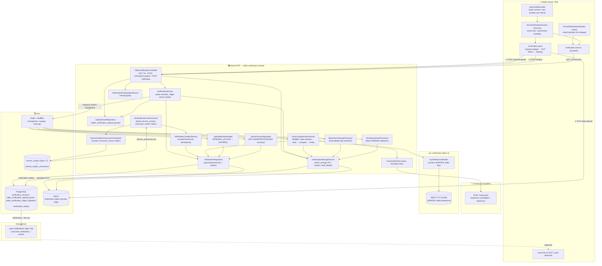
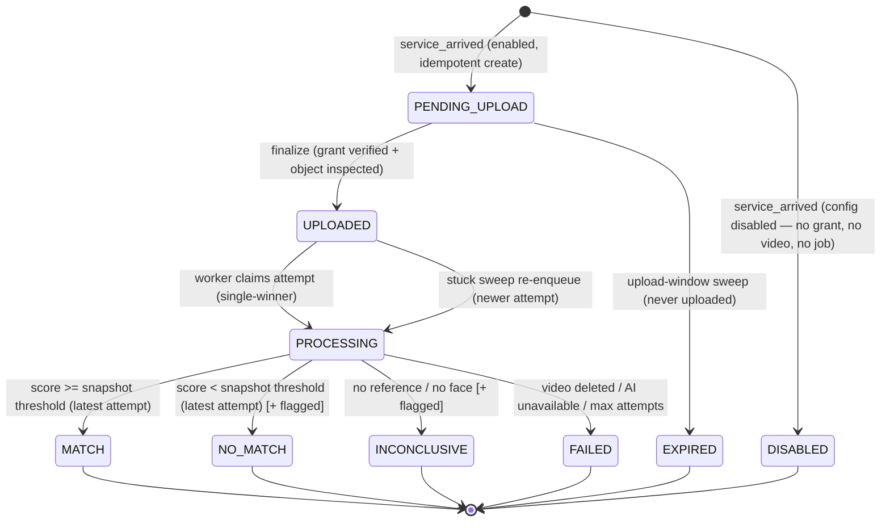
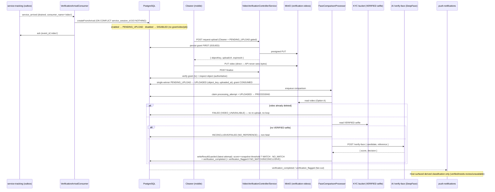

# Design Document: Video Verification

## Overview

`video-verification` (Spec 18, Sprint 5 — Service Execution) adds an **on-arrival identity check**: once Spec 17's geofence confirms the Cleaner has physically arrived (`service_arrived`), the Cleaner records a short arrival clip ("Hi, I'm [name] for the cleaning service"), and an asynchronous worker compares the face in that clip against the Cleaner's **already-verified KYC selfie** (Spec 3) to give the Host confidence that the arriving person is the same verified professional they matched with.

It is **not a new domain and it invents almost nothing** — it composes patterns already proven in four sibling specs:

1. **Arrival-video bytes live in MinIO, the verification record lives in PostgreSQL, and the comparison result is derived data — never authoritative, never a hard gate.** This is the exact authority split from `voice-notes` (audio-in-MinIO + metadata-in-PG + best-effort derived transcription), narrowed further for a biometric-adjacent artifact.
2. **A single-use upload grant binds each server-generated object key to `{ serviceSessionId, issued-to Cleaner, expiry }`** so possession of a key is never authorization (`voice-notes`' key ≠ credential rule).
3. **The face comparison runs asynchronously and best-effort via DeepFace in the AI/FastAPI service, Option A (the AI service has no MinIO credentials)** — the API worker reads the video from MinIO and posts the bytes, exactly like `voice-notes`' Whisper worker and `kyc-verification`'s `/ai/face-compare`.
4. **The private, server-side-encrypted MinIO bucket + a scheduled retention cleanup job that hard-deletes media past a retention horizon** mirrors the `kyc-verification` storage/cleanup pattern; the retention clock starts at `uploaded_at`.
5. **Creation is triggered by the durable `service_arrived` fact** drained from Spec 17's `service_outbox` via video-verification's **own per-consumer checkpoint** (`consumer_name = 'video'`), never by service-tracking calling this module directly. The result is published back as durable outbox events consumed by Spec 16 push-notifications.

Because the arrival video is biometric-adjacent, access is deliberately **more** minimal than voice notes: the Cleaner gets **upload-only**, the worker gets **server-side read**, and **no client — Cleaner or Host — ever receives a playback/download URL. There is no playback endpoint in v1.** The Host is surfaced only a derived classification (verified / needs-review / unavailable), never the raw footage and never the raw `match_score`.

**Authority split (kept strict):**
- **PostgreSQL is the source of truth for the verification as an event.** The `verification_sessions` row (participants, `service_session_id`, `state`, timestamps, the derived `{ decision, match_score }`, `match_threshold` snapshot, retention/deletion bookkeeping) is durable. It never holds video bytes and never gets a `deleted_at` — it is an immutable audit fact; only the *video object* is deleted by retention.
- **MinIO is the source of truth for the arrival-video bytes**, in a private, server-side-encrypted bucket with short retention. Bytes never transit the API hot path or PostgreSQL.
- **The DeepFace comparison result is derived data — never authoritative and never a hard service gate.** A low, failed, disabled, or never-run comparison never blocks the Cleaner from working, seizes escrow, or changes KYC status. The KYC identity (Spec 3) remains the authoritative identity; this is an at-the-door confirmation, not a re-KYC. Enforcement of a bad result is a dispute/human decision (Spec 20/21).
- **The arrival event owns the trigger.** Verification is created in reaction to the durable `service_arrived` fact, drained via this module's own outbox checkpoint.

This design maps every requirement and correctness invariant (REQ-VV1 … REQ-VV15) to concrete, verifiable properties **P1 … P17** (below), each backed by tests.

### Responsibility Matrix

| Responsibility | Mobile (Cleaner) | Mobile (Host) | NestJS API | FastAPI AI | MinIO | PostgreSQL |
|---|---|---|---|---|---|---|
| Consume `service_arrived`, create verification (idempotent) | ❌ | ❌ | ✅ | ❌ | ❌ | ✅ (source of truth) |
| Record arrival clip | ✅ | ❌ | ❌ | ❌ | ❌ | ❌ |
| Mint upload grant + pre-signed PUT | ❌ | ❌ | ✅ | ❌ | ❌ | ✅ (grant) |
| Upload video bytes | ✅ (PUT direct) | ❌ | ❌ | ❌ | ✅ (store) | ❌ |
| Server-inspect object (size/type/duration) | ❌ | ❌ | ✅ | ❌ | ✅ (read) | ❌ |
| Read video for comparison (Option A) | ❌ | ❌ | ✅ (worker) | ❌ | ✅ (read) | ❌ |
| Read VERIFIED KYC selfie as reference | ❌ | ❌ | ✅ (worker) | ❌ | ✅ (KYC bucket) | ❌ |
| Face comparison (DeepFace) | ❌ | ❌ | ❌ | ✅ | ❌ | ❌ |
| Decision vs snapshot threshold + state write | ❌ | ❌ | ✅ | ❌ | ❌ | ✅ |
| Retention hard-delete + tombstone drain | ❌ | ❌ | ✅ (jobs) | ❌ | ✅ (delete) | ✅ |
| Emit `verification_completed` / `verification_flagged` | ❌ | ❌ | ✅ (outbox) | ❌ | ❌ | ✅ |
| See derived result indicator | ❌ | ✅ | ❌ | ❌ | ❌ | ❌ |
| Playback/download raw footage | ❌ (none) | ❌ (none) | ❌ (no endpoint v1) | ❌ | ❌ | ❌ |

## Ownership Boundary — video-verification vs. service-tracking vs. KYC vs. AI

```
service-tracking (Spec 17)                video-verification module (NEW)                 kyc-verification (Spec 3)
  service_outbox: service_arrived  ──►      VerificationArrivalConsumer                     VERIFIED KYC selfie
   (fan-out source, per-consumer              drains service_arrived for consumer_name       (private KYC bucket)
    checkpoints)                              = 'video' (its OWN checkpoint row)        ◄──── worker reads it as the
                                              → VerificationService.createFromArrival()        reference face (read-only)
                                              (idempotent, UNIQUE service_session_id)

video-verification owns:                    AI / FastAPI service
  verification_sessions state machine          POST /verify-face { candidate, reference }
  upload grants (key ≠ credential)             DeepFace → { score, decision }
  the private verification-videos bucket       NO MinIO credentials (Option A)
  the face-comparison worker (Option A)
  retention + tombstone cleanup jobs
  verification_outbox (result events)  ──►   push-notifications (Spec 16) consumes
                                              verification_completed / verification_flagged
```

- **service-tracking is the source of truth for the arrival fact.** It emits `service_arrived` into its `service_outbox`, which is a **fan-out source drained by independent per-consumer checkpoints** (`service_outbox_consumers` keyed by `(event_id, consumer_name)`). video-verification is the `consumer_name = 'video'` consumer: it drains rows it has not yet acked, creates the verification, then acks only its own `(event_id, 'video')` row — so the Spec 16 notifications consumer acking the same event never starves it, and vice versa. video-verification never reads `service_sessions.state` directly and never has service-tracking call it.
- **kyc-verification is the source of truth for identity.** video-verification reads the Cleaner's **VERIFIED** KYC selfie from the KYC bucket as the read-only reference face. It never re-runs OCR/liveness, never mutates KYC status, and never creates a second identity record.
- **The AI/FastAPI service owns the model.** It exposes `POST /verify-face` (candidate + reference bytes → `{ score, decision }`) and has **no MinIO credentials** (Option A). The API worker is the sole reader of both buckets.
- **push-notifications (Spec 16) consumes** `verification_completed` / `verification_flagged` from video-verification's own `verification_outbox` via its own checkpoint — the exact durable-outbox contract Spec 16 already uses.

Dependency is one-directional (video-verification → service_outbox read-only via its checkpoint; → KYC bucket read-only; → AI service). No business transaction depends on a verification succeeding; a video-verification failure never rolls back or blocks the arrival, the service, or the escrow.

## Architecture



**Data flow — arrival → verification creation (durable-first, idempotent, own checkpoint):**
1. service-tracking commits `EN_ROUTE → ARRIVED` and writes a `service_arrived` `service_outbox` row in the same transaction (Spec 17, unchanged).
2. `VerificationArrivalConsumer` drains `service_arrived` rows with **no `service_outbox_consumers` row for `consumer_name = 'video'`** (`NOT EXISTS`, ordered by `created_at`, bounded batch), reusing Spec 17's `ServiceOutboxConsumerCheckpoint`. For each row it calls `VerificationCreationService.createFromArrival(payload)`, then acks its own `(event_id, 'video')` row (`ON CONFLICT DO NOTHING`).
3. `createFromArrival` reads `VIDEO_VERIFICATION_ENABLED` and the snapshot `match_threshold`, then `INSERT ... ON CONFLICT (service_session_id) DO NOTHING`:
   - **enabled** → `state = PENDING_UPLOAD`, participants copied from the payload (`cleanerId`/`hostId`/`offerId`), `match_threshold` snapshotted;
   - **disabled** → `state = DISABLED`, **no grant, no video, no job** (privacy-by-design).
   `UNIQUE service_session_id` guarantees at most one row; a redelivered event (or a re-drained-but-unacked row) is a no-op.

**Data flow — upload (grant-gated, key ≠ credential, Option A never transports bytes):**
1. Cleaner records → `POST /video-verifications/:id/request-upload`. The server authorizes the caller as the session's Cleaner AND asserts `state = PENDING_UPLOAD` (DISABLED/terminal → `409`), then IN ORDER: generates an opaque `object_key`; **persists the grant `{ objectKey, serviceSessionId, issuedToUserId=Cleaner, status=ISSUED, expiresAt }` FIRST**; mints a short-lived pre-signed PUT for that one key; returns `{ objectKey, uploadUrl, expiresAt }`.
2. Cleaner PUTs the video directly to MinIO (the API never sees the bytes).
3. `POST /video-verifications/:id/finalize` verifies the grant inside a transaction (exists, `issuedTo` = caller, matching session, unexpired, `status = ISSUED`), server-inspects the object (exists, real `size ≤ max`, content-type is an allowed video, real `duration ≤ max` — server-authoritative; client metadata advisory), single-winner `PENDING_UPLOAD → UPLOADED` (sets `object_key`, `uploaded_at`), marks the grant `CONSUMED`, and enqueues the comparison. Invalid grant → `403`/`409`; over-limit/wrong-type object → `400`, nothing persisted.

**Data flow — face comparison (async, best-effort, stale-safe, Option A):**
1. Worker claims a monotonic `processing_attempt` and single-winner `UPLOADED → PROCESSING`.
2. Worker reads the video object from MinIO (Option A) and reads the Cleaner's **VERIFIED** KYC selfie via `KycReferenceReader`.
3. Worker POSTs both byte streams to AI `POST /verify-face` → `{ score, decision }`.
4. Worker writes `{ decision, match_score }` and transitions `PROCESSING → MATCH | NO_MATCH | INCONCLUSIVE` **only if its attempt is the latest** (stale-update guard); the decision compares `match_score` against the **snapshotted** `match_threshold`. Missing reference → `INCONCLUSIVE`/`FAILED`; deleted video → `FAILED` (no re-upload, no loop); AI failure/timeout → `FAILED` (bounded retries).
5. Every terminal write emits `verification_completed { decision, score? }` in the same transaction; `NO_MATCH`/`INCONCLUSIVE` additionally emits `verification_flagged`.

**Data flow — result fan-out & Host surface:**
1. `verification_outbox` rows are drained by push-notifications (Spec 16) via its own checkpoint.
2. The Host is surfaced only a **derived classification** — `verified` (MATCH), `needs-review` (NO_MATCH/INCONCLUSIVE), `unavailable` (FAILED/EXPIRED/DISABLED) — never the raw `match_score` and never the footage.

## Components and Interfaces

### Backend — video-verification module (`services/api/src/video-verification/`)

```
services/api/src/video-verification/
├── video-verification.module.ts
├── video-verification.controller.ts
├── video-verification.types.ts
├── video-verification.constants.ts
├── config/
│   └── validate-video-verification-config.ts
├── service/
│   ├── verification.service.ts            # state machine orchestrator
│   ├── verification-creation.service.ts   # createFromArrival (idempotent, DISABLED path)
│   └── verification-participation.service.ts
├── storage/
│   ├── verification-storage.service.ts    # minio: presign PUT, inspect, read, delete
│   └── kyc-reference-reader.ts            # resolve + read VERIFIED KYC selfie (read-only)
├── repository/
│   ├── verification.repository.ts         # single-winner writes + outbox
│   ├── upload-grant.repository.ts
│   └── object-deletion.repository.ts      # tombstone drain
├── ai-client/
│   ├── face-verify.client.ts              # axios + bounded retry/backoff
│   └── face-verify.types.ts
├── consumers/
│   └── verification-arrival.consumer.ts   # drains service_arrived (consumer_name='video')
├── jobs/
│   ├── face-comparison.processor.ts       # BullMQ comparison worker
│   ├── retention-cleanup.processor.ts     # hard-delete past retention
│   ├── tombstone-drain.processor.ts       # drain PENDING object deletions
│   ├── upload-window-sweep.processor.ts   # PENDING_UPLOAD → EXPIRED
│   └── stuck-processing-sweep.processor.ts# UPLOADED/PROCESSING recovery
├── dto/
│   ├── request-upload.dto.ts
│   └── finalize-upload.dto.ts
├── entities/
│   └── verification-session.entity.ts
├── __tests__/
│   ├── verification.service.spec.ts
│   ├── verification-creation.service.spec.ts
│   ├── verification-state-machine.property.spec.ts
│   ├── upload-grant.repository.spec.ts
│   ├── face-comparison.processor.spec.ts
│   └── retention-cleanup.processor.spec.ts
└── README.md
```

**`VerificationCreationService`** — idempotent creation off the `service_arrived` fact.
- `createFromArrival(payload)` — reads `enabled` + snapshot threshold; `INSERT ... ON CONFLICT (service_session_id) DO NOTHING` in `PENDING_UPLOAD` (enabled) or `DISABLED` (disabled). Never throws into the consumer batch (per-row try/catch); a creation failure never touches the already-committed arrival. Enabled ⇒ nothing to enqueue yet (no video); disabled ⇒ no grant, no video, no job.

**`VerificationService`** — the state-machine orchestrator; resolves authorization from the session's parties.
- `requestUpload(id, userId)` — assert caller is the Cleaner AND `state = PENDING_UPLOAD` (else `409`); persist grant FIRST, then mint pre-signed PUT; return `{ objectKey, uploadUrl, expiresAt }`.
- `finalizeUpload(id, userId, dto)` — transaction: verify grant, server-inspect object (authoritative), single-winner `PENDING_UPLOAD → UPLOADED` (set `object_key`, `uploaded_at`), consume grant; after commit enqueue comparison (best-effort).
- `getVerification(id, userId)` — participant-gated reconciliation read (authoritative state + derived classification; never `match_score`, never a video URL).
- Functions ≤30 lines, SRP; storage/grant/inspection concerns delegated to collaborators.

**`VerificationParticipationService`** — `isParticipant(userId, verificationId): Promise<boolean>`, resolving the row's `cleaner_id`/`host_id`; single source of the participation rule. Used by every endpoint. (A verification with a nulled participant after user deletion resolves to non-participant for that id — history is still retained.)

**`VerificationStorageService`** (mirrors `kyc-storage.service` / `PropertyPhotoService`, `minio` client)
- `issueUploadTarget(): { objectKey, uploadUrl }` — unguessable `crypto.randomUUID()`-based key in the private `verification-videos` bucket + `presignedPutObject` with `VIDEO_VERIFICATION_UPLOAD_URL_TTL_SECONDS`. Ensures the bucket exists (private, server-side encryption) on init.
- `inspectObject(objectKey): { exists, sizeBytes, contentType, durationMs }` — **authoritative** validation. `statObject` gives real size + content-type; **real duration** is probed from the video container (streamed, bounded, via `ffprobe`/media metadata). Client-declared duration is advisory only; an unprobeable object is treated as invalid (finalize → `400`).
- `readObject(objectKey): Buffer|Stream` — server-side read used only by the worker (Option A).
- `deleteObjectSafe(objectKey): void` — idempotent `removeObject` (handles already-deleted), used by retention + tombstone drain.
- **No `getPlaybackUrl` — there is deliberately no playback/download presign in v1.**

**`KycReferenceReader`** — resolves the Cleaner's **VERIFIED** KYC selfie storage key (querying the latest verified KYC attempt from Spec 3, per Spec 3's status-derivation note) and reads it read-only from the KYC bucket. `getVerifiedSelfie(cleanerId): { bytes } | null` — returns `null` when no VERIFIED selfie exists (drives the `INCONCLUSIVE`/`FAILED` non-fatal path). Read-only; never mutates KYC.

**`UploadGrantRepository`** (`video_verification_upload_grants`)
- `createGrant({ objectKey, serviceSessionId, issuedToUserId, expiresAt })` — persisted before the PUT URL is minted.
- `findConsumable(objectKey, manager)` — used inside the finalize transaction (exists, ISSUED, unexpired).
- `markConsumed(objectKey, verificationId, manager)` — within the finalize transaction.
- `findStaleGrants(now, limit)` — for orphan-grant cleanup.

**`VerificationRepository`** (`verification_sessions` + `verification_outbox`)
- `createFromArrival(params)` — idempotent `INSERT ... ON CONFLICT (service_session_id) DO NOTHING`.
- `transition(id, expected, next, derivedFields, outboxEvents, manager)` — single-winner `UPDATE ... WHERE id=:id AND state=:expected` that sets derived fields (`object_key`/`uploaded_at`/`processed_at`/`match_score`/`decision`/`video_deleted_at`) AND writes the `verification_outbox` row(s) in ONE transaction.
- `claimProcessingAttempt(id): attempt` — monotonic increment when the worker starts/retries.
- `writeResultGuarded(id, attempt, { decision, matchScore }, next, outboxEvents)` — applies the result + `PROCESSING → terminal` transition **only if `attempt` is the latest** `processing_attempt` (stale-update guard); an older attempt's result is discarded.
- `findByServiceSessionId`, `findById`, and the sweep/retention scans: `findExpirableUploads(before)`, `findStuckProcessing(before)`, `findRetentionEligible(before, limit)`.

**`VerificationArrivalConsumer`** (relay) — drains `service_arrived` rows unacked for `consumer_name = 'video'` (reusing Spec 17's `ServiceOutboxConsumerCheckpoint.drainUnacked('video', batch)`), calls `createFromArrival`, then `ack(eventId, 'video')`. At-least-once + idempotent (dedup by `UNIQUE service_session_id`). Row-scoped try/catch so one bad row never stalls the batch.

**`FaceComparisonProcessor`** (BullMQ `video-face-comparison` queue) + **`FaceVerifyClient`** (mirrors `AiClientService`, axios + bounded retry/backoff):
```
attempt = repo.claimProcessingAttempt(id)         # monotonic
single-winner UPLOADED → PROCESSING (else no-op)
video = storage.readObject(objectKey)             # Option A; if deleted → FAILED (video-unavailable), no loop
reference = kycReader.getVerifiedSelfie(cleanerId) # if null → INCONCLUSIVE/FAILED (non-fatal)
{ score, decision } = faceVerify.compare(video, reference)   # AI failure/timeout → FAILED (bounded retries)
decision' = score >= snapshot(match_threshold) ? MATCH : NO_MATCH   # threshold from the ROW, not live config
repo.writeResultGuarded(id, attempt, { decision', matchScore: score }, terminal, outbox)  # latest-attempt only
```

**`RetentionCleanupProcessor`** (BullMQ repeatable; interval/batch from config) — mirrors the KYC cleanup job. Selects rows where `video_deleted_at IS NULL AND uploaded_at IS NOT NULL AND (now - uploaded_at) > VIDEO_VERIFICATION_RETENTION_HOURS`, calls `deleteObjectSafe(object_key)` (idempotent), and single-winner sets `video_deleted_at` (the derived result/score persists; the record is retained). Clock is `uploaded_at`, never `created_at`/`processed_at`.

**`TombstoneDrainProcessor`** (BullMQ repeatable) — drains `video_verification_object_deletions` where `status = 'PENDING'` (oldest first, batched): `deleteObjectSafe(object_key)` → mark `DONE` (`processed_at = NOW()`). Idempotent; this is how a video whose only owning row cascaded away is still deleted.

**`UploadWindowSweep`** (BullMQ repeatable) — single-winner `PENDING_UPLOAD → EXPIRED` for rows older than `VIDEO_VERIFICATION_UPLOAD_WINDOW_MS` with no upload (best-effort, idempotent), so a never-uploaded verification is never stuck awaiting an upload. Emits `verification_completed { decision: EXPIRED-classified as unavailable }`? No — EXPIRED is a lifecycle terminal, surfaced as `unavailable`; it emits no flagged event.

**`StuckProcessingSweep`** (BullMQ repeatable) — mirrors voice-notes' stuck-PENDING sweep. Finds rows in `UPLOADED`/`PROCESSING` older than `VIDEO_VERIFICATION_STUCK_THRESHOLD_MS`, re-enqueues a comparison job (which claims a newer `processing_attempt`) bounded by `VIDEO_VERIFICATION_MAX_RETRIES`; after max attempts → single-winner `FAILED`. So a lost enqueue never leaves a verification stuck forever.

**`VideoVerificationController`** (`@Controller('video-verifications') @UseGuards(JwtAuthGuard)`, whitelisting `ValidationPipe`):
- `GET /video-verifications/:id` → participant-gated reconciliation: authoritative `state` + derived classification (`verified`/`needs-review`/`unavailable`); never `match_score`, never a video URL.
- `POST /video-verifications/:id/request-upload` → Cleaner + `PENDING_UPLOAD` gated; returns `{ objectKey, uploadUrl, expiresAt }`.
- `POST /video-verifications/:id/finalize` → Cleaner + grant-gated; `{ objectKey, durationMs?, sizeBytes?, mimeType? }` (all advisory; server re-inspects). Transitions to `UPLOADED`, enqueues comparison.
- **No playback/download endpoint (by design).**
Identity from `req.user.keycloakId → userId`; a non-participant receives `403` and learns nothing about the verification's existence.

### AI service (`services/ai/src/video_verification/`)

```
services/ai/src/video_verification/
├── __init__.py
├── router.py            # POST /verify-face
├── face_verify_service.py  # DeepFace comparison
├── models.py
├── config.py
└── tests/
    └── test_face_verify_service.py
```

- **`POST /verify-face`** — **Option A (chosen): the AI service receives the candidate + reference bytes, not storage references.** The API worker reads both objects (arrival video frame(s) + VERIFIED KYC selfie) from MinIO and posts them (multipart) to `/verify-face`; the AI service runs **DeepFace** (the same library `kyc-verification` uses for `/ai/face-compare`), extracts a representative frame from the video candidate, and returns `{ score (0..1), decision (MATCH|NO_MATCH|INCONCLUSIVE) }` or a typed error (e.g. no face detected → `INCONCLUSIVE`). The AI service is given **no MinIO credentials** — it never talks to storage (single bucket owner, smaller trust surface). Face embeddings exist only in memory during comparison and are never persisted (KYC Property 2 parity). Internal auth reuses `kyc-verification`'s bearer + `X-Request-ID`, firewall-restricted to the internal network.

### Mobile (`apps/mobile/src/screens/verification/`)

```
apps/mobile/src/screens/verification/
├── ArrivalVerificationScreen.tsx     # Cleaner: record + upload
├── ArrivalVerificationIndicator.tsx  # Host: result indicator (no footage)
├── useArrivalRecorder.ts             # expo-camera, max-duration pre-check
├── verification.api.ts               # request-upload → PUT → finalize
├── verification.store.ts             # Zustand
├── verification.types.ts
├── verification.constants.ts
├── components/
│   ├── RecordButton.tsx
│   └── ResultBadge.tsx
├── __tests__/
│   ├── verification.store.spec.ts
│   ├── useArrivalRecorder.spec.ts
│   └── ArrivalVerificationIndicator.spec.tsx
└── README.md
```

- **`useArrivalRecorder`** — `expo-camera` recording with elapsed time and a client-side max-duration pre-check from `EXPO_PUBLIC_VIDEO_VERIFICATION_MAX_DURATION_MS` (UX only; server is authoritative). Handles camera/mic permission denial gracefully (i18n explanation, never crash, never hard-block the service).
- **`verification.api.ts`** — `requestUpload → PUT to MinIO → finalize` composed as one action.
- **`verification.store.ts`** (Zustand) — verification state + derived classification; `reconcile` via `GET /:id`; idempotent state application (ignore regressions). Never holds a video URL (there is none).
- **`ArrivalVerificationScreen`** (Cleaner) — shown when the tracking session is `ARRIVED` and verification enabled; clear instruction ("Say: Hi, I'm [name]..."), record → upload; an unobtrusive pending/failed state that never blocks proceeding.
- **`ArrivalVerificationIndicator`** (Host) — a result indicator (`recording` / `checking` / `verified` / `needs-review` / `unavailable`), never raw footage; `needs-review` presents a path toward a dispute (Spec 21), not an accusation/auto-cancel.
- **i18n** `en`/`es` parity for all strings; BidClean dark design tokens (`#00F5D4` accent for the record CTA, `#0B0C10` background, `#1F2833` cards).

## Data Models

All tables follow the project database standards: `UUID` PK (`gen_random_uuid()`), snake_case, `TIMESTAMP WITH TIME ZONE`, explicit FK `ON DELETE`, indexes on every FK, application-validated `VARCHAR` for `state`/`decision`/`reference_source` (no PG enums). Reversible migration with `IF NOT EXISTS`, table/column comments.

### `verification_sessions` (new — the durable record; never the video bytes)

| Column | Type | Notes |
|---|---|---|
| `id` | `UUID PK DEFAULT gen_random_uuid()` | |
| `service_session_id` | `UUID NOT NULL` | FK → `service_sessions(id)` **ON DELETE CASCADE**; **`UNIQUE`** (one verification per arrival — the idempotency backstop) |
| `offer_id` | `UUID NOT NULL` | denormalized FK → `offers(id)` **ON DELETE CASCADE** (parent cascade); indexed |
| `cleaner_id` | `UUID` (nullable) | FK → `users(id)` **ON DELETE SET NULL** (never user-cascade, Spec 13 invariant); indexed |
| `host_id` | `UUID` (nullable) | FK → `users(id)` **ON DELETE SET NULL**; indexed |
| `object_key` | `VARCHAR(512)` (nullable) | the arrival-video object in MinIO; **`UNIQUE` when set** (partial unique index); null until UPLOADED / after retention delete |
| `state` | `VARCHAR(20) NOT NULL DEFAULT 'PENDING_UPLOAD'` | app-validated `PENDING_UPLOAD/UPLOADED/PROCESSING/MATCH/NO_MATCH/INCONCLUSIVE/FAILED/DISABLED/EXPIRED` (not PG enum) |
| `decision` | `VARCHAR(20)` (nullable) | app-validated `MATCH/NO_MATCH/INCONCLUSIVE` (derived; set with the terminal comparison transition) |
| `match_score` | `NUMERIC(5,4)` (nullable) | derived similarity `0..1` — **INTERNAL, never exposed raw to the Host** |
| `match_threshold` | `NUMERIC(5,4) NOT NULL` | snapshot of config threshold at creation; validated `0 < threshold <= 1`; the decision uses THIS, not live config |
| `reference_source` | `VARCHAR(20) NOT NULL DEFAULT 'KYC_SELFIE'` | app-validated; which verified face was compared against |
| `capture_attempt` | `INTEGER NOT NULL DEFAULT 0` | increments only if re-recording is allowed (same row, never a new session) |
| `processing_attempt` | `INTEGER NOT NULL DEFAULT 0` | monotonic; stale-update guard (mirrors voice-notes `transcript_attempt`) |
| `failure_reason` | `VARCHAR(40)` (nullable) | app-validated (`NO_REFERENCE`/`VIDEO_UNAVAILABLE`/`AI_UNAVAILABLE`/`AI_TIMEOUT`/`MAX_ATTEMPTS`); never a stack trace, never biometric data |
| `uploaded_at` | `TIMESTAMPTZ` (nullable) | **the retention clock starts here** |
| `processed_at` | `TIMESTAMPTZ` (nullable) | set on the terminal comparison transition |
| `video_deleted_at` | `TIMESTAMPTZ` (nullable) | set when the object is hard-deleted by retention/tombstone |
| `created_at` / `updated_at` | `TIMESTAMPTZ DEFAULT NOW()` | **no `deleted_at`** — the record is an immutable audit fact; only the VIDEO is deleted |

Indexes / constraints:
- `uq_verification_sessions_service_session (service_session_id)` — the hard guarantee behind "one verification per arrival".
- `uq_verification_sessions_object_key ON verification_sessions (object_key) WHERE object_key IS NOT NULL` — partial unique (a key maps to at most one verification).
- FK indexes: `idx_verification_sessions_offer (offer_id)`, `idx_verification_sessions_cleaner (cleaner_id)`, `idx_verification_sessions_host (host_id)`.
- `idx_verification_sessions_active (state, updated_at) WHERE state IN ('PENDING_UPLOAD','UPLOADED','PROCESSING')` — bounded sweep scan over non-terminal states.
- `idx_verification_sessions_retention (uploaded_at) WHERE video_deleted_at IS NULL AND uploaded_at IS NOT NULL` — bounded retention scan.
- `CHECK` constraints (VARCHAR + app validation) for `state`/`decision`/`reference_source`/`failure_reason`; a `CHECK (match_threshold > 0 AND match_threshold <= 1)` and `CHECK (match_score IS NULL OR (match_score >= 0 AND match_score <= 1))`.

### `video_verification_upload_grants` (key ≠ credential — mirrors `voice_note_upload_grants`)

| Column | Type | Notes |
|---|---|---|
| `object_key` | `VARCHAR(512) PK` | server-generated, unguessable |
| `service_session_id` | `UUID NOT NULL` | FK → `service_sessions(id)` **ON DELETE CASCADE**; indexed |
| `issued_to_user_id` | `UUID` (nullable) | FK → `users(id)` **ON DELETE SET NULL** (deletion coherence); the Cleaner |
| `status` | `VARCHAR(20) NOT NULL DEFAULT 'ISSUED'` | app-validated `ISSUED/CONSUMED` |
| `expires_at` | `TIMESTAMPTZ NOT NULL` | short-lived (`VIDEO_VERIFICATION_UPLOAD_GRANT_TTL_SECONDS`) |
| `consumed_verification_id` | `UUID` (nullable) | FK → `verification_sessions(id)` **ON DELETE SET NULL** |
| `created_at` | `TIMESTAMPTZ DEFAULT NOW()` | |

Indexes: `idx_video_verification_grants_session (service_session_id)`, `idx_video_verification_grants_status_expires (status, expires_at)` (orphan-grant sweep scan).

### `video_verification_object_deletions` (deletion tombstone — the voice-notes lesson, never lose the key)

When a `verification_sessions` row is deleted (directly or by CASCADE from `service_session_id`/`offer_id`), its `object_key` would vanish with the only row that held it, leaving orphaned bytes in MinIO. A `BEFORE DELETE` trigger copies the freed key into this tombstone **in the same transaction as the delete/CASCADE**, so the key is captured atomically before it is lost.

| Column | Type | Notes |
|---|---|---|
| `object_key` | `VARCHAR(512) PK` | copied from the deleted `verification_sessions` row (PK dedups double-tombstoning) |
| `reason` | `VARCHAR(30) NOT NULL DEFAULT 'ROW_DELETED'` | app-validated (`ROW_DELETED`/`CASCADE`) |
| `status` | `VARCHAR(20) NOT NULL DEFAULT 'PENDING'` | app-validated `PENDING/DONE` |
| `created_at` | `TIMESTAMPTZ NOT NULL DEFAULT NOW()` | when the row was tombstoned |
| `processed_at` | `TIMESTAMPTZ` (nullable) | when the MinIO `removeObject` succeeded |

Index: `idx_video_verification_object_deletions_status_created (status, created_at)` (bounded drain scan).

Trigger (created in the same migration; only tombstones when a key exists):
```sql
CREATE FUNCTION video_verification_tombstone_object() RETURNS trigger AS $$
BEGIN
  IF OLD.object_key IS NOT NULL AND OLD.video_deleted_at IS NULL THEN
    INSERT INTO video_verification_object_deletions (object_key, reason)
    VALUES (OLD.object_key, 'CASCADE')
    ON CONFLICT (object_key) DO NOTHING;   -- already-deleted or double-tombstone → no-op
  END IF;
  RETURN OLD;
END; $$ LANGUAGE plpgsql;

CREATE TRIGGER trg_video_verification_tombstone_object
  BEFORE DELETE ON verification_sessions
  FOR EACH ROW EXECUTE FUNCTION video_verification_tombstone_object();
```
The tombstone insert shares the deleting transaction: if the delete (or its parent CASCADE) rolls back, the tombstone rolls back too — no false positives. The `TombstoneDrainProcessor` then drains `status='PENDING'`, calls `deleteObjectSafe`, and marks `DONE`. Object deletion is always eventual/idempotent — never a synchronous cross-system DELETE inside the DB transaction.

### `verification_outbox` (durable result events — consumed by push-notifications / Spec 16)

Mirrors the per-domain outbox convention (push-notifications, service-tracking). Written in the SAME transaction as the terminal state transition. It is a fan-out source; per-consumer progress lives in the shared `service_outbox_consumers`-style checkpoint owned by consumers (Spec 16), so this row carries no shared processing marker.

| Column | Type | Notes |
|---|---|---|
| `id` | `UUID PK DEFAULT gen_random_uuid()` | |
| `event_id` | `VARCHAR(255) NOT NULL` | **`UNIQUE`** — deterministic per transition (e.g. `verification_completed:{verificationId}`) |
| `aggregate_type` | `VARCHAR(30) NOT NULL DEFAULT 'verification_session'` | app-validated |
| `aggregate_id` | `UUID NOT NULL` | the `verification_sessions.id` |
| `type` | `VARCHAR(50) NOT NULL` | `verification_completed` / `verification_flagged` |
| `payload` | `JSONB NOT NULL` | minimal ids + derived fields: `{ verificationId, serviceSessionId, decision, score? }` (score internal — never forwarded to the Host surface) |
| `version` | `INTEGER NOT NULL DEFAULT 1` | payload version |
| `created_at` | `TIMESTAMPTZ NOT NULL DEFAULT NOW()` | committed WITH the transition |

Indexes: `uq_verification_outbox_event (event_id)`; `idx_verification_outbox_created (created_at)` (per-consumer drain scan). No `relayed_at` (per-consumer acknowledgement lives in the consumer's checkpoint table, same discipline as `service_outbox`).

### Deletion-policy coherence (Spec 13 invariant)

Consistent with chat/voip/service-tracking: participant FKs (`cleaner_id`, `host_id`) are **`ON DELETE SET NULL`**, never `CASCADE` from `users`. Deleting/anonymizing a participant never destroys a verification's audit record. Only `service_session_id` and `offer_id` cascade (removing the parent arrival/offer removes its verification), and that cascade fires the tombstone trigger so any remaining video object is queued for idempotent eventual deletion. The record itself has **no `deleted_at`** — it persists as audit; only the video object is ever removed.

### State machine (durable, single-winner)



Every transition is `UPDATE verification_sessions SET state=:next, <derived fields>=... WHERE id=:id AND state=:expected` — the winner (rows=1) sets the derived fields AND writes the `verification_outbox` row(s) in the same transaction; concurrent losers observe rows=0 and no-op. Terminal states (`MATCH`, `NO_MATCH`, `INCONCLUSIVE`, `FAILED`, `DISABLED`, `EXPIRED`) are immutable. Result writes are additionally attempt-guarded: `PROCESSING → terminal` applies only if `processing_attempt` is the latest.

### Verification / upload / comparison flow



## Correctness Properties

*A property is a characteristic or behavior that should hold true across all valid executions of a system — essentially, a formal statement about what the system should do. Properties serve as the bridge between human-readable specifications and machine-verifiable correctness guarantees.*

Each property is universally quantified, testable, and maps back to the requirements' REQ-VV invariants and acceptance criteria.

### Property 1: One verification per arrival, created idempotently, retries in-session

*For any* `service_arrived` event delivered N ≥ 1 times, and *for any* interleaving of concurrent creation attempts for the same `service_session_id`, the store SHALL contain exactly one `verification_sessions` row for that session — in `PENDING_UPLOAD` (enabled) or `DISABLED` (disabled), with participants copied and `match_threshold` snapshotted at creation. Every redelivery or concurrent attempt SHALL be a no-op; a second `verification_sessions` row for the same service session SHALL never exist; processing retries reuse `processing_attempt` and re-recording increments `capture_attempt` within the same row.

**Validates: Requirements 1.1, 1.5, 7.1** · REQ-VV1

### Property 2: Participant isolation & key ≠ credential

*For any* user and *for any* verification, every endpoint (`GET`, request-upload, finalize) SHALL be authorized server-side from the session's `cleaner_id`/`host_id`; a non-participant SHALL receive `403` and learn nothing about the verification's existence. *For any* object key and *for any* caller, finalize SHALL succeed only with a grant that exists, is issued to that caller, matches the session, is unexpired, and is unconsumed; possession of a key alone SHALL never authorize upload or finalize.

**Validates: Requirements 1.3, 2.1, 2.4** · REQ-VV2

### Property 3: Video isolation, no playback, short retention

*For any* verification, the arrival-video bytes SHALL exist only in the private, server-side-encrypted `verification-videos` MinIO bucket under a server-generated opaque key — never in PostgreSQL, never through the API hot path, and never behind a playback/download URL issued to any client (there is no playback endpoint in v1). *For any* uploaded video, once `(now − uploaded_at) > VIDEO_VERIFICATION_RETENTION_HOURS` the object SHALL be hard-deleted (idempotent `removeObject`) and `video_deleted_at` set, with the retention clock measured from `uploaded_at` (not `created_at`/`processed_at`); only the derived result/score persists past retention.

**Validates: Requirements 2.2, 2.5, 4.1, 4.2, 4.5, 3.8** · REQ-VV3

### Property 4: Server-authoritative object validation

*For any* uploaded object with real (server-observed) size, content-type, and duration, and *for any* client-declared metadata, finalize SHALL accept the upload if and only if the **server-observed** size ≤ max AND content-type is an allowed video AND real duration ≤ max; declared metadata SHALL be advisory and SHALL never override the server-observed values. An over-limit, wrong-type, or unprobeable object SHALL yield `400` with nothing persisted and the grant left unconsumed.

**Validates: Requirements 2.3** · REQ-VV4

### Property 5: Comparison is derived, best-effort, advisory — never a gate

*For any* comparison outcome (`MATCH`, `NO_MATCH`, `INCONCLUSIVE`, `FAILED`, or `DISABLED`), the service SHALL proceed unblocked, the escrow SHALL NOT be seized, and the KYC status SHALL NOT change — the comparison never hard-gates. A `NO_MATCH`/`INCONCLUSIVE` result SHALL emit exactly one `verification_flagged` event for Host awareness / dispute seed and SHALL have no other enforcement effect; the KYC identity remains authoritative.

**Validates: Requirements 3.1, 3.5, 3.6** · REQ-VV5

### Property 6: Stale-safe monotonic attempts

*For any* sequence of concurrent or out-of-order processing attempts on one verification, `processing_attempt` SHALL be monotonically increasing, and a comparison result SHALL be written (transitioning `PROCESSING → terminal`) only if its attempt is the latest; an older attempt's result SHALL be discarded and SHALL never overwrite a newer one.

**Validates: Requirements 3.1, 3.4** · REQ-VV6

### Property 7: No stuck verification

*For any* verification left `PENDING_UPLOAD` past `VIDEO_VERIFICATION_UPLOAD_WINDOW_MS`, a bounded idempotent single-winner sweep SHALL transition it to `EXPIRED`; *for any* verification left `UPLOADED`/`PROCESSING` past `VIDEO_VERIFICATION_STUCK_THRESHOLD_MS`, a bounded sweep SHALL re-enqueue with a newer `processing_attempt` and, after `VIDEO_VERIFICATION_MAX_RETRIES` attempts, transition it to `FAILED`. The authoritative state SHALL always be recoverable via `GET`, so no verification is ever stuck forever.

**Validates: Requirements 2.6, 3.7** · REQ-VV7

### Property 8: Threshold snapshot & range

*For any* comparison score s and *for any* verification whose snapshotted `match_threshold` is t (validated `0 < t ≤ 1` at config load), the decision SHALL be `MATCH` iff `s ≥ t` and `NO_MATCH` iff `s < t`, evaluated against the row's snapshot t — invariant to any later config change — and both s and t SHALL share the `[0, 1]` range. A config change SHALL never retroactively re-decide an existing verification.

**Validates: Requirements 3.8, 6.4** · REQ-VV8

### Property 9: Single-winner transitions + outbox atomicity

*For any* state transition and *for any* N concurrent actors, exactly one conditional write (`... WHERE id=:id AND state=:expected`) SHALL succeed and, in one transaction, set the derived fields (`object_key`/`uploaded_at`/`processed_at`/`match_score`/`decision`/`video_deleted_at`) AND write the corresponding `verification_outbox` event; concurrent losers observe rows=0 and no-op, and terminal states are immutable. History SHALL never observe a `MATCH` without a `match_score`, nor a `verification_completed` event without a committed decision.

**Validates: Requirements 7.4** · REQ-VV9

### Property 10: Deletion coherence

*For any* verification, deleting/anonymizing a participant SHALL null `cleaner_id`/`host_id` (`ON DELETE SET NULL`) while retaining the record and its derived result (no user-cascade path). *For any* deletion of the parent service session or offer, the row SHALL cascade and a `BEFORE DELETE` trigger SHALL insert the freed `object_key` into `video_verification_object_deletions` in the same transaction (rolled back with a rolled-back delete); object removal SHALL be eventual and idempotent via the tombstone-drain / retention job — never a synchronous cross-system delete inside the transition transaction.

**Validates: Requirements 7.2, 7.3, 7.5** · REQ-VV10

### Property 11: Disabled ⇒ no video

*For any* creation while `VIDEO_VERIFICATION_ENABLED` is false, the verification SHALL be created `DISABLED`, and no upload grant SHALL be issued, no video SHALL be captured or stored, no comparison job SHALL be enqueued, and nothing SHALL be gated — biometric-adjacent data is never captured when it cannot be used.

**Validates: Requirements 1.2** · REQ-VV13

### Property 12: Missing reference & deleted-video are non-fatal

*For any* comparison where no VERIFIED KYC selfie exists for the Cleaner, the verification SHALL become `INCONCLUSIVE` or `FAILED` with a clear reason — never an unhandled exception and never a block. *For any* processing attempt that reads the video and finds it already deleted (retention elapsed or tombstoned), the verification SHALL become `FAILED` (video-unavailable) with no automatic re-upload and no retry loop.

**Validates: Requirements 3.2, 3.3** · REQ-VV14

### Property 13: Score is internal; the Host sees only a derived classification

*For any* verification state, the Host-facing surface SHALL expose exactly one derived classification — `verified` (MATCH), `needs-review` (NO_MATCH/INCONCLUSIVE), or `unavailable` (FAILED/EXPIRED/DISABLED/pending) — and SHALL never include the raw `match_score` or a reference to the raw footage, in v1.

**Validates: Requirements 3.8, 4.3, 5.2** · REQ-VV15

### Property 14: No hardcoded config/secrets

*For any* tunable (enable flag, bucket, size/duration/MIME limits, TTLs, threshold, AI URL, timeout/retries, retention hours, sweep windows/intervals/batch), the value SHALL come from environment/config with none hardcoded, and `validateVideoVerificationConfig()` SHALL fail fast at startup for required values (rejecting a `match_threshold ≤ 0` or `> 1`). MinIO credentials SHALL never reach the client except as time-boxed pre-signed URLs; the AI service SHALL have no storage credentials (Option A); and video/biometric data SHALL never be logged.

**Validates: Requirements 6.1, 6.2, 6.3, 6.4** · REQ-VV12

> **REQ-VV11 (not certified liveness)** is a documented scope limit, not a code-level property: this is a face-comparison confidence check against the KYC selfie, not a certified anti-spoofing/liveness system. It is captured in the ADR and the module README rather than as a test.

## Error Handling

| Condition | Response |
|---|---|
| Non-participant / unauthenticated on any endpoint | `403`, no existence disclosure, no data |
| Redelivered `service_arrived` / concurrent create | `UNIQUE service_session_id` (`ON CONFLICT DO NOTHING`) → idempotent no-op |
| Arrival-consumer / create-path failure | Row-scoped catch; no `(event_id,'video')` ack inserted; retried next drain; the arrival/service tx unaffected |
| request-upload while not `PENDING_UPLOAD` (DISABLED/terminal) | `409`, no grant minted |
| request-upload by non-Cleaner participant / non-participant | `403`, no grant minted |
| finalize with invalid grant (missing / wrong caller / wrong session / expired / consumed) | `403`/`409`, no transition, nothing persisted |
| finalize with over-limit, wrong-type, or unprobeable object | `400`, no transition, grant left unconsumed → cleanup-eligible orphan |
| finalize on a `DISABLED` verification | `409` (no upload path exists when disabled) |
| Any client requests playback/download of the video | No such endpoint exists in v1 (route absent) |
| No VERIFIED KYC selfie for the Cleaner | `INCONCLUSIVE`/`FAILED` (`NO_REFERENCE`); never throws; service unblocked |
| Worker reads a video already deleted (retention/tombstone) | `FAILED` (`VIDEO_UNAVAILABLE`); no re-upload, no loop |
| AI unavailable / timeout / error | `FAILED` (`AI_UNAVAILABLE`/`AI_TIMEOUT`) after bounded retries; service unblocked |
| Older processing attempt returns after a newer one | Discarded by the attempt guard; newer result preserved |
| `NO_MATCH`/`INCONCLUSIVE` decision | `verification_flagged` emitted; no escrow seizure, no cancel, no KYC change |
| Never-uploaded verification past the window | Upload-window sweep → `EXPIRED` (idempotent, single-winner) |
| Verification stuck `UPLOADED`/`PROCESSING` past the window | Stuck sweep re-enqueues (newer attempt); `FAILED` after max attempts |
| Concurrent transition on one verification | Single-winner: exactly one write succeeds; losers observe rows=0 and no-op |
| Parent service session / offer cascades away | Row cascades; `BEFORE DELETE` trigger tombstones `object_key`; drain job deletes idempotently |
| Participant user deleted | `cleaner_id`/`host_id` SET NULL; record + result retained |
| Best-effort enqueue / outbox-relay failure | Logged (never bytes/score); verification unaffected; sweep/relay recovers |
| Missing required config at boot | `validateVideoVerificationConfig()` throws (fail-fast) |
| Camera/mic permission denied (mobile) | Graceful i18n explanation; never crash; service not blocked |

## Testing Strategy

Property-based testing **applies** to this feature: the core logic is a pure decision + conditional-write + validation surface over a large input space (arbitrary event redeliveries and concurrent creations, participant/non-participant pairs, arbitrary object size/type/duration vs declared metadata, interleaved processing attempts, arbitrary scores × snapshot thresholds, retention ages, deletion/cascade graphs). Universal properties (idempotent creation, key ≠ credential, server-authoritative validation, stale-safe attempts, single-winner transitions, threshold snapshot, retention, deletion coherence) are meaningfully quantified over inputs, so PBT is the right tool for the logic layer. MinIO/BullMQ/Postgres/AI I/O is covered by mock-based unit and integration tests, and the DeepFace model itself is tested by example (representative image pairs), not PBT.

### Property-Based Tests (fast-check)

Library: `fast-check` (TypeScript, mirroring the sibling specs). Each test runs **minimum 100 iterations** and is tagged with a comment: `// Feature: video-verification, Property N: <text>`.

| Property | What to Generate | What to Assert |
|---|---|---|
| P1 Idempotent creation | Random arrival payloads × N redeliveries × concurrent interleavings; enabled/disabled | Exactly one row per `service_session_id`; correct initial state; snapshot copied; no second row |
| P2 Participant isolation & key ≠ credential | Random (user, verification) pairs across endpoints; foreign/valid/expired/consumed grants | Access iff participant; finalize iff caller-issued unexpired ISSUED grant; bare key authorizes nothing |
| P3 Video isolation + retention | Random uploaded verifications × `uploaded_at` ages | Bytes only in MinIO; no playback presign minted anywhere; delete iff past horizon (clock = `uploaded_at`); `video_deleted_at` set once; result persists |
| P4 Server-authoritative validation | Random real (size, type, duration) vs arbitrary declared metadata | Accept iff server-observed within bounds; declared never overrides; else `400`, nothing persisted, grant unconsumed |
| P5 Advisory, never a gate | Random terminal decisions incl. FAILED/INCONCLUSIVE/DISABLED/NO_MATCH | Service/escrow/KYC untouched in all cases; NO_MATCH/INCONCLUSIVE emits exactly one `verification_flagged` |
| P6 Stale-safe attempts | Random interleaved/concurrent attempt sequences | Attempts monotonic; only latest attempt's result applied; older discarded |
| P7 No stuck verification | Random ages/attempt counts/thresholds | PENDING_UPLOAD→EXPIRED past window; UPLOADED/PROCESSING re-enqueued then FAILED after max; idempotent |
| P8 Threshold snapshot & range | Random scores × snapshot thresholds × later config mutations | MATCH iff `s ≥ snapshot t`; decision invariant to live config; ranges in [0,1] |
| P9 Single-winner + outbox atomicity | Random (from,to) edges × N concurrent actors | One winner sets derived fields + outbox atomically; illegal edges rejected; terminal immutable; MATCH⇒score, completed⇒committed decision |
| P10 Deletion coherence | Random verification graphs + participant deletion + parent cascade | host/cleaner nulled + record retained; cascade tombstones the key (rolled back with a rolled-back delete); drain idempotent |
| P11 Disabled ⇒ no video | Random payloads with enabled=false | DISABLED; grant repo never called; queue never called; nothing gated |
| P12 Missing-ref / deleted-video non-fatal | Random comparisons with null reference / deleted object | Terminal INCONCLUSIVE/FAILED with reason; no exception; deleted → FAILED, zero re-enqueue |
| P13 Score internal / derived classification | Every verification state | Exactly one of {verified, needs-review, unavailable}; payload has no `match_score`, no footage URL |
| P14 No hardcoded config/secrets | Random config maps incl. out-of-range thresholds | Values from config; validator throws on missing/`threshold ≤ 0`/`> 1`; client payloads only presigned URLs; no bytes/score in logs |

### Unit Tests (NestJS)

- **`VerificationCreationService`**: enabled → PENDING_UPLOAD; disabled → DISABLED with no grant/job; idempotent `ON CONFLICT`.
- **`VerificationService`**: participant + state gates (request-upload requires Cleaner + PENDING_UPLOAD; grant-persisted-before-URL ordering); single-winner finalize transition; server-authoritative inspection decides acceptance; best-effort enqueue non-blocking.
- **`VerificationParticipationService`**: cleaner/host resolution; non-participant denial; nulled-participant → non-participant but row retained.
- **`VerificationStorageService`** (mocked `minio` as in `kyc-storage.service.spec`): upload presign + object inspection incl. real-duration probe; `deleteObjectSafe` idempotent; **asserts no playback presign method exists**.
- **`KycReferenceReader`**: returns VERIFIED selfie bytes; returns `null` when none (drives P12); read-only.
- **`UploadGrantRepository`**: grant-persisted-before-URL; `findConsumable` rejects expired/consumed/foreign; `markConsumed` in-tx.
- **`VerificationRepository`**: parameterized SQL; single-winner conditional write with `verification_outbox` row in the same transaction; `claimProcessingAttempt` monotonic; `writeResultGuarded` latest-attempt-only; sweep/retention scans select only eligible rows.
- **`FaceComparisonProcessor`**: claim → PROCESSING; deleted-video → FAILED (no loop); null reference → INCONCLUSIVE/FAILED; AI error/timeout → FAILED bounded; decision vs snapshot threshold; stale-attempt discard.
- **`FaceVerifyClient`** (mocked axios): request shape (bytes not refs), bounded retry/backoff, typed errors.
- **`RetentionCleanupProcessor`** / **`TombstoneDrainProcessor`**: idempotent delete; `video_deleted_at`/`processed_at` set once; clock from `uploaded_at`.
- **`UploadWindowSweep`** / **`StuckProcessingSweep`**: correct terminal on age; bounded re-enqueue then FAILED.
- **`validateVideoVerificationConfig()`**: fail-fast on missing; rejects `threshold ≤ 0` / `> 1` (edge cases).
- **Auth/exposure**: `GET` payload never contains `match_score`; state→classification mapping is total.

### Unit Tests (FastAPI)

- **`face_verify_service`**: DeepFace comparison on representative image pairs (match / non-match / no-face → INCONCLUSIVE); score in `[0,1]`; embeddings not persisted (in-memory only); no MinIO client present in the module.

### DDL / Migration Tests

- `verification_sessions` constraints/indexes present (UNIQUE `service_session_id`, partial UNIQUE `object_key`, FK indexes, non-terminal-state index, retention index); no `deleted_at`; CHECK on `state`/`decision`/`reference_source`/threshold range.
- `BEFORE DELETE` trigger tombstones the `object_key` on direct delete AND on CASCADE from `service_sessions`/`offers`; the tombstone rolls back with a rolled-back delete (P10).
- Deletion coherence: user FKs are `ON DELETE SET NULL` (mirrors `chat-deletion-coherence.spec.ts`).

### Integration Tests

- `service_arrived` → verification created (`PENDING_UPLOAD`) via the `'video'` checkpoint; redelivery → still one row; fan-out coexistence with the Spec 16 notifications consumer.
- Disabled config → `DISABLED`, no grant/job.
- Full flow: request-upload → PUT MinIO → finalize (server inspect) → `UPLOADED` → worker → AI (mocked) → `MATCH`/`NO_MATCH` + `verification_completed` (+ `verification_flagged`).
- Missing reference → `INCONCLUSIVE`/`FAILED`; deleted video → `FAILED` (no loop); AI down → `FAILED`.
- Retention past horizon → object deleted, `video_deleted_at` set, record + result retained; tombstone drain after cascade.
- Non-participant denied on read/request-upload/finalize; no playback endpoint exists.
- User deletion → participant FKs SET NULL; verification retained.

### Mobile Tests

- **`verification.store`**: idempotent state application (ignore regressions), `reconcile` via `GET`, never holds a video URL.
- **`useArrivalRecorder`**: client-side max-duration pre-check; permission-denied graceful degrade (no crash, service not blocked).
- **`ArrivalVerificationScreen`/`ArrivalVerificationIndicator`**: record → upload flow; Host indicator per state (verified/needs-review/unavailable), never footage/score; needs-review shows a dispute path (no auto-cancel); dark tokens; `en`/`es` i18n parity.
- MinIO/apiClient/AI mocked (zero real external calls).
- **CI**: backend jobs (API lint/typecheck, API tests, AI tests) stay green; mobile verified locally (`tsc --noEmit` + ESLint + Jest).

## Configuration

Backend (`services/api`, via `ConfigService`; `validateVideoVerificationConfig()` fail-fast at startup, skipped under `NODE_ENV=test`):
- `VIDEO_VERIFICATION_ENABLED` — master switch; false ⇒ DISABLED creation, no video/job (privacy-by-design).
- `VIDEO_VERIFICATION_MINIO_BUCKET` — private, server-side-encrypted bucket for arrival videos.
- `VIDEO_VERIFICATION_MAX_SIZE_BYTES` — server-authoritative max object size.
- `VIDEO_VERIFICATION_MAX_DURATION_MS` — server-authoritative max clip duration.
- `VIDEO_VERIFICATION_ALLOWED_MIME_TYPES` — allowed video content-types.
- `VIDEO_VERIFICATION_UPLOAD_URL_TTL_SECONDS` — pre-signed PUT TTL.
- `VIDEO_VERIFICATION_UPLOAD_GRANT_TTL_SECONDS` — single-use grant TTL.
- `VIDEO_VERIFICATION_MATCH_THRESHOLD` — decision threshold, snapshotted per verification; **validated `0 < threshold ≤ 1`** at load.
- `VIDEO_VERIFICATION_AI_URL` — AI `/verify-face` endpoint.
- `VIDEO_VERIFICATION_TIMEOUT_MS` — AI call timeout.
- `VIDEO_VERIFICATION_MAX_RETRIES` — bounded comparison retries before `FAILED`.
- `VIDEO_VERIFICATION_RETENTION_HOURS` — retention horizon (default 24–48h; clock from `uploaded_at`).
- `VIDEO_VERIFICATION_UPLOAD_WINDOW_MS` — PENDING_UPLOAD expiry window.
- `VIDEO_VERIFICATION_STUCK_THRESHOLD_MS` — UPLOADED/PROCESSING stuck re-enqueue threshold.
- `VIDEO_VERIFICATION_SWEEP_INTERVAL_MS`, `VIDEO_VERIFICATION_SWEEP_BATCH_SIZE`, `VIDEO_VERIFICATION_CLEANUP_INTERVAL_MS`, `VIDEO_VERIFICATION_CLEANUP_BATCH_SIZE` — bounded sweep/cleanup tuning.
- Reused: `MINIO_*` (endpoint/keys — server-only, shipped only as time-boxed pre-signed URLs); the AI internal auth token (reused from `kyc-verification`, e.g. `AI_SERVICE_AUTH_TOKEN`). The AI service has **no** MinIO credentials (Option A).

AI service (`services/ai`): the `/verify-face` DeepFace threshold/model params from its own config; **no MinIO credentials**.

Mobile (`EXPO_PUBLIC_*`):
- `EXPO_PUBLIC_VIDEO_VERIFICATION_MAX_DURATION_MS` — UX pre-check only; everything security-sensitive comes from server responses; no secrets embedded.

Security: MinIO creds live only in server config, shipped only as time-boxed pre-signed URLs; the AI service has no storage creds; the match threshold used is the value snapshotted on the verification (so config changes never retroactively re-decide); video/biometric data is never logged and no biometric templates/embeddings are persisted beyond the derived `{ decision, match_score }`.

## Documentation Impact

- **READMEs**: new `services/api/src/video-verification/README.md` (module purpose, endpoints, storage/grant/worker/sweeps, env vars, Option A); new `apps/mobile/src/screens/verification/README.md` (recorder/indicator, i18n, tokens); a note in the AI service README for `POST /verify-face` (DeepFace, no storage creds). Note the new `service_outbox` `consumer_name = 'video'` checkpoint usage in the service-tracking README, and the new `verification_*` events consumed in the push-notifications README.
- **`docs/ARCHITECTURE.md`**: add the video-verification module and a **verification-flow diagram** (service_arrived → create → request-upload/grant → PUT MinIO → finalize → comparison worker → AI → decision + outbox → Host derived indicator; retention/tombstone edges), the new MinIO `verification-videos` bucket node, and the AI `/verify-face` edge. Update the system Mermaid diagram(s) to reflect the new module, bucket, and AI endpoint.
- **`docs/CHANGELOG.md`**: `[Unreleased]` entries per task group (feature `video-verification`).
- **ADR**: a new ADR `on-arrival-face-verification` (assign the next free number at merge time; sibling specs currently reserve up to 010) recording: on-arrival face verification against the VERIFIED KYC selfie; **advisory-not-a-gate** (never blocks service/escrow/KYC — enforcement is Spec 20/21); arrival-video-in-MinIO (not DB, not API) with **no playback endpoint** and **short 24–48h retention from `uploaded_at`**; key-as-grant (not credential); server-authoritative object inspection incl. real duration; **AI contract Option A** (worker sends bytes; AI has no storage access); async best-effort comparison with attempt-versioning + stuck sweep; deletion-tombstone-trigger for eventual/idempotent orphan cleanup after CASCADE; and the explicit **not-certified-liveness** scope limit (REQ-VV11).
- **`.env.example`**: document all `VIDEO_VERIFICATION_*` keys and `EXPO_PUBLIC_VIDEO_VERIFICATION_MAX_DURATION_MS` (MINIO_* already present).
- **`.kiro/specs/ROADMAP.md`**: mark Spec 18 status on completion.
