# BidClean — Architecture

> **This document MUST be updated on every structural change.** If you add, remove, or modify a service, module, or integration, update the corresponding diagram.

---

## 1. System Architecture (High Level)

```mermaid
graph TB
    subgraph Clients["📱 Client Applications"]
        Mobile["React Native + Expo<br/>(iOS / Android / Galaxy)"]
        Web["Next.js<br/>(bidclean.tech)"]
    end

    subgraph Gateway["🔒 Gateway Layer"]
        Traefik["Traefik<br/>Reverse Proxy + SSL"]
    end

    subgraph Core["⚙️ Core Services"]
        API["NestJS API<br/>(TypeScript)"]
        AI["FastAPI AI Service<br/>(Python)"]
    end

    subgraph Realtime["⚡ Realtime"]
        Centrifugo["Centrifugo<br/>(WebSocket Chat + Tracking)"]
        LiveKit["LiveKit<br/>(VoIP + Video)"]
    end

    subgraph Data["💾 Data Layer"]
        Postgres["PostgreSQL + PostGIS"]
        Redis["Redis<br/>(Cache + Queues)"]
        MinIO["MinIO<br/>(Object Storage)"]
    end

    subgraph Auth["🔐 Authentication"]
        Keycloak["Keycloak<br/>(OAuth2 / OIDC)"]
    end

    subgraph AIModels["🤖 AI/ML"]
        LibreTranslate["LibreTranslate"]
        Whisper["Whisper.cpp"]
        Piper["Piper TTS"]
        DeepFace["DeepFace"]
        PaddleOCR["PaddleOCR"]
    end

    subgraph External["☁️ External Services"]
        Stripe["Stripe Connect<br/>(Payments + Escrow)"]
        RevenueCat["RevenueCat<br/>(Subscriptions + Ad Revenue Tracking)"]
        AdMob["Google AdMob<br/>(Display Ads — free tier)"]
        OneSignal["OneSignal<br/>(Push Notifications)"]
        Mapbox["Mapbox<br/>(Maps + Directions)"]
        Bedrock["AWS Bedrock<br/>(AI Models)"]
    end

    subgraph Monitoring["📊 Observability"]
        Prometheus["Prometheus"]
        Grafana["Grafana"]
        Loki["Loki (Logs)"]
        Sentry["Sentry"]
        Posthog["Posthog (Analytics)"]
        Metabase["Metabase (BI)"]
    end

    Mobile --> Traefik
    Web --> Traefik
    Traefik --> API
    Traefik --> Centrifugo
    Traefik --> LiveKit
    API --> Postgres
    API --> Redis
    API --> MinIO
    API --> Keycloak
    API --> AI
    API --> Centrifugo
    API --> Stripe
    API --> RevenueCat
    API --> OneSignal
    AI --> LibreTranslate
    AI --> Whisper
    AI --> Piper
    AI --> DeepFace
    AI --> PaddleOCR
    AI --> Bedrock
    API --> Prometheus
    Prometheus --> Grafana
    API --> Loki
    Mobile --> Posthog
    Mobile --> Sentry
    Mobile --> AdMob
    Mobile --> RevenueCat
```

---

## 2. Frontend Architecture

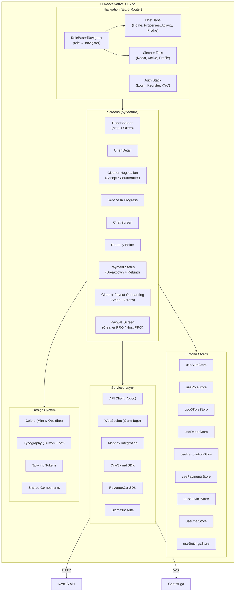

---

## 3. Backend Architecture (NestJS)

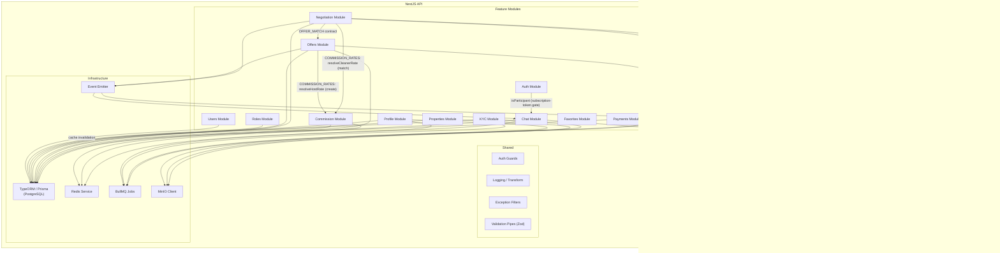

---

## 4. Offer Lifecycle (Data Flow)

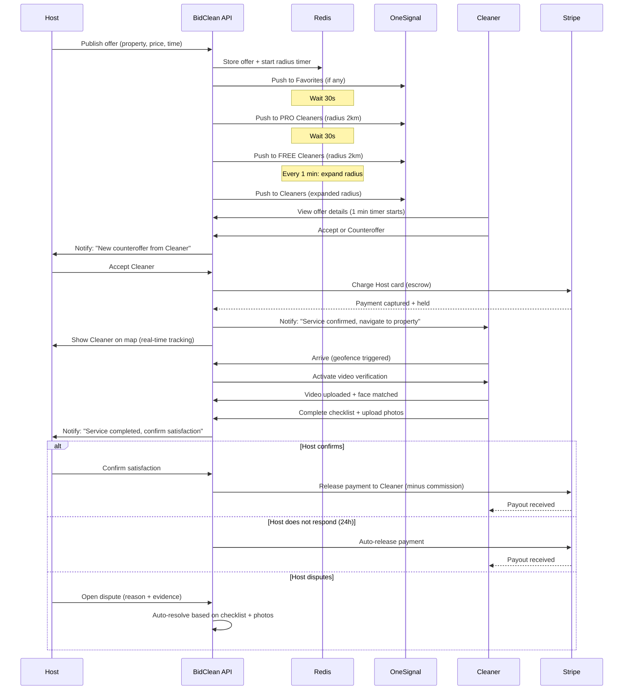

---

## 5. Payment Flow

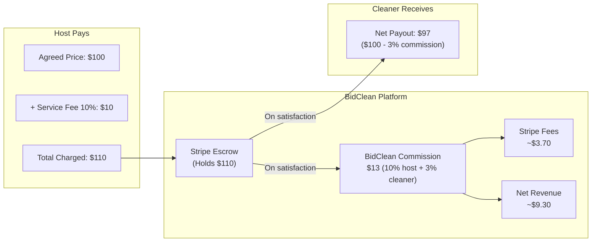

---

## 5b. Payment Escrow Schema

> Physical schema for the Stripe Escrow module (migration `1700000014000-CreatePaymentTables`). Money is stored as integer minor units (cents); statuses use `VARCHAR` + `CHECK`.

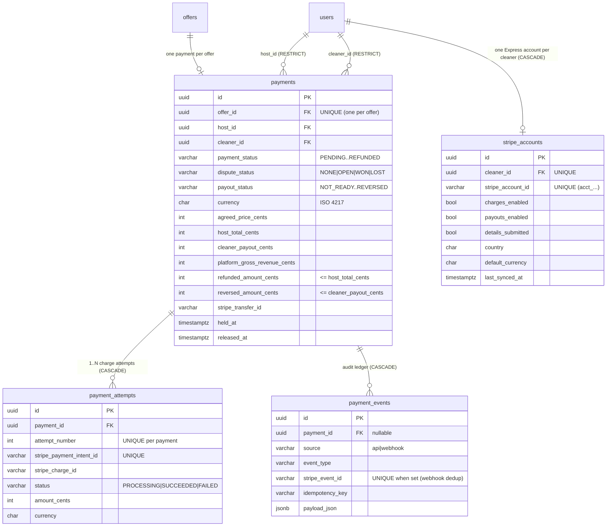

Invariants enforced at the database level: at most one `SUCCEEDED` attempt per payment (partial unique index), one payment per offer, refund/reversal ceilings via `CHECK`, and webhook idempotency via a partial unique index on `stripe_event_id`.

---

## 5c. Stripe Webhook Ingress

> Stripe events enter through a single public endpoint that is authenticated by the signature (not JWT). The controller verifies, deduplicates, persists, and enqueues — then a worker advances the payment lifecycle, which fans out the domain events in §5d.

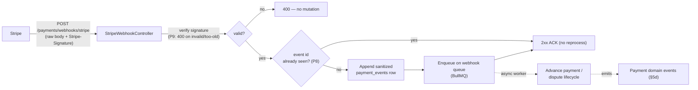

The payload is sanitized before persistence (`payment-payload.sanitizer.ts`): only ids, amounts, currency, status, and timestamps are stored — never card data, secrets, or PII.

---

## 5d. Payment Domain Events

> The payments module communicates state changes to other modules through typed domain events (EventEmitter2, defined in `services/api/src/payments/events/payment-events.ts`) rather than writing their tables. Consumers react within their own bounded context.

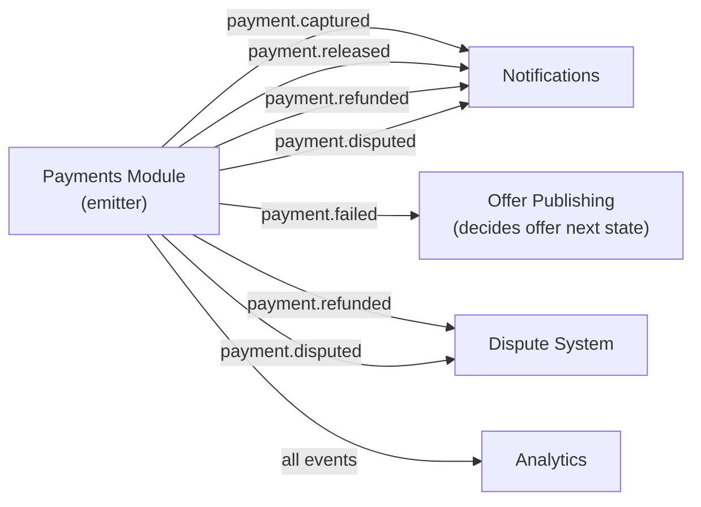

Each event carries a shared base payload (`paymentId`, `offerId`, `hostId`, `cleanerId`, `timestamp`) plus event-specific fields (amounts in cents, currency, failure reason). This keeps the payments module as the sole writer of the `payments` tables while letting other modules advance their own lifecycles.

---

## 5e. Payment Reconciliation (P11)

> Webhooks (§5c) are the primary path for advancing a charge, but delivery can be delayed, dropped, or interrupted mid-flight (e.g. a crash between creating the PaymentIntent and receiving its result). Two periodic sweeps act as a safety net that converges persisted state to Stripe's truth without distributed transactions.

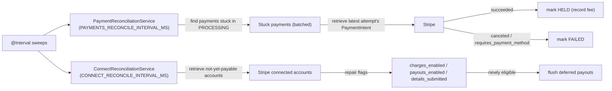

Reconciliation is idempotent: a repair that Stripe already delivered via webhook is a no-op because the persisted state is already terminal for that attempt. Placeholder attempts whose intent id was never persisted (`pending:` prefix) are skipped, and per-payment errors are swallowed so one stuck record never stalls the batch.

---

## 5f. Commission Rate Resolution (two-moment)

> The `commission-system` module (ADR-006) decides *which* commission rate applies to each side of a service. It resolves rates only — the cents arithmetic stays in each consumer's own `CommissionService`, and coupling is one-directional via the `COMMISSION_RATES` token (no circular dependency). The two rates are resolved at different moments because they depend on actors known at different times.

```mermaid
sequenceDiagram
    participant Host
    participant Offers as Offers Module (create)
    participant Rates as COMMISSION_RATES
    participant Tier as SUBSCRIPTION_TIER (stub → Spec 11)
    participant Cleaner as Winning Cleaner
    participant Neg as Negotiation Module (match)

    Host->>Offers: create offer (country, serviceType)
    Offers->>Rates: resolveHostRate({ country, hostId, serviceType })
    Rates->>Tier: getTier(hostId) (bounded; FREE on timeout)
    Rates-->>Offers: { hostFeeRateBps, hostRuleId }
    Note over Offers: own CommissionService → snapshot Host rate on offer

    Cleaner->>Neg: accept / accepted proposal (Cleaner now known)
    Neg->>Rates: resolveCleanerRate({ country, cleanerId, serviceType })
    Rates->>Tier: getTier(cleanerId) (bounded; FREE on timeout)
    Rates-->>Neg: { cleanerRateBps, cleanerRuleId }
    Note over Neg: own CommissionService → snapshot Cleaner rate on winning proposal/offer
```

Resolution selects the most-specific active rule (specificity → priority → `effective_from` → lowest UUID) from `commission_rules`; with an empty ruleset it returns the environment defaults (identical to the prior flat model). Rules never overlap (GiST exclusion constraint), are never physically deleted (audit `ON DELETE RESTRICT`), and rate changes propagate across API instances via Redis pub/sub invalidation. Any failure degrades to the env-default rate and never blocks creation or match.

### Commission Rules Schema

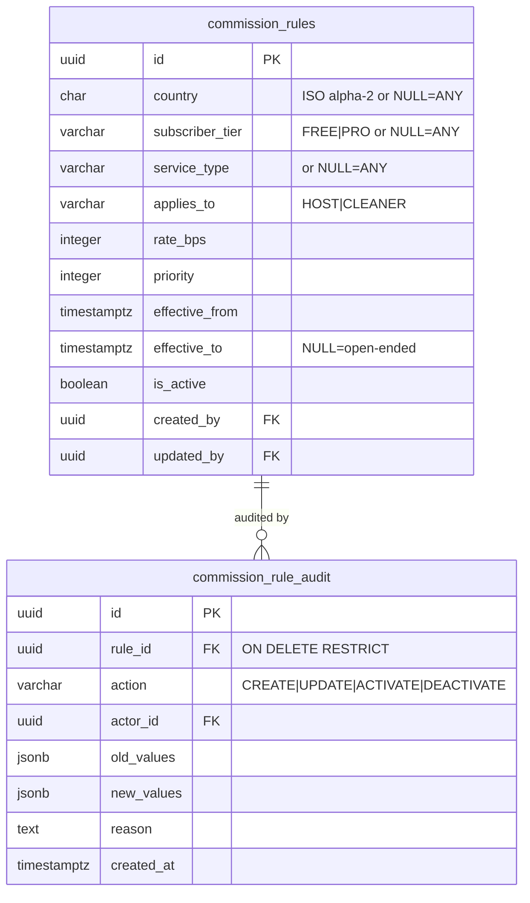

---

## 5g. Configuration Surfaces & Public/Secret Boundary

> The `secrets-inventory` tooling (`tools/config-inventory/`, ADR-010) derives a single catalog of every external configuration input from the code/config sources, then reconciles the committed `.env.example` against it. The catalog is the derived source of truth for a variable's existence, classification, and requiredness; `.env.example` is a generated PRESENTATION projection. Every variable is assigned to exactly one of four surfaces, and the public/secret boundary is hard: only `EXPO_PUBLIC_*` values (explicitly classified `PUBLIC`) ever reach the mobile client — no `SECRET` does.

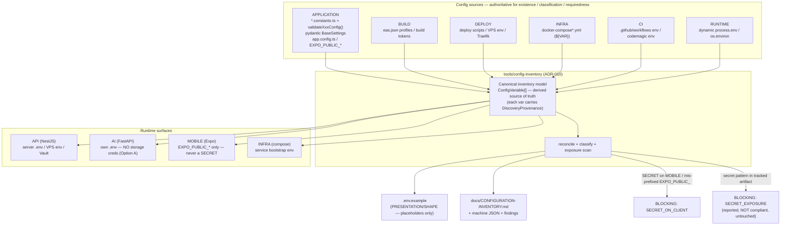

Two orthogonal axes classify each variable: `requiredScope` (`runtime | build | deploy | infra` — *what lifecycle scope* needs it) and `envApplicability` (`local | staging | production` — *which environments* it applies to). No environment token ever appears in `requiredScope` and no scope token in `envApplicability`. Compliance is `true` only when there are zero blocking findings; no credential is ever rotated, moved, or echoed — findings name the file, line, and matched pattern, never the secret value.

---

## 6. Auth & Security Flow

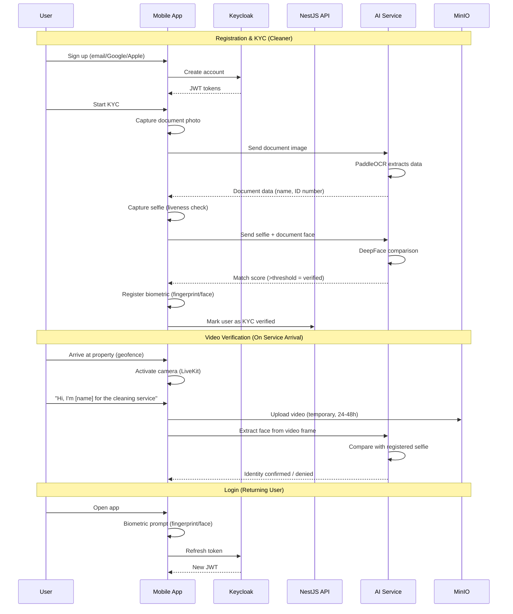

---

## 7. Chat Message Lifecycle (Realtime Chat)

> Post-match Host↔Cleaner messaging (Spec 13, ADR-009). **PostgreSQL is the source of truth; Centrifugo is transport only.** A send persists first, then publishes best-effort — a publish failure never loses the message. There is no immediate-delivery guarantee: recipients recover missed messages via the `after` reconciliation cursor on reconnect. Auth issues Centrifugo tokens; chat owns the participation rule.

```mermaid
sequenceDiagram
    participant S as Sender App
    participant R as Recipient App
    participant Auth as Auth (token endpoint)
    participant API as Chat Module (API)
    participant DB as PostgreSQL
    participant C as Centrifugo

    Note over S,C: Subscribe (both participants)
    S->>Auth: GET /auth/centrifugo/token?channel=chat:conversation:{id}
    Auth->>API: ChatParticipationService.isParticipant(subject, id)
    API-->>Auth: participant? (by JWT subject, not channel string)
    Auth-->>S: subscription token (only if participant)
    S->>C: subscribe chat:conversation:{id}

    Note over S,DB: Send = one serialized transaction (persist-then-publish)
    S->>API: POST /chat/conversations/:id/messages (Idempotency-Key + clientMessageId)
    API->>DB: BEGIN · SELECT ... FOR UPDATE conversation
    API->>DB: verify OPEN · dedup(client_message_id) · next sequence_number · insert · bump last_message_at · COMMIT
    API-->>S: 201 (persisted; deduplicated when a retry)
    API-->>C: publish {type: chat_message} (best-effort)
    C-->>R: live message
    Note over API,C: publish failure → logged (never the body), request still succeeds

    Note over R,DB: Reconnect reconciliation (no immediate-delivery guarantee)
    R->>C: reconnect
    R->>API: GET /chat/conversations/:id/messages?after=<lastSeq>
    API->>DB: keyset read (sequence_number > lastSeq)
    API-->>R: missed messages (client dedups by id + clientMessageId, orders by sequenceNumber)
```

---

*Last updated: September 5, 2026*
*Update this document on EVERY structural change.*
