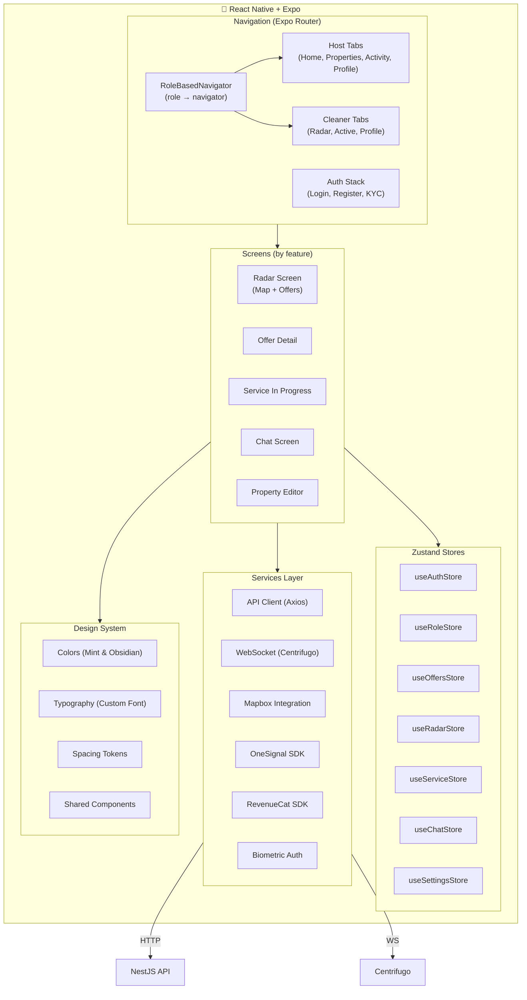
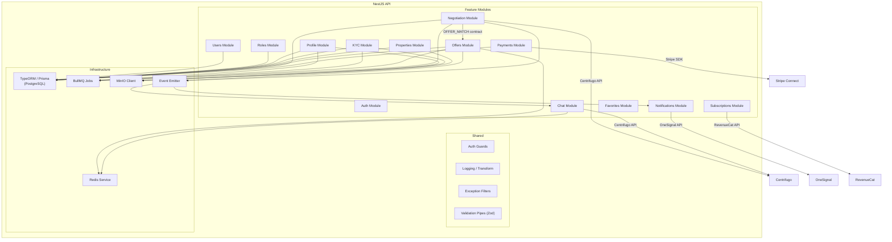
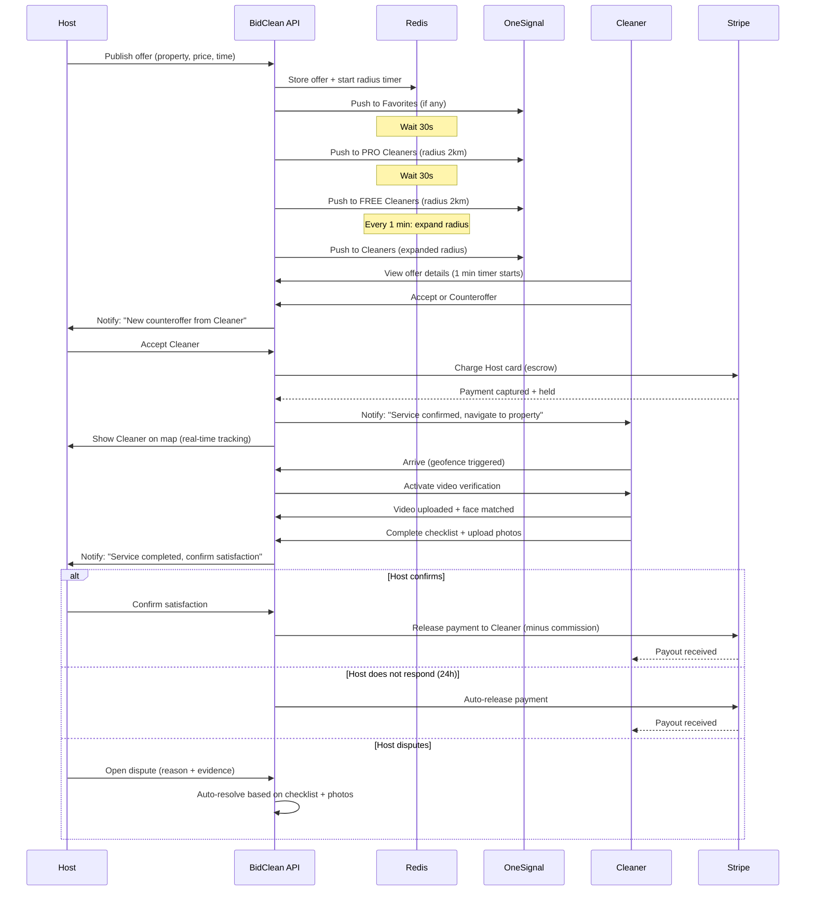
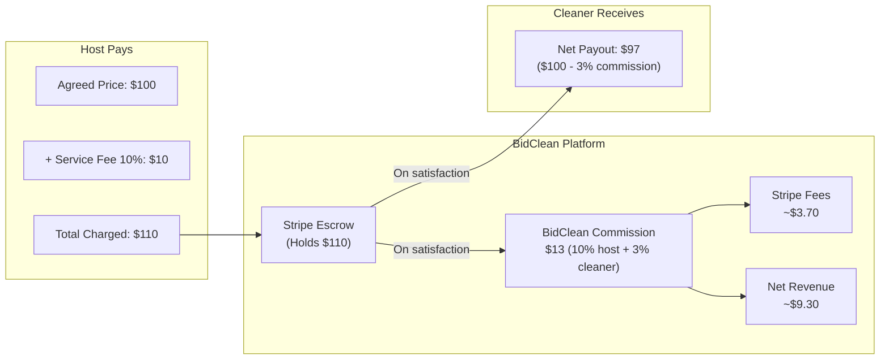
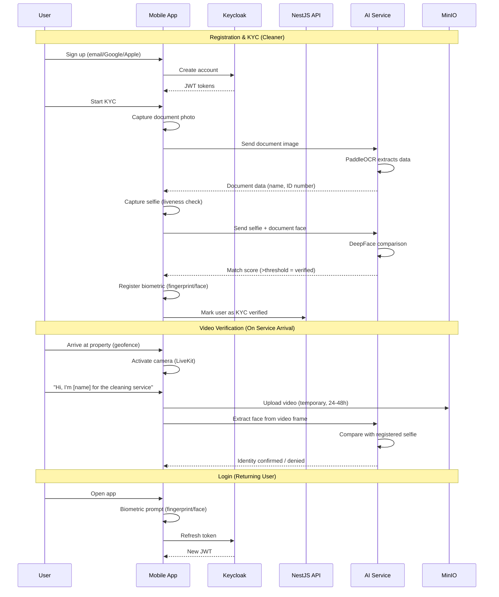

# BidClean — Architecture

> **This document MUST be updated on every structural change.** If you add, remove, or modify a service, module, or integration, update the corresponding diagram.

---

## 1. System Architecture (High Level)

```mermaid
graph TB
    subgraph Clients["📱 Client Applications"]
        Mobile["React Native + Expo<br/>(iOS / Android / Galaxy)"]
        Web["Next.js<br/>(bidclean.tech)"]
    end

    subgraph Gateway["🔒 Gateway Layer"]
        Traefik["Traefik<br/>Reverse Proxy + SSL"]
    end

    subgraph Core["⚙️ Core Services"]
        API["NestJS API<br/>(TypeScript)"]
        AI["FastAPI AI Service<br/>(Python)"]
    end

    subgraph Realtime["⚡ Realtime"]
        Centrifugo["Centrifugo<br/>(WebSocket Chat + Tracking)"]
        LiveKit["LiveKit<br/>(VoIP + Video)"]
    end

    subgraph Data["💾 Data Layer"]
        Postgres["PostgreSQL + PostGIS"]
        Redis["Redis<br/>(Cache + Queues)"]
        MinIO["MinIO<br/>(Object Storage)"]
    end

    subgraph Auth["🔐 Authentication"]
        Keycloak["Keycloak<br/>(OAuth2 / OIDC)"]
    end

    subgraph AIModels["🤖 AI/ML"]
        LibreTranslate["LibreTranslate"]
        Whisper["Whisper.cpp"]
        Piper["Piper TTS"]
        DeepFace["DeepFace"]
        PaddleOCR["PaddleOCR"]
    end

    subgraph External["☁️ External Services"]
        Stripe["Stripe Connect<br/>(Payments + Escrow)"]
        RevenueCat["RevenueCat<br/>(Subscriptions + Ads)"]
        OneSignal["OneSignal<br/>(Push Notifications)"]
        Mapbox["Mapbox<br/>(Maps + Directions)"]
        Bedrock["AWS Bedrock<br/>(AI Models)"]
    end

    subgraph Monitoring["📊 Observability"]
        Prometheus["Prometheus"]
        Grafana["Grafana"]
        Loki["Loki (Logs)"]
        Sentry["Sentry"]
        Posthog["Posthog (Analytics)"]
        Metabase["Metabase (BI)"]
    end

    Mobile --> Traefik
    Web --> Traefik
    Traefik --> API
    Traefik --> Centrifugo
    Traefik --> LiveKit
    API --> Postgres
    API --> Redis
    API --> MinIO
    API --> Keycloak
    API --> AI
    API --> Centrifugo
    API --> Stripe
    API --> RevenueCat
    API --> OneSignal
    AI --> LibreTranslate
    AI --> Whisper
    AI --> Piper
    AI --> DeepFace
    AI --> PaddleOCR
    AI --> Bedrock
    API --> Prometheus
    Prometheus --> Grafana
    API --> Loki
    Mobile --> Posthog
    Mobile --> Sentry
```

---

## 2. Frontend Architecture

---

## 3. Backend Architecture (NestJS)

---

## 4. Offer Lifecycle (Data Flow)

---

## 5. Payment Flow

---

## 6. Auth & Security Flow

---

*Last updated: August 27, 2026*
*Update this document on EVERY structural change.*
