# BidClean — Architecture

> **This document MUST be updated on every structural change.** If you add, remove, or modify a service, module, or integration, update the corresponding diagram.

---

## 1. System Architecture (High Level)

```mermaid
graph TB
    subgraph Clients["📱 Client Applications"]
        Mobile["React Native + Expo<br/>(iOS / Android / Galaxy)"]
        Web["Next.js<br/>(bidclean.tech)"]
    end

    subgraph Gateway["🔒 Gateway Layer"]
        Traefik["Traefik<br/>Reverse Proxy + SSL"]
    end

    subgraph Core["⚙️ Core Services"]
        API["NestJS API<br/>(TypeScript)"]
        AI["FastAPI AI Service<br/>(Python)"]
    end

    subgraph Realtime["⚡ Realtime"]
        Centrifugo["Centrifugo<br/>(WebSocket Chat + Tracking)"]
        LiveKit["LiveKit<br/>(VoIP + Video)"]
    end

    subgraph Data["💾 Data Layer"]
        Postgres["PostgreSQL + PostGIS"]
        Redis["Redis<br/>(Cache + Queues)"]
        MinIO["MinIO<br/>(Object Storage)"]
    end

    subgraph Auth["🔐 Authentication"]
        Keycloak["Keycloak<br/>(OAuth2 / OIDC)"]
    end

    subgraph AIModels["🤖 AI/ML"]
        LibreTranslate["LibreTranslate"]
        Whisper["Whisper.cpp"]
        Piper["Piper TTS"]
        DeepFace["DeepFace"]
        PaddleOCR["PaddleOCR"]
    end

    subgraph External["☁️ External Services"]
        Stripe["Stripe Connect<br/>(Payments + Escrow)"]
        RevenueCat["RevenueCat<br/>(Subscriptions + Ad Revenue Tracking)"]
        AdMob["Google AdMob<br/>(Display Ads — free tier)"]
        OneSignal["OneSignal<br/>(Push Notifications)"]
        Mapbox["Mapbox<br/>(Maps + Directions)"]
        Bedrock["AWS Bedrock<br/>(AI Models)"]
    end

    subgraph Monitoring["📊 Observability"]
        Prometheus["Prometheus"]
        Grafana["Grafana"]
        Loki["Loki (Logs)"]
        Sentry["Sentry"]
        Posthog["Posthog (Analytics)"]
        Metabase["Metabase (BI)"]
    end

    Mobile --> Traefik
    Web --> Traefik
    Traefik --> API
    Traefik --> Centrifugo
    Traefik --> LiveKit
    API --> Postgres
    API --> Redis
    API --> MinIO
    API --> Keycloak
    API --> AI
    API --> Centrifugo
    API --> Stripe
    API --> RevenueCat
    API --> OneSignal
    AI --> LibreTranslate
    AI --> Whisper
    AI --> Piper
    AI --> DeepFace
    AI --> PaddleOCR
    AI --> Bedrock
    API --> Prometheus
    Prometheus --> Grafana
    API --> Loki
    Mobile --> Posthog
    Mobile --> Sentry
    Mobile --> AdMob
    Mobile --> RevenueCat
```

---

## 2. Frontend Architecture

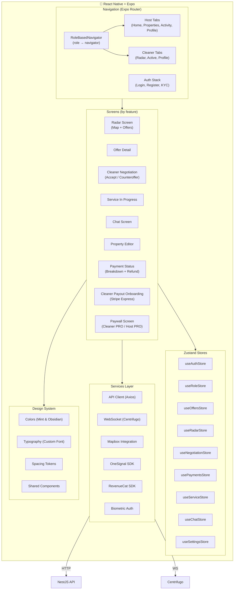
```mermaid
graph TB
    subgraph App["📱 React Native + Expo"]
        subgraph Navigation["Navigation (Expo Router)"]
            RoleRouter["RoleBasedNavigator<br/>(role → navigator)"]
            AuthStack["Auth Stack<br/>(Login, Register, KYC)"]
            HostTabs["Host Tabs<br/>(Home, Properties, Activity, Profile)"]
            CleanerTabs["Cleaner Tabs<br/>(Radar, Active, Profile)"]
        end

        subgraph Screens["Screens (by feature)"]
            Radar["Radar Screen<br/>(Map + Offers)"]
            OfferDetail["Offer Detail"]
            Negotiation["Cleaner Negotiation<br/>(Accept / Counteroffer)"]
            Service["Service In Progress"]
            Chat["Chat Screen"]
            PropertyEdit["Property Editor"]
            PaymentStatus["Payment Status<br/>(Breakdown + Refund)"]
            PayoutOnboarding["Cleaner Payout Onboarding<br/>(Stripe Express)"]
            Paywall["Paywall Screen<br/>(Cleaner PRO / Host PRO)"]
        end

        subgraph Stores["Zustand Stores"]
            AuthStore["useAuthStore"]
            RoleStore["useRoleStore"]
            OffersStore["useOffersStore"]
            RadarStore["useRadarStore"]
            NegotiationStore["useNegotiationStore"]
            PaymentsStore["usePaymentsStore"]
            ServiceStore["useServiceStore"]
            ChatStore["useChatStore"]
            SettingsStore["useSettingsStore"]
        end

        subgraph Services["Services Layer"]
            APIService["API Client (Axios)"]
            SocketService["WebSocket (Centrifugo)"]
            MapService["Mapbox Integration"]
            NotifService["OneSignal SDK"]
            PurchaseService["RevenueCat SDK"]
            BiometricService["Biometric Auth"]
        end

        subgraph Theme["Design System"]
            Colors["Colors (Mint & Obsidian)"]
            Typography["Typography (Custom Font)"]
            Spacing["Spacing Tokens"]
            Components["Shared Components"]
        end
    end

    Navigation --> Screens
    RoleRouter --> HostTabs
    RoleRouter --> CleanerTabs
    Screens --> Stores
    Screens --> Services
    Screens --> Theme
    Services --> |"HTTP"| API["NestJS API"]
    Services --> |"WS"| WS["Centrifugo"]
```

---

## 3. Backend Architecture (NestJS)

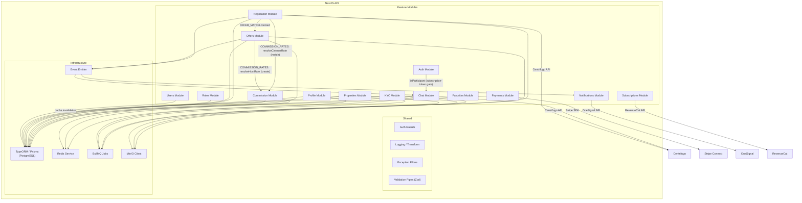
```mermaid
graph TB
    subgraph API["NestJS API"]
        subgraph Modules["Feature Modules"]
            Auth["Auth Module"]
            Roles["Roles Module"]
            Users["Users Module"]
            Profile["Profile Module"]
            KYC["KYC Module"]
            Properties["Properties Module"]
            Offers["Offers Module"]
            Negotiation["Negotiation Module"]
            Payments["Payments Module"]
            Commission["Commission Module"]
            Chat["Chat Module"]
            Notifications["Notifications Module"]
            Subscriptions["Subscriptions Module"]
            Favorites["Favorites Module"]
        end

        subgraph Shared["Shared"]
            Guards["Auth Guards"]
            Interceptors["Logging / Transform"]
            Filters["Exception Filters"]
            Pipes["Validation Pipes (Zod)"]
        end

        subgraph Infra["Infrastructure"]
            DB["TypeORM / Prisma<br/>(PostgreSQL)"]
            Cache["Redis Service"]
            Queue["BullMQ Jobs"]
            Storage["MinIO Client"]
            Events["Event Emitter"]
        end
    end

    Users --> DB
    Roles --> DB
    Profile --> DB
    Profile --> Storage
    Profile --> Queue
    KYC --> DB
    KYC --> Storage
    KYC --> Queue
    Properties --> DB
    Properties --> Storage
    Offers --> DB
    Offers --> Cache
    Offers --> Queue
    Offers --> Events
    Negotiation --> DB
    Negotiation --> Queue
    Negotiation --> Events
    Negotiation --> |"OFFER_MATCH contract"| Offers
    Negotiation --> |"Centrifugo API"| Centrifugo
    Commission --> DB
    Commission --> |"cache invalidation"| Cache
    Offers --> |"COMMISSION_RATES: resolveHostRate (create)"| Commission
    Negotiation --> |"COMMISSION_RATES: resolveCleanerRate (match)"| Commission
    Payments --> DB
    Payments --> |"Stripe SDK"| Stripe["Stripe Connect"]
    Chat --> DB
    Chat --> Cache
    Chat --> |"Centrifugo API"| Centrifugo["Centrifugo"]
    Auth --> |"isParticipant (subscription-token gate)"| Chat
    Notifications --> |"OneSignal API"| OneSignal["OneSignal"]
    Subscriptions --> |"RevenueCat API"| RevenueCat["RevenueCat"]
    Events --> Notifications
    Events --> Chat
```

---

## 4. Offer Lifecycle (Data Flow)

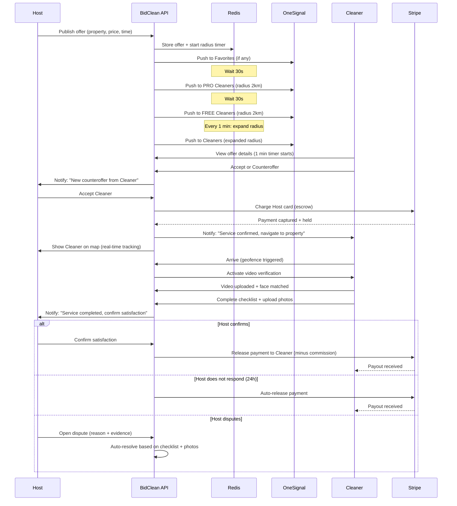
```mermaid
sequenceDiagram
    participant H as Host
    participant App as BidClean API
    participant R as Redis
    participant OS as OneSignal
    participant C as Cleaner
    participant S as Stripe

    H->>App: Publish offer (property, price, time)
    App->>R: Store offer + start radius timer
    App->>OS: Push to Favorites (if any)
    
    Note over R: Wait 30s
    App->>OS: Push to PRO Cleaners (radius 2km)
    
    Note over R: Wait 30s  
    App->>OS: Push to FREE Cleaners (radius 2km)
    
    Note over R: Every 1 min: expand radius
    App->>OS: Push to Cleaners (expanded radius)

    C->>App: View offer details (1 min timer starts)
    C->>App: Accept or Counteroffer
    App->>H: Notify: "New counteroffer from Cleaner"
    H->>App: Accept Cleaner

    App->>S: Charge Host card (escrow)
    S-->>App: Payment captured + held

    App->>C: Notify: "Service confirmed, navigate to property"
    App->>H: Show Cleaner on map (real-time tracking)

    C->>App: Arrive (geofence triggered)
    App->>C: Activate video verification
    C->>App: Video uploaded + face matched

    C->>App: Complete checklist + upload photos
    App->>H: Notify: "Service completed, confirm satisfaction"

    alt Host confirms
        H->>App: Confirm satisfaction
        App->>S: Release payment to Cleaner (minus commission)
        S-->>C: Payout received
    else Host does not respond (24h)
        App->>S: Auto-release payment
        S-->>C: Payout received
    else Host disputes
        H->>App: Open dispute (reason + evidence)
        App->>App: Auto-resolve based on checklist + photos
    end
```

---

## 5. Payment Flow

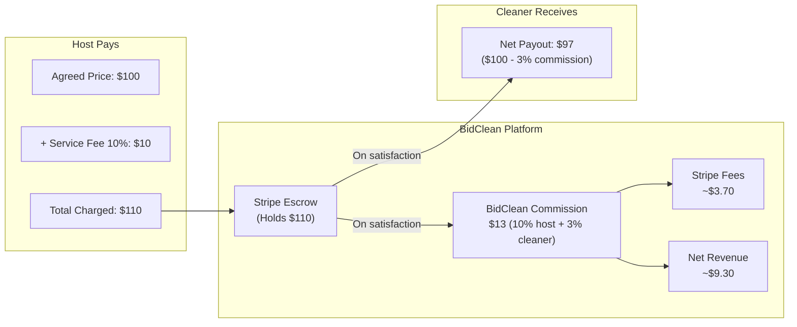
```mermaid
graph LR
    subgraph Host["Host Pays"]
        Offer["Agreed Price: $100"]
        Fee["+ Service Fee 10%: $10"]
        Total["Total Charged: $110"]
    end

    subgraph Platform["BidClean Platform"]
        Escrow["Stripe Escrow<br/>(Holds $110)"]
        Commission["BidClean Commission<br/>$13 (10% host + 3% cleaner)"]
        StripeFee["Stripe Fees<br/>~$3.70"]
        NetRevenue["Net Revenue<br/>~$9.30"]
    end

    subgraph Cleaner["Cleaner Receives"]
        Payout["Net Payout: $97<br/>($100 - 3% commission)"]
    end

    Total --> Escrow
    Escrow --> |"On satisfaction"| Commission
    Escrow --> |"On satisfaction"| Payout
    Commission --> StripeFee
    Commission --> NetRevenue
```

---

## 5b. Payment Escrow Schema

> Physical schema for the Stripe Escrow module (migration `1700000014000-CreatePaymentTables`). Money is stored as integer minor units (cents); statuses use `VARCHAR` + `CHECK`.

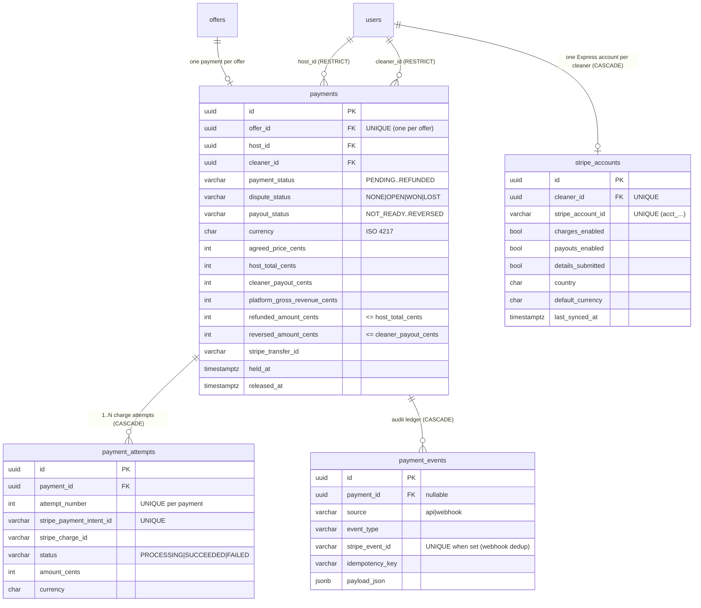
```mermaid
erDiagram
    offers ||--o| payments : "one payment per offer"
    users ||--o{ payments : "host_id (RESTRICT)"
    users ||--o{ payments : "cleaner_id (RESTRICT)"
    payments ||--o{ payment_attempts : "1..N charge attempts (CASCADE)"
    payments ||--o{ payment_events : "audit ledger (CASCADE)"
    users ||--o| stripe_accounts : "one Express account per cleaner (CASCADE)"

    payments {
        uuid id PK
        uuid offer_id FK "UNIQUE (one per offer)"
        uuid host_id FK
        uuid cleaner_id FK
        varchar payment_status "PENDING..REFUNDED"
        varchar dispute_status "NONE|OPEN|WON|LOST"
        varchar payout_status "NOT_READY..REVERSED"
        char currency "ISO 4217"
        int agreed_price_cents
        int host_total_cents
        int cleaner_payout_cents
        int platform_gross_revenue_cents
        int refunded_amount_cents "<= host_total_cents"
        int reversed_amount_cents "<= cleaner_payout_cents"
        varchar stripe_transfer_id
        timestamptz held_at
        timestamptz released_at
    }

    payment_attempts {
        uuid id PK
        uuid payment_id FK
        int attempt_number "UNIQUE per payment"
        varchar stripe_payment_intent_id "UNIQUE"
        varchar stripe_charge_id
        varchar status "PROCESSING|SUCCEEDED|FAILED"
        int amount_cents
        char currency
    }

    stripe_accounts {
        uuid id PK
        uuid cleaner_id FK "UNIQUE"
        varchar stripe_account_id "UNIQUE (acct_...)"
        bool charges_enabled
        bool payouts_enabled
        bool details_submitted
        char country
        char default_currency
        timestamptz last_synced_at
    }

    payment_events {
        uuid id PK
        uuid payment_id FK "nullable"
        varchar source "api|webhook"
        varchar event_type
        varchar stripe_event_id "UNIQUE when set (webhook dedup)"
        varchar idempotency_key
        jsonb payload_json
    }
```

Invariants enforced at the database level: at most one `SUCCEEDED` attempt per payment (partial unique index), one payment per offer, refund/reversal ceilings via `CHECK`, and webhook idempotency via a partial unique index on `stripe_event_id`.

---

## 5c. Stripe Webhook Ingress

> Stripe events enter through a single public endpoint that is authenticated by the signature (not JWT). The controller verifies, deduplicates, persists, and enqueues — then a worker advances the payment lifecycle, which fans out the domain events in §5d.

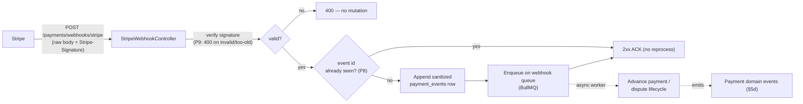
```mermaid
graph LR
    Stripe["Stripe"] -->|"POST /payments/webhooks/stripe<br/>(raw body + Stripe-Signature)"| Ctrl["StripeWebhookController"]

    Ctrl -->|"verify signature<br/>(P9: 400 on invalid/too-old)"| Verify{"valid?"}
    Verify -->|"no"| Reject["400 — no mutation"]
    Verify -->|"yes"| Dedup{"event id<br/>already seen? (P8)"}
    Dedup -->|"yes"| Ack["2xx ACK (no reprocess)"]
    Dedup -->|"no"| Persist["Append sanitized<br/>payment_events row"]
    Persist --> Enqueue["Enqueue on webhook queue<br/>(BullMQ)"]
    Enqueue --> Ack
    Enqueue -.->|"async worker"| Lifecycle["Advance payment /<br/>dispute lifecycle"]
    Lifecycle -.->|"emits"| Events["Payment domain events (§5d)"]
```

The payload is sanitized before persistence (`payment-payload.sanitizer.ts`): only ids, amounts, currency, status, and timestamps are stored — never card data, secrets, or PII.

---

## 5d. Payment Domain Events

> The payments module communicates state changes to other modules through typed domain events (EventEmitter2, defined in `services/api/src/payments/events/payment-events.ts`) rather than writing their tables. Consumers react within their own bounded context.

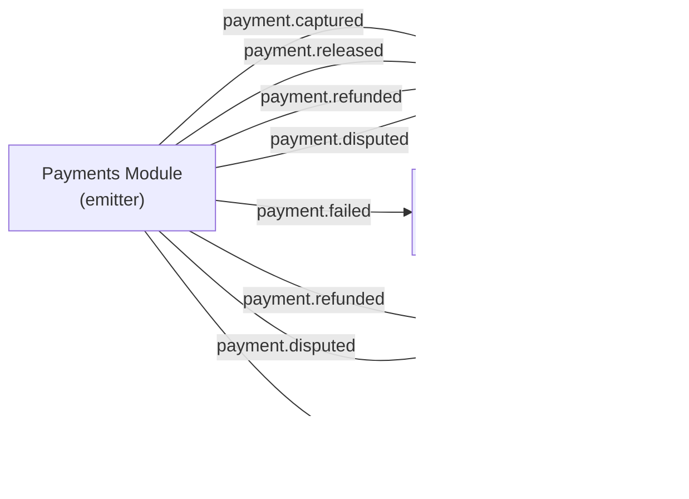
```mermaid
graph LR
    Payments["Payments Module<br/>(emitter)"]

    Payments -->|"payment.captured"| Notif["Notifications"]
    Payments -->|"payment.released"| Notif
    Payments -->|"payment.refunded"| Notif
    Payments -->|"payment.disputed"| Notif

    Payments -->|"payment.failed"| OfferPub["Offer Publishing<br/>(decides offer next state)"]
    Payments -->|"payment.refunded"| Disputes["Dispute System"]
    Payments -->|"payment.disputed"| Disputes

    Payments -->|"all events"| Analytics["Analytics"]
```

Each event carries a shared base payload (`paymentId`, `offerId`, `hostId`, `cleanerId`, `timestamp`) plus event-specific fields (amounts in cents, currency, failure reason). This keeps the payments module as the sole writer of the `payments` tables while letting other modules advance their own lifecycles.

---

## 5e. Payment Reconciliation (P11)

> Webhooks (§5c) are the primary path for advancing a charge, but delivery can be delayed, dropped, or interrupted mid-flight (e.g. a crash between creating the PaymentIntent and receiving its result). Two periodic sweeps act as a safety net that converges persisted state to Stripe's truth without distributed transactions.

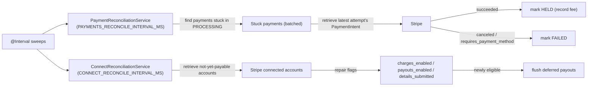
```mermaid
graph LR
    Timer["@Interval sweeps"] --> PayRec["PaymentReconciliationService<br/>(PAYMENTS_RECONCILE_INTERVAL_MS)"]
    Timer --> ConnRec["ConnectReconciliationService<br/>(CONNECT_RECONCILE_INTERVAL_MS)"]

    PayRec -->|"find payments stuck in PROCESSING"| Stuck["Stuck payments (batched)"]
    Stuck -->|"retrieve latest attempt's PaymentIntent"| Stripe["Stripe"]
    Stripe -->|"succeeded"| Held["mark HELD (record fee)"]
    Stripe -->|"canceled / requires_payment_method"| Failed["mark FAILED"]

    ConnRec -->|"retrieve not-yet-payable accounts"| Accts["Stripe connected accounts"]
    Accts -->|"repair flags"| Flags["charges_enabled / payouts_enabled / details_submitted"]
    Flags -->|"newly eligible"| Deferred["flush deferred payouts"]
```

Reconciliation is idempotent: a repair that Stripe already delivered via webhook is a no-op because the persisted state is already terminal for that attempt. Placeholder attempts whose intent id was never persisted (`pending:` prefix) are skipped, and per-payment errors are swallowed so one stuck record never stalls the batch.

---

## 5f. Commission Rate Resolution (two-moment)

> The `commission-system` module (ADR-006) decides *which* commission rate applies to each side of a service. It resolves rates only — the cents arithmetic stays in each consumer's own `CommissionService`, and coupling is one-directional via the `COMMISSION_RATES` token (no circular dependency). The two rates are resolved at different moments because they depend on actors known at different times.

```mermaid
sequenceDiagram
    participant Host
    participant Offers as Offers Module (create)
    participant Rates as COMMISSION_RATES
    participant Tier as SUBSCRIPTION_TIER (stub → Spec 11)
    participant Cleaner as Winning Cleaner
    participant Neg as Negotiation Module (match)

    Host->>Offers: create offer (country, serviceType)
    Offers->>Rates: resolveHostRate({ country, hostId, serviceType })
    Rates->>Tier: getTier(hostId) (bounded; FREE on timeout)
    Rates-->>Offers: { hostFeeRateBps, hostRuleId }
    Note over Offers: own CommissionService → snapshot Host rate on offer

    Cleaner->>Neg: accept / accepted proposal (Cleaner now known)
    Neg->>Rates: resolveCleanerRate({ country, cleanerId, serviceType })
    Rates->>Tier: getTier(cleanerId) (bounded; FREE on timeout)
    Rates-->>Neg: { cleanerRateBps, cleanerRuleId }
    Note over Neg: own CommissionService → snapshot Cleaner rate on winning proposal/offer
```

Resolution selects the most-specific active rule (specificity → priority → `effective_from` → lowest UUID) from `commission_rules`; with an empty ruleset it returns the environment defaults (identical to the prior flat model). Rules never overlap (GiST exclusion constraint), are never physically deleted (audit `ON DELETE RESTRICT`), and rate changes propagate across API instances via Redis pub/sub invalidation. Any failure degrades to the env-default rate and never blocks creation or match.

### Commission Rules Schema

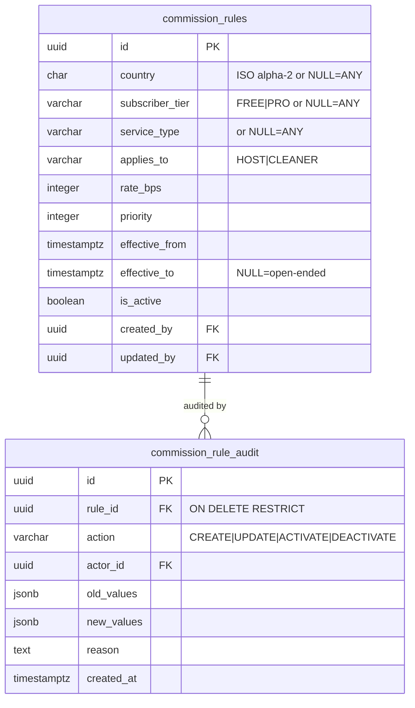
```mermaid
erDiagram
    commission_rules {
        uuid id PK
        char country "ISO alpha-2 or NULL=ANY"
        varchar subscriber_tier "FREE|PRO or NULL=ANY"
        varchar service_type "or NULL=ANY"
        varchar applies_to "HOST|CLEANER"
        integer rate_bps
        integer priority
        timestamptz effective_from
        timestamptz effective_to "NULL=open-ended"
        boolean is_active
        uuid created_by FK
        uuid updated_by FK
    }
    commission_rule_audit {
        uuid id PK
        uuid rule_id FK "ON DELETE RESTRICT"
        varchar action "CREATE|UPDATE|ACTIVATE|DEACTIVATE"
        uuid actor_id FK
        jsonb old_values
        jsonb new_values
        text reason
        timestamptz created_at
    }
    commission_rules ||--o{ commission_rule_audit : "audited by"
```

---

## 5g. Configuration Surfaces & Public/Secret Boundary

> The `secrets-inventory` tooling (`tools/config-inventory/`, ADR-010) derives a single catalog of every external configuration input from the code/config sources, then reconciles the committed `.env.example` against it. The catalog is the derived source of truth for a variable's existence, classification, and requiredness; `.env.example` is a generated PRESENTATION projection. Every variable is assigned to exactly one of four surfaces, and the public/secret boundary is hard: only `EXPO_PUBLIC_*` values (explicitly classified `PUBLIC`) ever reach the mobile client — no `SECRET` does.

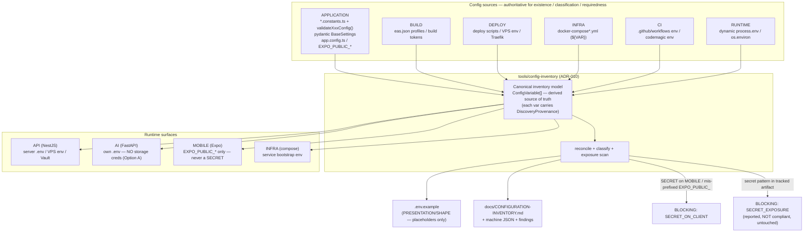
```mermaid
graph TB
    subgraph Sources["Config sources — authoritative for existence / classification / requiredness"]
        APP["APPLICATION<br/>*.constants.ts + validateXxxConfig()<br/>pydantic BaseSettings<br/>app.config.ts / EXPO_PUBLIC_*"]
        BLD["BUILD<br/>eas.json profiles / build tokens"]
        DEP["DEPLOY<br/>deploy scripts / VPS env / Traefik"]
        INF["INFRA<br/>docker-compose*.yml (${VAR})"]
        CI["CI<br/>.github/workflows env / codemagic env"]
        RT["RUNTIME<br/>dynamic process.env / os.environ"]
    end

    subgraph Tool["tools/config-inventory (ADR-010)"]
        Model["Canonical inventory model<br/>ConfigVariable[] — derived source of truth<br/>(each var carries DiscoveryProvenance)"]
        Recon["reconcile + classify + exposure scan"]
    end

    subgraph Surfaces["Runtime surfaces"]
        APISurf["API (NestJS)<br/>server .env / VPS env / Vault"]
        AISurf["AI (FastAPI)<br/>own .env — NO storage creds (Option A)"]
        MobileSurf["MOBILE (Expo)<br/>EXPO_PUBLIC_* only — never a SECRET"]
        InfraSurf["INFRA (compose)<br/>service bootstrap env"]
    end

    APP --> Model
    BLD --> Model
    DEP --> Model
    INF --> Model
    CI --> Model
    RT --> Model

    Model --> Recon
    Recon --> EnvEx[".env.example<br/>(PRESENTATION/SHAPE — placeholders only)"]
    Recon --> Doc["docs/CONFIGURATION-INVENTORY.md<br/>+ machine JSON + findings"]

    Model --> APISurf
    Model --> AISurf
    Model --> MobileSurf
    Model --> InfraSurf

    Recon -->|"SECRET on MOBILE / mis-prefixed EXPO_PUBLIC_"| Leak["BLOCKING: SECRET_ON_CLIENT"]
    Recon -->|"secret pattern in tracked artifact"| Exposure["BLOCKING: SECRET_EXPOSURE<br/>(reported, NOT compliant, untouched)"]
```

Two orthogonal axes classify each variable: `requiredScope` (`runtime | build | deploy | infra` — *what lifecycle scope* needs it) and `envApplicability` (`local | staging | production` — *which environments* it applies to). No environment token ever appears in `requiredScope` and no scope token in `envApplicability`. Compliance is `true` only when there are zero blocking findings; no credential is ever rotated, moved, or echoed — findings name the file, line, and matched pattern, never the secret value.

---

## 6. Auth & Security Flow

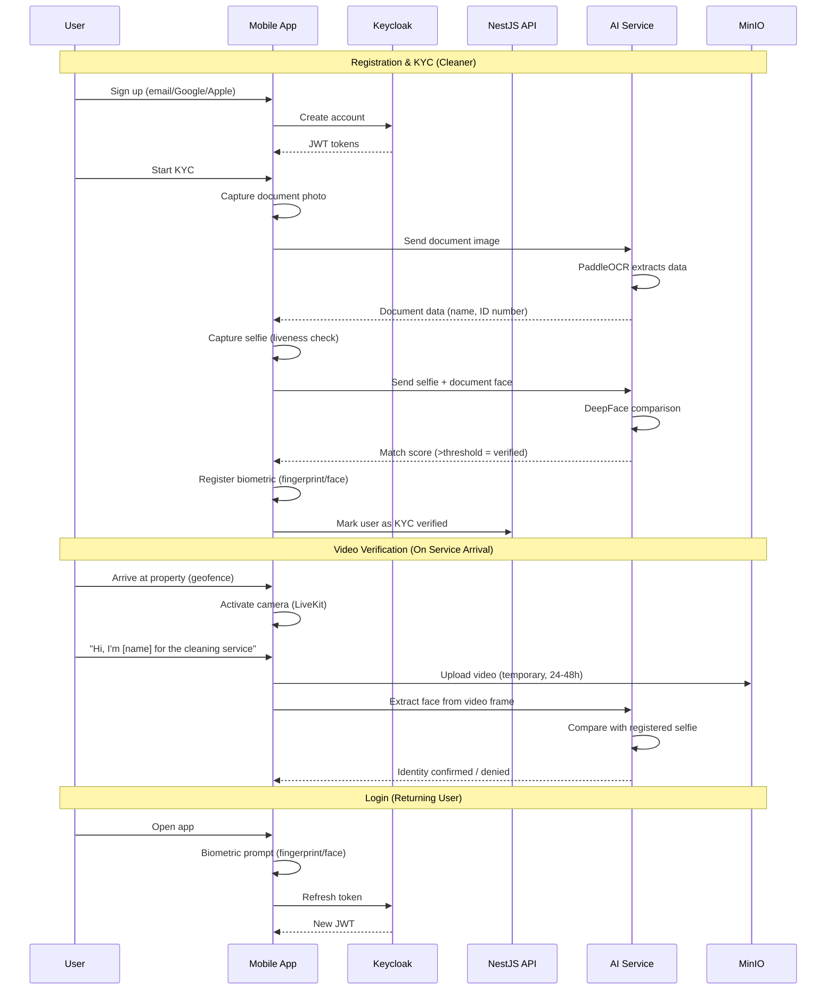
```mermaid
sequenceDiagram
    participant U as User
    participant App as Mobile App
    participant KC as Keycloak
    participant API as NestJS API
    participant AI as AI Service
    participant Store as MinIO

    Note over U,Store: Registration & KYC (Cleaner)
    U->>App: Sign up (email/Google/Apple)
    App->>KC: Create account
    KC-->>App: JWT tokens

    U->>App: Start KYC
    App->>App: Capture document photo
    App->>AI: Send document image
    AI->>AI: PaddleOCR extracts data
    AI-->>App: Document data (name, ID number)

    App->>App: Capture selfie (liveness check)
    App->>AI: Send selfie + document face
    AI->>AI: DeepFace comparison
    AI-->>App: Match score (>threshold = verified)

    App->>App: Register biometric (fingerprint/face)
    App->>API: Mark user as KYC verified

    Note over U,Store: Video Verification (On Service Arrival)
    U->>App: Arrive at property (geofence)
    App->>App: Activate camera (LiveKit)
    U->>App: "Hi, I'm [name] for the cleaning service"
    App->>Store: Upload video (temporary, 24-48h)
    App->>AI: Extract face from video frame
    AI->>AI: Compare with registered selfie
    AI-->>App: Identity confirmed / denied

    Note over U,Store: Login (Returning User)
    U->>App: Open app
    App->>App: Biometric prompt (fingerprint/face)
    App->>KC: Refresh token
    KC-->>App: New JWT
```

---

## 7. Chat Message Lifecycle (Realtime Chat)

> Post-match Host↔Cleaner messaging (Spec 13, ADR-009). **PostgreSQL is the source of truth; Centrifugo is transport only.** A send persists first, then publishes best-effort — a publish failure never loses the message. There is no immediate-delivery guarantee: recipients recover missed messages via the `after` reconciliation cursor on reconnect. Auth issues Centrifugo tokens; chat owns the participation rule.

```mermaid
sequenceDiagram
    participant S as Sender App
    participant R as Recipient App
    participant Auth as Auth (token endpoint)
    participant API as Chat Module (API)
    participant DB as PostgreSQL
    participant C as Centrifugo

    Note over S,C: Subscribe (both participants)
    S->>Auth: GET /auth/centrifugo/token?channel=chat:conversation:{id}
    Auth->>API: ChatParticipationService.isParticipant(subject, id)
    API-->>Auth: participant? (by JWT subject, not channel string)
    Auth-->>S: subscription token (only if participant)
    S->>C: subscribe chat:conversation:{id}

    Note over S,DB: Send = one serialized transaction (persist-then-publish)
    S->>API: POST /chat/conversations/:id/messages (Idempotency-Key + clientMessageId)
    API->>DB: BEGIN · SELECT ... FOR UPDATE conversation
    API->>DB: verify OPEN · dedup(client_message_id) · next sequence_number · insert · bump last_message_at · COMMIT
    API-->>S: 201 (persisted; deduplicated when a retry)
    API-->>C: publish {type: chat_message} (best-effort)
    C-->>R: live message
    Note over API,C: publish failure → logged (never the body), request still succeeds

    Note over R,DB: Reconnect reconciliation (no immediate-delivery guarantee)
    R->>C: reconnect
    R->>API: GET /chat/conversations/:id/messages?after=<lastSeq>
    API->>DB: keyset read (sequence_number > lastSeq)
    API-->>R: missed messages (client dedups by id + clientMessageId, orders by sequenceNumber)
```

---

## 7b. Voice Notes Schema (extends Chat)

> Voice notes (Spec 14, migration `1700000023000-CreateVoiceNoteTables`, ADR-012) are **not a new domain** — a voice note is a `chat_messages` row with `type = 'VOICE'` whose `body` is `NULL` and whose audio lives in MinIO, referenced by an opaque object key. The migration extends `chat_messages` (allows `VOICE`, makes `body` nullable, adds a type/body shape check) and adds three tables. **Authority split:** PostgreSQL owns the message + metadata; MinIO owns the audio bytes; the Whisper transcript is derived data, never authoritative.

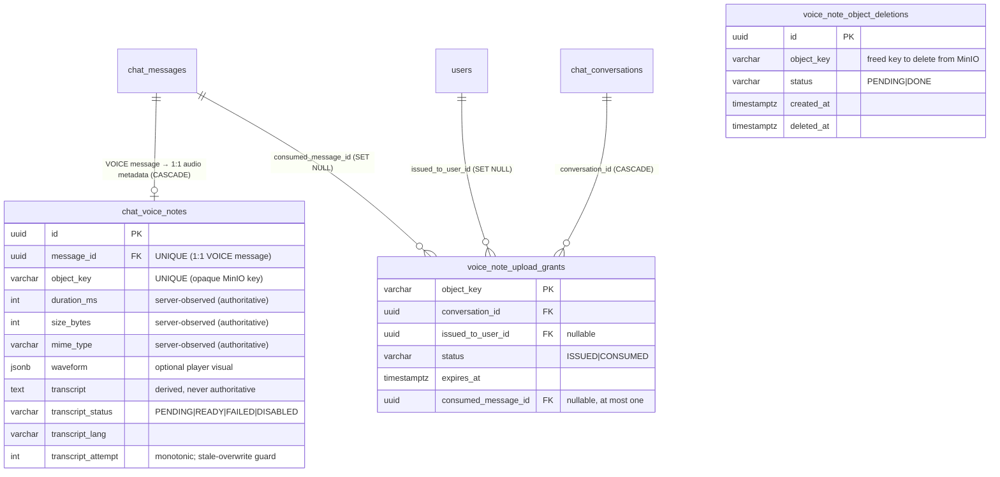
```mermaid
erDiagram
    chat_messages ||--o| chat_voice_notes : "VOICE message → 1:1 audio metadata (CASCADE)"
    chat_conversations ||--o{ voice_note_upload_grants : "conversation_id (CASCADE)"
    users ||--o{ voice_note_upload_grants : "issued_to_user_id (SET NULL)"
    chat_messages ||--o{ voice_note_upload_grants : "consumed_message_id (SET NULL)"

    chat_voice_notes {
        uuid id PK
        uuid message_id FK "UNIQUE (1:1 VOICE message)"
        varchar object_key "UNIQUE (opaque MinIO key)"
        int duration_ms "server-observed (authoritative)"
        int size_bytes "server-observed (authoritative)"
        varchar mime_type "server-observed (authoritative)"
        jsonb waveform "optional player visual"
        text transcript "derived, never authoritative"
        varchar transcript_status "PENDING|READY|FAILED|DISABLED"
        varchar transcript_lang
        int transcript_attempt "monotonic; stale-overwrite guard"
    }

    voice_note_upload_grants {
        varchar object_key PK
        uuid conversation_id FK
        uuid issued_to_user_id FK "nullable"
        varchar status "ISSUED|CONSUMED"
        timestamptz expires_at
        uuid consumed_message_id FK "nullable, at most one"
    }

    voice_note_object_deletions {
        uuid id PK
        varchar object_key "freed key to delete from MinIO"
        varchar status "PENDING|DONE"
        timestamptz created_at
        timestamptz deleted_at
    }
```

Two invariants make this safe. **(1) An object key is a grant, not a credential:** every key is bound server-side to an upload grant `{ conversation, issued-to user, single-use, expiry }`, so possession of a key never authorizes a send. **(2) Deletion never loses the key:** a `BEFORE DELETE` trigger on `chat_voice_notes` (`voice_note_tombstone_object()`) writes the freed `object_key` into `voice_note_object_deletions` *inside the deleting transaction* (rolling back with it), so a cleanup worker can delete the MinIO object even after the metadata row is gone by direct delete or CASCADE (message → conversation → thread → offer). Deletion coherence relies on the Spec 13 invariant that `chat_messages.sender_id` and the conversation participant FKs are `ON DELETE SET NULL` — voice notes add no user-cascade path, so deleting a user never destroys shared history.

### 7c. Voice Note Send / Transcription / Playback / Cleanup Flow

> Audio bytes never transit the API. Upload and playback are direct client↔MinIO over short-lived pre-signed URLs; transcription is asynchronous, best-effort, and stale-update-safe (Whisper.cpp in the AI service receives **bytes only** — Option A, no storage access). The send reuses the Spec 13 serialized transaction with a `VOICE` branch.

```mermaid
sequenceDiagram
    participant S as Sender App
    participant API as Chat Module (API)
    participant Minio as MinIO (chat-voice-notes)
    participant DB as PostgreSQL
    participant C as Centrifugo
    participant Q as BullMQ (voice-notes-transcription)
    participant AI as AI Service (/transcribe, Whisper.cpp)
    participant R as Recipient App

    Note over S,Minio: 1) Grant-first upload (key is a grant, not a credential)
    S->>API: POST voice-notes/upload-url (participant + OPEN)
    API->>DB: persist grant {objectKey, conv, issued_to, ISSUED, expires_at} (BEFORE URL)
    API->>Minio: presign PUT (single object, short TTL)
    API-->>S: { objectKey, uploadUrl, expiresAt }
    S->>Minio: PUT audio bytes (direct; API never sees the bytes)

    Note over S,DB: 2) Durable send = one serialized transaction
    S->>API: POST messages {type:VOICE, clientMessageId, objectKey, durationMs, sizeBytes, mimeType, waveform?}
    API->>DB: BEGIN · SELECT ... FOR UPDATE conversation
    API->>DB: dedup(fingerprint) · OPEN · verify grant (issued_to=caller, unexpired, unconsumed)
    API->>Minio: inspectObject → real size / content-type / duration (AUTHORITATIVE)
    API->>DB: insert chat_messages(VOICE, body NULL) + chat_voice_notes(server-observed) · consume grant · bump last_message_at · COMMIT
    API-->>S: 201 (persisted)
    API-->>C: publish {type: chat_message} (best-effort)
    C-->>R: live VOICE message
    API->>Q: enqueue transcription (best-effort; only if STT enabled, else status DISABLED)

    Note over Q,AI: 3) Async transcription (non-blocking, attempt-versioned)
    Q->>API: worker: claim transcript_attempt
    API->>Minio: getObject (bytes)
    API->>AI: POST /transcribe (multipart bytes; no storage ref)
    AI-->>API: { text, language }
    API->>DB: attachTranscript READY|FAILED (only if attempt is latest — stale-safe)
    API-->>C: publish {type: voice_transcript_updated, messageId, attempt, status}
    C-->>R: transcript update (client upserts by id, ignores older attempt)

    Note over S,Minio: 4) Playback (participant-gated; key resolved from DB)
    R->>API: GET voice-notes/:messageId/playback-url
    API->>DB: authorize by participation · resolve objectKey by messageId
    API->>Minio: presign GET (short TTL)
    API-->>R: { playbackUrl } → R streams from MinIO

    Note over API,Minio: 5) Cleanup (eventual, idempotent, repeatable)
    API->>DB: sweep expired ISSUED grants · drain tombstones · reconciler backstop · stuck-PENDING re-enqueue
    API->>Minio: deleteObjectSafe (orphan/tombstoned objects)
```

---

## 8. Notification Flow (Push Notifications)

> Push notifications (Spec 16, ADR-013). The `notifications` module **reacts** to a **durable transactional outbox**, never a source of business truth. An emitting domain writes a `<domain>_outbox` row **in the same transaction as the business fact**; a relay drains committed rows into deduped intents; a BullMQ worker delivers per **consented player id (Model B)** via OneSignal. **Delivery intent is exactly-once in PostgreSQL; external OneSignal delivery is at-least-once/best-effort.** `EventEmitter2`/Centrifugo are fast-paths, never the trigger. (Migrations `1700000030000`–`1700000034000`.)

```mermaid
graph TB
    subgraph Emitters["Emitting domains (unchanged sources of truth) — Task 12 pending"]
        Fact["Commit business fact"]
        Outbox["Write &lt;domain&gt;_outbox row (SAME TX)<br/>event_id UNIQUE, version, payload"]
        Fact --> Outbox
    end

    subgraph Notifications["notifications module (reacts, never business truth)"]
        Relay["OutboxRelayProcessor (repeatable)<br/>drain relayed_at IS NULL"]
        Mapper["Per-domain mapper → NotificationIntent<br/>{ recipient, type, dedupKey, deepLink (ids only) }"]
        Decide["PreferenceService.decide()<br/>metadata-driven · calls EXEMPT · fail-open"]
        Svc["NotificationService.createIntent()<br/>durable-first · atomic suppression · UNIQUE dedup_key"]
        Worker["DeliveryWorker (BullMQ)<br/>single-winner PENDING→PROCESSING"]
        Registry["DeviceRegistryService (Model B)<br/>resolve consented, non-stale player ids"]
        Catalog["ContentCatalog (en/es parity)"]
        Client["OneSignalClient (best-effort, server-only key)"]
        Webhook["OneSignalWebhookController<br/>signed · provider_event_id UNIQUE"]
        Sweep["ReconcileSweepProcessor (bounded drift repair)"]
    end

    subgraph Infra["Infra"]
        PG[("PostgreSQL<br/>*_outbox · notification_devices<br/>notification_preferences · notifications")]
        Redis["Redis + BullMQ"]
        OneSignal["OneSignal (APNs/FCM, tags/segments)"]
        Cent["Centrifugo (foreground realtime — existing)"]
    end

    Outbox --> PG
    Relay -->|drain committed rows| PG
    Relay --> Mapper --> Svc
    Svc --> Decide
    Svc -->|persist PENDING/SUPPRESSED| PG
    Svc -->|enqueue only after PENDING committed| Redis
    Redis --> Worker
    Worker --> Registry
    Worker --> Catalog
    Worker --> Client --> OneSignal
    Worker -->|SENT / FAILED_* / SUPPRESSED| PG
    Registry -->|external-user-id + tags| OneSignal
    OneSignal -->|delivery / subscription callback| Webhook --> Registry
    Redis --> Sweep --> Registry
    OneSignal -->|push| Mobile["Mobile: useNotificationRouting<br/>deep-link → screen + GET reconcile<br/>incoming_call → IncomingCallSheet"]
    Cent -.->|foreground alert (fail-open dedup)| Mobile
```

**Authority split.** The emitting domain owns the fact; **PostgreSQL** owns the notification delivery intent (`notifications.dedup_key` UNIQUE → exactly-once intent) and the device registry (`notification_devices`, Model B per-device consent); **OneSignal** owns device tokens and OS delivery (targeted per consented player id, kept synchronized bidirectionally); **Centrifugo** remains the foreground realtime channel with client-preferred, fail-open de-dup. Notification data is **user-owned** — `notification_devices`, `notification_preferences`, and `notifications` are `ON DELETE CASCADE` from `users` (the deliberate contrast with chat/voip `SET NULL`). The only shared code is the domain-agnostic `OutboxWriter` in `packages/shared`; per-domain `event_id`/payload shaping lives in each emitting domain and domain→intent mapping lives only in the notifications mappers. **Task 12 (emitting-domain outbox writes) is pending** — coordinated after the parallel voice-notes (chat) and voip work; until then the relay drains empty outbox tables (a safe no-op).

---

## 9. VoIP Call Lifecycle (In-Conversation Calls)

> In-conversation voice/video calling (Spec 15, ADR-014). **A call is a conversation event, not a new domain** — a `voip_calls` row is bound to one Spec 13 `chat_conversations` row (migration `1700000040000`). **PostgreSQL** is the source of truth for *that a call happened* + its lifecycle; **LiveKit** (self-hosted SFU) is the source of truth for the live media (an ephemeral room); **Centrifugo** carries best-effort call-control signaling on the **existing** `chat:conversation:{id}` channel. **Media (audio/video RTP) never transits the API or PostgreSQL** — it flows client ↔ SFU only, reachable only via a short-lived, room-scoped, identity-scoped access token minted server-side per a status+role gate. A room name is a reference, never a credential. Every terminal transition is a **single-winner** conditional write, and liveness is **server-authoritative** (a signed LiveKit webhook + two bounded sweeps) — never a client heartbeat.

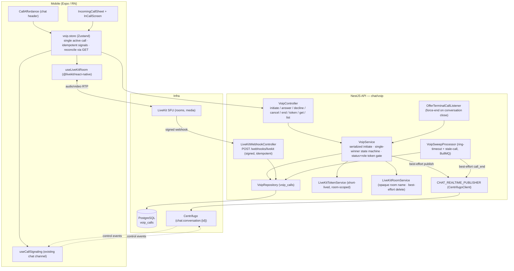
```mermaid
graph TB
    subgraph Mobile["Mobile (Expo / RN)"]
        Affordance["CallAffordance (chat header)"]
        Store["voip.store (Zustand)<br/>single active call · idempotent signals · reconcile via GET"]
        Signal["useCallSignaling (existing chat channel)"]
        LKRoom["useLiveKitRoom (@livekit/react-native)"]
        Sheet["IncomingCallSheet + InCallScreen"]
    end

    subgraph API["NestJS API — chat/voip"]
        Ctrl["VoipController<br/>initiate / answer / decline / cancel / end / token / get / list"]
        Svc["VoipService<br/>serialized initiate · single-winner state machine · status+role token gate"]
        Repo["VoipRepository (voip_calls)"]
        TokenSvc["LiveKitTokenService (short-lived, room-scoped)"]
        RoomSvc["LiveKitRoomService (opaque room name · best-effort delete)"]
        Webhook["LiveKitWebhookController<br/>POST /webhooks/livekit (signed, idempotent)"]
        Sweep["VoipSweepProcessor (ring-timeout + stale-call, BullMQ)"]
        TermList["OfferTerminalCallListener (force-end on conversation close)"]
        Pub["CHAT_REALTIME_PUBLISHER (CentrifugoClient)"]
    end

    subgraph Infra["Infra"]
        PG[("PostgreSQL<br/>voip_calls")]
        Cent["Centrifugo (chat:conversation:{id})"]
        LiveKit["LiveKit SFU (rooms, media)"]
    end

    Affordance --> Store
    Store --> Ctrl
    Store --> Signal
    Store --> LKRoom
    Sheet --> Store
    Signal -.->|control events| Cent
    LKRoom <-->|audio/video RTP| LiveKit

    Ctrl --> Svc
    Svc --> Repo
    Svc --> TokenSvc
    Svc --> RoomSvc
    Svc -->|best-effort publish| Pub --> Cent
    Repo --> PG
    LiveKit -->|signed webhook| Webhook --> Repo
    Sweep --> Repo
    Sweep -->|best-effort call_end| Pub
    TermList --> Svc
    Cent -.->|control events| Signal
```

**Lifecycle:** `RINGING → { ONGOING → ENDED } | MISSED | DECLINED | CANCELED | FAILED` (terminal statuses immutable). Initiate is durable-first (persist `RINGING` before any token/signal); a partial UNIQUE index over non-terminal status enforces at most one active call per conversation (a concurrent second → `409 busy`). The media-token **status+role gate**: initiator while `RINGING` (via initiate), callee only via `answer`, either participant while `ONGOING`, none when terminal. Sweeps force-end stuck calls (unanswered ring → `MISSED`/`TIMEOUT_NO_ANSWER`; stale/over-max `ONGOING` → `ENDED`/`TIMEOUT`); `room_finished` is a liveness signal interpreted by cause (never a blind generic `ENDED`). **Deletion coherence:** `initiator_id`/`callee_id` are `ON DELETE SET NULL`, `conversation_id`/`offer_id` CASCADE (never a user-cascade) — deleting a participant never destroys shared call history. **Push seam:** at `RINGING`, `VoipService.initiate` marks the single `voip_outbox` `call-invited` trigger point for push-notifications (Spec 16) with a `TODO(orchestrator)` comment; this spec does not write the outbox.

---

*Last updated: September 9, 2026*
*Update this document on EVERY structural change.*
