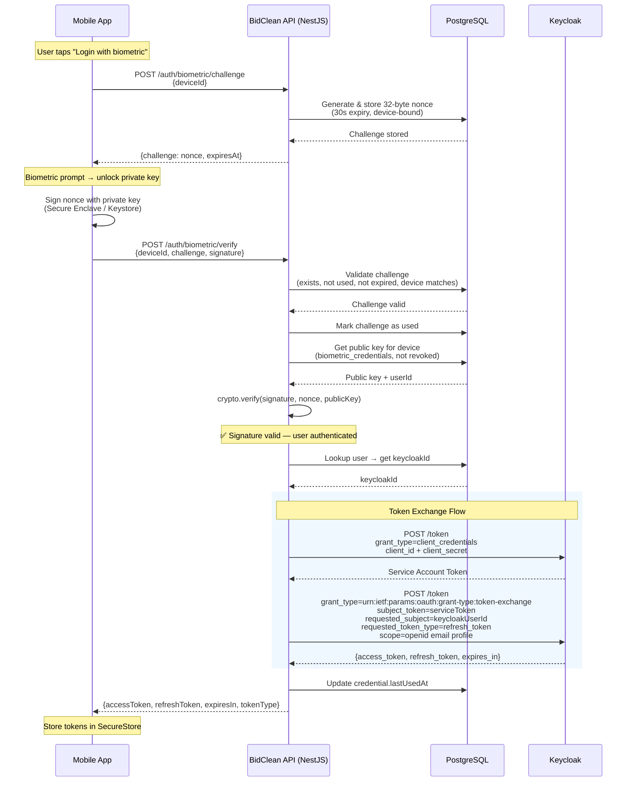

# Implementation Spike: Keycloak Integration for Passwordless Biometric Auth

## Status

**Decision: ACCEPTED** — Use Keycloak Token Exchange (`urn:ietf:params:oauth:grant-type:token-exchange`)

| Field | Value |
|-------|-------|
| Date | 2025-01-20 |
| Author | BidClean Engineering |
| Status | Accepted |
| Supersedes | N/A |

---

## 1. Problem Statement

BidClean needs to issue Keycloak-managed tokens after server-side biometric verification. The flow is:

1. Device unlocks private key via biometric (fingerprint / Face ID)
2. Device signs a server-generated challenge (nonce)
3. NestJS verifies the signature against the stored public key
4. **NestJS must obtain valid Keycloak access + refresh tokens for the user**

The challenge: NestJS has verified the user's identity through biometric, but Keycloak doesn't know about this authentication event. We need a mechanism to "tell" Keycloak to issue tokens for a user that our service has already authenticated.

### Constraints

- Keycloak is the **single source of truth** for token issuance (NestJS never mints JWTs)
- Biometric data never leaves the device
- The issued tokens must be standard Keycloak tokens (so they validate against JWKS like any other token)
- Must work with Keycloak's refresh token rotation and session management

---

## 2. Mechanisms Evaluated

### 2.1 Token Exchange (RFC 8693) — ✅ RECOMMENDED

**Mechanism:** Service account obtains its own token via `client_credentials`, then exchanges it for user-scoped tokens using `requested_subject`.

**Grant type:** `urn:ietf:params:oauth:grant-type:token-exchange`

**How it works:**
1. Service account authenticates with `client_credentials` → gets service token
2. Service sends Token Exchange request with `requested_subject` = user's Keycloak ID
3. Keycloak issues access + refresh tokens scoped to that user
4. These tokens are indistinguishable from tokens obtained through normal login

**Pros:**
- Standard RFC 8693 implementation
- Creates a proper Keycloak session for the user
- Issued tokens work with refresh, introspection, and revocation
- Service account acts as a trusted intermediary (clear audit trail)
- No user credentials needed (password not required)

**Cons:**
- Token Exchange is a **preview feature** in Keycloak (must be explicitly enabled)
- Requires specific client permissions (token-exchange role)
- Service account has elevated privileges (can impersonate any user)

---

### 2.2 Direct Access Grant (Resource Owner Password Credentials)

**Mechanism:** Use a special "internal password" or service credential to authenticate on behalf of the user.

**How it works:**
1. Set a hidden internal password for each user during registration
2. Use `grant_type=password` with the user's email and internal password
3. Keycloak issues tokens

**Pros:**
- Simple, no preview features required
- Well-supported across all Keycloak versions

**Cons:**
- **Security risk:** Requires storing or deriving a password for every user
- Breaks the principle of Keycloak owning all credentials
- Social login users (Google/Apple) may not have a password at all
- Violates REQ-7: "No sensitive data stored in BidClean's database"
- Deprecated pattern per OAuth 2.1 (RFC 9700 removes ROPC)

**Verdict:** ❌ Rejected — violates security architecture

---

### 2.3 Custom Keycloak SPI (Authenticator / Token Provider)

**Mechanism:** Write a custom Keycloak extension (SPI) that accepts a signed assertion from NestJS and issues tokens.

**How it works:**
1. Develop a custom Keycloak REST endpoint or authenticator SPI
2. NestJS sends a signed request (e.g., JWT signed with a shared secret)
3. Custom SPI validates the assertion → issues tokens for the user
4. Deploy the SPI as a JAR in Keycloak's providers directory

**Pros:**
- Full control over the authentication logic
- Can enforce custom policies (rate limits, device checks)
- No dependency on preview features

**Cons:**
- Significant development effort (Java/Kotlin Keycloak SPI)
- Maintenance burden across Keycloak upgrades
- Adds operational complexity (custom JAR deployment, testing)
- Harder to debug and audit
- Overkill for this use case

**Verdict:** ❌ Rejected — excessive complexity for the problem

---

### 2.4 Admin API Session Impersonation

**Mechanism:** Use Keycloak Admin API to create a session and extract tokens.

**How it works:**
1. NestJS uses admin credentials to call `POST /admin/realms/{realm}/users/{id}/impersonation`
2. Keycloak creates a session and returns a redirect with session cookies
3. Parse cookies / use the session to obtain tokens

**Pros:**
- No preview features needed
- Admin API is stable and well-documented

**Cons:**
- Impersonation endpoint returns browser cookies, not OAuth tokens
- Not designed for programmatic token issuance
- Would require scraping/following redirects to extract tokens
- Audit logs show "admin impersonation" (confusing)
- Fragile — depends on redirect behavior that may change

**Verdict:** ❌ Rejected — not designed for this use case

---

### 2.5 Offline Token with Service Account

**Mechanism:** Use service account to generate offline tokens scoped to the user.

**How it works:**
1. Service account requests an offline token
2. Modify token claims to point to the user
3. Use the offline token for API access

**Pros:**
- Long-lived tokens reduce re-authentication needs

**Cons:**
- Token modification is not possible without signing keys
- Offline tokens bypass session management
- Cannot leverage Keycloak's session lifecycle (no proper logout)
- Tokens wouldn't validate against JWKS properly

**Verdict:** ❌ Rejected — fundamentally incompatible with session management

---

## 3. Recommended Approach: Token Exchange

### Why Token Exchange is the Right Choice

| Criterion | Token Exchange | Alternatives |
|-----------|---------------|--------------|
| Standard-based | ✅ RFC 8693 | ❌ Custom or deprecated |
| Creates proper session | ✅ Full Keycloak session | ❌ Varies |
| No user credentials needed | ✅ Only subject ID | ❌ ROPC needs password |
| Token lifecycle support | ✅ Refresh, revoke, rotate | ❌ Varies |
| NestJS doesn't mint tokens | ✅ Keycloak issues them | ❌ Custom SPI is Keycloak code |
| Audit trail | ✅ Token exchange event logged | ⚠️ Impersonation is confusing |
| Maintenance burden | ⚠️ Preview feature flag | ❌ Custom SPI needs Java dev |

### Current Implementation

The implementation already uses Token Exchange correctly in `keycloak.service.ts`:

```typescript
async getTokensForUser(keycloakUserId: string): Promise<AuthTokens> {
  const serviceToken = await this.getServiceAccountToken();
  const body = new URLSearchParams({
    grant_type: 'urn:ietf:params:oauth:grant-type:token-exchange',
    client_id: this.config.clientId,
    client_secret: this.config.clientSecret,
    subject_token: serviceToken,
    requested_token_type: 'urn:ietf:params:oauth:token-type:refresh_token',
    requested_subject: keycloakUserId,
    scope: 'openid email profile',
  });
  return this.requestTokens(body);
}
```

---

## 4. Keycloak Configuration Required

### 4.1 Enable Token Exchange Feature (Preview)

Token Exchange is a preview/experimental feature in Keycloak. It must be enabled at server startup.

**Docker Compose / Environment Variable:**

```yaml
# infra/docker-compose.yml — Keycloak service
services:
  keycloak:
    image: quay.io/keycloak/keycloak:24.x
    command: start-dev --features=token-exchange
    environment:
      KC_FEATURES: token-exchange
```

**Production (start command):**

```bash
bin/kc.sh start --features=token-exchange
```

> **Note:** In Keycloak 24+, use `--features=token-exchange`. In older versions (< 21), use `--features=token-exchange` or the deprecated `--features-preview=token-exchange`.

### 4.2 Client Configuration

The BidClean API client (`bidclean-api`) needs:

| Setting | Value | Purpose |
|---------|-------|---------|
| Client Protocol | openid-connect | Standard OIDC |
| Access Type | confidential | Has client_secret |
| Service Account Enabled | ✅ true | Needed for client_credentials grant |
| Direct Access Grants | ❌ disabled | Not needed, security hardening |
| Standard Flow | ✅ enabled | For normal login callbacks |
| Authorization Enabled | ❌ disabled | Not using fine-grained authz |

### 4.3 Service Account Roles

The service account for `bidclean-api` needs the `token-exchange` role:

1. Go to **Clients** → `bidclean-api` → **Service Account Roles**
2. Under **Client Roles**, select `realm-management`
3. Assign the role: `token-exchange`

Alternatively via Admin API:

```bash
# Get service account user ID
SERVICE_ACCOUNT_ID=$(curl -s -H "Authorization: Bearer $ADMIN_TOKEN" \
  "$KEYCLOAK_URL/admin/realms/bidclean/clients/$CLIENT_UUID/service-account-user" \
  | jq -r '.id')

# Get token-exchange role ID from realm-management client
ROLE_ID=$(curl -s -H "Authorization: Bearer $ADMIN_TOKEN" \
  "$KEYCLOAK_URL/admin/realms/bidclean/clients/$REALM_MGMT_CLIENT_UUID/roles/token-exchange" \
  | jq -r '.id')

# Assign role
curl -X POST -H "Authorization: Bearer $ADMIN_TOKEN" \
  -H "Content-Type: application/json" \
  "$KEYCLOAK_URL/admin/realms/bidclean/users/$SERVICE_ACCOUNT_ID/role-mappings/clients/$REALM_MGMT_CLIENT_UUID" \
  -d "[{\"id\":\"$ROLE_ID\",\"name\":\"token-exchange\"}]"
```

### 4.4 Token Exchange Permissions (Fine-Grained)

In some Keycloak configurations, fine-grained permissions must be enabled on the target client:

1. Go to **Clients** → `bidclean-api` → **Permissions** tab
2. Enable **Permissions Enabled**
3. Click on **token-exchange** permission
4. Add a policy that allows the `bidclean-api` service account to exchange tokens

> **Keycloak 24+ simplified path:** If using the same client for both the service account and target audience, the `token-exchange` role on `realm-management` is sufficient.

### 4.5 Realm Settings

| Setting | Value | Reason |
|---------|-------|--------|
| Refresh Token Revocation | ✅ enabled | Security: old refresh tokens are invalidated on use |
| Access Token Lifespan | 15 minutes | Short-lived for security |
| Refresh Token Lifespan | 7 days | Matches REQ-4 session requirements |
| SSO Session Idle | 7 days | Aligns with refresh token lifespan |

---

## 5. Security Analysis

### 5.1 Threat Model

| Threat | Mitigation |
|--------|-----------|
| Stolen service account credentials | Client secret in env vars (not in code), rotated periodically. Service account has minimal roles. |
| Unauthorized token exchange (service compromise) | Rate limiting on biometric verify endpoint. Monitor token-exchange events in Keycloak logs. |
| Replay of biometric challenge | Challenges are single-use (marked `used=true`), expire in 30s, bound to device_id. |
| Man-in-the-middle on token exchange | All Keycloak communication over TLS. Internal network uses mTLS in production. |
| Service account impersonates arbitrary users | Acceptable risk — NestJS only calls `getTokensForUser` after signature verification. Audit trail in Keycloak events. |

### 5.2 Principle of Least Privilege

The service account's `token-exchange` role grants impersonation capability. To limit blast radius:

- **Monitor:** Enable Keycloak event logging for `TOKEN_EXCHANGE` events
- **Scope:** The service account has only `token-exchange` on `realm-management`, no admin roles
- **Rate limit:** The biometric verify endpoint has per-device rate limiting (max 5 attempts per minute)
- **Device binding:** Token exchange only happens after signature verification against a registered device

### 5.3 Token Properties

Tokens issued via Token Exchange:
- Have the same claims as tokens from normal login
- Are bound to a proper Keycloak session (revocable)
- Support refresh token rotation
- Appear in the user's active sessions (visible in account console)
- Are signed with Keycloak's RS256 key (validate via JWKS)

---

## 6. Sequence Diagram



---

## 7. Risks and Mitigations

| # | Risk | Probability | Impact | Mitigation |
|---|------|-------------|--------|-----------|
| 1 | Token Exchange feature removed or API changes in future Keycloak versions | Low | High | Pin Keycloak version. Monitor release notes. Feature has been stable since Keycloak 19. Fallback plan documented (Section 7.1). |
| 2 | Performance overhead of double token request (service token + exchange) | Medium | Low | Cache service account token (short TTL, e.g., 4 minutes for a 5-minute token). Token exchange adds ~50-100ms. |
| 3 | Keycloak rate-limits token endpoint under high load | Low | Medium | Use connection pooling. Configure Keycloak's thread pool for expected biometric auth volume. |
| 4 | Service account token expiry mid-request | Low | Low | Refresh service account token proactively. Retry logic on 401 from Keycloak. |
| 5 | Token Exchange disabled accidentally in Keycloak config | Low | High | Health check on startup that verifies token exchange works. Integration test in CI. |

### 7.1 Fallback Plan

If Token Exchange becomes unavailable (deprecated, removed, or blocked by infrastructure):

**Option A — Custom Keycloak Required Action / Authenticator:**
- Develop a lightweight Keycloak SPI that accepts a signed assertion
- More work but removes dependency on preview feature
- Estimated effort: 2-3 days of Java/Kotlin development

**Option B — Direct Access Grant with Service Password:**
- Generate a random, per-user internal password during registration
- Store encrypted in BidClean DB, use for ROPC grant
- Quick to implement but degrades security posture
- Last resort only

**Recommended fallback:** Option A if Token Exchange is removed in a future Keycloak major version.

---

## 8. Performance Considerations

| Operation | Expected Latency | Notes |
|-----------|-----------------|-------|
| Service account token (cached) | ~0ms | Cached in memory, refreshed every 4 min |
| Service account token (cold) | ~50ms | First request or after cache expiry |
| Token exchange request | ~50-100ms | Single HTTP call to Keycloak |
| Total biometric verify | ~150-250ms | Including DB lookups + crypto verify |

### Optimization: Service Token Caching

```typescript
// Recommended: cache service token with TTL slightly less than its expiry
private serviceTokenCache: { token: string; expiresAt: number } | null = null;

private async getServiceAccountToken(): Promise<string> {
  if (this.serviceTokenCache && Date.now() < this.serviceTokenCache.expiresAt) {
    return this.serviceTokenCache.token;
  }
  // ... fetch new token
  this.serviceTokenCache = { token, expiresAt: Date.now() + (expiresIn - 60) * 1000 };
  return token;
}
```

---

## 9. Testing Strategy

### Unit Tests
- Mock Keycloak responses for token exchange
- Verify correct parameters are sent (grant_type, subject_token, requested_subject)
- Verify error handling (401, 400, 500 from Keycloak)

### Integration Tests
- Spin up test Keycloak with `--features=token-exchange`
- Register a test user
- Perform actual token exchange and verify returned tokens
- Validate tokens against JWKS endpoint

### Health Check
- On application startup, perform a "dry run" token exchange for a test account
- Log warning if token exchange is not available (misconfiguration detection)

---

## 10. Decision Summary

| Question | Answer |
|----------|--------|
| What mechanism? | Keycloak Token Exchange (RFC 8693) |
| Why? | Standard-based, creates proper sessions, no user credentials needed, supports full token lifecycle |
| Is it production-ready? | Preview feature but stable since Keycloak 19. Widely adopted in enterprise deployments. |
| What Keycloak version? | 24.x or later (LTS recommended) |
| What needs enabling? | `--features=token-exchange`, service account roles, client permissions |
| What's the fallback? | Custom Keycloak SPI (Option A) if Token Exchange is removed |
| Does current implementation match? | ✅ Yes — `keycloak.service.ts` already implements this correctly |
| Any changes needed? | Consider adding service token caching for performance |

---

## References

- [RFC 8693 — OAuth 2.0 Token Exchange](https://datatracker.ietf.org/doc/html/rfc8693)
- [Keycloak Token Exchange Documentation](https://www.keycloak.org/docs/latest/securing_apps/#_token-exchange)
- [Keycloak Features Configuration](https://www.keycloak.org/server/features)
- [BidClean Auth Design Document](/.kiro/specs/user-authentication/design.md)
